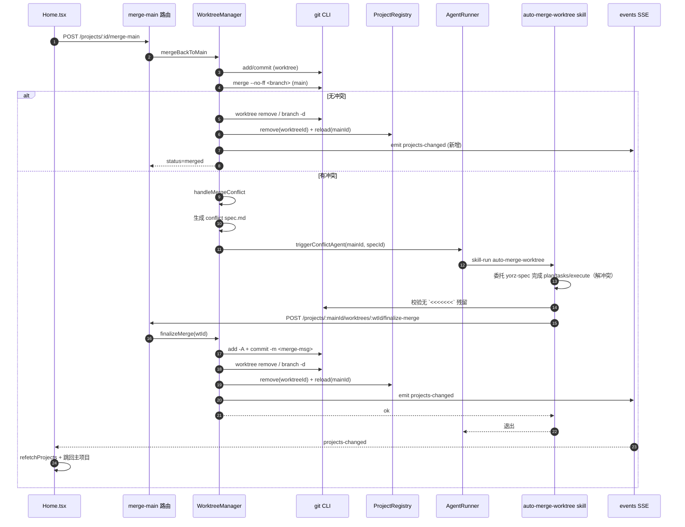

# Spec: worktree 合并主项目全自动收尾 skill

## 1. 背景

> 原始用户需求（按 yorz-spec 规范原样保留）：
>
> `260629.fix.merge-conflict-agent-agent-agent` 该 spec 以 git worktree 实现了项目多任务并行开发；其中，合入主项目功能，如果碰到了代码冲突目前确实创建了 spec，但是没有自动执行 spec，且我手动执行 spec 之后没有自动提交代码，没有自动删除原有的 worktree 项目，没有自动刷新页面更新项目列表；你应该写一个 skill 指导 Agent 自动处理合并主项目的工作流，满足上述的自动化要求。

参考既有 spec：

- `260628.feat.agent-worktree-workflow`（首次落地 worktree 工作流）
- `260629.fix.merge-conflict-agent-agent-agent`（人工解决一次冲突时遗留的样例 spec）

## 2. 需求

- 提供一个新的 skill（暂命名 `auto-merge-worktree`），指导 Agent 在「合入主项目→出现冲突」场景下端到端跑完整个收尾流程，无需用户再补任何手工命令。
- 自动化要点：
  1. 冲突 spec 创建后 **自动拉起 Agent** 并按该 spec 的 plan/tasks/execute 完整推进。
  2. 冲突全部修复且 typecheck/lint（若仓库已配置）通过后，**自动 `git add` + `git commit`** 完成 merge commit。
  3. 提交成功后 **自动移除 worktree 目录、删除 worktree 分支、从全局项目列表清除该 worktree 项目**。
  4. 通知 GUI **自动刷新项目列表**，并在主项目页给出"合并完成"反馈。
- 非目标：
  - 不重构既有 `mergeBackToMain` 的"无冲突成功路径"行为。
  - 不引入新的合并策略（rebase / squash 等）；仍走 `merge --no-ff`。

## 3. 现状分析

### 3.1 当前合入主项目的代码路径

`src/service/worktree-manager.ts:123` 的 `mergeBackToMain` 已经做到了：

- 在 worktree 内 `git add -A` + 有变更则 `git commit`；
- 在主项目内 `git merge --no-ff -m <msg> <branch>`；
- **无冲突** 成功路径：移除 worktree 目录、删除分支、`registry.remove(id)` + `registry.reload(mainProjectId)`，返回 `{ status: 'merged', mergeCommit }`；
- **冲突** 失败路径：进入 `handleMergeConflict`（`worktree-manager.ts:218`），生成 `.yorz/specs/<stamp>.fix.merge-conflict-<branch>/spec.md`，并尝试 `triggerConflictAgent`，未注入时回退到 `runner.run({ specId, mode: 'skill-run', prompt: '请使用 yorz-spec skill 处理 spec：…' })`，再返回 `{ status: 'conflict', conflictSpecId, conflictSpecPath, conflictFiles }`。

GUI（`src/gui/src/pages/Home.tsx:38`）拿到 `conflict` 后跳转到 `/<mainProjectId>/specs/<conflictSpecId>`，由用户在 spec 页面驱动 Agent 解决冲突。

### 3.2 自动化失效的四个断点

| 现象                             | 根因                                                                                                                                                                                                                                                                                                                                                  |
| -------------------------------- | ----------------------------------------------------------------------------------------------------------------------------------------------------------------------------------------------------------------------------------------------------------------------------------------------------------------------------------------------------- |
| ① "没有自动执行 spec"            | `WorktreeManager` 实例化时（`server.ts:23`）未注入 `triggerConflictAgent`，走 fallback：先 `registry.reload(mainProjectId)` 关闭已有 ProjectInstance，紧接着 `getOrCreate` 重建并对 `runner.run(...)` 不 await，结果可能在 watcher 重启完成前就 fire-and-forget；同时 GUI 端只做 `navigate(...)`，不会主动刷新 spec 列表 / 不会高亮"Agent 正在处理"。 |
| ② "没有自动提交代码"             | yorz-spec 通用 skill 的 execute 仅按 `## 任务清单` 执行任务并写回 spec，没有关于"修完冲突后需要 `git add -A` + `git commit` 完成 merge"的指令；冲突 spec 在 `2. 需求` 里甚至显式写着"Agent 不应自行 `git merge --abort`"，强化了 Agent 的保守取向。                                                                                                   |
| ③ "没有自动删除 worktree 项目"   | 冲突分支被分流后 `mergeBackToMain` 立即返回，原本无冲突路径里的 `worktree remove` / `branch -d` / `registry.remove` / `registry.reload` 在冲突路径完全没机会执行。                                                                                                                                                                                    |
| ④ "没有自动刷新页面更新项目列表" | 即使 Agent 最终把冲突修好并提交，service 端缺少一处对"worktree 清理完成"的事件广播；GUI 也没有订阅。Home.tsx 仅在用户手动点"刷新"或重新进入页面时 `refetchProjects()`。                                                                                                                                                                               |

### 3.3 相关代码地标

- `src/service/worktree-manager.ts:218` `handleMergeConflict`：触发 Agent 与返回结构。
- `src/service/worktree-manager.ts:62` `WorktreeManagerOptions.triggerConflictAgent`：可注入但 server 未注入。
- `src/service/server.ts:23` `WorktreeManager` 实例化点。
- `src/service/routes/worktree.ts:55` `POST /api/projects/:projectId/merge-main` 路由。
- `src/gui/src/pages/Home.tsx:38` `onMerge` 处理两种状态返回。
- `src/service/agent.ts:12` `AgentMode = 'skill-run' | 'explain'` 与 skill-run 的 spec→Agent 复用规则。
- `.claude/skills/yorz-spec/` 现有通用 skill 结构，作为命名/拆分参考。

### 3.4 数据流（含本次新增）



## 4. 技术实现方案

> 整体取向：把"解冲突 + commit + 清理"全部交给 Agent 在 conflict spec 内通过 Bash 完成；service 端只补两件事——① 注入 `triggerConflictAgent` 自动拉起 Agent，② 监听 global registry 文件 (`projects.json`) 变更并向新增 SSE 端点广播 `projects-changed`，让 GUI 自动刷新。

### 4.1 yorz-spec 子文档：`.claude/skills/yorz-spec/merge-worktree.md`

不新建独立 skill；以 `merge-worktree.md` 形式挂在既有 yorz-spec 之下，作为冲突 merge 场景的专用子流程入口。

涉及文件：

- **新增** `.claude/skills/yorz-spec/merge-worktree.md` — 主体文档；定义四阶段流程与所需 Bash 命令。
- **更新** `.claude/skills/yorz-spec/SKILL.md` — 在「如何使用本 skill」步骤列表中追加一条「若 spec 含 `## N. 合并上下文` 章节，进入 [merge-worktree](./merge-worktree.md) 子流程」。
- **更新** `.claude/skills/yorz-spec/routing.md` — 在判定第 1 条之前新增最高优先级判定：spec body 含 `## N. 合并上下文` 章节 → 直接转入 `merge-worktree.md`，跳过通用 plan/tasks/execute 判定。

`merge-worktree.md` 四阶段（resume 友好，每次进入根据 spec 当前状态选择起点）：

1. **resolve**（解冲突）：以本 spec 为目标委托给现有 plan/tasks/execute 主链路（即 yorz-spec 自身），直到所有 `- [ ]` 变 `- [x]`、`grep -RIn '<<<<<<<\|=======\|>>>>>>>' <mainPath>` 无结果。期间遇到未决问题或新增 bug 严格按 yorz-spec 已有规则退出，等待用户批注后由用户手动重启 Agent（不做自动恢复）。
2. **finalize**（提交合并 + 清理 worktree）：从 `## 合并上下文` 章节解析参数（`mainProjectId / worktreeProjectId / branch / wtPath / mainPath / mergeCommitMessage`），按顺序 Bash 执行：
   1. `cd <mainPath> && git status --porcelain` 校验存在 `UU/AA/DD` 等未合并条目时回到 resolve 阶段。
   2. `git add -A` → `git commit -m <mergeCommitMessage>`（message 默认为 service 写入的 `feat(<branch>): merge from worktree`；若 spec frontmatter 显式给出 `merge_commit_message:` 字段则以此为准——见 §4.5）。
   3. `git worktree remove <wtPath>`；若残留则 `git worktree remove --force <wtPath>`。
   4. `git branch -d <branch>`。
   5. **直接编辑** global registry 文件（路径来自 `## 合并上下文`，默认 `~/.config/yorz/projects.json`，受 `YORZ_HOME` / `XDG_CONFIG_HOME` 影响）：移除 `id === worktreeProjectId` 的条目；保留其余条目原顺序与字段；以原子写法（写临时文件 → `mv` 覆盖）落盘，避免半成品。
3. **cleanup**（写回 spec）：在 `## 执行记录` 追加一条"已 merge commit `<hash>`、已移除 worktree `<branch>`、已清理 registry 条目 `<id>`"；frontmatter 切到 `stage: execute`、`last_action: 自动收尾完成`、`updated_at: <today>`。
4. **failsafe**（兜底）：finalize 任一步骤失败（commit hook 拒绝、`worktree remove` 报错、registry 文件被外部锁占用等）—— 将原始 stderr 写入 `## 执行记录`，立即退出；**禁止** `git merge --abort` / `git reset --hard` / `git checkout .` 等破坏性兜底；用户修复后重启 Agent，resume 时从尚未完成的步骤继续（每一步执行前先做幂等检查，例如 `git log -1` 是否已是 merge commit、`git worktree list` 是否仍有该 worktree、registry 是否仍含目标 id）。

### 4.2 service 端改造

`src/service/worktree-manager.ts`

- `renderConflictSpec`：在 spec body 顶部插入新章节 `## 1. 合并上下文`，包含一段 ` ```yaml ` 代码块，列出 `mainProjectId / worktreeProjectId / branch / wtPath / mainPath / defaultMergeCommitMessage / globalConfigPath`；后续章节依次重排为 2 背景 / 3 现状分析 / … / 9 执行记录（满足 yorz-spec 章节齐全度与编号规则）。
- `handleMergeConflict`：把调用者已掌握的 `worktreeProjectId / wtPath / mainPath / branch / defaultMergeCommitMessage / globalConfigPath` 一并带入 spec 渲染；fallback 路径删除（不再在未注入 `triggerConflictAgent` 时自行 `runner.run`），改为日志告警 + 仍返回 `status: 'conflict'`（GUI 跳转到 spec 页面后由用户手工启动 Agent 兜底）。

`src/service/server.ts`

- 构造 `WorktreeManager` 时注入 `triggerConflictAgent`：实现内 `await registry.getOrCreate(mainProjectId)` 取到 `ProjectInstance`，调用 `instance.runner.run({ specId, mode: 'skill-run', prompt: '请使用 yorz-spec skill 处理 spec：<specsDirRelative>/<specId>/spec.md' })`；不 await `done`，但确保 `runner.run` 同步返回 handle（现 `AgentRunner.run` 已是同步入口，符合）。

`src/service/registry-events.ts`（**新增**）

- 极薄 EventBus：暴露 `subscribe(cb)` / `emit()` / `start(globalConfigPath)`；`start` 内部 `fs.watch(globalConfigPath, ...)`，debounce 200ms 后 `emit()`。
- 在 `createApp` 中实例化并 `start`，同时通过 `WorktreeManager` 既有的成功路径（`mergeBackToMain` 无冲突分支）显式 `bus.emit()` 兜底（FS watch 在某些 FS 下可能丢事件）。

`src/service/routes/events.ts`

- 新增 `GET /events/projects` SSE 端点（不在 `/projects/:projectId/...` 路径下）：握手后立即 `event: ready`，订阅 `RegistryEventBus`，每次 emit 推一条 `event: projects-changed` data: `{}`；沿用已有 `attachHeartbeat`。

### 4.3 GUI 端改造

`src/gui/src/lib/sse.ts`

- 新增 `subscribeProjectsList(onChange: () => void): () => void`：连接 `/api/events/projects`，监听 `projects-changed` 事件回调 `onChange`。

`src/gui/src/pages/Home.tsx`

- mount 时调用 `subscribeProjectsList(() => refetchProjects())`，组件卸载时取消订阅；refetch 完成后若 `current()` 已不存在且当前页面 URL 仍指向被清理的 worktree 项目，则 `navigate('/<mainProjectId>')` 回退到主项目首页。
- `onMerge` 的 conflict 分支文案改为"冲突 spec 已自动派给 Agent 处理，列表会在合并完成后自动刷新"，保留现有 `navigate` 跳到 spec 页面的逻辑。

### 4.4 与现有 yorz-spec skill 的关系

- `merge-worktree.md` 作为 yorz-spec 的子文档加载；resolve 阶段直接复用 yorz-spec 主链路（plan/tasks/execute），不重复实现。
- conflict spec 借由顶部 `## 1. 合并上下文` 章节驱动 routing：routing 判定首条匹配该章节即转入子流程，避免污染普通 spec 的判定路径。
- 子文档不修改 yorz-spec 的全局硬约束、frontmatter 4 字段约束；新增的合并上下文以 body 章节承载，不写入 frontmatter（保持嵌套禁令）。

### 4.5 边界与回退

- **commit message 覆盖**：默认值由 service 写入 `## 合并上下文` 的 `defaultMergeCommitMessage`；若用户在 conflict spec frontmatter 显式加入 `merge_commit_message:` 字段，merge-worktree.md 优先采用该值。该字段属合并上下文专用扩展，仅在含 `## 合并上下文` 的 spec 上生效；merge-worktree.md 在 finalize 前先尝试读取，缺省则回落到 `defaultMergeCommitMessage`。
- **非冲突类脏改动**：finalize 阶段 `git status --porcelain` 出现非 `UU/AA/DD/AU/UA/DU/UD` 的脏文件时 **忽略**，按 `git add -A` 一并纳入 merge commit（与用户答复一致）。
- **resume**：每次 Agent 进入 spec，根据 `## 任务清单` 完成度判断回到 resolve 或 finalize；finalize 内每一步前置幂等检查（merge commit / worktree / branch / registry 条目存在性），允许在任一步骤失败后被重启续跑。
- **失败留痕**：失败时不破坏现场；`## 执行记录` 追加错误摘要后退出；用户人工修复后自行重启 Agent（不做心跳轮询、不自动 retry）。

## 5. 待确认问题

- 暂无

## 6. 任务清单

- [x] 在 `src/service/worktree-manager.ts` 的 `renderConflictSpec` 内插入 `## 1. 合并上下文` 章节（包含 yaml 代码块字段：`mainProjectId / worktreeProjectId / branch / wtPath / mainPath / defaultMergeCommitMessage / globalConfigPath`），并把后续章节按 yorz-spec 编号规则重排为 2 背景 / 3 现状分析 / 4 技术实现方案 / 5 待确认问题 / 6 任务清单 / 7 追加任务 / 8 执行记录。验收：worktree 触发冲突后，新生成的 conflict spec.md 顶部含完整 yaml 代码块，且通过 yorz-spec 章节齐全度校验。
- [x] 在 `src/service/worktree-manager.ts` 的 `handleMergeConflict` 调用链中把 `worktreeProjectId / wtPath / globalConfigPath / defaultMergeCommitMessage` 透传到 `renderConflictSpec`，并删除未注入 `triggerConflictAgent` 时的 `runner.run` fallback 分支（改为 `console.warn` 日志）。验收：单元测试中不注入 `triggerConflictAgent` 时，`handleMergeConflict` 仍返回 `status: 'conflict'`，但不再调用 `registry.reload` + `getOrCreate` 重启循环。
- [x] 在 `src/service/server.ts` 实例化 `WorktreeManager` 时注入 `triggerConflictAgent` 实现：通过 `opts.registry.getOrCreate(mainProjectId)` 取 `ProjectInstance`，同步触发 `instance.runner.run({ specId, mode: 'skill-run', prompt: '请使用 yorz-spec skill 处理 spec：<specsDirRelative>/<specId>/spec.md' })`。验收：制造一次冲突合并后，`runs` 接口可见对应 specId 的活跃 run，无需用户在 GUI 手动启动。
- [x] 新建 `src/service/registry-events.ts`：导出 `RegistryEventBus` 类，提供 `subscribe(cb): () => void` / `emit()` / `start(globalConfigPath)` 三个方法；`start` 内部 `fs.watch` 全局 registry 文件，带 200ms debounce 调用 `emit()`。验收：手动 `echo {} > projects.json` 后 1s 内订阅者收到一次回调；连续多次写入只触发一次 emit。
- [x] 在 `src/service/server.ts` 的 `createApp` 中实例化 `RegistryEventBus` 并调用 `start(registry.configPath())`；把 bus 注入到 `WorktreeManager`，并在 `mergeBackToMain` 无冲突成功路径 `registry.remove + reload` 完成后显式 `bus.emit()` 兜底。验收：无冲突合并完成后立刻广播一次 `projects-changed`（不依赖 FS watch 时延）。
- [x] 在 `src/service/routes/events.ts` 增加 `GET /events/projects` SSE 端点：握手 `ready` + 复用 `attachHeartbeat`，订阅 `RegistryEventBus`，每次 emit 写一条 `event: projects-changed` data `{}`；订阅注入通过 `createEventsRoutes` 入参传入。验收：`curl -N /api/events/projects` 在 registry 变化时收到 `event: projects-changed` 行。
- [x] 新建 `.claude/skills/yorz-spec/merge-worktree.md`：定义 resolve / finalize / cleanup / failsafe 四阶段流程；显式列出每步 Bash 命令模板与幂等检查（merge commit 是否已存在 / worktree 是否仍在 / branch 是否仍在 / registry 是否仍含 id）；强调 `git add -A` 吞掉非冲突脏改动、读取 `merge_commit_message` frontmatter 覆盖默认值、registry 原子写法（写临时文件 → `mv`）。验收：文档自检——按文档逐步可在终端复现完整收尾流程，无需任何 service API。
- [x] 更新 `.claude/skills/yorz-spec/SKILL.md` 与 `routing.md`：SKILL 步骤列表追加 merge-worktree 引用；routing.md 在判定第 1 条之前新增最高优先级判定「spec body 含 `## N. 合并上下文` 章节 → 转入 `merge-worktree.md`」。验收：把含合并上下文章节的 spec 喂给 routing 判定时优先命中新规则。
- [x] 在 `src/gui/src/lib/sse.ts` 新增 `subscribeProjectsList(onChange)`：连接 `/api/events/projects`，监听 `projects-changed` 事件并回调；返回与既有 `subscribeSpecsList` 同形态的清理函数。验收：mock EventSource 后收到 `projects-changed` 事件能触发回调一次。
- [x] 在 `src/gui/src/pages/Home.tsx` 的 mount 生命周期内调用 `subscribeProjectsList(() => refetchProjects())`，组件卸载时取消订阅；refetch 完成后若 `current()` 已不存在且当前路由仍指向被清理的 worktree id，则 `navigate('/<mainProjectId>')` 回退主项目首页；同时把 `onMerge` conflict 分支的 toast 文案改为"冲突 spec 已自动派给 Agent 处理，列表会在合并完成后自动刷新"。验收：手工触发一次冲突合并 → Agent 跑完后主项目首页项目列表自动刷新且无 worktree 残留。
- [ ] 端到端手测：在 worktree 项目内构造与主项目冲突的修改 → 在 GUI 点「合入主项目」→ 验证（a）conflict spec 自动出现 Agent run、（b）冲突解决后 Agent 自行 git commit + 移除 worktree + 清理 registry、（c）主项目 GUI 项目列表无需手动刷新即丢掉该 worktree 条目、（d）conflict spec 末尾 `## 执行记录` 留下 merge commit hash 与清理日志。验收：以上 4 项全部命中。

## 7. 追加任务

- 暂无

## 8. 执行记录

- 2026-06-29 新建 spec 并完成 plan 初稿：拆解 4 个自动化断点、给出新 skill 目录结构与 service/GUI 改造点、列 6 个待确认问题（5 个候选项 + 1 个自由文本），等待用户在 `## 待确认问题` 中以 `！！！` 批注表态后再推进 tasks 阶段。
- 2026-06-29 整合用户批注、改写 §4 技术方案、产出 11 条任务：方案改为「在 yorz-spec 下新增 merge-worktree.md 子文档 + service 注入 triggerConflictAgent + 新增 RegistryEventBus + `/events/projects` SSE + GUI 订阅项目列表变更」，不再新增 finalize-merge service API；merge_commit_message 通过 conflict spec frontmatter 可覆盖；非冲突类脏改动统一 `git add -A` 吞入 merge commit；resume 由用户手动重启 Agent。下一阶段进入 execute。
- 2026-06-29 execute 阶段完成任务 1-10：
  - service：`worktree-manager.ts` 重写 `renderConflictSpec` 注入 `## 1. 合并上下文` yaml 块（mainProjectId/worktreeProjectId/branch/wtPath/mainPath/defaultMergeCommitMessage/globalConfigPath），并把章节重排为 1 合并上下文 / 2 背景 / 3 现状分析 / 4 技术实现方案 / 5 待确认问题 / 6 任务清单 / 7 追加任务 / 8 执行记录（原 `## 2. 需求` 因 §3.2 已指出其内容反向引导 Agent 而删除）；`handleMergeConflict` 透传新参数并删除 `runner.run` fallback；`mergeBackToMain` 成功路径新增 `onProjectsChanged?.()` 回调。
  - service：新建 `registry-events.ts` 提供 `RegistryEventBus`（watch dir + 200ms debounce，原子写友好）；`server.ts` 在 `createApp` 实例化 bus + start + 通过 `onProjectsChanged` 注入 WorktreeManager + 在 `triggerConflictAgent` 通过 `runner.run` 拉起 Agent；`routes/events.ts` 新增顶层 `GET /events/projects` SSE 端点（不在 `/projects/:id` 之下，避开 Hono 动态参数路径冲突），通过 createEventsRoutes 第 3 入参注入 bus。
  - skill：新建 `.claude/skills/yorz-spec/merge-worktree.md`（resolve / finalize / cleanup / failsafe 四阶段，含每步幂等检查与 Bash 命令模板）；`SKILL.md` 步骤列表追加 merge-worktree 引用；`routing.md` 在判定第 1 条新增最高优先级「含 `## N. 合并上下文` → 转入 merge-worktree.md」。
  - GUI：`sse.ts` 新增 `subscribeProjectsList`；`Home.tsx` 在 `onMount` 订阅项目列表变更 → 自动 `refetchProjects()`，若当前路由指向已被清理的 worktree 则回退到 `previousMainId`；`onMerge` 冲突分支文案改为"冲突 spec 已自动派给 Agent 处理，列表会在合并完成后自动刷新"。
  - 验证：`npx vitest run` 191/191 通过；`npx tsc --noEmit` 仅余一项无关本次改动的旧错（`src/gui/src/components/QuestionConfirmPanel.tsx:46`）；`npx prettier --write` 全部 unchanged。
- 2026-06-29 任务 #11 端到端手测因当前 headless 环境无 GUI 无法自动执行，保持未勾选；建议用户在本地 dev 环境按任务描述四点验收。
