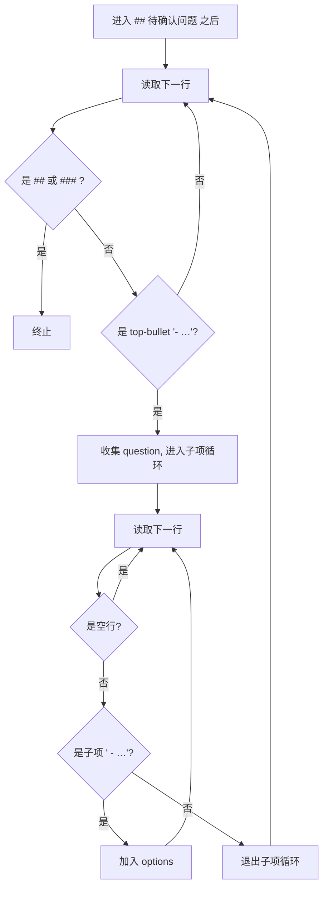

# 修复待确认问题解析缺陷

## 1. 背景

用户反馈 GUI 待确认问题清单 UI 存在两个解析缺陷：

1. 生成待确认问题清单的 UI，应该忽略已确认决策内容。例如下方 spec 片段中，`### 5.1 已确认决策快照` 不应该被渲染到 UI：

   ```md
   ## 5. 待确认问题

   - worktree 项目 Home 页 worktree-bar 中「主项目：<mainPath>」这条信息，去掉 worktree 技术词汇后是否继续展示？
     - 完全移除，仅留「合入主项目」按钮 + 状态提示
     - 改为「主项目：<mainBasename>」（只展示路径末段，保留辨识度，不暴露绝对路径） (推荐)
     - 保留当前完整绝对路径

   ### 5.1 已确认决策快照

   - worktree 目录：<mainPath>/../<mainBasename>.wt/<branch>。
   - 分支命名：wt/<spec-summary-name>，重名追加 -2/-3。
   - 主项目合并方式：git merge --no-ff <branch>。
   - 冲突相关 spec 定位：仅按 git log 文件历史（30 天窗口），不依赖 touched-files.json。
   - 主项目自动更新：等同 merge 动作本身，不额外 git pull。
   - commit message：默认 feat(<branch>): merge from worktree，弹窗内可编辑。
   - 侧栏视觉：扁平 + worktree 项目名后追加 ⎇ main badge。
   - 冲突解决 spec：落在主项目 .yorz/specs/，type=fix，自动启动 Agent。
   ```

2. 如果问题描述与候选方案之间存在空行，UI 无法渲染出候选方案，只会渲染待确认问题与一个输入框，例如：

   ```md
   - 问题

     - 候选A
     - 候选B
   ```

## 2. 需求

- 解析 `## 待确认问题` 章节时，遇到 `### N.M 已确认决策快照` 等子标题应停止扫描，**仅**把子标题之前的内容视为可批注问题。
- 问题正文与候选子项之间存在 1 个或多个空行时，候选子项仍应被正确识别为该问题的候选项，而不是被丢弃、问题被错误降级为 freeform。
- 修复仅限解析层，UI 渲染组件 `QuestionConfirmPanel` 不需要改造；同时补充单元测试覆盖两类回归。

## 3. 现状分析

### 3.1 相关代码与既有测试

- 解析入口：`src/gui/src/lib/question-parse.ts` 的 `parseConfirmQuestions(body)`，位于 line 29-83。
- 渲染组件：`src/gui/src/components/QuestionConfirmPanel.tsx`，消费 `ConfirmQuestion[]` 结构，按 `isFreeform` 与 `options` 决定是否渲染候选 radio 或自由文本输入框。
- 单元测试：`src/gui/src/lib/__tests__/question-parse.test.ts`，已覆盖：`- 暂无`、`(推荐)` 校正、`（自由文本）` 后缀、停止于下一 `##` 标题、stable id 等。

### 3.2 Bug 1：`### 5.1 已确认决策快照` 内容污染问题清单

`parseConfirmQuestions` 的扫描循环仅在遇到 `NEXT_H2_RE = /^##\s+/`（即下一个 `## ` 二级标题）时 `break`（question-parse.ts:39）。`### 5.1` 这类三级子标题不会触发终止，导致：

- 三级子标题行 `### 5.1 已确认决策快照` 自身无 `- ` 前缀，被静默跳过，不致命；
- 但其下的 `- worktree 目录：…`、`- 分支命名：…` 等列表项均满足顶层 `matchTopBullet` 规则（line 85-89），被误判为「新的待确认问题」并随 freeform 输入框一并渲染到 GUI；
- 已实际出现在 `.yorz/specs/260628.feat.agent-worktree-workflow/spec.md` line 287-304 的真实文档结构上。

### 3.3 Bug 2：问题与候选之间空行导致候选丢失

`parseConfirmQuestions` 进入子项匹配循环后（line 53-69），对每一行调用 `matchSubBullet`（`/^(?:\s{2,}|\t+)-\s+(.*\S)\s*$/`，line 91-95）；正则要求行尾不为空，**空行返回 `null` → `break`**，跳出子项循环。后续：

- 该问题 `options.length === 0` → `isFreeform: true`（line 79）；
- 空行之后的 `  - 候选A` / `  - 候选B` 因含 2 个前导空格，**也不会**匹配外层 `matchTopBullet`（`/^-\s+/`，line 85-89），在外循环中被静默跳过；
- 净结果：用户撰写「`- 问题\n\n  - 候选A\n  - 候选B`」时，UI 仅渲染一个自由文本输入框，丢失所有候选项。

### 3.4 影响范围

- 直接受影响：GUI 待确认问题清单组件 `QuestionConfirmPanel`、其消费方 `ConfirmPanel` / `pending-questions-split-view` 系列页面。
- 间接受影响：CLI / Service 端不依赖此解析器（spec-store 端按章节存读），所以仅 GUI 侧需要修复。
- 无 schema 变化、无 API 变化、无 storage 迁移。

### 3.5 数据流总览

```mermaid
flowchart LR
  A[spec.md 全文] --> B[parseConfirmQuestions]
  B --> C[ConfirmQuestion[]]
  C --> D[QuestionConfirmPanel]
  D --> E{每条 question}
  E -->|options.length>0 且非 freeform| F[渲染 radio 候选]
  E -->|isFreeform 或无候选| G[渲染自由文本输入框]
  subgraph 当前缺陷
    B -.Bug1.-> H[误把 ### 5.1 下的 - 当成问题]
    B -.Bug2.-> I[空行截断候选, options=0 → freeform]
  end
```

## 4. 技术实现方案

### 4.1 修复 Bug 1：扫描终止条件加入「任意三级标题」

把外层循环的终止条件从「遇到下一个 `## `」扩展为「遇到下一个 `## ` **或** `### `」。即新增正则 `NEXT_HEADING_RE = /^#{2,3}\s+/`，扫描循环在遇到该正则时即 `break`。

理由：

- 待确认问题章节本身就不应包含子小节；按现有约定，`### 5.1 已确认决策快照` 等子节用于「已敲定决策的快照展示」，属于辅助归档，与「待用户批注」的语义互斥。
- 把所有 `### ` 都视为终止符，比按文本匹配 `已确认决策快照` 更稳健，能兼容未来其它命名的归档子节。
- skill 文档 [`conventions.md`](.claude/skills/yorz-spec/conventions.md) 中要求二/三级标题统一编号，不会出现 `### ` 子节作为「问题分组」的用法，因此不存在误伤。

### 4.2 修复 Bug 2：子项循环允许空行透传

把子项匹配循环中遇到「空行」的行为从 `break` 改为 `continue`：

- 新增 `BLANK_LINE_RE = /^\s*$/`，在 `matchSubBullet` 返回 `null` 之前先判断当前行是否为空行；
- 若空行：`i += 1; continue`，不终止子项收集；
- 若非空且非子项：保持原 `break` 行为，避免误吞下一条 top-level 问题。

边界处理：

- 多个连续空行均被透传，不影响计数；
- 子项循环结束后回到外循环，**下一行**继续判定是否为新的 top-bullet 或终止标题。
- 若某问题最后一个候选项之后跟随大量空行 + 下一 top-bullet，下一 top-bullet 会被正确识别为新问题（因为外循环 `matchTopBullet` 不要求前置非空行）。

### 4.3 兼容性与回归保证

- 现有「`- 暂无` → `[]`」、「`(推荐)` 多个时仅首个保留」、「`（自由文本）` 后缀」逻辑均不动；
- 现有「stable id」「stops at next `##` heading」测试继续通过；
- 新增两组单元测试 fixture：
  - fixture A：`## 待确认问题` 下 1 条正常问题 + 紧跟 `### 5.1 已确认决策快照` 子节（含若干 `- ` 列表项），断言仅返回 1 条问题；
  - fixture B：`- 问题\n\n  - A\n  - B (推荐)`，断言返回 1 条问题、`options.length === 2`、推荐项命中 `B`、`isFreeform === false`；额外加一组多空行变体 `- 问题\n\n\n  - A\n\n  - B`，断言行为一致。

### 4.4 文档/约定更新

- 不修改 `conventions.md`；空行兼容属于解析器健壮性提升，约定本身仍鼓励紧凑列表。
- 在 `question-parse.ts` 顶部 JSDoc 增补一句：扫描在下一 `##` 或任意 `### ` 标题处终止；问题与候选之间允许空行。

### 4.5 解析流程时序



## 5. 待确认问题

- 暂无

## 6. 任务清单

- [x] 修改 `src/gui/src/lib/question-parse.ts`：新增 `NEXT_HEADING_RE = /^#{2,3}\s+/` 并将外层扫描循环的终止条件从 `NEXT_H2_RE` 切换为 `NEXT_HEADING_RE`；验收点：扫描遇到 `### ` 子标题立即 break，不再吸入其下列表项。
- [x] 修改 `src/gui/src/lib/question-parse.ts` 子项循环：识别空行（`/^\s*$/`）时 `i += 1; continue`，仅在「非空且非子项」行 `break` 退出；验收点：`- 问题\n\n  - A\n  - B` 能解析出 2 个候选项且 `isFreeform === false`。
- [x] 在 `src/gui/src/lib/question-parse.ts` 顶部 JSDoc 增补一句：扫描在下一 `##` 或任意 `### ` 标题处终止；问题正文与候选子项之间允许空行。
- [x] 在 `src/gui/src/lib/__tests__/question-parse.test.ts` 新增 fixture A 用例：`## 待确认问题` 下 1 条正常问题 + `### 5.1 已确认决策快照` 子节含若干 `- ` 列表项，断言 `parseConfirmQuestions` 仅返回 1 条问题、其 `options` 不含子节列表项。
- [x] 在 `src/gui/src/lib/__tests__/question-parse.test.ts` 新增 fixture B 用例：`- 问题\n\n  - A\n  - B (推荐)` 断言 `options.length === 2`、推荐项命中 `B`、`isFreeform === false`；再加多空行变体 `- 问题\n\n\n  - A\n\n  - B` 断言行为一致。
- [x] 运行 GUI 单元测试套件覆盖 `question-parse`（如 `cd src/gui && pnpm test question-parse` 或仓库实际命令），断言全部用例通过。

## 7. 追加任务

- 暂无

## 8. 执行记录

- 2026-06-30 新建 spec，初始化骨架并完成 plan 阶段的现状分析、技术实现方案与待确认问题；阻塞于 4 项待确认问题待用户批注。
- 2026-06-30 消费 4 项 `！！！` 批注（均采纳推荐方案，与既有技术实现方案一致，无新增冲突/歧义），将 `## 待确认问题` 收敛为 `- 暂无`，按技术实现方案拆解为 6 条可执行任务并切换 stage→tasks，删除 `## 用户批注` 章节。
- 2026-06-30 在 `src/gui/src/lib/question-parse.ts` 完成 Bug 1 / Bug 2 修复：① 把外层扫描终止常量从 `NEXT_H2_RE` 改为 `NEXT_HEADING_RE = /^#{2,3}\s+/`，使任何 `### ` 子标题（含 `### N.x 已确认决策快照`）立即终止扫描；② 子项循环新增 `BLANK_LINE_RE = /^\s*$/` 透传分支，空行 `continue` 不再 `break`，仅在「非空且非子项」行退出；③ 顶部 JSDoc 增补说明。
- 2026-06-30 在 `src/gui/src/lib/__tests__/question-parse.test.ts` 新增 3 条用例：① `### 5.1 已确认决策快照` 子节列表项被忽略；② `- 问题\n\n  - A\n  - B (推荐)` 正确解析出 2 个候选项、推荐项命中 `B`、`isFreeform === false`；③ 多空行变体行为一致。`cd src/gui && npx vitest run src/lib/__tests__/question-parse.test.ts` 通过，12/12 用例全绿（原 9 + 新增 3）。spec stage → execute、所有任务勾选完成。
