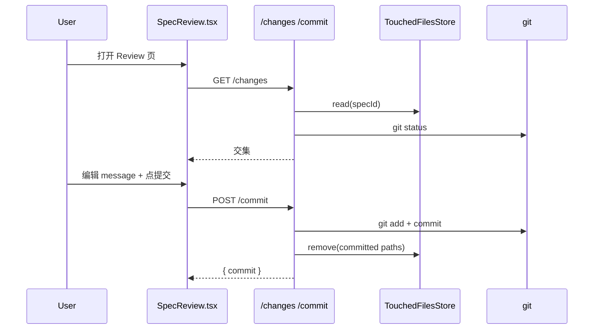
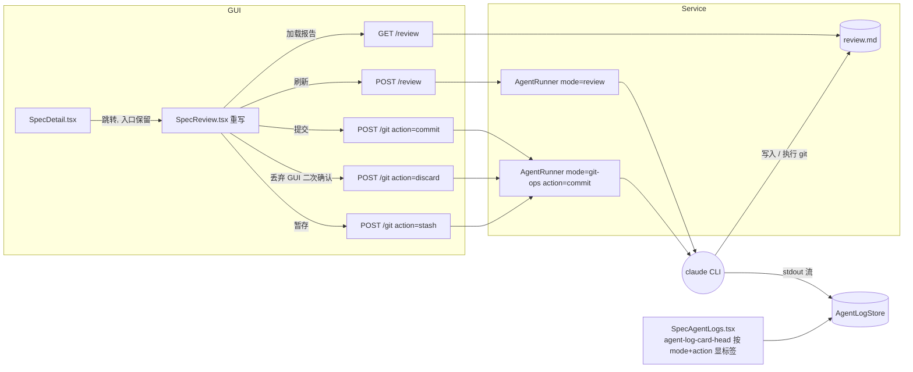

# Agent-driven Review Workflow

## 1. 背景

用户原始需求（原文照录，便于追溯）：

> 重新实现 spec review 工作流，替代当前简化的 review、提交功能，移除 touched-files.json 相关逻辑；
>
> GUI 中 spec 详情页 review 按钮入口保持不变，新建 yorz skill 指导 Agent，参考 spec 文档对当前变更的 git 代码进行 review，重点在于变更总结、变更影响范围、风险提醒、变更文件清单；
> Agent 的 review 结果输出到 review.md 文档中，跟 spec.md 平级；
> 一个 spec 文档可能触发多次 review 动作，每一次 review 写入一个二级标题条目内容到 review.md 文档中, 附加 review 触发时间；
>
> 在 review 界面中，用户可以触发的操作有：刷新（Agent 重跑 review 指令）、提交（触发 Agent 提交当前 spec 相关联的 git 文件）、丢弃（触发 Agent 丢弃变更，须二次提醒）、暂存变更（触发 Agent git stash 相关变更文件）。
>
> agent-logs 功能，日志 header（agent-log-card-head）中，添加标签 Review / GitCommit / GitDiscard / GitStash。

相关历史 spec：[[260619.feat.review-page]]（首版 Review 入口，引入 touched-files + 一键 commit）、[[260630.refct.review-commit-msg-remove-scope]]（commit message 不再带 scope）。

## 2. 需求

1. 删除"基于 touched-files 的 review/commit"路径，包括存储层、路由层、GUI 层与对应测试；磁盘上既存的 `touched-files.json` 残留作历史归档，不主动删除。
2. 保留 spec 详情页 `Review` 入口（`src/gui/src/pages/SpecDetail.tsx` 中 `review-link`）不变，跳转目标页（`SpecReview`）整体重写。
3. 新增由 Agent 驱动的 review 流程：
   - 在既有 `yorz-spec` skill 内新增 "Review / Git Ops 阶段说明"，指导 Agent 读取 `<spec_path>` + 当前 git 变更，输出结构化报告。
   - 报告写入与 spec.md 平级的 `review.md`，每次新增一个二级标题（含触发时间），不覆盖历史。
   - 报告必含 4 节：变更总结 / 影响范围 / 风险提醒 / 变更文件清单。
4. Review 页面用户操作：
   - 刷新：再次触发 review Agent。
   - 提交：触发 Agent 执行 git commit。
   - 丢弃：触发 Agent 执行 git 丢弃，**仅 GUI 端二次 confirm**，service 不再校验 `confirmed` 字段。
   - 暂存变更：触发 Agent 执行 `git stash`。
   - 四个动作均**不限制并发**，每次触发都分配独立 `runId`，dock 列表与 agent-logs 独立呈现。
5. agent-logs 列表项的 `agent-log-card-head` 渲染对应英文 PascalCase 标签：`Review` / `GitCommit` / `GitDiscard` / `GitStash`（与既有 `skill-run` / `explain` 共存）。

## 3. 现状分析

### 3.1 touched-files 链路（待删除）

- 存储：`src/service/touched-files.ts`（`TouchedFilesStore`）+ `src/service/__tests__/touched-files.test.ts`。
  - 数据落盘：`.yorz/specs/<id>/touched-files.json`。
- 注入点：`src/service/project-registry.ts:181` `new TouchedFilesStore(...)`，并通过 `AgentRunner` 的 `touched` 选项注入。
- 信号源：`src/service/agent.ts` 中 `WRITE_TOOL_NAMES`（`Write`/`Edit`/`MultiEdit`/`NotebookEdit`）→ `emitTouchedFromEvent` → `file_touched` 事件 → `TouchedFilesStore.add`。
- 路由消费：`src/service/routes/specs.ts`
  - `GET /projects/:pid/specs/:id/changes`（行 186–200）：交集 `touched ∩ git status`。
  - `POST /projects/:pid/specs/:id/commit`（行 202–263）：基于 touched 列表挑选 paths → `git add` + `git commit` + 写入 `## 执行记录`，commit message 自动追加 `[spec:<id>]` 锚点。
- GUI 消费：`src/gui/src/pages/SpecReview.tsx`（120+ 行）+ `src/gui/src/lib/api.ts:220-232`（`listSpecChanges` / `commitSpecChanges`）+ `request<GitChange[]>` 类型。
- 历史脏数据：当前仓库已有多个 spec 目录残留 `touched-files.json`（如 `260629.feat.agent-run-log-persistence/touched-files.json`）—— 决策保留不动。

### 3.2 Agent / AgentMode / agent-log 现状

- `AgentMode = 'skill-run' | 'explain'`（`src/service/agent.ts:12`）。
- `AgentRunner.run({ specId, mode, prompt })` 启动 claude 子进程，按模式串流标准输出 / 写日志。
  - `skill-run` 对同一 specId 做去重（`skillRunBySpec`）。
  - 当前 `explain` 仅用于 spec 详情页"选中→解释"。
- `AgentLogStore`（`src/service/agent-log-store.ts`）按 `specId / runId` 落盘 `.log` + `.json`，meta 字段含 `mode`。
- 路由：`src/service/routes/agent-logs.ts` 提供 `GET /agent-logs` 与 `GET /agent-logs/:runId`。
- GUI：`src/gui/src/pages/SpecAgentLogs.tsx` 的 `LogCard.agent-log-card-head` 渲染 `<span class="agent-log-mode mode-${meta.mode}">{meta.mode}</span>`。

### 3.3 现有 SpecReview 页面行为（待重写）

- 仅展示 `change-list` 与 `commit-message textarea`，无 review 内容、无丢弃/暂存。
- `buildDefaultMessage` 根据 specId 推断 `feat|refct|fix` 前缀（已被 [[260630.refct.review-commit-msg-remove-scope]] 规范化，新方案下应由 Agent 自主生成）。

### 3.4 现有 skill 现状

- `src/skill/yorz-spec/SKILL.md` + 子文档（`plan.md` / `tasks.md` / `execute.md` / `new-spec.md` / `rewrite-rules.md` / `mermaid.md` / `routing.md` / `conventions.md`）。
- 未提供"review / git 操作"指引；当前 review 完全是 service 端逻辑。

### 3.5 端到端时序（现状）



## 4. 技术实现方案

### 4.1 总体改造视图



### 4.2 服务端（src/service）

- **删除**
  - `src/service/touched-files.ts` 及其测试。
  - `ProjectInstance.touched` 字段；`project-registry.ts` 内 `new TouchedFilesStore` 注入。
  - `AgentRunner` 构造选项 `touched`、`emitTouchedFromEvent` / `WRITE_TOOL_NAMES` / `file_touched` 事件链路（无其他消费者）。
  - `src/service/routes/specs.ts` 中 `GET /changes` / `POST /commit` 两个 handler + 相关 helper（`ensureSpecAnchor` / `parseCommitBody`）。
  - `src/service/__tests__/touched-files.test.ts` 与 `service.test.ts` / `agent.test.ts` 中所有 touched / commit 用例。

- **新增 AgentMode 与 Runner 行为**
  - `AgentMode` 扩展为 `'skill-run' | 'explain' | 'review' | 'git-ops'`（4 种）。
  - `git-ops` 通过额外 `action: 'commit' | 'discard' | 'stash'` 字段区分子动作；`RunAgentInput` 与 `AgentRunHandle` / `ActiveRunInfo` / log meta 均落盘可选 `action`。
  - `AgentRunner.run` 不复用 `skill-run` 的"按 spec 去重"；4 个新动作均**允许并发**，每次都分配新 runId。
  - 日志写入复用 `AgentLogStore`，meta.mode + meta.action 自动落盘。

- **新增 Routes**（建议放 `src/service/routes/spec-review.ts` 单独成文件）
  - `POST /projects/:pid/specs/:id/review` → 起 `mode='review'` Agent，prompt 引用 `<specsDirRelative>/<id>/spec.md` + 指明输出到 `<specsDirRelative>/<id>/review.md`。
  - `POST /projects/:pid/specs/:id/git`（body `{ action: 'commit' | 'discard' | 'stash' }`）→ 起 `mode='git-ops'` Agent，prompt 按 action 拼装；**不校验 confirmed**。
  - `GET /projects/:pid/specs/:id/review` → 直接读取 `review.md` 文本（不存在时返回空字符串）。

- **review.md 文档结构**（由 Agent 维护，service 仅读取 / 不解析）

  ```markdown
  # Review · <spec-id>

  ## 2026-06-30 14:23:01

  ### 变更总结

  ### 影响范围

  ### 风险提醒

  ### 变更文件清单
  ```

  每次 review 追加一段；时间使用 spec frontmatter 已采用的 `YYYY-MM-DD HH:mm:ss` 形式（与 [[260629.feat.agent-run-log-persistence]] 一致）。

### 4.3 GUI（src/gui/src）

- **`SpecReview.tsx` 整体重写**：双区布局
  - 顶部按钮区：刷新 / 提交 / 丢弃 / 暂存。
    - 丢弃按钮点击 → 弹 `window.confirm()` 二次提醒；service 端不再校验。
    - 任一按钮触发后调用对应 API；调用成功后通过 `agentTasks.start(...)` 注册 dock 进度，mode 字段填入新值。
  - 主区：渲染 `review.md`（Markdown 渲染复用 `renderMarkdown`）；右上角小提示展示最近一次 review 时间。
- **`api.ts` 改造**
  - 删除 `listSpecChanges` / `commitSpecChanges` / `GitChange` / `CommitBody` 类型（若无其它引用）。
  - 新增 `triggerReview` / `gitOp(action)` / `getReview`，git 系列统一 POST `/git` 带 action 参数；review 与 git 系列统一返回 `{ runId }` 以便 dock 跟踪。
- **`SpecAgentLogs.tsx` 标签**
  - 新增 `MODE_LABELS` 渲染逻辑：基于 `meta.mode` + `meta.action` 组合得出 `Run / Explain / Review / GitCommit / GitDiscard / GitStash`；未知组合回落到 `meta.mode`。
  - 在 `.agent-log-card-head` 内将原 `{meta.mode}` 替换为标签函数返回值，并保留 `mode-${meta.mode}`/`mode-${meta.mode}-${meta.action}` 类名以便 CSS 上色。
- **样式**：`src/gui/src/styles.css` 为新 mode 增加 `.mode-review` / `.mode-git-ops` / `.mode-git-ops-commit` 等小色块；review 页布局沿用 `page` / `detail-head` 结构。

### 4.4 Skill（src/skill）

不新建独立 skill。**在既有 `src/skill/yorz-spec/` 中新增 [review.md](./review.md) 文档**，并在 `SKILL.md` 的"如何使用本 skill"列表里追加引用：

```markdown
7. 当 Agent 以 mode=review / git-ops 启动时（service 端拉起），按 [Review / Git Ops 阶段说明](./review.md) 执行；不进入 plan/tasks/execute 状态机。
```

`review.md` 关键约束（节选）：

- mode=review：读取 `<spec_path>` 与 `git status/diff`，把结构化报告 **追加** 到同目录 `review.md`（不覆盖历史条目；新增二级标题为 `## YYYY-MM-DD HH:mm:ss`）。
- mode=git-ops + action=commit：基于 review 报告与 `git status`，**由 Agent 自主决定**提交哪些 spec 相关变更文件；commit message 由 Agent 生成，不带 scope（遵循 [[260630.refct.review-commit-msg-remove-scope]]）。
- mode=git-ops + action=discard：使用 `git restore --staged --worktree -- <paths>` + 必要时 `git clean -fd -- <paths>`；对 untracked 文件须在 review 报告中显式列出；**不**预先 stash 备份（遵循用户显式意图，更轻）。
- mode=git-ops + action=stash：使用 `git stash push -m "yorz:<spec-id>" -- <paths>`。
- 通用：禁止 `git push` / `git reset --hard` / 修改任何已提交历史。

skill 安装路径由 `src/cli/install.ts` 拷贝（与现有 `yorz-spec` 同机制）。

### 4.5 旧数据清理

- 仓库内已有 `touched-files.json` 在 spec 目录中：**保留**作历史归档，仅停止写入路径（TouchedFilesStore 删除后自然不再产生新文件 / 修改旧文件）。无需迁移脚本。

### 4.6 测试策略

- 单元：新增 `spec-review.test.ts` 覆盖 3 个新 route 的参数校验与 Runner 调用；删除 touched 测试。
- 集成：手动启 `pnpm dev` 验证 Review 页 4 个动作 → agent-logs 出现对应标签 → review.md 追加 → git 状态变化。
- 旧 review 页快照 / 测试同步删除。

## 5. 待确认问题

- 暂无

## 6. 任务清单

- [x] 扩展 `src/service/agent.ts` 的 `AgentMode` 为 `'skill-run' | 'explain' | 'review' | 'git-ops'`；`RunAgentInput` 加可选 `action`；`AgentRunHandle` / `ActiveRunInfo` / log meta 透传 `action`；删除 `WRITE_TOOL_NAMES` / `emitTouchedFromEvent` / `touched` 选项与 `file_touched` 事件链路。
- [x] 删除 `src/service/touched-files.ts` 与 `src/service/__tests__/touched-files.test.ts` 文件；磁盘上既存 `touched-files.json` 保留不动。
- [x] 修改 `src/service/project-registry.ts`：删除 `new TouchedFilesStore` 实例化、`ProjectInstance.touched` 字段、向 `AgentRunner` 传 `touched` 的注入。
- [x] 删除 `src/service/routes/specs.ts` 中 `GET /projects/:projectId/specs/:id/changes`、`POST /projects/:projectId/specs/:id/commit` 两个 handler 与相关 helper（`ensureSpecAnchor` / `parseCommitBody`）；同步清理 `src/service/__tests__/service.test.ts` 中相关用例。
- [x] 新建 `src/service/routes/spec-review.ts`，导出 `createSpecReviewRoutes(resolveProject)`，挂载到 service 主路由：实现 `POST /projects/:projectId/specs/:id/review`、`POST /projects/:projectId/specs/:id/git`（校验 action 取值）、`GET /projects/:projectId/specs/:id/review`；前两者调用 `runner.run({ specId, mode, prompt, action })` 并返回 `{ runId }`，最后一个读取 review.md 文本（不存在返回空字符串）。
- [x] 新建 `src/skill/yorz-spec/review.md`，详述 review / git-ops 阶段的输入、`review.md` 追加规则、4 个 git 操作约束（不带 scope、不 stash 备份、不允许 push / reset --hard）；在 `src/skill/yorz-spec/SKILL.md` 的"如何使用本 skill"列表新增第 7 条引用 `review.md`；`src/skill/yorz-spec/index.json` 同步登记 review 模块。
- [x] 重写 `src/gui/src/pages/SpecReview.tsx`：顶部按钮（刷新 / 提交 / 丢弃[`confirm`] / 暂存）+ 主区 Markdown 渲染 review.md（复用 `renderMarkdown`）；右上角显示最近一次 review 时间；每次按钮触发后调用 `agentTasks.start(...)` 注册 dock 进度。
- [x] 改造 `src/gui/src/lib/api.ts`：删除 `listSpecChanges` / `commitSpecChanges` / `GitChange` / `CommitBody` 等 export；新增 `triggerReview(projectId, specId)` / `gitOp(projectId, specId, action)` / `getReview(projectId, specId)`，前两者返回 `{ runId }`，最后一个返回 `{ text }`；`AgentLogMeta` 增加可选 `action`，`AgentLogMode` 扩展。
- [x] 修改 `src/gui/src/pages/SpecAgentLogs.tsx`：新增 `agentTagLabel(meta)` / `modeClassName(meta)`，根据 (mode, action) 组合得出 `Run` / `Explain` / `Review` / `GitCommit` / `GitDiscard` / `GitStash`；替换 `.agent-log-card-head` 内 `{meta.mode}` 渲染，保留 `mode-${meta.mode}` 类名并按需追加 `mode-${meta.mode}-${meta.action}`。
- [x] 调整 `src/gui/src/styles.css`：为 `.mode-review` / `.mode-git-ops` / `.mode-git-ops-commit` / `.mode-git-ops-discard` / `.mode-git-ops-stash` 增加色块样式；旧 `.mode-skill-run` / `.mode-explain` 保持；移除已不再使用的 `.review-changes` / `.review-commit` / `.change-list` 等样式，新增 `.review-actions` / `.review-body`。
- [x] 在 `src/service/__tests__/` 增加 `spec-review.test.ts` 覆盖 3 个新 route 的参数校验（action 非法 → 400）与 Runner 调用。`pnpm test` 全部 26 个文件、203 个用例通过。

## 7. 追加任务

- 暂无

## 8. 执行记录

- 2026-06-30 21:50：新建 spec，完成 plan 阶段，待确认问题已列出，等待用户批注后再进入 tasks。
- 2026-06-30 21:52：消费用户对全部 8 个待确认问题的批注。决策：4 个动作合并为 `git-ops` mode（action 参数区分）；review 指引并入 `yorz-spec` skill（新增 `review.md`）；提交范围由 Agent 自主决定；丢弃仅 GUI 端 confirm；不限并发；不预先 stash 备份；保留旧 `touched-files.json` 残留；agent-logs 标签沿用英文 PascalCase。已更新 4.2 / 4.3 / 4.4 / 4.5，删除"用户批注"章节，进入 execute。
- 2026-06-30 22:05：完成全部 11 项任务的执行：服务端 `AgentMode` 扩展 + 删除 touched 链路 + 删除 `/changes` `/commit` 路由；新增 `src/service/routes/spec-review.ts` 三接口；新增 `src/skill/yorz-spec/review.md` 并登记 index.json；GUI 重写 `SpecReview.tsx` + 改造 `api.ts` + 扩展 `SpecAgentLogs.tsx` 标签 + 补 styles.css；新增 `src/service/__tests__/spec-review.test.ts` 覆盖 9 个场景。验证：`pnpm test` 通过（26 文件 / 203 用例），`pnpm build` 通过；`tsc --noEmit` 仅剩 1 个预先存在、与本次改动无关的告警（`QuestionConfirmPanel.tsx` 中 `note` 重复键）。
