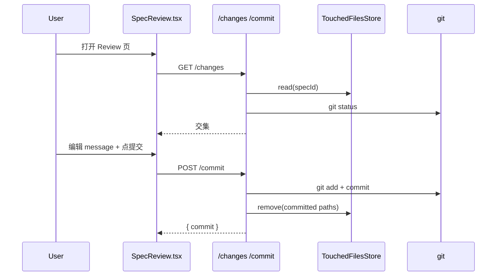
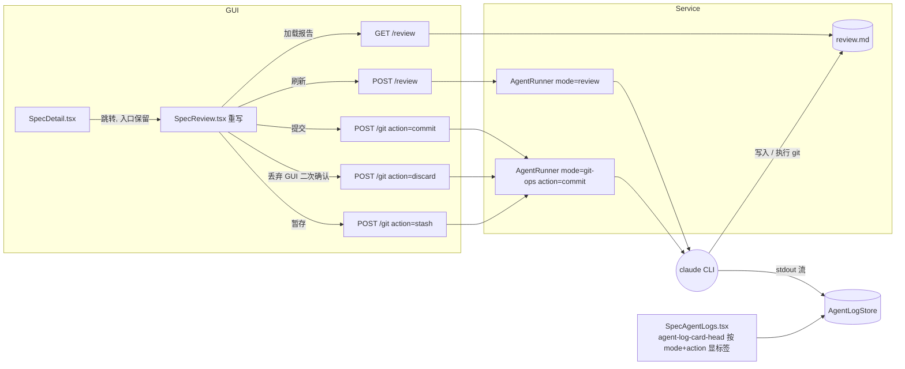

# Agent-driven Review Workflow

## 1. 背景

用户原始需求（原文照录，便于追溯）：

> 重新实现 spec review 工作流，替代当前简化的 review、提交功能，移除 touched-files.json 相关逻辑；
>
> GUI 中 spec 详情页 review 按钮入口保持不变，新建 yorz skill 指导 Agent，参考 spec 文档对当前变更的 git 代码进行 review，重点在于变更总结、变更影响范围、风险提醒、变更文件清单；
> Agent 的 review 结果输出到 review.md 文档中，跟 spec.md 平级；
> 一个 spec 文档可能触发多次 review 动作，每一次 review 写入一个二级标题条目内容到 review.md 文档中, 附加 review 触发时间；
>
> 在 review 界面中，用户可以触发的操作有：刷新（Agent 重跑 review 指令）、提交（触发 Agent 提交当前 spec 相关联的 git 文件）、丢弃（触发 Agent 丢弃变更，须二次提醒）、暂存变更（触发 Agent git stash 相关变更文件）。
>
> agent-logs 功能，日志 header（agent-log-card-head）中，添加标签 Review / GitCommit / GitDiscard / GitStash。

相关历史 spec：[[260619.feat.review-page]]（首版 Review 入口，引入 touched-files + 一键 commit）、[[260630.refct.review-commit-msg-remove-scope]]（commit message 不再带 scope）。

## 2. 需求

1. 删除"基于 touched-files 的 review/commit"路径，包括存储层、路由层、GUI 层与对应测试；磁盘上既存的 `touched-files.json` 残留作历史归档，不主动删除。
2. 保留 spec 详情页 `Review` 入口（`src/gui/src/pages/SpecDetail.tsx` 中 `review-link`）不变，跳转目标页（`SpecReview`）整体重写。
3. 新增由 Agent 驱动的 review 流程：
   - 在既有 `yorz-spec` skill 内新增 "Review / Git Ops 阶段说明"，指导 Agent 读取 `<spec_path>` + 当前 git 变更，输出结构化报告。
   - 报告写入与 spec.md 平级的 `review.md`，每次新增一个二级标题（含触发时间），不覆盖历史。
   - 报告必含 4 节：变更总结 / 影响范围 / 风险提醒 / 变更文件清单。
4. Review 页面用户操作：
   - 刷新：再次触发 review Agent。
   - 提交：触发 Agent 执行 git commit。
   - 丢弃：触发 Agent 执行 git 丢弃，**仅 GUI 端二次 confirm**，service 不再校验 `confirmed` 字段。
   - 暂存变更：触发 Agent 执行 `git stash`。
   - 四个动作均**不限制并发**，每次触发都分配独立 `runId`，dock 列表与 agent-logs 独立呈现。
5. agent-logs 列表项的 `agent-log-card-head` 渲染对应英文 PascalCase 标签：`Review` / `GitCommit` / `GitDiscard` / `GitStash`（与既有 `skill-run` / `explain` 共存）。

## 3. 现状分析

### 3.1 touched-files 链路（待删除）

- 存储：`src/service/touched-files.ts`（`TouchedFilesStore`）+ `src/service/__tests__/touched-files.test.ts`。
  - 数据落盘：`.yorz/specs/<id>/touched-files.json`。
- 注入点：`src/service/project-registry.ts:181` `new TouchedFilesStore(...)`，并通过 `AgentRunner` 的 `touched` 选项注入。
- 信号源：`src/service/agent.ts` 中 `WRITE_TOOL_NAMES`（`Write`/`Edit`/`MultiEdit`/`NotebookEdit`）→ `emitTouchedFromEvent` → `file_touched` 事件 → `TouchedFilesStore.add`。
- 路由消费：`src/service/routes/specs.ts`
  - `GET /projects/:pid/specs/:id/changes`（行 186–200）：交集 `touched ∩ git status`。
  - `POST /projects/:pid/specs/:id/commit`（行 202–263）：基于 touched 列表挑选 paths → `git add` + `git commit` + 写入 `## 执行记录`，commit message 自动追加 `[spec:<id>]` 锚点。
- GUI 消费：`src/gui/src/pages/SpecReview.tsx`（120+ 行）+ `src/gui/src/lib/api.ts:220-232`（`listSpecChanges` / `commitSpecChanges`）+ `request<GitChange[]>` 类型。
- 历史脏数据：当前仓库已有多个 spec 目录残留 `touched-files.json`（如 `260629.feat.agent-run-log-persistence/touched-files.json`）—— 决策保留不动。

### 3.2 Agent / AgentMode / agent-log 现状

- `AgentMode = 'skill-run' | 'explain'`（`src/service/agent.ts:12`）。
- `AgentRunner.run({ specId, mode, prompt })` 启动 claude 子进程，按模式串流标准输出 / 写日志。
  - `skill-run` 对同一 specId 做去重（`skillRunBySpec`）。
  - 当前 `explain` 仅用于 spec 详情页"选中→解释"。
- `AgentLogStore`（`src/service/agent-log-store.ts`）按 `specId / runId` 落盘 `.log` + `.json`，meta 字段含 `mode`。
- 路由：`src/service/routes/agent-logs.ts` 提供 `GET /agent-logs` 与 `GET /agent-logs/:runId`。
- GUI：`src/gui/src/pages/SpecAgentLogs.tsx` 的 `LogCard.agent-log-card-head` 渲染 `<span class="agent-log-mode mode-${meta.mode}">{meta.mode}</span>`。

### 3.3 现有 SpecReview 页面行为（待重写）

- 仅展示 `change-list` 与 `commit-message textarea`，无 review 内容、无丢弃/暂存。
- `buildDefaultMessage` 根据 specId 推断 `feat|refct|fix` 前缀（已被 [[260630.refct.review-commit-msg-remove-scope]] 规范化，新方案下应由 Agent 自主生成）。

### 3.4 现有 skill 现状

- `src/skill/yorz-spec/SKILL.md` + 子文档（`plan.md` / `tasks.md` / `execute.md` / `new-spec.md` / `rewrite-rules.md` / `mermaid.md` / `routing.md` / `conventions.md`）。
- 未提供"review / git 操作"指引；当前 review 完全是 service 端逻辑。

### 3.5 追加任务分析：SpecReview 样式 & review.md 顺序

来自 `## 追加任务` 中的 `[open] [fix]` 条目（2026-07-01 13:32:51），拆解为两个子问题：

**问题 1：Review 页 md 渲染样式与 spec 详情页不一致**

- 现状：`src/gui/src/pages/SpecReview.tsx:146` 用 `<article class="markdown-body" innerHTML={reviewHtml()} />` 渲染 review.md；`markdown-body` 类在 `src/gui/src/styles.css` 中**并未定义**（grep 只命中 tsx 引用点），导致既无白色背景、无边框圆角、无内边距，也无独立滚动容器。
- 参照：spec 详情页 `src/gui/src/pages/SpecDetail.tsx:255-262` 用 `<article class="markdown spec-main" ...>`；`.markdown`（styles.css:730）提供 `background: var(--surface)` + 边框 + 圆角 + padding；`.spec-split > .spec-main`（styles.css:971）设 `flex: 2 1 0; min-width: 0; overflow: auto` 让主体独立滚动。
- 现有 `.spec-review .review-body`（styles.css:1419）仅有 `margin-top: 1.2rem;`，不是 flex 容器，也未开滚动。

**问题 2：review.md 追加顺序应按时间降序**

- 现状：`src/skill/yorz-spec/review.md:15-17` 明文要求"仅在文件末尾追加新二级标题"，即时间升序；`SpecReview.tsx:158-166` 的 `extractLastReviewTime` 相应地"从后向前"扫描取最后一个 `## YYYY-MM-DD HH:mm:ss`。
- 用户诉求：新条目应位于最上方（在 `# Review · <spec-id>` 一级标题之后、既有二级标题之前），使读者进入页面直接看到最近一次 review。
- 历史 review.md 文件（如已生成的 `260630.refct.agent-driven-review-workflow/review.md`，若存在）保留原始升序内容，不做迁移；后续新写入按新规则倒序插入，读者视觉上"最新在顶、历史在底"。

### 3.6 端到端时序（现状）



### 3.7 追加任务分析：Review 操作按钮 loading 状态与互斥 disabled

来自末尾 `## 追加任务` 中新增的 `[open] [feat]` 条目（2026-07-01 20:32:09）：

> review 界面的几个操作按钮，当任务运行时应该添加 loading 状态；当某个任务运行时，对应的按钮 loading，其他按钮 disable；避免误操作。

**现状定位**（对照 `src/gui/src/pages/SpecReview.tsx`）：

- 第 27 行 `const [busy, setBusy] = createSignal<'review' | GitOpsAction | null>(null)` —— busy 是本地"http 请求进行中"的短命状态。
- 第 41–70 行 `trigger()` 中：`setBusy(kind)` 在 http 请求发起前；`finally { setBusy(null) }` 在 http 请求返回**后**立即清零。
- 服务端 `POST /review` / `POST /git` 只等待 Agent 派发成功并返回 `{ runId }` 就结束响应，Agent 后续在后台异步执行（`src/service/routes/spec-review.ts` 与 `AgentRunner.run` 语义一致）。
- 结果：`busy` 仅覆盖了几十到几百毫秒的 http 请求窗口；一旦 `{ runId }` 返回，`busy → null`，4 个按钮全部恢复可点，而 Agent 仍在后台跑 review / commit / discard / stash，用户此时能反复点击、混合派发，产生误操作与并发歧义。
- 视觉上无 loading 反馈：按钮文案只在 `busy === kind` 期间短暂显示"刷新中… / 提交中… / 丢弃中… / 暂存中…"，其余时间即使有任务在跑也看不出。
- disabled 语义不足：现代码用 `disabled={busy() !== null}`，因 `busy` 只在 http 请求期间为非 null，绝大多数时间下 4 个按钮都是启用的，违反用户诉求"某任务运行时其余按钮 disable"。

**任务运行状态的真源**（对照 `src/gui/src/lib/agent-tasks.ts`）：

- `agentTasks.state.tasks[runId].status` 由 SSE 事件驱动：`pending`（初始）→ `streaming`（收到首个 stdout）→ `done` / `failed`（`agent-exit` 或 `agent-error` 事件）。
- 现 `trigger()` 已经在成功派发后调用 `agentTasks.start({ runId, ... })`，因此 dock 已能感知到运行/结束事件；Review 页只需要**订阅同一份 state**，就能得到"某 runId 是否仍在运行"的权威判定，无需增加新的通信通道。
- 由 `hasRunningSkillRun(specId)` 可以看出：已存在按 mode + specId 判断"当前 spec 是否有该模式任务在跑"的先例，可作为 API 风格参照，但本页需要更细的 (mode, action) 粒度。

**运行态到按钮的映射（本次改动的核心）**：

- Review 页有 4 个"逻辑按钮" kind：`review` / `commit` / `discard` / `stash`。
- 每个 kind **同一时刻至多一个"当前跟踪的 runId"**（每次成功派发覆盖上一次记录，用户此前的历史 runId 一旦超出跟踪就不再影响按钮态；仍在 dock 中可查看）。
- kind 的"运行中"= 其跟踪 runId 存在且 `agentTasks.state.tasks[runId]?.status` ∈ `{ 'pending', 'streaming' }`。
- 全页"是否有任何 kind 在运行"= 4 个 kind 中至少一个运行中，或 `busy() !== null`（覆盖 http 派发阶段的等待）。
- disabled 规则：
  - 若某 kind 自身运行中 → 显示 loading 文案 + `disabled=true`（不允许重复触发）。
  - 若非本 kind 有运行中 → `disabled=true`（避免误操作）。
  - 全空闲 → 全部可点。
- 视觉 loading：按钮文案继续沿用当前"刷新中… / 提交中… / 丢弃中… / 暂存中…"文本；额外前缀一个统一的旋转 spinner（复用 styles.css:216 `@keyframes yorz-spin` 与 `src/gui/src/styles.css:207-214` 的 `.projects-sidebar-refresh-icon.spinning` 命名/动画约束，Review 页新增 `.review-action-spinner`）。

**副作用清理（顺带修正的小 bug，不算需求扩张）**：

- 现第 62–64 行 `if (kind === 'review') setTimeout(() => setRefreshTick((t) => t + 1), 1500)`，1.5 秒后强刷 `review.md` —— 与 Agent 实际完成时刻脱耦；若 Agent 慢于 1.5s 或写入更慢，页面会展示旧 review 文本，直到用户手动再触发。
- 本次借按钮状态改造，把"review 任务从运行 → 结束"作为触发 `setRefreshTick` 的事件源，语义与体验都更准确；`setTimeout` 兜底删除。

**不涉及的范围**（明确留白，避免范围蔓延）：

- 不改 dock（AgentPanelDock）的呈现；本改动仅影响 Review 页 4 个按钮。
- 不改 Service 侧路由 / Agent 派发协议；Agent 派发返回 `{ runId }` 的现状即已满足。
- 不改 `agent-tasks.ts` 内部结构；只消费其现有 state。
- 页面刷新（reload）后，浏览器端 `agentTasks` 已通过 `hydrateFromActiveRuns` 从服务端恢复活跃 runId，但本页 4 个 kind → runId 的**本地映射**会丢失；此时按钮无法自动"识别原属自己的 runId"。这是可接受的行为：刷新后进入"未知任务态"，如果 dock 中仍有活跃任务，Review 页按下述"派发前预检"仍能防止叠加派发，UI 上呈现为按钮短暂全启用，用户触发新动作时会立即补齐映射并显示 loading。若这一点被后续追加任务反馈为体验缺陷，再作独立需求处理，本轮不预先设计。

## 4. 技术实现方案

### 4.1 总体改造视图



### 4.2 服务端（src/service）

- **删除**
  - `src/service/touched-files.ts` 及其测试。
  - `ProjectInstance.touched` 字段；`project-registry.ts` 内 `new TouchedFilesStore` 注入。
  - `AgentRunner` 构造选项 `touched`、`emitTouchedFromEvent` / `WRITE_TOOL_NAMES` / `file_touched` 事件链路（无其他消费者）。
  - `src/service/routes/specs.ts` 中 `GET /changes` / `POST /commit` 两个 handler + 相关 helper（`ensureSpecAnchor` / `parseCommitBody`）。
  - `src/service/__tests__/touched-files.test.ts` 与 `service.test.ts` / `agent.test.ts` 中所有 touched / commit 用例。

- **新增 AgentMode 与 Runner 行为**
  - `AgentMode` 扩展为 `'skill-run' | 'explain' | 'review' | 'git-ops'`（4 种）。
  - `git-ops` 通过额外 `action: 'commit' | 'discard' | 'stash'` 字段区分子动作；`RunAgentInput` 与 `AgentRunHandle` / `ActiveRunInfo` / log meta 均落盘可选 `action`。
  - `AgentRunner.run` 不复用 `skill-run` 的"按 spec 去重"；4 个新动作均**允许并发**，每次都分配新 runId。
  - 日志写入复用 `AgentLogStore`，meta.mode + meta.action 自动落盘。

- **新增 Routes**（建议放 `src/service/routes/spec-review.ts` 单独成文件）
  - `POST /projects/:pid/specs/:id/review` → 起 `mode='review'` Agent，prompt 引用 `<specsDirRelative>/<id>/spec.md` + 指明输出到 `<specsDirRelative>/<id>/review.md`。
  - `POST /projects/:pid/specs/:id/git`（body `{ action: 'commit' | 'discard' | 'stash' }`）→ 起 `mode='git-ops'` Agent，prompt 按 action 拼装；**不校验 confirmed**。
  - `GET /projects/:pid/specs/:id/review` → 直接读取 `review.md` 文本（不存在时返回空字符串）。

- **review.md 文档结构**（由 Agent 维护，service 仅读取 / 不解析）

  ```markdown
  # Review · <spec-id>

  ## 2026-06-30 14:23:01

  ### 变更总结

  ### 影响范围

  ### 风险提醒

  ### 变更文件清单
  ```

  每次 review 追加一段；时间使用 spec frontmatter 已采用的 `YYYY-MM-DD HH:mm:ss` 形式（与 [[260629.feat.agent-run-log-persistence]] 一致）。

### 4.3 GUI（src/gui/src）

- **`SpecReview.tsx` 整体重写**：双区布局
  - 顶部按钮区：刷新 / 提交 / 丢弃 / 暂存。
    - 丢弃按钮点击 → 弹 `window.confirm()` 二次提醒；service 端不再校验。
    - 任一按钮触发后调用对应 API；调用成功后通过 `agentTasks.start(...)` 注册 dock 进度，mode 字段填入新值。
  - 主区：渲染 `review.md`（Markdown 渲染复用 `renderMarkdown`）；右上角小提示展示最近一次 review 时间。
- **`api.ts` 改造**
  - 删除 `listSpecChanges` / `commitSpecChanges` / `GitChange` / `CommitBody` 类型（若无其它引用）。
  - 新增 `triggerReview` / `gitOp(action)` / `getReview`，git 系列统一 POST `/git` 带 action 参数；review 与 git 系列统一返回 `{ runId }` 以便 dock 跟踪。
- **`SpecAgentLogs.tsx` 标签**
  - 新增 `MODE_LABELS` 渲染逻辑：基于 `meta.mode` + `meta.action` 组合得出 `Run / Explain / Review / GitCommit / GitDiscard / GitStash`；未知组合回落到 `meta.mode`。
  - 在 `.agent-log-card-head` 内将原 `{meta.mode}` 替换为标签函数返回值，并保留 `mode-${meta.mode}`/`mode-${meta.mode}-${meta.action}` 类名以便 CSS 上色。
- **样式**：`src/gui/src/styles.css` 为新 mode 增加 `.mode-review` / `.mode-git-ops` / `.mode-git-ops-commit` 等小色块；review 页布局沿用 `page` / `detail-head` 结构。

### 4.4 Skill（src/skill）

不新建独立 skill。**在既有 `src/skill/yorz-spec/` 中新增 [review.md](./review.md) 文档**，并在 `SKILL.md` 的"如何使用本 skill"列表里追加引用：

```markdown
7. 当 Agent 以 mode=review / git-ops 启动时（service 端拉起），按 [Review / Git Ops 阶段说明](./review.md) 执行；不进入 plan/tasks/execute 状态机。
```

`review.md` 关键约束（节选）：

- mode=review：读取 `<spec_path>` 与 `git status/diff`，把结构化报告 **追加** 到同目录 `review.md`（不覆盖历史条目；新增二级标题为 `## YYYY-MM-DD HH:mm:ss`）。
- mode=git-ops + action=commit：基于 review 报告与 `git status`，**由 Agent 自主决定**提交哪些 spec 相关变更文件；commit message 由 Agent 生成，不带 scope（遵循 [[260630.refct.review-commit-msg-remove-scope]]）。
- mode=git-ops + action=discard：使用 `git restore --staged --worktree -- <paths>` + 必要时 `git clean -fd -- <paths>`；对 untracked 文件须在 review 报告中显式列出；**不**预先 stash 备份（遵循用户显式意图，更轻）。
- mode=git-ops + action=stash：使用 `git stash push -m "yorz:<spec-id>" -- <paths>`。
- 通用：禁止 `git push` / `git reset --hard` / 修改任何已提交历史。

skill 安装路径由 `src/cli/install.ts` 拷贝（与现有 `yorz-spec` 同机制）。

### 4.5 旧数据清理

- 仓库内已有 `touched-files.json` 在 spec 目录中：**保留**作历史归档，仅停止写入路径（TouchedFilesStore 删除后自然不再产生新文件 / 修改旧文件）。无需迁移脚本。

### 4.6 测试策略

- 单元：新增 `spec-review.test.ts` 覆盖 3 个新 route 的参数校验与 Runner 调用；删除 touched 测试。
- 集成：手动启 `pnpm dev` 验证 Review 页 4 个动作 → agent-logs 出现对应标签 → review.md 追加 → git 状态变化。
- 旧 review 页快照 / 测试同步删除。

### 4.7 追加任务修复方案

**修复 A：Review 页样式复用 `.markdown`，让 review 主体独立滚动**

- 改动 `src/gui/src/pages/SpecReview.tsx:146`：`<article class="markdown-body" ...>` → `<article class="markdown review-md" innerHTML={reviewHtml()} />`；`.markdown` 复用 spec 详情页白底 + 边框 + 圆角 + padding，`.review-md` 承载 review 页独有的滚动约束。
- 改动 `src/gui/src/styles.css` 中 `.spec-review .review-body`：改造为 flex 容器（`display: flex; flex: 1 1 auto; min-height: 0; margin-top: 1.2rem;`），使其在 `.page` 的列 flex 布局下能真正撑满剩余高度。
- 新增 `.spec-review .review-md`：`flex: 1 1 auto; min-width: 0; overflow: auto;`，把滚动条限制在 markdown 主体内，避免整页滚动导致按钮区被推离视口。
- 不改现有 `.markdown` 全局样式，避免影响 spec 详情页。空 review 时的 `<p class="muted">…</p>` 兜底文案不动。

**修复 B：review.md 追加规则改为按时间降序，插入到一级标题之后**

- 改动 `src/skill/yorz-spec/review.md:16-17`：
  - 第 16 行"若不存在：先写入 `# Review · <spec-id>` 一级标题，然后再追加本次条目"——保留（首次仍然是"标题 + 本次条目"，此时降序与升序一致）。
  - 第 17 行"若已存在：**禁止覆盖**历史条目，仅在文件末尾追加新二级标题"——改为**"若已存在：禁止覆盖历史条目；将本次二级标题及其正文块插入到 `# Review · <spec-id>` 一级标题之后、既有第一个 `## ` 二级标题之前，使 review 条目按时间降序（最新在顶）排列。"**
  - 一级标题与新条目之间保留 1 个空行，新条目与后续既有条目之间保留 1 个空行。
- 明确不迁移已存在的历史 review.md：若某 spec 目录下 review.md 已有旧的升序条目，本次改动**只影响后续新增**；页面顶部展示的"最近一次 review 时间"读到的是**文件中第一个** `## YYYY-MM-DD HH:mm:ss`，历史旧文件（老升序）看到的会是最早那次时间，这属于历史遗留可接受，用户如需归档可另起追加任务清理。
- 相应改动 `src/gui/src/pages/SpecReview.tsx:158-166` `extractLastReviewTime`：由"从后向前扫描"改为"**从前向后扫描**取第一个匹配"；命名与语义保持不变（仍代表"最近一次 review"），只是数据源改为按新规则位于文件顶部的条目。

### 4.8 追加任务修复方案：Review 操作按钮 loading 与互斥 disabled

**改动位置**：`src/gui/src/pages/SpecReview.tsx`（主要）、`src/gui/src/styles.css`（新增 spinner 与 loading 视觉规则）。

**a. 数据结构：kind → 当前跟踪 runId 的映射**

在组件内新增：

```ts
type ActionKind = 'review' | GitOpsAction
const [activeRuns, setActiveRuns] = createSignal<Partial<Record<ActionKind, string>>>({})
```

- key 为 4 个 kind；value 为该 kind **最近一次成功派发**得到的 `runId`。
- 每次 `trigger(kind)` 派发成功后，用 `setActiveRuns((prev) => ({ ...prev, [kind]: res.runId }))` 覆盖。
- 组件卸载不需要清理：`agentTasks` 是全局单例，本页只做只读订阅。

**b. 运行态派生（依赖 `agentTasks.state`，通过 solid 的 reactive 传播）**

```ts
function isKindRunning(kind: ActionKind): boolean {
  const runId = activeRuns()[kind]
  if (!runId) return false
  const t = agentTasks.state.tasks[runId]
  if (!t) return false
  return t.status === 'pending' || t.status === 'streaming'
}
const runningKind = createMemo<ActionKind | null>(() => {
  const kinds: ActionKind[] = ['review', 'commit', 'discard', 'stash']
  for (const k of kinds) if (isKindRunning(k)) return k
  return null
})
const isAnyRunning = createMemo(() => busy() !== null || runningKind() !== null)
```

- `busy()` 覆盖 http 派发窗口（发起请求到拿到 runId 之间），此期间尚无 runId 可查，需要以 busy 为准。
- 一旦拿到 runId，busy 立即被 `finally` 清零，接力棒转到 `agentTasks.state.tasks[runId].status`。
- solid 的 `createMemo` 会自动订阅 `agentTasks.state` 的细粒度变化——`state` 由 `createStore` 创建，读取 `state.tasks[runId].status` 即触发依赖登记，无需手动订阅。

**c. 按钮渲染改造**

按钮统一使用如下模板（示意，实际按现有 4 个按钮块分别改）：

```tsx
<button
  type="button"
  class="primary-action"
  disabled={busy() !== null || (runningKind() !== null && runningKind() !== 'review')}
  onClick={() => trigger('review')}
>
  <Show when={isKindRunning('review') || busy() === 'review'}>
    <span class="review-action-spinner" aria-hidden="true" />
  </Show>
  {isKindRunning('review') || busy() === 'review' ? '刷新中…' : '刷新 Review'}
</button>
```

关键点：

- disabled 判定融合"当前 kind 正在运行"与"其他 kind 正在运行"两种情况（两者都需要 disable，但只有前者显示 loading）。
- 简化写法：`disabled={runningKind() ? runningKind() !== <thisKind> || true : busy() !== null}`。为可读性拟采用直接的条件：`disabled={isAnyRunning()}`——因为当前 kind 运行中时本身也要 disable（避免重复触发），"其余按钮 disable"是同一 disabled 语义的自然推论。
- loading 文案沿用当前"刷新中…/提交中…/丢弃中…/暂存中…"字面；新增 spinner 的 DOM 是纯装饰，通过 `aria-hidden` 隔离辅助技术。

**d. 派发前互斥兜底（防止边界竞态）**

`trigger()` 入口追加：

```ts
if (isAnyRunning()) return
```

- 覆盖极端情况：用户在浏览器 devtools 中强制启用按钮、或键盘 Enter 事件绕过 disabled 状态时，仍能兜底阻止叠加派发。
- 该早退不 setError，避免"我明明什么都没干却弹错"的困惑。

**e. review 完成后自动刷新 review.md（顺带修复现有 setTimeout 兜底）**

用 `createEffect` 订阅 `activeRuns().review` 对应 task 的 status 变化：

```ts
createEffect((prev) => {
  const runId = activeRuns().review
  if (!runId) return undefined
  const status = agentTasks.state.tasks[runId]?.status
  if ((prev === 'pending' || prev === 'streaming') && (status === 'done' || status === 'failed')) {
    setRefreshTick((t) => t + 1)
  }
  return status
}, undefined)
```

- 上一次状态属于运行中 + 本次状态属于结束，判定为"该 review 任务刚完成" → 触发 `review.md` 重新拉取。
- 同步删除 `trigger()` 中"1.5 秒后强刷"的 `setTimeout` 兜底。
- 失败也刷新一次：即便 review 生成中途挂掉，`review.md` 可能已被部分写入，刷新能让用户看到落地内容（若无落地则维持之前渲染）。

**f. 样式**（追加到 `src/gui/src/styles.css`）

新增：

```css
.spec-review .review-actions button {
  display: inline-flex;
  align-items: center;
  gap: 0.4rem;
}

.review-action-spinner {
  width: 0.85em;
  height: 0.85em;
  border-radius: 50%;
  border: 2px solid currentColor;
  border-right-color: transparent;
  display: inline-block;
  animation: yorz-spin 0.8s linear infinite;
}
```

- 复用 styles.css:216 已存在的 `@keyframes yorz-spin`，不重复定义。
- 采用 `currentColor` 让 spinner 颜色跟随按钮字色（primary-action 白字、ghost 深色、ghost danger 橙红）。
- 未新增 `.button--loading` 之类的按钮级 loading class，因语义由 spinner + 文案已充分表达；不引入冗余 class。
- 现有 `button:disabled`（styles.css:75）已定义 opacity 与 cursor，无需重复。

**g. 影响面与回归**

- 影响文件：`src/gui/src/pages/SpecReview.tsx` + `src/gui/src/styles.css`；不涉及 Service / API / Skill / 测试文件。
- 现有单测（`src/service/__tests__/*.test.ts`）不覆盖该 GUI 交互，无需新增/调整测试。
- 手动验收：`pnpm dev` 启动后打开 Review 页，依次点击 4 个按钮，观察：
  1. 被点按钮进入 loading（spinner + 文案改变）；
  2. 其余按钮 disable；
  3. Agent 完成后，按钮同时解锁；
  4. review 完成后 `review.md` 主体区自动刷新（无 1.5s 视觉抖动）。
- 回归检查：`pnpm build` 通过；`tsc --noEmit` 无新增报错。

## 5. 待确认问题

- 暂无

## 6. 任务清单

- [x] 扩展 `src/service/agent.ts` 的 `AgentMode` 为 `'skill-run' | 'explain' | 'review' | 'git-ops'`；`RunAgentInput` 加可选 `action`；`AgentRunHandle` / `ActiveRunInfo` / log meta 透传 `action`；删除 `WRITE_TOOL_NAMES` / `emitTouchedFromEvent` / `touched` 选项与 `file_touched` 事件链路。
- [x] 删除 `src/service/touched-files.ts` 与 `src/service/__tests__/touched-files.test.ts` 文件；磁盘上既存 `touched-files.json` 保留不动。
- [x] 修改 `src/service/project-registry.ts`：删除 `new TouchedFilesStore` 实例化、`ProjectInstance.touched` 字段、向 `AgentRunner` 传 `touched` 的注入。
- [x] 删除 `src/service/routes/specs.ts` 中 `GET /projects/:projectId/specs/:id/changes`、`POST /projects/:projectId/specs/:id/commit` 两个 handler 与相关 helper（`ensureSpecAnchor` / `parseCommitBody`）；同步清理 `src/service/__tests__/service.test.ts` 中相关用例。
- [x] 新建 `src/service/routes/spec-review.ts`，导出 `createSpecReviewRoutes(resolveProject)`，挂载到 service 主路由：实现 `POST /projects/:projectId/specs/:id/review`、`POST /projects/:projectId/specs/:id/git`（校验 action 取值）、`GET /projects/:projectId/specs/:id/review`；前两者调用 `runner.run({ specId, mode, prompt, action })` 并返回 `{ runId }`，最后一个读取 review.md 文本（不存在返回空字符串）。
- [x] 新建 `src/skill/yorz-spec/review.md`，详述 review / git-ops 阶段的输入、`review.md` 追加规则、4 个 git 操作约束（不带 scope、不 stash 备份、不允许 push / reset --hard）；在 `src/skill/yorz-spec/SKILL.md` 的"如何使用本 skill"列表新增第 7 条引用 `review.md`；`src/skill/yorz-spec/index.json` 同步登记 review 模块。
- [x] 重写 `src/gui/src/pages/SpecReview.tsx`：顶部按钮（刷新 / 提交 / 丢弃[`confirm`] / 暂存）+ 主区 Markdown 渲染 review.md（复用 `renderMarkdown`）；右上角显示最近一次 review 时间；每次按钮触发后调用 `agentTasks.start(...)` 注册 dock 进度。
- [x] 改造 `src/gui/src/lib/api.ts`：删除 `listSpecChanges` / `commitSpecChanges` / `GitChange` / `CommitBody` 等 export；新增 `triggerReview(projectId, specId)` / `gitOp(projectId, specId, action)` / `getReview(projectId, specId)`，前两者返回 `{ runId }`，最后一个返回 `{ text }`；`AgentLogMeta` 增加可选 `action`，`AgentLogMode` 扩展。
- [x] 修改 `src/gui/src/pages/SpecAgentLogs.tsx`：新增 `agentTagLabel(meta)` / `modeClassName(meta)`，根据 (mode, action) 组合得出 `Run` / `Explain` / `Review` / `GitCommit` / `GitDiscard` / `GitStash`；替换 `.agent-log-card-head` 内 `{meta.mode}` 渲染，保留 `mode-${meta.mode}` 类名并按需追加 `mode-${meta.mode}-${meta.action}`。
- [x] 调整 `src/gui/src/styles.css`：为 `.mode-review` / `.mode-git-ops` / `.mode-git-ops-commit` / `.mode-git-ops-discard` / `.mode-git-ops-stash` 增加色块样式；旧 `.mode-skill-run` / `.mode-explain` 保持；移除已不再使用的 `.review-changes` / `.review-commit` / `.change-list` 等样式，新增 `.review-actions` / `.review-body`。
- [x] 在 `src/service/__tests__/` 增加 `spec-review.test.ts` 覆盖 3 个新 route 的参数校验（action 非法 → 400）与 Runner 调用。`pnpm test` 全部 26 个文件、203 个用例通过。
- [x] 修改 `src/skill/yorz-spec/review.md` mode=review 小节：把"若已存在：仅在文件末尾追加新二级标题"改为"将本次二级标题及其正文块插入到 `# Review · <spec-id>` 一级标题之后、既有第一个 `## ` 二级标题之前，使 review 条目按时间降序（最新在顶）排列"；保留首次写入（不存在 review.md 时）的行为不变；标题与新条目之间保留 1 个空行。验收：文档内包含"降序""插入""最新在顶"等关键词，且未再出现"末尾追加"。
- [x] 修改 `src/gui/src/pages/SpecReview.tsx:146` article 的 class：`markdown-body` → `markdown review-md`；同时改 `extractLastReviewTime`（当前 158-166 行）由"从后向前扫描"改为"从前向后扫描取第一个 `## YYYY-MM-DD HH:mm:ss` 匹配"；函数名与调用点保持不变。验收：`pnpm build` 通过；tsc 无新增报错。
- [x] 修改 `src/gui/src/styles.css` 中 `.spec-review .review-body`（约 1419 行）：改造为 flex 容器 `display: flex; flex: 1 1 auto; min-height: 0; margin-top: 1.2rem;`；新增规则 `.spec-review .review-md { flex: 1 1 auto; min-width: 0; overflow: auto; }`，使 markdown 主体独立滚动、按钮区不被推离视口。验收：`.markdown` 复用带来白色背景 / 边框 / 圆角 / padding；页面高度受限时 review 主体出现内部滚动条。
- [x] 运行 `pnpm test` 与 `pnpm build` 回归；若无失败即视为通过。验收：全部原有用例仍通过（实际 27 文件 / 212 用例通过），构建无新报错。
- [x] 在 `src/gui/src/pages/SpecReview.tsx` 引入 `activeRuns` signal（key = `'review' | GitOpsAction`，value = 最近一次成功派发的 runId），并在 `trigger()` 成功派发后调用 `setActiveRuns((prev) => ({ ...prev, [kind]: res.runId }))` 覆盖；`trigger()` 入口追加 `if (isAnyRunning()) return` 兜底早退（不 setError）。验收：本地手工点 4 个按钮，`activeRuns()` map 中对应 kind 的 runId 与派发结果一致；页面 devtools 强启按钮点第二次时不再重复派发。
- [x] 在 `src/gui/src/pages/SpecReview.tsx` 增加 `isKindRunning(kind)` 函数 + `runningKind()` / `isAnyRunning()` `createMemo`，运行态源为 `agentTasks.state.tasks[runId].status ∈ {pending, streaming}`，并将 http 派发窗口的 `busy()` 一并纳入 `isAnyRunning()`；把 4 个按钮的 `disabled` 统一改为 `disabled={isAnyRunning()}`，loading 判定改为 `isKindRunning(kind) || busy() === kind` 并渲染 `<span class="review-action-spinner" aria-hidden="true" />` + 现有中文文案。验收：Agent 后台运行期间对应按钮持续保持 loading + 其余 3 按钮 disable；完成后 4 按钮同时解锁。
- [x] 在 `src/gui/src/pages/SpecReview.tsx` 用 `createEffect` 订阅 `activeRuns().review` 对应 task 的 status 变化，检测到"上一次运行中 → 本次结束（done/failed）"时触发 `setRefreshTick`；同步删除 `trigger()` 内 `if (kind === 'review') setTimeout(..., 1500)` 兜底。验收：review Agent 完成后 review.md 主体区自动刷新，不再出现 1.5s 视觉抖动；失败也刷新一次。
- [x] 在 `src/gui/src/styles.css` 新增 `.spec-review .review-actions button { display: inline-flex; align-items: center; gap: 0.4rem; }` 与 `.review-action-spinner { width: 0.85em; height: 0.85em; border-radius: 50%; border: 2px solid currentColor; border-right-color: transparent; display: inline-block; animation: yorz-spin 0.8s linear infinite; }`；复用已存在的 `@keyframes yorz-spin`，不重复定义。验收：spinner 颜色跟随按钮字色（primary/ghost/danger 各自协调），旋转流畅；`pnpm build` 通过。
- [x] 运行 `pnpm build` 回归，若无新增 tsc 报错即视为通过（本改动不涉及 service 侧测试，无需跑 `pnpm test`）。验收：构建通过；`pnpm exec tsc --noEmit` 无新增报错（原有 `QuestionConfirmPanel.tsx` 中 `note` 重复键告警可忽略，与本次无关）。

## 7. 追加任务

- [fixed] [fix] 2026-07-01 13:32:51 | 1. review 界面 md 文档的渲染样式应该参考 spec 详情页，白色背景、文档区允许滚动；
  - 描述：1. review 界面 md 文档的渲染样式应该参考 spec 详情页，白色背景、文档区允许滚动；2. Agent 允许向 review.md 多次写入记录，应该按时间降序
- [fixed] [feat] 2026-07-01 20:32:09 | review 界面的几个操作按钮，当任务运行时应该添加 loading 状态；
  - 描述：review 界面的几个操作按钮，当任务运行时应该添加 loading 状态；当某个任务运行时，对应的按钮 loading，其他按钮 disable；避免误操作。

## 8. 执行记录

- 2026-06-30 21:50：新建 spec，完成 plan 阶段，待确认问题已列出，等待用户批注后再进入 tasks。
- 2026-06-30 21:52：消费用户对全部 8 个待确认问题的批注。决策：4 个动作合并为 `git-ops` mode（action 参数区分）；review 指引并入 `yorz-spec` skill（新增 `review.md`）；提交范围由 Agent 自主决定；丢弃仅 GUI 端 confirm；不限并发；不预先 stash 备份；保留旧 `touched-files.json` 残留；agent-logs 标签沿用英文 PascalCase。已更新 4.2 / 4.3 / 4.4 / 4.5，删除"用户批注"章节，进入 execute。
- 2026-06-30 22:05：完成全部 11 项任务的执行：服务端 `AgentMode` 扩展 + 删除 touched 链路 + 删除 `/changes` `/commit` 路由；新增 `src/service/routes/spec-review.ts` 三接口；新增 `src/skill/yorz-spec/review.md` 并登记 index.json；GUI 重写 `SpecReview.tsx` + 改造 `api.ts` + 扩展 `SpecAgentLogs.tsx` 标签 + 补 styles.css；新增 `src/service/__tests__/spec-review.test.ts` 覆盖 9 个场景。验证：`pnpm test` 通过（26 文件 / 203 用例），`pnpm build` 通过；`tsc --noEmit` 仅剩 1 个预先存在、与本次改动无关的告警（`QuestionConfirmPanel.tsx` 中 `note` 重复键）。
- 2026-07-01 13:34:43：变更重开流程（追加任务：fix）。补充 3.5 追加任务分析、4.7 追加任务修复方案；合并末尾裸露的 `## 追加任务` 到第 7 节；`## 待确认问题` 保持"暂无"（两项改动均明确无需再确认）。
- 2026-07-01 13:38:34：完成追加任务 4 项子任务的执行：`src/skill/yorz-spec/review.md` 将追加规则改为按时间降序插入到一级标题之后；`src/gui/src/pages/SpecReview.tsx` article 类名由 `markdown-body` 改为 `markdown review-md`，`extractLastReviewTime` 由从后向前扫描改为从前向后取第一个匹配；`src/gui/src/styles.css` 的 `.spec-review .review-body` 改造为 flex 容器 + 新增 `.spec-review .review-md` 独立滚动规则，复用 `.markdown` 白色背景。回归：`pnpm test` 通过（27 文件 / 212 用例），`pnpm build` 通过。追加任务条目由 `[open]` 更新为 `[fixed]`。
- 2026-07-01 20:33:35：变更重开流程（追加任务：feat）。合并末尾裸 `## 追加任务` 到第 7 节；补充 3.7 现状分析（定位 `SpecReview.tsx` 中 busy 只覆盖 http 派发窗口、任务运行态未反馈的问题，明确以 `agentTasks.state.tasks[runId].status` 作为运行态真源）与 4.8 技术方案（引入 kind→runId 映射 + `runningKind()` / `isAnyRunning()` 派生 + 全按钮统一 `disabled={isAnyRunning()}` + 复用 `@keyframes yorz-spin` 的 `.review-action-spinner`；顺带以 `createEffect` 监听 review 任务完成事件，替代 1.5s `setTimeout` 兜底刷新）；`## 待确认问题` 保持"暂无"（用户诉求已明确，无候选决策）。
- 2026-07-01 20:41:20：完成追加任务（feat）5 项子任务的执行：`src/gui/src/pages/SpecReview.tsx` 重构 —— 引入 `activeRuns` signal（kind→runId 映射）+ `isKindRunning` / `runningKind` / `isAnyRunning` 派生 memo（运行态源自 `agentTasks.state.tasks[runId].status ∈ {pending, streaming}`，融合 `busy()` 覆盖 http 派发窗口）；4 个按钮的 `disabled` 统一改为 `isAnyRunning()`，loading 判定使用 `buttonLoading(kind)` 并渲染 `.review-action-spinner`；`trigger()` 入口追加 `if (isAnyRunning()) return` 兜底早退；用 `createEffect` 订阅 review kind 的 task status 变化以在 done/failed 时触发 `setRefreshTick`，删除原 `setTimeout(..., 1500)` 兜底。`src/gui/src/styles.css` 追加 `.spec-review .review-actions button { display: inline-flex; align-items: center; gap: 0.4rem; }` 与 `.review-action-spinner { … animation: yorz-spin 0.8s linear infinite; }`，复用已存在的 `@keyframes yorz-spin`。回归：`pnpm build` 通过（4.39s，无新增 tsc 报错）；本改动仅涉及 GUI，不新增/调整 service 测试。追加任务条目由 `[open]` 更新为 `[fixed]`。
