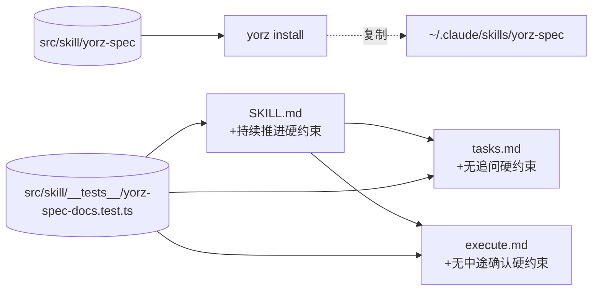

# 260630.refct.auto-execute-after-questions-cleared

## 1. 背景

当前 yorz skill 在任务计划完成或确认完问题之后，如果碰到比较大的更改、任务比较多的情况，即使先清空了待确认的问题，仍然会暂停询问是否执行；期望确认完所有问题之后，即使长任务也积极执行，而不是暂停询问。

## 2. 需求

- 用户已经完成 `## 待确认问题` 的批注回答，并把该章节归位为 `- 暂无`（或被 tasks 阶段消费清空）后，Agent 不应再向用户追加"是否要我执行这些任务 / 是否继续"等元确认。
- 即便 `## 任务清单` 较长、改动半径较大，仍应在同一轮顺序推进 execute，直到出现合法阻塞（待确认问题、`！！！` 批注、新需求/新 bug 触发重开、外部命令失败）才退出。
- 该约束需要在 skill 文档中以"硬约束"形式落地，让 Agent 的默认推进策略覆盖模型自带的"大改动前自我确认"倾向。

## 3. 现状分析

### 3.1 现有"持续推进"语义只在描述层，缺乏硬约束

- `SKILL.md` 首段写"Agent 持续推进直至阻塞（待确认问题、决策、Review）才退出"，属说明性表述，未列入"输出优先级"或"硬约束"。
- `tasks.md` 的 `## 自动衔接` 写"若 `待确认问题` 为 `- 暂无`（或为空），且无新冲突 / 歧义，则在同一轮继续进入 execute"，只描述了**衔接动作**，没有禁止"衔接前/中暂停询问用户"。
- `execute.md` 的 `## 顺序执行` 写"顺序执行未完成项"，但未约束"开始执行前不得做整批确认 / 半途不得做中段确认"。
- `routing.md` 的判定顺序也只覆盖"该进入哪个阶段"，不约束"进入后是否中途自检询问"。

### 3.2 合法阻塞与非法暂停的边界没有显式列举

skill 各处零散提到"阻塞"的来源，但缺一份权威清单。Agent 容易被模型默认的"大改动前请确认"安全倾向接管，把"任务很多/改动较大/涉及破坏性命令"当成额外暂停理由，形成与 skill 设计相反的行为。

### 3.3 skill 在两个位置存在镜像，但源单一

- 真源：`src/skill/yorz-spec/`（仓库内）
- 部署副本：`~/.claude/skills/yorz-spec/`（由 `yorz install` 写入）
- `src/cli/install.ts` 通过 `import.meta.glob('../skill/yorz-spec/**/*.{md,json}', ...)` 在构建期内联所有源文件，安装时整体覆盖部署目录。
- 结论：本次重构只需改 `src/skill/yorz-spec/` 下的文件；用户需要重新运行 `yorz install` 才能让 `~/.claude/skills/yorz-spec/` 生效。

### 3.4 现有 fixtures 覆盖范围

`src/skill/yorz-spec/__tests__/fixtures/` 已有 `plan-candidates`、`tasks-consume-annotations`、`execute-checkbox-flip`、`append-task-state`、`reopen-on-new-requirement`、`new-spec-skeleton` 等场景，但**没有**"清空待确认问题且任务多 → 继续执行不暂停"这类场景。本次按用户决策不新增 fixture，改为"文档关键词存在性"的单元测试（grep 断言）保障约束不被回退。

## 4. 技术实现方案

### 4.1 在 SKILL.md 增加"持续推进硬约束"小节

- 位置：`## 输出优先级` 之后、`## 与 YorZ 工作流的关联` 之前，新增 `## 持续推进硬约束`。
- 内容要点：
  - 列出**唯四种合法阻塞退出**：
    1. `## 待确认问题` 存在非 `暂无` 条目
    2. spec md 内存在任何 `！！！` 批注
    3. 识别到新增/扩展需求或新增 bug，需切回 plan（见 `rewrite-rules.md`）
    4. 执行外部命令/工具调用失败需要用户决断
  - 显式禁止以下"元确认"行为：
    - 以"任务很多 / 改动较大 / 范围广 / 时间长"为由询问"是否继续"
    - 在执行中段汇报进度并要求用户确认下一步
    - 反问"要不要我开始执行 / 是否同意此方案"等需要用户单按"是"才能继续的语句
  - 替代约定：若 Agent 在 tasks/execute 阶段产生新疑问，应将其作为新条目写回 `## 待确认问题`，按变更重开流程退出，**不要**用问句停顿。
  - 兜底说明：对外部世界有副作用、不可逆的命令（破坏性操作）仍按系统默认安全准则处理，不被本硬约束覆盖。

### 4.2 在 tasks.md 的"自动衔接"补齐"无追问硬约束"

- 紧接现有"若 `待确认问题` 为 `- 暂无`（或为空），且无新冲突 / 歧义，则在同一轮继续进入 execute"之后，增加一条：
  > **同一轮衔接 execute 前后不得向用户追加任何"是否执行 / 是否继续"询问**；如需新输入，按 [全局硬约束](./rewrite-rules.md) 写入 `## 待确认问题` 触发重开。
- 同时在小节标题旁加一行"任务量不构成暂停理由"的说明，避免被误读为只对小批量任务有效。

### 4.3 在 execute.md 的"顺序执行"补齐"无中途确认硬约束"

- 在 `## 顺序执行` 现有 2 条要点后追加一条：
  > **执行过程中不得对用户做整批/中段元确认**。除"新需求/新 bug → 切回 plan"外，任务清单内部的疑问必须以 `## 待确认问题` 形式写回触发重开，禁止追加"是否继续 / 我是否应该执行下一项"的问句。
- 由于 execute.md 引用了 rewrite-rules.md 的变更重开规则，这一硬约束与变更重开规则不冲突：变更重开仍然是合法阻塞。

### 4.4 不修改 rewrite-rules.md（用户决策）

按待确认问题第 3 条用户选择"不增加，所有约束集中在 SKILL.md，避免重复维护"，本次不在 `rewrite-rules.md` 增加交叉引用，约束的单点权威落在 `SKILL.md` 的「持续推进硬约束」小节。

### 4.5 同步部署副本

- 仅需修改 `src/skill/yorz-spec/`；`~/.claude/skills/yorz-spec/` 的同步通过 `yorz install` 完成。
- 在 `## 执行记录` 中提示"修改 src 端后，本机 `~/.claude/skills/yorz-spec/` 需要重新 `yorz install` 才能生效"，供后续会话验收；不在 README/TODO 写入（用户已确认无需）。

### 4.6 测试与回归

- 走"文档关键词存在性"路径：新增一份 vitest 单元测试，断言 `src/skill/yorz-spec/SKILL.md` / `tasks.md` / `execute.md` 中存在新条款的关键词（如「持续推进硬约束」「元确认」「任务量不构成暂停理由」「中段元确认」），避免硬编码全文。
- 不新增 fixture、不跑 runner（按用户决策）。
- 测试文件路径必须避开 `src/skill/yorz-spec/__tests__/**`（该目录在 root `vite.config.ts` 中被 `pnpm test` 排除，仅由 `pnpm test:agent` 触发）。本次落到 `src/skill/__tests__/yorz-spec-docs.test.ts`，被默认 `pnpm test` 包含。

### 4.7 影响范围与回归风险

- 主要风险：硬约束可能与"潜在破坏性操作"通用安全准则冲突（如 git push、rm -rf）；4.1 节兜底句已显式排除这些操作，保留"对外部世界有副作用、不可逆的命令仍按系统默认安全准则处理"作为底线，避免被误读为"任何操作都不再确认"。
- 兼容性：旧 spec 文档无需改动；约束仅作用在 Agent 推进行为上。

## 5. 待确认问题

- 暂无

## 6. 任务清单

- [x] 修改 `src/skill/yorz-spec/SKILL.md`：在 `## 输出优先级` 之后、`## 与 YorZ 工作流的关联` 之前新增 `## 持续推进硬约束` 小节；包含「唯四种合法阻塞退出」清单、「元确认」禁止行为列表、「新疑问改写回待确认问题」替代约定，以及一句"对外部世界有副作用、不可逆的命令仍按系统默认安全准则处理"兜底说明。验收：文件包含 `## 持续推进硬约束` 标题与「元确认」「合法阻塞」「副作用」三个关键词。
- [x] 修改 `src/skill/yorz-spec/tasks.md` 的 `## 自动衔接`：紧接现有首条衔接规则后追加"同一轮衔接 execute 前后不得向用户追加任何'是否执行 / 是否继续'询问"硬约束；并在小节内补一句"任务量不构成暂停理由"。验收：文件包含「任务量不构成暂停理由」与「同一轮衔接 execute 前后不得」两段文本。
- [x] 修改 `src/skill/yorz-spec/execute.md` 的 `## 顺序执行`：在现有要点后追加"执行过程中不得对用户做整批/中段元确认"硬约束，明确仅"新需求/新 bug → 切回 plan"为例外，并指出任务清单内部疑问须以 `## 待确认问题` 形式写回触发重开。验收：文件包含「中段元确认」「整批/中段元确认」关键词。
- [x] 新建 `src/skill/__tests__/yorz-spec-docs.test.ts`：用 vitest 断言 `src/skill/yorz-spec/SKILL.md` 含「持续推进硬约束」「元确认」；`tasks.md` 含「任务量不构成暂停理由」；`execute.md` 含「中段元确认」。验收：`pnpm test` 包含该测试且通过。
- [x] 运行 `pnpm test` 触发 vitest，确认新测试通过且未引入其它回归；若仓库存在 prettier 则对本 spec.md 与改动文档运行格式化。验收：测试与格式化命令的输出登记在 `## 执行记录`。

## 7. 追加任务

- 暂无

## 8. 执行记录

- 2026-06-30 `src/skill/yorz-spec/SKILL.md`：在 `## 输出优先级` 之后插入 `## 持续推进硬约束` 小节，含 4 条合法阻塞清单、3 条元确认禁止行为、替代约定、破坏性操作兜底说明；与 `## 与 YorZ 工作流的关联` 顺序保持不变。
- 2026-06-30 `src/skill/yorz-spec/tasks.md`：`## 自动衔接` 段补「任务量不构成暂停理由」引言与「同一轮衔接 execute 前后不得向用户追加询问」硬约束。
- 2026-06-30 `src/skill/yorz-spec/execute.md`：`## 顺序执行` 段补「执行过程中不得对用户做整批/中段元确认」硬约束，例外仅限"新需求/新 bug → 切回 plan"。
- 2026-06-30 新建 `src/skill/__tests__/yorz-spec-docs.test.ts`：3 个 `it()` 断言 SKILL/tasks/execute 三份文档关键词存在性；放在 `src/skill/__tests__/` 是因为 root `vite.config.ts` 已把 `src/skill/yorz-spec/__tests__/**` 从 `pnpm test` 中排除。
- 2026-06-30 验证：`pnpm test` 全部 25 个 file / 204 个 case 通过（含 3 个新增 case）；`pnpm exec prettier --write` 报告所有改动文档 `(unchanged)`，已是 prettier 期望格式。
- 2026-06-30 提示：本次仅修改了 `src/skill/yorz-spec/` 真源，若想让本机 `~/.claude/skills/yorz-spec/` 立即生效，需要在本仓库重新构建并运行 `yorz install`；其它会话/项目无需介入。

## 执行记录

- 2026-06-30 提交 75f1fae：refct: 强化 yorz-spec skill 的"持续推进"约定：所有待确认问题清空后，禁止再追加"是否执行"的元确认，即便任务量较大也应直接进入 execute。（5 个文件）
