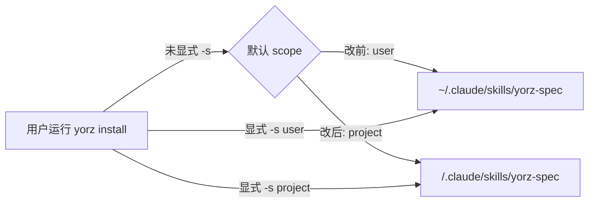
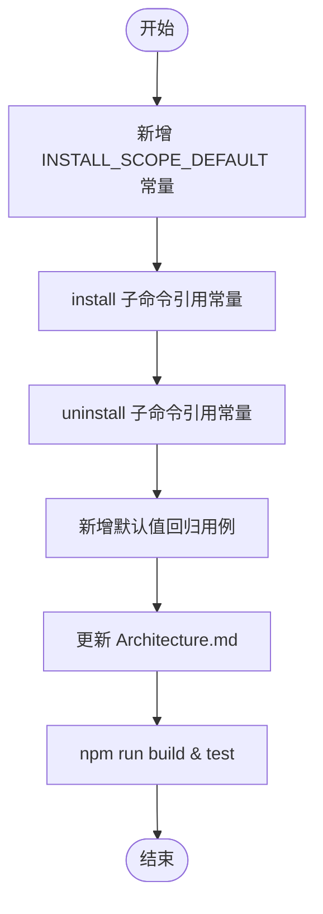

# 260630.refct.install-scope-default-project

## 1. 背景

yorz install 命令行， -s 参数默认值改为 project

## 2. 需求

将 `yorz install` 的 `-s, --scope` 默认值从 `user` 改为 `project`，让"在项目根目录直接执行 `yorz install`"成为默认动作，无需显式 `--scope project`。`uninstall` 默认值同步对称变更。

## 3. 现状分析

### 3.1 当前实现

- `src/cli/index.ts:41` 中 `install` 子命令注册：
  ```ts
  .option('-s, --scope <scope>', 'install scope: user | project', 'user')
  ```
  即 `-s` 缺省值为 `'user'`。
- `src/cli/index.ts:61` 中 `uninstall` 子命令同样以 `'user'` 为缺省。
- `parseScope` (`src/cli/index.ts:29`) 仅校验 `'user' | 'project'` 两种取值，与默认值耦合度低；改默认值不需要改 parser。
- `install()` (`src/cli/install.ts:56`) 透传 `scope` 给 `adapter.resolveSkillsDir(scope, ...)`，对 scope 值本身无任何硬编码假设——`'user'` 写到 `~/.claude/skills/yorz-spec/`，`'project'` 写到 `<cwd>/.claude/skills/yorz-spec/`。
- 现有单测 `src/cli/__tests__/install.test.ts` 全部显式传 `scope: 'user' | 'project'`，**不会**因默认值变更而失败；但也没有专门覆盖"CLI 默认值"的用例。

### 3.2 文档与历史 spec 对默认值的描述

- `docs/Architecture.md:168` 仅列命令形式 `[--scope project|user]`，未声明默认值——本次需补写「默认 scope=project」。
- 历史 spec `docs/specs/260611.feat.init-cli-and-skill.md:121` 写有「默认 `--agent claude`，默认 `--scope user`」——属于已归档的实现记录，**不应**回填修改。
- 项目根 `README.md` 经搜索未提及 `install` / `scope`，无需联动。

### 3.3 影响面



- 行为变化只发生在「未显式 `-s`」路径：写入位置从用户全局目录变为当前项目目录。
- 已显式指定 `-s` 的脚本/文档不受影响。
- 项目尚未发布，不做兼容处理与运行时提示；`uninstall` 默认值同步改为 `project`，保持行为对称。

## 4. 技术实现方案

### 4.1 代码改动

1. `src/cli/index.ts`：在 parser 区新增命名常量 `INSTALL_SCOPE_DEFAULT: InstallScope = 'project'`，便于后续测试与单点维护。
2. `src/cli/index.ts:41`：将 install 子命令的 `-s` 默认值改为引用 `INSTALL_SCOPE_DEFAULT`，commander 自动渲染 `(default: "project")`。
3. `src/cli/index.ts:61`：将 uninstall 子命令的 `-s` 默认值同样改为引用 `INSTALL_SCOPE_DEFAULT`，行为对称。
4. `parseAgents` / `parseScope` 等参数解析逻辑无需变更；`src/cli/install.ts` 业务逻辑无需变更。

### 4.2 测试改动

- 在 `src/cli/__tests__/install.test.ts` 新增一组用例，导入 `INSTALL_SCOPE_DEFAULT` 常量并断言其值为 `'project'`，作为默认值回归保护；避免引入 commander 解析期副作用。

### 4.3 文档改动

- `docs/Architecture.md:168`：在 `yorz install` 命令格式行尾追加「默认 scope=project」。
- `README.md` 当前无相关内容，无需联动；旧 spec `docs/specs/260611.*.md` 作为历史快照不动。



## 5. 待确认问题

- 暂无

## 6. 任务清单

- [x] 在 `src/cli/defaults.ts` 新增 `INSTALL_SCOPE_DEFAULT: InstallScope = 'project'` 常量并导出；验收：tsc 通过
- [x] 将 `src/cli/index.ts:41` install 子命令 `-s, --scope` 默认值改为引用 `INSTALL_SCOPE_DEFAULT`；验收：`node dist/cli/index.js install --help` 输出含 `(default: "project")`
- [x] 将 `src/cli/index.ts:61` uninstall 子命令 `-s, --scope` 默认值改为引用 `INSTALL_SCOPE_DEFAULT`；验收：`uninstall --help` 输出含 `(default: "project")`
- [x] 在 `src/cli/__tests__/install.test.ts` 末尾新增 describe 块，导入 `INSTALL_SCOPE_DEFAULT` 并断言其值为 `'project'`；验收：`npm test -- install` 通过
- [x] 修改 `docs/Architecture.md:168`，在 `yorz install` 行末追加「默认 scope=project」；验收：表格渲染正常、未破坏其它行
- [x] 运行 `npm run build` 与 `npm test`，确保全部通过；验收：两命令退出码 0

## 7. 追加任务

- 暂无

## 8. 执行记录

- 2026-06-30 新建 spec 并进入 plan 阶段，输出现状分析、技术实现方案、3 条待确认问题；等待用户批注后继续 tasks 阶段。
- 2026-06-30 消费用户批注（uninstall 同步、不做兼容/日志、Architecture.md 追加默认值），更新技术方案、清空待确认问题、拆解任务清单，进入 execute 阶段。
- 2026-06-30 execute 阶段完成：
  - 新建 `src/cli/defaults.ts` 提供 `INSTALL_SCOPE_DEFAULT = 'project'`（避免测试导入 `index.ts` 触发 commander 解析副作用）。
  - `src/cli/index.ts` install/uninstall 子命令均改为引用 `INSTALL_SCOPE_DEFAULT`。
  - `src/cli/__tests__/install.test.ts` 新增 `CLI defaults` 用例断言常量值为 `'project'`。
  - `docs/Architecture.md` 表格 `yorz install` 行追加「默认 scope=project」。
  - `npm run build` 成功；`npm test` 24 个测试文件、192 个用例全部通过。
  - 已验证 `node dist/cli/index.js install --help` 与 `uninstall --help` 均输出 `(default: "project")`。
