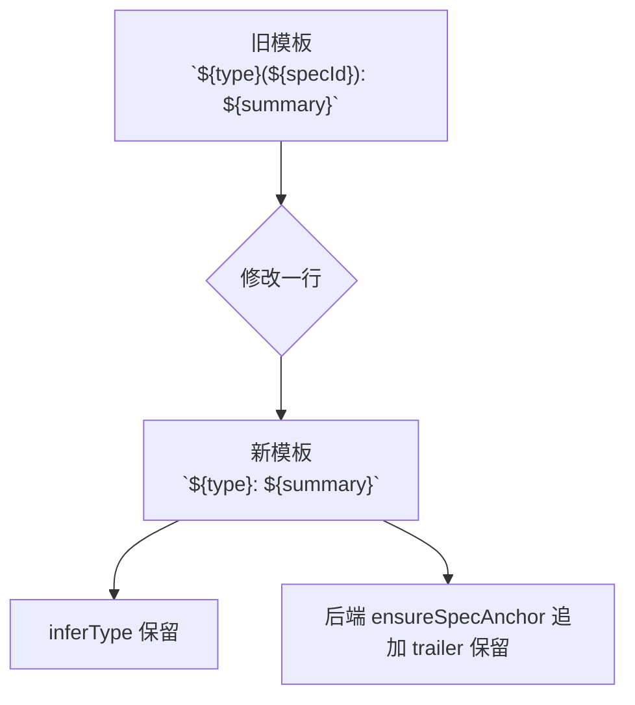

# 简化 review 页 commit message 默认模板：移除 scope

## 1. 背景

在 review 界面提交代码时，当前生成的 Git commit message 形如：

```
fix(260630.fix.narrative-preview-parse-400): 修复 ScreenplayDetail 解析剧情树时 narrative-preview 接口耗时 62s 后返回 400 的问题，让 LLM 输出的局部错误不再导致整张 payload 被丢弃，并保

[spec:260630.fix.narrative-preview-parse-400]
```

期望去掉 `(scope)` 部分以及外层括号，让默认 message 形如 `fix: …`，整体更简洁；spec 关联仍由消息尾部的 `[spec:<id>]` trailer 承担。

## 2. 需求

- 修改 review 页生成的默认 commit message 模板，从 `${type}(${specId}): ${summary}` 简化为 `${type}: ${summary}`。
- 保留 type 推断逻辑（仍从 `specId` 中提取 `feat|fix|refct`）。
- 保留消息末尾的 `[spec:<id>]` trailer（由后端在提交前自动附加）。
- 用户仍可在 textarea 中自由编辑默认 message。

## 3. 现状分析

### 3.1 默认 message 生成位置

`src/gui/src/pages/SpecReview.tsx:124-128`：

```ts
function buildDefaultMessage(spec: SpecDetail | undefined, specId: string): string {
  const type = inferType(specId)
  const summary = (spec?.frontmatter.summary ?? '').trim().slice(0, 100) || '(待 Agent 补全)'
  return `${type}(${specId}): ${summary}`
}
```

`inferType` 同文件 `:130-134` 从 `specId.split('.')[1]` 中提取 `feat|fix|refct`，默认 `feat`。

### 3.2 后端提交流程

- `src/service/routes/specs.ts` `POST /specs/:id/commit`（≈ `:202-263`）：直接接收前端传入的 message，不做格式重组。
- 同文件 `ensureSpecAnchor()`（≈ `:13-19`、调用点 `:243`）：通过正则 `/\[spec:[^\]]+\]/` 检测，若不存在则追加 `\n\n[spec:${specId}]\n`，保证 spec 关联始终存在。
- `src/service/git.ts` `commit()`（≈ `:168-180`）：仅把 message 透传给 `git commit -m`。

结论：移除前端 scope 不影响后端，spec 关联通过 trailer 即可继续追踪。

### 3.3 历史 spec 文档中的相关描述

`.yorz/specs/260619.feat.review-page/spec.md:179` 记录了旧模板 `${type}(${specId}): ${spec.summary}`；属于历史 spec 的归档信息。已确认：本次只改源代码，不动历史 spec 文档。

### 3.4 测试覆盖

`src/service/__tests__/service.test.ts` 覆盖 commit 接口的成功/失败路径，但未对 `type(scope): subject` 字面格式做断言，前端模板调整不会引发回归失败。

```mermaid
flowchart LR
  A[SpecReview.tsx<br/>buildDefaultMessage] -->|默认填入 textarea| B[用户可编辑]
  B -->|POST /specs/:id/commit| C[routes/specs.ts]
  C -->|ensureSpecAnchor 追加 [spec:id]| D[git.ts commit]
  D -->|git commit -m| E[(repo)]
```

## 4. 技术实现方案

### 4.1 核心改动

修改 `src/gui/src/pages/SpecReview.tsx:127`，将：

```ts
return `${type}(${specId}): ${summary}`
```

改为：

```ts
return `${type}: ${summary}`
```

`inferType` 保留不变（仍需要从 `specId` 提取 type）。

### 4.2 影响面

- 仅前端默认 message 文案变更，textarea 行为、提交流程、后端 trailer 追加逻辑均无需改动。
- 已经手动改写过 message 的用户路径不受影响（用户输入优先级最高）。
- `src/service/__tests__/service.test.ts` 无断言依赖该格式，预期无 test 回归。
- 历史 spec 文档（如 `.yorz/specs/260619.feat.review-page/spec.md`）保留旧模板描述不动，作为归档信息。

### 4.3 验证手段

- 本地启动 GUI：进入任意 spec 的 review 页，确认默认 message 形如 `fix: …`，无 `(specId)` 片段。
- 提交一次（可选 dry-run 路径），确认最终 commit message 仍带 `[spec:<id>]` 尾部 trailer。
- 跑一次 `npm test`（或仓库等价命令），确认 service 测试通过。



## 5. 待确认问题

- 暂无

## 6. 任务清单

- [x] 修改 `src/gui/src/pages/SpecReview.tsx:127` `buildDefaultMessage` 返回值，从 `` `${type}(${specId}): ${summary}` `` 改为 `` `${type}: ${summary}` ``；验收：本地 review 页默认 message 形如 `fix: …`，无 `(specId)` 片段。

## 7. 追加任务

## 8. 执行记录

- 2026-06-30：完成 `src/gui/src/pages/SpecReview.tsx:127` 单行改动，`buildDefaultMessage` 返回 `` `${type}: ${summary}` ``。`inferType(specId)` 仍依赖 `specId` 参数，签名未变。未运行测试（改动仅为前端字符串模板，无相关断言；后续若有变更可由用户在 GUI review 页目视确认）。
