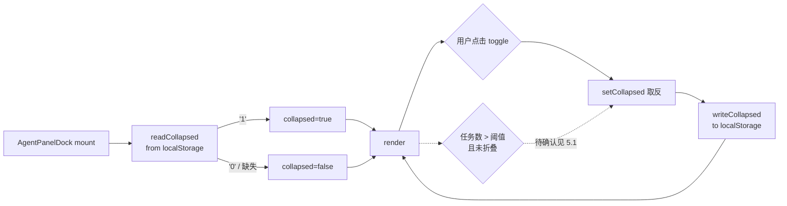

# 1. 背景

GUI 右下角的「Agent 任务日志、状态窗口」（`AgentPanelDock`）目前每次挂载都以固定的「展开」状态初始化，用户主动折叠后刷新页面又会被重置。希望把该窗口的展开/折叠状态记录到 localStorage，让浏览器刷新或重开后仍保持上次的选择。

# 2. 需求

- 用户在 `AgentPanelDock` 上主动切换展开/折叠时，状态需写入 localStorage。
- 页面刷新 / 应用重开 / 组件重新挂载时，`AgentPanelDock` 需从 localStorage 恢复上一次的展开/折叠状态，而非固定展开。
- 需处理与现有「任务数量超过阈值自动折叠一次」逻辑的交互，避免自动折叠覆盖用户已持久化的选择、或反过来让持久化状态压制新会话下的自动折叠体验（详见 [3.2](#32-与自动折叠一次逻辑的耦合)）。
- 不引入服务端持久化；仅使用浏览器 localStorage。

# 3. 现状分析

## 3.1 目标组件与现有状态

- 组件文件：`src/gui/src/components/AgentPanelDock.tsx`。
- 顶部折叠信号：`const [collapsed, setCollapsed] = createSignal(false)`（`AgentPanelDock.tsx:22`），初始值硬编码 `false` → 每次挂载都从「展开」起步，是本 spec 要解决的核心问题。
- 折叠切换入口：header 上的 toggle 按钮 `onClick={() => setCollapsed((v) => !v)}`（`AgentPanelDock.tsx:55`）。
- 自动折叠一次：当可见任务数 > `COLLAPSE_THRESHOLD = 3` 且当前未折叠时，自动 `setCollapsed(true)`（`AgentPanelDock.tsx:41-43`）。该分支会与「从 localStorage 恢复」形成耦合，详见 [3.2](#32-与自动折叠一次逻辑的耦合)。
- 单卡片的 `expanded`：由 `agentTasks` store 维护（`src/gui/src/lib/agent-tasks.ts:154` 默认 `true`），以 `runId` 为键。`runId` 每次会话都不同，且任务结束后条目会被清理，因此这类状态天然不适合跨刷新持久化（本 spec 默认不覆盖它，见 [5.3](#53-单任务卡片-expanded-是否一并持久化)）。

## 3.2 与「自动折叠一次」逻辑的耦合

`AgentPanelDock.tsx:41-43` 目前的语义是「任务多时自动折叠一次，用户仍可再展开」。引入持久化后，两种交互序列会产生歧义：

| 场景 | 上次持久化                        | 当前会话任务数 | 期望行为？               |
| ---- | --------------------------------- | -------------- | ------------------------ |
| A    | `collapsed=true`（用户主动折叠）  | ≤ 3            | 保持折叠（尊重用户）     |
| B    | `collapsed=false`（用户主动展开） | > 3            | 是否仍自动折叠一次？     |
| C    | 无持久化（首次访问）              | > 3            | 自动折叠一次（当前行为） |

场景 B 是唯一的争议点：如果继续自动折叠，用户会觉得"我明明选了展开还是被折了"；如果不折，长列表会立即撑满右下角。作为候选决议在 [5.1](#51-与自动折叠一次的关系) 中列出。

## 3.3 已有的 localStorage 参考实现

`src/gui/src/components/ProjectsSidebar.tsx:15-40` 已有一套 `readCollapsed` / `writeCollapsed` 模式：

- 键命名：`yorz.<component>.<field>`（例如 `yorz.projectsSidebar.collapsed`）。
- 存储形式：`'1' | '0'`（避免 `JSON.parse` 与解析异常）。
- 读写都用 `try/catch` 包裹并做 `typeof window !== 'undefined'` 守卫。
- 读失败/未初始化时回落到默认值。

本 spec 会直接复用这套约定，避免为一个布尔字段再造抽象层。

## 3.4 数据流示意



# 4. 技术实现方案

## 4.1 存储契约

- 键：`yorz.agentDock.collapsed`（沿用 `yorz.<componentCamel>.<field>` 命名与 `ProjectsSidebar` 保持同源）。
- 值：`'1'` 表示折叠，`'0'` 表示展开；其它 / 缺失一律按默认值处理。
- 默认值：`false`（保持首次访问时和现状一致：展开）。

## 4.2 组件改造

在 `src/gui/src/components/AgentPanelDock.tsx` 内新增两个模块级函数（不导出），紧邻 `COLLAPSE_THRESHOLD` 声明：

```ts
const COLLAPSED_KEY = 'yorz.agentDock.collapsed'

function readCollapsed(): boolean {
  try {
    return typeof window !== 'undefined' && window.localStorage.getItem(COLLAPSED_KEY) === '1'
  } catch {
    return false
  }
}

function writeCollapsed(value: boolean): void {
  try {
    if (typeof window !== 'undefined') {
      window.localStorage.setItem(COLLAPSED_KEY, value ? '1' : '0')
    }
  } catch {
    // ignore quota / access errors
  }
}
```

组件内两处改动：

1. 初始化：`const [collapsed, setCollapsed] = createSignal(readCollapsed())`（取代硬编码 `false`）。
2. toggle 回调：改成先算新值再写入，保证 signal 与 localStorage 同步。

```tsx
onClick={() => {
  const next = !collapsed()
  setCollapsed(next)
  writeCollapsed(next)
}}
```

## 4.3 与「自动折叠一次」的默认处理

本方案**默认策略**：仅在「未持久化过」的情况下允许自动折叠一次；一旦用户手动切换过（无论折叠或展开）就不再自动折叠。落地做法：

- 用一个模块级 `hasPersisted` 标志（读 localStorage 时若原值是 `'1'`/`'0'` 之外的都视为未持久化）。
- 在 `visibleTasks().length > COLLAPSE_THRESHOLD` 自动折叠分支加条件：仅 `!hasPersisted` 时才触发；自动折叠后同步 `writeCollapsed(true)` 并把 `hasPersisted` 置为 `true`。

该策略是待确认问题 [5.1](#51-与自动折叠一次的关系) 的推荐选项；若用户选择其它候选，需回来调整此段。

## 4.4 测试与验证思路

- **手动 e2e**：`pnpm gui:dev`（或对应脚本）打开 GUI，触发一次 Agent 任务让 dock 出现 → 折叠 → 刷新 → 期望仍折叠；再展开 → 刷新 → 期望仍展开。
- **单元测试**：`AgentPanelDock` 目前未见独立单测；若已有集成/组件测试文件（`src/gui/**/__tests__/`）则补一个 mock `window.localStorage` 的 case。若无现成测试宿主，本次不新引入测试框架，改由手动验证覆盖。
- **回归点**：ProjectsSidebar 的折叠仍需正常工作（无键冲突）。

## 4.5 兼容与回滚

- 新增键独立命名，不影响老用户已有 localStorage 数据。
- 回滚只需还原对该文件的改动；localStorage 中残留的键无副作用。

# 5. 待确认问题

- 暂无

已决议（供追溯）：

- 5.1 与「自动折叠一次」的关系：采用推荐方案——保留自动折叠一次，但仅在「从未持久化」时生效；用户任何一次手动切换后不再触发自动折叠。落地即 [4.3](#43-与自动折叠一次的默认处理)。
- 5.3 单任务卡片 `expanded` 是否一并持久化：采用推荐方案——不持久化，仅持久化 dock 顶层折叠状态。

# 6. 任务清单

- [x] 在 `src/gui/src/components/AgentPanelDock.tsx` 顶部新增 `COLLAPSED_KEY` 常量与 `readCollapsed()` / `writeCollapsed()` 模块级函数（不导出），签名与 `ProjectsSidebar` 同源；同时新增模块级 `hasPersisted` 标志，`readCollapsed` 探测 `'1'|'0'` 时置为 `true`。验收：typecheck 通过、无新增 lint 警告。
- [x] 将 `AgentPanelDock` 内 `const [collapsed, setCollapsed] = createSignal(false)` 改为 `createSignal(readCollapsed())`。验收：手动折叠后刷新页面仍为折叠、手动展开后刷新仍为展开。
- [x] 修改 header toggle 的 `onClick`：先计算 `next = !collapsed()`，`setCollapsed(next)` 后调用 `writeCollapsed(next)` 并置 `hasPersisted = true`。验收：任一手动切换后 `yorz.agentDock.collapsed` 立即更新为 `'1'|'0'`。
- [x] 修改 `visibleTasks().length > COLLAPSE_THRESHOLD` 自动折叠分支：仅在 `!hasPersisted` 时才 `setCollapsed(true)`，触发后同步 `writeCollapsed(true)` 并置 `hasPersisted = true`。验收：已持久化 `collapsed=false` 的用户在任务数超阈值时不会被自动折叠；从未持久化的用户首次任务数超阈值时仍会自动折叠一次并写入 localStorage。
- [x] 运行 GUI 侧 typecheck / build（若可用）与 prettier 格式化本 spec。验收：无新增 TS 或构建错误；spec md 结构与 frontmatter 保持不变。

# 7. 追加任务

- 暂无

# 8. 执行记录

- 2026-07-01 13:34:39 · 新建 spec，完成 plan 阶段初稿，输出 2 条待确认问题，等待用户批注。
- 2026-07-01 13:41:30 · 消费 5.1/5.3 批注（均接受推荐），清理 `！！！` 并将待确认问题置为「暂无」；按 4.3 方案拆出 5 条任务，进入 execute。
- 2026-07-01 13:43:30 · 在 `src/gui/src/components/AgentPanelDock.tsx` 新增 `COLLAPSED_KEY` / `readCollapsed` / `writeCollapsed` 与模块级 `hasPersisted` 标志；`collapsed` signal 初始化改为 `readCollapsed()`；toggle onClick 改为写入 localStorage 并置 `hasPersisted=true`；自动折叠分支加 `!hasPersisted` 守卫，触发后同步写入。验证：`pnpm run build:gui` 通过（4.55s，无 TS/构建错误）；`pnpm exec prettier --write` 对 spec 与该 tsx 通过。手动 e2e 建议：`pnpm dev` 后触发 Agent 任务 → 折叠 → 刷新应保持折叠；再展开 → 刷新应保持展开；`ProjectsSidebar` 折叠不受影响（键名不冲突）。
