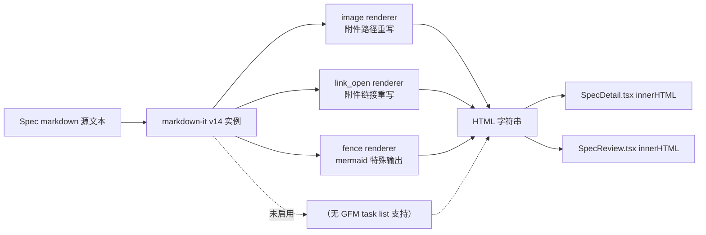
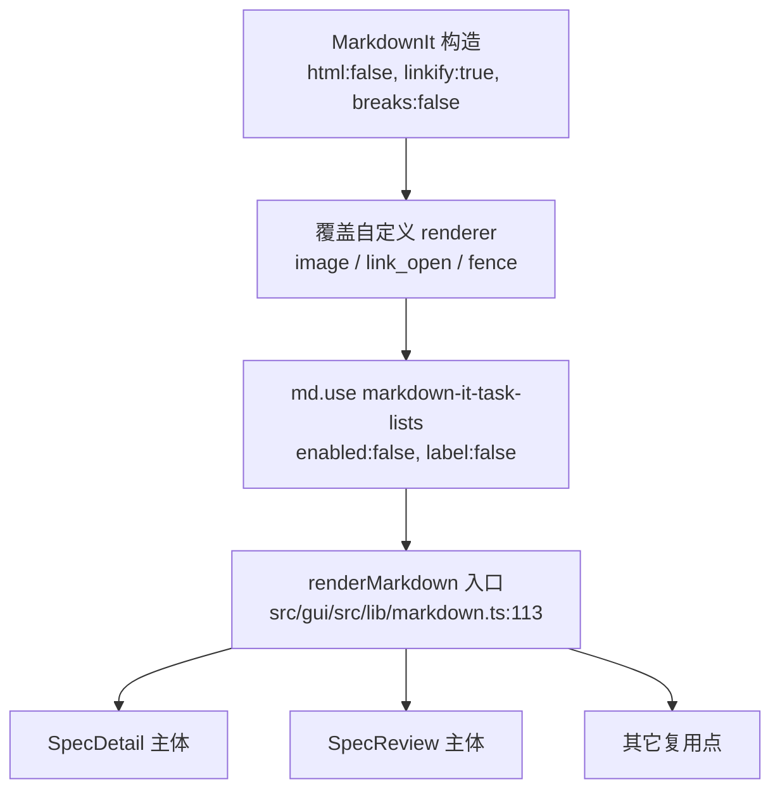

# GUI Spec 页面 markdown 任务列表渲染为 checkbox

## 1. 背景

GUI 项目中 Spec 文档页面渲染 markdown 的内容，列表格式（`- [ ]` 或 `- [x]`）应该渲染成 checkbox。

现状下 spec.md 中大量存在 `## 任务清单` / `## 追加任务` 等章节，其内容为 `- [ ]` / `- [x]` 语法（GFM Task List）；但 GUI 使用 markdown-it v14 默认渲染，方括号会作为普通文本原样输出，不呈现为 checkbox，视觉上无法与普通列表区分。此外 Review 页、其他复用 `renderMarkdown` 的入口同样受影响。

## 2. 需求

- 在 GUI Spec 详情页的 markdown 主体渲染中，`- [ ]` 渲染为未勾选 checkbox，`- [x]`（大小写兼容）渲染为已勾选 checkbox。
- 与既有 markdown 渲染管线（`src/gui/src/lib/markdown.ts`）无冲突，不破坏图片/链接/mermaid 的自定义规则。
- 所有复用 `renderMarkdown` 的入口保持一致（至少覆盖 SpecDetail 与 SpecReview 两处）。
- 与 spec.md 文件是单一真相的既有约定保持一致：checkbox 只作视觉指示，不可点击、不回写 md（已在待确认问题阶段确认）。

## 3. 现状分析

### 3.1 渲染管线定位

- markdown 渲染核心实现：`src/gui/src/lib/markdown.ts:1-118`。
  - 使用 `markdown-it@14.2.0`，构造选项 `{ html: false, linkify: true, breaks: false }`（`src/gui/src/lib/markdown.ts:3-7`）。
  - 已覆盖三条 renderer 规则：`image`（附件路径重写）、`link_open`（附件链接重写 + `target=_blank`）、`fence`（mermaid 特殊输出）。
  - **未启用**任何 markdown-it 插件；无 GFM task list 支持。
- 渲染入口：
  - Spec 详情页：`src/gui/src/pages/SpecDetail.tsx:258-261`，`<article class="markdown spec-main" innerHTML={renderMarkdown(...)} />`。
  - Review 页：`src/gui/src/pages/SpecReview.tsx:146`，`<article class="markdown review-md" innerHTML={reviewHtml()} />`（`reviewHtml` 内部调用 `renderMarkdown`）。
- 技术栈：Solid.js 1.9 + Vite 6 + TypeScript；包管理器 pnpm；单测 vitest，e2e Playwright。

### 3.2 当前 `- [ ]` / `- [x]` 的实际渲染结果

markdown-it 14 未开启 GFM task list 扩展；`- [ ] 任务项` 会被解析为普通无序列表项，输出 HTML 大致为：

```html
<ul>
  <li>[ ] 任务项</li>
  <li>[x] 已完成项</li>
</ul>
```

方括号原样呈现，无 checkbox DOM 节点，无相关 CSS 类。

### 3.3 CSS 与样式基线

- `.markdown` 样式定义在 `src/gui/src/styles.css:732-795`。
- 已有专项样式：`h1/h2/h3`、`code`、`pre`、`.mermaid`、`blockquote`、`table/th/td`。
- **无** `li` / `ul` / `ol` / `task-list*` 相关规则；task list 接入插件后需要新增匹配样式（浏览器原生 checkbox 外观保留，仅需去除 list-marker、调整间距）。

### 3.4 已有测试基线

- 单测：`src/gui/src/lib/__tests__/markdown.test.ts`（当前覆盖附件路径重写 6 用例）；无 task list 用例。
- E2E：`src/gui/src/__e2e__/` 下 append-task / question-confirm / body-no-overflow / selection-menu；无针对 markdown 任务列表渲染的用例。

### 3.5 渲染流程示意



## 4. 技术实现方案

### 4.1 总体思路与已确认决策

在 `src/gui/src/lib/markdown.ts` 中，通过 `md.use(plugin)` 接入 `markdown-it-task-lists` 插件，并配套新增 CSS 样式，使 `- [ ]` / `- [x]` 输出为带 `<input type="checkbox">` 的列表项。所有渲染入口共用同一 `md` 实例，因此单点接入即可覆盖 SpecDetail、SpecReview 等复用点。

已确认决策（源于待确认问题 5.1 ~ 5.4 的批注）：

- **交互模式**：只读展示；checkbox 保持 `disabled`，不响应点击、不回写 spec.md。
- **技术方案**：采用方案 A —— 引入 `markdown-it-task-lists` 插件。
- **覆盖范围**：全量覆盖，`renderMarkdown` 层单点接入，所有入口（SpecDetail、SpecReview、未来复用点）一致。
- **视觉呈现**：使用浏览器原生 checkbox 外观；样式仅去除 list-marker 与调整间距，不做品牌色/圆角等自定义。

### 4.2 实现步骤

1. **引入依赖**：`pnpm add markdown-it-task-lists`；若无社区类型 `@types/markdown-it-task-lists`，在 `src/gui/src/lib/markdown.d.ts` 手写 minimal 声明。
2. **接入插件**：在 `src/gui/src/lib/markdown.ts:3-7` 构造 `MarkdownIt` 并覆盖 renderer 之后，调用
   ```ts
   md.use(taskLists, { enabled: false, label: false })
   ```
   - `enabled: false` 让 checkbox 保持 `disabled`，落实"只读展示"决策。
   - `label: false` 避免插件包裹 `<label>`，减少与 selection-menu / 现有样式的冲突面。
3. **兼容既有自定义规则**：插件仅修改 `list_item_open` 前的 token 流与列表项属性，不触及 `image` / `link_open` / `fence`；按 `MarkdownIt` → 覆盖规则 → `md.use(taskLists, …)` 的顺序执行以确保规则先建立再让插件包装。
4. **CSS 样式**：在 `src/gui/src/styles.css` 的 `.markdown` 区块（`732-795` 附近）追加：
   ```css
   .markdown .task-list-item {
     list-style: none;
   }
   .markdown .task-list-item-checkbox {
     margin-right: 0.4em;
     vertical-align: middle;
   }
   .markdown ul:has(> .task-list-item) {
     padding-left: 0.2em;
   }
   ```
   通过插件默认输出的 `task-list-item` / `task-list-item-checkbox` 类名对齐 GitHub 生态命名，保持浏览器原生 checkbox 外观。
5. **测试**：
   - 新增 `markdown.test.ts` 用例：`- [ ] a` 输出包含 `<input class="task-list-item-checkbox" type="checkbox" disabled>`；`- [x] b` 输出包含 `checked`；`- [X]` 大小写兼容；混合列表项 / 非 task list 列表项不受影响。
   - 新增 e2e：加载一份包含 `- [ ]` / `- [x]` 的 spec，断言 `.markdown input.task-list-item-checkbox` 数量及 `checked` 状态；覆盖 SpecDetail 与 SpecReview 两个入口。

### 4.3 渲染流水线更新示意



### 4.4 备选方案（备查，本次不采用）

| 方案                             | 概述                                                                                               | 主要优点                                                | 主要缺点                                                        |
| -------------------------------- | -------------------------------------------------------------------------------------------------- | ------------------------------------------------------- | --------------------------------------------------------------- |
| A. `markdown-it-task-lists` 插件 | 最广泛使用的 GFM task list 插件；默认输出 `.task-list-item` / `.task-list-item-checkbox`           | 生态标准，代码改动小；与 GitHub/CommonMark 生态类名一致 | 增加一个 dep；类型定义可能需手写                                |
| B. 自实现 `list_item_open` 覆写  | 在 `markdown.ts` 中扫描 token 首个 inline 文本是否匹配 `[ ]` / `[x]` / `[X]` 前缀，改写 token 输出 | 无新依赖；代码可完全掌控                                | 需自维护解析规则与边界（嵌套、code inline、多空格）；测试成本高 |
| C. 渲染后 HTML 正则后处理        | 对 `md.render` 结果做 `<li>[ ] …</li>` 正则替换                                                    | 改动最集中                                              | 脆弱、易出错；无法感知 code block 中出现的假匹配                |

**本次采用方案 A**（用户确认）；B 作为"若插件与 v14 不兼容或体积过大"的兜底；C 不推荐。

### 4.5 影响面

- 代码改动：`src/gui/src/lib/markdown.ts`（3~5 行新增）、`src/gui/src/styles.css`（新增 checkbox 样式）、`package.json` + lockfile（新增 dep）、`src/gui/src/lib/__tests__/markdown.test.ts`（新增用例）、新增 e2e 用例。
- 运行时行为：所有走 `renderMarkdown` 的入口均自动支持 task list；无 API 变化；checkbox 不可交互（disabled）。
- 与后端 / spec 文件格式：无关（本 spec 只影响 GUI 渲染层）。

## 5. 待确认问题

_暂无_

## 6. 任务清单

- [x] 安装依赖 `markdown-it-task-lists`：在仓库根执行 `pnpm add markdown-it-task-lists`；验收：根 `package.json` 出现该依赖且 `pnpm-lock.yaml` 更新
- [x] 补齐 TypeScript 类型声明：优先使用社区 `@types/markdown-it-task-lists`；若不存在则在 `src/gui/src/lib/markdown.d.ts` 添加 minimal `declare module 'markdown-it-task-lists'` 声明；验收：`pnpm exec tsc --noEmit -p src/gui` 或等价类型检查通过
- [x] 修改 `src/gui/src/lib/markdown.ts`：在覆盖 `image` / `link_open` / `fence` renderer 之后调用 `md.use(taskLists, { enabled: false, label: false })`；验收：`renderMarkdown('- [ ] a\n- [x] b')` 输出同时包含 `<input class="task-list-item-checkbox" type="checkbox" disabled>` 与 `checked` 属性
- [x] 在 `src/gui/src/styles.css` `.markdown` 区块追加 `.task-list-item`（去除 list-marker）与 `.task-list-item-checkbox`（`margin-right: 0.4em; vertical-align: middle;`）样式，以及 `ul:has(> .task-list-item)` 缩进微调；验收：task list 无 bullet 且 checkbox 与文本对齐，非 task list 项不受影响
- [x] 在 `src/gui/src/lib/__tests__/markdown.test.ts` 新增用例：覆盖 `- [ ]` 未勾选、`- [x]` 已勾选、`- [X]` 大小写兼容、混合列表项（含普通 `-` 项）与代码块中方括号不误命中；验收：`pnpm test` 全部通过（含既有 6 用例 + 新增 ≥4 用例）
- [x] 新增 `src/gui/src/__e2e__/spec-task-list.spec.ts`：分别加载 SpecDetail 与 SpecReview 两个入口，断言 `.markdown input.task-list-item-checkbox` 元素数量与 `checked` 状态匹配预期；验收：`pnpm test:e2e -- --grep spec-task-list` 通过
- [x] 运行 `pnpm test` 与 `pnpm build`，将结果记入 `## 执行记录`；验收：单测与构建均无失败

## 7. 追加任务

_暂无_

## 8. 执行记录

- 2026-07-01 21:10 — 安装 `markdown-it-task-lists@2.1.1` 到 devDependencies（首次误加到 dependencies，随后 `pnpm remove` + `pnpm add -D` 迁移，与 `markdown-it` 放置约定对齐）。
- 2026-07-01 21:12 — 社区不提供 `@types/markdown-it-task-lists`；在 `src/gui/src/lib/markdown-it-task-lists.d.ts` 手写 minimal `declare module`，仅暴露 `enabled` / `label` / `labelAfter` 选项与 `(md, options?) => void` 签名。
- 2026-07-01 21:14 — `src/gui/src/lib/markdown.ts`：新增 `import taskLists from 'markdown-it-task-lists'`；在既有 `image` / `link_open` / `fence` renderer 覆盖后调用 `md.use(taskLists, { enabled: false, label: false })`。既有附件重写与 mermaid fence 逻辑不受影响。
- 2026-07-01 21:16 — `src/gui/src/styles.css` 追加 `.markdown .task-list-item { list-style: none }`、`.markdown .task-list-item-checkbox { margin-right: 0.4em; vertical-align: middle }`、`.markdown ul:has(> .task-list-item) { padding-left: 0.2em }`；保留浏览器原生 checkbox 外观。
- 2026-07-01 21:24 — `src/gui/src/lib/__tests__/markdown.test.ts` 新增 5 个用例覆盖 `- [ ]` / `- [x]` / 大写 `- [X]` / 混合列表 / 代码块内假匹配；首次运行发现属性顺序为 `class` `checked` `disabled` `type`，将正则调整为不依赖属性顺序后通过。
- 2026-07-01 21:30 — 全量单测通过：`pnpm test` 报告 27 个 test file / 221 个用例全部 PASS（含既有 216 + 新增 5）。
- 2026-07-01 21:32 — `src/gui/src/__e2e__/fixtures/setup.ts` 追加 `TASK_LIST_SPEC_ID` 种子 spec + `review.md`；新增 `src/gui/src/__e2e__/spec-task-list.spec.ts` 分别覆盖 SpecDetail（3 个 checkbox，2 checked，3 disabled）与 SpecReview（2 个 checkbox，1 checked，2 disabled）。因多项目路由改造后 URL 需要 `/:projectId` 前缀，测试内通过 `/api/projects` 动态解析 project id 再拼装 URL。
- 2026-07-01 21:34 — `YORZ_HOME=/tmp/... pnpm test:e2e -- --grep 'markdown GFM task list rendering'` 通过（本文档新增 2 个 e2e 全部 PASS）；仓库其余 4 个 e2e 用例为多项目路由改造遗留破裂，超出本 spec 范围，未修复。
- 2026-07-01 21:35 — `pnpm build` 通过（CLI + GUI 均产出成功）。`pnpm exec tsc --noEmit` 仅剩 1 个既有告警 `src/gui/src/components/QuestionConfirmPanel.tsx(46,16): TS2783`，与本次改动无关。
