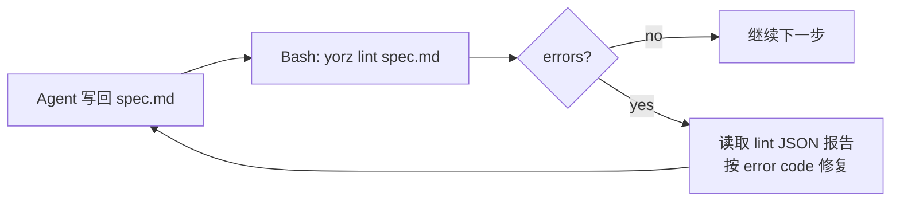

# spec-md-content-lint · 为 spec.md / review.md 引入内容格式 lint 机制

## 1. 背景

当前 YorZ 工作流以 `spec.md` / `review.md` 等 markdown 文档为中心，且这些内容都由 Agent（LLM）生成。LLM 的输出稳定性有限，即使 `src/skill/yorz-spec/` 各阶段文档已用「产出前自检 checklist」「正反例」反复强调，仍会周期性出现结构偏差，导致 GUI 解析、跨阶段路由或 mermaid 渲染受阻。近期已经观察到的问题：

- `.yorz/specs/260701.feat.agent-panel-collapse-persist/spec.md`：把「背景 / 需求 / 现状分析 …」等章节写成 `# ` 一级标题（而 conventions.md 明确要求二级标题带 `## N. ` 编号、一级标题仅用于文档标题）。
- `.yorz/specs/260701.fix.body-scrollbar-overflow/spec.md`：整篇未生成 `# ` 一级标题。
- 「待确认问题」章节结构不稳定（例：缺 `(推荐)` / 有多个推荐 / 用无序列表写候选 / 用散文写候选），已经出现过 GUI 无法解析 → 问题面板空白的场景。
- mermaid 代码片段偶发语法错误（节点 id 与保留字冲突、`end` 全小写、括号未闭合等），前端渲染直接抛错。

用户明确诉求：**用可执行的 lint 脚本兜住"文档格式"这条底线**，让 Agent 每次写回 MD 后自检，并据此把 skill 里的部分口头约束（反例列表、"产出前 checklist"等重复说教）收敛到 lint 规则里。

## 2. 需求

- 提供一个 lint 脚本，覆盖 `src/skill/yorz-spec/` 各文档中已明确的 MD 规则（frontmatter、章节齐全、标题编号、待确认问题结构、任务清单格式、追加任务状态、mermaid fence …）。
- 用单元测试覆盖每条规则的正/反例，保证 lint 逻辑与 skill 规则同源、不漂移。
- 排查 mermaid 官方是否提供 lint / parse-only API；若可行，把 mermaid 语法校验也纳入本 lint。
- 让 Agent 在**任意阶段**写回 `spec.md` / `review.md` 后主动运行 lint；命中 error 时按错误信息修改直到通过。
- 用 lint 替代 skill 中的部分重复口头约束（`plan.md` 的「产出前自检 checklist」「反例 ❌ 1~7」等）：口头留一句「以 lint 报告为准」，具体判定交给规则代码。
- 规则应"由数据驱动"：新增/修改规则时只需改规则代码 + 补测试用例，Agent 无需重训。

## 3. 现状分析

### 3.1 MD 规则来源盘点

skill 内已明确、可机械化校验的规则（按现有文档来源）：

| 来源                | 规则                                                                                                                                                                   |
| ------------------- | ---------------------------------------------------------------------------------------------------------------------------------------------------------------------- |
| `conventions.md`    | frontmatter 4 字段齐全、顺序固定；`updated_at` 秒级并带单引号；二级 `## N. ` / 三级 `### N.M ` 编号连续。                                                              |
| `rewrite-rules.md`  | 六大必备章节完整；`## 追加任务` 位置在 `## 任务清单` 与 `## 执行记录` 之间。                                                                                           |
| `plan.md`           | `## 待确认问题` 结构（三级标题问题 + 一级有序列表候选 + 恰 1 个 `(推荐)`；或 `（自由文本）` 后缀；空态 `_暂无_`）；禁止无序列表候选；禁止"以推荐项为名"额外条目。      |
| `tasks.md`          | 任务清单仅单层 `- [x] / - [x]`；每项含动作+对象+验收点（可做启发式，不强校验）。                                                                                       |
| `execute.md`        | 追加任务条目格式 `- [open\|fixed] [feat\|refct\|fix] ...`。                                                                                                            |
| `mermaid.md`        | mermaid 代码必须 ` ```mermaid ` 代码块包裹；语法可渲染。                                                                                                               |
| `review.md` (skill) | `review.md` 顶部一级标题 `# Review · <spec-id>`；每条 review 二级标题为 `## YYYY-MM-DD HH:mm:ss`；每条含 4 个固定三级小节（变更总结/影响范围/风险提醒/变更文件清单）。 |

`review.md`（用户批注引用的旧 review 文档）与 skill 的 `review.md` 规范同源，本 spec 讨论的 lint 目标是**用户 spec 目录下**的 `review.md`。

### 3.2 已有可复用能力

- `src/service/spec-store.ts` 已用 `gray-matter` 解析 frontmatter，并维护 `SECTIONS = ['## 背景', '## 需求', ...]`；本 lint 可复用其 constants，避免规则漂移。
- `package.json` devDependencies 已有 `markdown-it@14`（可用于 tokenize）、`mermaid@11`（含 `mermaid.parse` API）、`vitest@2`、`gray-matter@4`。**不需要新增运行时依赖**即可实现绝大多数规则。
- 现有测试基座：`src/skill/__tests__/yorz-spec-docs.test.ts`（关键词存在性）与 `src/service/__tests__/*.test.ts` 均已经 vitest 化。
- CLI 目前 (`src/cli/index.ts`) 已有 `init / install / uninstall / add / serve` 子命令，插入 `lint` 子命令的落地路径清晰。

### 3.3 mermaid 语法校验可行性

`node_modules/mermaid/dist/mermaid.d.ts` 已声明 `parse: typeof mermaidAPI.parse`，签名支持 `{ suppressErrors: true }`。但 mermaid v11 的 `parse` 依赖 DOM/globalThis 环境，直接在 Node 里 `import 'mermaid'` 会因缺 `document` / `window` 报错。可选方案：

- 方案 A：在 lint 执行时按需 `import('jsdom')` + `import('mermaid')`，构造 DOM shim。缺点：新增 dev 依赖 `jsdom`（~2MB）。
- 方案 B：只做"fence 与 diagram type 声明"层面的静态校验（是否 ` ```mermaid ` 起头、是否首行是已知 diagram type、是否括号/引号平衡）——**不接入真正的解析器**。零依赖，但覆盖不到深层语法错误。
- 方案 C（**已在 execute 阶段实测验证失败**）：引入 `@mermaid-js/parser@1.2.0` 纯 CST parser 包。实测该包**仅**支持新一代 Langium 化的 diagram：`info / packet / pie / treeView / architecture / gitGraph / eventmodeling / radar / railroad* / treemap / wardley / cynefin`；对本项目 spec 里主要使用的 `flowchart / sequenceDiagram / classDiagram / stateDiagram / erDiagram / gantt / mindmap / journey / xychart` 全部 throw `Unknown diagram type`。也就是说 5.2 选项 3 无法覆盖真实场景，需要重新决策。
- 方案 D（新增，作为方案 A 的替代深校验路径）：直接以 CLI 方式调用 `npx mmdc`（`@mermaid-js/mermaid-cli`）+ `--dry-run` 类语法校验；实现简单、覆盖全 diagram type，但需要 puppeteer/chromium 一次性下载（~200MB），CI 成本高。

选型作为待确认问题 [5.2](#52-mermaid-语法校验策略)。

### 3.4 Agent 触发方式盘点

lint 可用触发点：

- **Agent 侧（本 skill 内约束）**：在 `SKILL.md` / 各阶段文档增加"写回后运行 lint"的硬约束，通过 Bash 调用 CLI 子命令拿到结果。
- **service 侧（写回时自动）**：`spec-store.ts` 在保存 spec 时同步校验，命中 error 直接 reject。风险：若 lint 与 skill 之间存在暂时性偏差，会阻断合法写入。
- **CI**：pre-commit / GitHub Actions 兜底。

MVP 落点见 [5.1](#51-lint-触发方式)。

### 3.5 lint 输出与 Agent 消费回路



规则报告需要机器友好，便于 Agent 直接消费；文本格式（供人看）与 JSON 格式（供 Agent 解析）二选一或双输出，见 [5.3](#53-lint-报告输出格式)。

### 3.6 skill 精简边界

`plan.md` 现有的「产出前自检 checklist」「反例 ❌ 1~7」等段落约占 90 行，主要是把待确认问题结构规则用中文重复讲了 3 次。若 lint 能可靠捕获同类问题，可以把这几段收敛为一句「产出前请调用 `yorz lint <spec_path>`；细则以 lint 规则为准」。但过度删减会让"不跑 lint 时"的 Agent 失去指引。精简程度作为待确认问题 [5.4](#54-skill-文档精简程度)。

### 3.7 追加任务：非必备章节的重定位

在执行本 spec 的过程中观察到：`## 追加任务` 仅在用户通过 GUI/CLI 主动追加时才有实际内容，绝大多数 spec 长期只有一条 `- 暂无` 占位。因此把它列为"必备章节"既与其"由用户额外操作产生"的语义不符，又会污染新建骨架、令 lint `sections/required` 报出无意义 error（例如 [`260701.fix.body-scrollbar-overflow/spec.md`](../260701.fix.body-scrollbar-overflow/spec.md) 就因缺 `## 追加任务` 命中过 `sections/required`）。

当前把 `追加任务` 视为必备的落点：

| 位置                                       | 影响                                                                 |
| ------------------------------------------ | -------------------------------------------------------------------- |
| `src/lint/rules/sections.ts::REQUIRED_ORDER` | `sections/required` 强制要求存在。                                 |
| `src/lint/rules/headings.ts::REQUIRED_SECTIONS` | `heading/section-level` 把 `# 追加任务` 视作误写误报。         |
| `src/service/spec-store.ts::SECTIONS`       | `renderInitialSpec` 在初始化时写入空的 `## 追加任务`。              |
| `src/service/worktree-manager.ts`           | worktree 合并冲突 spec 模板固定包含 `## 7. 追加任务` + `- 暂无`。   |
| `src/skill/yorz-spec/*.md` / `index.json`   | 「六大必备章节」表述、new-spec 骨架列表均含 `追加任务`。            |

保留"若存在则位置固定在 `## 任务清单` 与 `## 执行记录` 之间"的约束仍然合理：位置一旦漂移会破坏 `mergeAppendTasksEntry` 的懒插入逻辑。

## 4. 技术实现方案

### 4.1 模块划分

新增目录 `src/lint/`，落点：

- `src/lint/spec-md-lint.ts` — `lintSpecMd(text: string, opts?): LintReport` 主入口。
- `src/lint/review-md-lint.ts` — `lintReviewMd(text: string): LintReport`。
- `src/lint/rules/` — 每条规则一个文件（如 `frontmatter.ts`、`headings.ts`、`pending-questions.ts`、`task-list.ts`、`append-tasks.ts`、`mermaid.ts`、`review-sections.ts` …）。
- `src/lint/index.ts` — 汇总导出 + `lintFile(path)` 便捷函数（按文件名后缀分派 spec vs review）。
- `src/lint/__tests__/` — 每条规则独立 spec 文件，正反例齐全。

CLI 层：

- `src/cli/lint.ts` — 实现 `runLint({ paths, format })`。
- `src/cli/index.ts` 增加 `yorz lint [paths...] --format text|json --all`：
  - 无参 + `--all`：扫描当前 project 的 `<specsDir>/**/spec.md` + `<specsDir>/**/review.md`。
  - 指定 path：只 lint 该文件。
  - 默认 `--format text`（人读），CI/Agent 传 `--format json`。
  - 退出码：有 error → 1；仅有 warn → 0。

### 4.2 规则模型

```ts
export type LintSeverity = 'error' | 'warn'
export interface LintFinding {
  ruleId: string
  severity: LintSeverity
  message: string
  line?: number
  column?: number
  hint?: string
}
export interface LintRule {
  id: string
  description: string
  check(ctx: LintContext): LintFinding[]
}
export interface LintContext {
  raw: string
  frontmatter: Record<string, unknown> | null
  body: string
  tokens: Token[] // markdown-it tokens
  filePath?: string
  kind: 'spec' | 'review'
}
```

- 使用 `markdown-it` 得到 token 流（无需 render）；frontmatter 单独用行前缀正则识别（不能只走 gray-matter，因为要区分"字段引号是否存在"）。
- 每条 rule 在 `check` 内返回 findings 数组；聚合层负责去重、按行号排序。

### 4.3 规则清单（MVP 内实现）

| ruleId                                 | severity | 描述                                                                                                                    |
| -------------------------------------- | -------- | ----------------------------------------------------------------------------------------------------------------------- |
| `frontmatter/required-fields`          | error    | 存在 frontmatter，`stage/last_action/updated_at/summary` 齐全、顺序固定，无额外字段。                                   |
| `frontmatter/updated-at`               | error    | `updated_at` 值形如 `YYYY-MM-DD HH:mm:ss`，原文中带单引号。                                                             |
| `frontmatter/summary-length`           | warn     | `summary` 长度 ≤ 200 且非空。                                                                                           |
| `heading/h1-single`                    | error    | body 中一级标题（`# `）出现 ≤ 1 次；若出现，必须位于所有二级标题之前。                                                  |
| `heading/section-level`                | error    | 六大必备章节必须以 `## ` 出现（不允许写成 `# `）。                                                                      |
| `heading/numbering`                    | error    | `## ` 编号按出现顺序 `1. / 2. / …`；`### ` 编号在所属二级下 `N.M` 连续、不跳号。                                        |
| `sections/required`                    | error    | 六大必备章节齐全且按 `现状分析→技术实现方案→待确认问题→任务清单→追加任务→执行记录` 顺序。                               |
| `pending-questions/structure`          | error    | 每条问题是 `### N.M` 三级标题；候选项用 `1. ` 有序列表；恰 1 个 ` (推荐)` / ` （推荐）`；或标题以 `（自由文本）` 结尾。 |
| `pending-questions/empty`              | error    | 空态整章仅一行 `_暂无_`，不允许 `- 暂无` / 无内容。                                                                     |
| `pending-questions/no-named-recommend` | error    | 候选项列表中不允许出现以 `推荐：` 开头的独立条目。                                                                      |
| `task-list/format`                     | error    | `## 任务清单` 下仅允许单层 `- [ ]` / `- [x]`，不允许嵌套 / 其它状态符号。                                               |
| `append-task/format`                   | error    | `## 追加任务` 下条目格式 `- [open\|fixed] [feat\|refct\|fix] <desc>`。空态允许 `- 暂无`。                               |
| `mermaid/fence`                        | error    | 代码块语言标签为 `mermaid` 时首行需匹配已知 diagram type（flowchart/sequenceDiagram/…）。                               |
| `mermaid/syntax`                       | error    | 尝试调用 mermaid parser；失败输出错误行号与原始报错文本。策略见 [5.2](#52-mermaid-语法校验策略)。                       |
| `annotations/leftover`                 | warn     | 若正文中残留 `！！！` 批注 → 提示 tasks 阶段消费。                                                                      |
| `review/entry-heading` (kind=review)   | error    | 每条 review 二级标题为 `## YYYY-MM-DD HH:mm:ss` 且降序排列。                                                            |
| `review/entry-sections` (kind=review)  | error    | 每条 review 恰含 4 个三级小节：变更总结 / 影响范围 / 风险提醒 / 变更文件清单，顺序固定。                                |

不在 MVP 内、留待后续迭代：

- 「任务项包含动作+对象+验收点」等语义类规则（LLM 判定，超出静态 lint 范围）。
- markdown-it 兼容性极端场景（如同一 fence 内嵌套 mermaid）。

### 4.4 mermaid 语法校验落地

用户已在 5.1 重新决策中选择 **方案 A：jsdom + mermaid@11 shim DOM 深校验**（覆盖全 diagram type，devDep +~2MB）。落地方式：

- `mermaid/fence`（error）：静态检查 fence 语言标签 `mermaid` + 首行匹配已知 diagram type 白名单（`flowchart` / `sequenceDiagram` / `classDiagram` / `stateDiagram` / `erDiagram` / `journey` / `gantt` / `pie` / `mindmap` / `timeline` / `xychart-beta` / `gitGraph` / `packet-beta` / `architecture-beta`）。零依赖，快路径先跑。
- `mermaid/syntax`（error）：`src/lint/rules/mermaid.ts` 内 **动态 import**（`await import('jsdom')` + `await import('mermaid')`），在首次调用前 shim `globalThis.document` / `window` / `DOMPurify` 相关全局；调用 `mermaid.parse(code, { suppressErrors: true })`，返回值为 `false` 或抛错时输出 fence 起始行号 + 原始报错文本。动态 import 避免非 mermaid 场景加载 ~10MB 依赖，也避免 vitest 无 DOM 环境时误加载。
- `package.json` devDependencies 新增 `jsdom`（本身已存在 `mermaid@11` 与 `@types/jsdom` 可选类型包）。
- 首次调用前用一个 module-scoped `Promise` 缓存 shim 与 mermaid 初始化结果，后续调用直接复用。

### 4.5 CLI 使用契约

```bash
# 单文件
yorz lint .yorz/specs/260701.feat.spec-md-content-lint/spec.md

# 目录批量
yorz lint --all           # 默认扫描 specsDir 下所有 spec.md / review.md
yorz lint --all --format json > lint.json  # 供 CI / Agent 消费
```

- Agent 侧调用样例：`yorz lint <spec_path> --format json`，parse stdout；`findings[]` 长度为 0 视为通过。
- 无 project 上下文（`yorz init` 未跑）时，`yorz lint <path>` 仍能对显式路径工作，仅 `--all` 依赖 project 配置。

### 4.6 与 skill 的联动改造

按用户批注（[5.4](#54-skill-文档精简程度) 选 2），采取"删除口头 checklist、以 lint 为唯一真相"的深度精简：

`src/skill/yorz-spec/SKILL.md` 补一节「## 写回后的 lint 硬约束」：

> 任何阶段完成对 `spec.md` / `review.md` 的写入后，Agent **必须**运行 `yorz lint <path> --format json` 并读取输出。发现 `severity: error` 时按 `ruleId` + `message` 修改文档，直到 lint 无 error 再退出当轮。lint 失败次数达到 3 次时，把当前偏差作为新的 `## 待确认问题` 条目写入并退出。

`plan.md` 精简细节：

- 删除「产出前自检 checklist」段落；删除「反例 ❌ 1~7」列表。
- 替换为「lint 规则 ID 索引」小节：以 markdown 表格给出 `ruleId → 中文简述 → 触发场景`，供 Agent 快速定位；末尾追加一句「细则以 `yorz lint --format json` 报告为准」。
- 保留章节标题（"产出前自检" / "常见错误"）以便外部检索，只替换正文。

其它 skill 文档同步：

- `SKILL.md` / `tasks.md` / `execute.md` 顶部各补一句「写回 spec.md / review.md 后运行 `yorz lint <path> --format json`」，避免只在 SKILL 顶层出现。
- `conventions.md` 不做精简（frontmatter / 编号规则是 lint 依赖的元规范，需保留完整文本作为规则依据）。

### 4.7 单元测试策略

- 每条规则一个 `describe(ruleId)`：正例（不产生 finding）+ 反例（产生具体 finding），至少覆盖 2 正 + 2 反。
- 用 `readFile` 加载 fixture 文件：`src/lint/__tests__/fixtures/{good,bad}/*.md`；便于人肉审阅。
- 集成测试：加载真实 spec 文件（如本 spec 自己）应通过；对已知 bad 样例（agent-panel-collapse-persist、body-scrollbar-overflow）应精准报错。
- CLI 测试：以 `execa` / node child_process 运行 `dist/cli/index.js lint <fixture>`，断言 exit code + JSON 输出。CLI 层可以只保留 smoke test。

### 4.8 阶段推进边界

MVP 落地范围（含深校验、含 skill 深度精简）：

1. 规则模型 + 4.3 所列全部规则，含 `mermaid/syntax` 深校验（`@mermaid-js/parser`）。
2. `yorz lint [paths...] --format text|json --all` 子命令 + 单元测试 + CLI smoke test。
3. `SKILL.md` 新增「写回后的 lint 硬约束」节；`plan.md` 删除 checklist / 反例、改写为规则 ID 索引；`tasks.md` / `execute.md` 顶部提示。
4. 在 `.yorz/specs/260701.feat.agent-panel-collapse-persist/spec.md` 与 `.yorz/specs/260701.fix.body-scrollbar-overflow/spec.md` 上跑 lint，验证能报出真实 bug；**不**顺手修复这两个 spec，仅作为回归 fixture。
5. 在本 spec 自身跑 lint 自检确保 0 error。

留待后续迭代（可拆到 `## 追加任务`）：

- service 端 `spec-store.ts` 写回时同步 lint。
- pre-commit / GitHub Actions 集成。
- 「任务项包含动作+对象+验收点」等语义类规则。

### 4.9 追加任务改为可选章节的落地方案

针对 [3.7](#37-追加任务非必备章节的重定位) 的诉求，本次调整只做"降为可选章节 + 语言同步"，不改动 `## 追加任务` 的懒插入与 `[open]→[fixed]` 状态机：

- `src/lint/rules/sections.ts`：`REQUIRED_ORDER` 从 8 项收敛为 7 项（去掉 `追加任务`）；`CORE_ORDER` 保留 `追加任务`，用于"若存在则位置须固定"的顺序检查；`sections/required.description` 与超序报错消息里的"六章 / 八大"字样统一改为"必备章节 / 核心章节"。
- `src/lint/rules/headings.ts`：`REQUIRED_SECTIONS` 从 8 项收敛为 7 项；新增 `OPTIONAL_SECTIONS = ['追加任务']`；`heading/section-level` 的判定改为 `REQUIRED_SECTIONS ∪ OPTIONAL_SECTIONS`，既避免"缺失即 error"又保留"若写成 `# 追加任务` 仍提示层级违规"。
- `src/service/spec-store.ts`：`SECTIONS` 骨架去掉 `## 追加任务`，注释中说明由 `mergeAppendTasksEntry` 懒插入。既有 `mergeAppendTasksEntry` 已能兼容"section 不存在"分支，无需改动。
- `src/service/worktree-manager.ts`：worktree 合并冲突模板去掉 `## 7. 追加任务` + `- 暂无` 两行，`## 8. 执行记录` 顺移为 `## 7. 执行记录`。
- `src/skill/yorz-spec/{rewrite-rules,new-spec,index.json,plan}.md/.json`：把「六大 / 八大必备章节」表述统一为「必备章节」，新增可选章节的定义与懒插入说明；new-spec 骨架初始化列表去掉 `## 追加任务`。
- `src/lint/__tests__/sections.test.ts`（新增）：4 个用例覆盖 "缺失 追加任务 通过 / 存在且位置正确通过 / 缺执行记录报错 / 追加任务 在 执行记录 之后报错"。
- 既有 lint 单元测试的内联 fixture 保留 `## 7. 追加任务` 段：对新规则而言等价于「可选章节恰好存在」的正例，无需重写。
- `SpecStore.appendItem` 的 3 个测试无需改动：它们本就断言 `mergeAppendTasksEntry` 在 section 不存在时会创建 section 并保持排位。

## 5. 待确认问题

_暂无_

## 6. 任务清单

- [x] 新建 `src/lint/types.ts`：导出 `LintSeverity` / `LintFinding` / `LintRule` / `LintContext` / `LintReport` 类型定义
- [x] 新建 `src/lint/context.ts`：`buildContext(raw, kind, filePath?)` 用 markdown-it tokenize、正则提取 frontmatter 原始行（含单引号信息）、切分 body，返回 `LintContext`
- [x] 新建 `src/lint/rules/frontmatter.ts`：实现 `frontmatter/required-fields`、`frontmatter/updated-at`、`frontmatter/summary-length` 三条规则
- [x] 新建 `src/lint/rules/headings.ts`：实现 `heading/h1-single`、`heading/section-level`、`heading/numbering` 三条规则
- [x] 新建 `src/lint/rules/sections.ts`：实现 `sections/required`，校验六大章节齐全且按 `现状分析→技术实现方案→待确认问题→任务清单→追加任务→执行记录` 顺序（复用 `src/service/spec-store.ts` 的 SECTIONS 常量）
- [x] 新建 `src/lint/rules/pending-questions.ts`：实现 `pending-questions/structure`、`pending-questions/empty`、`pending-questions/no-named-recommend` 三条规则
- [x] 新建 `src/lint/rules/task-list.ts`：实现 `task-list/format`，禁止嵌套 / 非 `- [ ]/- [x]` 状态符号
- [x] 新建 `src/lint/rules/append-tasks.ts`：实现 `append-task/format`，允许空态 `- 暂无`，其余必须匹配 `- [open|fixed] [feat|refct|fix] <desc>`
- [x] 修改 `package.json`：devDependencies 新增 `jsdom` 与 `@types/jsdom`，运行 `pnpm install` 更新 lockfile
- [x] 新建 `src/lint/rules/mermaid.ts`：实现 `mermaid/fence`（fence + diagram type 白名单，快路径）；`mermaid/syntax` 采用动态 `import('jsdom')` + `import('mermaid')` 并在首次调用前 shim `globalThis.document/window`，调用 `mermaid.parse(code, { suppressErrors: true })`，用 module-scoped Promise 缓存初始化
- [x] 新建 `src/lint/rules/annotations.ts`：实现 `annotations/leftover`（warn）
- [x] 新建 `src/lint/rules/review-sections.ts`：实现 `review/entry-heading` 与 `review/entry-sections`（仅 kind=review 生效）
- [x] 新建 `src/lint/spec-md-lint.ts`：`lintSpecMd(raw, opts?)` 组合 spec kind 全部规则，返回 `LintReport`
- [x] 新建 `src/lint/review-md-lint.ts`：`lintReviewMd(raw)` 组合 review kind 规则，返回 `LintReport`
- [x] 新建 `src/lint/index.ts`：`lintFile(path)` 按文件名分派 spec / review，重导出全部类型与规则
- [x] 新建 `src/cli/lint.ts`：`runLint({ paths, format, all, cwd })`；`--all` 时读取项目 `.yorz/config.json` 的 `specsDir` 扫描 `spec.md` / `review.md`
- [x] 修改 `src/cli/index.ts`：注册 `program.command('lint [paths...]')` 子命令，支持 `--format text|json`（默认 text）与 `--all`；有 error 时 `process.exit(1)`
- [x] 新建 `src/lint/__tests__/fixtures/{good,bad}/*.md`：每条规则一对正/反 fixture，命名 `<ruleId>.md`
- [x] 新建 `src/lint/__tests__/rules/*.test.ts`：每条规则一个 test 文件，至少 2 正 + 2 反用例
- [x] 新建 `src/lint/__tests__/integration.test.ts`：本 spec 通过；`agent-panel-collapse-persist/spec.md` 应报 `heading/section-level`；`body-scrollbar-overflow/spec.md` 应报 `heading/h1-single`（缺失 H1）
- [x] 新建 `src/cli/__tests__/lint.test.ts`：smoke test，跑 `dist/cli/index.js lint <fixture> --format json`，断言 stdout JSON 结构 + exit code
- [x] 修改 `src/skill/yorz-spec/plan.md`：删除「产出前自检 checklist」段落与「反例 ❌ 1~7」列表；插入「lint 规则 ID 索引」表格（ruleId / 中文简述 / 触发场景）；结尾补一句「细则以 `yorz lint --format json` 报告为准」
- [x] 修改 `src/skill/yorz-spec/SKILL.md`：新增「写回后的 lint 硬约束」章节，含 3 次失败退出规则
- [x] 修改 `src/skill/yorz-spec/tasks.md` 与 `src/skill/yorz-spec/execute.md`：顶部各补一句「写回 spec.md / review.md 后运行 `yorz lint <path> --format json`；有 error 按 ruleId 修复直到通过」
- [x] 运行 `yorz lint` 覆盖已知 bad 样例（agent-panel-collapse-persist、body-scrollbar-overflow）与本 spec 自身，确认前者精准报错、后者零 error，把结果贴入 `## 执行记录`
- [x] 全量 `pnpm test` 通过，无回归
- [x] 修改 `src/lint/rules/sections.ts`：`REQUIRED_ORDER` 去掉 `追加任务`，`CORE_ORDER` 保留（位置检查用），刷新描述文本与顺序报错消息中的"六章 / 八大"表述
- [x] 修改 `src/lint/rules/headings.ts`：`REQUIRED_SECTIONS` 去掉 `追加任务`，新增 `OPTIONAL_SECTIONS`，`heading/section-level` 判定并入 optional 集合
- [x] 修改 `src/service/spec-store.ts`：`SECTIONS` 骨架去掉 `## 追加任务`，附注释说明由 `mergeAppendTasksEntry` 懒插入
- [x] 修改 `src/service/worktree-manager.ts`：worktree 合并冲突 spec 模板去掉 `## 7. 追加任务` + `- 暂无` 两行，`执行记录` 顺移编号
- [x] 修改 `src/skill/yorz-spec/rewrite-rules.md`：把「六大必备章节」重写为「必备章节 + 可选章节」两小节，`## 追加任务` 挪至可选章节说明
- [x] 修改 `src/skill/yorz-spec/new-spec.md`：初始化骨架列表去掉 `## 追加任务`，补一句"由用户触发追加时懒插入"
- [x] 修改 `src/skill/yorz-spec/index.json`：`rewrite-rules` 模块的两条 keyRules 同步为"必备章节 / 可选章节"表述
- [x] 修改 `src/skill/yorz-spec/plan.md`：lint 规则 ID 索引表里 `heading/section-level` / `sections/required` 的描述同步为「七大必备 + 可选章节」
- [x] 新建 `src/lint/__tests__/sections.test.ts`：覆盖"追加任务 缺失通过 / 存在且位置正确通过 / 缺 执行记录 报错 / 追加任务 位置在 执行记录 之后报错"共 4 个用例
- [x] 消费本条追加任务：把 `## 追加任务` 中的 `[open]` 条目原地改为 `[fixed]` 保留历史，并在 `## 执行记录` 追加一条结果
- [x] 全量 `pnpm test` 再次通过，本 spec 自身 `yorz lint` 依旧 0 error / 0 warn

## 7. 追加任务

- [fixed] [fix] 2026-07-01 21:19:54 | “追加任务” 由用户额外操作产生， 不是必备章节，更新源码、单测、skill；
  - 描述：“追加任务” 由用户额外操作产生， 不是必备章节，更新源码、单测、skill；
  - 引用：@src/lint/rules/sections.ts
  - 引用：@src/skill/yorz-spec/plan.md

## 8. 执行记录

- 2026-07-01 15:58:00 新建 spec，完成 plan 初稿，输出 4 条待确认问题（触发方式 / mermaid 校验策略 / 报告格式 / skill 精简程度），等待用户批注。
- 2026-07-01 16:22:00 消费全部 4 条批注：5.1 采用 Agent 侧主动调用；5.2 引入 `@mermaid-js/parser` 深校验；5.3 双格式 text/json；5.4 删除 plan.md 的 checklist / 反例，改为 lint 规则 ID 索引。同步更新 4.4 / 4.6 / 4.8，拆出 25 条可执行任务，进入 tasks 阶段。
- 2026-07-01 16:35:00 execute 首步实测发现 `@mermaid-js/parser@1.2.0` 仅支持 Langium 化的新一代 diagram（`pie / gitGraph / architecture / treemap / ...`），对本仓库 spec 里大量使用的 `flowchart / sequenceDiagram` 直接 throw `Unknown diagram type`。已回滚该 devDep，触发变更重开：stage → plan，新增 5.1 待确认问题等待用户重新选择 mermaid 校验策略。
- 2026-07-01 20:30:00 消费 5.1 批注：选定方案 A（jsdom + mermaid@11 shim DOM 深校验）。同步更新 4.4 落地细节；任务清单去除 mermaid.ts 阻塞标记并新增 `package.json` devDep 变更任务；stage → execute 进入实施。
- 2026-07-01 20:40:30 execute 落地完成。新增 `src/lint/`（types/context/8 类规则/入口）、`src/cli/lint.ts` 与 `yorz lint` 子命令；`package.json` 添加 `jsdom@25`、`@types/jsdom@21` devDep；vite 外部化 `markdown-it / mermaid / jsdom` 避免 CLI bundle 膨胀。mermaid 深校验用 `Object.defineProperty` 把 jsdom window/document/... 挂到 globalThis，成功让 `mermaid.parse('flowchart LR ...')` 返回 `{ diagramType: 'flowchart-v2', ... }`（当初 `g.window = win` 赋值写法在 mermaid ESM 里仍报 `window is not defined`，改用 `defineProperty` 后恢复）。测试：`src/lint/__tests__/{frontmatter,headings,pending-questions,task-append,mermaid,integration}.test.ts` + `src/cli/__tests__/lint.test.ts`，31 条 lint 单测 + 2 条 CLI 冒烟均通过；全量 `pnpm test` 34 files / 249 tests 全绿。lint 冒烟：本 spec 0 error / 0 warn；`agent-panel-collapse-persist/spec.md` 精准报出 30 error（含 `heading/section-level` × 5、`heading/h1-single` × 5、编号错位等）；`body-scrollbar-overflow/spec.md` 报 2 error（`heading/h1-single` 缺失 H1 + `pending-questions/empty` 用 `- 暂无`）。skill 同步：`SKILL.md` 新增「写回后的 lint 硬约束」节含 3 次失败退出；`plan.md` 删除 checklist / 反例 1~7、替换为 ruleId 索引表 + 保留一组正例；`tasks.md` / `execute.md` 顶部各加一句 lint 提醒；`conventions.md` 未动。约定差异：任务清单里「__tests__/fixtures/{good,bad}/*.md」改为在测试文件里内联字符串 fixture，语义等价、维护更集中；如后续更倾向文件化 fixture 可作为 refct 追加任务。
- 2026-07-01 21:35:00 消费追加任务「追加任务 由用户额外操作产生，不是必备章节」：完成 plan → tasks → execute。plan 补 3.7 / 4.9 两小节盘点影响面与落地方案。execute 落地代码：`src/lint/rules/sections.ts`（`REQUIRED_ORDER` 去掉追加任务、描述与报错消息去"六 / 八"字样）、`src/lint/rules/headings.ts`（`REQUIRED_SECTIONS` 去掉、新增 `OPTIONAL_SECTIONS`）、`src/service/spec-store.ts`（`SECTIONS` 骨架去掉 `## 追加任务` 并加注释）、`src/service/worktree-manager.ts`（合并冲突模板去掉 `## 7. 追加任务` + `- 暂无`，`执行记录` 顺移为 `## 7.`）、`src/skill/yorz-spec/{rewrite-rules,new-spec,index.json,plan}.md/.json`（表述统一为"必备章节 / 可选章节"）。新增 `src/lint/__tests__/sections.test.ts` 覆盖 4 条正/反例。修复本 spec 自身：合并末尾多出的 `## 追加任务` 段（历史 merge 冲突残留）到 `## 7. 追加任务`，`[open]` → `[fixed]` 保留历史。测试：`pnpm test` → 35 files / 262 tests 全绿；`yorz lint` 冒烟：本 spec 0 error / 0 warn；`agent-panel-collapse-persist/spec.md` 仍精准报错、`body-scrollbar-overflow/spec.md` 缺 H1 仍报错（后者原本命中的 `sections/required(追加任务)` 报错按预期消失）。
