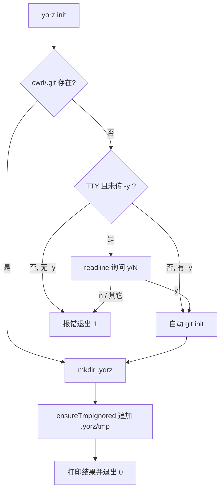
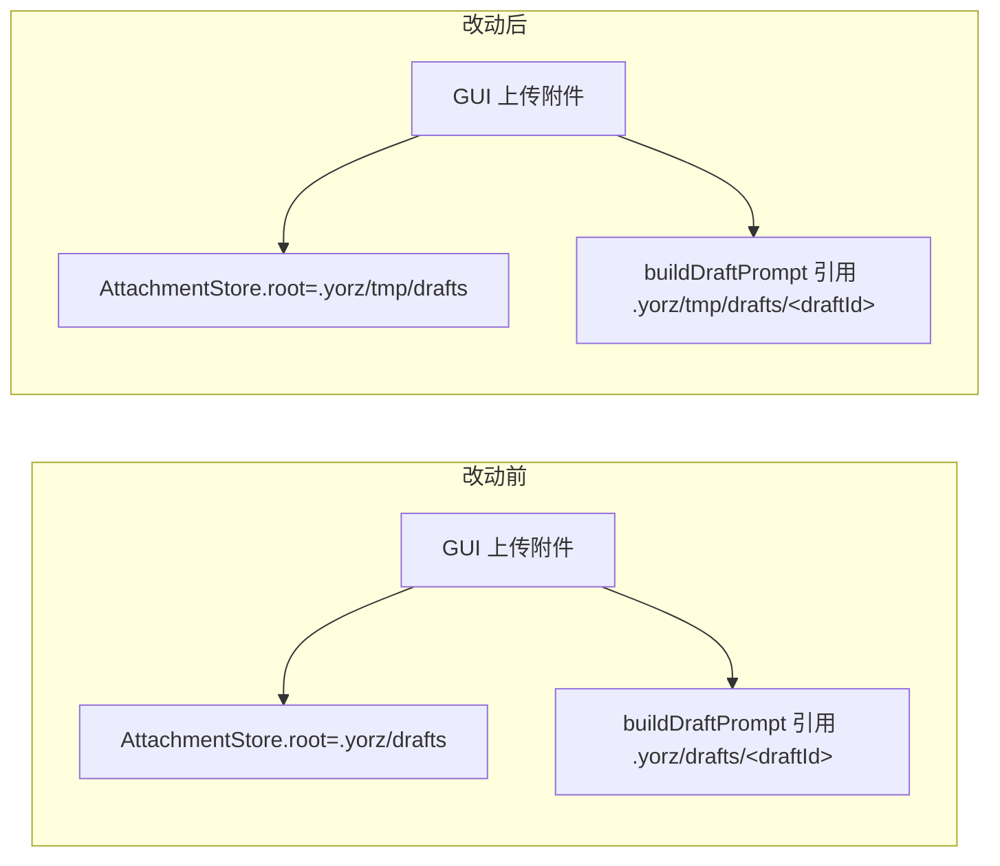

# yorz init / drafts 目录迁移 / install skills 重构

## 1. 背景

用户原始需求（来自本轮 prompt）：

> 1. 新增命令行 `yorz init`，创建 `.yorz` 目录，添加 `.yorz/tmp` 到 `.gitignore` 文件，如果目录没有 git 初始化过，提示用户必须先进行 `git init`，通过确认后自动 `git init`，用户否认则终止流程；
> 2. 变更现有写入 `.yorz/drafts` 的逻辑，写入 `.yorz/tmp/drafts` 目录；
> 3. 重构 `yorz install` 命令实现逻辑，改为 `yorz install skills`，默认全局安装 skills（`-s user`）。

## 2. 需求

- 新增 `yorz init` 命令：负责在目标目录中把 YorZ 需要的骨架（`.yorz/` 目录、`.gitignore` 里的 `.yorz/tmp` 条目）建齐；未经过 `git init` 的目录必须先经用户确认后代跑 `git init`，用户拒绝则整个 `init` 流程终止。
- 草稿附件目录（`AttachmentStore`）的落盘位置从 `.yorz/drafts` 调整到 `.yorz/tmp/drafts`，与既有 `.yorz/tmp/agent-logs` 的临时数据约定保持一致；相关代码、提示词、测试断言一并更新。
- 重构 `yorz install` 命令：改为 `yorz install <target>` 形态，目前 `<target>` 仅有 `skills`（安装 `yorz-spec` skill），并把默认 `--scope` 从 `project` 切换到 `user`。

## 3. 现状分析

### 3.1 CLI 结构与既有子命令

`src/cli/index.ts` 通过 commander 注册了 `install / uninstall / add / serve` 四个子命令，尚无 `init`：

- `install`：默认 `-a all -s <INSTALL_SCOPE_DEFAULT>`，`INSTALL_SCOPE_DEFAULT` 定义在 `src/cli/defaults.ts` 中当前为 `'project'`（`src/cli/defaults.ts:3`）；实现位于 `src/cli/install.ts`，除了把 `yorz-spec` skill 打包写入 agent 的 skills 目录，还顺带调用 `ensureTmpIgnored(cwd)` 把 `.yorz/tmp` 追加到 `.gitignore`（`src/cli/install.ts:77,117-140`）。
- `uninstall`：与 `install` 对称，也接受 `-a/-s` 选项。
- `add`：注册项目到全局 config，走 `runAdd`（`src/cli/add.ts`）。
- `serve`：启动 YorZ Service。

`install.ts` 里已经封装了 `isGitRepo(cwd)`（`src/cli/install.ts:96-104`）与 `ensureTmpIgnored(cwd)`（`src/cli/install.ts:122-140`），可直接被新的 `init` 命令复用。

### 3.2 草稿附件存储路径

`AttachmentStore` 在构造函数里硬编码根路径：

```ts
// src/service/attachment-store.ts:98
this.root = join(opts.cwd, '.yorz', 'drafts')
```

Service 端 `POST /projects/:projectId/spec-drafts`（`src/service/routes/spec-drafts.ts`）在此目录下按 draftId 创建 `attachments/` 子目录并落盘用户上传附件；同样的路径字符串以硬编码方式出现在 Agent 提示词 `buildDraftPrompt` 中（`src/service/routes/specs.ts:225-230`），用来告诉 Agent 从哪里迁移草稿附件到最终 spec 目录。

相关测试断言涉及此路径的位置至少有：

- `src/service/__tests__/build-draft-prompt.test.ts:10,15`：断言 prompt 中出现 `.yorz/drafts/`；不含 draftId 时也不能出现。
- `src/service/__tests__/attachment-store.test.ts`、`spec-drafts-route.test.ts`：视其构造 `AttachmentStore` 后对 `draftsDir` / 目录布局的断言，可能命中 `.yorz/drafts` 字面串。
- 仓库根 `.gitignore:12` 已存在 `.yorz/drafts` 条目；`.gitignore:13` 也已存在 `.yorz/tmp`。历史 spec `260629.feat.agent-run-log-persistence/spec.md` 明确提出 "`.yorz/tmp` 留作未来更通用的临时目录（与 `.yorz/drafts` 平级），`agent-logs` 是其下首个子用途"——本 spec 相当于把 `drafts` 也归入 `.yorz/tmp` 的收敛。

### 3.3 install 命令的当前语义与背景

- `install` 目前只做一件事：把打包在 CLI 里的 `yorz-spec` skill 写入 agent skills 目录（`src/cli/install.ts:56-85`）。命令名并没有"要装什么"这一维度，未来若要扩展到 plugin / subagent / hooks 等就会撞名。
- 默认 `--scope project` 是由 `260630.refct.install-scope-default-project` 显式切换过来的历史决策；本次需求要求再切回默认 `user`，理由是 skill 更常被"全局共享"，逐仓库项目内安装并不合理。
- 单测 `src/cli/__tests__/install.test.ts:126-129` 直接断言 `INSTALL_SCOPE_DEFAULT === 'project'`，切换默认值时该断言需要同步更新。

### 3.4 交互式提示能力盘点

当前 CLI 没有任何交互式 prompt 依赖，`install/uninstall/add` 都是无交互 all-in-one 流程。新增 `yorz init` 的 "未 git init 请求确认" 是本仓库第一次引入交互 prompt。node 标准库的 `readline/promises` 已能覆盖，无需引入新依赖。



## 4. 技术实现方案

### 4.1 目录/模块划分

- 抽出 CLI 内共享工具到 `src/cli/git.ts`（新文件），至少导出 `isGitRepo(cwd)`、`runGitInit(cwd)`；`install.ts` 与新增的 `init.ts` 都从这里引用，避免同一函数出现两处实现。
- 新增 `src/cli/init.ts`：导出 `runInit(opts)`，签名参考 `runAdd`：

  ```ts
  export interface RunInitOptions {
    cwd?: string
    /** 非 TTY 或 CI 场景直接跳过确认 */
    yes?: boolean
    /** 测试注入点 */
    prompt?: (question: string) => Promise<string>
    runGitInit?: (cwd: string) => Promise<void>
  }
  export interface RunInitResult {
    cwd: string
    gitInitialized: boolean
    yorzDirCreated: boolean
    gitignore: { updated: boolean; path: string } | null
  }
  ```

  流程严格按现状分析中的流程图执行：`isGitRepo` → 需要时 `prompt` → 拒绝立即抛错并让 CLI 层 `process.exit(1)` → `mkdir -p .yorz` → 复用 `ensureTmpIgnored`。

- `src/cli/index.ts` 增加 `program.command('init')`，支持 `--yes/-y`（可选）与 `--cwd <path>`（可选）；action 里 `try/catch`，用户拒绝分支返回非零退出码并打印明确文案。
- 交互确认策略（已确认）：交互式默认 `[y/N]`；同时支持 `--yes/-y`；非 TTY（`!process.stdin.isTTY`）且未传 `-y` 直接失败退出 1，并打印 `yorz init: current directory is not a git repository; pass --yes to auto-run git init in non-interactive mode`。

### 4.2 草稿目录迁移

改动集中在三个位置：

1. `src/service/attachment-store.ts:98`：
   ```ts
   this.root = join(opts.cwd, '.yorz', 'tmp', 'drafts')
   ```
2. `src/service/routes/specs.ts:225-230` 的 `buildDraftPrompt`：把两处 `.yorz/drafts/${draftId}/attachments/` 字面串替换为 `.yorz/tmp/drafts/${draftId}/attachments/`。
3. 测试同步：
   - `src/service/__tests__/build-draft-prompt.test.ts`：`.yorz/drafts/` → `.yorz/tmp/drafts/`（含 "不出现" 与 "出现" 两处断言）。
   - `src/service/__tests__/attachment-store.test.ts` 与 `spec-drafts-route.test.ts`：全文替换 `.yorz/drafts` → `.yorz/tmp/drafts`。
4. 仓库根 `.gitignore`：`.yorz/tmp` 已经覆盖新路径，删除陈旧的 `.yorz/drafts` 条目（Q5 已确认）。
5. 历史 `.yorz/drafts/**` 目录（已确认）：**不做自动迁移**。切换后 Service 只读写新路径，旧目录保留，由用户手工清理。



### 4.3 `yorz install` / `yorz uninstall` 重构为子命令形态

分三步：

1. **install 命令层重构**：在 `src/cli/index.ts` 把 `install` 从单个 action 改成"父命令 + 子命令 `skills`"。commander 支持以下写法：

   ```ts
   const installCmd = program
     .command('install')
     .description('Install YorZ artifacts (skills, ...).')
   installCmd
     .command('skills')
     .description('Install the yorz-spec skill into the target agent(s).')
     .option('-a, --agent <agent>', 'target agent: claude | opencode | all', 'all')
     .option('-s, --scope <scope>', 'install scope: user | project', INSTALL_SCOPE_DEFAULT)
     .action(async (opts) => {
       /* 现 install action 原样搬迁 */
     })
   ```

   无参 `yorz install`：让 commander 自动打印子命令 usage 帮助（`installCmd.action(() => installCmd.help())`）。

2. **uninstall 同步改造（不保留旧命令）**（Q3 已确认）：
   - `uninstall` 一并改为父命令 + `uninstall skills` 子命令，形态与 install 对称。
   - **不**保留旧 `yorz uninstall` 无子命令形态；无参 `yorz uninstall` 打印子命令帮助。

3. **默认 scope 切换 + 一次性 tip**：
   - `src/cli/defaults.ts` 的 `INSTALL_SCOPE_DEFAULT` 由 `'project'` 改为 `'user'`。
   - `install skills` action：当用户未显式传 `-s/--scope` 时（使用 `commander` 的 `getOptionValueSource('scope') === 'default'` 判定），打印一行 tip：
     ```
     defaulting to --scope user (global); pass -s project to install into this repo
     ```
     tip 每次未显式传 `-s` 时都会打印（无 marker 文件）。
   - `src/cli/__tests__/install.test.ts:126-129` 断言从 `'project'` 改为 `'user'`；补一个用例覆盖 tip 输出仅在未显式传 `-s` 时出现。其它显式传 `scope: 'user'` 的测试不受影响。

### 4.4 时序：`yorz init` → `yorz install skills`

```mermaid
sequenceDiagram
    participant U as 用户
    participant CLI as yorz CLI
    participant FS as 本地文件系统
    U->>CLI: yorz init
    CLI->>FS: 检查 .git
    alt 已 git init
        CLI->>FS: mkdir .yorz
        CLI->>FS: 追加 .yorz/tmp 到 .gitignore
    else 未 git init
        CLI-->>U: [readline] "本目录未 git init，是否自动执行? [y/N]"
        alt 用户拒绝
            CLI-->>U: 报错并 exit 1
        else 用户同意 / -y
            CLI->>FS: git init
            CLI->>FS: mkdir .yorz
            CLI->>FS: 追加 .yorz/tmp
        end
    end
    U->>CLI: yorz install skills (默认 -s user)
    CLI-->>U: tip: defaulting to --scope user (global); pass -s project to install into this repo
    CLI->>FS: 写入 ~/.claude/skills/yorz-spec/
```

### 4.5 兼容性与影响范围

- 现有 CI/dev 脚本（`package.json` scripts）没有直接调用 `yorz install`，`dev` 目标只跑 `serve`，不受重构影响。
- 老仓库若已经把附件上传到 `.yorz/drafts/*`，切换后 Service 只会读写新路径。老草稿目录保留（不做自动迁移，也不自动删除），由用户手工清理。
- `yorz install` / `yorz uninstall` 语义变更为 breaking：无参形态从"执行/移除"变成"打印子命令帮助"，脚本用户必须显式传 `skills` 子命令。
- README 目前几乎没有 CLI 使用说明（只有一行架构指引），无需更新；CLI `--help` 输出是唯一的用户可见变化面。

## 5. 待确认问题

- 暂无

## 6. 任务清单

- [x] 新增 `src/cli/git.ts`：迁移 `src/cli/install.ts` 中的 `isGitRepo(cwd)` 并新增 `runGitInit(cwd)`（通过 `child_process.spawn` 执行 `git init`，失败抛错）；将 `install.ts` 的 `isGitRepo` 改为从 `git.ts` 导入
- [x] 新增 `src/cli/init.ts`：实现 `runInit(opts)`（支持 `cwd`/`yes`/`prompt`/`runGitInit` 注入点；已 git init 直接跳过；未 git init + TTY 通过 `readline/promises` 询问 `[y/N]`；未 git init + `-y` 直接跑 `git init`；未 git init + 非 TTY 且无 `-y` 抛错；随后 `mkdir -p .yorz` 并复用 `ensureTmpIgnored`；返回 `RunInitResult`）
- [x] `src/cli/index.ts` 注册 `init` 子命令：绑定 `--yes/-y`、`--cwd <path>`；action 打印结果，拒绝分支 `process.exit(1)` 且文案清晰
- [x] 新增 `src/cli/__tests__/init.test.ts`：覆盖「已 git init」「未 git init + prompt=y」「未 git init + prompt=n（抛错）」「未 git init + yes=true」「非 TTY 无 -y」五个场景；断言 `.yorz` 目录创建、`.gitignore` 追加 `.yorz/tmp`
- [x] `src/service/attachment-store.ts`：把 `this.root = join(opts.cwd, '.yorz', 'drafts')` 改为 `join(opts.cwd, '.yorz', 'tmp', 'drafts')`
- [x] `src/service/routes/specs.ts` 的 `buildDraftPrompt`：将两处 `.yorz/drafts/${draftId}/attachments/` 字面串替换为 `.yorz/tmp/drafts/${draftId}/attachments/`
- [x] `src/service/__tests__/build-draft-prompt.test.ts`：把出现与不出现的两处断言从 `.yorz/drafts/` 改为 `.yorz/tmp/drafts/`
- [x] `src/service/__tests__/attachment-store.test.ts` 与 `src/service/__tests__/spec-drafts-route.test.ts`：全文替换 `.yorz/drafts` → `.yorz/tmp/drafts`；确保用例仍能通过（attachment-store.test.ts 无字面串命中，spec-drafts-route.test.ts 命中一处）
- [x] `src/cli/defaults.ts`：将 `INSTALL_SCOPE_DEFAULT` 从 `'project'` 改为 `'user'`；同时导出纯函数 `installScopeTip(source)` 用于单测
- [x] `src/cli/index.ts` 重构 `install`：改为父命令 + `install skills` 子命令；无参 `yorz install` 打印子命令帮助；`install skills` action 中通过 `getOptionValueSource('scope')` + `installScopeTip` 判定是否打印 tip `defaulting to --scope user (global); pass -s project to install into this repo`
- [x] `src/cli/index.ts` 重构 `uninstall`：改为父命令 + `uninstall skills` 子命令；不保留旧 `yorz uninstall` 无子命令形态；无参打印子命令帮助
- [x] `src/cli/__tests__/install.test.ts`：把 `INSTALL_SCOPE_DEFAULT` 断言从 `'project'` 改为 `'user'`；新增用例覆盖「默认 source 打印 tip」「显式 CLI source 不打印 tip」「env/config source 不打印 tip」
- [x] 检查并更新 `src/cli/__tests__/uninstall.test.ts`（若存在）以匹配新的 `uninstall skills` 命令结构（当前仓库不存在独立 uninstall 测试文件，install.test.ts 内 `describe('uninstall', ...)` 直接调用 `uninstall()` 函数，不依赖 commander wiring，无需改动）
- [x] 修改仓库根 `.gitignore`：删除 `.yorz/drafts` 一行（`.yorz/tmp` 已覆盖新路径）
- [x] 运行仓库测试与构建（`pnpm test` / `pnpm run build`），确认全部通过；未通过则在执行记录中记录并回补修复

## 7. 追加任务

## 8. 执行记录

- 2026-07-01 12:57 新增 `src/cli/git.ts`：抽出 `isGitRepo(cwd)` 与新增 `runGitInit(cwd)`（`spawn('git', ['init'], { cwd, stdio: 'inherit' })`）；`src/cli/install.ts` 改为从 `./git.js` 导入 `isGitRepo`，删除内部同名实现。
- 2026-07-01 12:57 新增 `src/cli/init.ts`：`runInit(opts)` 支持 `cwd/yes/prompt/runGitInit/isTTY` 注入点；未 git init 时按 TTY / --yes 走 readline `[y/N]` 或直接抛 `InitAbortedError`；随后 `mkdir -p .yorz` + `ensureTmpIgnored`。
- 2026-07-01 12:57 `src/cli/index.ts` 注册 `init` 子命令；`install` 与 `uninstall` 改造为父命令 + `skills` 子命令（无参形态改为打印子命令帮助，破坏性变更已在 4.5 记录）；`install skills` action 通过 `getOptionValueSource('scope')` + `installScopeTip` 判定是否打印 tip。
- 2026-07-01 12:57 `src/service/attachment-store.ts` root 路径改为 `.yorz/tmp/drafts`；`src/service/routes/specs.ts` `buildDraftPrompt` 同步更新提示词字面串。
- 2026-07-01 12:57 更新 `src/service/__tests__/build-draft-prompt.test.ts` 与 `src/service/__tests__/spec-drafts-route.test.ts` 中的路径断言；`attachment-store.test.ts` grep 无命中，无需改动。
- 2026-07-01 12:57 `src/cli/defaults.ts`：`INSTALL_SCOPE_DEFAULT` 改为 `'user'`；新增纯函数 `installScopeTip(source)`。
- 2026-07-01 12:57 `src/cli/__tests__/install.test.ts`：默认值断言改为 `'user'`；新增 `installScopeTip` 四条用例覆盖 default / undefined / cli / env / config。
- 2026-07-01 12:57 新增 `src/cli/__tests__/init.test.ts`：五条用例覆盖已 git init、TTY prompt=y、TTY prompt=n（拒绝抛 `InitAbortedError`）、非 TTY + yes=true、非 TTY 无 -y（抛错）。
- 2026-07-01 12:57 仓库根 `.gitignore` 删除 `.yorz/drafts` 一行。
- 2026-07-01 12:57 `pnpm test`：27 files / 212 tests 全部通过；`pnpm run build`：CLI + GUI bundle 成功（仅 mermaid 相关 chunk size 警告，与本次改动无关）。
