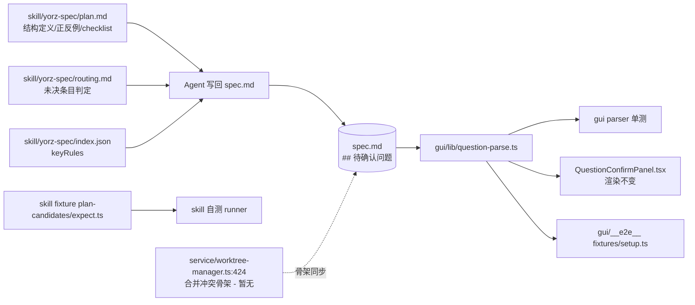

# 待确认问题格式：三级标题 + 有序列表

## 1. 背景

重构 spec 文档「待确认问题」格式，从当前无序列表转换成：问题使用三级标题、方案候选项使用有序列表，期望结构如下：

```
## 5. 待确认问题

### 5.1 Assets 的共享事实源应落在哪一层？
1. 任务节点 mode_drafts.assetResourceIds，由 composer 侧通过 composer_binding_key 反查读写 (推荐)
2. Composer 的 video-session 草稿，由 taskgraph 侧通过 composer_binding_key 反查读写
3. 新增独立表/接口（例如 shot-shared-draft）作为唯一权威源，两侧都改为读写它

### 5.2 跨视图实时通知的实现载体？
1. 复用现有的 React Query（或 SWR）缓存失效 + invalidateQueries (推荐)
2. 新增 Zustand store 广播 draft 变更事件
3. 全局 EventTarget / mitt 事件总线
```

这样方便文档其他位置通过「标题 + 序号」引用待确认问题内容；需要同时更新 skill 与 GUI 中的「待确认问题」解析代码。

## 2. 需求

- 将 `## 待确认问题` 章节内的每条问题从「一级 `- ` 无序列表项」升级为「三级标题 `### N.M 问题正文`」，让其他章节可以通过章节编号（如 `见 5.1`）稳定引用。
- 将候选答案从「二级 ` -` 无序列表」升级为「一级有序列表 `1. / 2. / …`」，`(推荐)` 后缀语义保留。
- `（自由文本）` 后缀语义保留（表示该问题不枚举候选，退化为自由文本回答）。
- 同步更新：
  - `src/skill/yorz-spec/plan.md`（结构定义、正反例、自检 checklist）
  - `src/skill/yorz-spec/routing.md`（"待确认问题判定"的未决条目识别规则）
  - `src/skill/yorz-spec/index.json`（keyRules 摘要）
  - `src/gui/src/lib/question-parse.ts`（解析器：从 `- / 二级 -` 改为 `### / 有序列表`）
  - `src/gui/src/lib/__tests__/question-parse.test.ts`（对应用例）
  - `src/skill/yorz-spec/__tests__/fixtures/plan-candidates/expect.ts`（skill fixture 校验）
  - `src/gui/src/__e2e__/fixtures/setup.ts`（e2e 种子 spec）

## 3. 现状分析

### 3.1 现有格式约定（skill 侧）

`src/skill/yorz-spec/plan.md` 定义的当前结构：

- 问题：`## 待确认问题` 章节下的一级 `- ` 列表项
- 候选：二级 ` -` 子列表（2 空格缩进）
- 推荐：候选项尾部追加 ` (推荐)`（恰 1 个）
- 自由文本：问题正文末尾追加 `（自由文本）` 后缀
- 空态：`- 暂无`

`plan.md` 内含 5 个正反例、5 项写回前 checklist；`routing.md` 定义"未决条目 = `- ` 开头且非 `暂无`"用于阻塞判定；`index.json` 的 `keyRules` 有 4 条对应描述。

### 3.2 GUI parser 现状

`src/gui/src/lib/question-parse.ts` 关键逻辑：

- `HEADING_RE = /^##\s+(?:\d+(?:\.\d+)*\.?\s+)?待确认问题\s*$/` 定位章节标题
- `NEXT_HEADING_RE = /^#{2,3}\s+/` — 遇到任意 `##` 或 `### ` 即终止（当前用于避开 `### 已确认决策快照` 之类子节污染）
- `matchTopBullet(line)`：`^- (.*)$` — 匹配问题正文
- `matchSubBullet(line)`：`^(?:\s{2,}|\t+)- (.*)$` — 匹配候选（允许 2 空格或 Tab）
- `RECOMMEND_SUFFIX_RE = /\s*\(推荐\)\s*$/`
- `FREEFORM_SUFFIX_RE = /\s*（自由文本）\s*$/`
- 多 `(推荐)` 时保留首个、console.warn 降级；无子列表则自动 `isFreeform=true`

单测 `question-parse.test.ts` 共 12 个用例覆盖：单条推荐、多候选恰 1 推荐、无子项退化 freeform、编号标题兼容、空白行分隔、多 `(推荐)` 降级、`（自由文本）` 后缀、遇到 `### 已确认决策快照` 立即终止等。

### 3.3 GUI 渲染现状

`src/gui/src/components/QuestionConfirmPanel.tsx` 直接消费 `ConfirmQuestion { text, options[], isFreeform }`，不感知底层 markdown 形态；结构改动只影响 parser，不影响渲染层。

### 3.4 skill 测试 fixture 现状

`src/skill/yorz-spec/__tests__/fixtures/plan-candidates/expect.ts` 的 `parseQuestions` 用 `^- /` 与 `^\s{2,}-\s/` 内联判定，与 GUI parser 同构；断言"每个 question 要么有子候选恰 1 推荐、要么以 `（自由文本）` 结尾"。

### 3.5 e2e 种子现状

`src/gui/src/__e2e__/fixtures/setup.ts` 内 `QUESTIONS_SPEC` 常量含旧格式示例（`- 候选答案的展现形式应采用哪种？` + 二级子列表），Playwright 用例 `question-confirm.spec.ts:43` 依赖"默认选中 表格 (推荐)"这一断言 —— 需同步迁移种子到新格式。

### 3.6 与格式无关（可保持不动）的相邻代码

- `src/service/spec-store.ts` 只使用 `## 待确认问题` 作为章节标题匹配；空态字面量 `- 暂无`（`renderInitialSpec` 未主动写入内容，`SECTIONS` 仅列 heading）—— 若默认写入 `- 暂无` 由 skill 层负责。
- `src/service/worktree-manager.ts:424` 写死了 `## 5. 待确认问题\n\n- 暂无` 的骨架，需要跟随空态约定同步。
- `applyQuestionAnswers` 只回写 `## 用户批注` 章节，不解析问题结构。
- `buildDraftPrompt` 提到 `## 待确认问题` 只是章节名字面量，格式无关。

### 3.7 影响面速览



## 4. 技术实现方案

### 4.1 新格式规范（skill 侧）

`## 待确认问题` 章节结构：

- 每条问题写作 `### N.M 问题正文`（`N` = `待确认问题` 所在的二级序号；`M` = 问题在该二级下的顺序，从 1 起）。
- 候选答案写作**一级有序列表**：`1. 候选文本`、`2. 候选文本` ……候选项尾部允许追加 ` (推荐)` 或 ` （推荐）`（恰 1 个）。
- 无可枚举候选的问题：在三级标题正文末尾追加 `（自由文本）`（后缀语义与位置沿用旧规），后续无有序列表条目。
- 空态：整章仅保留 `_暂无_` 一行（斜体段落），弃用旧的 `- 暂无`。选择 `_暂无_` 而非删空的原因：显式的空态占位便于人工与工具识别"作者确实检查过、无问题"vs"作者漏写"。
- 二/三级标题编号规则沿用 `conventions.md` 的自动重排逻辑：Agent 写回前重新按 body 出现顺序刷 `## N.` / `### N.M`。

正例：

```
## 5. 待确认问题

### 5.1 候选答案的展现形式应采用哪种？
1. 嵌套子列表
2. 表格 (推荐)
3. 自定义 YAML 块

### 5.2 release notes 文案应该怎么写？（自由文本）
```

### 4.2 GUI parser 改造

`src/gui/src/lib/question-parse.ts` 关键调整：

- `HEADING_RE` 保持不变（仍匹配 `## 待确认问题`）。
- 章节内扫描改为：
  - 匹配 `### N.M 问题正文` 作为问题；正则形如 `/^###\s+(?:\d+(?:\.\d+)*\s+)?(.+\S)\s*$/`。
  - 匹配紧随其后的一级有序列表 `^\d+\.\s+(.*)$` 作为候选（允许中间空行）。
  - 遇到下一个 `### `、`## ` 或非有序列表段（如另一条问题、章节结束）时终止当前问题。
- `_暂无_`（或空章节）返回 `[]`。
- `FREEFORM_SUFFIX_RE` 沿用，作用对象从"问题 `- ` 项"改为"问题 `### ` 标题正文"，剥离后写入 `text`。
- 多 `(推荐)` 降级逻辑保持：保留首个，其余转普通，console.warn。
- **推荐标记同时接受半角 `(推荐)` 与全角 `（推荐）`**：`RECOMMEND_SUFFIX_RE = /\s*[（(]推荐[）)]\s*$/`；剥离后 label 不含括号，parser 不做半/全角归一化写回（由作者自行选择）。
- `NEXT_HEADING_RE` 从 `#{2,3}` 改为 `##` — 因为现在 `### ` 是合法的问题标题，不应触发终止；改用"遇到 `## ` 二级标题终止 / 遇到 `### ` 认作新问题起点"。
- 编号后缀（`5.1`）需从 `text` 中剥离，只保留问题正文；GUI 不显式展示章节编号（见 4.7 决策 D4）。
- 硬切换：**不再兼容旧 `- ` 无序列表格式**；旧格式 spec 会解析出 0 条问题（等价于空态）。
- id 生成规则：沿用 `hash(text) + index`，text 已剥掉编号，跨写回后 id 只随文本内容变。

### 4.3 GUI parser 单测更新

`src/gui/src/lib/__tests__/question-parse.test.ts` 全部用例迁移到新格式；补充：

- `### N.M` 编号自动剥离验证。
- `_暂无_` 空态返回 `[]`。
- 全角 `（推荐）` 也能被识别为推荐项。
- `### 已确认决策快照` 类子节不再"共存"—— 决策：如需保留决策快照，应放到独立二级章节（如 `## 已确认决策`），该规则一并写入 skill；parser 遇到 `### ` 无条件视作新问题标题起点。
- 编号 gap 容忍：`### 5.1` / `### 5.3` 也应能被解析出 2 条问题（parser 不校验编号连续，只按出现顺序）。
- 旧 `- ` 无序列表格式的输入应解析为空数组（硬切换回归断言）。

### 4.4 skill 侧文档 & fixture 同步

- 重写 `src/skill/yorz-spec/plan.md` 的「待确认问题结构」「产出前自检 checklist」「正反例」章节；空态改为 `_暂无_`；`(推荐)` 描述补一句"半/全角括号皆可"。
- 更新 `src/skill/yorz-spec/routing.md` 的"待确认问题判定"：未决条目定义改为「章节内存在任一 `### ` 子标题（且非空态 `_暂无_`）」。
- 更新 `src/skill/yorz-spec/index.json` 中 plan 模块 keyRules 的相关描述以匹配新格式；加一条「问题使用三级标题、候选使用有序列表，空态用 `_暂无_`」。
- 更新 `plan-candidates` fixture 的 `expect.ts`：`parseQuestions` 从"`^- `+`^  - `"改为"`^### `+`^\d+\. `"；断言语义保持；同时支持半/全角 `(推荐)` / `（推荐）`。
- fixture `input.spec.md` 若含旧格式示例需一并更新（当前 fixture 的 `## 待确认问题` 仅为 `- 暂无`，会随空态规范改为 `_暂无_`）。

### 4.5 空态与骨架同步

- `src/service/worktree-manager.ts:424-426` 的合并冲突 spec 骨架把 `## 5. 待确认问题\n\n- 暂无` 改为 `## 5. 待确认问题\n\n_暂无_`；下方 `## 7. 追加任务` 的 `- 暂无` 保持不动（追加任务采用列表条目形态，与本次改动无关）。
- `src/service/spec-store.ts` 的 `renderInitialSpec` 目前对 `## 待确认问题` 只写章节标题（无内容），不涉及 `- 暂无`，无需改动。
- 已存在的历史 spec（`.yorz/specs/*/spec.md`）**不做批量迁移**（见 4.7 决策 D3）；旧格式在新 parser 下解析为空数组即等价于"无未决问题"，不阻塞流程。

### 4.6 e2e 种子迁移

`src/gui/src/__e2e__/fixtures/setup.ts` 内 `QUESTIONS_SPEC` 常量从旧格式：

```
## 2. 待确认问题

- 候选答案的展现形式应采用哪种？
  - 嵌套子列表
  - 表格 (推荐)
  - 自定义 YAML 块
```

迁移为新格式：

```
## 2. 待确认问题

### 2.1 候选答案的展现形式应采用哪种？
1. 嵌套子列表
2. 表格 (推荐)
3. 自定义 YAML 块
```

`question-confirm.spec.ts:43` 的断言"默认选中 表格 (推荐)"无需改动，因为 parser 输出 `ConfirmQuestion` 结构相同。

### 4.7 已确认决策

- **D1**（空态占位）：采用 `_暂无_` 斜体段落。理由：显式空态占位便于人工与工具识别，避免和"作者漏写"混淆。
- **D2**（旧格式兼容）：**硬切换**。parser 只识别新格式；不打印 warn、不做转换。
- **D3**（存量迁移）：**不迁移** `.yorz/specs/*/spec.md`；旧 spec 在新 parser 下解析为 0 条问题，等价于空态，不阻塞流程。
- **D4**（GUI 编号展示）：不在 UI 展示章节编号；parser 剥离后 `text` 只含正文。
- **D5**（推荐标记宽容度）：parser 同时识别半角 `(推荐)` 与全角 `（推荐）`；不做写回归一化。

### 4.8 变更提交策略

- 一次提交内完成 skill 文档 + GUI parser + 两套测试 + e2e 种子的同步改动，保证任意 checkout 都能通过 `pnpm test`。
- 提交前跑：`pnpm run test`（parser 单测 + skill fixture runner）+ `pnpm run typecheck`。

## 5. 待确认问题

- 暂无

## 6. 任务清单

- [x] 更新 `src/skill/yorz-spec/plan.md`：重写「待确认问题结构」「产出前自检 checklist」「正反例」三处，问题使用 `### N.M`、候选使用有序列表；空态 `_暂无_`；候选推荐标记描述补充"半/全角括号皆可"；`- ` 空态字面量替换为 `_暂无_`；验收：文件字符串不再出现"一级 `- ` 列表项"表述，正例首个候选行以 `1.` 开头。
- [x] 更新 `src/skill/yorz-spec/routing.md`：修改"待确认问题判定"段落，未决条目定义改为「章节内存在任一 `### ` 子标题（且非空态 `_暂无_`）」；验收：段落文字更新且不再引用 `- ` 开头判定。
- [x] 更新 `src/skill/yorz-spec/index.json`：修订 plan 模块 keyRules 描述以匹配新格式，新增一条「问题使用三级标题、候选使用有序列表，空态 `_暂无_`」；验收：JSON 结构合法且新增/修改条目落地。
- [x] 重写 `src/gui/src/lib/question-parse.ts`：`RECOMMEND_SUFFIX_RE` 改为 `/\s*[（(]推荐[）)]\s*$/`；`NEXT_HEADING_RE` 改为 `/^##\s+/`；新增 `matchQuestionHeading`（识别 `### N.M 正文` 并剥离编号）与 `matchOrderedCandidate`（`^\d+\.\s+`）；`_暂无_` 段落返回 `[]`；移除 `matchTopBullet` / `matchSubBullet` 旧路径；验收：文件不再包含 `^- ` / `^\s{2,}-` 相关判定。
- [x] 重写 `src/gui/src/lib/__tests__/question-parse.test.ts`：所有旧用例迁移到 `### / 有序列表` 格式；新增：`_暂无_` 返回 `[]`、编号剥离、全角 `（推荐）`、编号 gap 容忍、旧格式输入返回 `[]`（硬切换回归）、`### 已确认决策快照` 作为独立问题条目处理；验收：`pnpm --filter gui run test question-parse` 全绿。
- [x] 更新 `src/skill/yorz-spec/__tests__/fixtures/plan-candidates/expect.ts`：`parseQuestions` 从"`^- ` + `^\s{2,}-`"改为"`^### ` + `^\d+\.\s+`"；推荐匹配同时支持半/全角；`- 暂无` 空态改用 `_暂无_`；验收：skill fixture runner 通过。
- [x] 更新 `src/skill/yorz-spec/__tests__/fixtures/plan-candidates/input.spec.md`：`## 5. 待确认问题` 段的 `- 暂无` 改为 `_暂无_`（空态一致性）；验收：runner 通过。
- [x] 更新 `src/service/worktree-manager.ts:424-426`：`## 5. 待确认问题\n\n- 暂无` 改为 `## 5. 待确认问题\n\n_暂无_`；不改 `## 7. 追加任务` 的 `- 暂无`；验收：grep 结果符合预期，type check 通过。
- [x] 迁移 `src/gui/src/__e2e__/fixtures/setup.ts` 的 `QUESTIONS_SPEC` 到新格式：`### 2.1 候选答案的展现形式应采用哪种？` + `1. / 2. / 3.` 有序列表，`(推荐)` 位置保持；验收：Playwright `question-confirm.spec.ts` 预期行为不变（无需改动断言）。
- [x] 全量验证：在仓库根依次执行 `pnpm run typecheck` 与 `pnpm run test`（含 skill fixture runner 与 GUI vitest），确保全部通过；若命令不可用则记录跳过原因。

## 7. 追加任务

- 暂无

## 8. 执行记录

- 2026-07-01 14:40 消费 5 条待确认问题批注，敲定决策 D1-D5（见 4.7），生成 10 项任务清单，将 `## 待确认问题` 收敛为 `- 暂无`；`stage: tasks → execute`。
- 2026-07-01 14:42 更新 `src/skill/yorz-spec/plan.md`：重写「待确认问题结构」「产出前自检 checklist」「正反例」；空态改为 `_暂无_`，推荐标记补充"半/全角括号皆可"；新增反例 7（`- 暂无` 空态）。
- 2026-07-01 14:42 更新 `src/skill/yorz-spec/routing.md`：路由第 5 条与「待确认问题判定」段落改为「章节存在任一 `### ` 子标题即视为未决；`_暂无_` 视为空态」。
- 2026-07-01 14:43 更新 `src/skill/yorz-spec/index.json`：routing/plan 两个模块的 keyRules 同步新格式描述，plan 新增「问题使用三级标题、候选使用有序列表，空态 `_暂无_`」一条。
- 2026-07-01 14:43 重写 `src/gui/src/lib/question-parse.ts`：`RECOMMEND_SUFFIX_RE` 改为 `/\s*[（(]推荐[）)]\s*$/` 支持半/全角；扫描逻辑改为识别 `### N.M` 三级标题（自动剥离编号） + 一级有序列表候选；遇到 `## ` 二级标题终止、遇到 `### ` 视作新问题起点；移除旧 `matchTopBullet` / `matchSubBullet`。
- 2026-07-01 14:44 重写 `src/gui/src/lib/__tests__/question-parse.test.ts`：全部旧用例迁移到新格式，新增用例覆盖全角 `（推荐）`、`_暂无_` 空态、`### N.M` 编号剥离、编号 gap 容忍、旧 `- ` 格式硬切换（返回 `[]`）。
- 2026-07-01 14:44 更新 `src/skill/yorz-spec/__tests__/fixtures/plan-candidates/expect.ts`：`parseQuestions` 从 `- / ` + 2 空格无序改为 `### N.M / N.` 有序结构；断言语义保持；空态判定改为 `_暂无_`。
- 2026-07-01 14:44 更新 `src/skill/yorz-spec/__tests__/fixtures/plan-candidates/input.spec.md`：`## 5. 待确认问题` 空态 `- 暂无` 改为 `_暂无_`。
- 2026-07-01 14:44 更新 `src/service/worktree-manager.ts:424-426`：合并冲突骨架内 `## 5. 待确认问题` 段空态改为 `_暂无_`；`## 7. 追加任务` 保持 `- 暂无`。
- 2026-07-01 14:45 迁移 `src/gui/src/__e2e__/fixtures/setup.ts` 中 `QUESTIONS_SPEC` 到新格式：`### 2.1 候选答案的展现形式应采用哪种？` + `1./2./3.` 有序列表；`(推荐)` 位置保持不变。
- 2026-07-01 14:46 全量验证：
  - `npx vitest run` — **27 files / 216 tests 全部通过**（含新 GUI parser 16 项单测）。
  - `npx prettier --write ...` — 完成格式化；9 个受影响文件中 3 个被 prettier 微调（`question-parse.ts` / `question-parse.test.ts` / fixture `expect.ts`），单测复跑通过。
  - `npx tsc --noEmit` — 报告 1 处已有错误 `QuestionConfirmPanel.tsx(46,16) TS2783: 'note' is specified more than once`；`git stash` 验证证明该错误在本次改动前既已存在，与本 spec 无关。
