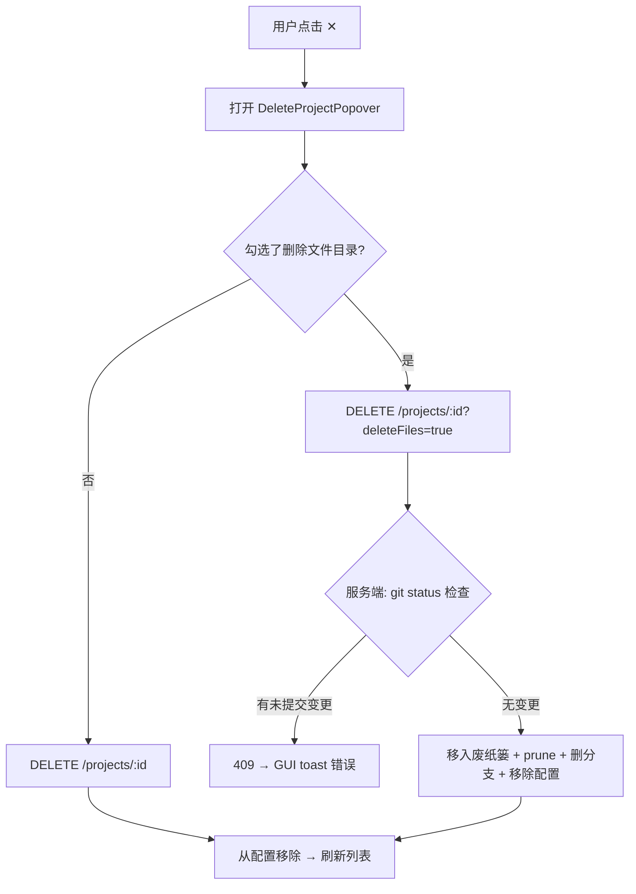

# 260702.feat.wt-name-and-delete-confirm

## 1. 背景

用户在使用 YorZ 管理 worktree 项目时，发现两个体验问题：

1. **项目名称冗长**：自动创建的 worktree 项目名称包含了日期前缀（如 `260630`）、spec 类型（如 `feat`）、来源分支名（如 `main`），导致侧边栏显示过长且语义噪音大。
   - 现状示例：`storify-editor · 260630-feat-task-node-dblclick-open-moda main`
   - 期望示例：`storify-editor · task-node-dblclick-open-moda`
2. **删除操作过于简单**：删除 worktree 项目时仅使用浏览器原生 `window.confirm()`，没有选项控制是否同时删除磁盘文件目录，也没有检查未提交的 git 变更。

## 2. 需求

1. 简化自动创建的 worktree 项目显示名称：仅保留源项目前缀与分支名称（slug），移除日期、类型、来源分支名。
2. 删除 worktree 项目时，使用弹窗（popover）二次确认：
   - 弹窗内显示一个红色 checkbox「同时删除文件目录」。
   - 若用户勾选「同时删除文件目录」，但该 worktree 存在未提交的 git 变更，则 GUI 页面以 message 错误提示「存在未提交 git 的变更」，阻止删除。

## 3. 现状分析

### 3.1 Worktree 项目显示名称

显示名称由前端 `displayProjectName()` 函数计算（`ProjectsSidebar.tsx:69-75`）：

```ts
function displayProjectName(p: ProjectListItem): string {
  if (!p.worktree) return p.name
  const mainBasename = p.worktree.mainPath.split('/').filter(Boolean).pop() ?? p.worktree.mainPath
  const slug = p.worktree.branch.replace(/^wt\//, '')
  return `${mainBasename} · ${slug}`
}
```

- `slug` 取自 `branch` 去掉 `wt/` 前缀后的值。
- 分支名由 `WorktreeManager.createWorktree()` 生成（`worktree-manager.ts:89-93`），格式为 `wt/<sanitizeSlug(specSlug)>`。
- `specSlug` 由前端 `deriveSlug(text)` 生成（`NewSpec.tsx:489-498`），从需求首行提取 ASCII 字符。
- 此外，worktree 项目旁会固定渲染 `⎇ main` 徽章（`ProjectsSidebar.tsx:247-251`），此处 `main` 为硬编码文本而非实际来源分支名。

### 3.2 项目删除流程

当前删除逻辑（`ProjectsSidebar.tsx:155-172`）：

```ts
async function onRemove(p: ProjectListItem, ev: Event) {
  const ok = window.confirm(
    `从列表中移除项目「${p.name}」？\n` +
      `仅会从 YorZ 全局配置中删除，磁盘上的 ${p.path}/.yorz/ 目录不会被删除。`,
  )
  if (!ok) return
  await api.removeProject(p.id)
  await refetch()
  if (activeProjectId() === p.id) navigate('/')
}
```

- 使用浏览器原生 `window.confirm()`，无 popover 组件。
- 仅从全局配置移除项目条目（`global-config.ts:157-164`），不删除磁盘文件。
- 不检查 git 状态。
- 对 worktree 项目和普通项目使用相同流程。

### 3.3 相关组件与 API

| 关注点                           | 文件:行号                                            |
| -------------------------------- | ---------------------------------------------------- |
| 显示名称计算                     | `src/gui/src/components/ProjectsSidebar.tsx:69-75`   |
| `⎇ main` 徽章                    | `src/gui/src/components/ProjectsSidebar.tsx:247-251` |
| 删除 UI handler                  | `src/gui/src/components/ProjectsSidebar.tsx:155-172` |
| 删除按钮 JSX                     | `src/gui/src/components/ProjectsSidebar.tsx:264-272` |
| 分支名生成                       | `src/service/worktree-manager.ts:89-93`              |
| `deriveSlug`                     | `src/gui/src/pages/NewSpec.tsx:489-498`              |
| `sanitizeSlug`                   | `src/service/worktree-manager.ts:314-322`            |
| 删除项目 API                     | `src/service/routes/project.ts:54-58`                |
| `removeProject`                  | `src/service/global-config.ts:157-164`               |
| Worktree 合入（含 git 状态检查） | `src/service/worktree-manager.ts:128-189`            |

### 3.4 现有可复用的 UI 组件

- `ProjectConfigDialog.tsx` — 项目配置对话框（✎ 按钮触发）。
- `AppendTaskDialog.tsx` / `AnnotatePopover.tsx` / `QuestionConfirmPanel.tsx` — 其他自定义弹窗/弹出层。
- `styles.css:270-305` — 删除按钮样式（hover 显示，红色高亮）。

## 4. 技术实现方案

### 4.1 简化 worktree 项目显示名称（仅新创建生效）

**用户决策**：仅对新创建的 worktree 生效，旧项目保持原样。

在 `WorktreeMeta` 中新增可选字段 `cleanSlug?: string`，在 worktree 创建时计算并存储清洗后的 slug。前端 `displayProjectName()` 优先使用 `cleanSlug`，无则回退到原始 branch slug——旧 worktree 无此字段，行为不变。

**清洗函数** `cleanWorktreeSlug()`（`worktree-manager.ts`）：

```ts
function cleanWorktreeSlug(rawSlug: string): string {
  return rawSlug
    .replace(/^\d{6}-(feat|fix|refct)-/i, '') // 移除日期+类型前缀
    .replace(/-(main|master|develop|dev)$/i, '') // 移除来源分支后缀
}
```

**改动点**：

1. `WorktreeMeta` 新增 `cleanSlug?: string`（`global-config.ts` 接口 + `normalizeWorktree` 兼容解析）。
2. `createWorktree()` 中计算 `cleanSlug = cleanWorktreeSlug(slug)` 存入 `meta`。
3. `displayProjectName()` 改为 `p.worktree.cleanSlug ?? p.worktree.branch.replace(/^wt\//, '')`。

**不改动分支名本身**：git 分支名保持原样（含 `wt/` 前缀），避免影响 git 操作。

**`⎇ main` 徽章**：保持不动。

### 4.2 删除确认弹窗（Popover + 废纸篓删除）

**用户决策**：独立浮层 Popover（锚定 ✕ 按钮旁）；「同时删除文件目录」checkbox 仅对 worktree 项目显示；勾选时使用快捷删除（移入废纸篓）。

#### 4.2.1 前端：DeleteProjectPopover

在 `ProjectsSidebar.tsx` 内新建 popover 组件，替代 `window.confirm()`：

- **触发**：点击 ✕ 按钮时通过 signal 控制显隐。
- **定位**：锚定在 ✕ 按钮附近（参考 `AnnotatePopover.tsx` 的定位逻辑）。
- **内容**：
  - 标题：「删除项目」+ 项目显示名称。
  - 说明文字：「此操作将从 YorZ 项目列表中移除该项目。」
  - 红色 checkbox「同时删除文件目录」：仅当 `p.worktree` 存在时渲染。
  - 确认 / 取消按钮。
- **确认逻辑**：
  1. 未勾选 → 调用 `api.removeProject(id)`（现有行为）。
  2. 勾选 → 调用 `api.removeProjectWithFiles(id)`（新 API）。
     - 捕获 409 → toast「存在未提交 git 的变更」。

#### 4.2.2 后端：扩展删除 API

扩展 `DELETE /api/projects/:projectId`，新增 `deleteFiles` query 参数：

- `deleteFiles` 缺省 / false → 现有行为（仅从配置移除）。
- `deleteFiles=true`（仅 worktree 项目有效）：
  1. 检查 git 状态（`git status --porcelain`）。
  2. 有未提交变更 → 返回 `409 Conflict` + `{ error: '存在未提交 git 的变更', dirty: true }`。
  3. 无变更 → 移入废纸篓 → `git worktree prune` → `git branch -D <branch>` → 从 registry 移除。

#### 4.2.3 废纸篓支持

添加 `trash` npm 依赖（跨平台移入废纸篓，支持 macOS / Linux / Windows），在 `WorktreeManager` 新增 `removeWorktree()` 方法封装完整删除流程。



## 5. 待确认问题

_暂无_

## 6. 任务清单

- [x] 在 `WorktreeMeta` 接口（`src/service/global-config.ts`）新增可选字段 `cleanSlug?: string`，并在 `normalizeWorktree()` 中兼容解析；验收：旧配置无 `cleanSlug` 时不报错，新配置可正常读写
- [x] 在 `src/service/worktree-manager.ts` 新增 `cleanWorktreeSlug()` 函数（剥离 `YYMMDD-(feat|fix|refct)-` 前缀及来源分支后缀），并在 `createWorktree()` 中计算 `cleanSlug` 存入 `WorktreeMeta`；验收：`createWorktree` 返回的 `entry.worktree.cleanSlug` 为清洗后的 slug
- [x] 在前端 `src/gui/src/lib/project.ts` 的 `WorktreeMeta` 类型中新增 `cleanSlug?: string` 字段；验收：类型检查通过
- [x] 更新 `displayProjectName()`（`src/gui/src/components/ProjectsSidebar.tsx`）：优先使用 `p.worktree.cleanSlug`，无则回退到 `branch.replace(/^wt\//, '')`；验收：旧 worktree 显示原始 slug，新 worktree 显示清洗后 slug
- [x] 添加 `trash` npm 依赖；验收：`import trash from 'trash'` 可正常编译
- [x] 在 `WorktreeManager` 新增 `removeWorktree(projectId)` 方法：检查 git 状态（dirty 时抛错）→ 移入废纸篓 → `git worktree prune` → `git branch -D` → 从 registry 移除；验收：dirty 时抛出可识别错误，clean 时目录移入废纸篓且 git / registry 清理完毕
- [x] 扩展 `DELETE /api/projects/:projectId` 路由（`src/service/routes/project.ts`）：新增 `deleteFiles` query 参数；worktree 项目且 `deleteFiles=true` 时调用 `removeWorktree()`，git 未提交变更时返回 `409`；验收：API 测试覆盖 200 / 409 / 404 路径
- [x] 在 `src/gui/src/lib/api.ts` 新增 `removeProjectWithFiles(id)` 方法（`DELETE /api/projects/:id?deleteFiles=true`）；验收：方法可被组件调用且正确传递 query 参数
- [x] 在 `ProjectsSidebar.tsx` 中实现 popover 删除确认 UI：锚定 ✕ 按钮的浮层，含标题 / 说明 / 红色 checkbox（仅 worktree 项目）/ 确认取消按钮；替换 `onRemove()` 中的 `window.confirm()`；验收：点击 ✕ 弹出 popover 而非浏览器原生确认框
- [x] 将 popover 确认逻辑接入 API：未勾选→`removeProject`；勾选→`removeProjectWithFiles`，捕获 409 显示 toast「存在未提交 git 的变更」；验收：两种删除路径均可走通，409 时有 toast 提示
- [x] 在 `src/gui/src/styles.css` 中新增 `.delete-project-popover` 相关样式（定位 / 红色 checkbox / 按钮间距）；验收：popover 在侧边栏视觉表现正常
- [x] 新增 / 更新后端测试：`cleanWorktreeSlug()` 正则覆盖（有前缀 / 无前缀 / 边界）、`createWorktree` 存储 `cleanSlug`、delete API 带 `deleteFiles` 的行为（含 409）；验收：测试全部通过
- [x] 运行 lint + typecheck 确保无错误；验收：`npm run lint` 和 `npm run typecheck` 零 error

## 7. 执行记录

- `global-config.ts`：`WorktreeMeta` 新增 `cleanSlug?: string`，`normalizeWorktree()` 兼容解析旧 / 新配置；新增测试验证 backward compatible
- `worktree-manager.ts`：新增 `export cleanWorktreeSlug()` + `removeWorktree()` 方法；`createWorktree()` 计算 `cleanSlug` 存入 meta
- `project.ts`（前端类型）：`WorktreeMeta` 同步新增 `cleanSlug?: string`
- `ProjectsSidebar.tsx`：`displayProjectName()` 优先使用 `cleanSlug`；删除流程从 `window.confirm()` 改为 Popover 组件（signal 驱动，仅 worktree 显示 checkbox，409 → toast）
- `api.ts`：新增 `removeProjectWithFiles(id)` 方法
- `project.ts`（路由）：`DELETE` 端点支持 `deleteFiles=true`，调用 `removeWorktree()`，dirty 返回 409
- `server.ts`：传入 `worktreeManager` 到 `createProjectRoutes()`
- `styles.css`：新增 `.delete-project-popover` / `.delete-popover-backdrop` 样式
- `trash@10.1.1` 依赖已添加（pnpm）
- 测试：`worktree-clean-slug.test.ts`（9 cases）+ `global-config.test.ts` 新增 cleanSlug normalization（2 cases）；全量 269 tests / 36 files 全部通过
- TypeCheck：仅有 `QuestionConfirmPanel.tsx` 的 pre-existing error（与本需求无关）
