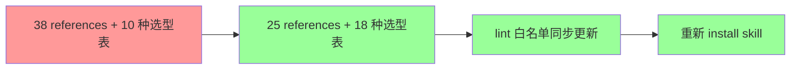

# 优化 mermaid skill：精简 references + 增强选型指导

## 1. 背景

当前 yorz-spec skill 已集成 mermaid 图形化能力（spec `260627.feat.spec-mermaid-diagram`），包含 38 个 references 语法参考文件，覆盖几乎所有 mermaid 图表类型。但其中大量类型在编程/spec 场景中完全用不到（如 cynefin / ishikawa / wardley 等），增加了 skill 体积与 Agent 决策成本。

同时 `mermaid.md` 的选型表和场景指导不够完善，缺少用户已发现的关键优化场景：

- 类型定义应使用 classDiagram 展现属性与继承/组合关系，而非 TS 代码
- 层级结构信息应使用 treeView，而非 ASCII 字符树
- 核心代码逻辑应使用 flowchart，而非 md 列表 + 文字
- 关键状态关系应使用 stateDiagram

## 2. 需求

### 2.1 原始需求

> mermaid 支持非常多种类的图形，有一些图形在编程领域用不上，我希望移除它们的 skill，减少体积，或者不要编入索引，避免被 Agent 读取；
>
> 当前能绘制一些基础的流程图、时序图，我已经发现的一些需要优化的场景：
>
> - 类型定义使用类图，展现类型属性与继承、组合关系；而不是使用 ts 代码
> - 表达层级结构信息、或逻辑，使用 treemap；而不是 ASCII 字符树
> - 核心代码逻辑使用流程图；而不是 md 列表 + 文字进行描述
> - 关键状态关系、变更，使用状态图
>
> 同时还需要你提供更多的建议：在编写 spec 时，什么场景应该使用哪些图形，请优化 mermaid.md；

### 2.2 功能需求

- **REFCT-1 精简 references**：移除编程/spec 场景中完全用不到的图表类型参考文件，仅保留核心类型。
- **REFCT-2 优化 mermaid.md**：扩展选型表，增加明确的"什么场景用什么图"指导，包含用户提出的 4 个场景及更多建议。
- **REFCT-3 同步 lint 白名单**：更新 `DIAGRAM_TYPES` 与精简后的 references 保持一致。
- **REFCT-4 重新安装 skill**：将精简后的 skill 同步到安装目录。

## 3. 现状分析

### 3.1 References 目录现状

当前 `src/skill/yorz-spec/references/` 目录包含 38 个文件，来源为 [WH-2099/mermaid-skill](https://github.com/WH-2099/mermaid-skill) 的自动同步副本：

| 分类         | 数量 | 占比 |
| ------------ | ---- | ---- |
| 核心图表     | 11   | 29%  |
| 配置/示例    | 7    | 18%  |
| 用户指定保留 | 7    | 18%  |
| 应移除       | 13   | 34%  |

**分类明细：**

| 分类             | 文件                                                                                                                                                   | 编程/spec 适用性 |
| ---------------- | ------------------------------------------------------------------------------------------------------------------------------------------------------ | ---------------- |
| **核心图表**     | flowchart / sequenceDiagram / stateDiagram / classDiagram / entityRelationshipDiagram / architecture / mindmap / gantt / timeline / treemap / gitgraph | 高频使用         |
| **配置/示例**    | config-configuration / config-directives / config-layouts / config-math / config-theming / config-tidy-tree / examples                                 | 通用增强         |
| **用户指定保留** | eventmodeling / packet / quadrantChart / radar / swimlanes / treeView / xyChart                                                                        | 按需使用         |
| **应移除**       | block / c4 / cynefin / ishikawa / kanban / pie / railroad / requirementDiagram / sankey / userJourney / venn / wardley / zenuml                        | 不适用           |

**用户指定保留的原因（经批注确认）：**

| 图表类型        | 保留原因                                                                           | 使用场景引导                        |
| --------------- | ---------------------------------------------------------------------------------- | ----------------------------------- |
| `eventmodeling` | 事件建模（EM）描述系统信息流动态变化，忽略瞬态细节，着眼于信息流与用户视角         | 事件驱动架构设计、CQRS 模型         |
| `packet`        | 二进制协议分析有用                                                                 | 二进制协议字段分析、网络包结构      |
| `quadrantChart` | 候选方案决策对比、Review 风险提示可能需要                                          | 方案候选决策、风险评估象限          |
| `radar`         | 架构设计中宏观多方案选择、权衡取舍可能用到                                         | 多方案能力对比、技术选型权衡        |
| `swimlanes`     | 能很好表达多模块在复杂流程中的职责                                                 | 复杂业务流程中跨模块/团队的职责分工 |
| `treeView`      | 表达层级逻辑或层级数据结构的图应该是 treeView（用户纠正：之前说 treemap 是说错了） | 模块层级、文件结构、AST 结构        |
| `xyChart`       | 非常经典的图，适应范围广，可用于统计数据（日志、变更影响）等数据分析               | 变更影响统计、日志分析、性能基准    |

**应移除类型的具体分析：**

| 图表类型             | 移除原因                                         |
| -------------------- | ------------------------------------------------ |
| `block`              | 与 flowchart / architecture 功能重叠             |
| `c4` (6 个 C4 变体)  | 过于专业的架构记法，architecture 已足够          |
| `cynefin`            | 决策框架图，非编程场景                           |
| `ishikawa`           | 鱼骨图/根因分析，spec 场景不需要                 |
| `kanban`             | 看板图，任务清单已覆盖                           |
| `pie`                | 饼图，spec 中几乎不涉及数据占比分析              |
| `railroad`           | 铁路图/语法图，极 niche                          |
| `requirementDiagram` | SysML 需求图，非软件 spec                        |
| `sankey`             | 桑基图/流量图，数据可视化专用                    |
| `userJourney`        | 用户旅程图，UX 专用                              |
| `venn`               | 韦恩图，集合分析                                 |
| `wardley`            | Wardley 地图，战略地图                           |
| `zenuml`             | ZenUML，sequenceDiagram 的替代语法，保留标准即可 |

### 3.2 mermaid.md 现状

`src/skill/yorz-spec/mermaid.md`（63 行）包含：

- **选型表**：10 种类型（flowchart / sequenceDiagram / stateDiagram / classDiagram / erDiagram / architecture / mindmap / gantt / pie / timeline），缺少 treemap、gitgraph、treeView、swimlanes 等。
- **阶段落点指导**：仅描述 plan / tasks / execute 各章节可用图表类型。
- **输出规范**：代码块包裹、语法正确、语义化命名等。
- **节制原则**：适度输出、避免为出图而出图。

**问题：**

1. **缺少多种类型**：选型表中无 treeView、treemap、gitgraph、swimlanes、quadrantChart、radar、eventmodeling、packet、xyChart。
2. **缺少"替代什么"指导**：选型表只说"什么信息特征用什么图"，没有说"这个场景应该用图替代什么形式的文本"。
3. **缺少反模式指导**：没有明确告诉 Agent 什么场景**不应该**用图、什么场景**必须**用图。
4. **pie 应移除**：精简 references 后 pie 被移除，选型表也不应保留。
5. **层级图纠正**：用户明确指出表达层级逻辑/数据结构应使用 treeView 而非 treemap。

### 3.3 Lint DIAGRAM_TYPES 白名单现状

`src/lint/rules/mermaid.ts:10-36` 定义了 25 种 diagram type 白名单：

```typescript
const DIAGRAM_TYPES = [
  'flowchart',
  'graph',
  'sequenceDiagram',
  'classDiagram',
  'stateDiagram',
  'stateDiagram-v2',
  'erDiagram',
  'journey',
  'gantt',
  'pie',
  'mindmap',
  'timeline',
  'xychart-beta',
  'gitGraph',
  'packet-beta',
  'architecture-beta',
  'quadrantChart',
  'requirementDiagram',
  'C4Context',
  'C4Container',
  'C4Component',
  'C4Dynamic',
  'C4Deployment',
  'sankey-beta',
  'block-beta',
]
```

**问题：**

1. 包含已决定移除的类型（journey / pie / requirementDiagram / C4\* / sankey-beta / block-beta）。
2. 缺少 treemap（`treemap-beta`）、radar（`radar-beta`）、treeView（`treeView-beta`）、eventmodeling、swimlane。

### 3.4 Install 机制

`src/cli/install.ts:11` 使用 `import.meta.glob('../skill/yorz-spec/**/*.{md,json}')` 递归收集所有文件。删除 references 目录下的文件后，install 自动不再包含它们，无需修改 install 逻辑。

## 4. 技术实现方案

### 4.1 总体策略



### 4.2 精简 References 目录

**保留 25 个文件（11 核心图表 + 7 用户指定保留 + 7 配置/示例）：**

核心图表参考：

- `flowchart.md` — 流程图
- `sequenceDiagram.md` — 时序图
- `stateDiagram.md` — 状态图
- `classDiagram.md` — 类图
- `entityRelationshipDiagram.md` — ER 图
- `architecture.md` — 架构图
- `mindmap.md` — 思维导图
- `gantt.md` — 甘特图
- `timeline.md` — 时间线
- `treemap.md` — 层级矩形图
- `gitgraph.md` — Git 图

用户指定保留参考：

- `eventmodeling.md` — 事件建模
- `packet.md` — 数据包图
- `quadrantChart.md` — 象限图
- `radar.md` — 雷达图
- `swimlanes.md` — 泳道流程图
- `treeView.md` — 树形视图
- `xyChart.md` — XY 图表

配置/示例参考：

- `config-configuration.md`
- `config-directives.md`
- `config-layouts.md`
- `config-math.md`
- `config-theming.md`
- `config-tidy-tree.md`
- `examples.md`

**删除 13 个文件：**

`block.md` / `c4.md` / `cynefin.md` / `ishikawa.md` / `kanban.md` / `pie.md` / `railroad.md` / `requirementDiagram.md` / `sankey.md` / `userJourney.md` / `venn.md` / `wardley.md` / `zenuml.md`

### 4.3 优化 mermaid.md

#### 4.3.1 扩展选型表

新增"替代什么"列，明确告诉 Agent 在什么场景下应该**用图形替代文本/代码**，扩展至 18 种类型：

| 信息特征                   | 推荐图表            | 替代什么               | 典型 spec 落点               |
| -------------------------- | ------------------- | ---------------------- | ---------------------------- |
| 流程、步骤、决策分支       | **flowchart**       | md 列表 + 文字描述     | 核心代码逻辑、执行流程       |
| 组件间交互、消息传递       | **sequenceDiagram** | 编号文字描述交互过程   | 现状分析链路、技术方案交互   |
| 状态机、阶段流转           | **stateDiagram**    | 文字列举状态变更条件   | 关键状态关系、spec 阶段流转  |
| 类结构、类型定义、继承关系 | **classDiagram**    | TS/代码片段            | 数据模型、模块结构、类型设计 |
| 数据库表、实体关系         | **erDiagram**       | 建表 SQL 或文字描述    | 数据模型设计                 |
| 系统架构、组件依赖         | **architecture**    | 文字描述系统组成       | 现状分析架构、总体架构       |
| 层级逻辑、数据结构         | **treeView**        | ASCII 字符树、嵌套列表 | 模块层级、文件结构、AST 结构 |
| 层级结构 + 占比分布        | **treemap**         | ASCII 字符树、嵌套列表 | 模块层级量级、文件结构占比   |
| 层级关系、知识结构         | **mindmap**         | 缩进列表               | 需求拆解、影响面分析         |
| 项目计划、里程碑           | **gantt**           | 文字排期表             | 任务排期                     |
| 历史事件、变更时间线       | **timeline**        | 文字按日期罗列         | 执行记录、变更历史           |
| Git 分支、合并策略         | **gitgraph**        | 文字描述分支操作       | Git 工作流设计               |
| 事件建模、系统信息流       | **eventmodeling**   | 文字描述事件流         | 事件驱动架构设计、CQRS 模型  |
| 二进制协议、数据包结构     | **packet**          | 文字描述协议字段       | 二进制协议分析、网络包结构   |
| 方案候选决策、风险象限     | **quadrantChart**   | 文字描述优劣对比       | 候选方案决策、风险评估       |
| 多方案能力对比、权衡       | **radar**           | 文字描述能力对比       | 架构方案对比、技术选型权衡   |
| 多模块职责在复杂流程中     | **swimlane**        | 普通流程图             | 复杂业务流程、跨团队协作     |
| 统计数据、趋势分析         | **xyChart**         | 文字描述数据           | 变更影响分析、日志统计       |

#### 4.3.2 新增"场景优先级"章节

按优先级明确"spec 编写中什么场景必须用图"：

**必须用图（高优先级）：**

1. **类型定义与关系** → `classDiagram`：展示接口/类型的属性、方法、继承与组合关系。不要用 TS 代码块替代——类图能直观展现关系拓扑。
2. **核心业务流程/算法逻辑** → `flowchart`：包含分支判断、循环、并行路径的逻辑。不要用 md 列表 + 文字逐步描述——flowchart 的分支视觉远比缩进列表清晰。
3. **状态机与生命周期** → `stateDiagram`：实体在不同状态间的流转与触发条件。不要用文字列举状态——状态图能展现并发状态与守卫条件。
4. **层级逻辑与数据结构** → `treeView`：模块/文件/目录的层级关系、AST 结构等。不要用 ASCII 字符树——treeView 更清晰且可渲染。

**推荐用图（中优先级）：**

5. **组件交互** → `sequenceDiagram`：多组件间的消息传递、API 调用时序。
6. **数据模型** → `erDiagram`：数据库表结构与外键关系。
7. **系统架构** → `architecture`：组件依赖与分组、部署拓扑。
8. **需求拆解** → `mindmap`：影响面分析、需求分解为子项。
9. **多模块职责流程** → `swimlane`：复杂业务流程中跨模块/团队的分工与职责边界。

**按需用图（低优先级）：**

10. **任务排期** → `gantt`：仅在确实需要展示时间维度时使用。
11. **变更历史** → `timeline`：执行记录中按时间排列关键事件。
12. **Git 工作流** → `gitgraph`：描述分支策略与合并流程。
13. **层级占比** → `treemap`：需要同时展示层级结构与各部分量级/占比时。
14. **方案候选决策** → `quadrantChart`：Review/方案选择时做象限分析。
15. **多方案能力对比** → `radar`：架构选型时做多维度能力雷达对比。
16. **统计数据** → `xyChart`：日志/变更影响/性能数据等统计可视化。
17. **事件建模** → `eventmodeling`：事件驱动系统设计时描述信息流。
18. **二进制协议** → `packet`：协议分析时展示数据包字段结构。

#### 4.3.3 新增"反模式"指导

明确什么场景**不应该**用图：

- 简单的线性步骤（2-3 步）→ 用有序列表，不需要 flowchart。
- 单层平铺的分类 → 用表格或列表，不需要 treemap/mindmap。
- 纯文本能表达清楚的内容 → 不强行升维。
- 仅展示代码 → 用代码块，不要用 classDiagram 画简单类型（classDiagram 的价值在于展现**关系**，不是替代代码本身）。

#### 4.3.4 更新 references 引用描述

将"38 个文件"更新为"25 个文件"，并列出保留的类型列表。

### 4.4 更新 Lint DIAGRAM_TYPES

精简白名单为仅保留使用的类型（移除 10 个，新增 5 个）：

```typescript
const DIAGRAM_TYPES = [
  'flowchart',
  'graph',
  'sequenceDiagram',
  'classDiagram',
  'stateDiagram',
  'stateDiagram-v2',
  'erDiagram',
  'gantt',
  'mindmap',
  'timeline',
  'treemap-beta',
  'gitGraph',
  'architecture-beta',
  'packet-beta',
  'xychart-beta',
  'quadrantChart',
  'radar-beta',
  'treeView-beta',
  'eventmodeling',
  'swimlane',
]
```

移除：`journey` / `pie` / `requirementDiagram` / `C4Context` / `C4Container` / `C4Component` / `C4Dynamic` / `C4Deployment` / `sankey-beta` / `block-beta`

新增：`treemap-beta` / `radar-beta` / `treeView-beta` / `eventmodeling` / `swimlane`

保留 `graph`（flowchart 的别名，兼容旧文档）。

### 4.5 更新 index.json

更新 mermaid 模块的 keyRules，反映新的选型表与场景优先级。

### 4.6 重新安装 Skill

运行 `yorz install skills` 将精简后的 skill 同步到安装目录。

## 5. 待确认问题

_暂无_

## 6. 任务清单

- [x] 删除 13 个不需要的 references 文件（block/c4/cynefin/ishikawa/kanban/pie/railroad/requirementDiagram/sankey/userJourney/venn/wardley/zenuml）（验收：references 目录恰好 25 个 .md 文件）
- [x] 更新 src/skill/yorz-spec/mermaid.md：选型表扩展至 18 种类型 + 新增"替代什么"列、场景优先级章节、反模式章节、更新 references 引用描述（验收：选型表包含全部 18 种类型，pie 已移除，treeView 区别于 treemap）
- [x] 更新 src/lint/rules/mermaid.ts 的 DIAGRAM_TYPES：移除 10 个废弃类型、新增 5 个类型（验收：白名单恰好 20 项，与保留的 references 一致）
- [x] 更新 src/skill/yorz-spec/index.json 的 mermaid 模块 keyRules（验收：keyRules 反映新选型表与场景优先级）
- [x] 运行 yorz install skills 同步到安装目录（验收：install 成功，安装目录 references 文件数一致）
- [x] 验证：运行 lint 检查本 spec 文档 + tsc --noEmit（验收：errorCount=0，tsc 通过）

## 7. 执行记录

- 2026-07-02 21:31 新建 spec，完成 plan 阶段（现状分析 / 技术实现方案 / 待确认问题）
- 2026-07-02 22:01 用户批量答复待确认问题与文件保留批注
- 2026-07-02 22:03 消费全部批注：7 个文件从"应移除"改为"用户指定保留"（eventmodeling/packet/quadrantChart/radar/swimlanes/treeView/xyChart），修正 treeView 为层级图首选，更新技术方案为 25 文件保留 / 18 种选型表，生成任务清单，进入 execute
- 2026-07-02 22:04 T1 完成：删除 13 个 references 文件，验证剩余 25 个 .md 文件
- 2026-07-02 22:05 T2 完成：重写 mermaid.md，选型表扩展至 18 种类型 + 替代什么列 + 场景优先级（高/中/低三档）+ 反模式指导 + references 引用更新为 25 文件
- 2026-07-02 22:06 T3 完成：更新 DIAGRAM_TYPES（25→20 项），移除 journey/pie/requirementDiagram/C4\*/sankey-beta/block-beta，新增 treemap-beta/radar-beta/treeView-beta/eventmodeling/swimlane
- 2026-07-02 22:07 T4 完成：更新 index.json mermaid 模块 keyRules 至 7 条
- 2026-07-02 22:08 T5 完成：build:cli + yorz install skills，安装目录（claude/opencode）references 均为 25 文件，mermaid.md 已同步
- 2026-07-02 22:10 T6 完成：tsc --noEmit 通过，lint errorCount=0，全部验证通过
