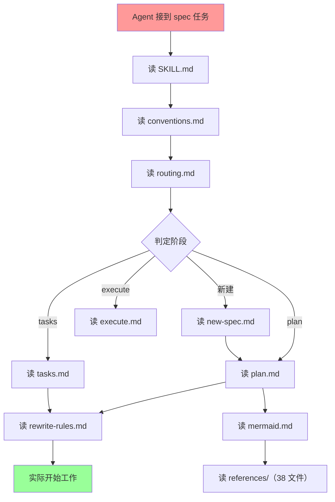
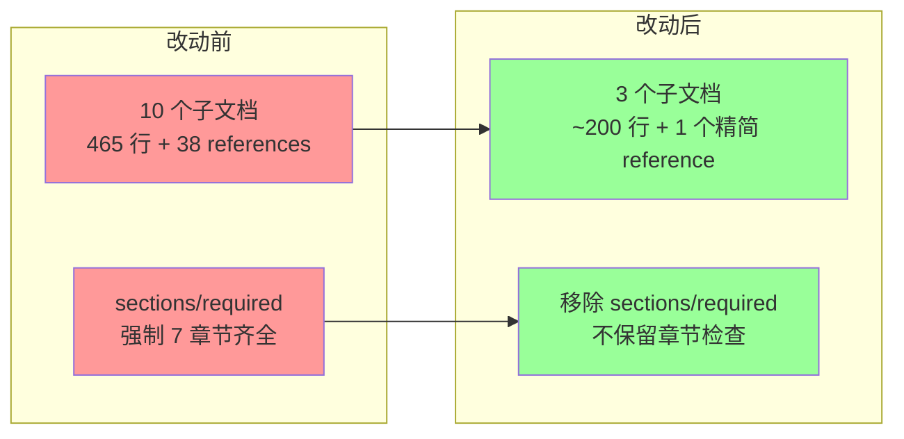

# 简化 yorz-spec skill 工作流

## 1. 背景

当前 yorz-spec skill 由 10 个子文档 + 38 个 mermaid references 组成，文档量较大，包含大量格式约束描述。lint 规则中 `sections/required` 强制校验七大必备章节齐全，即使文档内容为空也必须存在。用户期望：

1. 简化 skill，提升 Agent 推荐流程的速度与实施质量；
2. 用简单正面示例 + yorz lint 替代对文档格式的冗长描述与限制，避免 Agent 跑偏；
3. 移除 rules 中对必填章节的校验（`sections/required`），lint 目的聚焦于确保关键格式符合期望（如待确认问题解析为 UI、mermaid 图形渲染等），避免后续流程解析失败。

## 2. 需求

原始需求：

> 请了解 yorz skill spec 驱动开发工作流， 分析是否可以优化；
>
> 1. 我期望简化 skill、提升 Agent 推荐流程的速度、提升 Agent 实施质量；
> 2. 是否可以简化 skill 对文档格式的描述与限制，使用简单正面示例 + yorz lint 避免 Agent 跑偏？
> 3. 期望移除 rules 中对必填章节的校验，lint 目的是确保关键格式符合期望，避免后续流程解析失败；如待确认问题解析成 UI、mermaid 图形渲染

## 3. 现状分析

### 3.1 Skill 文档结构现状

当前 skill 位于 `src/skill/yorz-spec/`，同步安装到 `~/.config/opencode/skills/yorz-spec/`。主文档清单：

| 文件 | 行数 | 职责 |
|------|------|------|
| `SKILL.md` | 65 | 主入口：使用说明、读取顺序、lint 硬约束、持续推进约束 |
| `conventions.md` | 51 | 输入约定、frontmatter 规范、Markdown 格式化 |
| `routing.md` | 19 | 自动模式判定（auto → plan/tasks/execute） |
| `plan.md` | 71 | plan 阶段：目标、候选项硬约束、待确认问题结构、自检 checklist |
| `tasks.md` | 28 | tasks 阶段：批注消费、任务清单产出 |
| `execute.md` | 31 | execute 阶段：顺序执行、追加任务状态机 |
| `new-spec.md` | 33 | 新建 spec 流程 |
| `rewrite-rules.md` | 36 | 全局硬约束、必备章节、变更重开流程 |
| `mermaid.md` | 63 | mermaid 图表选型表 + 输出规范 + 节制原则 |
| `review.md` | 68 | Review / Git Ops 阶段（独立路径） |

**合计约 465 行主文档 + 38 个 references 文件（mermaid 各类图表语法参考）。**

### 3.2 问题诊断



**核心痛点：**

1. **文档读取开销大**：Agent 在开始实际工作前，至少需读取 4-6 个子文档（SKILL → conventions → routing → 阶段文档 → rewrite-rules），加上 mermaid guide 和 references，总 token 消耗高，直接影响推进速度。

2. **格式约束用自然语言反复描述**：`plan.md` 用 30+ 行描述「待确认问题结构」「候选项硬约束」「空态格式」，而 lint 的 `pending-questions/structure`、`pending-questions/empty`、`pending-questions/no-named-recommend` 三条规则已经完整覆盖了这些约束。Skill 文档中的冗余描述反而可能引入与 lint 规则不一致的解读。

3. **`sections/required` 强制空章节存在**：即使一个刚初始化的 spec 还没进入 plan，也必须同时存在 `## 现状分析` / `## 技术实现方案` / `## 任务清单` / `## 执行记录` 四个空占位章节。这要求 Agent 在创建骨架时就写齐所有章节，增加了初始化复杂度。下游 parser（GUI / routing）实际只需要按章节名查找，空章节缺失不导致解析崩溃。

4. **mermaid references 过重**：38 个独立 md 文件涵盖了几乎所有 mermaid 图表类型的完整语法参考。实践中 Agent 只需 2-3 种常见类型（flowchart / sequenceDiagram / architecture），绝大多数 reference 文件从未被读取。38 个文件的存在反而增加了 Agent "是否需要读取"的决策成本。

5. **跨文档引用增加上下文消耗**：多个子文档之间通过 markdown 链接互相引用（如 plan.md → rewrite-rules.md → conventions.md），每次遇到引用 Agent 都需要把目标文件 Read 进来，造成反复上下文加载。

### 3.3 Lint 规则现状

| ruleId | severity | 现状作用 | 是否需要保留 |
|--------|----------|----------|-------------|
| `sections/required` | error | 强制七大章节齐全 + 核心章节顺序 | **移除**（用户明确要求） |
| `heading/h1-single` | error | 恰 1 个 H1 在所有 H2 前 | 保留（parser 依赖） |
| `heading/section-level` | error | 已知章节名必须 H2 | 保留（GUI 按章节名定位） |
| `heading/numbering` | error | H2/H3 连续编号 | 保留（GUI 批注定位依赖编号） |
| `frontmatter/required-fields` | error | 4 字段齐全 + 顺序 | 保留（parser 依赖） |
| `frontmatter/updated-at` | error | 秒级 + 单引号 | 保留（YAML 解析依赖） |
| `frontmatter/summary-length` | warn | 非空 ≤200 | 保留 |
| `pending-questions/structure` | error | 候选格式 + 推荐 | 保留（**UI 渲染依赖**） |
| `pending-questions/empty` | error | 空态 `_暂无_` | 保留（**UI 渲染依赖**） |
| `pending-questions/no-named-recommend` | error | 禁独立推荐条目 | 保留（**UI 渲染依赖**） |
| `task-list/format` | error | 单层 checkbox | 保留（GUI 渲染依赖） |
| `append-task/format` | error | 追加任务格式 | 保留（parser 依赖） |
| `mermaid/fence` | error | diagram type 白名单 | 保留（**渲染依赖**） |
| `mermaid/syntax` | error | parse 深校验 | 保留（**渲染依赖**） |
| `annotations/leftover` | warn | 残留批注 | 保留 |

**结论**：仅需移除 `sections/required`。其余规则都直接服务于下游解析或渲染，属于「确保关键格式符合期望、避免后续流程解析失败」的范畴。

## 4. 技术实现方案

### 4.1 总体策略



### 4.2 Skill 文档精简

**合并方案：10 → 4 个文件（mermaid 不动）**

| 合并后文件 | 内容来源 | 预估行数 |
|-----------|---------|---------|
| `SKILL.md` | 主入口 + conventions（输入/frontmatter/格式） + routing（自动模式判定）+ rewrite-rules（全局约束/重开流程） | ~120 行 |
| `stages.md` | plan + tasks + execute + new-spec（四阶段合并，每阶段一个 `##` 节） | ~100 行 |
| `review.md` | 保留不变（独立路径，低频使用） | ~68 行 |
| `mermaid.md` + `references/` | **不改动**（后续单开任务优化） | 不变 |

**精简原则：**

1. **删除 lint 已覆盖的格式描述**：`plan.md` 中「候选项硬约束」「待确认问题结构」「产出前自检 checklist」的表格全部删除——这些规则已由 lint 的 `pending-questions/*` 和 `heading/*` 规则完整覆盖，Agent 跑偏时 lint 会报错纠正。保留一句话指向 lint 即可。

2. **用正面示例替代规则列举**：在 `stages.md` 中各阶段小节放一个「正确产出示例」代码块（3-5 行），替代当前用自然语言逐条描述格式约束的方式。示例即规范，lint 是安全网。

3. **mermaid 暂不改动**：`mermaid.md` 与 `references/` 目录保持现状，后续单开任务优化。`SKILL.md` 的读取顺序中继续引用 `mermaid.md`。

### 4.3 Lint 规则调整

**完全移除 `sections/required`：**

- 删除 `src/lint/rules/sections.ts` 文件（含 `sectionsRequired` 规则、`REQUIRED_ORDER`、`CORE_ORDER` 常量、`sectionsRules` 导出）。
- 移除 `src/lint/spec-md-lint.ts` 中 `sectionsRules` 的 import 与 `...sectionsRules` 注册。
- `ALL_RULE_IDS`（`src/lint/index.ts`）从 `SPEC_RULES` 派生，规则移除后自动不再包含 `sections/required`，无需单独修改。
- 删除 `src/lint/__tests__/sections.test.ts`（全部 4 条用例均针对 `sections/required`，规则移除后无对应行为可测）。
- 不保留任何章节顺序检查替代规则。

**对 skill 文档的连锁影响：**

- `rewrite-rules.md`（将合并入 `SKILL.md`）中「必备章节」描述 → 移除强制语气，改为「初始化时建议创建，但不强制」。
- `plan.md`（将合并入 `stages.md`）lint 规则索引表中 `sections/required` 行 → 删除。
- `routing.md` 中按章节名查找的逻辑不受影响（查找时章节不存在 = 视为空态）。
- `new-spec.md` 中初始化骨架仍创建全部章节（保持行为一致，只是 lint 不再报错）。

### 4.4 正面示例设计

在合并后的 `stages.md` 中，每个阶段用以下结构替代当前的规则列举：

```markdown
## plan

理解文档 → 分析代码 → 写入现状分析 / 技术实现方案 / 待确认问题。不写任务清单、不改代码。

正确示例：

### 5.1 候选项应该用有序列表还是表格？
1. 嵌套子列表
2. 表格 (推荐)

### 5.2 release notes 文案？（自由文本）

空态：_暂无_

> 格式由 lint 保证；不确定时运行 `yorz lint` 查看报错。
```

这种方式：Agent 看一眼就知道正确格式；不需要理解 3 条自然语言规则；跑偏时 lint 自动纠正。

### 4.5 Skill 安装同步

skill 文件同时存在于 `src/skill/yorz-spec/`（源）和 `~/.config/opencode/skills/yorz-spec/`（安装位置）。改动后需要：

1. 修改 `src/skill/yorz-spec/` 下的源文件；
2. 运行安装命令同步到 `~/.config/opencode/skills/yorz-spec/`（或 build/copy 脚本）；
3. 确保 `index.json` 中的文件列表与实际文件一致。

## 5. 待确认问题

_暂无_

## 6. 任务清单

- [x] 删除 `src/lint/rules/sections.ts`（移除 `sectionsRequired` 规则、`REQUIRED_ORDER`、`CORE_ORDER`、`sectionsRules` 导出）
- [x] 更新 `src/lint/spec-md-lint.ts`：移除 `sectionsRules` import（line 8）和 `...sectionsRules` 注册（line 20）
- [x] 删除 `src/lint/__tests__/sections.test.ts`（4 条用例全部针对 `sections/required`）
- [x] 创建 `src/skill/yorz-spec/stages.md`：合并 plan + tasks + execute + new-spec 四阶段文档，用正面示例替代格式约束描述，删除 lint 已覆盖的规则表格（含 `sections/required` 行）
- [x] 重写 `src/skill/yorz-spec/SKILL.md`：合并 conventions + routing + rewrite-rules 内容，更新读取顺序引用 stages.md，将「必备章节」描述改为「建议创建但不强制」
- [x] 删除被合并的源文件：`conventions.md`、`routing.md`、`plan.md`、`tasks.md`、`execute.md`、`new-spec.md`、`rewrite-rules.md`
- [x] 更新 `src/skill/yorz-spec/index.json`：反映新文件结构（合并后模块映射）
- [x] 运行 `pnpm test src/lint` 验证 lint 测试套件无回归
- [x] 运行 `pnpm test src/skill` 验证 skill 测试套件无回归
- [x] 运行 `yorz install` 同步 skill 到 `~/.config/opencode/skills/yorz-spec/`

## 7. 执行记录

- 2026-07-02 20:01 删除 `src/lint/rules/sections.ts` 和 `src/lint/__tests__/sections.test.ts`，更新 `src/lint/spec-md-lint.ts` 移除 import 与注册。lint 测试 31 tests / 6 files 全绿。
- 2026-07-02 20:02 创建 `stages.md`（合并 plan/tasks/execute/new-spec，用正面示例替代规则表格），重写 `SKILL.md`（合并 conventions/routing/rewrite-rules），删除 7 个被合并源文件，更新 `index.json`（version 2，4 模块）。
- 2026-07-02 20:03 修复 `src/skill/__tests__/yorz-spec-docs.test.ts`：测试目标从 `tasks.md`/`execute.md` 改为 `stages.md`，补充关键约束措辞。修复 `src/cli/__tests__/install.test.ts`：`EXPECTED_SUBDOCS` 从 9 文件更新为 4 文件。
- 2026-07-02 20:04 全量测试 265 tests / 35 files 全绿。验证范围覆盖 lint、skill 文档关键词、install、service、CLI。
- 2026-07-02 20:05 `vite build` 重建 CLI（`import.meta.glob` 需构建时内联新文件列表），`yorz install skills` 同步到 `~/.config/opencode/skills/yorz-spec/`。安装后验证：SKILL.md + stages.md + review.md + mermaid.md + index.json，旧 7 文件已清除。
