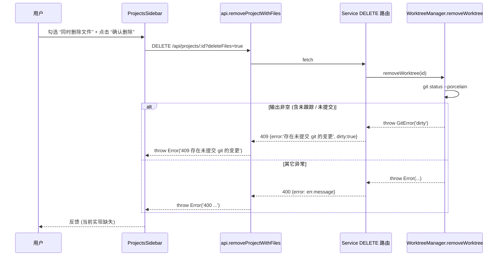
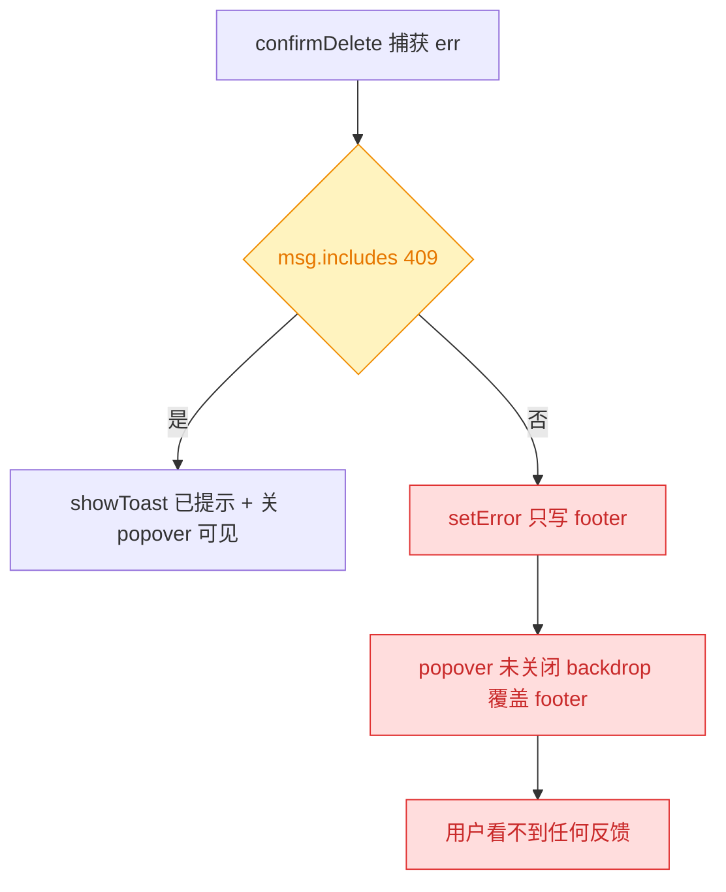
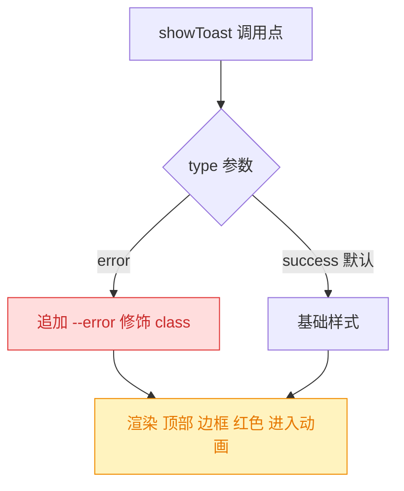
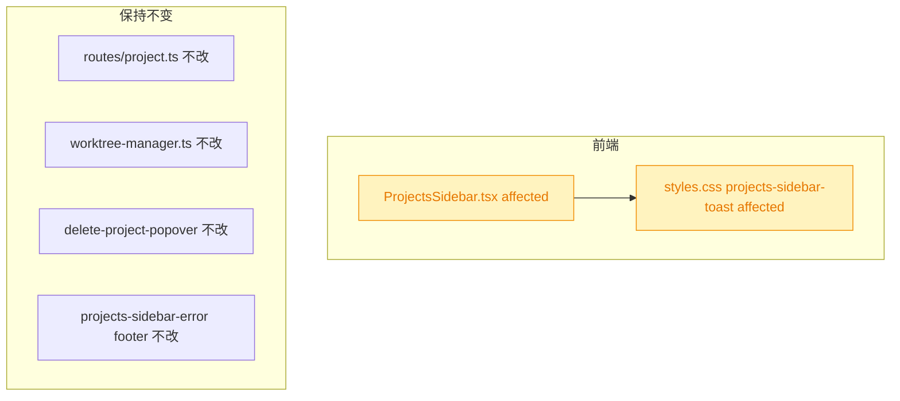

# fix: worktree 删除失败缺少页面提示

## 1. 背景

`ProjectsSidebar` 的“删除项目” Popover 是 260702.feat.wt-name-and-delete-confirm 引入的确认交互：勾选“同时删除文件目录”后调用 `DELETE /api/projects/:id?deleteFiles=true`，后端在 worktree 存在“非干净”状态时通过 `GitError('dirty')` 返回 HTTP 409。用户实际使用中遇到 worktree 目录里存在未提交（含未跟踪）文件时，接口失败，但页面上没有可感知的错误反馈，导致操作看起来“无响应”。

## 2. 需求

修复删除 worktree 项目（勾选“同时删除文件”）失败时页面无提示的问题：无论后端返回何种失败（409 dirty / 400 其它 GitError / 5xx / 网络异常），侧边栏用户必须能看到明确、可读的错误提示；并检查“存在未提交 git 的变更”文案在“文件从未纳入 git（仅有未跟踪文件）”情况下是否恰当。

## 3. 现状分析

### 3.1 交互链路

Popover 的确认按钮触发 `confirmDelete()`：勾选“同时删除文件”后走 `api.removeProjectWithFiles(id)`（`DELETE /api/projects/:id?deleteFiles=true`），后端 `worktreeManager.removeWorktree()` 检查 `git status --porcelain`，若非空即抛 `GitError('dirty')` → 路由捕获后返回 `409 {ok:false,error:'存在未提交 git 的变更',dirty:true}`。前端 `request()` 统一把 `!res.ok` 抛成 `Error("<status> <error>")`。



### 3.2 前端错误处理漏洞

<details>
<summary>精确层：confirmDelete 错误分支源码（src/gui/src/components/ProjectsSidebar.tsx:174-198）</summary>

```ts
async function confirmDelete() {
  const p = deleting()
  if (!p) return
  setDeleteBusy(true)
  try {
    if (deleteFiles() && p.worktree) {
      await api.removeProjectWithFiles(p.id)
    } else {
      await api.removeProject(p.id)
    }
    await refetch()
    if (activeProjectId() === p.id) navigate('/')
    setDeleting(null)
  } catch (err) {
    const msg = (err as Error).message
    if (msg.includes('409')) {
      showToast('存在未提交 git 的变更')
      setDeleting(null)
    } else {
      setError(msg) // ← 缺陷：不关闭 popover、不给 toast，footer error 被弹层遮挡
    }
  } finally {
    setDeleteBusy(false)
  }
}
```

</details>

现状缺陷：



- **非 409 分支**：`setError(msg)` 只把错误写入侧边栏底部的 `.projects-sidebar-error`，同时 popover 与 backdrop 仍处于打开状态（`.delete-popover-backdrop` z-index 199 + `.delete-project-popover` z-index 200 覆盖整个视口），用户视觉上依旧停在弹层内，footer 的错误无法被察觉。
- **409 分支**：`showToast('存在未提交 git 的变更')` 出现在 `.projects-sidebar-toast`（z-index 200，`position: fixed; bottom: 1rem;`），能看到；但文案在“只有未跟踪文件（用户认为未变更）”场景下会让用户困惑——`git status --porcelain` 默认包含 `??` 未跟踪条目，用户从未编辑过任何文件也可能触发 dirty。
- **弹层无内联错误**：popover 内没有专门放错误提示的区域，导致所有失败情况都必须依赖“先关 popover、再弹外部 toast”这一路径，可读性差且容易漏。

### 3.3 后端 dirty 判定

<details>
<summary>精确层：removeWorktree dirty 检查（src/service/worktree-manager.ts:194-218 与 routes/project.ts:59-83）</summary>

- `worktree-manager.ts:204` 使用 `git status --porcelain`；`stdout.trim().length > 0` 即抛 `GitError('dirty', '存在未提交 git 的变更')`。
- `git status --porcelain` 默认包含 untracked（`?? path`），因此仅存在“从未 add 过的文件”也会被判定 dirty。
- `routes/project.ts:75-79` 将 `dirty` 转成 409，其它错误统一转成 400。

</details>

## 4. 技术实现方案

### 4.1 目标

- toast 已经在触发（409 分支已调用 `showToast`），但视觉不够显著、用户容易漏掉。本次**只强化 toast 呈现**：位置顶部、边框、错误红色、进入动画。
- popover / footer / 后端文案 / dirty 判定均**保持不变**（按用户批注：不用改）。

### 4.2 前端改造（`ProjectsSidebar.tsx` + `styles.css`）

改造集中在两处，其余保留：

1. `showToast` 扩展一个可选类型参数：`showToast(message: string, type: 'success' | 'error' = 'success')`；渲染时按 type 追加修饰 class（如 `projects-sidebar-toast--error`）。
2. `confirmDelete` 失败分支（含现有 409 与非 409 分支）统一改成 `showToast(msg, 'error')`；`setError(msg)` 与 `setDeleting(null)` 行为保持原状（用户批注明确"不用改"）。
3. 已有 `onSaved` 场景保持默认（success）。



<details>
<summary>精确层：核心改动（伪码）</summary>

```tsx
// signal 由 string | null 升级为 { message, type } | null
const [toast, setToast] = createSignal<{ message: string; type: 'success' | 'error' } | null>(null)

function showToast(message: string, type: 'success' | 'error' = 'success') {
  const payload = { message, type }
  setToast(payload)
  setTimeout(() => {
    if (toast() === payload) setToast(null)
  }, 4000)
}

// confirmDelete catch 分支
catch (err) {
  const msg = (err as Error).message
  if (msg.includes('409')) {
    showToast('存在未提交 git 的变更', 'error')
    setDeleting(null)
  } else {
    setError(msg)               // 保留（用户批注：不用改）
    showToast(msg, 'error')     // 追加：错误也走强化 toast
  }
}

// 渲染
<Show when={toast()}>
  {(t) => (
    <div
      class={`projects-sidebar-toast projects-sidebar-toast--${t().type}`}
      role={t().type === 'error' ? 'alert' : 'status'}
    >
      {t().message}
    </div>
  )}
</Show>
```

</details>

### 4.3 样式改造（`styles.css`）

- `.projects-sidebar-toast` 位置由 `bottom: 1rem` 改为 `top: 1rem`（顶部）；保留居中 `left: 50%; transform: translateX(-50%)`。
- 加进入动画 `@keyframes projects-sidebar-toast-in`：`opacity 0→1`，`translate(-50%, -12px) → (-50%, 0)`，`180ms ease-out`。
- 新增 `.projects-sidebar-toast--error`：`border-color: #e03131`，`color: #c92a2a`，`background: #fff5f5`（与现有 breaking 图配色一致）。
- `.projects-sidebar-toast--success` 无覆盖，沿用基础样式即可。

### 4.4 影响范围



- **affected**：`showToast` 签名新增可选 `type` 参数（默认 success，向后兼容）；toast 渲染 DOM 结构与 class 变化；toast CSS 位置与样式变化。
- **不涉及**：后端、popover、footer error、dirty 判定与文案。

## 5. 待确认问题

_暂无_

## 6. 任务清单

- [x] 升级 `toast` signal 为 `{ message, type }` 并扩展 `showToast(message, type='success')`（src/gui/src/components/ProjectsSidebar.tsx；验收：tsc 通过、既有 `onSaved` 调用兼容）
- [x] `confirmDelete` 的 409 与非 409 失败分支均改为 `showToast(msg, 'error')`；保留 `setError(msg)` 与 `setDeleting(null)` 原有行为不变（验收：非 409 分支既走 footer 也弹 toast）
- [x] toast 渲染节点按 type 追加 `projects-sidebar-toast--error` / `--success` 修饰 class，`role` 在 error 时为 `alert`（验收：DOM 类名随 type 切换）
- [x] `styles.css` 将 `.projects-sidebar-toast` 位置改为顶部（`top: 1rem`，去掉 `bottom`），新增 `--error` 变体（红边+红字+浅红底）与 `@keyframes` 进入动画（180ms ease-out，opacity+translateY）（验收：视觉符合"顶部/边框/红色/入场动画"）
- [ ] [manual] 手动触发一次"勾选同时删除文件 → 目标 worktree 存在未跟踪文件"路径，确认 toast 从顶部滑入且为红色（验收：截图或口头确认）

## 7. 执行记录

- 2026-07-05 23:05 `ProjectsSidebar.tsx`：`toast` signal 类型升级为 `{ message, type }`；`showToast` 新增可选 `type` 参数（默认 `success`，向后兼容 `onSaved` 调用）；`confirmDelete` 409 与非 409 分支均追加 `showToast(msg, 'error')`；渲染节点按 type 追加 `projects-sidebar-toast--<type>` 修饰 class，`role` 在 error 时为 `alert`。
- 2026-07-05 23:05 `styles.css`：`.projects-sidebar-toast` `bottom: 1rem` 改为 `top: 1rem`；padding/font-size 上调至 `0.5rem 1rem`/`0.9rem`；新增 `.projects-sidebar-toast--error`（`#e03131` 边、`#c92a2a` 字、`#fff5f5` 底）；新增 `@keyframes projects-sidebar-toast-in`（`180ms ease-out`，opacity+translateY(-12px→0)）。
- 2026-07-05 23:05 验证：本地环境未 `pnpm install`，`tsc`/`build:gui` 因依赖缺失无法运行；改动限于 signal 类型、`showToast` 可选参数、渲染节点与 CSS 四处最小 diff，未触碰后端与 API 路径。人工验证列为 `[manual]` 项，收尾时忽略。
- 2026-07-05 23:05 收尾：`## 任务清单` 非 manual 项全部完成、`## 待确认问题` 为 `_暂无_`、无 `！！！` 批注、无 `## 追加任务`；将 `stage` 置为 `done`。
