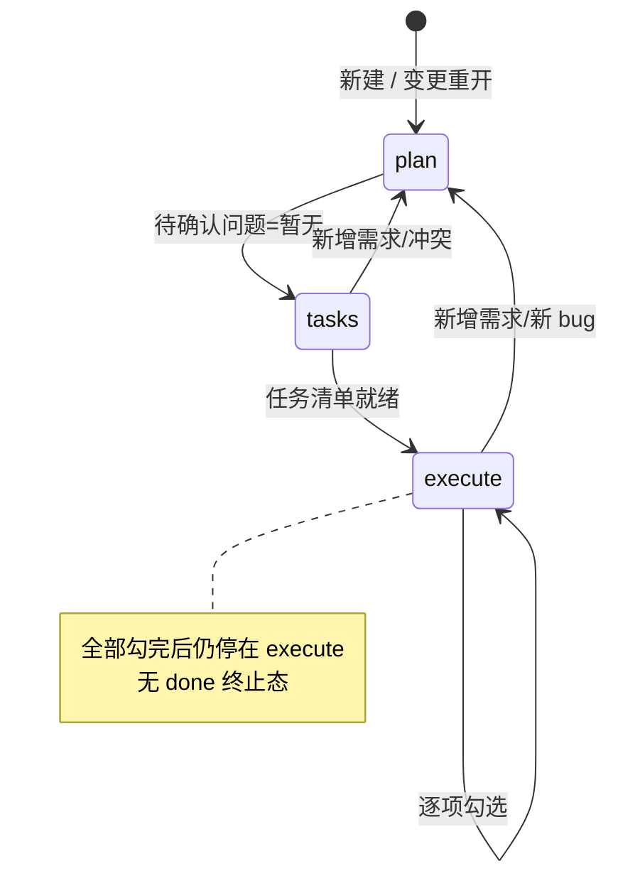
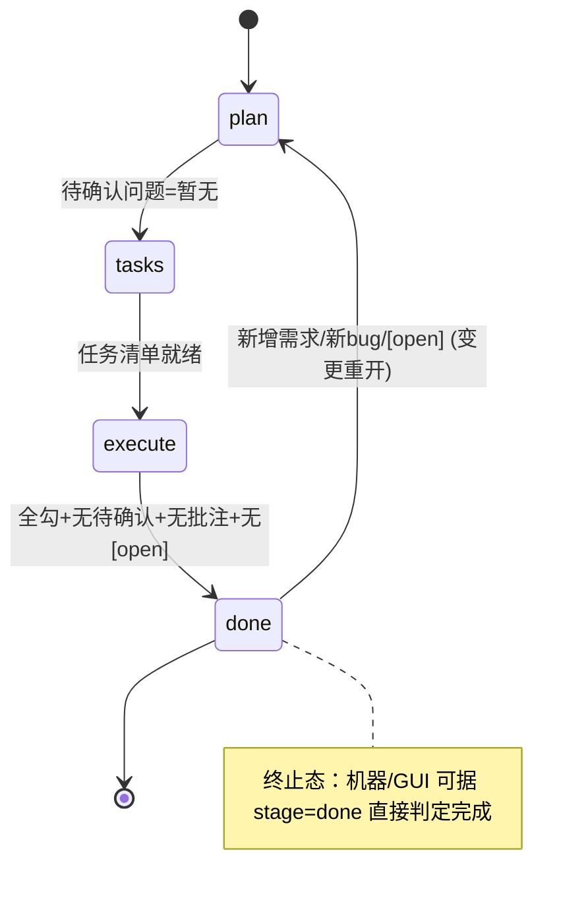

# yorz-spec skill 宏观优化：done 完成态与 mermaid 独立工序

## 1. 背景

`src/skill/yorz-spec/` 是 YorZ 用来「以 spec 驱动 Agent 编程」的核心 skill：把单个 spec 文档当作状态机，围绕 `plan / tasks / execute` 三阶段推进，并将状态持续写回 md。当前该 skill 已迭代多轮（近期见 `260705.refct.review-yorz-spec-skill` 的文档级 review），正文精简为 SKILL / stages / review / mermaid 四个文件 + `index.json` 索引 + `__tests__` 快照。

本次不是文档表述打磨，而是对 skill 的**流程/状态机做宏观增强**，落点是「阶段推进」与「阶段判定」两个层面。

## 2. 需求

用户提出两项期望优化（宏观层面：流程推进、阶段判定）：

1. **缺少完成态**：Agent 执行完任务之后（不包括需要用户手动确认的任务），应能直接标记为 `Done`，而不是停留在 `execute`。
2. **mermaid 图形化不足**：spec 内容对复杂信息的 mermaid 图形化表达不够，复杂内容仍用纯文字/代码表达。期望把「mermaid 图形化」拎出来作为一个**独立工序**让 Agent 更专注，例如放在 `plan` 之后做一次图形化补充；也可提出更优方案讨论。
   - 约束：**只需在 plan 之后针对 `现状分析`、`技术方案` 两节做图形化补充表达**，不扩展到其它章节。

## 3. 现状分析

### 3.1 stage 状态机现状：无终止态

当前状态机只有三态，`execute` 是事实上的「最后一站」——所有 `- [ ]` 勾完后，`stage` 仍停留在 `execute`，没有一个明确的「完成」信号：

- 自动模式判定（`SKILL.md` 第 60–73 行）第 6 条「存在未完成任务则进 execute」，一旦无未完成任务，会落到第 7/8 条继续回到 plan/tasks，缺少「已完成 → 停止」的短路分支。
- 判断一个 spec 是否收尾，只能靠人肉看任务清单是否全勾 + 待确认问题是否为 `_暂无_`，机器/GUI 无法据 `stage` 直接判定完成。

### 3.2 mermaid 出图现状：能力齐备但工序分散

`mermaid.md` 已提供完善的选型表（17 种图）、场景优先级、各阶段落点与节制原则，且被标注为「仅按需 Read」。但出图动作**内嵌在 plan 阶段编写 `现状分析`/`技术方案` 的过程里**，与文字撰写同一轮交错完成：

- Agent 在 plan 阶段要同时兼顾「把方案想清楚 + 写成文字 + 判断哪里该出图 + 画对语法」，注意力被稀释，实际表现是复杂内容常以纯文字/代码块草草带过，图形化被跳过。
- 没有一个独立的「图形化补充」工序节点强制 Agent 回看这两节、专门做升维。

### 3.3 stage 枚举的代码消费点（新增 done 的影响面）

`stage` 值并非纯文档约定，代码多处硬编码了 `plan|tasks|execute` 三态白名单。新增 `done` 必须同步以下位置，否则会被静默降级或 lint 报错：

| #   | 位置                                                          | 现状                                                                   | 新增 done 需改动                         |
| --- | ------------------------------------------------------------- | ---------------------------------------------------------------------- | ---------------------------------------- |
| 1   | `src/lint/rules/frontmatter.ts:4` `STAGES` Set                | 白名单 `{plan,tasks,execute}`                                          | 是，加入 `done`                          |
| 2   | `src/lint/rules/frontmatter.ts:68` 错误文案                   | 硬编码 "plan \| tasks \| execute"                                      | 是，文案同步                             |
| 3   | `src/service/spec-store.ts:381` `normalizeFrontmatter`        | `stage==='tasks'\|\|'execute' ? stage : 'plan'`，**未知值降级为 plan** | 是，否则 done 会被读成 plan              |
| 4   | `src/service/spec-store.ts:9` `SpecFrontmatter.stage` 类型    | union `'plan'\|'tasks'\|'execute'`                                     | 是                                       |
| 5   | `src/gui/src/lib/api.ts:8,17` 两处 union 类型                 | 同上                                                                   | 是                                       |
| 6   | `src/gui/src/styles.css:11-13,847-855` badge 变量/类          | 仅 plan/tasks/execute 配色                                             | 是，新增 `--done` 与 `.badge.stage-done` |
| 7   | `src/gui/src/pages/Home.tsx:176` / `SpecDetail.tsx:217` badge | 动态 `stage-${stage}` 类名，逻辑无需改                                 | 否（仅依赖 #6 的 CSS）                   |
| 8   | `src/gui/src/pages/SpecDetail.tsx:55`                         | `stage !== 'plan'` 才显批注面板                                        | 待评估：done 态是否仍显批注面板          |

> 注：badge 类名是动态拼接（#7），因此 GUI 逻辑改动极小，主要是补 CSS 配色与类型声明；真正的「陷阱」是 #3 的降级逻辑与 #1 的 lint 白名单。

## 4. 技术实现方案

两项优化相对独立，可分别落地；用户批注已裁定全部开放决策，下文为定稿方案。

### 4.1 done 完成态

**定位**：`done` 是**终止态**，表示「本轮 spec 的既有任务已全部完成且无待人工介入项」。

**新增 `[manual]` 任务标记**（采纳 5.2 决策）：任务清单支持 `- [ ] [manual] ...` 标注「需人工确认」任务。done 判定**忽略** `[manual]` 项——即使人工确认项仍未勾选，只要其余任务全部完成也可收尾为 done。

**进入条件（execute → done）**，同时满足：

1. `## 任务清单` 中不存在未完成的**非 manual** 任务项（无 `- [ ]`，`- [ ] [manual]` 人工确认项被忽略）；
2. `## 待确认问题` 为 `_暂无_`；
3. spec 内无任何 `！！！` 批注；
4. 无 `## 追加任务` 中的 `[open]` 条目。

满足即在 execute 收尾同一轮把 `stage` 置为 `done`，`last_action` 记「任务全部完成，标记 done」，并在 `## 执行记录` 追加收尾条目。

**离开条件（done → plan，即重开）**：done 态收到新增/扩展需求、新 bug，或 `## 追加任务` 出现 `[open]` 条目时，走既有「变更重开流程」切回 `plan`。这与现有重开机制天然兼容，无需新增分支。

**自动模式判定新增短路**：在现有判定序列中，于「存在未完成任务 → execute」之后、回到 plan/tasks 之前，插入一条：「若无未完成的非 manual 任务且无待确认问题/批注/`[open]` → 置 `done` 并停止推进」。若 `stage` 已是 `done` 且无新输入，直接停止（终止态不再自动推进）。

**代码改动**：按 3.3 表逐项同步（lint 白名单+文案、normalizeFrontmatter、两套 TS union、CSS 配色/类），并为 `[manual]` 标记放开 task-list lint 校验。

**文档改动**：`SKILL.md` frontmatter 注释与状态机描述补 `done`；`stages.md` 增补 `done` 收尾流程；`index.json` relatedCases 视需要补 done 用例；`__tests__` 视需要补 fixture。

### 4.2 mermaid 独立工序（仅覆盖 现状分析 / 技术方案）

**目标**：把「对 `现状分析`、`技术方案` 做 mermaid 图形化补充」从 plan 的隐式动作，提升为一道**独立、可聚焦**的工序，让 Agent 在方案文字定稿后专门回看这两节补图。

**落地形态（采纳 5.1 决策 —— 候选 B）**：作为 **plan 阶段的收尾子步骤**，不新增 stage。在 `stages.md` 的 plan 流程末尾增加一个显式「图形化补充」步骤——方案文字定稿后，强制回看 `现状分析`/`技术方案` 两节并按 `mermaid.md` 补图，再结束 plan。零 stage 影响面，改动集中在文档。

**范围约束（已定）**：只针对 `现状分析`、`技术方案` 两节补图；不动其它章节；沿用 `mermaid.md` 的选型表与节制原则（单节 ≤2 图、能显著提升可读性才画）。

### 4.3 done 态 GUI 交互（采纳 5.3 决策）

**stage 处理**：done 态在批注面板等交互上**与其它 stage 无区别**，无需特判。

**新增 dropdown**：GUI spec 详情页的 stage 展示从只读 badge 改为 **dropdown 交互**，支持用户**强制将 spec 置为任意状态（含 DONE）**。选择后写回 md frontmatter 的 `stage` 字段，触发既有 FS Watcher 同步链路。

## 5. 待确认问题

_暂无_

## 6. 任务清单

- [x] `src/lint/rules/frontmatter.ts` 的 STAGES Set 加入 `done`、错误文案同步为 `plan | tasks | execute | done`（验收：lint 一个 `stage: done` 的 spec 无 frontmatter/required-fields error）
- [x] 放开 task-list lint 对 `- [ ] [manual] ...` 前缀的校验（验收：含 `- [ ] [manual] xxx` 的任务清单 lint 无 error）
- [x] `src/service/spec-store.ts` 的 `SpecFrontmatter.stage` union 加 `done`、`normalizeFrontmatter` 透传 `done` 不降级（验收：读取 `stage: done` 的 spec 返回 stage 为 done；tsc --noEmit 通过）
- [x] `src/gui/src/lib/api.ts` 两处 stage union 类型加入 `done`（验收：GUI 构建/类型检查通过）
- [x] `src/gui/src/styles.css` 新增 `--done` 配色变量与 `.badge.stage-done` 样式（验收：done badge 呈完成色，构建通过）
- [x] `src/gui/src/pages/SpecDetail.tsx` 将 stage 展示改为 dropdown，支持强制置任意状态（含 DONE）并写回 frontmatter（验收：下拉切换后 spec.md 的 stage 字段更新）
- [x] `src/skill/yorz-spec/SKILL.md` frontmatter 注释与自动模式判定序列补 `done`（新增「无非 manual 未完成任务 → 置 done 并停止」短路、done 终止态不再自动推进）（验收：文档含 done 分支描述）
- [x] `src/skill/yorz-spec/stages.md` 增补 done 收尾流程、`[manual]` 任务标记语义、execute 收尾 done 判定（忽略 manual），并在 plan 末尾新增「mermaid 图形化补充」收尾子步骤（验收：stages.md 含上述四点）
- [x] `src/skill/yorz-spec/mermaid.md` 标注独立工序落点为 plan 收尾子步骤（验收：mermaid.md 指向 plan 收尾）
- [x] 更新 `src/skill/yorz-spec/index.json` 与 `__tests__` 快照/fixture 以覆盖 done 与 `[manual]`（验收：npm test 通过）

## 7. 执行记录

- lint：`src/lint/rules/frontmatter.ts` STAGES Set 加入 `done`、stage 错误文案改为 `plan | tasks | execute | done`。验证：新增 `frontmatter.test.ts` 两条用例（`stage: done` 通过、未知 stage 报错），`npx vitest run src/lint/__tests__/frontmatter.test.ts` 8 passed。
- `[manual]` lint：核实 `task-list/format` 规则以 `- [(.)]` 捕获状态位、`[manual]` 落入正文捕获组，`- [ ] [manual] xxx` 本就合法，**无需改动**；`[manual]` 为 skill/文档层约定，由 Agent 在 done 判定时忽略。
- service：`SpecFrontmatter.stage` union 加 `done`；`normalizeFrontmatter` 透传 `done`（原逻辑未知值降级为 plan）。新增 `SpecStore.setStage(id, stage)` 与 `PATCH /projects/:projectId/specs/:id/stage` 路由。验证：`spec-store.test.ts` 新增 2 用例（setStage done 往返、未知 id 抛错），28 passed；`tsc --noEmit` 通过。
- gui：`api.ts` 抽出 `SpecStage` union 并加 `done`、新增 `api.setStage`；`styles.css` 加 `--done` 变量、`.badge.stage-done`、`.badge.stage-select` 下拉样式；`SpecDetail.tsx` 将只读 badge 改为 `<select>` 下拉，`onChange` 调 `api.setStage` 后刷新，支持强制置任意状态含 DONE。验证：`vite build --config vite.gui.config.ts` 构建成功。
- skill docs：`SKILL.md` 补 done 终止态（intro、frontmatter 注释、自动模式判定新增 done 短路与忽略 `[manual]` 说明）；`stages.md` 标题加 done、plan 增「图形化补充」收尾子步骤、tasks 增 `[manual]` 标记说明、execute 增「收尾为 done」；`mermaid.md` plan 落点标注为独立收尾子步骤。real-agent eval fixtures（`__tests__/`）需 live agent 校验且被 `pnpm test` 排除，本轮未新增以保持可验证性。
- 全量：`npx vitest run` 266 passed；另 2 项失败与本次改动无关——`agent-config.test.ts` 源于会话前已存在的 `agent-config.ts`（新增 `--model claude-opus-4-8`）未提交改动，`service.test.ts` SSE 用例在并行负载下 flaky，单独运行 13 passed。
- 收尾：任务清单无未完成的非 manual 项、`## 待确认问题` 为 `_暂无_`、无 `！！！` 批注、无 `[open]` 追加任务，满足 done 进入条件，`stage` 置为 `done`。
