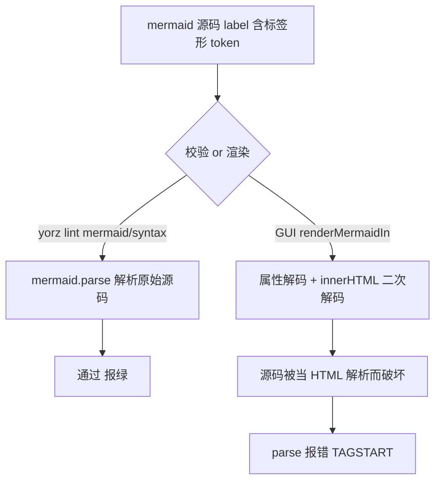
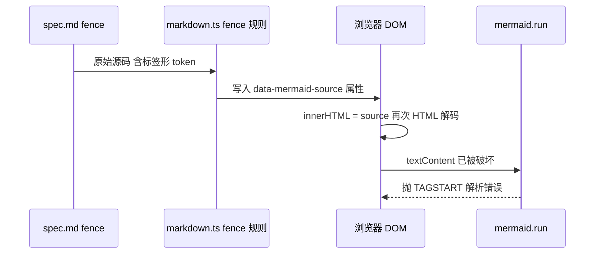
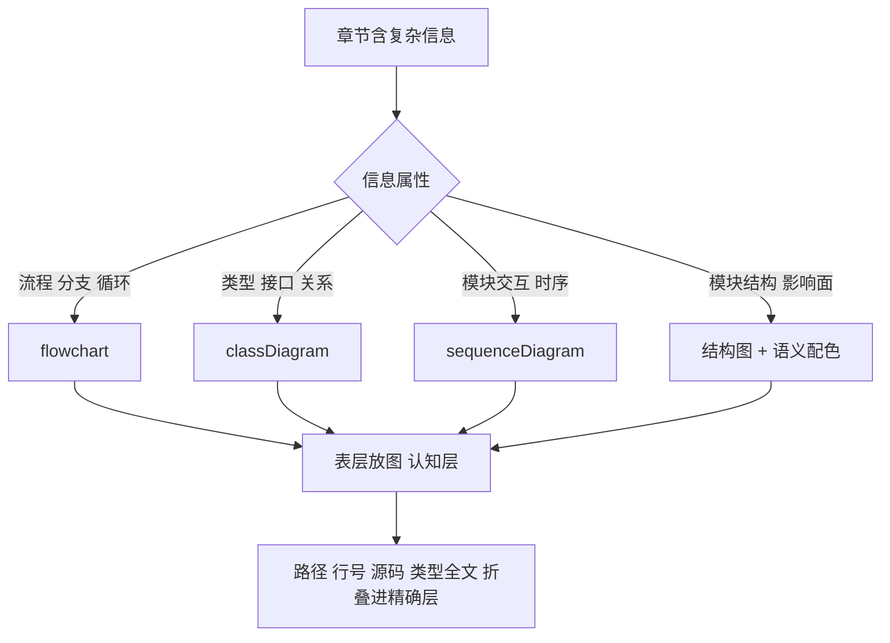
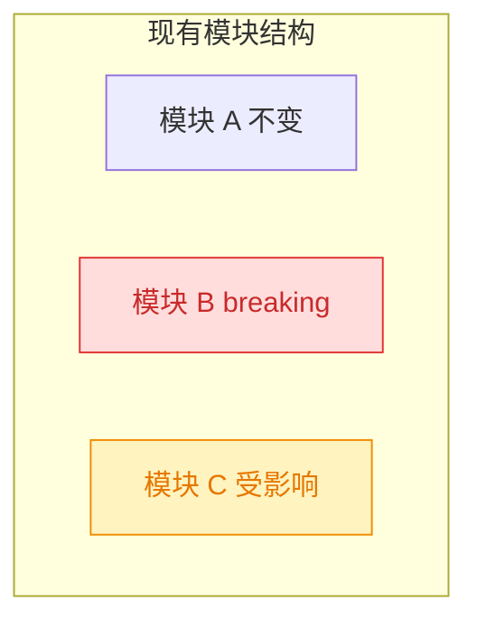
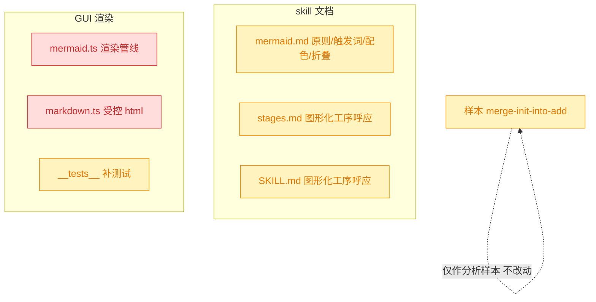

# 图形化 skill 优化：图优先、精确信息折叠、渲染一致性

## 1. 背景

前序 spec `260705.refct.done-stage-and-mermaid-step` 已把「mermaid 图形化」拎成 plan 之后的独立收尾工序，并要求仅针对 `现状分析` / `技术方案` 两节补图。`mermaid.md` 也已具备 17 种图的选型表、场景优先级与节制原则。

但拿真实产出的 spec `260705.refct.merge-init-into-add` 做针对性复盘，发现图形化落地仍显著跑偏——「有工序、有选型表」不等于「图真的画对、画到位」。本次针对四个具体缺陷 + 一条表达范式，反推 skill 应如何优化。

> 约束：`260705.refct.merge-init-into-add/spec.md` 仅作为分析样本，**本 spec 不修改、不处理该文档**。

## 2. 需求

### 2.1 样本暴露的四个具体缺陷

以 `260705.refct.merge-init-into-add/spec.md` 为例：

1. **lint 绿但 GUI 红**：`yorz lint` 无报错，但该文档 L193-L206 的 flowchart 在 GUI 渲染失败，报 `Parse error ... got 'TAGSTART'`（源自 label 中的 `&lt;path&gt;` 标签形 token）。
2. **流程说明未出图**：`3.1 init 命令实现` 是典型的分步流程叙述，却用纯文字 + 有序列表表达，未用 flowchart。
3. **类型/逻辑未升维**：`4.1 add.ts 增强` 堆了大段 TS 类型定义代码块，未用 classDiagram；新的实现流程逻辑也未用 flowchart。
4. **影响面无结构图**：`4.5 兼容性与影响范围` 期望以「某类型图展示被变更模块的现有组成结构」，并用**红色标识 breaking change 区域、黄色标识受影响区域**，实际只有文字。

### 2.2 用户提出的表达范式（贯穿性优化方向）

1. spec 图形表达的目标是让用户**快速建立认知**：核心逻辑流程、模块结构、模块间交互。
2. 图形**不追求极度精确**：不承载文件路径、代码行号、具体源码/伪代码。
3. spec 表层**图形优先**；具体而精确的信息（Agent 实施代码所需）应**折叠**收纳（如 `
`），既不干扰认知又不丢失细节。

## 3. 现状分析

### 3.1 图形化能力齐备，落地仍跑偏

`mermaid.md` 的选型表 / 场景优先级 / 各阶段落点已相当完善，且 done-stage spec 把补图设为 plan 收尾独立工序。但样本显示：Agent 面对「流程叙述、类型定义、影响面」这类**最该出图**的信息，仍频繁退回纯文字/代码块。根因不在「缺能力」，而在三处**规则强度与可执行性不足**：判定「该不该出图」的触发词太抽象、缺少「精确信息如何安放」的配套动作、缺少「影响面」这一高频落点的专门配色约定。

### 3.2 lint 通过但 GUI 渲染失败的根因（对应缺陷 1）

关键事实：`yorz lint` 的 `mermaid/syntax` 规则（`src/lint/rules/mermaid.ts:134`）确实调用 `mermaid.parse` 深校验，但它解析的是**原始 fence 源码**；GUI 渲染却在中途把源码经 **HTML 属性解码 + `innerHTML` 二次解码**再喂给 mermaid，两条路径输入不一致：

- GUI 侧 `src/gui/src/lib/markdown.ts:103-109` 把 fence 源码写入 `data-mermaid-source` 属性；`src/gui/src/lib/mermaid.ts:29-34` 再 `node.innerHTML = source`。
- 源码 label 里的 `&lt;path&gt;` 经属性解码还原为真实的 `<path>`，再经 `innerHTML` 被浏览器当作 HTML 标签解析，破坏了 mermaid 实际读到的 `textContent`，于是报 `TAGSTART`。
- 而 lint 直接 `mermaid.parse('..."yorz add &lt;path&gt;"...')`，`&lt;` 仅是引号内普通字面量，解析通过。

结论：**lint 的 mermaid 深校验≠GUI 渲染保真度**；凡 label 含「标签形 token」（`<x>` 形状、多余 HTML 标签）就可能 lint 绿、GUI 红。

### 3.3 「图优先」缺位：流程与类型仍以文字/代码承载（对应缺陷 2、3）

`mermaid.md` 的「必须用图」清单已列出「核心业务流程→flowchart」「类型定义→classDiagram」，但样本仍未触发。观察到两点可执行性缺口：

- **触发信号偏抽象**：现有措辞是「核心业务流程/算法逻辑」，而样本里的 `3.1` 是「命令实现的分步叙述」，Agent 未把「带编号的分步 + 分支策略叙述」识别为「必须 flowchart」的场景。缺少「见到分步/分支的散文就出图」这类可判定的触发词。
- **代码块无替代压力**：`4.1` 直接贴 TS 接口全文。规则说「不要用 TS 代码块替代类图」，但没规定「代码/类型定义全文该放哪」，Agent 缺少「图上表结构、全文折叠收纳」的配套动作，于是默认原样贴代码。

### 3.4 影响面缺少专门落点与配色约定（对应缺陷 4）

`mermaid.md` review 段提到「变更前后差异可用红色边框/删除线高亮」，但：

- 该指导挂在 **review 阶段**，而 `兼容性与影响范围` 通常写在 **plan 的技术方案**里，落点错位，plan 收尾补图工序覆盖不到。
- 没有**统一的语义配色约定**（哪种红=breaking、哪种黄=affected），Agent 无从对齐；也没给出「用 classDiagram/flowchart + classDef 上色」的最小可复制范式。

### 3.5 精确信息无折叠机制，且 GUI 当前不渲染 `
`（对应范式 2、3）

用户希望「表层图优先、精确信息折叠（如 `
`）」。现状两处障碍：

- skill 未规定「哪些信息属于精确细节该折叠」「折叠用什么语法」。
- **GUI 渲染器 `src/gui/src/lib/markdown.ts:5` 设 `html: false`**，markdown-it 会转义原始 HTML——直接写 `
` 在 GUI 里不会折叠，而是被当文本转义显示。也就是说，「用 `
` 折叠」这一范式在当前 GUI 下**无法直接生效**，需开启受控 html 承载。

## 4. 技术实现方案

> 三项开放决策已由用户批注裁定（详见 `## 7 执行记录` 起始的定稿）：缺陷 1 走「仅修 GUI 渲染管线」；影响面配色强约定「红=breaking / 黄=affected」并给 classDiagram 与 flowchart 两套 classDef 范式；精确信息折叠开启受控 html 以支持原生 `
`。

### 4.1 确立「图优先、精确信息折叠」核心原则

在 `mermaid.md`（并在 `SKILL.md`/`stages.md` 图形化工序处呼应）新增一条贯穿性原则：

- **图形目标**：让读者快速建立三类认知——核心逻辑流程、模块结构、模块间交互。
- **图形边界**：图中**不写**文件路径、代码行号、源码/伪代码全文、精确签名；这些属于「精确层」。
- **分层表达**：章节表层先给图（认知层），把 Agent 实施所需的精确信息折叠进「精确层」承载物，图与折叠块互补而非重复。

### 4.2 强化「必须用图」的触发信号与代码折叠配套（对应缺陷 2、3）

对 `mermaid.md` 的「必须用图」清单做两处增强：

- **补触发词**：把「分步/编号叙述 + 分支策略」「命令/函数的实现流程散文」显式列为**必须 flowchart** 的信号；把「接口/类型/entry 结构的定义」显式列为**必须 classDiagram** 的信号——降低「这算不算该出图」的判定门槛。
- **补配套动作**：明确「类型定义、实现源码、伪代码在图中只表达结构/关系；其**全文**移入精确层折叠」，杜绝「classDiagram 与 TS 代码块并列重复」。

### 4.3 新增「影响面」落点与语义配色约定（对应缺陷 4）

- **补落点**：在 `mermaid.md` 的 plan 落点（`技术方案`）下新增「兼容性/影响范围」场景，使 plan 收尾补图工序能覆盖影响面图（而非仅挂在 review 段）。
- **定配色语义（强约定）**：统一语义色——**红=breaking change 区域，黄=受影响区域**，用 `classDef` 承载，**classDiagram 与 flowchart 均给范式**。最小可复制范式：

### 4.4 修复 lint/GUI 渲染保真度差异（对应缺陷 1，裁定：仅修 GUI）

真正根因是 GUI 渲染管线的二次 HTML 解码（3.2），非 skill 文案本身。**裁定仅走根治路径 A、不加 skill 层作者约束（B 弃用）**：

- 调整 `src/gui/src/lib/mermaid.ts`，让 mermaid 拿到的始终是未被二次解码的原始源码——把 `node.innerHTML = source` 改为 `node.textContent = source`，源码作为纯文本写入，`<path>` 等标签形 token 不再被浏览器当 HTML 解析，mermaid 读到的 `textContent` 与 lint 解析的原始源码一致，彻底消除「lint 绿 GUI 红」。

### 4.5 精确信息折叠的承载方式（裁定：开启受控 html 支持 details）

**裁定开启受控 html 承载原生 `
`**：`src/gui/src/lib/markdown.ts` 当前 `html:false`（3.5）使 `
` 失效。受控落地方式——仅放行 `
` / `
` 两个惰性标签透传，其余原始 HTML 仍按 `html:false` 转义（不引入 `<script>`/事件属性等 XSS 面）。同时 `mermaid.md`/`stages.md` 补「精确信息折叠」的写法规范与示例（哪些信息该折叠、`
` 语法）。

### 4.6 影响范围

- 主要改动集中在 skill 文档：`src/skill/yorz-spec/mermaid.md`（新增原则/触发词/影响面配色/折叠规范）、`stages.md` 与 `SKILL.md` 的图形化工序处呼应。
- GUI 代码：`src/gui/src/lib/mermaid.ts`（textContent 修复）、`src/gui/src/lib/markdown.ts`（受控 details 透传）及 `src/gui/src/lib/__tests__/` 对应测试。
- 样本文档 `260705.refct.merge-init-into-add` 不改动。

## 5. 待确认问题

_暂无_

## 6. 任务清单

- [x] 修复 src/gui/src/lib/mermaid.ts 二次 HTML 解码：将 data-mermaid-source 写入节点时用 textContent 替代 innerHTML（验收：含 `<path>` 标签形 token 的 flowchart 源码经渲染后 mermaid 读到的 textContent 保真，不再触发 TAGSTART）
- [x] 在 src/gui/src/lib/markdown.ts 开启受控 html：仅放行 `
`/`
` 透传，其余原始 HTML 仍转义（验收：details/summary 渲染为真实标签，`<script>` 等仍被转义）
- [x] 在 src/gui/src/lib/**tests**/ 补充 details 透传与 script 转义的测试（验收：npx vitest run 通过）
- [x] mermaid.md 新增「图优先、精确信息折叠」核心原则章节（验收：含图形目标/边界/分层表达三点，并保留决策 flowchart）
- [x] mermaid.md 强化「必须用图」触发信号并补代码折叠配套（验收：列出「分步/编号+分支散文→flowchart」「接口/类型定义→classDiagram」触发词，且明确类型/源码全文移入精确层折叠）
- [x] mermaid.md 新增「兼容性/影响范围」plan 落点与红/黄语义配色约定（验收：给出 classDiagram 与 flowchart 两套 classDef 范式，红=breaking 黄=affected）
- [x] mermaid.md 与 stages.md 补「精确信息折叠」写法规范（验收：给出 `
` 折叠示例与「哪些信息该折叠」清单）
- [x] SKILL.md 与 stages.md 图形化工序处呼应「图优先/精确折叠」原则（验收：图形化补充子步骤引用该原则）

## 7. 执行记录

- **缺陷 1 · GUI 渲染管线（仅 A）**：`src/gui/src/lib/mermaid.ts` 把 `node.innerHTML = source` 改为 `node.textContent = source`，源码作为纯文本写入，标签形 token 不再被浏览器二次解码，mermaid 读到的 `textContent` 与 lint 一致。
- **精确信息折叠 · 受控 html**：`src/gui/src/lib/markdown.ts` 开启 `html: true`，新增 `sanitizeRawHtml` 白名单——仅放行 `
`/`
`/`
` 与 task-list 禁用复选框，其余原始 HTML（`<script>`、事件属性、`
`/`` 等）一律转义；`
` 因带属性被转义，杜绝事件处理器注入。
- **测试**：`src/gui/src/lib/__tests__/markdown.test.ts` 新增 6 例（details/summary 透传、块内 markdown 解析、`
`、script/div/img 转义、带属性 details 转义）；`npx vitest run` 全套 273 passed，唯一失败 `agent-config.test.ts` 经确认为清空改动前即存在的环境相关既有失败，与本次无关。
- **skill 文档**：`src/skill/yorz-spec/mermaid.md` 新增「核心原则：图优先、精确信息折叠」「精确信息折叠」两节，强化「必须用图」触发词与代码全文折叠强约束，新增「兼容性/影响范围」plan 落点与红=breaking/黄=affected 语义配色（classDiagram 与 flowchart 两套 classDef 范式，均经 `yorz lint` mermaid 深校验通过）；`stages.md`「图形化补充」子步骤与 `SKILL.md` mermaid 入口均呼应新原则。
- **任务全部完成，标记 done**。
