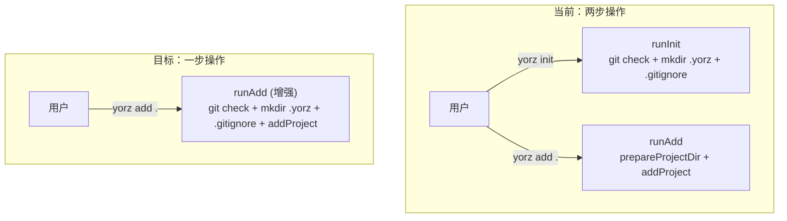
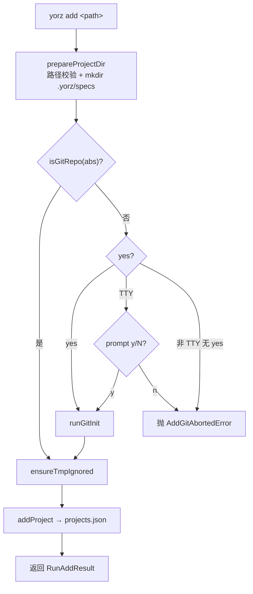

# 移除 init 命令，初始化逻辑合并进 add

## 1. 背景

前序 spec `260701.feat.yorz-init-and-install-restructure` 新增了 `yorz init` 命令，负责 git init 引导、创建 `.yorz/` 目录、追加 `.yorz/tmp` 到 `.gitignore`。

但实际使用中发现 `init` 与 `add` 两步操作割裂：用户必须先 `yorz init` 再 `yorz add .`，而 `add` 内部的 `prepareProjectDir` 已经会创建 `.yorz/specs` 目录——初始化职责分散在两个命令中，体验冗余。

本次重构将 `init` 的全部逻辑合并进 `add <path>`，移除独立 `init` 命令。

## 2. 需求

- 移除 `yorz init` CLI 命令及其注册。
- `yorz add <path>` 在注册项目到全局 config 之前，自动执行原 `init` 的全部初始化逻辑（以 `<path>` 为目标目录）：
  1. 检查目标目录是否 git 仓库；非 git 仓库时按 TTY / `--yes` 策略引导 `git init`，用户拒绝则终止。
  2. 确保 `.yorz/` 目录存在（`prepareProjectDir` 已创建 `.yorz/specs`，部分覆盖）。
  3. 确保目标目录 `.gitignore` 包含 `.yorz/tmp`。
- 清理 `init.ts` / `init.test.ts`，将相关测试场景迁移到 `add.test.ts`。

## 3. 现状分析

### 3.1 init 命令实现

`src/cli/init.ts` 导出 `runInit(opts: RunInitOptions)`，核心流程：

1. `isGitRepo(cwd)` 检查 `.git` 是否存在（来自 `src/cli/git.ts`）。
2. 非 git 仓库时分三种策略：
   - `--yes` / `opts.yes === true`：直接 `runGitInit(cwd)`。
   - TTY 交互：`readline/promises` 询问 `[y/N]`，用户同意则 `runGitInit`，拒绝抛 `InitAbortedError`。
   - 非 TTY 且无 `--yes`：抛 `InitAbortedError`。
3. `mkdir(join(cwd, '.yorz'), { recursive: true })`。
4. `ensureTmpIgnored(cwd)`（来自 `src/cli/install.ts`）：若 cwd 是 git 仓库且 `.gitignore` 未含 `.yorz/tmp` 则追加。

返回 `RunInitResult { cwd, gitInitialized, yorzDirCreated, gitignore }`。

`src/cli/index.ts:46-69` 注册 `program.command('init')`，支持 `--yes/-y`、`--cwd <path>`。

### 3.2 add 命令实现

`src/cli/add.ts` 导出 `runAdd(opts: RunAddOptions)`，仅 17 行：

```ts
export async function runAdd(opts: RunAddOptions): Promise<RunAddResult> {
  const abs = await prepareProjectDir(opts.path, opts.cwd)
  return await addProject(abs, opts.globalConfigPath)
}
```

`prepareProjectDir`（`src/service/global-config.ts:183-197`）已做：

- 路径校验（存在性 + 目录校验）。
- `mkdir(join(abs, '.yorz', 'specs'), { recursive: true })` —— **已创建 `.yorz` 目录**。
- 返回绝对路径。

`addProject`（`src/service/global-config.ts:128-145`）：将绝对路径写入全局 `projects.json`，幂等。

`src/cli/index.ts:126-133` 注册 `program.command('add <path>')`，无额外选项。

### 3.3 职责重叠

| 步骤              | init | add (prepareProjectDir)  |
| ----------------- | ---- | ------------------------ |
| 路径校验          | ❌   | ✅                       |
| git init 引导     | ✅   | ❌                       |
| 创建 `.yorz`      | ✅   | ✅（通过 `.yorz/specs`） |
| `.gitignore` 追加 | ✅   | ❌                       |
| 注册全局 config   | ❌   | ✅                       |

合并后 `add` 将覆盖全部 5 行。

### 3.4 测试现状

- `src/cli/__tests__/init.test.ts`（93 行）：5 个用例覆盖 git 已初始化 / TTY 确认 y / TTY 确认 n / yes=true / 非 TTY 无 yes。
- `src/cli/__tests__/add.test.ts`（61 行）：4 个用例覆盖正常添加 / 幂等 / 拒绝非目录 / 相对路径解析。测试中目标目录均无 `.git`，不涉及 git 逻辑。



## 4. 技术实现方案

### 4.1 add.ts 增强

将 `init.ts` 的 git-init 编排逻辑迁移到 `add.ts`，`runAdd` 在 `prepareProjectDir` 之后、`addProject` 之前执行初始化：

```ts
// src/cli/add.ts（重构后）
import { addProject, prepareProjectDir, type GlobalProjectEntry } from '../service/global-config.js'
import { isGitRepo, runGitInit } from './git.js'
import { ensureTmpIgnored } from './install.js'
import { createInterface } from 'node:readline/promises'

export interface RunAddOptions {
  path: string
  cwd?: string
  globalConfigPath?: string
  /** 非 TTY 或 CI 场景直接跳过 git-init 确认。 */
  yes?: boolean
  /** 测试注入点。 */
  prompt?: (question: string) => Promise<string>
  runGitInit?: (cwd: string) => Promise<void>
  isTTY?: boolean
}

export interface RunAddResult {
  entry: GlobalProjectEntry
  created: boolean
  gitInitialized: boolean
  gitignore: { updated: boolean; path: string } | null
}

export class AddGitAbortedError extends Error {
  constructor(message: string) {
    super(message)
    this.name = 'AddGitAbortedError'
  }
}
```

流程（`runAdd` 内部）：

1. `abs = prepareProjectDir(opts.path, opts.cwd)` —— 复用现有路径校验 + 创建 `.yorz/specs`。
2. `gitInitialized = false`；若 `!isGitRepo(abs)`：
   - `opts.yes` → `runGitInit(abs)`。
   - TTY → readline `[y/N]`；同意 `runGitInit(abs)`，拒绝抛 `AddGitAbortedError`。
   - 非 TTY 无 `--yes` → 抛 `AddGitAbortedError`。
3. `ensureTmpIgnored(abs)`。
4. `addProject(abs, opts.globalConfigPath)`。

> `prepareProjectDir` 已经 `mkdir .yorz/specs`，无需重复创建 `.yorz`。
>
> 注意：原 `ensureTmpIgnored` 内部会再次 `isGitRepo(cwd)` 检查；若步骤 2 刚执行了 `git init`，此处 `isGitRepo` 会返回 `true`，`.gitignore` 更新正常生效。

### 4.2 index.ts 命令注册变更

按用户批注确认，`add` 命令**不暴露** `--cwd`，保持现状（相对路径基于 `process.cwd()`）。

1. 删除 `init` 命令注册（`src/cli/index.ts:46-69`）及 `import { runInit, InitAbortedError }`；`InitOpts` 类型定义同步删除。
2. `add` 命令增加 `--yes/-y` 选项与 `AddGitAbortedError` 错误处理：

```ts
program
  .command('add <path>')
  .description('Initialize and register a directory as a YorZ project.')
  .option('-y, --yes', 'skip the git-init confirmation prompt', false)
  .action(async (input: string, opts: { yes?: boolean }) => {
    try {
      const result = await runAdd({ path: input, yes: opts.yes })
      if (result.gitInitialized) {
        console.log(`[git] initialized ${result.entry.path}`)
      }
      if (result.gitignore?.updated) {
        console.log(`[gitignore] appended .yorz/tmp to ${result.gitignore.path}`)
      }
      if (result.created) {
        console.log(`added project ${result.entry.id}: ${result.entry.path}`)
      } else {
        console.log(`project already registered: ${result.entry.id} -> ${result.entry.path}`)
      }
    } catch (err) {
      if (err instanceof AddGitAbortedError) {
        console.error(`error: ${err.message}`)
        process.exit(1)
      }
      throw err
    }
  })
```

### 4.3 文件删除

- 删除 `src/cli/init.ts`。
- 删除 `src/cli/__tests__/init.test.ts`。

### 4.4 测试迁移

`src/cli/__tests__/add.test.ts` 扩展，把 init.test.ts 的 5 个场景以「add 时目标目录无 .git」的方式覆盖：

- 已有用例（正常添加 / 幂等 / 非目录拒绝 / 相对路径）需适配：原用例目标目录无 `.git`，新版 `runAdd` 默认会因非 TTY 无 `--yes` 抛 `AddGitAbortedError`。解决方案：已有用例注入 `yes: true` + mock `runGitInit`（或预创建 `.git` 目录跳过 git 逻辑）。
- 新增用例覆盖：
  1. 目标目录已有 `.git` → 正常添加，不触发 git init。
  2. 目标目录无 `.git` + `yes: true` + mock `runGitInit` → 添加成功，`gitInitialized === true`。
  3. 目标目录无 `.git` + TTY + prompt=y → 添加成功。
  4. 目标目录无 `.git` + TTY + prompt=n → 抛 `AddGitAbortedError`。
  5. 目标目录无 `.git` + 非 TTY 无 `--yes` → 抛 `AddGitAbortedError`。
  6. 验证 `.gitignore` 包含 `.yorz/tmp`（在 `.git` 存在的场景下）。



### 4.5 兼容性与影响范围

- **Breaking**：`yorz init` 命令被移除，已使用该命令的脚本/CI 需改用 `yorz add . --yes`。
- `git.ts`（`isGitRepo` / `runGitInit`）不变，继续被 `install.ts` 与 `add.ts` 共享。
- `install.ts` 的 `ensureTmpIgnored` 不变，新增 `add.ts` 作为调用方。
- `RunInitOptions` / `RunInitResult` / `InitAbortedError` 类型随之删除，无外部消费者。
- `package.json` 无 `yorz init` 脚本调用，不受影响。

## 5. 待确认问题

_暂无_

## 6. 任务清单

- [x] 重构 `src/cli/add.ts`：迁移 init 编排逻辑（git 检查、TTY prompt、runGitInit、ensureTmpIgnored），扩展 `RunAddOptions` / `RunAddResult`，新增 `AddGitAbortedError`（验收：tsc --noEmit 通过；grep 无 InitAbortedError 残留）
- [x] 更新 `src/cli/index.ts`：删除 init 命令注册及相关 import / InitOpts 类型；为 `add` 命令增加 `--yes/-y` 选项，处理 `AddGitAbortedError` 与新增打印语句（验收：`yorz --help` 不再出现 init 命令）
- [x] 删除 `src/cli/init.ts` 与 `src/cli/__tests__/init.test.ts`（验收：文件不存在；grep 无引用）
- [x] 扩展 `src/cli/__tests__/add.test.ts`：迁移 init.test.ts 的 5 个 git 场景（yes=true、TTY y/n、非 TTY 无 yes、已有 .git），并让原有 4 个用例通过预建 `.git` 或 `yes:true` 适配新行为，新增 `.gitignore` 断言（验收：vitest 全部通过）
- [x] 运行 `pnpm build` 与 `pnpm test`（或对应命令）确认全绿（验收：命令退出码 0）

## 7. 执行记录

- 2026-07-05 22:07 — 重构 `src/cli/add.ts`：将原 `runInit` 的 git 检查 / TTY 引导 / runGitInit / ensureTmpIgnored 全部迁入 `runAdd`，扩展 `RunAddOptions`（`yes` / `prompt` / `runGitInit` / `isTTY`）与 `RunAddResult`（`gitInitialized` / `gitignore`），新增 `AddGitAbortedError`。
- 2026-07-05 22:09 — 更新 `src/cli/index.ts`：移除 init 命令注册与 `runInit` / `InitAbortedError` / `InitOpts` 相关代码；`add` 命令新增 `-y, --yes` 选项，捕获 `AddGitAbortedError` 输出错误退出，成功路径打印 git / gitignore / add 三段结果。
- 2026-07-05 22:10 — 删除 `src/cli/init.ts` 与 `src/cli/__tests__/init.test.ts`；`grep runInit|InitAbortedError` 在 src/ 下无残留。
- 2026-07-05 22:12 — 扩展 `src/cli/__tests__/add.test.ts` 至 9 个用例：原 4 个用例改为预建 `.git` 避免走 git-init 分支；新增 5 个用例覆盖 `.git` 已存在 + `.gitignore` 更新、yes=true、TTY y、TTY n、非 TTY 无 yes 全部场景。
- 2026-07-05 22:13 — `pnpm exec vitest run src/cli/__tests__/add.test.ts` 9/9 通过；`pnpm run build:cli` 成功；`node dist/cli/index.js --help` 已无 `init`，`node dist/cli/index.js add --help` 列出 `-y, --yes` 选项。全量 `pnpm test` 存在 1 个失败在 `src/service/__tests__/service.test.ts` 的 SSE 超时用例，与本次改动无关（未触及 service 代码）。
- 2026-07-05 22:15 — 收尾：所有任务完成，无待确认问题 / 批注 / 追加任务，`stage` 标记为 `done`。
