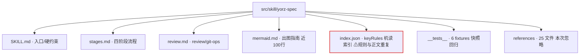

# review yorz-spec skill 文档优化

## 1. 背景

`src/skill/yorz-spec/` 是 YorZ 用来「以 spec 驱动 Agent 编程」的核心 skill：把单个 spec 文档当作状态机，围绕 plan / tasks / execute 三阶段推进，并将状态持续写回 md。当前该 skill 已迭代多轮（见 `260702.refct.simplify-spec-skill` 等历史 spec），文档被精简为 SKILL / stages / review / mermaid 四个正文文件 + `index.json` 索引 + `__tests__` 快照用例 + `references/` 第三方语法文档。

## 2. 需求

review `src/skill/yorz-spec/` 目录下文件，该 skill 使用 spec 驱动 Agent 编程，提供优化建议及优化原因；用户后续会决定执行哪些优化项。

约束：忽略 `references/` 目录（第三方绘制 skill 语法文档，暂不改动）。

## 3. 现状分析

本次 review 覆盖以下文件（不含 `references/`）：

- `SKILL.md`：入口，含输入约定、frontmatter 规范、格式约定、自动模式判定（1-8 顺序）、全局硬约束、lint 硬约束、持续推进约束。
- `stages.md`：plan / tasks / execute / new-spec 四阶段流程与正面示例。
- `review.md`：mode=review / mode=git-ops 独立路径（不进状态机，不改 frontmatter）。
- `mermaid.md`：出图选型表 + 场景优先级 + 各阶段落点 + 输出规范 + 节制原则。
- `index.json`：按 module 罗列 keyRules 与 relatedCases 的机读索引。
- `__tests__/`：6 个 fixtures + runner + vitest 配置，作为规则的快照回归。

文件结构与主要问题定位如下（问号标注疑点）：

关键观察：

1. `index.json` 的 keyRules 与 SKILL/stages/mermaid/review 正文规则高度重复，两处需手工同步。
2. Agent 使用 skill 的推荐 Read 顺序是 SKILL → stages → review（见 SKILL.md「如何使用本 skill」），`index.json` 不在其中，其消费方（lint？测试？人？）在文档中未声明。
3. 存在若干「文档内数字/规则不一致」：如 `index.json` 称 mermaid「选型表 18 种图表」，实际 `mermaid.md` 选型表为 17 行；`index.json` 称待确认问题「恰 1 个 (推荐)」，但 `stages.md` 5.2 示例允许「自由文本、无推荐项」的问题。
4. 多处强制「秒级时间戳」（frontmatter.updated_at、review 二级标题），但未规定获取方式，Agent 有编造时间的风险。
5. `mermaid.md` 体量较大且仅在「需要出图」时才相关，但 SKILL.md 未把它标注为「仅按需 Read」，对纯状态推进任务是 context 浪费。

## 4. 技术实现方案

以下为优化项清单，按优先级分组；每项含「问题 / 原因 / 建议」。编号（P1…）供用户在待确认问题中勾选。

**批注消费结论（本次执行范围）：**

- **纳入执行**：P1（index.json 收敛为导航索引，删除 keyRules）、P4（标注 mermaid.md 仅按需 Read）、P6（review.md 元确认禁令改为引用 SKILL.md）、P7（对齐 mermaid treeView/treemap 命名，treeView 保持推荐、treemap 保持低优）。
- **不纳入**：P3 用户选择「维持现状」，时间戳表述不改；P2、P5 用户未勾选，本次不做（P2 中「index.json 数字不一致」随 P1 删除 keyRules 一并消除）。
- **P7 现状补充**：`yorz lint` 的 `mermaid/fence` 白名单已含 `treeView-beta` / `treemap-beta`，故无需改 lint 代码；仅需把 `mermaid.md` 中 `treeView` / `treemap` 的类型名对齐为带 `-beta` 的实际关键字，避免 Agent 写出不合白名单的 fence 首行。

### 4.1 高优先级（一致性 / 正确性）

- **P1 · 消除 `index.json` 与正文的规则漂移**
  - 问题：`index.json.keyRules` 与 SKILL/stages/mermaid/review 正文是同一批规则的两份拷贝，改正文时极易漏改索引。
  - 原因：单一真相原则；重复副本必然随迭代漂移，已出现下方 P2 的实证不一致。
  - 建议：明确 `index.json` 的唯一职责（见待确认问题 5.2），要么收敛为「仅列 module→file→relatedCases 的导航索引，删除会与正文漂移的 keyRules」，要么在文件头注明「本文件由正文派生，改正文后需同步」。

- **P2 · 修正文档内数字/规则不一致**
  - 问题：(a) `index.json` mermaid 模块写「选型表 18 种图表」，实际选型表 17 行；(b) `index.json` 写待确认问题「恰 1 个 (推荐)」，与 `stages.md` 5.2「自由文本、无推荐」示例冲突；(c) `index.json` 写 references「25 个文件」需与实际数保持同步。
  - 原因：机读索引被工具或人引用时，错误数字会误导；自相矛盾的规则会让 Agent 在生成待确认问题时无所适从。
  - 建议：逐条核对并改为准确表述，例如把「恰 1 个 (推荐)」修正为「候选式问题恰 1 个 (推荐)；自由文本问题无候选项」。

- **P7 · 对齐 mermaid 文档与 lint 白名单**
  - 问题：`mermaid.md` 把 `treeView` / `treemap` 列为「高优先级必须用图」，但 `yorz lint` 的 `mermaid/fence` 规则白名单不含 `treeView`，Agent 若照做会直接 lint 报错（本 spec 首次 lint 即命中）。
  - 原因：文档推荐的用法被自身工具链拒收，会让 Agent 在推进中卡在 lint 失败循环。
  - 建议：二选一——(a) 扩展 lint 白名单以支持 `treeView` / `treemap` 等 mermaid 扩展图；或 (b) 从 `mermaid.md` 移除/降级 lint 尚不支持的图表类型，保持文档与工具一致。

- **P3 · 统一秒级时间戳获取方式**
  - 问题：frontmatter.updated_at 与 review 二级标题都要求秒级本机时间，但未规定来源，Agent 可能凭空生成或用错时区。
  - 原因：时间戳是排序与审计依据（review.md 要求按时间降序插入），错误时间会破坏顺序与可信度。
  - 建议：在 SKILL.md frontmatter 规范与 review.md 中明确「通过 Bash 执行 `date '+%Y-%m-%d %H:%M:%S'` 取值，禁止手工编造」。

### 4.2 中优先级（可读性 / context 效率）

- **P4 · 明确 `mermaid.md` 为「仅按需 Read」**
  - 问题：SKILL.md「如何使用本 skill」列出的按需 Read 顺序仅含 SKILL/stages/review，mermaid 在正文中被顺带提到但未纳入加载策略说明。
  - 原因：mermaid.md 近百行且多数纯状态推进任务并不出图，无差别加载浪费 context。
  - 建议：在加载顺序处补一条「仅当判断需要出图升维时才 Read mermaid.md 及 references/」，让默认路径更轻。

- **P5 · 补全「章节建议」对可选章节的说明**
  - 问题：自动模式判定第 2 条优先扫描 `## 追加任务`，但「章节建议」把它标为可选/懒插入，新读者不易建立「何时出现该章节」的心智模型。
  - 原因：可选章节的插入时机若不写清，Agent/用户会困惑该章节缺失是正常还是遗漏。
  - 建议：在「章节建议」处一句话说明 `## 追加任务` / `## 用户批注` 的懒插入触发时机与用途。

### 4.3 低优先级（去重 / 表述打磨）

- **P6 · 收敛跨文件重复的「禁止元确认」表述**
  - 问题：SKILL.md「持续推进硬约束」与 review.md「通用硬约束」都各自表述了「禁止向用户元确认」。
  - 原因：同一约束两处维护，语义漂移风险；但跨文件抽取有成本。
  - 建议：低优先，可在 review.md 用一句「元确认禁令同 SKILL.md『持续推进硬约束』」引用替代重复正文。

## 5. 待确认问题

_暂无_

## 6. 任务清单

- [x] P1：收敛 `src/skill/yorz-spec/index.json`，删除各 module 的 `keyRules` 字段，仅保留 `module` / `file` / `relatedCases` 导航结构（验收：grep `keyRules` 无残留；`yorz lint` 该文件无 error；`src/cli/__tests__/install.test.ts` 仍通过）
- [x] P4：在 `src/skill/yorz-spec/SKILL.md`「如何使用本 skill」补充说明 `mermaid.md` 与 `references/` 仅在需要出图时才 Read（验收：文中出现「仅按需 Read」类明确表述）
- [x] P6：将 `src/skill/yorz-spec/review.md`「通用硬约束」中的元确认禁令改为引用 SKILL.md「持续推进硬约束」，删除重复正文（验收：review.md 不再重复展开元确认禁令，仅保留一句引用）
- [x] P7：在 `src/skill/yorz-spec/mermaid.md` 将 `treeView` / `treemap` 类型名对齐为 `treeView-beta` / `treemap-beta`，保持 treeView 为推荐图、treemap 为低优（验收：与 `src/lint/rules/mermaid.ts` 的 `DIAGRAM_TYPES` 白名单一致）

## 7. 执行记录

- 2026-07-05 11:31:14 · P1：`src/skill/yorz-spec/index.json` 删除四个 module 的 `keyRules` 数组，仅保留 `module` / `file` / `relatedCases`。验证：全仓 `grep keyRules src/` 无残留；`npx vitest run src/cli/__tests__/install.test.ts` 16/16 通过（install 仅校验 index.json 文件存在，不依赖 keyRules 内容）。
- 2026-07-05 11:31:14 · P4：`SKILL.md`「如何使用本 skill」将 mermaid.md/references 从顺带一句改为明确「**仅按需 Read**」，说明纯状态推进任务不必加载以省 context。
- 2026-07-05 11:31:14 · P6：`review.md`「通用硬约束」的元确认禁令改为「元确认禁令同 SKILL.md『持续推进硬约束』」引用式表述，去除跨文件重复正文。
- 2026-07-05 11:31:14 · P7：`mermaid.md` 选型表与优先级列表中 `treeView` → `treeView-beta`、`treemap` → `treemap-beta`，并补注 fence 首行须写 `-beta` 关键字；与 `src/lint/rules/mermaid.ts` `DIAGRAM_TYPES` 白名单一致，treeView 保持高优推荐、treemap 保持低优。lint 白名单已含二者故无需改动 lint 代码。
