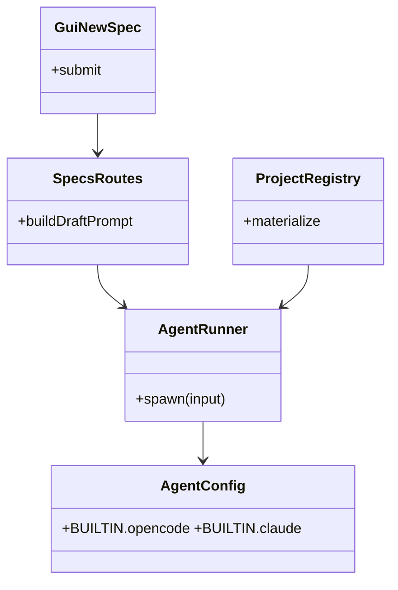

# fix: opencode Agent 在 git worktree 项目中不遵循 cwd

## 1. 背景

- 用户在 GUI「新建 spec」表单勾选「新开项目并行」（走 git worktree），期望：
  - 新 spec 文件写入 worktree 项目目录（例：`/Users/fenghen/my-space/YorZ.wt/wt__worktree/.yorz/specs/...`）。
  - Agent 后续读文件、跑命令都以该 worktree 为工作目录。
- 实际观察：
  - Service 侧日志显示 `spawn` 时 cwd 已经指向 worktree 路径（`[serve] 1111111 opencode /Users/fenghen/my-space/YorZ.wt/wt__worktree`）。
  - 但 opencode Agent 输出的第一批工具调用仍旧读源目录：`Read /Users/fenghen/my-space/YorZ/.yorz/specs/260703.feat.at-mention-file-completion/spec.md`。
  - 新建 spec 的落点最终也写在源项目 `.yorz/specs/`。
- 后端差异：将 `.yorz/config.json` 的 `agent.kind` 切成 `claude` 时，同一 worktree 流程工作正常，问题仅在 `opencode` 后端上。

## 2. 现状分析

### 2.1 spawn 侧：cwd 已按项目路径注入

`AgentRunner` 在 `spawn` 时把 `cwd` 直接透传：

- `src/service/project-registry.ts:180` 构造 runner 时用 `cwd: input.path`（项目在全局配置中登记的绝对路径）。
- `src/service/agent.ts:69-75` 保存 `this.cwd`；`this.cwd = opts.cwd`。
- `src/service/agent.ts:223` 真正 `spawn(cmd.cmd, cmd.args(prompt), { cwd: this.cwd, ... })`。

worktree 项目登记的 `input.path` 就是 worktree 绝对路径，因此**子进程 `process.cwd()` 是正确的 worktree**——这与用户看到的 `[serve] 1111111 opencode /Users/fenghen/...wt__worktree` 一致。

<details>
<summary>精确层：opencode 后端命令拼装</summary>

- `src/service/agent-config.ts:53-60` 定义：
  ```ts
  opencode: {
    cmd: 'opencode',
    args: (prompt) => ['run', '--dangerously-skip-permissions', prompt],
    streamFormat: 'text',
  }
  ```
- 未向 opencode 传入任何显式的 `--cwd` / `--project` / `-C` 参数，也没有透传 `env`（走 `spawn` 默认 `env: process.env`）。

</details>

### 2.2 prompt 侧：路径是相对项目根、绝对目录未内置

- Service 传给 Agent 的 skill-run prompt（`src/service/routes/specs.ts:178, 194, 219`）都是 `p.specsDirRelative`（例：`.yorz/specs/<id>/spec.md`）相对路径。
- 期望 Agent 按 `process.cwd()` 解释这些相对路径；对 claude 后端有效——它以 cwd 为根解析工具调用参数。
- opencode 后端**不以子进程 cwd 为根**解析相对路径，而是沿用一个从父进程继承而来的"启动目录"（见 2.3）。

### 2.3 根因：opencode 沿用 yorz serve 启动时目录，不遵循 spawn cwd

用户在 `~/Downloads` 目录下运行 `yorz serve`，为 worktree 项目触发 skill-run 时：

- Service `spawn` 传入了 `cwd = /Users/fenghen/.../wt__worktree`，子进程 `process.cwd()` 正确。
- 但 opencode 输出的 `Read` 目标是 `~/Downloads/.yorz/specs/260703.feat.at-mention-file-completion/spec.md`——即 **`yorz serve` 启动时的 shell 目录**，与 spawn 传入的 cwd 无关。

Node.js `child_process.spawn` 的默认 `env` 直接继承 `process.env`。POSIX shell 会维护 `PWD` 变量记录 shell 当前目录，Node.js 进程也会带上父 shell 的 `PWD`；当 spawn 未覆盖 `env` 时，`PWD` 就一路传递到 opencode 子进程。opencode 若以 `process.env.PWD` 而非 `process.cwd()` 定位工作目录，就会锚定到 `yorz serve` 启动时的目录，这与用户观察完全吻合。

结论：**opencode 使用 `process.env.PWD`（而不是 `process.cwd()`）作为项目根**。因此只覆盖 spawn 的 `cwd` 不够，还必须在 `env` 里显式覆盖 `PWD`。

<details>
<summary>精确层：证据链</summary>

- 现象：`yorz serve` 在 `~/Downloads` 下启动，agent 尝试 `Read ~/Downloads/.yorz/specs/...`，与该目录一一对应。
- 排除项：
  - **不是 git 侧因素**：worktree 里 `.git` 是文件（指向源仓库），若走 `git rev-parse` 至少会落到源仓库路径（`/Users/fenghen/my-space/YorZ`），而非 `~/Downloads`。
  - **不是 opencode 缓存**：若走 `~/.local/share/opencode/projects/<hash>` 缓存，也只会落到之前注册过的项目路径，不会落到临时 shell 目录。
  - **不是子进程 cwd 错误**：Service 日志证明 `spawn(cwd=<worktree>)` 已正确传入。
- 唯一能解释「沿用 shell 启动目录」的信道是从父进程继承的环境变量，最可能是 POSIX `PWD`。

</details>

### 2.4 GUI 端：新建流程无 bug（问题不在这里）

`src/gui/src/pages/NewSpec.tsx:376-408` 已经正确用 worktree 的 `pid` 调用 `api.createSpec`：

- 勾选「新开项目并行」时 `createWorktree(...)` 先返回 `wt.id`；
- 之后的 `listSpecs` / `createSpec` / `pollForNewSpec` 全部使用这个 `pid`；
- Service 会为该 pid `materialize` 出以 worktree 绝对路径为 `cwd` 的独立 runner。

因此第二段现象（新 spec 写入 `yorz serve` 启动目录）是**同一根因**（opencode 走 `PWD` 而非 spawn cwd）的下游效应，不是 GUI 侧多传了 sourcePid。


## 3. 技术实现方案

### 3.1 修复目标

- opencode 后端在 worktree 项目下拉起时，读写文件与命令执行必须锚定到 worktree 目录；claude 后端行为保持不变。
- 修复不引入对 opencode 版本的强绑定。

### 3.2 选定方案：spawn opencode 时显式覆盖 PWD

在 `src/service/agent.ts:223` 的 `spawn` 处，为 opencode 后端合并额外 `env`：

- `PWD=<cwd>`（**核心**，直接对应 2.3 结论）
- `GIT_DIR=<cwd>/.git`、`GIT_WORK_TREE=<cwd>`（保险项：若 opencode 部分子路径仍走 git CLI 探测项目，锁死到 worktree）

改动落点：

- `src/service/agent-config.ts`：
  - `AgentCmd` 增加可选 `env?(cwd: string): Record<string, string>` 字段。
  - `BUILTIN.opencode` 实现 `env(cwd) => ({ PWD: cwd, GIT_DIR: `${cwd}/.git`, GIT_WORK_TREE: cwd })`。
  - `BUILTIN.claude` 及 `custom` 不实现 `env`（保持默认，不外泄）。
- `src/service/agent.ts:223`：spawn 时 `env: { ...process.env, ...(cmd.env?.(this.cwd) ?? {}) }`。

<details>
<summary>精确层：为何不选其它方案</summary>

- **方案 B（prompt 里补全绝对路径）**：只解决 skill-run prompt 显式路径；Agent 自主推断的相对路径（`.yorz/tmp/drafts/...`、`git status` 等）仍会掉回错误目录，治标不治本。**用户已通过 4.1 批注明确忽略 CLI 参数方向**，方案 B 也失去存在的意义（不作为兜底）。
- **方案 C（`--cwd` / `--project` CLI 参数）**：用户批注 4.1 明确「忽略」——不再考察 opencode 是否原生支持。排除。
- **方案 D（复制 opencode 配置目录）**：用户批注 4.3 明确「忽略」缓存清理路径，且侵入面高、跨版本脆弱。排除。

</details>

### 3.3 影响面（结构 + 语义配色）



- **breaking（红）**：`src/service/agent-config.ts`——`AgentCmd` 结构新增可选 `env` 字段。
- **affected（黄）**：`src/service/agent.ts` 需按新 `AgentCmd` 消费 `env`。
- **不变**：GUI、`ProjectRegistry.materialize`、worktree 建立流程、`SpecsRoutes` prompt 拼装。

### 3.4 验证策略

1. **单元/集成测试**：
   - `src/service/__tests__/agent-config.test.ts`：新增用例验证 `BUILTIN.opencode.env('/tmp/wt')` 返回 `{ PWD:'/tmp/wt', GIT_DIR:'/tmp/wt/.git', GIT_WORK_TREE:'/tmp/wt' }`；`BUILTIN.claude.env` 未定义。
   - `src/service/__tests__/agent.test.ts`：mock spawn，断言 opencode 后端 spawn 时的 `env` 参数包含覆盖后的 `PWD`；claude 后端 `env` 不含 override。
2. **手动 E2E**：在非项目目录（例：`~/Downloads`）启动 `yorz serve`，用 GUI 新建 spec + 勾选「新开项目并行」+ opencode 后端；确认：
   - 新 spec 落在 `.../wt__*/.yorz/specs/` 而非 `~/Downloads/.yorz/specs/`；
   - Agent 首次 Read 目标位于 wt 路径下。
3. **不回归 claude**：同一场景在 `agent.kind=claude` 下跑一遍，确认无回归、`env` 未泄漏 `PWD` 覆盖。

## 4. 待确认问题

_暂无_

## 5. 任务清单

- [x] 在 `src/service/agent-config.ts` 中扩展 `AgentCmd` 类型：新增可选字段 `env?(cwd: string): Record<string, string>`（验收：`tsc --noEmit` 通过）
- [x] 在 `src/service/agent-config.ts` 的 `BUILTIN.opencode` 实现 `env(cwd)`，返回 `{ PWD: cwd, GIT_DIR: `${cwd}/.git`, GIT_WORK_TREE: cwd }`；`BUILTIN.claude` 与 `custom` 分支不实现（验收：`BUILTIN.claude.env` 为 `undefined`）
- [x] 在 `src/service/agent.ts:223` 附近的 `spawn(...)` 调用处，将 `env` 合并为 `{ ...process.env, ...(cmd.env?.(this.cwd) ?? {}) }`（验收：opencode spawn 参数含新 env；claude spawn 参数与旧行为一致）
- [x] 在 `src/service/__tests__/agent-config.test.ts` 新增用例验证 opencode/claude 的 `env` 行为（验收：`vitest run src/service/__tests__/agent-config.test.ts` 通过）
- [x] 在 `src/service/__tests__/agent.test.ts` 新增/扩展用例，mock spawn 断言 opencode 后端合并了 PWD 覆盖、claude 后端未被覆盖（验收：`vitest run src/service/__tests__/agent.test.ts` 通过）
- [x] 运行仓库现有 lint / 类型检查 / 全量测试（验收：`pnpm test` 或等价命令全绿）
- [ ] [manual] 手动 E2E 验证：在非项目目录启动 `yorz serve`，GUI 新建 spec + 勾选「新开项目并行」+ opencode 后端，确认新 spec 落在 wt 目录且 agent 首次 Read 路径正确（验收：人工确认目录符合预期）
- [ ] [manual] 手动回归验证：将 `agent.kind` 切为 `claude`，重复上述 E2E，确认无回归（验收：人工确认 claude 后端表现与旧版一致）

## 6. 执行记录

- 2026-07-06 22:36 完成任务 1-3：`src/service/agent-config.ts` 扩展 `AgentCmd` 增加 `env?(cwd)`；`BUILTIN.opencode` 实现 `env(cwd) => { PWD, GIT_DIR, GIT_WORK_TREE }`；`src/service/agent.ts:223` 的 `spawn` 合并 `{ ...process.env, ...(cmd.env?.(this.cwd) ?? {}) }`。claude/custom 分支未定义 `env`，保持原有默认行为。
- 2026-07-06 22:36 完成任务 4-5：`src/service/__tests__/agent-config.test.ts` 新增两条用例断言 opencode 的 `env` 输出与 claude 的 `env` 为 `undefined`；`src/service/__tests__/agent.test.ts` 新增两条 e2e 型 spawn 测试，通过 `node -e` 打印 `process.env.PWD` / `GIT_DIR` 观察合并结果，并单独断言无 `env` 时父进程 `PWD` 透传。
- 2026-07-06 22:37 完成任务 6：`pnpm exec vitest run src/service/__tests__/agent-config.test.ts src/service/__tests__/agent.test.ts` 通过（21/21）；`pnpm run build:cli` 通过；`pnpm test` 全绿（278/278）；`pnpm exec tsc --noEmit` 通过。
- 2026-07-06 22:37 收尾：非 `[manual]` 任务全部完成，`## 待确认问题` 为 `_暂无_`、无 `！！！` 批注、无 `[open]` 追加任务，按 skill 规则标记 `stage=done`；剩余两条 `[manual]` E2E 验证条目保留，待用户在真实环境执行。
