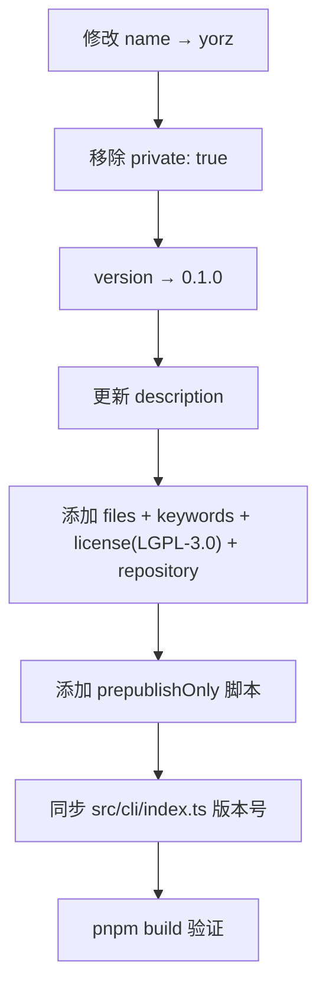
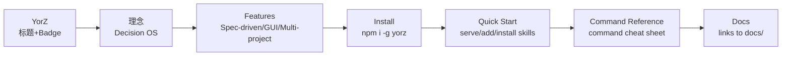

# feat: npm 发布准备与 README 重写

## 1. 背景

YorZ 已具备完整的 CLI（install/uninstall/add/lint/serve）、Service（HTTP+SSE+FS Watcher）、GUI（SolidJS）与 yorz-spec skill 驱动 Agent 工作流。现需将包发布到 npm（包名 `yorz`），并提供面向终端用户的 README 文档与基础使用教程。

## 2. 需求

- 准备发布到 npm，包名 `yorz`
- 更新 README 文档，包括：概括介绍（理念）、功能特色、如何安装
- 提供基础使用教程：`yorz serve`、添加目录、启动 dev 服务

## 3. 现状分析

```mermaid
flowchart LR
    subgraph 当前状态
        A["package.json<br/>name=@yorz/cli<br/>private=true<br/>version=0.0.1"] --> B["README.md<br/>仅4行<br/>链接到设计文档"]
        C["CLI 命令<br/>install/uninstall<br/>add/lint/serve"] --> D["dist 构建产物<br/>shebang ✓<br/>chmod 0o755 ✓"]
    end
    subgraph 缺失项
        E["npm 元信息<br/>files/keywords/<br/>license/repository"]
        F["prepublishOnly<br/>构建钩子脚本"]
        G["面向用户 README<br/>理念/功能/安装/教程"]
    end
    A -.->|"需修改"| E
    A -.->|"需修改"| F
    B -.->|"重写"| G
```



### 3.1 package.json 现状

| 字段             | 当前值                                                                          | 问题                       |
| ---------------- | ------------------------------------------------------------------------------- | -------------------------- |
| `name`           | `@yorz/cli`                                                                     | 需改为 `yorz`              |
| `private`        | `true`                                                                          | 需移除，否则无法发布       |
| `version`        | `0.0.1`                                                                         | 改为 `0.1.0`               |
| `description`    | "YorZ CLI — install/uninstall the yorz-spec skill into Claude Code / OpenCode." | 偏窄，需更新为更全面的描述 |
| `bin`            | `"./dist/cli/index.js"`                                                         | 正确，无需修改             |
| `engines.node`   | `>=20`                                                                          | 正确                       |
| `files`          | 缺失                                                                            | 需添加，控制发布产物范围   |
| `keywords`       | 缺失                                                                            | 需添加，提升 npm 可搜索性  |
| `license`        | 缺失                                                                            | 需添加 `LGPL-3.0-or-later` |
| `repository`     | 缺失                                                                            | 需添加                     |
| `prepublishOnly` | 缺失                                                                            | 需添加，确保发布前自动构建 |

### 3.2 README.md 现状

仅 4 行，内容为两个文档链接，无面向用户的内容（无安装说明、无功能介绍、无使用教程）。

### 3.3 CLI 命令全景

源码位于 `src/cli/index.ts`，已注册以下命令：

| 命令                    | 用途                                                       |
| ----------------------- | ---------------------------------------------------------- |
| `yorz install skills`   | 安装 yorz-spec skill 到 Claude Code / OpenCode             |
| `yorz uninstall skills` | 卸载 skill                                                 |
| `yorz add <path>`       | 初始化并注册一个目录为 YorZ 项目                           |
| `yorz lint [paths...]`  | 检查 spec.md 结构规范                                      |
| `yorz serve`            | 启动 YorZ Service（HTTP + SSE + 静态 GUI），支持多项目管理 |

### 3.4 构建产物验证

- `dist/cli/index.js`：shebang `#!/usr/bin/env node` 已存在 ✓
- 文件权限 `chmod 0o755` 已由 vite 插件设置 ✓
- Skill 文件通过 `import.meta.glob` 内联到 CLI bundle，无需单独打包 ✓
- GUI 构建产物在 `dist/gui/` 下 ✓

### 3.5 版本号硬编码

`src/cli/index.ts:37` 中 `program.version('0.0.1')` 为硬编码，需同步更新为 `0.1.0`。

## 4. 技术实现方案

### 4.1 package.json 调整



具体改动：

1. `name`: `@yorz/cli` → `yorz`
2. 移除 `"private": true`
3. `version`: `0.0.1` → `0.1.0`
4. `description`: 更新为 "Decision OS for software development — spec-driven Agent workflow with GUI."
5. 新增字段：

   ```json
   {
     "files": ["dist", "README.md"],
     "keywords": [
       "ai",
       "agent",
       "spec-driven",
       "decision-os",
       "claude-code",
       "opencode",
       "workflow",
       "cli"
     ],
     "license": "LGPL-3.0-or-later",
     "repository": {
       "type": "git",
       "url": "git+https://github.com/anomalyco/YorZ.git"
     },
     "homepage": "https://github.com/anomalyco/YorZ#readme"
   }
   ```

6. 新增 script：`"prepublishOnly": "pnpm run build"`
7. 同步 `src/cli/index.ts:37` 版本号 `'0.0.1'` → `'0.1.0'`

### 4.2 README.md 重写（英文）

面向终端用户，结构如下：



#### 内容大纲

1. **Title + tagline**：YorZ — Decision OS for software development.
2. **Core Philosophy**（摘自 `docs/Vision.md`）：
   - Software is accumulated decisions.
   - Code is just a projection of decisions.
   - Requirement → Decision → Knowledge → Implementation
3. **Features**：
   - Spec-driven Agent workflow (plan → tasks → execute → done)
   - Web GUI renders Agent output in real-time (Markdown / Mermaid / task progress)
   - Multi-project management
   - Built-in spec.md lint rules
   - Supports Claude Code & OpenCode
4. **Installation**：
   - `npm install -g yorz`（全局安装）
   - `npx yorz`（一次性使用）
   - Prerequisites: Node.js ≥ 20
5. **Quick Start**：
   - Step 1: Start the Service — `yorz serve`
   - Step 2: Add a project directory — `yorz add <path>`
   - Step 3: Install the Skill — `yorz install skills`
6. **Command Reference**：表格列出所有命令及常用选项
7. **Documentation**：指向 `docs/` 下的设计文档
8. **License**：LGPL-3.0-or-later

### 4.3 README_CN.md 新建（中文）

与英文 README 内容对应的中文版本，顶部提供英文 README 的交叉链接。

### 4.4 LICENSE 文件

新建 `LICENSE` 文件，使用 [LGPL-3.0-or-later](https://www.gnu.org/licenses/lgpl-3.0.txt) 全文。

### 4.5 发布前验证

- `pnpm build` 确认 dist 产物完整
- `npm pack --dry-run` 检查发布包内容，确认只含 `dist/` + `README.md` + `package.json`

## 5. 待确认问题

_暂无_

## 6. 任务清单

- [x] 更新 package.json（name→yorz, version→0.1.0, 移除 private, 更新 description, 添加 files/keywords/license/repository/homepage, 添加 prepublishOnly 脚本）（验收：字段齐全，JSON 合法）
- [x] 同步 src/cli/index.ts:37 版本号 0.0.1→0.1.0（验收：yorz --version 输出 0.1.0）
- [x] 创建 LICENSE 文件，LGPL-3.0-or-later 全文（验收：文件存在，首行包含 GNU Lesser General Public License）
- [x] 重写 README.md（英文：理念/功能/安装/快速开始/命令参考/文档链接/License）（验收：覆盖大纲全部章节，语言为英文）
- [x] 新建 README_CN.md（中文版，顶部链接英文 README）（验收：内容与英文版对应，含交叉链接）
- [x] 运行 pnpm build 验证构建（验收：dist/ 产物完整，无报错）
- [x] 运行 npm pack --dry-run 验证发布包内容（验收：仅含 dist/ + README.md + package.json + LICENSE）

## 7. 执行记录

- **package.json 更新**：name→`yorz`, version→`0.1.0`, 移除 `private`, 更新 description, 新增 files/keywords/license(LGPL-3.0-or-later)/repository/homepage, 新增 prepublishOnly 脚本。验证：JSON 格式合法，字段齐全。
- **CLI 版本号同步**：`src/cli/index.ts:37` 的 `program.version('0.0.1')` → `program.version('0.1.0')`。
- **LICENSE 文件创建**：写入 LGPL-3.0 全文（165 行），首行为 `GNU LESSER GENERAL PUBLIC LICENSE`。
- **README.md 重写**：英文版，含 Philosophy / Features / Installation / Quick Start（serve/add/install skills）/ Command Reference / Documentation / License 章节，含 badge 和中文交叉链接。
- **README_CN.md 新建**：中文版，内容与英文对应，顶部含 `[English](./README.md)` 交叉链接。
- **pnpm build 验证**：CLI 构建（90 modules, 264ms）+ GUI 构建（2253 modules, 4.78s），dist/ 产物完整，无报错。
- **npm pack --dry-run 验证**：包名 `yorz@0.1.0`，tarball 仅含 LICENSE + README.md + dist/ + package.json，143 files，4.3 MB（压缩后）。
- **收尾**：全部 7 项任务完成，无待确认问题，无批注残留，标记 done。
