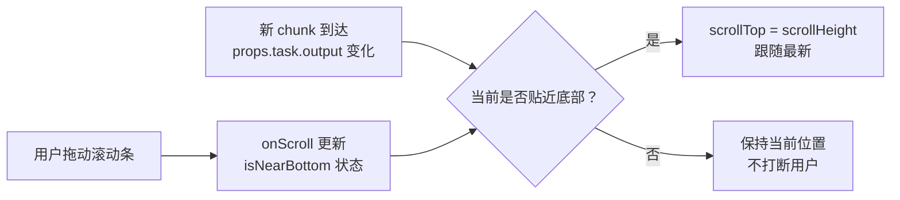

# 260707.fix.agent-output-smart-scroll

## 1. 背景

右下角 Agent 任务执行记录窗口（`AgentPanelDock`）每张任务卡片展开后会流式渲染 Agent 的输出文本。当输出较长、`<pre>` 出现垂直滚动条时，组件当前每次收到新 chunk 都会无条件把 `scrollTop` 拉到最底部。这会与用户主动拖拽滚动条浏览历史内容产生冲突——用户刚往上滚一点，下一个 chunk 到达就把视图强行拽回底部，无法稳定阅读。

## 2. 需求

- 当用户已贴近输出区底部时，新内容到达仍自动滚到最底部（保持"跟随最新输出"的体验）。
- 当用户主动向上滚动浏览历史时，**不再**自动跳转，直到用户重新把滚动条拖回底部附近。
- 行为只作用于单张任务卡片的输出 `<pre>`，不影响列表本身、Dock 折叠等其他交互。

## 3. 现状分析

<details>
<summary>精确层：相关源码定位</summary>

- 文件：`src/gui/src/components/AgentPanelDock.tsx`
- 关键位置：
  - `AgentTaskCard` 组件，`preEl` 引用：`AgentPanelDock.tsx:146-149`
  - 无条件自动滚动逻辑：`AgentPanelDock.tsx:151-157`
    ```tsx
    createMemo(() => {
      void props.task.output
      queueMicrotask(() => {
        if (preEl) preEl.scrollTop = preEl.scrollHeight
      })
    })
    ```
  - 输出渲染目标：`AgentPanelDock.tsx:210-213`（`<pre ref={setPreRef} class="agent-task-output">`）
- 该组件基于 SolidJS，`props.task.output` 为响应式字符串；每次变化触发上方 `createMemo` 重跑，进而 `queueMicrotask` 内执行硬滚动。
- 当前实现没有任何"用户是否在底部"的状态判断，也没有 `onScroll` 监听。

</details>



核心问题：缺少"用户当前是否贴底"这一状态，自动滚动是无条件的。修复关键就是引入一个跟随 `onScroll` 更新的贴底判定信号，并把它作为自动滚动的前置条件。

## 4. 技术实现方案

### 4.1 方案：贴底判定 + 条件自动滚动（推荐）

在 `AgentTaskCard` 内引入一个 `stickToBottom` 信号（默认 `true`，因为新卡片首次展开时用户尚未交互，应贴底显示最新输出）：

1. **贴底阈值**：定义常量 `SCROLL_STICK_THRESHOLD`（建议 `32`px，约一两行高度，对鼠标滚轮微抖动有一定容差；过小会因 1px 偏差漏判，过大会把"想停在底部上方一两行"也误判为贴底）。
2. **onScroll 监听**：给 `<pre>` 加 `onScroll`，计算 `scrollHeight - scrollTop - clientHeight`，差值 `< SCROLL_STICK_THRESHOLD` 时置 `stickToBottom = true`，否则 `false`。
3. **条件自动滚动**：将现有 `createMemo` 内的硬滚动改为 `if (preEl && stickToBottom()) preEl.scrollTop = preEl.scrollHeight`。
4. **初始化语义**：组件挂载/卡片首次展开时 `stickToBottom` 默认 `true`，确保用户刚展开就能看到最新输出，不被旧的"非贴底"残留状态影响。

<details>
<summary>精确层：改动要点与代码骨架</summary>

新增常量（文件顶部常量区）：

```tsx
const SCROLL_STICK_THRESHOLD = 32
```

`AgentTaskCard` 内新增信号与处理：

```tsx
const [stickToBottom, setStickToBottom] = createSignal(true)

const handleScroll = () => {
  if (!preEl) return
  const distance = preEl.scrollHeight - preEl.scrollTop - preEl.clientHeight
  setStickToBottom(distance < SCROLL_STICK_THRESHOLD)
}
```

原自动滚动 memo 改为：

```tsx
createMemo(() => {
  void props.task.output
  queueMicrotask(() => {
    if (preEl && stickToBottom()) preEl.scrollTop = preEl.scrollHeight
  })
})
```

`<pre>` 绑定：

```tsx
<pre ref={setPreRef} class="agent-task-output" onScroll={handleScroll}>
```

为何用 `onScroll` 而非 wheel/pointer 事件：滚动条拖拽、键盘、触控、程序化滚动都会统一走 `onScroll`，最稳定；且程序化滚动到最底时自身也会触发 `onScroll` 并把 `stickToBottom` 重新置 `true`，状态自洽，不会出现"滚到底后信号卡在 false"。

</details>

### 4.2 边界与回归点

- 程序化滚到底后会触发 `onScroll`，需确认此时 `distance` 计算仍 `< threshold`（因浮点/子像素可能有 1px 误差，`32`px 阈值已覆盖）。
- 卡片折叠再展开：当前 `<pre>` 在 `Show` 下会重建，`stickToBottom` 信号在组件作用域内保留，重建 DOM 时新 `<pre>` 仍按信号决定是否贴底——展开瞬间信号若为 `true` 则贴底，符合"重新展开看最新"的直觉。
- 多卡片互不影响：信号在 `AgentTaskCard` 作用域内，每张卡片独立，符合需求"只作用于单张卡片"。

## 5. 待确认问题

_暂无_

## 6. 任务清单

- [x] 在 `AgentPanelDock.tsx` 顶部新增 `SCROLL_STICK_THRESHOLD` 常量，并在 `AgentTaskCard` 内加入 `stickToBottom` 信号与 `handleScroll` 处理函数（验收：tsc/build 无类型错误）
- [x] 给输出 `<pre>` 绑定 `onScroll={handleScroll}`（验收：手动拖拽滚动条时 `stickToBottom` 正确翻转）
- [x] 将自动滚动 `createMemo` 改为仅当 `stickToBottom()` 为真时才执行 `scrollTop = scrollHeight`（验收：用户上滚浏览时新 chunk 不再强制跳回底部；贴底时仍自动跟随）
- [x] 运行 `pnpm run build:gui` 验证无回归（验收：构建成功）

## 7. 执行记录

- 新增常量 `SCROLL_STICK_THRESHOLD = 32`（`AgentPanelDock.tsx:21`）；在 `AgentTaskCard` 内新增 `stickToBottom` 信号（默认 `true`）与 `handleScroll`，按 `scrollHeight - scrollTop - clientHeight < 32` 判定贴底。
- `<pre class="agent-task-output">` 绑定 `onScroll={handleScroll}`；原自动滚动 memo 加 `stickToBottom()` 前置条件，仅贴底时才 `scrollTop = scrollHeight`。
- 验证：`pnpm run build:gui` 构建成功（`✓ built in 4.82s`），无类型/编译错误。
- 收尾：全部任务完成，待确认问题为 `_暂无_`、无批注，标记 `done`。

