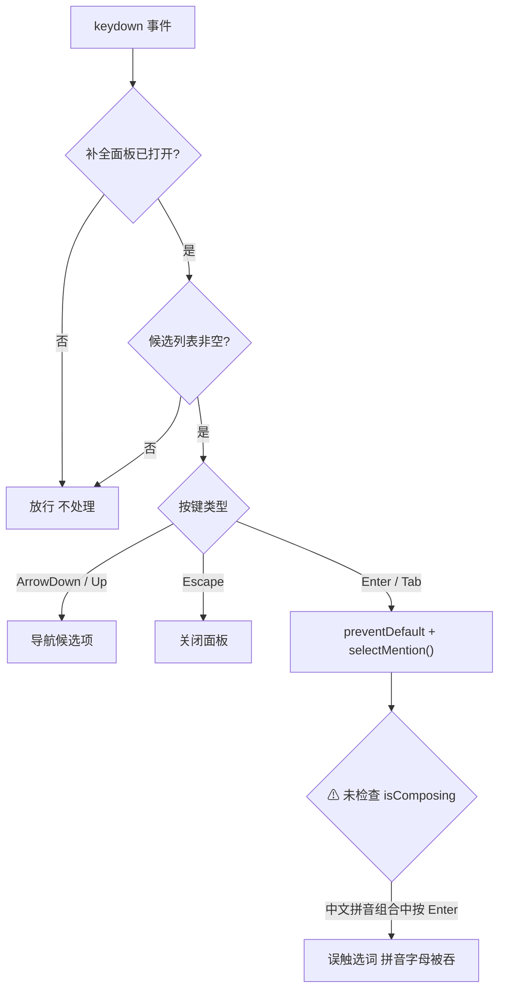
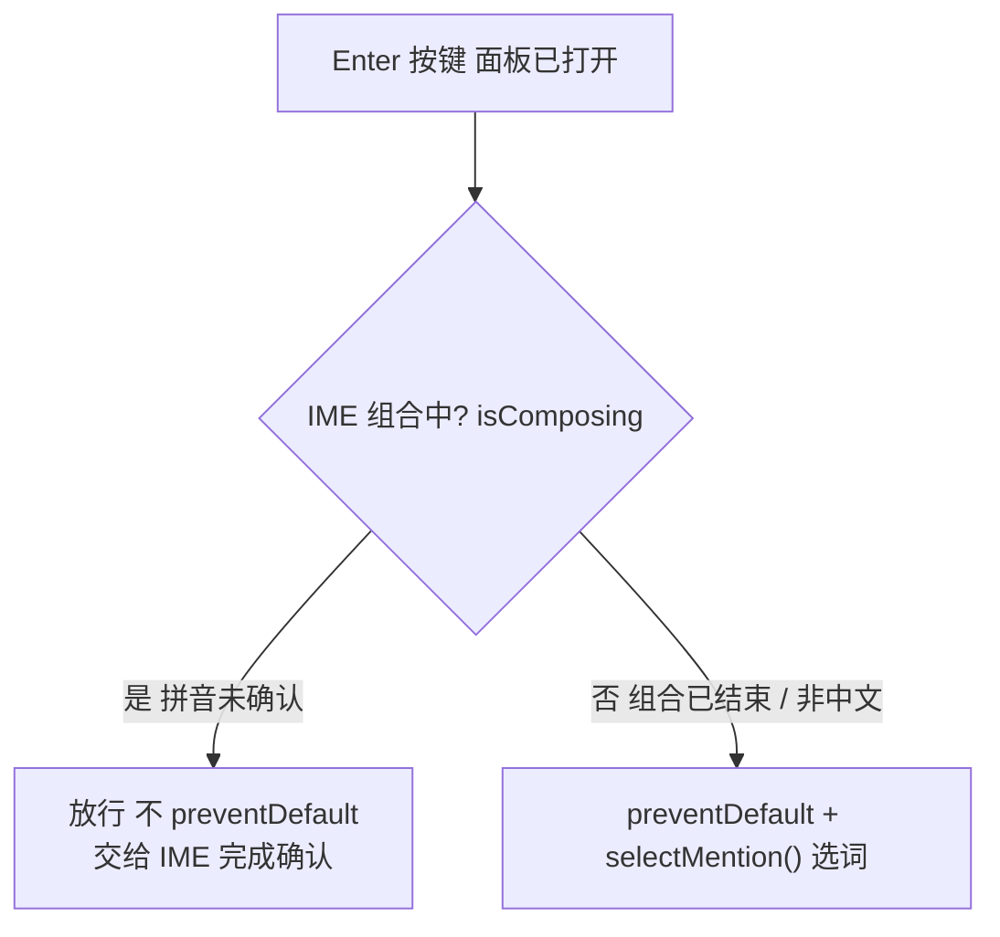
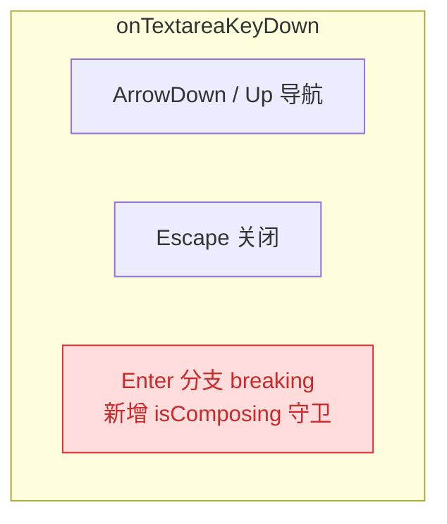

# 260707.fix.at-mention-ime-enter-conflict

## 1. 背景

`src/gui/src/pages/NewSpec.tsx` 的需求输入框支持 `@` 触发文件补全面板，用户可用方向键导航、Enter / Tab 确认选词。当前实现未区分 IME 组合态，导致使用中文输入法时：

- 用户正在拼写拼音，按下 Enter 本意是"确认输入法候选（将正在输入的英文字母带入输入框）"，却被补全面板拦截，提前选中并插入了候选项。

## 2. 需求

- 在中文输入法（IME）组合过程中，Enter 键应将正在输入的英文字母 / 拼音原样带入输入框（即交给浏览器默认的 IME 确认逻辑），**不触发**补全面板的选词。
- 仅当 IME **未处于组合状态**（非中文输入、或中文输入已结束）时，按下 Enter 才执行补全面板的选词（`selectMention`）。
- Tab、方向键、Escape 等其余快捷键行为不受影响。

## 3. 现状分析

### 3.1 问题代码位置

当前按键处理流程：补全面板打开时，Enter 分支直接进入选词，**缺少 IME 组合态守卫**。



<details>
<summary>精确层：onTextareaKeyDown 完整源码（src/gui/src/pages/NewSpec.tsx:289）</summary>

```ts
function onTextareaKeyDown(e: KeyboardEvent) {
  if (!mentionOpen()) return
  const items = mentionItems()
  if (items.length === 0) return
  if (e.key === 'ArrowDown') {
    e.preventDefault()
    setMentionIndex((i) => (i + 1) % items.length)
    requestAnimationFrame(scrollActiveIntoView)
  } else if (e.key === 'ArrowUp') {
    e.preventDefault()
    setMentionIndex((i) => (i - 1 + items.length) % items.length)
    requestAnimationFrame(scrollActiveIntoView)
  } else if (e.key === 'Enter' || e.key === 'Tab') {
    e.preventDefault()
    selectMention(items[mentionIndex()])
  } else if (e.key === 'Escape') {
    e.preventDefault()
    closeMention()
  }
}
```

Enter 分支无条件 `e.preventDefault()` + `selectMention()`，未检查 IME 组合态。

</details>

### 3.2 根因

- 缺少对 `KeyboardEvent.isComposing` 的检查。该属性在用户正处于 IME 组合（如拼音未确认）时为 `true`。
- 未监听 `compositionstart` / `compositionend`，无法在仅支持旧浏览器的场景做兜底（但现代浏览器 `isComposing` 已足够）。

### 3.3 影响范围

- 仅影响 NewSpec 页面的 `@` 补全交互，不涉及其他页面 / 后端逻辑。

## 4. 技术实现方案

### 4.1 方案：isComposing 守卫（推荐）

修复后 Enter 按键流程新增 IME 组合态判定分支：



**改动点：**

<details>
<summary>精确层：onTextareaKeyDown Enter 分支改动（src/gui/src/pages/NewSpec.tsx:301）</summary>

1. `src/gui/src/pages/NewSpec.tsx:301` — Enter 分支增加 `isComposing` 守卫：

```ts
} else if (e.key === 'Enter' || e.key === 'Tab') {
  if (e.key === 'Enter' && e.isComposing) return
  e.preventDefault()
  selectMention(items[mentionIndex()])
}
```

- Enter + 组合态 → 直接 `return`（不 preventDefault），事件冒泡给 IME 完成确认。
- Tab 不受影响（IME 组合中 Tab 一般已由浏览器处理）。

2. 可选增强：在 `onInput` / `checkMention` 中，若 `e.nativeEvent` 的 `isComposing`（或 `InputEvent.isComposing`）为 `true`，可跳过 `@` 检测避免组合中途误开面板。但当前 `checkMention` 已通过正则 `[\w./@-]` 过滤非英文路径，组合中途一般不会命中，故此项为"可选"非"必须"。

</details>

### 4.2 影响范围

变更仅限单文件单函数内部，无跨模块波及：



- 红色 = breaking：Enter 分支逻辑变更（新增 1 行守卫）。
- ArrowUp/Down、Escape、Tab 路径不变；后端 / 其他页面无影响。

### 4.3 验收标准

- 中文输入法下，输入拼音过程中按 Enter，拼音对应字母进入输入框，补全面板不触发选词。
- 中文输入法已确认（组合结束）后按 Enter，仍正常选词插入。
- 英文输入下 Enter 选词行为不变。
- Tab / 方向键 / Escape 行为不变。

## 5. 待确认问题

_暂无_

## 6. 任务清单

- [x] 在 `onTextareaKeyDown` 的 Enter/Tab 分支增加 `isComposing` 守卫：Enter 且组合态时直接 return（验收：源码含 `e.isComposing` 判断，组合中按 Enter 不触发 selectMention）
- [x] 运行类型检查 / 构建验证（验收：tsc --noEmit 或现有构建命令通过）

## 7. 执行记录

- [任务1] `src/gui/src/pages/NewSpec.tsx:302` Enter/Tab 分支新增 `if (e.key === 'Enter' && e.isComposing) return` 守卫；IME 组合中 Enter 不再 preventDefault，事件冒泡给输入法完成确认。验证：构建通过。
- [任务2] 运行 `pnpm run build:gui`，构建成功（✓ built in 4.48s），仅有无关的 chunk 体积警告，类型检查通过。
- [收尾] 任务清单全部完成，无待确认问题，标记 done。
