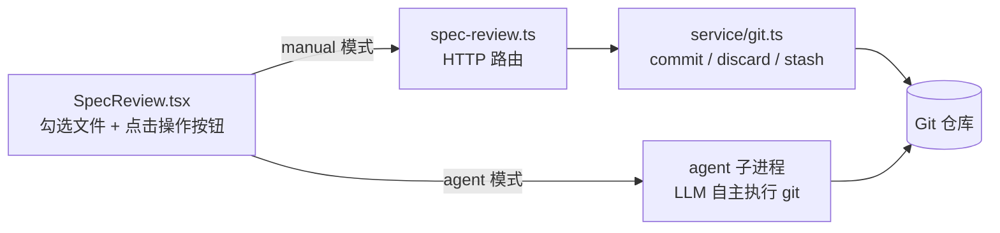
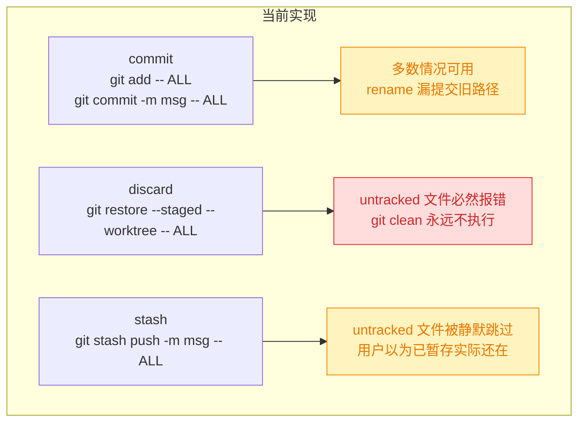
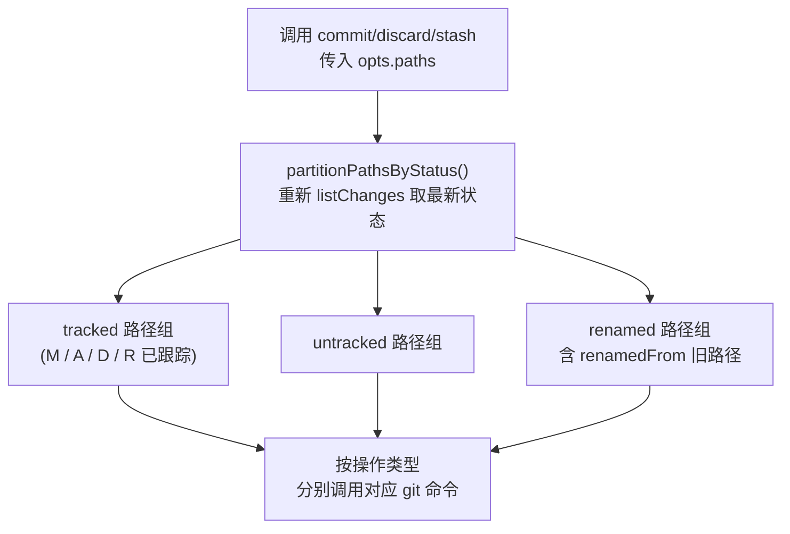
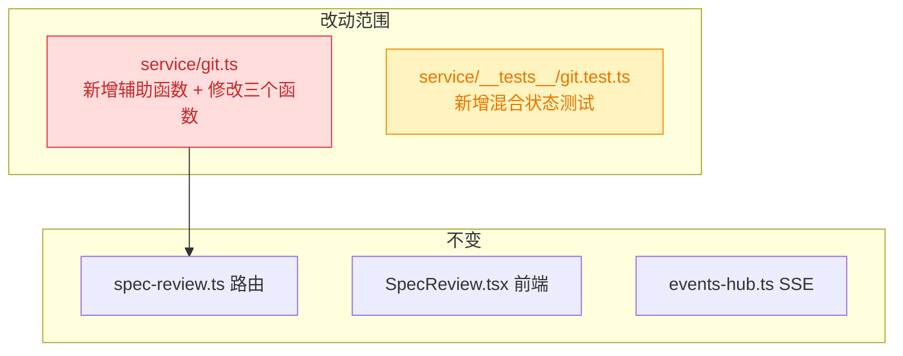

# 260707.fix.review-file-action-status-fix

## 1. 背景

Review 界面（`SpecReview.tsx`）提供手动勾选变更文件后执行 commit / stash / discard 操作的能力。变更文件可能处于 untracked（`??`）、unstaged（` M`）、staged（`M ` /`A ` /`D `）等多种状态。当前后端 `service/git.ts` 的三个操作函数未按文件状态分组处理，将所有勾选路径无差别地传给单一 git 命令，导致混合状态下报错或行为不符合预期。

## 2. 需求

1. **提交（commit）**：先将勾选的所有变更文件全部转移到 staged 状态，然后提交 git。
2. **暂存（stash）/ 丢弃（discard）**：勾选任意状态的变更文件，都需要避免报错。

## 3. 现状分析

### 3.1 架构概览

Review 界面的 git 操作有两条路径（由 `fileSelectMode` 单选切换），本 bug 仅涉及 **manual 路径**：



<details>
<summary>精确层：相关文件路径与行号</summary>

- 前端组件：`src/gui/src/pages/SpecReview.tsx:157-231`（路径选择 + 触发逻辑）
- HTTP 路由：`src/service/routes/spec-review.ts:98-171`（commit / discard / stash 三路由）
- 核心 git 工具：`src/service/git.ts:177-207`（三个操作函数）
- SSE 变更推送：`src/service/events-hub.ts:61-113`（1 秒轮询 `listChanges`）
- 测试：`src/service/__tests__/git.test.ts`

</details>

### 3.2 Bug 根因

**三个操作函数都将全部勾选路径无差别传给单一命令，未考虑文件状态差异：**



<details>
<summary>精确层：逐函数代码定位与失败场景</summary>

**discard — 最严重（`git.ts:196-197`）：**

```typescript
await runGit(cwd, ['restore', '--staged', '--worktree', '--', ...opts.paths])
await runGit(cwd, ['clean', '-fd', '--', ...opts.paths])
```

- `git restore` 对 untracked 文件报 `fatal: pathspec did not match any files known to git`
- `runGit` 遇非零退出即抛 `GitError`，第 197 行 `git clean` 永远不执行
- 触发条件：勾选集合中同时包含 `??` 和任意 tracked 状态文件

**stash（`git.ts:206`）：**

```typescript
await runGit(cwd, ['stash', 'push', '-m', message, '--', ...opts.paths])
```

- `git stash push -- <paths>` 默认不包含 untracked 文件
- untracked 文件被静默跳过，用户以为已暂存但实际还在工作区

**commit（`git.ts:185-186`）：**

```typescript
await runGit(cwd, ['add', '--', ...opts.paths])
await runGit(cwd, ['commit', '-m', message, '--', ...opts.paths])
```

- `git add` 正确处理所有状态（含 untracked），暂存无误
- rename 文件：前端仅传新路径 `newpath`，`git add -- newpath` 只暂存新文件，旧路径删除未暂存；`git commit -- newpath` 不含旧路径删除，提交后两文件并存

</details>

## 4. 技术实现方案

### 4.1 核心思路：按文件状态分组处理

在 `service/git.ts` 新增共享辅助函数，重新获取最新文件状态后将路径分为 tracked / untracked / renamed 三组，各操作函数按组分别调用正确的 git 子命令。



### 4.2 各操作修复方案

**commit：**

1. 调用 `partitionPathsByStatus` 获取分组
2. 展开路径列表：对 rename 文件追加 `renamedFrom` 旧路径
3. `git add -- <expanded paths>` 暂存全部选中文件（含旧路径删除）
4. `git commit -m <message> -- <expanded paths>` 仅提交选中文件

**discard：**

1. 调用 `partitionPathsByStatus` 获取分组
2. tracked 组：`git restore --staged --worktree -- <tracked paths>`
3. untracked 组：`git clean -fd -- <untracked paths>`
4. rename 组：restore 旧路径 + clean 新路径
5. 各组独立执行，一组为空则跳过

**stash：**

1. 调用 `partitionPathsByStatus` 获取分组
2. 展开路径列表（含 rename 旧路径）
3. `git stash push --include-untracked -m <message> -- <expanded paths>`

### 4.3 影响面



<details>
<summary>精确层：partitionPathsByStatus 函数签名设计</summary>

```typescript
interface PartitionedPaths {
  tracked: string[] // M / A / D / R 等已跟踪文件的变更
  untracked: string[] // ?? 状态的新文件
  renamed: Array<{ path: string; renamedFrom: string }>
}

async function partitionPathsByStatus(cwd: string, paths: string[]): Promise<PartitionedPaths>
```

- 调用 `listChanges(cwd)` 获取最新状态
- 按 `path` 字段匹配输入路径
- `status === '??'` 归入 untracked；带 `renamedFrom` 归入 renamed；其余归入 tracked
- 输入路径中找不到匹配项的（已被外部提交/清除），安全跳过

</details>

## 5. 待确认问题

_暂无_

## 6. 任务清单

- [x] 在 `service/git.ts` 新增 `partitionPathsByStatus` 辅助函数，按 untracked / tracked / renamed 分组（验收：函数返回正确分组结构）
- [x] 修复 `discard` 函数，tracked 用 `git restore`、untracked 用 `git clean`、rename 同时处理新旧路径（验收：混合 untracked + tracked 不报错）
- [x] 修复 `stash` 函数，添加 `--include-untracked` 并展开 rename 路径（验收：untracked 文件被正确暂存）
- [x] 修复 `commit` 函数，展开 rename 路径后再 `git add` + `git commit`（验收：rename 文件旧路径删除被一并提交）
- [x] 在 `service/__tests__/git.test.ts` 新增混合状态测试用例覆盖 discard / stash / commit（验收：vitest 通过）
- [x] 运行 lint + typecheck（验收：无 error）

## 7. 执行记录

- **partitionPathsByStatus 辅助函数**：在 `service/git.ts` 新增，调用 `listChanges` 获取最新状态后按 untracked / tracked / renamed 三组分类，rename 同时提取 `renamedFrom` 旧路径。
- **discard 修复**：tracked 用 `git restore --staged --worktree`，untracked 用 `git clean -fd`，renamed 用 `reset` + `restore` + `clean` 三步处理新旧路径；各组独立执行互不阻断。
- **stash 修复**：添加 `--include-untracked` 标志，untracked 文件不再被静默跳过；rename 路径展开后一并暂存。
- **commit 修复**：commit 前展开 rename 路径（追加 `renamedFrom`），确保旧路径删除与新路径添加一并被 `git add` 暂存后再提交。
- **测试结果**：`vitest run` 11/11 通过（含 4 个新增混合状态测试）；`tsc --noEmit` 无错误。
- **收尾**：所有非 manual 任务完成，待确认问题为 _暂无_，无批注/追加任务，标记 done。
