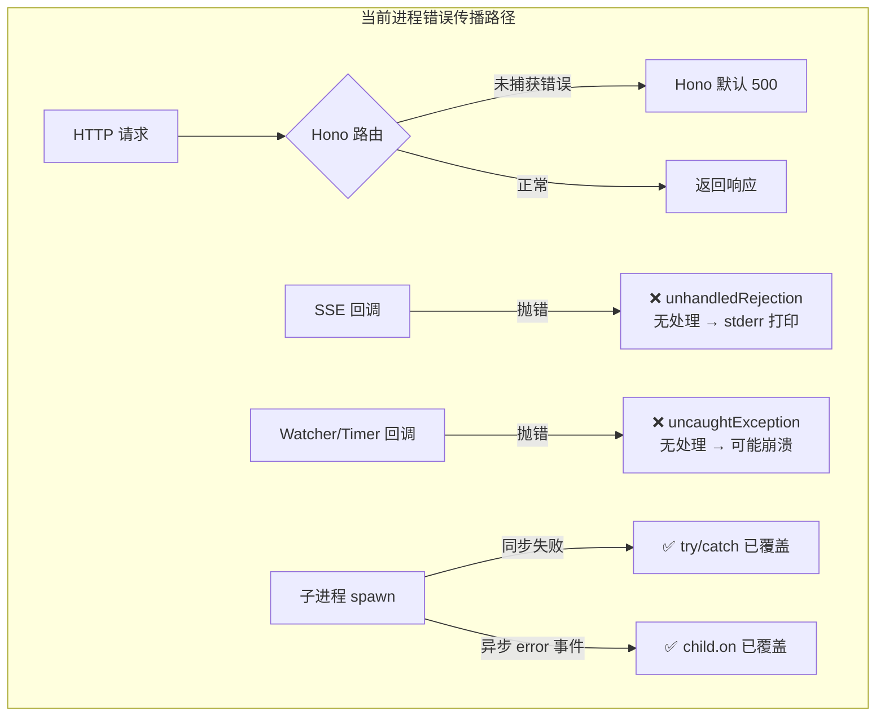
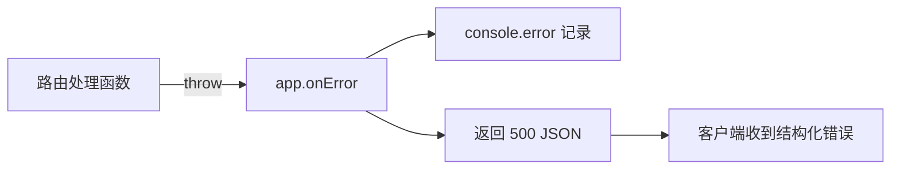
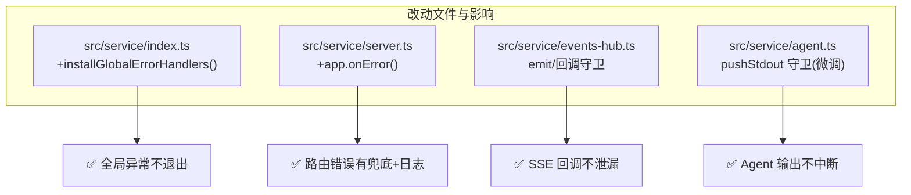

# 260708.feat.serve-crash-resilience

## 1. 背景

`yorz serve` 作为长驻 HTTP/SSE 服务，需要稳定运行。当前服务内部存在多处可能导致进程意外退出的路径：

- **缺少全局异常兜底**：未注册 `process.on('uncaughtException')` / `process.on('unhandledRejection')`，任何未捕获的异步拒绝或同步异常都可能导致 Node 默认行为（打印 stderr，极端情况崩溃退出）。
- **SSE 回调无防护**：`EventsHub` 中 `watcher.subscribe`、`handle.onStdout` 等回调在 `streamSSE` 上下文内执行，抛错不在 Hono 正常错误路径内，更容易导致 unhandled rejection。
- **Hono 无 onError**：未注册 `app.onError()`，未捕获的路由错误落入 Hono 默认 500 处理，无日志记录。
- **子进程错误路径**：`AgentRunner.spawn()` 已有同步 try/catch 和 `child.on('error')` 处理，覆盖较完善，但周边逻辑（日志写入、事件转发）仍有空 `catch {}` 盲区。

## 2. 需求

> yorz serve 服务需要避免崩溃，比如代理执行 Agent 任务，即使子进程抛错或者 fork 进程失败，都不能崩溃。

核心目标：**服务进程在任何子进程/回调/请求处理的错误下都不退出**，保证已建立连接的客户端（GUI）不因单次错误而失联。

## 3. 现状分析

### 3.1 进程生命周期与全局错误处理

当前 `yorz serve --foreground` 的进程入口为 `cli/serve.ts:runServe()`（`src/cli/serve.ts:44-81`），启动后仅注册了 `SIGINT` / `SIGTERM` 的优雅关闭处理器（`serve.ts:77-78`），**没有任何** `uncaughtException` / `unhandledRejection` 处理。



### 3.2 子进程（Agent）错误处理

`AgentRunner.spawn()`（`src/service/agent.ts:154-287`）已有较完善的子进程错误处理：

<details>
<summary>已覆盖的错误路径（精确代码）</summary>

| 场景             | 位置               | 处理方式                                 |
| ---------------- | ------------------ | ---------------------------------------- |
| spawn 同步抛错   | `agent.ts:222-247` | try/catch → 合成 handle，emit error+exit |
| 子进程异步 error | `agent.ts:262-270` | `child.on('error')` → emit error+exit    |
| 子进程退出       | `agent.ts:271-277` | `child.on('exit')` → emit exit           |
| 进程树清理       | `agent.ts:399-436` | killTree: SIGTERM → 2s → SIGKILL         |
| 日志写入         | `agent.ts:183-212` | writerReady / finalizeLog 内 try/catch   |

</details>

结论：**子进程层面的错误已有兜底**，核心风险在于**进程级全局异常**和**SSE/事件回调中的异常**。

### 3.3 HTTP/SSE 错误处理

`createApp()`（`src/service/server.ts:21-61`）创建 Hono 应用但**未注册 `app.onError()`**。路由处理函数中普遍使用 try/catch 包裹 `c.req.json()` 解析错误，但 re-throw 的错误（如 `spec-review.ts:94,120,144,169`）会传播到 Hono 默认处理。

`EventsHub`（`src/service/events-hub.ts`）中的 SSE 回调（`attachSpec` / `attachRun`，`events-hub.ts:279-339`）在 `streamSSE` 上下文内注册了 `watcher.subscribe`、`handle.onStdout/onError/onExit` 回调，这些回调中的异常**不在 Hono 的 try/catch 范围内**，是 unhandled rejection 的主要来源。

## 4. 技术实现方案

### 4.1 全局异常兜底（console + 持久化日志文件）

在 `service/index.ts:start()` 中，`listen()` 成功后立即注册全局异常处理器。处理器同时输出到 **console.error** 和**持久化日志文件**（`<resolveGlobalConfigDir()>/logs/serve-errors.log`），确保事后可排查。

<details>
<summary>实现方案（精确代码）</summary>

```typescript
// src/service/index.ts
import { appendFile, mkdir } from 'node:fs/promises'
import { join } from 'node:path'
import { resolveGlobalConfigDir } from './global-config.js'

let errorLogReady = false
async function ensureErrorLogDir(): Promise<string> {
  const dir = join(resolveGlobalConfigDir(), 'logs')
  if (!errorLogReady) {
    await mkdir(dir, { recursive: true })
    errorLogReady = true
  }
  return join(dir, 'serve-errors.log')
}

function logCrash(kind: string, payload: unknown): void {
  const ts = new Date().toISOString()
  const line = `[${ts}] [${kind}] ${payload instanceof Error ? (payload.stack ?? payload.message) : String(payload)}\n`
  console.error(`[yorz] ${kind}:`, payload)
  void ensureErrorLogDir()
    .then((fp) => appendFile(fp, line, 'utf8'))
    .catch(() => {})
}

export function installGlobalErrorHandlers(): void {
  process.on('uncaughtException', (err) => {
    logCrash('uncaughtException', err)
    // 不退出进程
  })
  process.on('unhandledRejection', (reason) => {
    logCrash('unhandledRejection', reason)
    // 不退出进程
  })
}
```

在 `start()` 的 `listen()` 返回后调用 `installGlobalErrorHandlers()`。

</details>

**关键原则**：记录但不退出。Node 对 `uncaughtException` 的默认行为是崩溃退出（除非有监听器），注册监听器后进程继续运行。对于 `unhandledRejection`，Node 15+ 默认也是退出，注册监听器后同样阻止退出。日志文件写入为 best-effort（`void …catch`），失败不影响进程稳定性。

### 4.2 Hono onError 兜底

在 `createApp()`（`src/service/server.ts:21`）中注册 `app.onError()`：



```typescript
// src/service/server.ts - createApp() 内
app.onError((err, c) => {
  console.error('[yorz] route error:', err)
  return c.json({ error: 'Internal Server Error', message: err.message }, 500)
})
```

注册在 `app.route('/api', api)` 之前（根 app 上），确保覆盖所有路由。

### 4.3 SSE/事件回调守卫

在 `EventsHub.emit()` 方法（`src/service/events-hub.ts:220-230`）外层包装 try/catch，确保任何回调中的异常不会传播到 `streamSSE` 的写入逻辑：

<details>
<summary>守卫包装器（精确代码）</summary>

```typescript
// src/service/events-hub.ts
private emit(s: Session, topic: string, event: string, data: unknown): void {
  try {
    // 原有 emit 逻辑
  } catch (err) {
    console.error('[yorz] SSE emit error:', err)
  }
}
```

同时，对 `attachSpec` / `attachRun` 中注册的回调（`watcher.subscribe`、`handle.onStdout` 等）用包装器包裹，使回调函数内部的异常不会抛到事件循环顶层。

</details>

### 4.4 Agent 回调守卫（加固）

`AgentRunner.spawn()` 中已覆盖的子进程错误路径保持不变。额外加固 `pushStdout` / `finalizeLog` 等闭包回调，确保其内部异常不向外传播：

- `pushStdout`（`agent.ts:213-218`）：已有空字符串保护，额外 try/catch 包裹。
- `finalizeLog`（`agent.ts:183-212`）：已有 try/catch，保持不变。

### 4.5 影响范围



改动范围限定在 4 个文件，均为**新增守卫逻辑**，不改变现有正常流程的行为。

## 5. 待确认问题

_暂无_

## 6. 任务清单

- [x] 在 src/service/index.ts 新增 installGlobalErrorHandlers()，注册 uncaughtException/unhandledRejection 处理器，console.error + 追加写入 resolveGlobalConfigDir()/logs/serve-errors.log（验收：tsc --noEmit 通过）
- [x] 在 src/service/index.ts start() 中 listen() 返回后调用 installGlobalErrorHandlers()（验收：全局异常不退出进程）
- [x] 在 src/service/server.ts createApp() 中 app.route('/api', api) 之前注册 app.onError()，console.error 记录并返回 500 JSON（验收：tsc --noEmit 通过）
- [x] 在 src/service/events-hub.ts emit() 方法外层包裹 try/catch，防止回调异常传播到 streamSSE 上下文（验收：tsc --noEmit 通过）
- [x] 在 src/service/agent.ts pushStdout() 外层包裹 try/catch，确保 stdout 回调异常不传播（验收：tsc --noEmit 通过）
- [x] 运行 pnpm test 确认全部测试通过（验收：test 输出 0 failures）

## 7. 执行记录

1. **installGlobalErrorHandlers()** — `src/service/index.ts`：新增 `logCrash()` 辅助函数（console.error + 追加写入 `<resolveGlobalConfigDir()>/logs/serve-errors.log`）和 `installGlobalErrorHandlers()`（注册 `uncaughtException`/`unhandledRejection` 监听器，含去重守卫防止测试中重复安装）。在 `start()` 的 `listen()` 返回后调用。验收：tsc --noEmit 通过。
2. **app.onError()** — `src/service/server.ts`：在 `app.route('/api', api)` 之后、`return app` 之前注册 `app.onError()`，console.error 记录并返回 500 JSON。验收：tsc --noEmit 通过。
3. **SSE emit 守卫** — `src/service/events-hub.ts`：`emit()` 方法体外层包裹 try/catch，异常仅 console.error 不传播。验收：tsc --noEmit 通过。
4. **pushStdout 守卫** — `src/service/agent.ts`：`pushStdout` 闭包体包裹 try/catch，异常仅 console.error 不传播。验收：tsc --noEmit 通过。
5. **全量测试** — `pnpm test`：35 test files / 287 tests 全部通过，0 failures。验收通过。
6. **收尾** — 全部 6 项任务完成，无待确认问题、无批注，标记 done。
