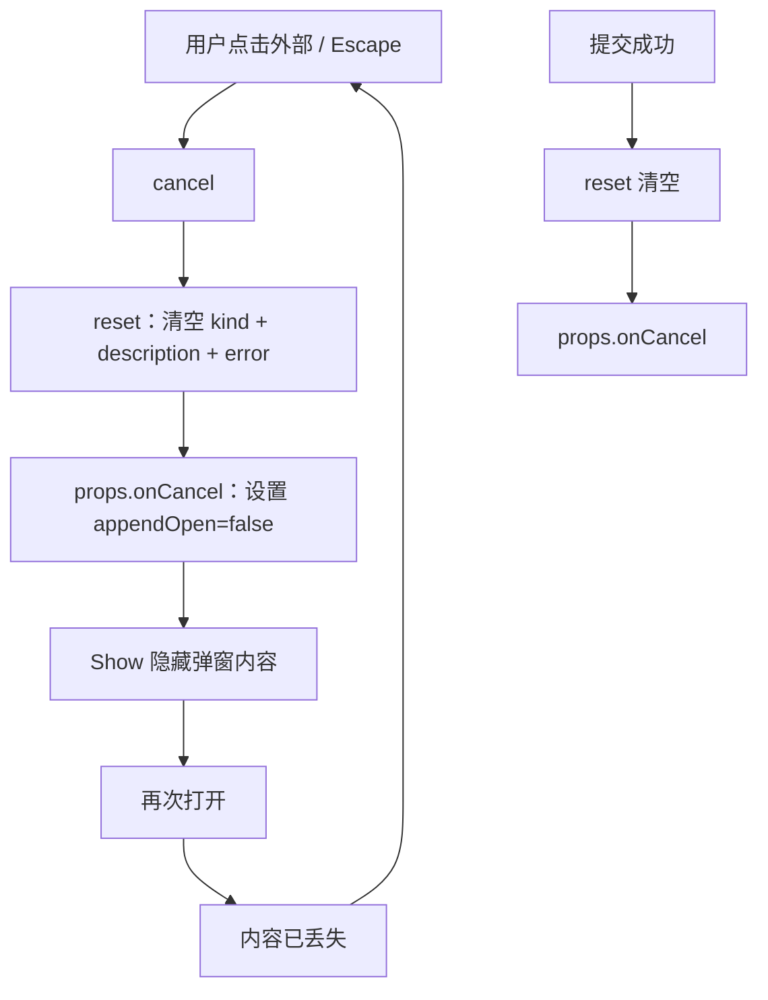
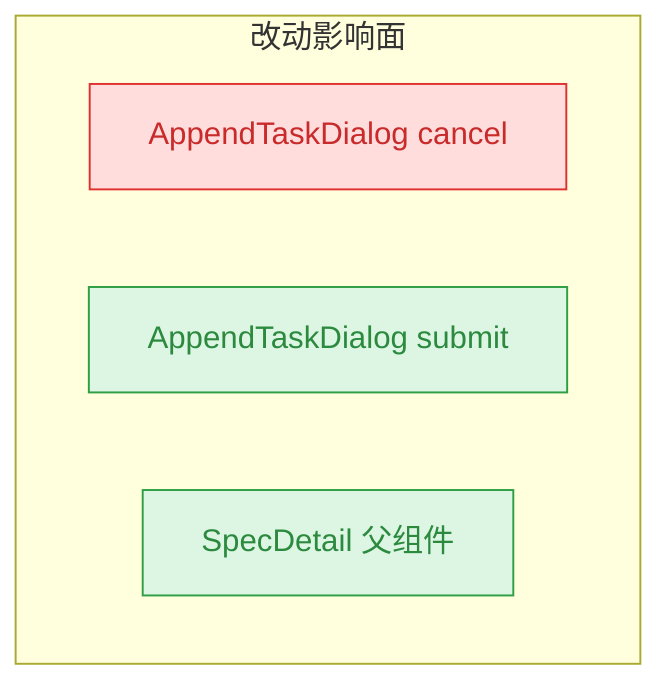

# Append Dialog Preserve Content

## 1. 背景与需求

SpecDetail 页面的「追加任务」弹窗（AppendTaskDialog），用户点击弹窗外部区域或按 Escape 时弹窗自动隐藏。当前实现会在隐藏时清空已输入的类型和描述内容，导致用户再次打开后内容丢失。

**期望行为：**

- 点击外部区域 / 按 Escape → 弹窗隐藏，**内容保留**
- 再次打开 → 恢复上次输入的类型与描述
- 提交成功后 → **清空内容**

## 2. 现状分析

AppendTaskDialog 组件（`src/gui/src/components/AppendTaskDialog.tsx`）在父组件 SpecDetail（`src/gui/src/pages/SpecDetail.tsx:297`）中**始终挂载**，通过 `<Show when={props.open}>` 内部切换可见性。组件内部的 SolidJS signals（`kind`、`description`、`error`）在组件生命周期内持久存在，不会因 `<Show>` 隐藏而销毁。

**根因定位：** `cancel()` 函数（第 80-83 行）无条件调用 `reset()`，而 `reset()` 将 `kind` 重置为 `'fix'`、`description` 重置为空字符串。背板 `onMouseDown` 和 Escape 键处理均调用 `cancel()`，因此任何关闭操作都会清空内容。

提交成功路径（`submit()` 第 55-78 行）在 `props.onSubmit()` 成功后已单独调用 `reset()`，逻辑正确——只需从 `cancel()` 中移除 `reset()` 即可。

精确层：AppendTaskDialog 关键源码

- `src/gui/src/components/AppendTaskDialog.tsx:49-53` — `reset()` 函数清空 kind/description/error
- `src/gui/src/components/AppendTaskDialog.tsx:80-83` — `cancel()` 调用 `reset()` + `props.onCancel()`
- `src/gui/src/components/AppendTaskDialog.tsx:71` — `submit()` 成功后调用 `reset()`（此处保留）
- `src/gui/src/components/AppendTaskDialog.tsx:87` — 背板 `onMouseDown={cancel}`
- `src/gui/src/components/AppendTaskDialog.tsx:42` — Escape 键调用 `cancel()`
- `src/gui/src/pages/SpecDetail.tsx:42` — `appendOpen` signal
- `src/gui/src/pages/SpecDetail.tsx:297-304` — AppendTaskDialog 始终渲染在 JSX 树中

## 3. 技术实现方案

**改动范围：** 仅 `AppendTaskDialog.tsx` 一个文件，删除 `cancel()` 中的 `reset()` 调用。

### 3.1 方案详情

将 `cancel()` 从「清空 + 关闭」改为「仅关闭」：

- `cancel()` 移除 `reset()` 调用，只保留 `props.onCancel()`
- `submit()` 成功路径的 `reset()` 保持不变——提交后仍清空内容
- 无需引入新 state、无需修改父组件

### 3.2 兼容性 / 影响范围

唯一变更点为 `cancel()` 函数体，影响背板点击和 Escape 键两条关闭路径。提交成功路径不受影响。

## 4. 待确认问题

_暂无_

## 5. 任务清单

- [x] 从 `cancel()` 中移除 `reset()` 调用，仅保留 `props.onCancel()`（验收：cancel 不再清空 kind/description）
- [x] 运行 typecheck 确认无编译错误（验收：tsc --noEmit 通过）

## 6. 执行记录

- 任务 1：删除 `src/gui/src/components/AppendTaskDialog.tsx:81` 中 `cancel()` 的 `reset()` 调用。`cancel()` 现仅调用 `props.onCancel()` 关闭弹窗，保留 signals 状态。提交成功路径（`submit()` 中的 `reset()`）保持不变。
- 任务 2：`src/gui` 目录执行 `tsc --noEmit`，无编译错误。
- 收尾：所有非 manual 任务完成，待确认问题为空，标记 done。
