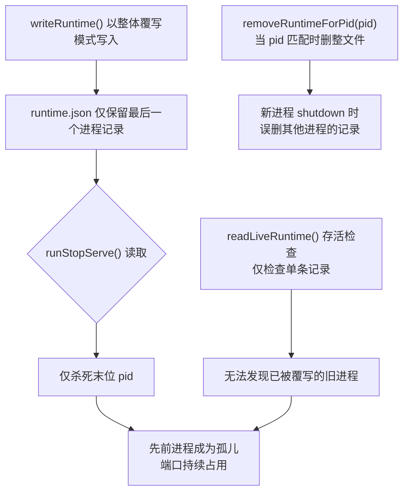
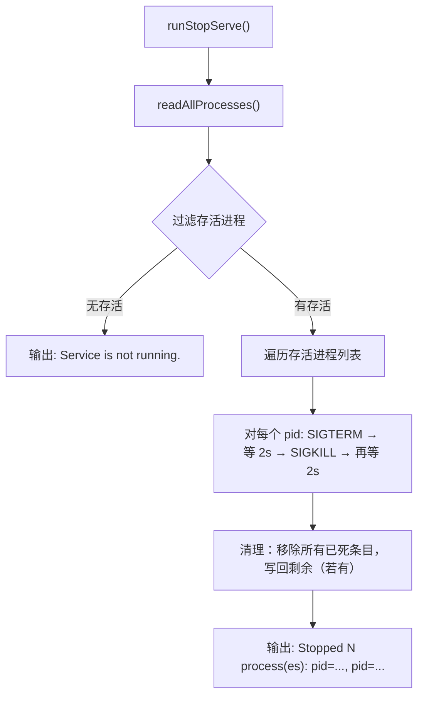

# Fix: runtime.json 多进程追踪与全量停止

## 1. 背景

`yorz serve` 和 `npm run dev` 均通过 `runServe` 前台路径启动 HTTP 服务，每次调用 `writeRuntime()` 时**整体覆写** `~/.config/yorz/runtime.json`。当前 schema 为单对象结构（`version: 1`，含一个 `pid`/`port`/`url`），无法同时记录多个运行中的进程。

典型泄漏场景：

1. 执行 `yorz serve`（后台 fork 子进程 pid=A，写入 runtime.json）。
2. 执行 `npm run dev`（前台 `serve --foreground`，pid=B，**覆写** runtime.json）。
3. 执行 `yorz serve stop`：仅读取到 pid=B 并杀死；pid=A 成为孤儿进程，端口持续占用。

## 2. 现状分析

### 2.1 涉及文件与关键位置

| 关注点                                            | 文件                              | 关键行号 |
| ------------------------------------------------- | --------------------------------- | -------- |
| `RuntimeInfo` 单对象接口                          | `src/cli/serve.ts`                | 31–37    |
| `writeRuntime()` 整体覆写                         | `src/cli/serve.ts`                | 262–266  |
| `readRuntime()` 读取单对象                        | `src/cli/serve.ts`                | 241–260  |
| `readLiveRuntime()` 存活检查+自动清理             | `src/cli/serve.ts`                | 233–239  |
| `removeRuntimeForPid()` 仅当 pid 匹配时删除整文件 | `src/cli/serve.ts`                | 268–271  |
| `removeRuntime()` 删除整文件                      | `src/cli/serve.ts`                | 273–275  |
| `runServe` 前台路径——写入 runtime                 | `src/cli/serve.ts`                | 58–64    |
| `runServe` 前台路径——shutdown 清理                | `src/cli/serve.ts`                | 67–78    |
| `startBackgroundServe` 重用检查                   | `src/cli/serve.ts`                | 83–97    |
| `runStopServe` 停止单进程                         | `src/cli/serve.ts`                | 133–182  |
| `isProcessAlive` / `waitForProcessExit`           | `src/cli/serve.ts`                | 277–293  |
| `waitForRuntime` 轮询子进程 runtime               | `src/cli/serve.ts`                | 223–231  |
| runtime 目录解析                                  | `src/service/global-config.ts`    | 31–36    |
| 测试                                              | `src/cli/__tests__/serve.test.ts` | 全文件   |

### 2.2 根因链



<details>
<summary>精确代码引用</summary>

- **`writeRuntime`（262–266）**：`writeFile(path, JSON.stringify(runtime, null, 2))`——每次调用直接覆写整个文件，无读取-合并逻辑。
- **`runServe` 前台写入（58–64）**：`await writeRuntime({ version: 1, pid: process.pid, ... })`——不检查已有记录。
- **`runStopServe`（133–182）**：`const runtime = await readRuntime()` 读取单条，`process.kill(runtime.pid, 'SIGTERM')` 杀单条。
- **`removeRuntimeForPid`（268–271）**：`if (!runtime || runtime.pid === pid) await removeRuntime()`——当 runtime 中只有一条记录且 pid 匹配时删整个文件；若 pid 不匹配则不删（但由于覆写问题，不匹配说明已被覆盖）。
- **`npm run dev`**（package.json）：`concurrently -k ... "node dist/cli/index.js serve --foreground"`——直接走前台路径，绕过 `startBackgroundServe` 的重用检查。

</details>

### 2.3 约束

- `runtime.json` 路径由 `resolveGlobalConfigDir()` 决定（默认 `~/.config/yorz/`），可被 `YORZ_HOME` / `XDG_CONFIG_HOME` 覆盖。
- 启动锁 `serve.lock`（mkdir 排他锁）仅用于序列化并发的 `startBackgroundServe` 调用，不覆盖前台直接启动路径。
- 测试文件 `src/cli/__tests__/serve.test.ts` 直接导入 `runtimePath()` 并写入单对象 JSON，需同步更新。

## 3. 技术实现方案

### 3.1 Schema 变更：单对象 → 进程数组

将 `runtime.json` 从 `version: 1`（单对象）升级为 `version: 2`（含 `processes` 数组）。

<details>
<summary>新 schema 定义</summary>

```typescript
/** 单个运行中进程的元信息（字段不变，从 RuntimeInfo 拆出） */
interface ProcessEntry {
  pid: number
  port: number
  url: string
  startedAt: string
}

/** runtime.json v2 顶层结构 */
interface RuntimeFileV2 {
  version: 2
  processes: ProcessEntry[]
}

/** 兼容读取：v1 单对象 → v2 单元素数组 */
type RuntimeFile = RuntimeFileV2
```

</details>

向后兼容策略：

- **读取时**：检测 `version` 字段。`version === 1` 时将单对象转换为 `[{ pid, port, url, startedAt }]` 后继续处理；`version === 2` 直接使用 `processes` 数组。
- **写入时**：始终写 `version: 2` 格式。首次写入即完成迁移。

### 3.2 读写函数改造

<details>
<summary>readRuntime / writeRuntime 改造伪代码</summary>

```typescript
// readRuntime: 返回 ProcessEntry[]（兼容 v1）
async function readAllProcesses(): Promise<ProcessEntry[]> {
  const raw = await readFile(path)
  const parsed = JSON.parse(raw)
  if (parsed.version === 2) return parsed.processes // v2
  if (parsed.version === 1) return [toEntry(parsed)] // v1 兼容
  return []
}

// writeRuntime: 读取现有 → 追加/更新 → 写回 v2
async function upsertProcess(entry: ProcessEntry): Promise<void> {
  const all = await readAllProcesses()
  const idx = all.findIndex((p) => p.pid === entry.pid)
  if (idx >= 0) all[idx] = entry
  else all.push(entry)
  await writeAllProcesses(all)
}

// writeAllProcesses: 原子写 v2 格式
async function writeAllProcesses(processes: ProcessEntry[]): Promise<void> {
  await writeFile(path, JSON.stringify({ version: 2, processes }, null, 2) + '\n')
}
```

</details>

核心变更点：

| 函数                       | 原行为             | 新行为                                                                       |
| -------------------------- | ------------------ | ---------------------------------------------------------------------------- |
| `readRuntime()`            | 返回单对象或 null  | 改名为 `readAllProcesses()`，返回 `ProcessEntry[]`                           |
| `writeRuntime(runtime)`    | 整体覆写           | 改名为 `upsertProcess(entry)`，读取-合并-写回                                |
| `removeRuntimeForPid(pid)` | pid 匹配时删整文件 | 从数组中移除该 pid 条目，写回剩余数组                                        |
| `removeRuntime()`          | 删整文件           | 不变（用于全量清理）                                                         |
| `readLiveRuntime()`        | 检查单条存活       | 改为 `readLiveProcesses()`：过滤掉死进程，返回存活数组；顺带写回清理后的数组 |

### 3.3 启动流程（runServe）改造

- **前台路径（line 58–64）**：`writeRuntime(...)` → `upsertProcess({ pid: process.pid, port, url, startedAt })`。
- **前台 shutdown（line 67–78）**：`removeRuntimeForPid(process.pid)` 保持调用名不变，内部改为数组移除。
- **后台路径 `startBackgroundServe`（line 85–97）**：`readLiveRuntime()` → `readLiveProcesses()`。取数组中第一个存活进程进行重用提示（保留现有 "already running" 行为，不改变 UX）。
- **`waitForRuntime`（line 223–231）**：轮询时在数组中查找匹配 `pid` 的条目。

### 3.4 停止流程（runStopServe）改造



<details>
<summary>改造细节</summary>

1. `readAllProcesses()` 获取全部条目。
2. `filterAlive()` 过滤存活进程，清理死条目（写回清理后的数组）。
3. 无存活 → 返回 `not running` 消息。
4. 遍历存活进程，逐个执行 SIGTERM → waitForExit → SIGKILL → waitForExit。
5. 汇总结果：`Stopped N process(es): pid=A, pid=B`。
6. 删除所有已停止条目，若数组为空则删整文件。

</details>

### 3.5 StopServeResult 接口调整

```typescript
export interface StopServeResult {
  stopped: boolean
  stoppedPids: number[] // 新增：所有被停止的 pid
  urls: string[] // 新增：对应的 url
  message: string
}
```

### 3.6 测试更新

- `src/cli/__tests__/serve.test.ts`：更新 fixture 为 v2 数组格式；新增多进程停止测试用例（启动 2 个 → stop → 验证全部停止）。
- 新增 v1 兼容读取测试（给定 v1 JSON → 正确解析为单元素数组）。

## 4. 待确认问题

_暂无_

## 5. 任务清单

- [x] 重构 serve.ts 类型与读写函数：新增 ProcessEntry / RuntimeFileV2 类型；改造 readRuntime→readAllProcesses（v1 兼容）、writeRuntime→upsertProcess、removeRuntimeForPid（数组移除）、readLiveRuntime→readLiveProcesses（验收：tsc --noEmit 通过）
- [x] 改造 runServe 启动流程：前台路径用 upsertProcess；后台路径用 readLiveProcesses；waitForRuntime 支持数组查找（验收：tsc --noEmit 通过）
- [x] 重写 runStopServe 全量停止：遍历存活进程逐个 SIGTERM→SIGKILL；更新 StopServeResult 接口（验收：tsc --noEmit 通过）
- [x] 更新测试：fixture 改 v2 格式；新增多进程停止 + v1 兼容读取用例（验收：vitest run 通过）
- [x] 构建 + 全量测试验证（验收：pnpm run build && pnpm test 全绿）

## 6. 执行记录

- **重构类型与读写函数**：在 `src/cli/serve.ts` 中新增 `ProcessEntry` 接口替代 `RuntimeInfo`；新增 `readAllProcesses()`（兼容 v1 单对象读取）、`upsertProcess()`（读取-合并-写回）、`writeAllProcesses()`（v2 格式写入）；`removeRuntimeForPid` 改为从数组中按 pid 移除单个条目；`readLiveRuntime` 改为 `readLiveProcesses()` 返回存活数组并顺带清理死条目。验证：`tsc --noEmit` 通过。
- **改造 runServe 启动流程**：前台路径 `writeRuntime` → `upsertProcess`；后台路径 `readLiveRuntime` → `readLiveProcesses`，取首个存活进程重用；`waitForRuntime` 改为在数组中查找匹配 pid；`waitForLiveRuntime` 同步调整。验证：`tsc --noEmit` 通过。
- **重写 runStopServe**：读取全部条目 → 过滤存活 → 逐个 SIGTERM(2s)→SIGKILL(2s) → 汇总 stoppedPids/urls → 清理死条目或删整文件。`StopServeResult` 新增 `stoppedPids: number[]` 和 `urls: string[]`。验证：`tsc --noEmit` 通过。
- **更新测试**：保留 v1 兼容 stale-runtime 测试（pid=999999999）；新增 v2 多死条目清理测试（pid=999999998 + 999999999）；新增 not-running 空文件测试。共 4 个测试全部通过。
- **构建 + 全量测试**：`pnpm run build` 成功（cli + gui）；`pnpm test` 288/288 全绿。
- **收尾**：所有非 manual 任务完成，待确认问题为暂无，无批注，标记 done。
