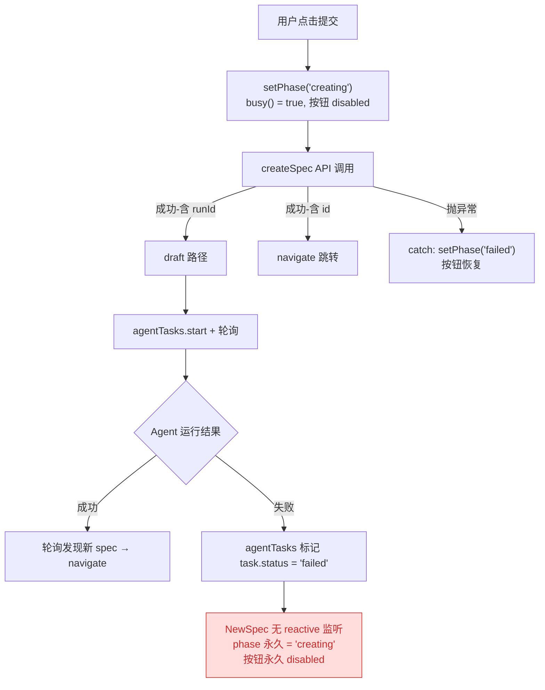
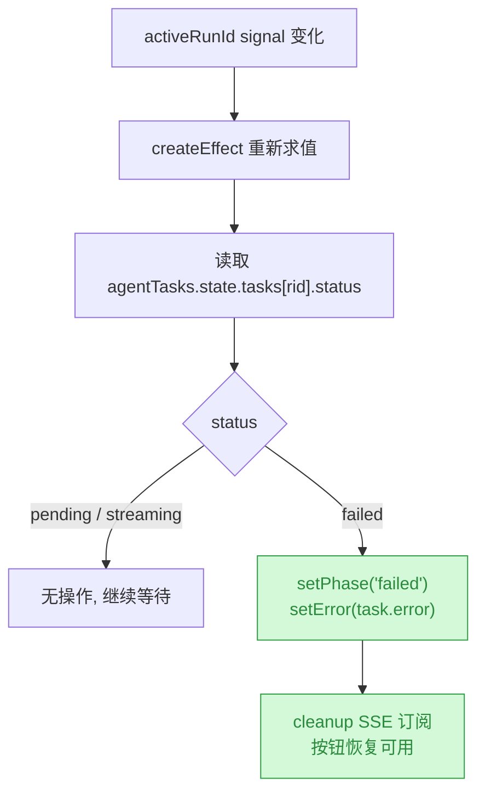

# fix: Agent 运行失败后恢复 NewSpec 页面按钮可用状态

## 1. 背景

NewSpec 页面（`src/gui/src/pages/NewSpec.tsx`）在用户点击「创建并启动 Agent」后，会将 `phase` 置为 `'creating'`，所有表单控件通过 `busy()`（`phase() === 'creating'`）进入 disabled 状态。当走 draft 路径时（`api.createSpec` 返回含 `runId` 的 draft 响应），页面启动 Agent 任务并轮询等待新 spec 出现。

如果 Agent 运行过程中失败（非零退出、SSE error、watchdog 失联等），`agentTasks` store 会将任务状态标记为 `'failed'`，但 NewSpec 组件没有监听这一状态变化，`phase` 永远停留在 `'creating'`，导致所有按钮永久 disabled，用户无法重试或修改。

## 2. 需求

当 Agent 运行失败时，NewSpec 页面上的按钮应取消 disabled 状态，恢复可用，让用户可以修改内容后重新提交。

## 3. 现状分析

### 3.1 状态流转链路



### 3.2 关键代码定位

| 位置                     | 说明                                                                                |
| ------------------------ | ----------------------------------------------------------------------------------- |
| `NewSpec.tsx:62`         | `phase` signal，类型 `'idle' \| 'creating' \| 'failed'`                             |
| `NewSpec.tsx:68`         | `busy()` 派生函数，控制所有 `disabled={busy()}`                                     |
| `NewSpec.tsx:81`         | `activeRunId` 为局部变量（非 signal），记录当前 Agent runId                         |
| `NewSpec.tsx:384`        | `setPhase('creating')` — 提交时锁定                                                 |
| `NewSpec.tsx:403-416`    | draft 路径：启动 agentTasks + 轮询，无失败回调                                      |
| `NewSpec.tsx:420-423`    | catch 仅处理 `createSpec` 本身异常，不覆盖 Agent 运行失败                           |
| `agent-tasks.ts:180-214` | `onAgentExit` / `onAgentError` 将 task 标记为 `'failed'`，但无向 NewSpec 的通知机制 |

### 3.3 根因

`activeRunId` 是普通局部变量而非 Solid signal，且组件没有对 `agentTasks.state.tasks[activeRunId].status` 做任何 reactive 监听。Agent 失败事件只在 `agentTasks` store 内部消化，NewSpec 组件对此无感知。

## 4. 技术实现方案

### 4.1 核心思路

将 `activeRunId` 从局部变量提升为 signal，新增一个 `createEffect` 响应式监听 `agentTasks.state.tasks[activeRunId()]?.status`。当检测到 `'failed'` 时，恢复 `phase` 为 `'failed'`（复用现有 `'failed'` 语义），展示错误信息，并清理 SSE 订阅。



### 4.2 改动清单

1. **`activeRunId` 改为 signal**

<details>
<summary>精确层：activeRunId signal 化的逐行改动</summary>

- `let activeRunId: string | null = null` → `const [activeRunId, setActiveRunId] = createSignal<string | null>(null)`
- `activeRunId = resp.runId` → `setActiveRunId(resp.runId)`
- `const runId = activeRunId` → `const runId = activeRunId()`
- import 行追加 `createEffect`

</details>

2. **新增 `createEffect` 监听 Agent 任务状态**

<details>
<summary>精确层：createEffect 实现代码</summary>

```tsx
createEffect(() => {
  const rid = activeRunId()
  if (!rid) return
  const task = agentTasks.state.tasks[rid]
  if (!task) return
  if (task.status === 'failed') {
    setPhase('failed')
    setError(task.error ?? 'Agent 运行失败')
    cleanupList?.()
    cleanupList = null
  }
})
```

</details>

3. **import 调整**：在 `solid-js` import 行追加 `createEffect`。

### 4.3 边界处理

- **Agent 成功但轮询未命中**：`pollForNewSpec` 持续重试，最终会命中或超时（靠 SSE list-updated 驱动），不在此 fix 范围。
- **组件 unmount 后 Agent 失败**：`onCleanup` 已调用 `cleanupList?.()`，且组件销毁后 effect 不再触发，无副作用。
- **`activeRunId` 被后续操作覆盖**：改为 signal 后每次赋值都触发 effect 重新求值，天然安全。

## 5. 待确认问题

_暂无_

## 6. 任务清单

- [x] `solid-js` import 行追加 `createEffect`（验收：import 行包含 `createEffect`）
- [x] `activeRunId` 从局部变量提升为 `createSignal<string | null>(null)`（验收：声明改用 `createSignal`，所有读写点更新）
- [x] 新增 `createEffect` 监听 `agentTasks.state.tasks[rid]?.status`，failed 时恢复按钮可用（验收：failed → setPhase('failed') + setError + cleanupList 清理）
- [x] TypeScript 类型检查通过（验收：`tsc --noEmit` 无错误）

## 7. 执行记录

- import 行追加 `createEffect`（`NewSpec.tsx:1`）。
- `activeRunId` 从 `let` 局部变量改为 `const [activeRunId, setActiveRunId] = createSignal<string | null>(null)`（`NewSpec.tsx:81`）。
- `pollForNewSpec` 中 `const runId = activeRunId` → `activeRunId()`（`NewSpec.tsx:364`）。
- `submit` 中 `activeRunId = resp.runId` → `setActiveRunId(resp.runId)`（`NewSpec.tsx:417`）。
- 新增 `createEffect`（`NewSpec.tsx:93-104`）：读取 `agentTasks.state.tasks[rid].status`，检测到 `'failed'` 时 `setPhase('failed')` + `setError(task.error)` + `cleanupList?.()` 清理 SSE 订阅。
- `tsc --noEmit` 通过，0 错误。
- 任务全部完成，标记 done。
