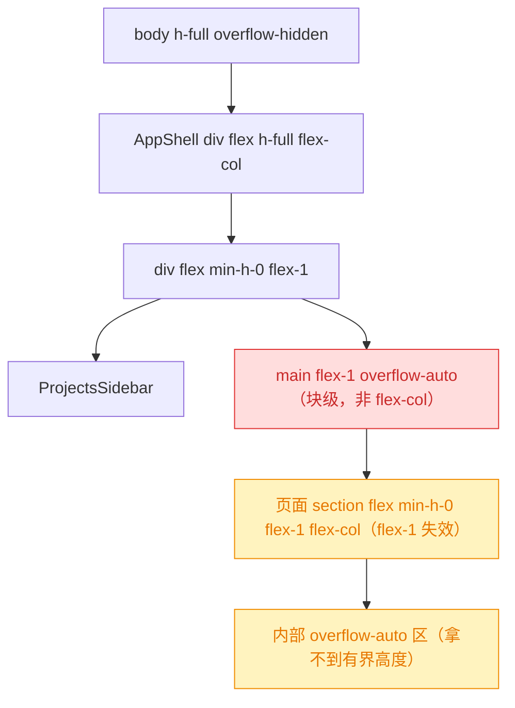
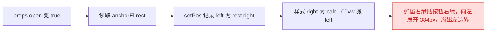
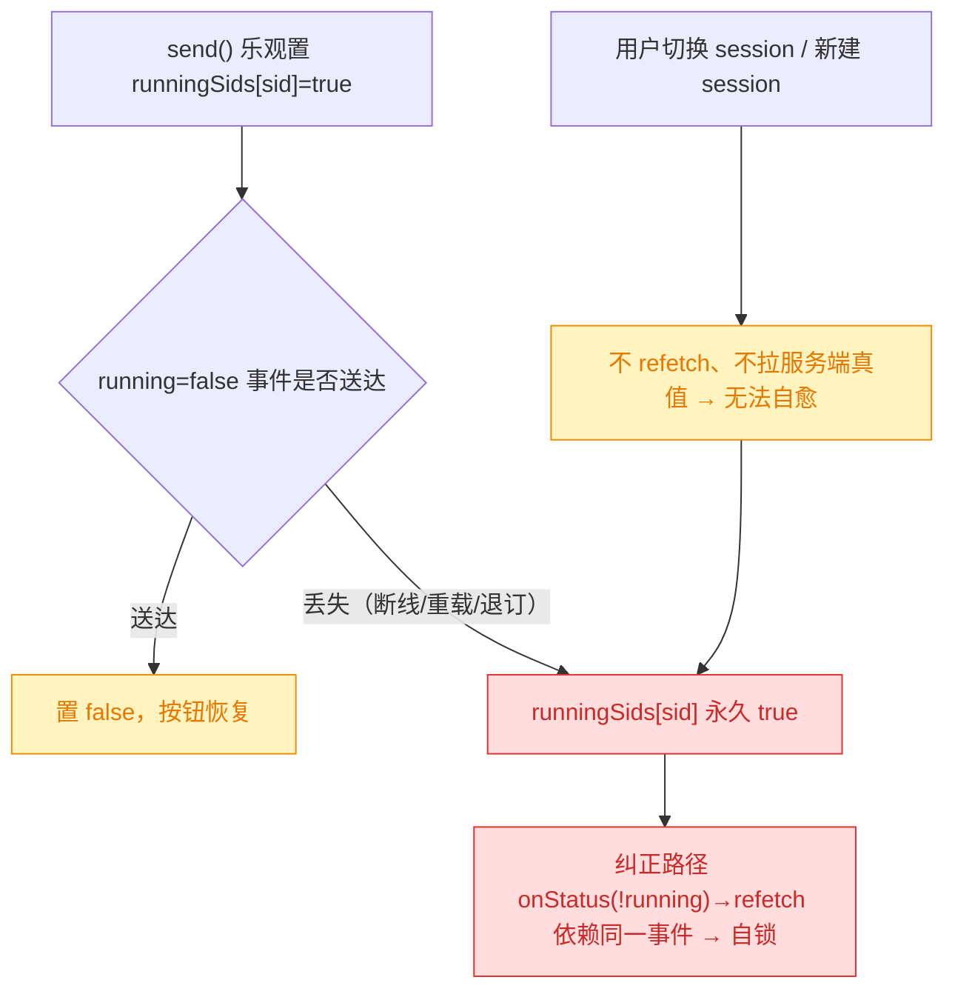
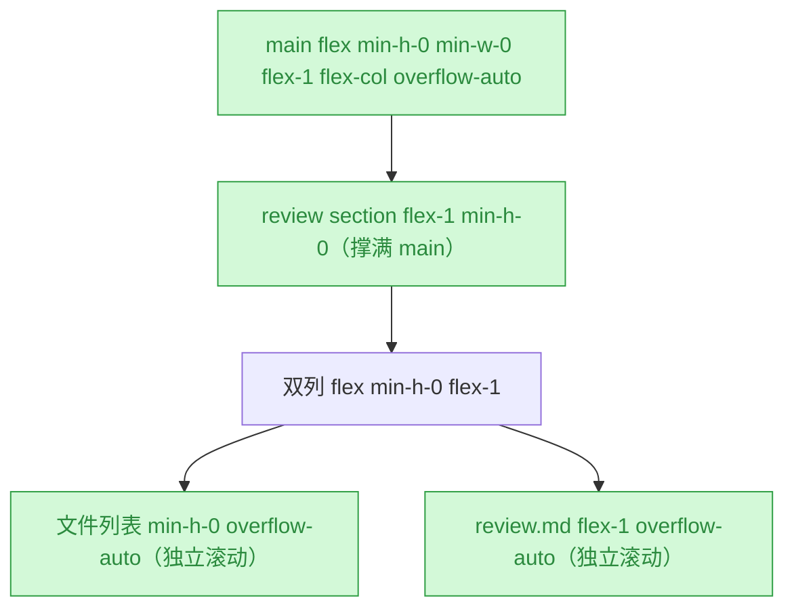
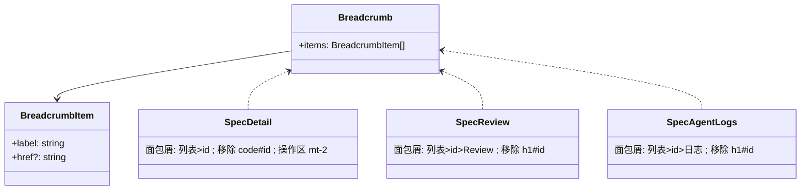
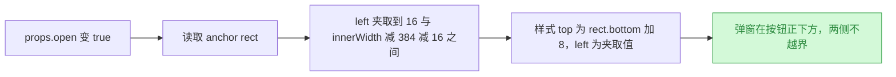
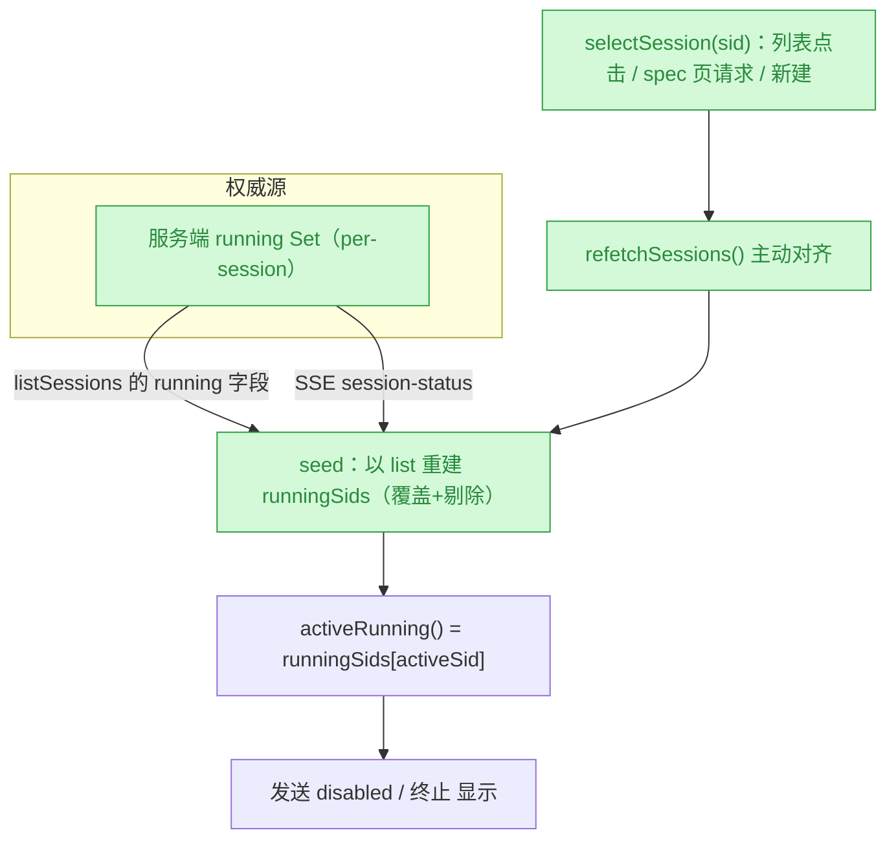

# GUI 页面与交互 Bug 修复

## 1. 背景

当前 GUI 在 review 页、spec 详情/日志页、追加任务弹窗三处存在布局与交互缺陷，影响可用性。

## 2. 需求

修复以下 GUI 页面或交互的 bug：

1. review 页面主容器和页面不应该出现滚动条，期望弹性占满高度；git 文件变更列表和 review.md 渲染区域如果超出高度，应该是各自独立的滚动条。
2. spec 相关页面需要面包屑：需求列表 > spec id（详情页） > review｜执行日志；详情页 header 区域移除 specId（与面包屑、文档内容标题重复）；summary 下方与按钮操作区稍微增加一点边距，别靠太近。
3. spec 详情页「追加任务」弹窗可能溢出到页面左侧边界之外，弹窗应在按钮正下方即可。

追加（2026-07-14，见 `## 追加任务`）：

4. chat 面板的发送 / 终止按钮应只与**当前 session** 的执行状态相关；现状为 session 发送消息后，切换 session、新建 session 均无法再向 Agent 发送新消息。
5. session 面板国际化：英文 time ago 应使用简写（`minutes ago` 太长）。
6. session 列表卡片 header 应显示**执行中** session 数量而非列表总数；无执行中 session 时连括号数字一并省略。
7. session 列表卡片默认折叠。

## 3. 现状分析

前三处问题分属「布局高度约束链断裂」「缺少面包屑 + header 冗余」「弹窗定位锚点错误」；追加四项集中在 `ChatPanel` 的 session 运行态与列表 header。全部在 `src/gui` 前端层，不涉及 Service / CLI。

### 3.1 布局与页面壳层

`AppShell` 的 `<main>` 是唯一内容容器，页面根节点均以 `flex min-h-0 flex-1 flex-col` 期望「弹性占满、内部各自滚动」。但 `<main>` 自身是块级滚动容器（`overflow-auto`），并非 flex column，导致子节点 `flex-1` 无法拿到受约束高度，内容超高时由 `<main>` 整体滚动（页面级滚动条），review 页内部已设好的独立滚动区反而拿不到有界高度。

精确层：涉及的容器与滚动区

- `src/gui/src/AppShell.tsx:76` — `<main class="min-w-0 flex-1 overflow-auto">`，根因所在。
- `src/gui/src/pages/SpecReview.tsx:268` 根 `section flex min-h-0 flex-1 flex-col`；:291 双列容器 `flex min-h-0 flex-1`；:389 文件列表 `min-h-0 flex-1 overflow-auto`；:457 review.md `flex-1 overflow-auto`。内部滚动结构已就绪，仅缺上游有界高度。
- `src/gui/src/pages/Home.tsx:131` 根 `section overflow-y-auto p-4`（自带滚动，非 flex-1）；`src/gui/src/pages/SpecAgentLogs.tsx:34` 根 `section flex min-h-0 flex-1 flex-col`，日志列表段无 overflow，依赖页面级滚动。
- `src/gui/src/__e2e__/body-no-overflow.spec.ts` 校验首页 `body` 不产生垂直溢出，改动不得破坏该约束。

### 3.2 spec 相关页面导航与 header

三个 spec 页面各自有一套 header，均把 specId 塞进标题/返回链接，无统一面包屑：

- `SpecDetail`：header 内 `<code>{s().id}</code>`（:232）与文档正文 `# 标题`、以及待加的面包屑三重重复；summary `
`（:236）与其下操作按钮区 `
`（:240）在 `flex flex-col` 中无间距，贴得过近。
- `SpecReview`：header 用 `ArrowLeft` 返回链接 + `<h1>Review · {{id}}</h1>`（:279），id 冗余。
- `SpecAgentLogs`：header 用文字返回链接 + `<h1>执行日志 · {{id}}</h1>`（:41）。

三页均无 `Breadcrumb` 组件，`components/` 下不存在可复用面包屑。

### 3.3 追加任务弹窗定位

`AppendTaskDialog` 以按钮为锚点定位，但锚的是**右边缘**并让弹窗向左展开：`setPos({ left: rect.right })` 后样式用 `right: calc(100vw - left)`，弹窗宽 `w-96`(384px) 会从按钮右缘向左延伸 384px，按钮偏左或视口较窄时溢出到页面左侧边界之外，且视觉上不在按钮「正下方」。

精确层：定位代码

- `src/gui/src/components/AppendTaskDialog.tsx:37-38` — `const rect = anchor.getBoundingClientRect(); setPos({ top: rect.bottom + 8, left: rect.right })`。
- 同文件 :95-98 — `style={ pos() ? { top: ..px, right: 'calc(100vw - ${left}px)' } : undefined }`。
- 弹窗宽度：:92 `w-96 max-w-[calc(100vw-2rem)]`。
- 锚点按钮：`src/gui/src/pages/SpecDetail.tsx:255-263` 追加任务按钮 `ref={appendBtnEl}`。

### 3.4 chat 面板 session 运行态与列表 header

服务端已是**按 session 粒度**维护运行态（`SessionManager.running: Set<sid>`，`setRunning` 通过项目级 `session-status` 事件广播），前端 `ChatPanel` 也用 `runningSids: Record<sid, boolean>` 承接，按钮绑定的 `activeRunning()` 本就只看当前 session。问题不在「作用域」，而在**状态收敛的单向性**：

`runningSids[sid]` 由 `send()` **乐观置 true**，其后置回 false **完全依赖 SSE 事件**（项目级 `session-status`、或当前 session topic 的 `turn-completed` / `error`）。一旦该 session 的 `running=false` 事件丢失（SSE 断线重连、页面在 turn 进行中重载、mux 退订窗口），`runningSids[sid]` 就**永久停在 true**：发送按钮永久禁用、终止按钮永久显示。而唯一的纠正路径 `onStatus(!running) → refetchSessions()` **本身依赖那条丢失的事件**，形成自锁——切换 session、新建 session 都**不会**主动向服务端拉取真值来自愈。

伴随的三处列表侧现状：seed effect 只 merge 不 prune（切项目后旧 id 残留）；新建 session 因服务端 ghost 过滤不进列表，其 `runningSids` 条目从未被初始化；header 计数取的是列表长度而非执行中数量；列表默认展开；英文相对时间来自 timeago.js 的 `en_US` 语言包（`5 minutes ago`），不在项目 i18n 文件内。

精确层：ChatPanel 与 SessionManager 关键位置

- `src/gui/src/components/ChatPanel.tsx:97` `runningSids` 定义；:105-113 seed effect（`next[s.id] = Boolean(s.running)`，只 merge 不 prune）；:117-129 项目级 `subscribeSessions` → `onStatus`，`!running` 时才 `refetchSessions()`。
- 同文件 :131-135 `isRunning` / `activeRunning`；:310-325 `send()`（:318 乐观置 true）；:327-333 `abort()`；:298-308 `newSession()`（未初始化新 id 的 running，未在切换后拉真值）；:427 列表点击 `setActiveSid(s.id)`（同样不 refetch）。
- 同文件 :89 `listOpen` 默认展开：`readLocal(LIST_COLLAPSED_KEY, '0') !== '1'`；:401-403 header 计数 `t('chat.sessionsLabel', { count: (sessions() ?? []).length })`；:485-503 终止（`Show when={activeRunning()}`）与发送（`disabled={!activeSid() || !input().trim() || activeRunning()}`）按钮。
- 同文件 :13-15、:36-37 注册 timeago.js `en_US` / `zh_CN` 语言包；:277-281 `formatSessionUpdatedAt` → `formatTimeago(ts, lng())`。
- `src/service/session-manager.ts:44` `running` Set；:150-154 `setRunning` 广播 `session-status`；:106-137 `listSessions()` 逐项标注 `running`，:124-129 过滤未跑过 turn 的 ghost session（`this.running.has(s.id)` 时保留）；:174-215 `send()` 的 `setRunning(true)` → `finally setRunning(false)`。
- i18n `chat` 块：`src/gui/src/i18n/zh-CN.ts:50-67`、`src/gui/src/i18n/en.ts:50-67`（含 `sessionsLabel`）。

## 4. 技术实现方案

按 bug 独立修复，改动集中在 `src/gui` 前端，无 Service / API 改动。

### 4.1 Bug 1：review 页弹性占满、内部独立滚动

将 `AppShell` 的 `<main>` 由「块级滚动容器」改为「flex column 容器」，让页面根 `section` 的 `flex-1 + min-h-0` 高度约束链贯通，从而 review 页内部两个 `overflow-auto` 区各自独立滚动、`<main>` 不再产生页面级滚动。保留 `overflow-auto` 作为不自管滚动页面（Home 自带滚动、AgentLogs 依赖页面滚动）的兜底，避免回归。

- 仅改 `src/gui/src/AppShell.tsx:76`：`class="min-w-0 flex-1 overflow-auto"` → `class="flex min-h-0 min-w-0 flex-1 flex-col overflow-auto"`。
- Home 根 section 自带 `overflow-y-auto`、AgentLogs 依赖兜底 `overflow-auto`，`<main>` 仍可整体滚动，`body-no-overflow` e2e 不受影响。

### 4.2 Bug 2：spec 面包屑 + detail header 清理 + summary 间距

新增通用 `Breadcrumb` 组件（`src/gui/src/components/Breadcrumb.tsx`），接收 `items: { label, href? }[]`，最后一段为当前页（无链接）。三个 spec 页在 header 顶部接入：

- 详情页：`需求列表 > {specId}`（specId 为当前段，无链接）。
- review 页：`需求列表 > {specId}（链接回详情）> Review`。
- 执行日志页：`需求列表 > {specId}（链接回详情）> 执行日志`。

`需求列表` 段链接到项目 spec 列表（`projectHref('specs')` 或项目根）。同时：

- 详情页 header 移除 `<code>{s().id}</code>`（与面包屑、正文标题重复）。
- review / 日志页移除原 `ArrowLeft`/文字返回链接与带 id 的 `<h1>`，由面包屑承载导航与页面上下文（review.md / agentLogs 渲染区、summary 保留）。
- 详情页操作按钮区 `
`（SpecDetail.tsx:240）增加上边距 `mt-2`，与 summary 拉开一点距离。

新增 i18n：`breadcrumb.specList`（'需求列表' / 'Spec List'）；面包屑末段复用现有 `specDetail.review`、`specDetail.agentLogs`。

精确层：Breadcrumb 组件与接入点

- 新文件 `src/gui/src/components/Breadcrumb.tsx`：solid `Component<{ items: { label: string; href?: string }[] }>`，用 `@solidjs/router` 的 `A` 渲染带 `href` 的段，`lucide-solid` 的 `ChevronRight` 作分隔符，末段纯文本；样式沿用 `text-sm text-muted-foreground`，当前段 `text-foreground`。
- `SpecDetail.tsx`：header 顶部插入面包屑；删除 :232 `<code>`；:240 操作区 div 加 `mt-2`。
- `SpecReview.tsx`：替换 :271-283 返回链接 + `<h1>` 为面包屑（`需求列表 > id(链接) > Review`），保留 summary 与 lastReview。
- `SpecAgentLogs.tsx`：替换 :38-41 返回链接 + `<h1>` 为面包屑。
- `src/gui/src/i18n/zh-CN.ts` 与 `en.ts` 新增 `breadcrumb: { specList }`。
- `需求列表` 段 href：复用 `projectHref('specs')`（Home 路由，见 `home.specList='需求列表'`）。

### 4.3 Bug 3：追加任务弹窗定位到按钮正下方

把锚点从「右缘 + 向左展开」改为「左缘对齐按钮 + 视口夹取」，弹窗落在按钮正下方且不越界：

- `setPos` 改为记录 `left: rect.left`，并在 JS 内夹取：`left = max(16, min(rect.left, innerWidth - 384 - 16))`（384 = `w-96`，16 = 1rem 边距）。
- 样式由 `right: calc(100vw - left)` 改为直接 `left: ${clampedLeft}px`。

精确层：AppendTaskDialog 定位改动

- `src/gui/src/components/AppendTaskDialog.tsx:37-38`：改为读取 rect 后 `const width = 384; const left = Math.max(16, Math.min(rect.left, window.innerWidth - width - 16)); setPos({ top: rect.bottom + 8, left })`。
- 同文件 :95-98 style：`pos() ? { top: '${pos()!.top}px', left: '${pos()!.left}px' } : undefined`。
- 保留 `max-w-[calc(100vw-2rem)]` 兜底，`w-96` 宽度常量与夹取的 384 保持一致。

### 4.4 追加 Bug 4-7：chat 面板 session 运行态与列表

改动全部落在 `ChatPanel.tsx` + i18n + 一个新的 timeago 语言包文件；服务端不动（其 per-session 运行态已是权威真值）。

**Bug 4（发送/终止只跟当前 session 走）**：核心是把运行态从「乐观置位 + 单向依赖 SSE」改为「**以服务端 list 为权威 + 切换/新建时主动对齐**」，使任何一次事件丢失都能在下一次选择 session 时自愈：

- 抽出 `selectSession(sid)` 统一收口所有切换入口（列表点击、spec 页 `requestedChatSessionId`、新建），内部 `setActiveSid(sid)` 后 `void refetchSessions()` 拉取服务端真值。
- seed effect 改为**以 list 重建**而非只 merge：list 内的 id 以 `s.running` 覆盖，list 外的 id 直接丢弃（服务端对 running 中的 ghost session 会保留在 list 中，故不会误清刚发出的 turn）。这同时解决切项目后旧 id 残留。
- `newSession()` 拿到 id 后立即 `runningSids[newId] = false` 并经 `selectSession` 激活，保证新建 session 一定可发送。
- 切换项目时清空 `activeSid` 与 `runningSids`，杜绝跨项目串号。

**Bug 5（英文 time ago 简写）**：新增 `src/gui/src/lib/timeago-locale.ts`，导出符合 timeago.js `LocaleFunc` 的 `enShort`（`just now` / `5m ago` / `3h ago` / `2d ago` / `in 5m`…），在 `ChatPanel` 用它 `registerTimeago('en', enShort)` 覆盖原 `en_US`；中文沿用 `zh_CN`（`5分钟前` 本已够短）。

**Bug 6（header 显示执行中数量）**：`runningCount = (sessions() ?? []).filter((s) => isRunning(s.id)).length`；`runningCount > 0` 时渲染 `t('chat.sessionsLabel', { count })`（带括号数字），否则渲染 `t('chat.sessionsLabelPlain')`（纯 `会话` / `Sessions`，无括号）。

**Bug 7（列表默认折叠）**：`listOpen` 初值由 `readLocal(LIST_COLLAPSED_KEY, '0') !== '1'` 改为 `readLocal(LIST_COLLAPSED_KEY, '1') !== '1'`——无本地记录时折叠，用户显式展开后仍按 localStorage 记忆。

精确层：ChatPanel 改动点与 timeago 语言包

- `ChatPanel.tsx:89` → `createSignal(readLocal(LIST_COLLAPSED_KEY, '1') !== '1')`（默认折叠）。
- `ChatPanel.tsx:105-113` seed effect → 以 list 重建：`const next: Record<string, boolean> = {}; for (const s of list) next[s.id] = Boolean(s.running); return next`；为不丢失「刚 send 但 list 尚未回包」的乐观值，保留 `activeSid()` 当前条目：若 `prev[activeSid()]` 为 true 且 activeSid 不在 list 中，则保留该条。
- `ChatPanel.tsx` 新增 `function selectSession(sid: string)`：`if (sid === activeSid()) return; setActiveSid(sid); void refetchSessions()`；替换 :427 `onClick={() => setActiveSid(s.id)}`、:140-150 spec 页请求分支、:298-308 `newSession()` 内的 `setActiveSid`。
- `ChatPanel.tsx:298-308` `newSession()`：`const { sessionId } = await api.createSession(pid, {})`；`setRunningSids((prev) => ({ ...prev, [sessionId]: false }))`；`selectSession(sessionId)`（内部已 refetch，去掉原先的 `await refetchSessions()`）。
- 新增「项目切换清空」effect：`createEffect(() => { activeProjectId(); setActiveSid(''); setRunningSids({}); setEntries([]) })`——注意需与既有 `sessions` resource 的 pid 依赖并存，且不能吞掉 `requestedChatSessionId` 的切换（该 effect 只依赖 `activeProjectId`，Solid 下不会被 activeSid 变化重入）。
- 新文件 `src/gui/src/lib/timeago-locale.ts`：`export const enShort: LocaleFunc = (_n, index) => [['just now','right now'],['%ss ago','in %ss'],['1m ago','in 1m'],['%sm ago','in %sm'],['1h ago','in 1h'],['%sh ago','in %sh'],['1d ago','in 1d'],['%sd ago','in %sd'],['1w ago','in 1w'],['%sw ago','in %sw'],['1mo ago','in 1mo'],['%smo ago','in %smo'],['1y ago','in 1y'],['%sy ago','in %sy']][index] as [string, string]`。
- `ChatPanel.tsx:13-15/36-37`：`registerTimeago('en', enShort)` 取代 `registerTimeago('en', enUSTimeago)`，移除 `en_US` 语言包导入。
- `ChatPanel.tsx:401-403` header：`<Show when={runningCount() > 0} fallback={{t('chat.sessionsLabelPlain')}}>{t('chat.sessionsLabel', { count: runningCount() })}</Show>`。
- i18n 新增键 `chat.sessionsLabelPlain`：zh-CN `'会话'`、en `'Sessions'`；`chat.sessionsLabel` 语义改为「执行中会话数」，值维持 `'会话（{{count}}）'` / `'Sessions ({{count}})'`。

### 4.5 验证方式

- 单元/构建：`pnpm -C src/gui build` 或仓库既有 `tsc --noEmit`（若配置）通过。
- e2e：`src/gui/src/__e2e__/append-task.spec.ts`、`body-no-overflow.spec.ts` 通过；必要时补断言。
- 手动：review 页无页面级滚动条、文件列表与 review.md 各自独立滚动；三个 spec 页面包屑正确、详情页无重复 id、summary 与按钮有间距；窄视口下追加任务弹窗在按钮正下方且不越界。
- 手动（追加项）：session A 发送后切到 session B / 新建 session 均可立即发送；session 列表 header 仅在有执行中 session 时显示括号数字；列表首次进入为折叠态；英文下相对时间显示为 `5m ago` 形式。

## 5. 待确认问题

_暂无_

## 6. 任务清单

- [x] 修改 src/gui/src/AppShell.tsx main 容器为 flex 列布局（验收：class 含 flex min-h-0 flex-1 flex-col overflow-auto）
- [x] 新增 src/gui/src/components/Breadcrumb.tsx 通用面包屑组件（验收：接收 items 数组，末段无链接，用 ChevronRight 分隔）
- [x] 在 SpecDetail 接入面包屑并移除 header 中 code#specId、操作区加 mt-2（验收：无 `<code>{s().id}</code>`，操作区 div 含 mt-2，面包屑为 需求列表>id）
- [x] 在 SpecReview 用面包屑替换返回链接与带 id 的 h1（验收：面包屑为 需求列表>id>Review，无 review.heading 的 h1）
- [x] 在 SpecAgentLogs 用面包屑替换返回链接与带 id 的 h1（验收：面包屑为 需求列表>id>执行日志）
- [x] 在 i18n zh-CN.ts 与 en.ts 新增 breadcrumb.specList（验收：两文件均含该键）
- [x] 修改 AppendTaskDialog 定位为按钮左缘对齐并视口夹取（验收：setPos 用 rect.left 夹取，style 用 left 而非 right）
- [x] 运行 GUI 构建/类型检查（验收：pnpm -C src/gui 构建或 tsc 无报错）
- [x] 同步更新 append-task e2e 断言为「正下方+不越界」以匹配新定位（验收：assertion 校验 below/left/no-overflow）
- [ ] [manual] 浏览器人工核验三处 bug 修复效果（验收：review 页无页面滚动条+内部独立滚动、面包屑正确、弹窗在按钮正下方不越界）
- [x] 在 ChatPanel 抽出 selectSession(sid) 收口所有切换入口并 refetch 对齐服务端 running（验收：列表点击、spec 页请求、newSession 均调用 selectSession，函数内含 refetchSessions）
- [x] 改 ChatPanel seed effect 为以 list 重建 runningSids（验收：list 外的 id 被剔除，仅保留 activeSid 的乐观 true）
- [x] newSession 创建后立即置 runningSids[newId]=false 并经 selectSession 激活（验收：新建 session 后发送按钮立即可用）
- [x] 新增项目切换清空 activeSid/runningSids/entries 的 effect（验收：切换项目后无跨项目 sid 残留）
- [x] 新增 src/gui/src/lib/timeago-locale.ts 的 enShort 并在 ChatPanel 注册覆盖 en（验收：英文相对时间显示为 5m ago 形式）
- [x] ChatPanel 列表 header 改为显示执行中 session 数量、无执行中时省略括号（验收：runningCount>0 用 sessionsLabel，否则 sessionsLabelPlain）
- [x] i18n zh-CN.ts 与 en.ts 新增 chat.sessionsLabelPlain（验收：两文件均含该键）
- [x] session 列表卡片默认折叠（验收：listOpen 初值为 readLocal(LIST_COLLAPSED_KEY, '1') !== '1'）
- [x] 运行 GUI 构建/类型检查（验收：pnpm run build 无类型/打包错误）
- [ ] [manual] 浏览器人工核验追加四项（验收：session 发送后切换/新建 session 均可发送、header 仅在有执行中会话时显示数字、列表默认折叠、英文时间为简写）

## 7. 追加任务

- [fixed] [fix] 2026-07-14 16:47:55 | 1. chat 面板中的 发送、终止 按钮，应该只跟当前session 执行状态相关，目前 session 发送消息后，切换 session、新建 sessio
  - 描述：1. chat 面板中的 发送、终止 按钮，应该只跟当前session 执行状态相关，目前 session 发送消息后，切换 session、新建 session 无法发送新信息给 Agent

2. session 面板国际化， time ago 英文应该使用简写， minutes ago 太长了
3. session 列表卡片的 header 应该显示执行中 session 数量，不要显示列表数量，如果没有执行中 session 数量，括号数字都不需要显示
4. session 列表卡片默认折叠

## 8. 执行记录

- Bug 1：`src/gui/src/AppShell.tsx:76` main 由 `min-w-0 flex-1 overflow-auto` 改为 `flex min-h-0 min-w-0 flex-1 flex-col overflow-auto`，使页面根 section 的 `flex-1 + min-h-0` 高度链贯通；review 页文件列表与 review.md 各自独立滚动，overflow-auto 兜底不自管滚动的页面。验证：GUI 构建通过。
- Bug 2：新增 `src/gui/src/components/Breadcrumb.tsx`（items 数组，末段纯文本，ChevronRight 分隔）；`SpecDetail` 顶部接入面包屑（需求列表>id）、移除 `<code>{s().id}</code>`、操作区 div 加 `mt-2`；`SpecReview`/`SpecAgentLogs` 用面包屑（需求列表>id(链接)>Review｜执行日志）替换原返回链接与带 id 的 h1，并移除随之未用的 `A`、`ArrowLeft` 导入；`i18n/zh-CN.ts`、`en.ts` 新增 `breadcrumb.specList`。验证：GUI 构建通过。
- Bug 3：`src/gui/src/components/AppendTaskDialog.tsx` 定位改为按钮左缘对齐并夹取 `Math.max(16, Math.min(rect.left, innerWidth-384-16))`，style 由 `right: calc(100vw - left)` 改为 `left`，弹窗落在按钮正下方且两侧不越界。验证：GUI 构建通过。
- 测试：同步改写 `src/gui/src/__e2e__/append-task.spec.ts` 定位断言（旧断言校验右缘对齐，与新需求冲突），改为校验「在按钮下方 + 左缘不在按钮右侧 + 两侧不越出视口」。
- 构建：`pnpm run build`（CLI+GUI）成功，无类型/打包错误（`tsc --noEmit` 报的 `@/lib/cn` 系既有路径别名问题，vite 构建正常解析，与本次改动无关）。
- e2e 未能在当前环境运行：Playwright webServer 依赖隔离的单项目 `.tmp-e2e`，但本机全局 YorZ 项目注册表含 4 个真实项目，导致 `/specs/:id`（无 projectId 前缀）无法自动跳转到种子项目，页面元素定位失败；未改动的 `body-no-overflow` 用例同样失败，证明属环境隔离问题而非代码缺陷。修复需改动用户全局注册表（移除真实项目），不擅自执行。留待 `[manual]` 浏览器人工核验。
- 收尾：非 manual 任务全部完成，待确认问题为空、无批注、无追加任务 `[open]`，标记 done（`[manual]` 浏览器核验项按规则忽略）。
- 追加 Bug 4（发送/终止只跟当前 session）：根因是运行态**单向收敛**——`send()` 乐观置 `runningSids[sid]=true`，置回 false 只能靠 SSE，事件一旦丢失就永久卡死，而唯一的纠正路径 `onStatus(!running)→refetch` 又依赖同一条事件，形成自锁。改为**以服务端 list 为权威 + 切换时主动对齐**：新增 `selectSession(sid)` 收口列表点击 / spec 页请求 / 新建三处切换入口，内部 `setActiveSid` 后 `refetchSessions()`；seed effect 由「只 merge」改为「以 list 重建」（覆盖 list 内 id、剔除 list 外 id，仅保留 activeSid 的乐观 true，避免误清刚发出的 turn）；`newSession()` 拿到 id 后立即置 `running=false` 再 `selectSession` 激活；新增项目切换清空 `activeSid`/`runningSids`/`entries` 的 effect，杜绝跨项目串号。任何一次事件丢失都能在下次选择 session 时自愈。
- 追加 Bug 5（英文 time ago 简写）：新增 `src/gui/src/lib/timeago-locale.ts` 导出 `enShort`（`just now` / `5m ago` / `3h ago` / `2d ago`，含 `in %sm` 未来态），`ChatPanel` 以 `registerTimeago('en', enShort)` 覆盖并移除 `timeago.js/lib/lang/en_US.js` 导入；中文沿用 `zh_CN`。
- 追加 Bug 6（header 显示执行中数量）：新增 `runningCount` memo（`sessions()` 中 `isRunning` 为真的条数）；header 用 `Show` 分支——有执行中会话时渲染 `chat.sessionsLabel`（带括号数字），否则渲染新键 `chat.sessionsLabelPlain`（纯「会话 / Sessions」，无括号）。`i18n/zh-CN.ts`、`en.ts` 同步新增该键。
- 追加 Bug 7（列表默认折叠）：`listOpen` 初值由 `readLocal(LIST_COLLAPSED_KEY, '0') !== '1'` 改为默认 `'1'`，无本地记录时折叠；用户显式展开后仍按 localStorage 记忆。
- 验证：`pnpm run build`（CLI+GUI）通过，无类型/打包错误；`pnpm test` 34 个测试文件、269 个用例全部通过。浏览器行为核验留 `[manual]` 项。
- 收尾（追加轮）：追加任务条目标记 `[fixed]`，非 manual 任务全部完成，待确认问题为空、无批注、无 `[open]`，重新标记 done。
