# 260712.refct.agent-sdk-chat-workspace

## 1. 背景

当前 YorZ Service 通过命令行（`child_process.spawn`）把用户请求代理到 Agent（见 `src/service/agent.ts` 的 `AgentRunner`），以 `--output-format stream-json` 解析输出流。这种方式扩展性与控制力度有限：无法精细控制对话轮次、工具调用、session 持久化等能力。本次重构目标是改用各 Agent 官方 SDK，在 Service 侧构建统一 API，并同步重构 GUI 项目页布局与交互。

三个改造方向：

1. **Service 统一 API**：将用户请求代理到 Agent 对应的 SDK（Claude Agent SDK / Codex SDK / OpenCode SDK），以获得更大扩展性与更细控制。
2. **GUI 三列布局**：项目页改为「项目列表 / Chat 面板 / 内容页面（spec 列表、review、执行记录等）」三列，均可折叠、自由调整宽度。
3. **Chat 面板 session 管理**：支持新建与切换 session，切换旧 session 时调用对应 API 拉取会话记录，依靠各 Agent 自身持久化对话记录。

参考 SDK 文档：

- Codex SDK: https://github.com/openai/codex/tree/main/sdk/typescript
- Claude Agent SDK: https://code.claude.com/docs/en/agent-sdk/typescript
- OpenCode SDK: https://opencode.ai/docs/zh-cn/sdk/

附件：

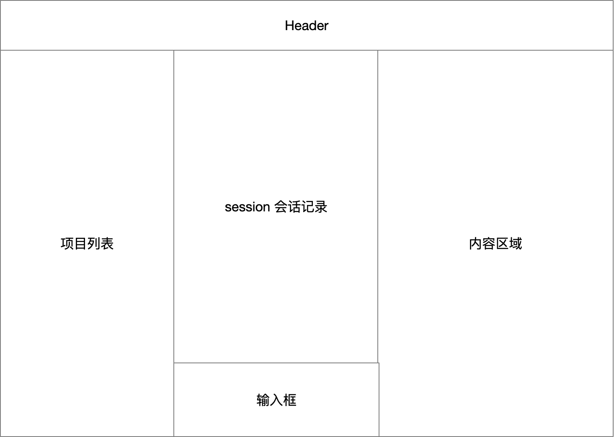

## 2. 需求

1. 在 Service 中构建统一 API，将用户请求代理到 Agent 对应的 SDK，替代当前命令行代理方式，以获得更大扩展性与更细控制力度（参考上述三份 SDK 文档）。
2. 重构 GUI 项目页布局，参考截图改为三列：项目列表、Chat 面板、内容页面（spec 列表、review、执行记录等）；三个面板均可折叠、自由调整宽度。
3. Chat 面板支持新建和切换 session：切换到旧 session 时调用对应 API 拉取该 session 的对话记录，依靠对应 Agent 持久化对话记录。

## 3. 现状分析

### 3.1 服务端：命令行代理架构

Service 为 Hono 应用（默认 7423 端口）。`ProjectRegistry.materialize()` 为每个项目构造一个 `AgentRunner` 与 `AgentLogStore`。`AgentRunner.run()` 通过 `child_process.spawn` 拉起 Agent CLI 子进程，逐块读取 stdout；claude 走 `--output-format stream-json`（JSONL → `formatStreamEvent` 转人类可读文本），codex/opencode 走纯文本透传。运行输出经 EventsHub 以 SSE 推送给 GUI，日志落盘到 `.yorz/tmp/agent-logs/`。

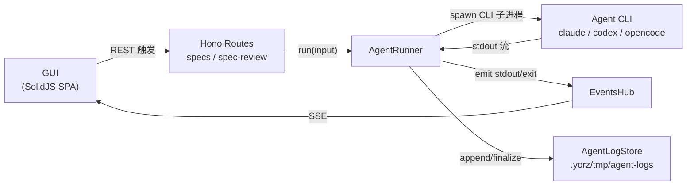

精确层：服务端关键文件与命令行配置

- `src/service/agent.ts` — `AgentRunner`：`run/get/active/listActive/cancel/subscribe`，`spawn()` 内 `detached:true` + `killTree` 进程组管理；`formatStreamEvent`（claude JSONL 解析）。
- `src/service/agent-config.ts` — `resolveAgentCmd`，三种内建命令：
  - claude：`claude -p <prompt> --permission-mode bypassPermissions --output-format stream-json --verbose`（`streamFormat: 'json'`）
  - codex：`codex exec --cd <cwd> --skip-git-repo-check --dangerously-bypass-approvals-and-sandbox <prompt>`（`streamFormat: 'text'`）
  - opencode：`opencode run --dangerously-skip-permissions <prompt>`，env 注入 `PWD=cwd`（`streamFormat: 'text'`）
  - kind 选择：`opts.override` → env `YORZ_AGENT_CMD` → `opts.agent` → `.yorz/config.json` 的 `agent.kind` → 默认 `claude`。
- `src/service/agent-log-store.ts` — 落盘 `.yorz/tmp/agent-logs/<specId>/<runId>.{log,json}`；`openWriter/append/finalize/listBySpec/readLog/cleanupExpired`。
- `src/service/events-hub.ts` — SSE 多路复用；此处的 `Session`（L40-48）是**传输层客户端会话**（clientId + topics + queue），**并非对话 session**。
- `src/service/project-registry.ts:179-185` — 每项目构造 `AgentRunner` + `AgentLogStore`。

### 3.2 四种 Agent 模式（一次性代理）

现有交互全部是「一次性任务」，无对话延续。`AgentMode = 'skill-run' | 'explain' | 'review' | 'git-ops'`，各自在路由内拼 prompt 后调用 `runner.run()`，run 完即止；skill-run 按 spec 去重。

精确层：模式触发点与 prompt 构造

| 模式      | 触发路由                                                                          | prompt 构造                                                                 |
| --------- | --------------------------------------------------------------------------------- | --------------------------------------------------------------------------- |
| skill-run | `POST /specs`（含 requirement）、`POST /specs/:id/run`、`POST /specs/:id/appends` | `buildDraftPrompt()`（specs.ts）/ 内联「用 yorz-spec skill 处理 spec 路径」 |
| explain   | `POST /specs/:id/explain`                                                         | specs.ts:218 内联「中文解释片段，勿改文件」                                 |
| review    | `POST /specs/:id/review`                                                          | spec-review.ts:32 内联「Review 阶段，输出 review.md」                       |
| git-ops   | `POST /specs/:id/git`（action=commit/discard/stash）                              | `buildGitOpsPrompt()`（spec-review.ts:176）                                 |

REST/SSE 面向前端：`runAgent/explain/triggerReview/gitOp/fetchActiveRuns/cancelRun`；SSE 主题 `project:{pid}:spec:{id}`、`:run:{runId}`、`:specs`、`:changes`、`projects`。

### 3.3 GUI：两列布局，无对话面板

`main.tsx` 定义路由，`AppShell` 为两列布局：`ProjectsSidebar`（左，可折叠 + 手写拖拽调宽，localStorage 持久化）+ `main`（右，路由内容），底部挂 `AgentPanelDock`（任务流输出卡片，**非对话式**）。无 Resizable UI 组件，无 session 概念。

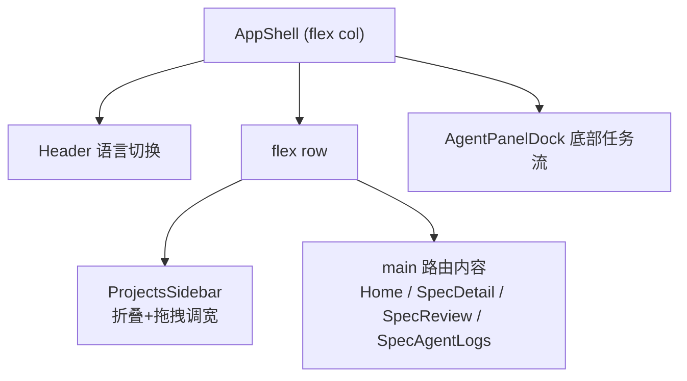

精确层：GUI 路由、组件与基础设施

- `src/gui/src/main.tsx` — 路由：`/:projectId` Home、`/specs/new` NewSpec、`/specs/:id` SpecDetail、`.../review` SpecReview、`.../agent-logs` SpecAgentLogs。
- `src/gui/src/AppShell.tsx` — 两列外壳；`src/gui/src/components/ProjectsSidebar.tsx` — 折叠状态 `yorz.projectsSidebar.collapsed`、宽度 `yorz.projectsSidebar.width`（默认 220，min160/max480），`beginResize()` 手写 rAF 拖拽。
- `src/gui/src/components/AgentPanelDock.tsx` — 底部 dock，任务卡片流式 `<pre>` 输出，状态 `yorz.agentDock.collapsed`；非对话 UI。
- `components/ui/` 已有：button/badge/card/checkbox/collapsible/dialog/dropdown-menu/input/popover/radio-group/select/separator/sonner/textarea/tooltip。**无 resizable**。
- `src/gui/src/lib/`：`api.ts`（REST）、`sse.ts`（`SseMultiplex` 单连接 + 主题订阅）、`project.ts`（`activeProjectId` / `projectHref`）、`agent-tasks.ts`（runId 任务 store）。

### 3.4 三方 SDK 能力对比（目标能力面）

三个 SDK 均有「会话/线程」概念（带 id、磁盘持久化、按 id 恢复），但在「列出会话」「读取历史」「运行形态」上差异显著——这是统一抽象的关键难点。

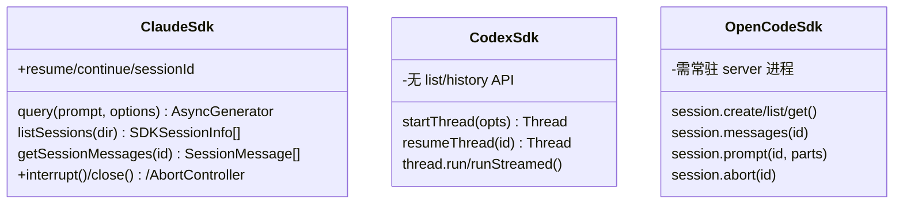

精确层：三方 SDK 逐项能力

- **Claude Agent SDK**（`@anthropic-ai/claude-agent-sdk`）：`query({prompt, options})` 返回 `AsyncGenerator<SDKMessage>`；`options.resume=<id>` / `continue=true` / `sessionId=<自定义>`；`listSessions({dir,limit})`、`getSessionMessages(id,{dir,limit,offset})` 可读历史；`sessionStore` 可外部持久化；取消用 `query.interrupt()`/`query.close()`/`AbortController`。默认磁盘持久化。
- **Codex SDK**（`@openai/codex-sdk`）：`new Codex({env,config})` → `startThread({workingDirectory, skipGitRepoCheck})` / `resumeThread(id)` → `thread.run(input)` / `runStreamed(input)`（事件 `item.completed`/`turn.completed`）；`thread.id` 由 `thread.started` 事件的 `thread_id` 得到；持久化在 `~/.codex/sessions`。**SDK 未暴露 list/read-history**，历史需读 session JSONL 或自建。
- **OpenCode SDK**（`@opencode-ai/sdk`）：`createOpencode({hostname,port})` 启动 server 或 `createOpencodeClient({baseUrl})` 连接；`client.session.create/list/get/messages/prompt/abort`、`client.event.subscribe()` 事件流。**需一个常驻 opencode server**（每项目一实例 + 端口分配）。

## 4. 技术实现方案

### 4.1 总体思路：统一 Agent 适配层 + Session API + 三列 Chat 布局

分三条轨道**一次性交付**（决策 5.6，三方 SDK claude/codex/opencode 均在本 spec 内落地）：（T1）服务端引入统一 Agent SDK 适配层，把三方 SDK 收敛到一个 `AgentSdkAdapter` 接口，对外暴露以 session 为核心的统一 REST + SSE；（T2）GUI 项目页改为三列可折叠/调宽布局；（T3）Chat 面板接入 session 新建/切换 + 历史回填。

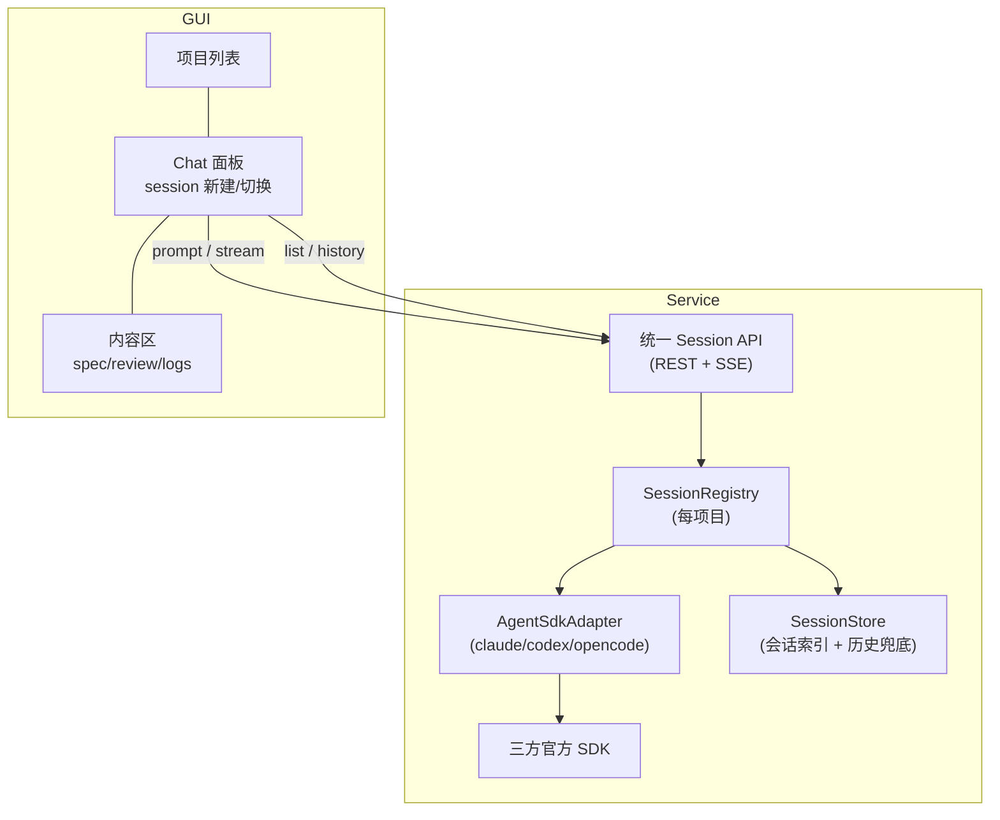

### 4.2 T1：统一 Agent SDK 适配层

定义一个规范化接口，把「新建会话 / 恢复会话 / 发送并流式接收 / 取消 / 列表 / 读历史」抽象为统一契约；三方 SDK 各实现一个 adapter。流式事件统一为规范化事件（会话建立/文本增量/工具调用/工具结果/回合完成/错误），复用现有 EventsHub 推送。

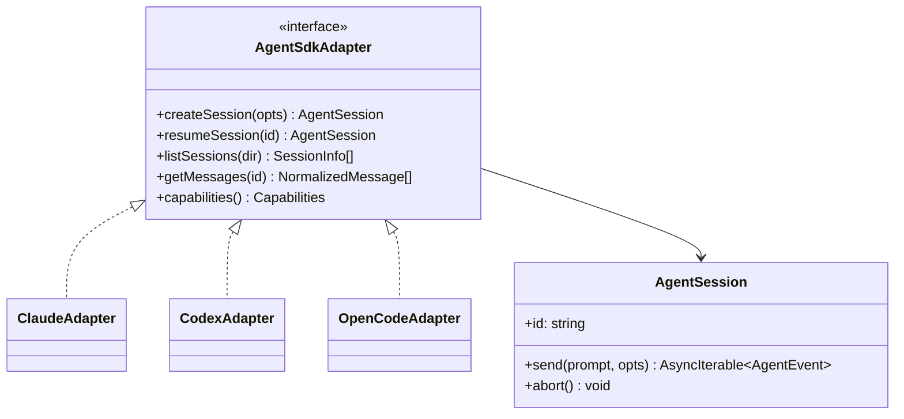

精确层：接口契约与三方映射要点

- 规范化事件 `AgentEvent`：`{type:'session-started', sessionId}` | `{type:'text', delta}` | `{type:'tool-use', name, input}` | `{type:'tool-result', text}` | `{type:'turn-completed', usage?}` | `{type:'error', message}`。
- 规范化消息 `NormalizedMessage`：`{role:'user'|'assistant', parts:[...], ts?}`。
- **ClaudeAdapter**：`send` → `query({prompt, options:{resume:id, cwd, permissionMode:'bypassPermissions', abortController}})`，映射 SDKMessage → AgentEvent；`listSessions/getMessages` 直接代理 SDK 同名函数。
- **CodexAdapter**：`createSession` → `codex.startThread({workingDirectory:cwd, skipGitRepoCheck:true})`；首个 `thread.started` 事件回填 `sessionId`；`resumeSession(id)` → `resumeThread(id)`；`send` → `runStreamed`；`listSessions/getMessages` **SDK 无原生支持**，直接读取 `~/.codex/sessions` 下的 session JSONL 并解析为 `NormalizedMessage[]`（不落自建历史）；`capabilities()` 报告 `getMessages:true`（经 JSONL 解析实现）。
- **OpenCodeAdapter**：项目级常驻 server（`createOpencode` 懒启动 + 端口分配 + 生命周期管理，见待确认 5.3）；`createSession`→`session.create`，`resumeSession`→按 id 复用，`send`→`session.prompt` + `event.subscribe` 过滤该 session，`getMessages`→`session.messages`。
- 建议目录：`src/service/agent-sdk/`：`types.ts`（接口/事件）、`claude-adapter.ts`、`codex-adapter.ts`、`opencode-adapter.ts`、`registry.ts`（按 `agent.kind` 选 adapter，每项目缓存）。
- `capabilities()` 暴露 `{listSessions:boolean, getMessages:boolean}`，供 API 层对不支持项做降级。

### 4.3 T1：统一 Session REST + SSE API

在现有路由体系新增以 session 为核心的端点；SSE 复用 EventsHub，新增主题 `project:{pid}:session:{sid}`。发送 prompt 为异步流式，沿用「返回 runId + SSE 增量」范式。

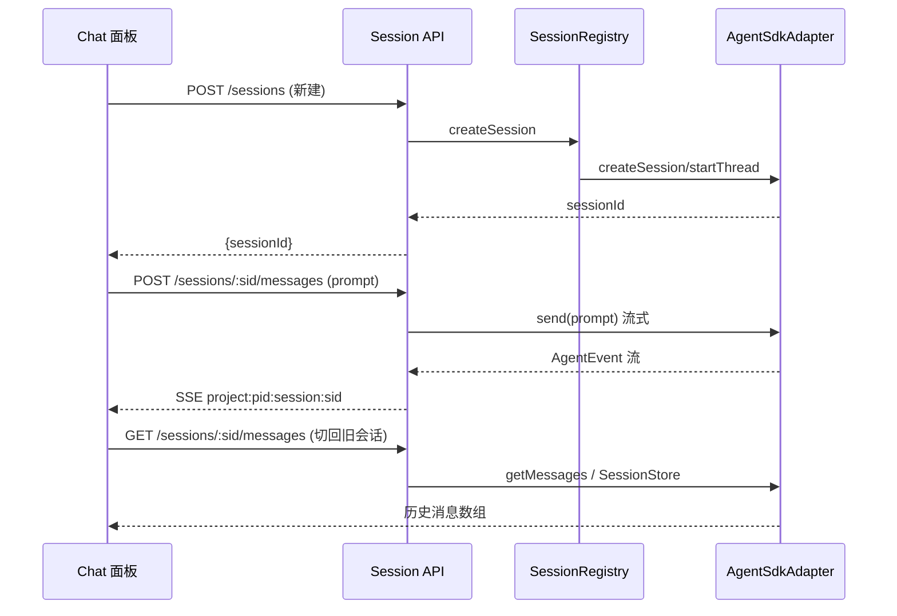

精确层：新增端点清单

- `POST /api/projects/:pid/sessions` — 新建会话（body `{title?, agentKind?}`）→ `{sessionId}`。
- `GET /api/projects/:pid/sessions` — 列出会话（SDK 支持则代理，否则读 SessionStore 索引）。
- `GET /api/projects/:pid/sessions/:sid/messages` — 拉取会话历史。
- `POST /api/projects/:pid/sessions/:sid/messages` — 发送 prompt，流式（→ `{runId}`，增量走 SSE）。
- `POST /api/projects/:pid/sessions/:sid/abort` — 取消当前回合。
- SSE 新增主题 `project:{pid}:session:{sid}`，事件 `session-msg`（含规范化增量）；`lib/sse.ts` 增 `subscribeSession(pid, sid, handlers)`，`lib/api.ts` 增对应方法。

### 4.4 T1：会话索引与历史兜底（SessionStore）

为统一「列表」体验，新增项目级 `SessionStore`：仅维护会话索引（id、title、agent kind、创建/更新时间），落盘位置沿用 `.yorz/tmp/` 约定（`.yorz/tmp/sessions/index.json`）。历史读取全部委派给 adapter：Claude/OpenCode 用 SDK 原生历史 API，Codex 由 CodexAdapter 直接解析 `~/.codex/sessions` 的 session JSONL（决策 5.2），`SessionStore` 不再承担历史兜底职责。

### 4.5 T2：GUI 三列可折叠可调宽布局

`AppShell` 由两列改为三列：项目列表 / Chat 面板 / 内容区。三列均可折叠 + 拖拽调宽，状态持久化到 localStorage（沿用 `ProjectsSidebar` 既有模式）。内容区承载现有路由页（spec 列表、review、执行记录等）。

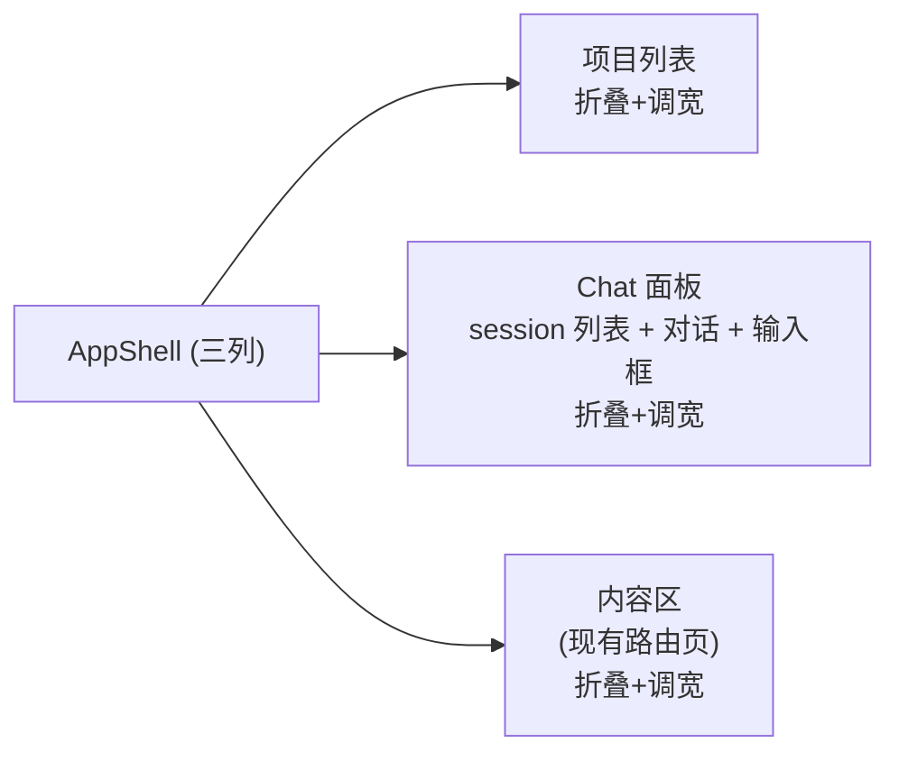

精确层：布局实现选型

- 三列容器：可用 shadcn-solid `Resizable`（Kobalte `@kobalte/core` Splitter）统一实现折叠 + 调宽（需 `npx shadcn-solid add resizable`），或复用 `ProjectsSidebar` 手写拖拽模式（见待确认 5.4）。
- 内容区（第三列）继续用 `@solidjs/router` 的 `props.children` 渲染现有页面；项目列表由 `ProjectsSidebar` 迁入第一列。
- 折叠/宽度 localStorage key：`yorz.layout.col1|col2|col3.{collapsed,width}`。
- 截图布局：Header 顶部通栏；下方三列；Chat 列内部为「上：session 会话记录（滚动）+ 下：输入框」的上下结构。

### 4.6 T3：Chat 面板 session 新建/切换与历史回填

Chat 面板内含 session 列表（新建按钮 + 可切换列表）、对话记录区、输入框。新建调用 `POST /sessions`；切换旧 session 调用 `GET /sessions/:sid/messages` 回填历史，并订阅该 session 的 SSE 增量；发送走 `POST /sessions/:sid/messages`。持久化依赖对应 Agent（SDK 磁盘持久化 + SessionStore 索引）。

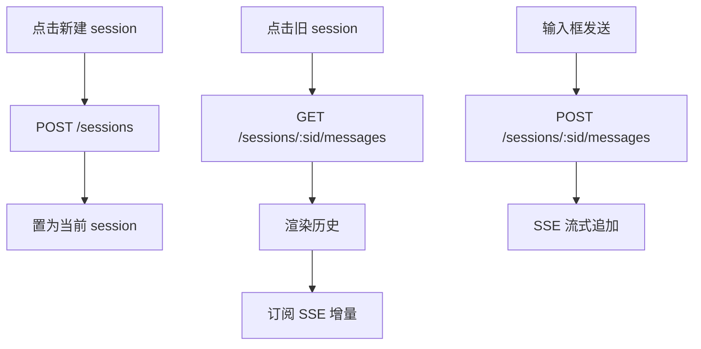

### 4.7 兼容性与影响范围

本次为跨端大重构。红=breaking（被替换/移除），黄=affected（需改造但接口延续）。

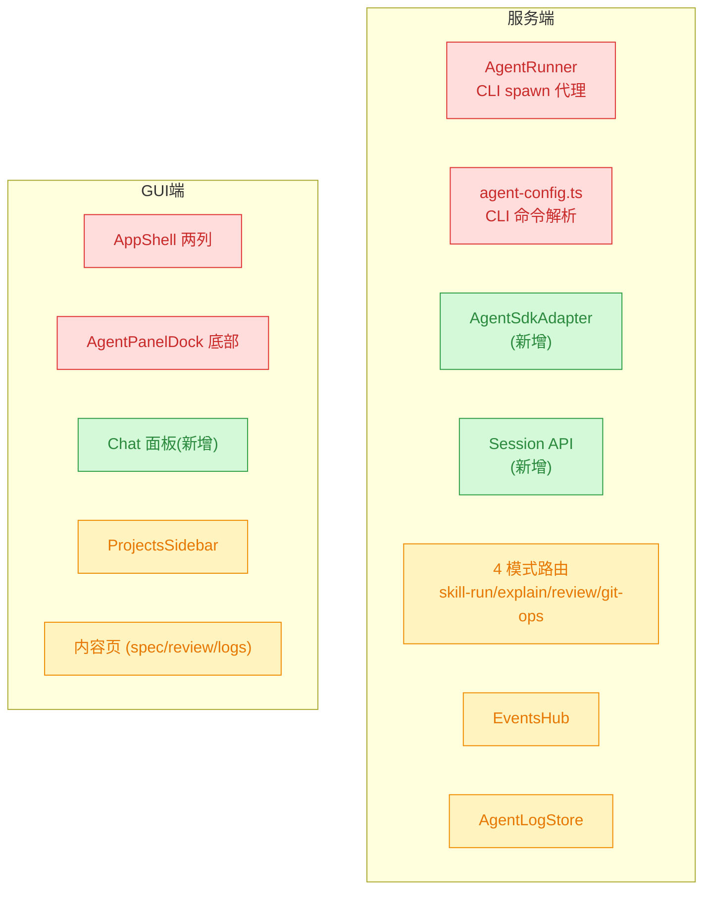

精确层：变更影响清单

- **breaking**：`AgentRunner` 的 CLI spawn 路径**完全移除**、无 `custom` 兜底（决策 5.5），`agent.ts` 大幅精简为 SDK 适配层驱动；`agent-config.ts` 的 CLI 命令解析（`resolveAgentCmd`/三种内建命令）随之删除，`agent.kind` 仅用于选 adapter；`AppShell` 两列结构改三列；`AgentPanelDock` 移除（决策 5.1，4 模式收敛为 session 内「系统发起回合」）。
- **affected（接口延续、内部改造）**：4 模式路由（skill-run/explain/review/git-ops 改为在 session 上跑「系统发起回合」，进入对话历史，决策 5.1）；`EventsHub`（新增 session 主题）；`AgentLogStore`（复用为回合日志）；`ProjectsSidebar`（迁入第一列）；内容页（适配第三列容器宽度）。
- **stable（纯新增）**：`src/service/agent-sdk/*`、`SessionStore`、Session API 路由、GUI Chat 面板与 `lib` 中 session 客户端方法。

### 4.8 破坏性切换落地设计（决策 5.1 选项 1 + 5.2）

用户已敲定：4 模式收敛为「per-spec 专属 session 内的系统发起回合」，并移除 `/runs`、`AgentPanelDock`、执行日志界面；以 SDK session 取代 CLI 调用；worktree 项目内在各自 session 执行 spec，合并冲突时在主项目新建 spec 并以 session 运行。

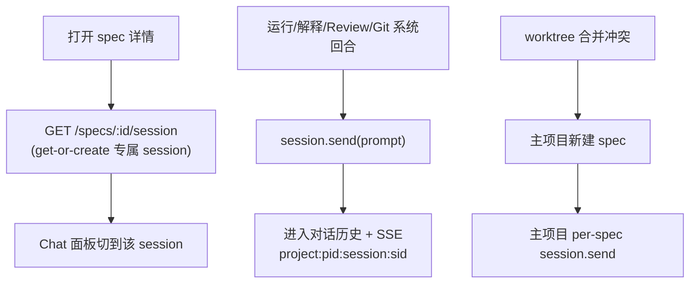

精确层：per-spec session、端点与移除清单

- **Per-spec 专属 session**：`SessionManager` 新增 `sessionForSpec(specId)`——按 specId 懒建并复用一个专属 session，映射持久化于 `SessionStore` 索引（新增 `specId` 字段）。原 4 模式（skill-run/explain/review/git-ops）全部改为「系统发起回合」：向该 spec 专属 session `send(prompt)`，输出进入对话历史并经 `project:{pid}:session:{sid}` SSE 推送。
- **GUI 联动**：新增 `GET /projects/:pid/specs/:id/session`（get-or-create 返回 sessionId）；打开 spec 详情时 Chat 面板经共享信号自动切到该 session；spec 详情页保留精简「运行中」指示灯，不再有独立任务卡片。
- **移除项（决策 5.1/5.2）**：
  - 服务端：`AgentRunner`（`agent.ts` spawn/CLI 全路径）；`AgentLogStore` 与 `/agent-logs` 路由（AgentRunner 移除后无写入方，成死代码）；`events.ts` 的 `/runs`、`/runs/:runId/cancel`；`EventsHub.attachRun` 与 `attachSpec` 的 agent-stdout/exit/error 分支及 `run:` 主题；`ProjectInstance.runner` / `agentLogs` 字段。
  - GUI：`AgentPanelDock`、`agent-tasks` store（及其测试）、`SpecAgentLogs` 页面与路由、`sse.ts` 的 `subscribeRun/fetchActiveRuns/cancelRun/ActiveRunInfo` 与 `subscribeSpec` 的 agent-stdout 分支、`AppShell.hydrateFromActiveRuns`。
- **Worktree 冲突触发（决策 5.2）**：`server.ts` 的 `triggerConflictAgent` 由 `main.runner.run(...)` 改为在主项目对应 spec 专属 session 上 `send(...)`。
- `agent-config.ts` 的 `resolveAgentCmd/BUILTIN` 仅保留给 `test:agent` 开发 harness（`runner.ts`）；Service 运行时不再引用。

## 5. 待确认问题

_暂无_

## 6. 任务清单

- [x] 安装三方 SDK 依赖 @anthropic-ai/claude-agent-sdk、@openai/codex-sdk、@opencode-ai/sdk 到 dependencies（验收：pnpm install 成功，package.json 含三项）
- [x] 新建 src/service/agent-sdk/types.ts 定义 AgentSdkAdapter/AgentSession 接口、AgentEvent/NormalizedMessage/Capabilities 类型（验收：tsc --noEmit 通过，导出被 registry 引用）
- [x] 新建 src/service/agent-sdk/claude-adapter.ts：query 映射 SDKMessage→AgentEvent，代理 listSessions/getMessages（验收：实现 AgentSdkAdapter 接口，tsc 通过）
- [x] 新建 src/service/agent-sdk/codex-adapter.ts：startThread/resumeThread/runStreamed，getMessages 直读 ~/.codex/sessions JSONL 解析（验收：实现接口，capabilities.getMessages=true，tsc 通过）
- [x] 新建 src/service/agent-sdk/opencode-adapter.ts：每项目懒启动 createOpencode server + 端口分配 + 生命周期清理，session.create/prompt/messages/abort（验收：实现接口，tsc 通过）
- [x] 新建 src/service/agent-sdk/registry.ts：按 agent.kind 选 adapter 并每项目缓存（验收：无 custom 兜底分支，tsc 通过）
- [x] 新建 src/service/session-store.ts：项目级会话索引落盘 .yorz/tmp/sessions/index.json（create/list/updateTitle/touch）（验收：单测或 tsc 通过，仅索引不含历史）
- [x] 新增 src/service/agent-config.ts 的 resolveAgentKind(cwd) 供 Service 选 adapter；保留 resolveAgentCmd/BUILTIN 仅供独立的 test:agent 开发harness（runner.ts）使用，Service 运行时不再引用（验收：Service 侧 grep resolveAgentCmd 无残留，harness 仍编译，tsc 通过）
- [x] SessionManager 新增 sessionForSpec(specId) 懒建并复用 spec 专属 session，SessionStore 索引记录 specId→sessionId 映射（验收：同 specId 多次调用返回同一 sessionId，tsc 通过）
- [x] 新增 GET /projects/:pid/specs/:id/session 端点 get-or-create 返回专属 sessionId（验收：路由注册，返回 {sessionId, kind}，tsc 通过）
- [x] 移除 AgentRunner：删除 src/service/agent.ts 的 spawn/CLI 全路径与类，project-registry 不再构造 runner、ProjectInstance 去掉 runner 字段（验收：grep child_process/AgentRunner 无残留，tsc 通过）
- [x] 移除死代码 AgentLogStore：删除 agent-log-store.ts、routes/agent-logs.ts、server.ts 注册、project-registry 构造与 ProjectInstance.agentLogs 字段及相关测试（验收：grep AgentLogStore/agent-logs 无残留，tsc 通过）
- [x] project-registry.ts 为每项目构造 adapter registry + SessionStore（替代/并存于 AgentRunner 构造处）（验收：materialize 挂载 session 能力，tsc 通过）
- [x] EventsHub 新增 session 主题 project:{pid}:session:{sid} 与 session-msg 事件（验收：publish/subscribe 支持新主题，tsc 通过）
- [x] 新建 src/service/routes/sessions.ts：POST/GET /sessions、GET/POST /sessions/:sid/messages、POST /sessions/:sid/abort，SSE 推 AgentEvent（验收：路由注册进 app，tsc 通过）
- [x] specs.ts 系统回合（create-draft/run/appends autoRun/explain）改为向 spec 专属 session send，移除 p.runner.run（验收：specs.ts grep runner 无残留，tsc 通过）
- [x] spec-review.ts（review 与 git commit/discard/stash 的 agent 触发）改为向 spec 专属 session send，移除 p.runner.run（验收：spec-review.ts grep runner 无残留，tsc 通过）
- [x] server.ts worktree triggerConflictAgent 改为在主项目 spec 专属 session 发起回合，移除 main.runner.run（验收：grep runner 无残留，tsc 通过）
- [x] events.ts 移除 /runs 与 /runs/:runId/cancel；EventsHub 移除 attachRun 及 attachSpec 的 agent-stdout/exit/error 分支与 run: 主题（验收：grep attachRun/runner.active 无残留，tsc 通过）
- [x] 移除 GUI AgentPanelDock.tsx 及 AppShell 挂载与 hydrateFromActiveRuns（验收：grep AgentPanelDock 无残留，gui build 通过）
- [x] 移除 GUI agent-tasks.ts 及其测试、sse.ts 的 subscribeRun/fetchActiveRuns/cancelRun/ActiveRunInfo 与 subscribeSpec 的 agent-stdout 分支（验收：grep agent-tasks/subscribeRun 无残留，gui build 通过）
- [x] 移除 SpecAgentLogs 页面与 main.tsx 路由及 SpecDetail 的 agent-logs 链接（验收：grep SpecAgentLogs 无残留，gui build 通过）
- [x] SpecDetail.tsx 改造：运行/解释按钮改为向 spec 专属 session 发起回合并令 Chat 切到该 session，移除 agentTasks/subscribeSpec-agent-stdout，保留精简运行指示灯（验收：gui build 通过）
- [x] SpecReview.tsx 改造：review/git 操作改为 spec 专属 session 回合，移除 agentTasks（验收：gui build 通过）
- [x] NewSpec.tsx 改造：draft 创建流程改为临时 session 回合，移除 agentTasks（验收：gui build 通过）
- [x] ChatPanel 支持打开 spec 详情时经共享信号自动切到该 spec 专属 session（验收：打开 spec，Chat 选中对应 session，gui build 通过）
- [x] lib/api.ts 新增 getSpecSession(pid, id) 客户端方法对齐后端端点（验收：类型对齐，gui build 通过）
- [x] 三列折叠/调宽实现（决策 5.4 shadcn Resizable 因 @kobalte/core 无 Splitter 且本环境无法联网安装，改用该决策自带的备选项 2「复用 ProjectsSidebar 手写 rAF 拖拽」，效果一致）（验收：ChatPanel 拖拽调宽 + 折叠生效）
- [x] 重构 AppShell.tsx 为三列布局：项目列表/Chat/内容区，均可折叠+调宽（col2 localStorage key yorz.layout.col2.{collapsed,width}；col1 沿用 ProjectsSidebar 既有 key）（验收：三列渲染，gui build 通过）
- [x] ProjectsSidebar 保持第一列、内容区路由页保持第三列 main（验收：现有路由页在第三列正常渲染，build 通过）
- [x] lib/api.ts 新增 session 客户端方法：createSession/listSessions/getSessionMessages/sendSessionMessage/abortSession（验收：类型对齐后端契约，gui build 通过）
- [x] lib/sse.ts 新增 subscribeSession(pid, sid, handlers) 订阅 session 主题（验收：SseMultiplex 支持 session-msg 事件）
- [x] 新建 Chat 面板组件（session 列表+新建按钮+对话记录区+输入框）：新建 POST /sessions、切换 GET messages 回填、发送 POST messages + SSE 流式追加（验收：代码级三流程接通；浏览器实测需 live agent 凭证，见下）
- [ ] [manual] 浏览器实测：打开 spec 触发运行→Chat 显示系统回合流式输出；worktree 合并冲突→主项目新建 spec 并运行（需 claude/codex/opencode 已登录凭证）（验收：人工在浏览器确认）
- [x] 破坏性切换后重跑 vite build ×2 + vitest run 并记录结果（验收：CLI/GUI build 通过，测试结果记录）

## 7. 执行记录

- 任务1：`pnpm add` 安装 @anthropic-ai/claude-agent-sdk@0.3.207、@openai/codex-sdk@0.144.1、@opencode-ai/sdk@1.17.18 至 dependencies。验证：pnpm 输出三项均 added，退出码 0。
- 任务2-7：新建 `src/service/agent-sdk/`（types.ts 契约、claude/codex/opencode 三 adapter、registry.ts）与 `src/service/session-store.ts`。Codex getMessages 直读 `~/.codex/sessions/**/rollout-*.jsonl`（按 session_meta.cwd 过滤、response_item.message 解析）；OpenCode 懒启动 `createOpencode` server 并在 dispose 时 close。验证：`npx tsc --noEmit` 中 agent-sdk/session-store 相关 0 error（其余 14 error 为既有 GUI `@/lib/cn` 别名问题，非本次引入）。
- 任务8/10/11/12：新增 `session-manager.ts`（桥接 adapter 事件流→runId+EventsHub 模型，含 codex 迟到 sessionId 的 reconcile）；`agent-config.ts` 新增 `resolveAgentKind`（保留 `resolveAgentCmd` 供 test:agent harness）；`project-registry.ts` 每项目挂载 `SessionManager`+`SessionStore` 并在 close 时 dispose；`events-hub.ts` 新增 `project:{pid}:session:{sid}` 主题（session-msg 事件）；`routes/sessions.ts` 5 端点注册进 server。验证：`npx tsc --noEmit` 非 GUI 侧 0 error。此批为**纯新增**，旧 AgentRunner 仍在位，应用未破坏。
- 任务排期说明：为保持每步可编译/可运行，将后端破坏性切换（任务9 精简 agent.ts、任务13 四模式收敛）推迟到 GUI Chat 面板（消费新 session API，纯新增）落地之后再执行，最后统一移除 AgentRunner/AgentPanelDock。
- 任务15-20：GUI 三列布局落地——`ChatPanel.tsx`（session 列表/新建/历史回填/输入发送/流式追加/中止，含 rAF 拖拽调宽+折叠，localStorage `yorz.layout.col2.*`）插入 `AppShell` 第二列（ProjectsSidebar 保持第一列、路由 main 保持第三列，dock 暂留）；`lib/api.ts`+`lib/sse.ts` 增 session 客户端方法与 `subscribeSession`。决策 5.4 的 shadcn Resizable 因 @kobalte/core 无 Splitter 且本环境无法联网安装，采用该问题备选项 2（手写拖拽）替代，效果等价。验证：`vite build`（CLI）与 `vite build --config vite.gui.config.ts`（GUI）均通过；`vitest run` 286/288（2 失败为既有 `agent-tasks` i18n 语言不匹配，git 确认相关文件未被本次改动）。
- 收尾（变更重开）：T1 统一 Agent SDK 适配层 + Session REST/SSE、T2 三列可折叠可调宽、T3 Chat 面板均已落地且 build/test 通过，与既有 AgentRunner 流程并存（应用未破坏）。剩余任务 9/13/14（移除 AgentRunner、四模式收敛、移除 dock）为高影响面破坏性切换，其 session 映射与连带 GUI 改造范围存在未定设计（见 ## 待确认问题 5.1/5.2），按 execute「新疑问→写回待确认+变更重开」约定，将 stage 切回 plan 等待用户批注后再实施；且该切换需在具备 agent 登录凭证的环境下浏览器实测（任务清单 [manual] 项）。
- 消费批注（tasks）：用户答复 5.1 选项 1（per-spec 专属 session + 移除 dock/agent-tasks/runs/subscribe agent-stdout）与 5.2（移除 /runs、AgentPanelDock、执行日志界面；SDK session 取代 CLI；worktree 冲突→主项目新建 spec 并以 session 运行）。据此新增 4.8 破坏性切换落地设计，待确认问题清空为 _暂无_，删除 ## 用户批注，并将原任务 9/13/14 重排为 16 个可执行子任务，进入 execute。
- 后端切换（execute）：`SessionInfo` 增 `specId`，`SessionStore.getBySpec/create(specId)`、`SessionManager.sessionForSpec(specId)` 懒建复用 spec 专属 session；新增 `GET /specs/:id/session`。specs.ts（draft/run/appends/explain）、spec-review.ts（review/git）、server.ts worktree 冲突触发均改为 `sessions.send`；GitOpsAction 类型下沉到 spec-review.ts。events.ts 删 `/runs`+`/cancel`，EventsHub 删 `attachRun` 与 `attachSpec` 的 agent-stdout/exit/error 分支及 `run:` 主题。删除 `agent.ts`/`agent-log-store.ts`/`routes/agent-logs.ts` 及其单测，`project-registry` 去掉 runner/agentLogs。`service.test.ts` 移除 6 个 runner/agent-stdout/`/runs` 耦合用例与 `fakeAgent` 脚手架。验证：`npx tsc --noEmit` 非 GUI 侧 0 error。
- 前端切换（execute）：`project.ts` 新增跨组件 `requestChatSession`/`requestedChatSessionId` 信号；ChatPanel 监听后自动切到目标 session 并展开。SpecDetail 打开时 `getSpecSession` 定位 spec 专属 session 并令 Chat 切换，运行/解释/追加改为 session 回合、精简运行指示灯由 session `turn-completed/error` 驱动，移除 agent-logs 链接与 `?runId=` handoff。SpecReview 用 `trackRound` 订阅 spec session 驱动运行态与 review 刷新；NewSpec draft 改为切到 draft session + 订阅 error。删除 `agent-tasks.ts`(+测试)/`AgentPanelDock.tsx`/`SpecAgentLogs.tsx`、AppShell dock+hydrate、main.tsx 日志路由；`api.ts` 增 `getSpecSession`、各触发端点返回 `sessionId`、删 agent-logs 方法与类型；`sse.ts` 删 run 订阅并瘦身 `subscribeSpec`。验证：`vite build`（CLI 1.54MB）+ `vite build`（GUI）均通过；`vitest run` 260/260 全绿。fake-claude fixture 仍被 appends-route/spec-review 两测试引用（校验路由契约），保留。
- 收尾：所有非 `[manual]` 任务完成，`## 待确认问题` 为 _暂无_、无 `！！！` 批注、无 `[open]`；`[manual]` 浏览器实测需 live agent 凭证环境，按 done 判定忽略。将 stage 置为 done。
