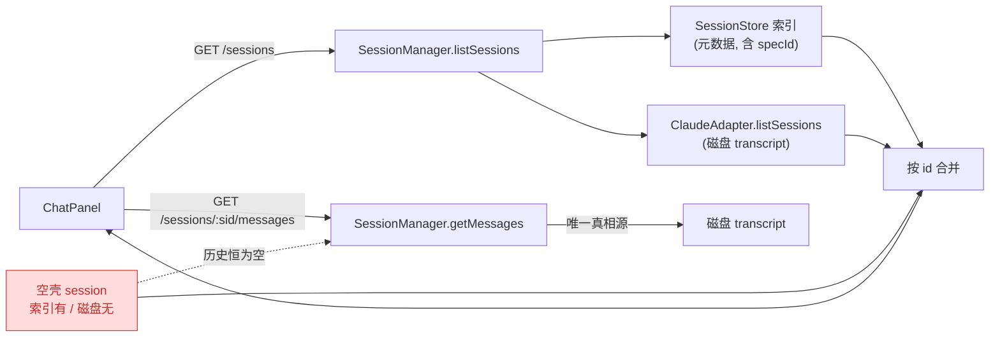
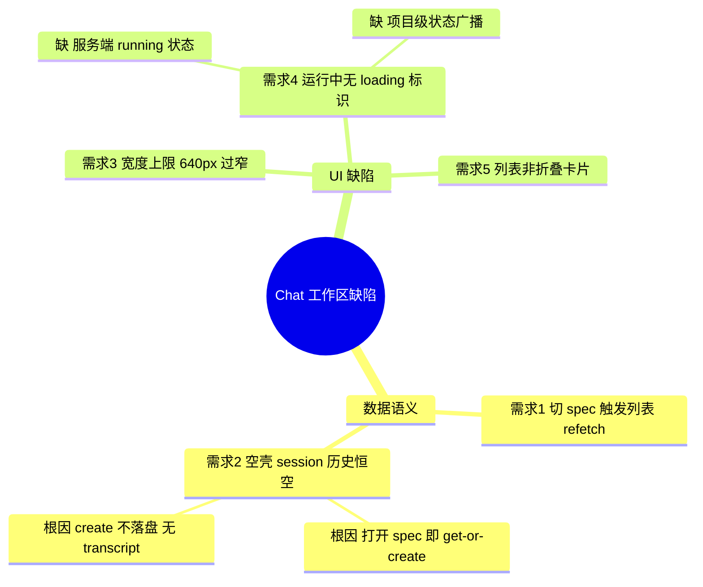
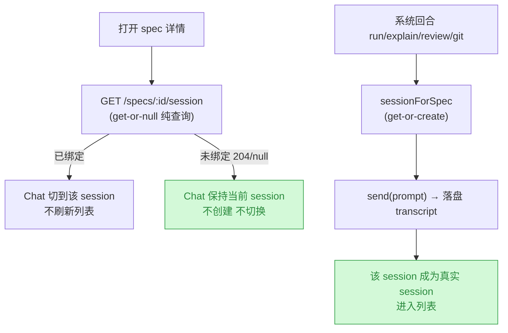
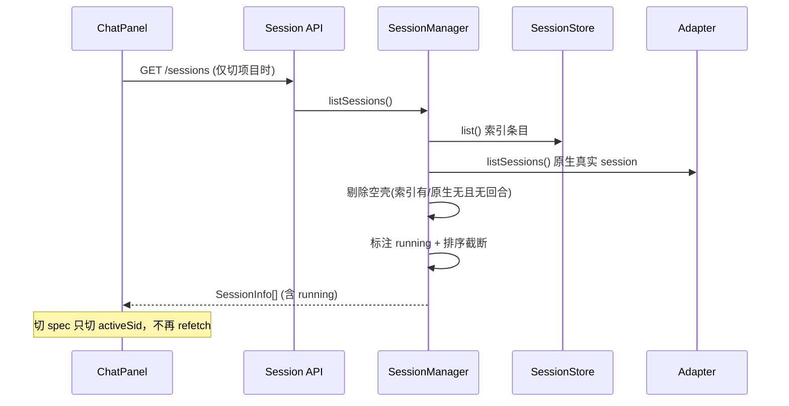
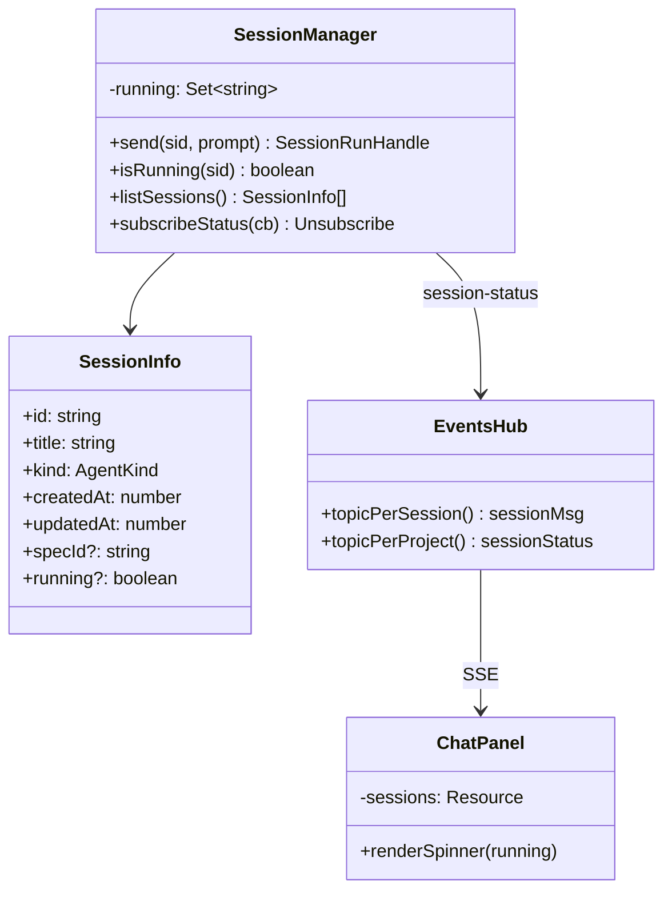
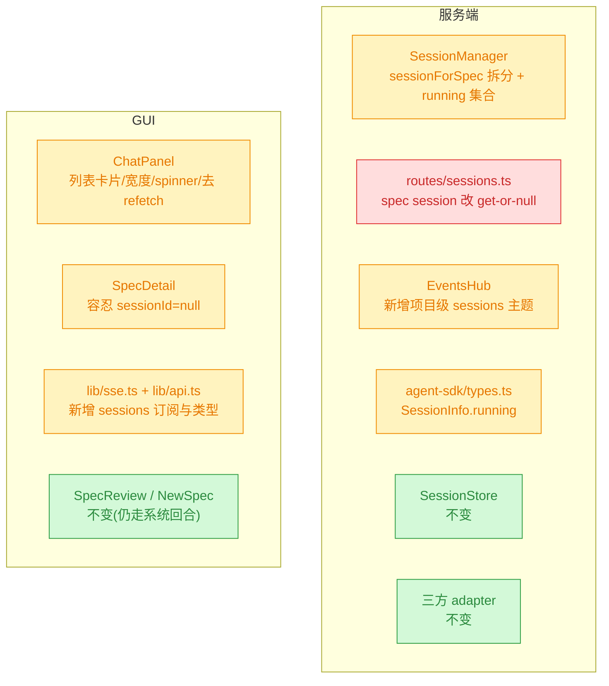

# 260713.fix.chat-session-panel-fixes

## 1. 背景

`.yorz/specs/260712.refct.agent-sdk-chat-workspace/spec.md` 已落地「Agent SDK 统一适配层 + 三列 Chat 工作区」。实际使用中暴露出 5 个缺陷，集中在 GUI `ChatPanel` 与服务端 session 索引/列表语义上。

## 2. 需求

1. 切换 spec 时不应刷新 chat session 列表：session 是**项目级别共用**的，部分 session 本就无法关联到某个 spec。
2. 点击 session 列表切换激活 session 时，部分 session 加载不到历史消息。例如点击 `260710.feat.append-dialog-preserve-content` 触发的两个 messages 接口均返回空数组：
   - `/api/projects/yorz-6f1f9f/sessions/005f92db-4ebd-419b-a362-6558f4bf0887/messages`
   - `/api/projects/yorz-6f1f9f/sessions/62e772c8-ac45-4796-a05f-330000f41293/messages`
3. Chat 框宽度上限太窄，应可自由调宽，最大到视口 80%。
4. session 列表中「执行中」的 session 前需要 loading 执行标识。
5. session 列表容器应做成可展开 / 折叠的卡片样式。

## 3. 现状分析

### 3.1 当前 session 数据流与两个真相源

session 列表由**两个源合并**：`SessionStore` 索引（YorZ 自建，仅元数据）+ adapter 原生列举（Claude SDK 扫 `~/.claude/projects/<cwd-slug>/*.jsonl`）。历史消息则**只有一个源**：adapter 原生读取磁盘 transcript。索引里存在、但磁盘上没有 transcript 的条目，即成为「空壳 session」——列表可见、点开永远空白。

精确层：空壳 session 的产生链路与实测证据

产生链路：

1. `SpecDetail.tsx:82-93` — 打开任意 spec 详情页的 `createEffect` 无条件调用 `api.getSpecSession(pid, id)`。
2. `routes/sessions.ts:47-58` — `GET /projects/:pid/specs/:id/session` 直接调 `sessions.sessionForSpec(specId)`，**get-or-create 语义**。
3. `session-manager.ts:68-72` — `sessionForSpec()` 未命中即 `createSession(undefined, specId, specId)`。
4. `session-manager.ts:54-60` + `claude-adapter.ts:119-121` — `ClaudeAdapter.createSession()` 只 `new ClaudeSession(randomUUID(), ...)`，**不接触 SDK、不落盘**；随后 `store.create()` 把这个自造 UUID 写入索引。
5. 若用户只是「看了一眼 spec」而没有发起任何回合，磁盘上就永远不存在该 UUID 的 transcript。

实测证据（本机 `~/.claude/projects/-Users-fenghen-my-space-YorZ/`）：

- 索引条目 `1bfdfe8d…`、`e38586e8…`、`2b4bbb4f…`（`updatedAt > createdAt`，跑过回合）→ 磁盘 **HIT**，`getSessionMessages()` 返回 14 条 entries。说明 Claude SDK **确实接受** `options.sessionId` 自定义 id（`claude-adapter.ts:71`），id 语义没问题。
- 索引条目 `8a93240c…`、`005f92db…`、`62e772c8…`（`createdAt === updatedAt`，从未跑过回合）→ 磁盘 **MISS**，`getSessionMessages()` 不抛错、返回 `[]`。**正是需求 2 报的两个 id。**
- `listSessions({dir: cwd})` 本机返回 **209** 条原生 session；`SessionManager.listSessions()` 全量合并后不截断、不分页（`session-manager.ts:74-92`）。

其余缺陷的精确落点：

- 需求 1：`ChatPanel.tsx:73-82` 的 `requestedChatSessionId` effect 内调用 `refetchSessions()`——切 spec → `requestChatSession()` → 列表整体重拉。列表本身只依赖 `activeProjectId`（`ChatPanel.tsx:67-70`），与 spec 无关，这次 refetch 是多余的。
- 需求 3：`ChatPanel.tsx:18-25` `MIN_WIDTH=260 / MAX_WIDTH=640 / DEFAULT=340`，`clampWidth()` 硬上限 640px。
- 需求 4：`SessionManager` 无任何「运行中」状态——`send()`（`session-manager.ts:112-146`）只在闭包内跑，不登记 in-flight 集合；`SessionInfo`（`agent-sdk/types.ts`）无 `running` 字段；EventsHub 只有 per-session 主题 `project:{pid}:session:{sid}`（`events-hub.ts:261,321-323`），**没有项目级 session 状态广播主题**，列表无从得知别的 session 正在跑。
- 需求 5：`ChatPanel.tsx:255-275` session 列表是裸 `<ul class="max-h-40 overflow-y-auto border-b">`，无卡片、无折叠；`components/ui/` 已有 `card.tsx` 与 `collapsible.tsx` 可直接复用。

### 3.2 五个缺陷的归因分层

需求 1/2 是**同一处设计错位**的两个症状：per-spec 专属 session 被设计成「打开 spec 就 get-or-create」，既污染了项目级列表（塞进永不产生历史的空壳），又让 Chat 把 spec 切换当成了列表刷新信号。需求 3/4/5 是 ChatPanel 的独立 UI 缺陷。

## 4. 技术实现方案

> **已定案决策（来自用户批注）：**
>
> 1. **保留 spec ↔ session 绑定，但改为懒创建**（4.1）：`GET /specs/:id/session` 降级为 get-or-null，系统回合才 get-or-create。
> 2. **列表只显示最近 30 条 + 卡片内滚动**（4.2）：不做搜索 / 虚拟滚动。
> 3. **服务端 running 集合 + 新增项目级 SSE 主题 `project:{pid}:sessions`**（4.3）：不轮询、不前端推断。

### 4.1 核心决策：session 懒创建 —— 只有真正跑过回合的 session 才进列表

把「spec ↔ session 绑定」从**打开即创建**改为**发起回合时才创建**。`GET /specs/:id/session` 降级为**纯查询**（get-or-null），spec 详情页只在已存在绑定时让 Chat 切过去；系统回合（run / explain / review / git-ops / append）触发时才走 get-or-create。索引里既有的空壳条目由列表侧自愈过滤。

精确层：懒创建改造点

- `session-manager.ts` — 拆分 `sessionForSpec(specId)` 为两个方法：`findSessionForSpec(specId)`（纯查，返回 `SessionInfo | null`）与 `ensureSessionForSpec(specId)`（保留现 get-or-create 语义，供系统回合调用）。
- `routes/sessions.ts:47-58` — `GET /projects/:pid/specs/:id/session` 改调 `findSessionForSpec`，未绑定时返回 `{ sessionId: null }`（200），不再造 session。
- `specs.ts` / `spec-review.ts` / `server.ts`（worktree 冲突触发）中的系统回合入口改调 `ensureSessionForSpec`——语义不变，仍 get-or-create。
- `SpecDetail.tsx:82-93` — `getSpecSession` 返回 `sessionId: null` 时不调用 `requestChatSession()`。
- 兼容既有索引：`SessionManager.listSessions()` 过滤「有 `specId` 且从未跑过回合」的条目（判据见 4.2），无需迁移脚本，也不删用户数据。

### 4.2 列表语义修正：过滤空壳 + 不随 spec 刷新

`listSessions()` 合并索引与原生列表时，剔除「索引有、adapter 侧无历史」的空壳条目；GUI 侧移除 `requestedChatSessionId` effect 里的 `refetchSessions()`，列表只在「切项目 / 新建 session / 回合结束」时刷新。

精确层：空壳判据与列表策略

- 空壳判据（二选一，取交集更安全）：① 索引条目的 id 不在 adapter 原生 `listSessions()` 结果中；② 索引条目 `createdAt === updatedAt`（`touch()` 只在 `send()` 的 finally 调用，跑过回合必然 `updatedAt > createdAt`）。对 `capabilities().listSessions === false` 的 adapter（codex/opencode 视实现）退化为只用判据 ②。
- `ChatPanel.tsx:73-82` — 删除 effect 内的 `void refetchSessions()`；保留「若折叠则展开 + 设 activeSid」。
- 列表刷新时机：`createResource` 依赖 `activeProjectId`（切项目）、`newSession()` 后、以及 session `turn-completed` 后（新 session 首轮跑完需要进列表）。
- 列表规模（定案）：`listSessions()` 按 `updatedAt` 倒序后**截断为最近 30 条**（常量 `SESSION_LIST_LIMIT = 30`），卡片内 `overflow-y-auto` 滚动；不做搜索框与虚拟滚动。当前激活 session 若被截断掉，仍以 `activeSid` 保持可用（历史照常加载），只是不出现在列表里。

### 4.3 运行中标识：服务端 running 状态 + 项目级广播

`SessionManager` 登记 in-flight session 集合，`GET /sessions` 的每个 `SessionInfo` 带上 `running: boolean` 作为初始态；回合开始/结束时经**新增的项目级 SSE 主题** `project:{pid}:sessions` 推 `session-status` 事件，列表实时点亮/熄灭 loading 图标（`lucide-solid` 的 `Loader2` + `animate-spin`）。

精确层：running 状态实现要点

- `session-manager.ts` — 新增 `private readonly running = new Set<string>()` 与 `private readonly statusEmitter = new EventEmitter()`；`send()` 起始 `running.add(sid)` + emit `{sessionId, running:true}`，`finally` 中 `running.delete(sid)` + emit `false`；`reconcile()` 时同步搬迁 running 条目。新增 `isRunning(sid)`、`subscribeStatus(cb)`。
- `agent-sdk/types.ts` — `SessionInfo` 增可选 `running?: boolean`（仅列表响应态，不落盘索引）。
- `events-hub.ts` — 主题解析新增 `sessions`（项目级，无 sid）分支，转发 `session-status` 事件；`sse.ts` 新增 `subscribeSessions(pid, handlers)`。
- `ChatPanel.tsx` — 列表项前置 `<Loader2 class="h-3.5 w-3.5 animate-spin" />`（running 时），并以 `session-status` 事件驱动本地 running Map；`turn-completed` 时顺带 `refetchSessions()` 让新 session 进列表。

### 4.4 宽度上限与折叠卡片列表

宽度：`MAX_WIDTH` 由常量 640 改为**运行时按视口计算的 80%**（`Math.round(window.innerWidth * 0.8)`），并在 `resize` 事件时重新 clamp，SSR/无 window 时回退固定值。列表容器：改用 `Card` + `Collapsible` 组合，标题栏显示「会话（N）」+ 展开/折叠 chevron + 新建按钮，折叠态记忆到 localStorage。

精确层：UI 改造要点

- `ChatPanel.tsx:18-25` — `MAX_WIDTH` 常量 → `maxWidth()` 函数：`typeof window === 'undefined' ? 960 : Math.max(MIN_WIDTH, Math.round(window.innerWidth * 0.8))`；`clampWidth()` 改用之；新增 `window.addEventListener('resize', …)` 在窗口变窄时重新 clamp 并持久化。
- 折叠卡片：复用 `components/ui/card.tsx` + `components/ui/collapsible.tsx`（Kobalte）；localStorage key `yorz.chat.sessionList.collapsed`；列表区最大高度提到 `max-h-64` 并保留 `overflow-y-auto`。
- 列表项结构：`[running spinner?] [kind badge] [title] [相对时间]`，激活项高亮沿用现有 `bg-background font-semibold`。

### 4.5 兼容性与影响范围

无数据库/协议破坏性变更；`GET /specs/:id/session` 的**响应语义**由「必返 sessionId」变为「可能返回 null」，属受影响接口（GUI 同仓库内同步改造）。既有索引中的空壳条目保留在磁盘、仅在列表侧被过滤，不做删除。

## 5. 待确认问题

暂无

## 6. 任务清单

- [x] `src/service/session-manager.ts`：把 `sessionForSpec()` 拆为 `findSessionForSpec(specId)`（纯查，返回 `{sessionId,kind} | null`）与 `ensureSessionForSpec(specId)`（保留 get-or-create），删除旧 `sessionForSpec`（验收：`grep -rn "sessionForSpec" src/` 仅剩 find/ensure 两个新名字）
- [x] `src/service/routes/sessions.ts:47-58`：`GET /projects/:pid/specs/:id/session` 改调 `findSessionForSpec`，未绑定时返回 `{ sessionId: null, kind: null }`（200，不再造 session）（验收：对没跑过回合的 spec 请求该端点，`.yorz/tmp/sessions/index.json` 条目数不变）
- [x] `src/service/routes/specs.ts:174,190,221`、`src/service/routes/spec-review.ts:39,65`、`src/service/server.ts:39` 的系统回合入口改调 `ensureSessionForSpec`（验收：`tsc --noEmit` 通过，语义仍为 get-or-create）
- [x] `src/service/agent-sdk/types.ts`：`SessionInfo` 新增可选 `running?: boolean`（仅列表响应态，不落盘索引）（验收：`tsc --noEmit` 通过，`SessionStore.create()` 不写入该字段）
- [x] `src/service/session-manager.ts`：`listSessions()` 过滤空壳条目（索引条目不在 adapter 原生列表中、且 `createdAt === updatedAt`），并按 `updatedAt` 倒序截断为最近 30 条常量 `SESSION_LIST_LIMIT`（验收：新增单测覆盖「空壳被剔除 / 跑过回合的保留 / 超 30 条被截断」）
- [x] `src/service/session-manager.ts`：新增 `private running = new Set<string>()` 与状态 emitter，`send()` 起始 add + emit `{sessionId, running:true}`、`finally` delete + emit `false`，`reconcile()` 同步搬迁 running 条目；导出 `isRunning(sid)`、`subscribeStatus(cb)`；`listSessions()` 给每条带上 `running`（验收：单测断言 send 期间 `isRunning()` 为 true、done 后为 false）
- [x] `src/service/events-hub.ts`：`attachTopic` 新增项目级 `sessions` 分支（`project:{pid}:sessions`），转发 `session-status` 事件（验收：新增单测订阅该主题并收到 ready + session-status 帧）
- [x] `src/gui/src/lib/sse.ts`：新增 `subscribeSessions(pid, handlers)` 与 `SessionStatusEvent` 类型（验收：`tsc --noEmit` 通过）
- [x] `src/gui/src/lib/api.ts`：`SessionInfo` 增 `running?: boolean`，`getSpecSession` 返回类型改为 `{ sessionId: string | null; kind: AgentKind | null }`（验收：`tsc --noEmit` 通过）
- [x] `src/gui/src/pages/SpecDetail.tsx:82-93`：`getSpecSession` 返回 `sessionId: null` 时不调用 `requestChatSession()`、不设 `specSid`（验收：打开从未跑过回合的 spec，Chat 不切换、索引不新增条目）
- [x] `src/gui/src/components/ChatPanel.tsx:73-82`：删除 `requestedChatSessionId` effect 内的 `void refetchSessions()`（验收：切 spec 时 Network 面板不再出现 `GET /sessions`）
- [x] `src/gui/src/components/ChatPanel.tsx:18-25`：`MAX_WIDTH` 常量改为 `maxWidth()` 运行时函数（视口 80%，无 window 时回退 960），`clampWidth()` 改用之，并监听 `resize` 重新 clamp + 持久化（验收：拖宽 Chat 可达视口 80%，缩窄窗口后宽度自动回收）
- [x] `src/gui/src/components/ChatPanel.tsx`：session 列表项前置 running spinner（`Loader2` + `animate-spin`），由 `subscribeSessions` 的 `session-status` 事件驱动本地 running Map，初始态取列表响应的 `running` 字段；`turn-completed` 后 `refetchSessions()`（验收：另一 session 跑回合时其列表项出现 spinner，结束后消失）
- [x] `src/gui/src/components/ChatPanel.tsx:255-275`：裸 `<ul>` 列表改为 `Card` + `Collapsible` 折叠卡片，标题栏「会话（N）」+ chevron + 新建按钮，折叠态持久化到 localStorage key `yorz.chat.sessionList.collapsed`，列表区 `max-h-64 overflow-y-auto`（验收：点击标题栏可折叠/展开，刷新后保持）
- [ ] 运行 `pnpm test` 与 `pnpm build`（验收：测试全绿、构建无 TS 报错）——**阻塞于待确认问题 5.1**：`pnpm build` 已通过；`pnpm test` 267/268，唯一失败为既有 flaky 测试（干净基线上亦可复现，与本 spec 无关）

## 7. 执行记录

- 服务端懒创建：`session-manager.ts` 拆出 `findSessionForSpec`（纯查）/ `ensureSessionForSpec`（get-or-create）；`routes/sessions.ts` 的 `GET /specs/:id/session` 改为纯查、未绑定返回 `{sessionId: null, kind: null}`；`specs.ts`(×3)、`spec-review.ts`(×2)、`server.ts`(×1) 六处系统回合入口改调 `ensureSessionForSpec`。验证：`grep -rn "SessionForSpec"` 无旧名残留。
- 列表语义：`listSessions()` 剔除空壳（原生列表无该 id 且 `createdAt === updatedAt` 且不在 running 中），按 `updatedAt` 倒序截断到 `SESSION_LIST_LIMIT = 30`，并给每条带上 `running`。返回类型收敛为 `SessionInfo[]`。
- running 状态：`SessionManager` 新增 `running: Set<string>` + `statusEmitter`，`send()` 起始/`finally` 两端置位并广播；`reconcile()` 在 id 改写时搬迁 running（codex 首轮才拿到真 id 的场景）；新增 `isRunning()` / `subscribeStatus()`。`EventsHub` 新增项目级主题 `project:{pid}:sessions` 转发 `session-status`，并同步更新 `routes/events.ts` 的主题清单注释。
- GUI：`sse.ts` 新增 `subscribeSessions()`；`api.ts` 的 `SessionInfo` 增 `running?`、`getSpecSession` 返回类型改为可空；`SpecDetail.tsx` 在 `sessionId: null` 时不再请求切换 Chat；`ChatPanel.tsx` 删除切 spec 时的 `refetchSessions()`、宽度上限改为视口 80%（含 `resize` 重 clamp）、列表项加 `Loader2` spinner（SSE 驱动 + 列表响应初始态）、列表容器改为 `Card` + `Collapsible` 折叠卡片（折叠态持久化）。
- 测试：新增 `src/service/__tests__/session-manager.test.ts`（6 条：空壳剔除 / 有 transcript 的保留 / 截断 30 / find 不建 session / ensure 复用 / running 双边广播）；`service.test.ts` 新增 2 条（spec session 探针返回 null 且不落索引、项目级 sessions 主题 ready）。全部新增测试通过。
- 验证结果：`pnpm build` 通过；`pnpm test` 267 passed / 1 failed。唯一失败项为既有 flaky 测试 `spec topic pushes updated event`——已用对照实验证明其在**干净基线**（本 spec 改动全部 stash）+ 任一引入 SDK 重依赖链的测试文件下同样失败，与本 spec 无关。已作为待确认问题 5.1 写回，按变更重开流程切回 plan 等待决策。
