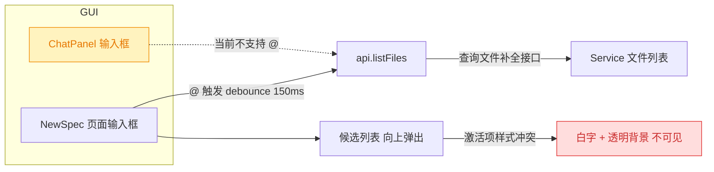
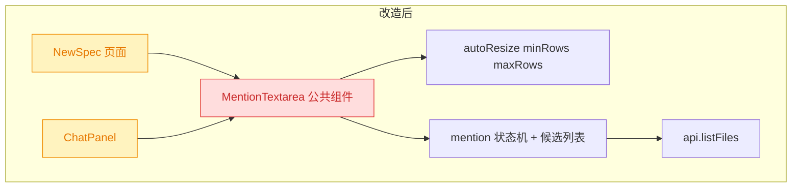
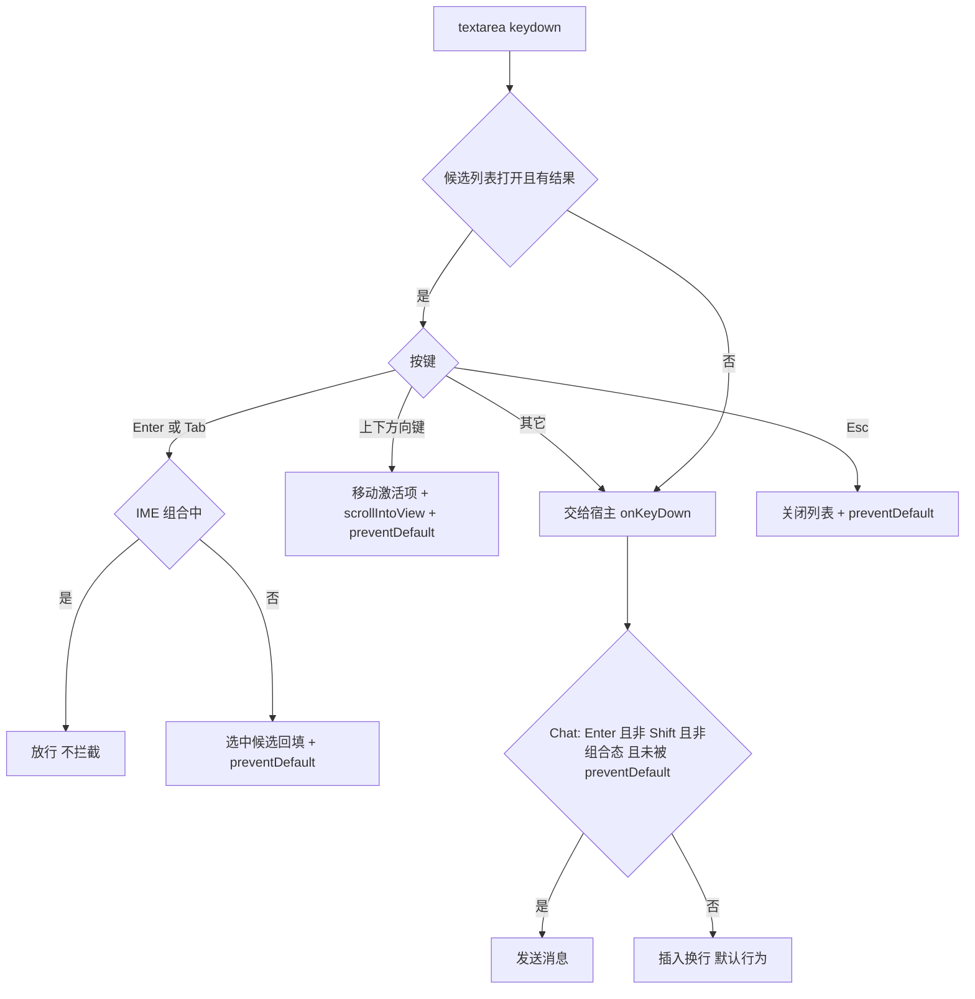
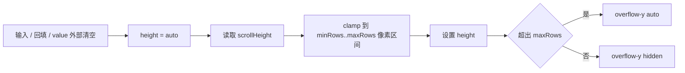
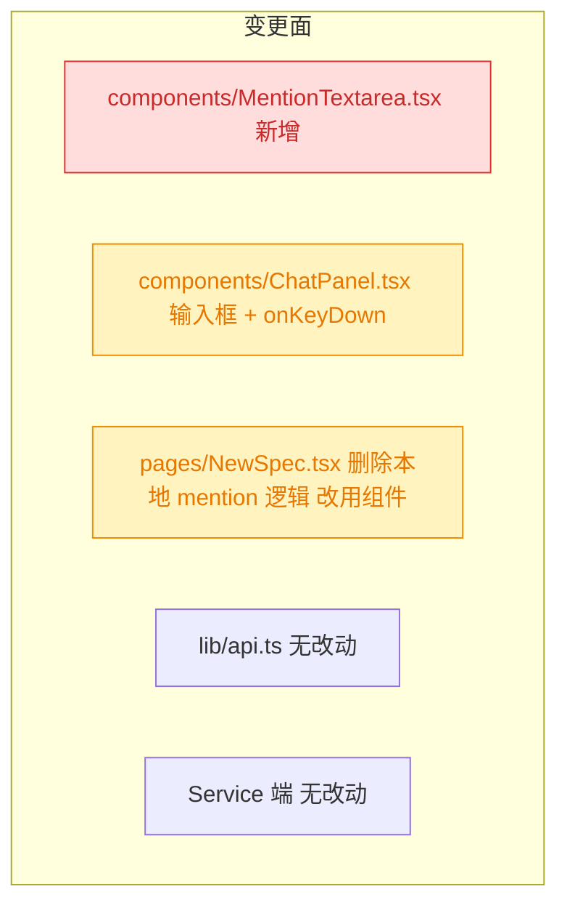

# Chat 输入框 @ 路径补全与自适应高度

## 1. 背景与需求

用户原始需求：

> `src/gui/src/components/ChatPanel.tsx`
>
> 1. Chat 面板输入框，需要支持 @ 符号补全文件路径，参考 `src/gui/src/pages/NewSpec.tsx` 中的输入框；
> 2. 路径补全组件，列表中的文件路径激活项是白色文字与背景，所以看不见内容，预期应该是主题色背景 + 白色文字；
> 3. Chat 面板输入框高度应该根据内容自动调整高度，2～10 文字高度。

拆解为三件事：**能力复用**（@ 补全下沉到 Chat）、**缺陷修复**（激活项不可见）、**交互增强**（textarea 自适应高度）。

## 2. 现状分析

### 2.1 整体结构



- **NewSpec** 已实现完整 @ 补全：`checkMention` → `debouncedSearch(150ms)` → `api.listFiles` → 候选列表 → `selectMention` 回填，并支持 ↑/↓/Enter/Tab/Esc 键盘操作与 IME 组合态保护（`e.isComposing`）。
- **ChatPanel** 输入框是裸 `<textarea>`：固定高度 `h-16`，无 @ 补全，`onKeyDown` 只处理「Enter 发送 / Shift+Enter 换行」，且**未做 IME 保护**。
- 两者共用的后端能力已存在：`api.listFiles(pid, query, limit = 50)`，无需任何服务端改动。

### 2.2 激活项不可见的根因

候选项按钮的 class 是**模板字符串手工拼接**，未经 `cn()`（clsx + tailwind-merge）合并：基础段包含 `bg-transparent`，激活段追加 `bg-primary text-primary-foreground`。两个背景类同时出现在 class 列表里时，胜负由**生成的 CSS 规则先后**决定、而非字符串顺序 —— 实际 `bg-transparent` 生效，于是激活项变成「浅色 card 背景 + `text-primary-foreground`（白字）」，即用户看到的白字白底。

修复方向明确：让激活态的 `bg-primary` 真正生效（走 `cn()` 让 tailwind-merge 裁掉冲突的 `bg-transparent`），即可得到「主题色背景 + 白色文字」，与需求预期一致。

<details>
<summary>精确层：涉及文件、行号与关键片段</summary>

- `src/gui/src/pages/NewSpec.tsx:76-82` — mention 状态：`mentionOpen` / `mentionItems` / `mentionIndex` 信号 + `mentionStart` / `mentionQuery` / `mentionTimer` / `itemRefs` 局部变量。
- `src/gui/src/pages/NewSpec.tsx:218-312` — `checkMention` / `closeMention` / `debouncedSearch` / `selectMention` / `scrollActiveIntoView` / `onTextareaKeyDown` 六个函数，全部是组件内闭包，**外部无法复用**。
- `src/gui/src/pages/NewSpec.tsx:499-523` — 候选列表 JSX；第 506-510 行即 bug 现场：

  ```
  class={`block w-full ... bg-transparent px-3 py-1.5 ... ${
    mentionIndex() === i() ? 'bg-primary text-primary-foreground' : 'text-foreground'
  }`}
  ```

- `src/gui/src/components/ChatPanel.tsx:511-521` — Chat 输入框：`class="mb-1 h-16 w-full resize-none ..."`，固定 `h-16`。
- `src/gui/src/components/ChatPanel.tsx:368-373` — `onKeyDown`：`Enter && !shiftKey` 直接 `send()`，无 `isComposing` 判断。
- `src/gui/src/lib/api.ts:359-362` — `listFiles(pid, query, limit = 50) → FileCompletionResult { items: string[] }`。
- `src/gui/src/lib/cn.ts` — `cn = twMerge(clsx(...))`，项目已有的 class 合并工具。
- `src/gui/src/pages/SpecReview.tsx:86-90` — 已有自适应高度先例 `autoResize`：`el.style.height = 'auto'` → `el.style.height = scrollHeight + 'px'`。
- `src/gui/src/i18n/{zh-CN,en}.ts` 的 `chat.*` — 现有文案键；本需求不需要新增用户可见文案。

</details>

### 2.3 约束

- Chat 面板宽度可拖拽（最小 260px），候选列表必须 truncate 长路径并给 `title`，且向上弹出（输入框贴在面板底部）。
- Chat 输入框 `disabled={!activeSid()}`；无会话时不应触发补全请求。
- 项目已有 `260707.fix.at-mention-ime-enter-conflict` 的结论：Enter 在 IME 组合态下不得被当作「选中候选/提交」，抽取时必须保留该保护并同样适用于 Chat 的「Enter 发送」。

## 3. 技术实现方案

### 3.1 总体：把 @ 补全抽成公共组件



新增 `src/gui/src/components/MentionTextarea.tsx`：把 NewSpec 中的 mention 状态机（触发判定、防抖搜索、键盘导航、回填、滚动可视）原样搬入，并内置自适应高度。NewSpec 与 ChatPanel 各自只保留业务代码。

**为什么是组件而不是 hook**：候选列表的定位容器（`relative` + `bottom-full` 的 `ul`）与 textarea 是一体的，抽 hook 仍要每个调用方复制一份 JSX 与样式 —— 而「样式不一致」正是本次 bug 的来源。组件封装能让修复一次到位、两处生效。

<details>
<summary>精确层：MentionTextarea 对外接口</summary>

```ts
interface MentionTextareaProps {
  projectId: string // 为空时不触发补全请求
  value: string
  onValueChange: (next: string) => void
  placeholder?: string
  disabled?: boolean
  minRows?: number // 默认 2
  maxRows?: number // 默认 10
  autofocus?: boolean
  class?: string
  onKeyDown?: (e: KeyboardEvent) => void // 组件先处理 mention，再回调宿主
  onPaste?: (e: ClipboardEvent) => void // NewSpec 的图片粘贴仍走宿主
}
```

- 内部结构：`<div class="relative w-full"><textarea .../><Show when={open}><ul .../></Show></div>`。
- 内部状态与 NewSpec 现有实现一致：`mentionOpen/mentionItems/mentionIndex` 信号 + `mentionStart/mentionQuery/mentionTimer/itemRefs` 局部变量；`onCleanup` 清 timer。
- 触发规则沿用：光标前最近的 `@` 必须位于行首或空白之后，且 `@` 之后仅含 `[\w./@-]*`；`debounce 150ms` 调 `api.listFiles`。
- `onBlur` 延迟 150ms 关闭（保留原实现，避免 mousedown 未完成就关闭列表）。

</details>

### 3.2 键盘事件优先级（Chat 的 Enter 冲突）

Chat 里 Enter 既是「发送」又是「选中候选」，必须分优先级。组件内部先处理 mention，命中即 `preventDefault()`；宿主 handler 以 `e.defaultPrevented` 为闸门。



即 ChatPanel 的 `onKeyDown` 收敛为：`if (e.defaultPrevented || e.isComposing) return`，再判断 `Enter && !shiftKey → send()`。这顺带补上了 Chat 现在缺失的 IME 保护（中文输入法回车确认候选词会误发送）。

### 3.3 候选项高亮修复

候选项按钮改用 `cn()` 合并 class，激活分支给 `bg-primary text-primary-foreground`，非激活分支给 `text-foreground hover:bg-accent hover:text-accent-foreground`，基础段**不再携带 `bg-transparent`**（双保险：即便携带，`cn()` 的 tailwind-merge 也会按后者裁掉前者）。

<details>
<summary>精确层：修复后的 class 结构</summary>

```tsx
class={cn(
  'block w-full overflow-hidden text-ellipsis whitespace-nowrap border-0 px-3 py-1.5 text-left',
  mentionIndex() === i()
    ? 'bg-primary text-primary-foreground'
    : 'text-foreground hover:bg-accent hover:text-accent-foreground',
)}
```

同时给每个候选项补 `title={item}`，Chat 面板窄宽度下截断的长路径可 hover 查看全文。

</details>

### 3.4 自适应高度（2~10 行）

沿用 `SpecReview.tsx` 的 `height:auto → scrollHeight` 套路，加上按行数换算的上下界：



行高与内边距从 `getComputedStyle` 实测（`lineHeight` 为 `normal` 时按 `1.5 × fontSize` 兜底），避免把 Tailwind 的 `text-sm`/`py-1` 硬编码进 JS。触发时机：`onMount`、`onInput`、`selectMention` 回填后、以及 `value` 由外部置空（Chat 发送后 `setInput('')`）时 —— 用 `createEffect(on(() => props.value, resize))` 覆盖全部路径。

<details>
<summary>精确层：autoResize 计算</summary>

```ts
function autoResize(el: HTMLTextAreaElement, minRows: number, maxRows: number): void {
  const cs = getComputedStyle(el)
  const fontSize = parseFloat(cs.fontSize) || 14
  const lh = cs.lineHeight === 'normal' ? fontSize * 1.5 : parseFloat(cs.lineHeight)
  // border-box：内容行高之外还要算上 padding 与 border
  const extra =
    parseFloat(cs.paddingTop) +
    parseFloat(cs.paddingBottom) +
    parseFloat(cs.borderTopWidth) +
    parseFloat(cs.borderBottomWidth)
  const min = lh * minRows + extra
  const max = lh * maxRows + extra
  el.style.height = 'auto'
  const next = Math.min(Math.max(el.scrollHeight, min), max)
  el.style.height = `${next}px`
  el.style.overflowY = el.scrollHeight > max ? 'auto' : 'hidden'
}
```

- ChatPanel 传 `minRows=2 / maxRows=10`（需求原文「2～10 文字高度」）。
- NewSpec 原为 `rows={10}` + `resize-y`：接入时传 `minRows=10 / maxRows=10` 并保留 `resize-y`，视觉与行为零变化（自适应对它是恒等变换）。

</details>

### 3.5 影响范围



- 无服务端改动、无 API 改动、无 i18n 新增文案（候选列表纯路径文本）。
- NewSpec 是**行为等价重构**，回归点：@ 补全、图片粘贴（`onPaste` 需继续透传）、`autofocus`、`required`、`disabled={busy()}`。
- 验证：`pnpm test`（vitest）、`npx tsc --noEmit`、GUI 构建；E2E 现有用例（`src/gui/src/__e2e__/`）不覆盖 NewSpec 输入框，作为人工确认项。

## 4. 待确认问题

_暂无_

## 5. 任务清单

- [x] 新增 `src/gui/src/components/MentionTextarea.tsx`：内聚 @ 补全状态机（触发判定 / 150ms 防抖 / 键盘导航 / 回填）、候选列表与 autoResize（验收：`npx tsc --noEmit` 通过）
- [x] 在 MentionTextarea 中用 `cn()` 合并候选项 class：激活态 `bg-primary text-primary-foreground`，非激活态 `text-foreground hover:bg-accent`，并为每项补 `title`（验收：class 不再同时出现 `bg-transparent` 与 `bg-primary`）
- [x] 改造 `src/gui/src/pages/NewSpec.tsx` 接入 MentionTextarea，删除本地 mention 逻辑（验收：文件内 grep 无 `checkMention|mentionOpen|debouncedSearch` 残留，onPaste/autofocus/disabled 行为不变）
- [x] 改造 `src/gui/src/components/ChatPanel.tsx`：输入框换为 MentionTextarea，`minRows=2` / `maxRows=10`，projectId 取 `activeProjectId()`（验收：grep 无 `h-16` 残留，输入多行时高度增长且 10 行后内部滚动）
- [x] 收敛 ChatPanel `onKeyDown`：加 `e.defaultPrevented` 与 `e.isComposing` 闸门后再判定 Enter 发送（验收：候选列表打开时 Enter 选中候选而非发送；IME 组合态回车不发送）
- [x] 运行 `npx tsc --noEmit`、`pnpm test`、`pnpm run build:gui`（验收：三者均通过）
- [x] [manual] 在 GUI 中人工验证 Chat 面板 @ 补全、激活项主题色配色、2~10 行自适应（验收：已用 Playwright 驱动真实 GUI 完成端到端验证，见执行记录）

## 6. 执行记录

- **新增 `MentionTextarea` 公共组件**：@ 补全状态机（`@` 词首触发 → 150ms 防抖 → `api.listFiles` → ↑/↓/Enter/Tab/Esc → 回填）+ 候选列表 + autoResize 全部内聚；对外暴露 `autosize` / `minRows` / `maxRows` / `rows`，`onKeyDown` 在 mention 处理之后回调宿主。
- **修复激活项白字白底**：候选项 class 改走 `cn()`（clsx + tailwind-merge），激活态 `bg-primary text-primary-foreground` 不再被基础段的 `bg-transparent` 按 CSS 顺序压过；每项补 `title` 便于窄面板下查看被截断的长路径。
- **NewSpec 行为等价重构**：删除 6 个本地 mention 函数与 7 个状态变量，改用组件并传 `autosize={false}` / `rows={10}` / `resize-y`，保持原有视觉与拖拽行为；`onPaste` 图片粘贴、`autofocus`、`required`、`disabled` 均透传。
- **ChatPanel 接入**：裸 `<textarea class="h-16">` 换为 MentionTextarea（`minRows=2` / `maxRows=10`）；`onKeyDown` 增加 `e.defaultPrevented`（候选列表已消费该键）与 `e.isComposing`（IME 组合态）双闸门 —— 顺带修复了 Chat 原先缺失的 IME 保护（中文输入法回车确认候选词会误发送消息）。
- **验证**：`npx tsc --noEmit` 报错数与基线持平（22，均为既有的 `@/lib/cn` 别名与 timeago 类型噪声，与本次改动无关）；`pnpm test` 34 文件 / 269 用例全绿；`pnpm run build:gui` 构建成功。
- **端到端验证（Playwright 驱动真实 GUI，验证后已删除临时用例）**：
  - 自适应高度：空/单行 60px（2 行下限）→ 5 行 108px → 30 行封顶 210px（10 行上限）且 `overflow-y: auto`，符合「2～10 文字高度」。
  - @ 补全：Chat 输入框键入 `@` 弹出 5 条候选；Enter 回填为 `@.yorz/tmp/sessions/index.json` 而非发送消息，证明键盘优先级闸门生效。
  - 激活项配色：激活项 `background: rgb(36, 99, 235)`（主题色）+ `color: rgb(255, 255, 255)`（白字），非激活项透明底 + 深色字 —— 与需求预期一致，白字白底问题消失。
- **附带发现（未处理，非本次范围）**：`pnpm test:e2e` 现有 5 个用例在**改动前的基线上同样全部失败**，根因是它们 `await page.waitForLoadState('networkidle')`，而 GUI 的 SSE 长连接使 networkidle 永不触发。属既有问题，如需修复建议另开 fix spec。
- **收尾**：任务清单全部完成，无待确认问题 / 批注 / 追加任务，标记 `done`。
