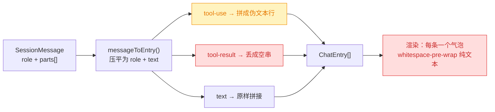
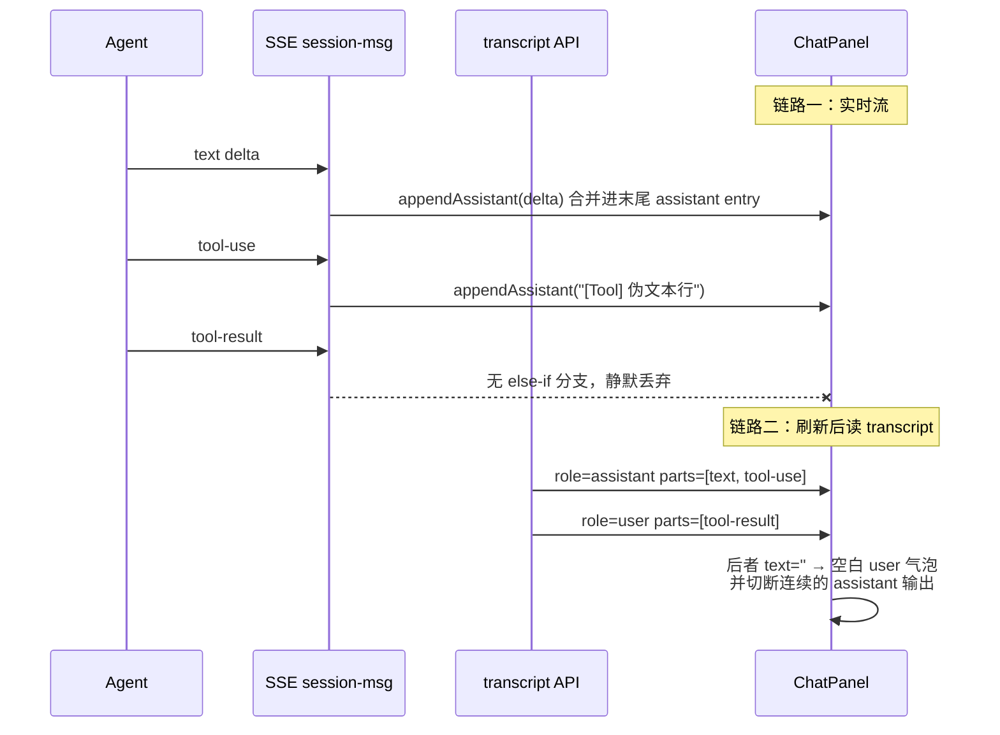
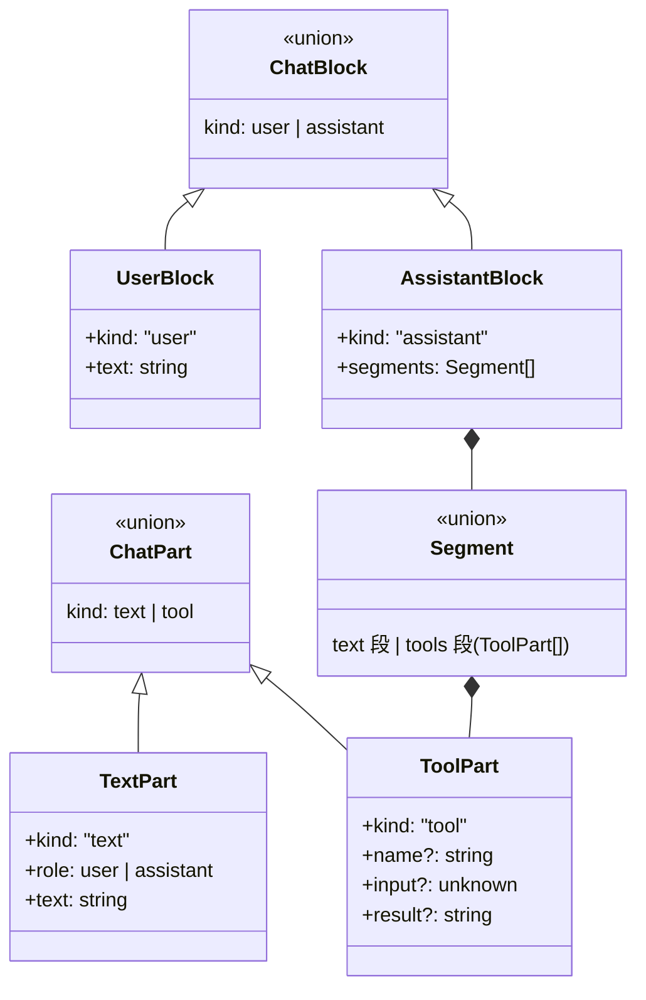
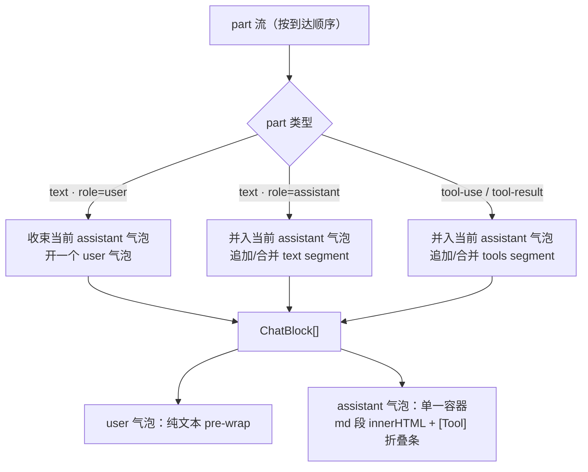
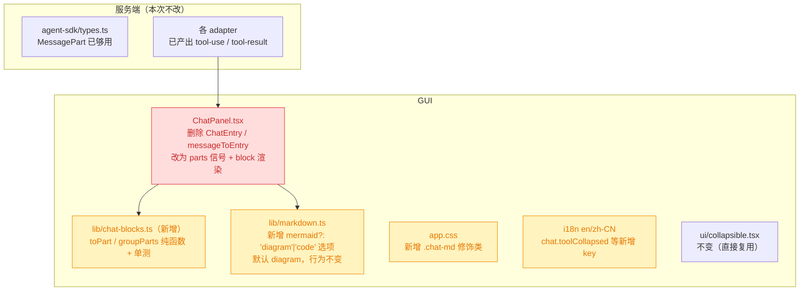

# 260714.feat.chat-markdown-and-tool-collapse

## 1. 背景

`.yorz/specs/260712.refct.agent-sdk-chat-workspace` 落地了三列 Chat 工作区，后续 `260713` / `260714.feat.chat-input-mention-autosize` 修复了 session 列表与输入框交互。当前 Chat 面板的**消息渲染**仍是最粗糙的一环：Agent 输出的 Markdown 以纯文本呈现，tool-use / tool-result 噪声消息与正文平铺混排，且每条 message 各自成一个气泡——实际上大段内容一直是同一个 Agent 在连续输出，割裂的气泡序列严重干扰阅读。

## 2. 需求

1. 使用 Markdown-it 渲染 Agent 输出内容。
2. 合并并折叠 `tool-use` / `tool-result` 类型消息，默认只展示用户与 Agent 的 `text` 内容。
   - 此类消息忽略 `role` 属性，连续的 tool 消息合并折叠为一个 `[Tool]` 块，点击可展开详细信息。
3. 按 `role` 合并连续消息：当前每条 message 都是一个独立气泡，而实际上一直是 Agent 在连续输出，造成视觉割裂。

参考：messages API 返回结构为 `[{ role: 'user' | 'assistant', parts: [{ type: 'text' | 'tool-use' | 'tool-result', text?, name?, input? }] }]`，其中 `tool-result` 以 `role: 'user'` 出现——因此「按 role 合并」必须先剥离 tool 类型消息，否则 tool-result 会把一段连续的 assistant 输出切成多段。

## 3. 现状分析

### 3.1 信息在入口处就被压平：`{ role, text }` 是一切问题的根

服务端的消息模型本来是**结构化**的：一条 `SessionMessage` 含多个 `MessagePart`（`text` / `tool-use` / `tool-result`）。但 GUI 在 `messageToEntry()` 里第一时间把它压成 `ChatEntry { role, text }` —— tool-use 被拼成一行伪文本、tool-result 直接丢成空串。渲染层拿到的已经是**一堆无结构的字符串**，于是既无从折叠 tool，也无从按语义合并气泡。



<details>
<summary>精确层：类型定义与压平代码</summary>

- `src/gui/src/lib/api.ts:142-151` — `MessagePart = { type:'text'; text } | { type:'tool-use'; name; input } | { type:'tool-result'; text }`；`SessionMessage = { role: 'user'|'assistant'; parts: MessagePart[]; ts? }`。服务端同构定义见 `src/service/agent-sdk/types.ts:6-21`。
- `src/gui/src/components/ChatPanel.tsx:81-95` — `interface ChatEntry { role; text }` 与 `messageToEntry()`：`tool-use` → `` `\n${t('chat.toolUse',{name})}\n` ``，`tool-result` → `''`。
- `src/gui/src/components/ChatPanel.tsx:655-665` — 渲染：`<For each={entries()}>` 每条一个 `div`，`whitespace-pre-wrap`，`e.role === 'user' ? bg-background : bg-muted`。**没有任何 markdown 渲染**。
- `src/service/agent-sdk/claude-adapter.ts:143-152` — 一条 message 的 `parts` **可以混装** text 与 tool-use；tool-result 以 `role: 'user'` 的独立 message 出现。故合并/折叠必须在 **part 粒度**做，message 粒度不够。

</details>

### 3.2 三个可见缺陷同源，且 live 与 transcript 两条链路结果不一致

需求描述的「气泡割裂」实测由三件事叠加而成，其中**空气泡**是纯 bug：一条只含 `tool-result` 的 `role: 'user'` message 被映射成 `text: ''` 的 entry，渲染出一个**空白气泡**——而且它 `role==='user'`，会把本属于同一段 Agent 输出的前后文强行切成两块，还染成不同底色。

更麻烦的是**两条入口链路行为不一致**：SSE 实时流里 `tool-use` 会被拼成文本、`tool-result` 事件**根本没有分支处理**（静默丢弃）；而刷新页面走 transcript 时，同样的 tool-result 又会变成空气泡。同一个会话，刷新前后长得不一样。



<details>
<summary>精确层：两条链路的缺陷位置</summary>

- `src/gui/src/components/ChatPanel.tsx:344-347` — SSE 分支只处理 `text` / `tool-use`；`SessionEvent` 明明定义了 `{ type:'tool-result'; text }`（`src/gui/src/lib/sse.ts:194-200`），此处**没有对应分支**。
- `src/gui/src/components/ChatPanel.tsx:405-413` — `appendAssistant()` 已经在做「同 role 连续合并」，但只作用于**流式 delta**，且它合并的是 assistant 一侧；从 transcript 加载的 entries（`:337`）完全不走这条路径，因此 transcript 侧没有任何合并。
- 空气泡：`messageToEntry()` 对全 tool-result 的 message 返回 `text: ''`，`:655` 的 `For` 不做空值过滤 → 渲染出带 padding 的空 `div`。

</details>

### 3.3 渲染栈已就位：markdown-it 已在仓库中，Chat 只是没用

无需引入新依赖。`markdown-it@14` + `highlight.js` + `markdown-it-task-lists` 已安装，并由 `src/gui/src/lib/markdown.ts` 封装成 `renderMarkdown(source, opts)`：已内置代码高亮、linkify、**受控 HTML 白名单**（仅放行 `details`/`summary` 与禁用态 task checkbox，其余原始 HTML 一律转义 → XSS 面已收敛）。`.markdown` 样式类也已在 `app.css` 定义。

唯一需要留意的是 **mermaid fence**：`renderMarkdown` 会把 ` ```mermaid ` 输出成 `<div class="mermaid" data-mermaid-source="...">`，真正画图靠调用方额外调 `renderMermaidIn(container)`。Chat 若直接复用而不挂这一步，mermaid 代码块会退化成**没有代码块样式的裸文本**——Agent 在写 spec 时恰恰经常输出 mermaid，这个 case 必然遇到。

<details>
<summary>精确层：现有渲染栈</summary>

- `src/gui/src/lib/markdown.ts:160-165` — `renderMarkdown(source, opts: { specId?, projectId? })`；不传 `specId` 时不做 `attachments/*` 重写，Chat 直接以 `renderMarkdown(text)` 调用即可。
- `src/gui/src/lib/markdown.ts:5-22` — `html: true` + `highlight()`（hljs）；`:24-52` — `sanitizeRawHtml()` 白名单转义，`html_block` / `html_inline` 两条 renderer rule 覆盖。
- `src/gui/src/lib/markdown.ts:147-156` — fence rule：`info === 'mermaid'` → 输出 `.mermaid` 占位 div（**不是**代码块）。
- `src/gui/src/lib/mermaid.ts:18` — `renderMermaidIn(container): Promise<RenderMermaidCleanup>`；`src/gui/src/pages/SpecDetail.tsx:14,15,304` 是现成用法（`innerHTML={renderMarkdown(...)}` + 容器级 mermaid 渲染）。
- `src/gui/src/app.css:97-` — `.markdown` 基础排版样式（`@layer base`）。
- 组件：`src/gui/src/components/ui/collapsible.tsx`（Kobalte）已存在，ChatPanel 已在 session 列表处使用（`ChatPanel.tsx:24`），`[Tool]` 折叠可直接复用。
- 依赖：`package.json:59` `markdown-it@^14.2.0`、`:75` `highlight.js@^11.11.1`、`:79` `markdown-it-task-lists@^2.1.1`。
- 测试：Chat 无单测；e2e 在 `src/gui/src/__e2e__/*.spec.ts`（playwright）。命令：`pnpm test`（vitest）、`pnpm test:e2e`、`pnpm build`。

</details>

## 4. 技术实现方案

### 4.1 核心：把 `ChatEntry` 换成「part 流 → block 分组」两层模型

不再在入口压平。GUI 保留结构化的 **part 流**（append-only），渲染前用一个纯函数分组成 **block**。live 与 transcript 两条链路都只负责把自己的输入翻译成同一种 part，从此行为一致。



**分组规则（`groupParts(parts): ChatBlock[]`，纯函数、可单测）：**

- **气泡边界只由「user 的 text part」切分**。这是需求 3 的正解：tool part 虽然 `tool-result` 在协议上顶着 `role: 'user'`，但语义上属于 Agent 的这一回合 —— 按需求「此类消息忽略 role」，它不参与气泡切分。
- 于是：两次用户发言之间的**一切**（assistant text + 所有 tool part）归入**同一个 assistant 气泡**，内部按顺序排成若干 segment：`[md 文本段] [Tool 折叠段] [md 文本段] …`。
- 连续的 tool part 合并进**同一个** `[Tool]` 折叠段（`tool-use` 与其后紧邻的 `tool-result` 尽量配对：result 挂到上一个未配对的 use 上，孤立 result 单独成项）。



### 4.2 两条入口统一翻译成 part

- **transcript**：`messages.flatMap(m => m.parts.map(p => toPart(m.role, p)))` —— tool-result 不再变空串、不再产出空气泡（顺带修掉 3.2 的 bug）。
- **SSE**：`text` delta 合并进末尾 assistant text part（沿用现有 `appendAssistant` 的合并语义）；`tool-use` / `tool-result` 各自 push 成 tool part（**补上现在缺失的 `tool-result` 分支**）；`error` 仍作为 assistant text 追加。
- `freshSids` / `starting` / `session-started` 换 id 等既有逻辑**完全不动**，只是操作对象从 `entries` 变成 `parts`。

### 4.3 Markdown 渲染：复用 `renderMarkdown`，流式节流

- **仅 assistant 走 Markdown**（决策 5.2）：assistant 的 text segment 渲染为 `<div class="markdown chat-md" innerHTML={renderMarkdown(seg.text, { mermaid: 'code' })} />`（不传 `specId`，不触发附件重写；受控 HTML 白名单直接继承，无新增 XSS 面）。**user 气泡保持 `whitespace-pre-wrap` 纯文本**，不做 md 解析 —— 用户输入常含 `@路径`、缩进、未转义的 `*`/`_`，按 md 解析会变形。
- **mermaid 按普通代码块高亮**（决策 5.1）：给 `renderMarkdown` 增加 `mermaid?: 'diagram' | 'code'` 选项，默认 `'diagram'`（保持 SpecDetail 现有行为不变）；Chat 传 `'code'`，fence rule 走 `defaultFenceRender` 输出带 hljs 高亮的代码块。理由：Chat 是流式窄栏，半截的 mermaid 语法反复渲染会持续报错且开销大。
- **流式性能**：每个 delta 都重新 parse 整段 markdown 不可接受。deltas 先写入缓冲，用 ~80ms 节流 flush 到 signal；`<For>` 按 block 渲染，只有正在流的最后一个 block 会重建 DOM，其余 block 的 `innerHTML` 不重算。未闭合的 code fence 在流式中间态由 markdown-it 兜底渲染为代码块，收尾后自然闭合。
- `.markdown` 样式在气泡内需要压一档字号/间距（气泡宽度远小于 spec 正文），在 `app.css` 加 `.chat-md` 修饰类微调，不改动 `.markdown` 基类。

### 4.4 `[Tool]` 折叠段

复用 `ui/collapsible.tsx`（Kobalte）：

- 折叠态一行（决策 5.3）：**只显示 `[Tool] ×N`**（N = 该段内 tool 项数）+ chevron，**不透出工具名** —— 最干净，避免窄栏截断换行；`chat.toolCollapsed` 走 i18n。
- 展开态：逐项列出 `name` + `input`（`JSON.stringify(input, null, 2)`，代码块样式）+ `result` 文本；result 常常极长，容器给 `max-h-64 overflow-auto` 限高滚动，避免一个 tool 结果撑爆整个消息区。
- 默认折叠（需求 2）；展开状态仅存在于组件内部 state，不做持久化。

### 4.5 兼容性与影响范围

服务端**零改动**：协议里 `MessagePart` / `SessionEvent` 已经带足结构化信息，本次只是 GUI 停止丢弃它们。



- **行为变更（breaking，仅 GUI 渲染层）**：`ChatEntry` 与 `messageToEntry` 被移除；气泡不再与 message 一一对应。`chat.toolUse` 这个「伪文本行」文案随之失去用途（由折叠条取代），若无其它引用则删除。
- **顺带修复**：tool-result 空气泡、SSE `tool-result` 事件被静默丢弃、live 与 transcript 渲染不一致 —— 三者是同一模型缺陷的三个症状，本次一并消除。
- **不受影响**：draft（Untitled）态、`freshSids`、订阅就绪门控、session 列表与「显示历史」、`@` 文件补全输入框，均不触碰。
- **已知限制（非本次引入）**：`codex-adapter.getMessages()` 只产出 `text` part（`src/service/agent-sdk/codex-adapter.ts:128-145`），`opencode-adapter` 同理 —— 这两种 agent 的会话**刷新后**历史里没有 tool 信息，`[Tool]` 折叠段只在实时流中出现。claude adapter 的 transcript 则完整保留 tool part。本次不改 adapter。

### 4.6 可测性

`vite.config.ts:52-57` 的 vitest 是 **node 环境、只 include `src/**/\*.test.ts`**（不含 `.tsx`，无 jsdom）—— 组件级渲染测不了。故把全部渲染决策收敛进纯函数模块 `src/gui/src/lib/chat-blocks.ts`（`toPart`/`groupParts`），配 `chat-blocks.test.ts`，参照现成的 `src/gui/src/lib/**tests**/markdown.test.ts`。ChatPanel 只剩「信号 + JSX」，不含分组逻辑。

### 4.7 视觉层级：Tool 折叠条弱化、用户气泡强化（追加）

首轮落地后实际观感暴露两个问题，本质都是**视觉权重分配错了**：

- **Tool 折叠条过重**：折叠态本是「可以不看」的噪声，却被给了 `border` + `bg-background` + `hover:bg-accent/40` + `px-2 py-1` —— 一整套控件级 chrome，在气泡里比正文还抢眼。改为**零 chrome**：去边框、去背景、去 hover、去横向内边距，只留 chevron + `[Tool] ×N`，文字降到 `text-muted-foreground/70`、chevron 缩到 `h-3`。它是 Agent 消息里的一条脚注，不是与正文竞争的按钮。展开态的面板**保留** chrome（边框 + 背景 + 限高滚动），因为那时内容才真的需要被看见。
- **用户气泡与 Agent 气泡几乎同色**：user 用 `bg-background`（`220 25% 97.8%`）、assistant 用 `bg-muted`（`220 14% 96%`）—— 亮度只差 ~2%，肉眼近乎无差别，「谁说的」完全靠不住。改用 `primary` 淡色调：`bg-primary/10` + `border-primary/20` + 左侧 `border-l-2 border-l-primary` 强调条 + `font-medium`。assistant 维持 `bg-muted` 不动。

## 5. 待确认问题

_暂无_

## 6. 任务清单

- [x] 在 `src/gui/src/lib/markdown.ts` 的 `RenderOptions` 增加 `mermaid?: 'diagram' | 'code'`（默认 `'diagram'`），fence rule 改为读 env 中的该选项：为 `'code'` 时走 `defaultFenceRender` 输出高亮代码块（验收：`markdown.test.ts` 补用例，`mermaid:'code'` 输出含 `<pre><code`、不含 `class="mermaid"`；默认调用仍输出 `.mermaid` 占位 div）
- [x] 新建 `src/gui/src/lib/chat-blocks.ts`：定义 `ChatPart`（`TextPart`/`ToolPart`）与 `ChatBlock`（`UserBlock`/`AssistantBlock` + `Segment`），实现纯函数 `toPart(role, part)` 与 `groupParts(parts): ChatBlock[]`（验收：`tsc --noEmit` 通过，模块不 import 任何 solid-js/DOM API）
- [x] 新建 `src/gui/src/lib/__tests__/chat-blocks.test.ts` 覆盖分组规则：user text 切分气泡、连续 assistant text 合并、tool part 不切分气泡且并入当前 assistant 气泡、连续 tool 合并为单个 tools segment、`tool-result` 配对到前一个未配对的 `tool-use`、孤立 result 单独成项、纯 tool-result message 不产出空气泡（验收：`pnpm test` 全绿）
- [x] 新建 `src/gui/src/components/ChatToolBlock.tsx`：基于 `ui/collapsible.tsx` 的折叠段，折叠态只显示 `[Tool] ×N` + chevron（不显示工具名），展开态逐项列出 `name` / `input`（`JSON.stringify(input, null, 2)`）/ `result`，容器 `max-h-64 overflow-auto`，默认折叠（验收：`pnpm build` 通过）
- [x] 在 `src/gui/src/i18n/en.ts` 与 `zh-CN.ts` 新增 `chat.toolCollapsed`（形如 `[Tool] ×{{count}}` / `[工具] ×{{count}}`），并删除已无引用的 `chat.toolUse`（验收：`grep -rn "chat.toolUse\|toolUse" src/gui/src` 无残留）
- [x] 改造 `src/gui/src/components/ChatPanel.tsx`：删除 `ChatEntry` / `messageToEntry`，改为 `parts` 信号；transcript 加载走 `messages.flatMap(m => m.parts.map(p => toPart(m.role, p)))`；SSE `text` delta 合并进末尾 assistant text part、`tool-use` 与**新增的 `tool-result` 分支**各 push 一个 tool part、`error` 仍作 assistant text 追加；`freshSids`/`starting`/`session-started` 换 id 逻辑不变（验收：`tsc --noEmit` + `pnpm build` 通过）
- [x] 在 `ChatPanel.tsx` 渲染层按 `groupParts(parts())` 输出：user 气泡保持 `whitespace-pre-wrap` 纯文本；assistant 气泡为单一容器，text segment 用 `innerHTML={renderMarkdown(seg.text, { mermaid: 'code' })}` 挂 `class="markdown chat-md"`，tools segment 渲染 `ChatToolBlock`（验收：`pnpm build` 通过，气泡不再与 message 一一对应）
- [x] 在 `ChatPanel.tsx` 为流式 delta 增加 ~80ms 节流缓冲（flush 到 parts 信号，组件卸载时清理 timer 并 flush 残留），避免每个 delta 重新 parse 整段 markdown（验收：`onCleanup` 中清理定时器，`pnpm build` 通过）
- [x] 在 `src/gui/src/app.css` 新增 `.chat-md` 修饰类，压一档字号/间距/代码块内边距以适配窄气泡，不改动 `.markdown` 基类（验收：`grep -n "chat-md" src/gui/src/app.css` 命中，`pnpm build` 通过）
- [x] 全量校验：`pnpm test`、`pnpm build`（验收：均通过；若 e2e 涉及 Chat 消息断言则同步 `pnpm test:e2e`）
- [x] 弱化 `ChatToolBlock.tsx` 折叠态 trigger：移除 `border` / `bg-background` / `hover:bg-accent/40` / `px-2`，chevron 缩至 `h-3 w-3`，文字降为 `text-muted-foreground/70`；展开态面板 chrome 保持不变（验收：`pnpm build` 通过，折叠条无边框/背景/hover）
- [x] 强化 `ChatPanel.tsx` 用户气泡：`bg-background` → `bg-primary/10` + `border-primary/20` + `border-l-2 border-l-primary` + `font-medium`，与 assistant 的 `bg-muted` 明确区分（验收：`pnpm build` 通过）

## 7. 执行记录

- **`markdown.ts` 新增 `mermaid` 选项**：`RenderOptions` 增加 `mermaid?: 'diagram' | 'code'`（默认 `'diagram'`，SpecDetail 行为不变）；fence rule 从 env 读取该选项，为 `'code'` 时回落 `defaultFenceRender` 输出 hljs 高亮代码块。顺带把 `renderMarkdown` 的 env 构造改为统一按需装配（原先 `!opts.specId` 时直接 `md.render(source, {})`，会吞掉 `mermaid` 选项）。验证：`markdown.test.ts` 补 4 条用例（默认/显式 diagram/code/与附件重写共存），23 tests 全绿。
- **新增 `lib/chat-blocks.ts`**：`ChatPart`（TextPart/ToolPart）+ `ChatBlock`（UserBlock/AssistantBlock + Segment）两层模型；`toPart()` 在翻译时即丢弃 tool part 的 role（协议把 `tool-result` 挂在 `role:'user'` 下，是它把连续 assistant 输出切碎的根因）；`groupParts()` 只以「user 的 text part」切分气泡。纯函数、零 solid-js/DOM 依赖。
- **新增 `lib/__tests__/chat-blocks.test.ts`**：15 条用例覆盖气泡边界、连续 assistant text 合并、tool part 不切分气泡、连续 tool 合并单段、result 按 LIFO 配对到未应答的 use、孤立 result 单独成项、纯 tool-result message 不产出空气泡、空流/空 user text 边界。全绿。
- **新增 `components/ChatToolBlock.tsx`**：Kobalte Collapsible 折叠段，折叠态只显示 `[Tool] ×N` + chevron（按决策 5.3 不透出工具名），展开态逐项列 name/input/result，容器 `max-h-64 overflow-auto` 限高。`safeStringify()` 兜住 input 里的循环引用/BigInt，避免整个面板崩溃。
- **i18n**：`en.ts` / `zh-CN.ts` 新增 `chat.toolCollapsed`（`[Tool] ×{{count}}` / `[工具] ×{{count}}`），删除已无引用的 `chat.toolUse`。`grep` 确认无残留。
- **改造 `ChatPanel.tsx`**：删除 `ChatEntry` / `messageToEntry`，信号从 `entries` 换成结构化 `parts` + `blocks = createMemo(groupParts)`。transcript 走 `msgs.flatMap(m => m.parts.map(p => toPart(m.role, p)))`；SSE 补上**此前缺失的 `tool-result` 分支**。`freshSids` / `starting` / `session-started` 换 id 逻辑原样保留。
- **流式节流**：deltas 进 `pendingDelta` 缓冲，80ms flush 一次。`pushPart()` / `appendAssistant()` 均先 `flushDeltas()` 以保序（否则错误消息或 tool part 会插到缓冲文本之前）；`turn-completed` 先 flush 再落 running=false，避免丢掉最后一段 delta 的尾巴；`resetParts()` 同时清缓冲与 timer，防止切换会话后陈旧 delta 复现；`onCleanup` 清理 timer。
- **渲染层**：user 气泡保持 `whitespace-pre-wrap` 纯文本（决策 5.2）；assistant 气泡为单一容器，text segment 走 `renderMarkdown(seg.text, { mermaid: 'code' })` 挂 `.markdown.chat-md`，tools segment 渲染 `ChatToolBlock`。
- **`app.css` 新增 `.chat-md`**：压一档字号/标题/间距/代码块内边距以适配窄气泡，首尾子元素去外边距；不改动 `.markdown` 基类。
- **顺带修复的三个同源缺陷**：tool-result 空气泡、SSE `tool-result` 事件被静默丢弃、live 与 transcript 渲染不一致 —— 均随模型替换一并消除。
- **全量校验**：`pnpm test` 288 tests / 35 files 全绿；`pnpm build` 通过（CLI + GUI）。`tsc --noEmit` 改动前后报错数均为 **17**（`@/lib/cn` 别名与 service 侧的预存问题，仓库无 typecheck 脚本，本次零新增）。
- **收尾**：任务清单全部完成，无待确认问题 / 批注 / `[open]` 追加任务，标记 `done`。

### 7.1 追加轮：视觉层级调整

- **弱化 Tool 折叠条**（`ChatToolBlock.tsx`）：折叠态 trigger 去掉 `border` / `bg-background` / `hover:bg-accent/40` / `px-2` 横向内边距，chevron `h-3.5` → `h-3`，文字 `text-muted-foreground` → `text-muted-foreground/70`。展开态面板的边框/背景/`max-h-64` 限高保留不变。
- **强化用户气泡**（`ChatPanel.tsx`）：`bg-background` → `bg-primary/10` + `border border-primary/20` + `border-l-2 border-l-primary` + `font-medium text-foreground`。根因是原先 user 的 `bg-background`（`220 25% 97.8%`）与 assistant 的 `bg-muted`（`220 14% 96%`）亮度只差约 2%，两种气泡实际上是同一个颜色。assistant 侧 `bg-muted` 未改动。
- **验证**：`pnpm build` 通过（CLI + GUI）。纯样式改动，不涉及 `chat-blocks.ts` 逻辑，`pnpm test` 288 tests 不受影响。
- **未验证**：浏览器实际观感未确认 —— 尤其 dark 主题下 `bg-primary/10` 的对比度、以及零 chrome 的折叠条是否仍具备足够点击可发现性（用户明确要求取消 hover 反馈，可发现性是这次取舍的已知代价）。
- **收尾**：追加任务全部完成，无待确认问题 / 批注，重新标记 `done`。

## 8. 追加任务

- [fixed] [refct] 弱化折叠态 Tool 调用消息（button 元素）：取消 hover 效果、边框、缩进、背景色 —— 它不重要，不该有控件级视觉权重
- [fixed] [refct] 强化用户发送消息的样式：背景需要与 Agent 消息区分开
