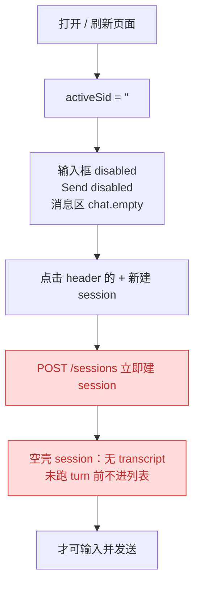
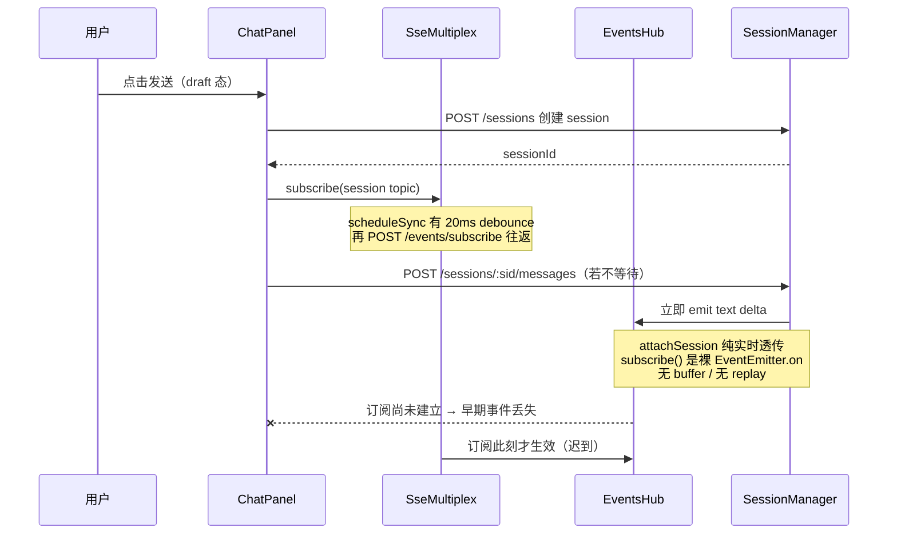
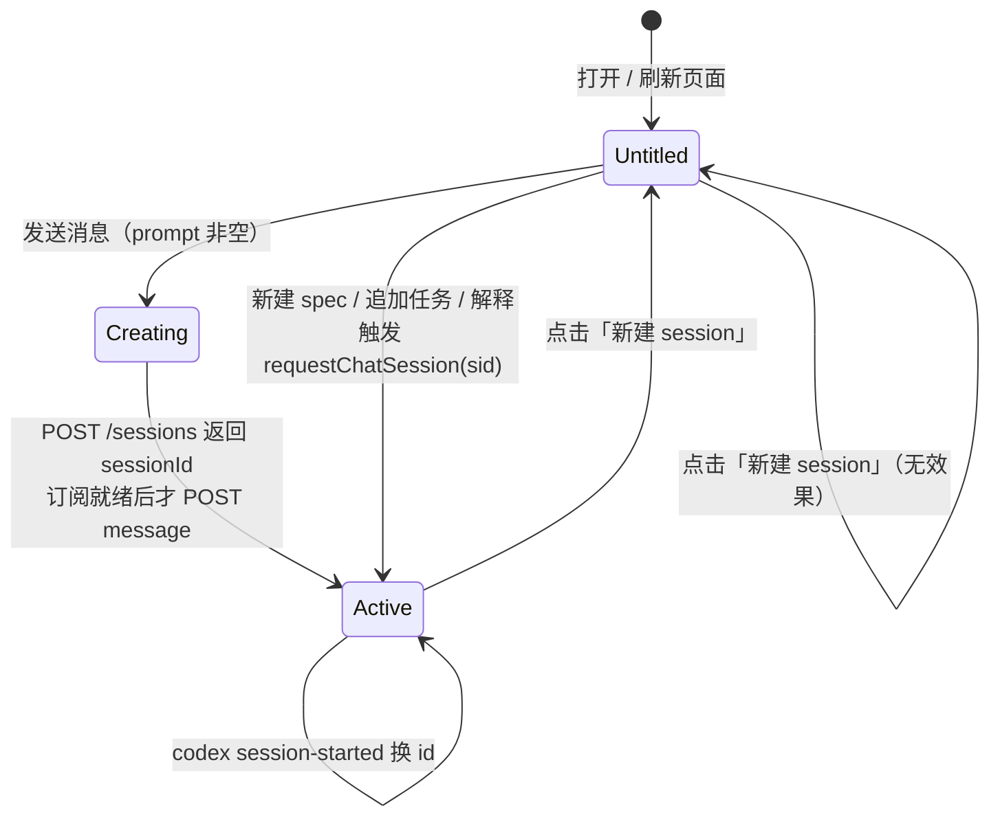
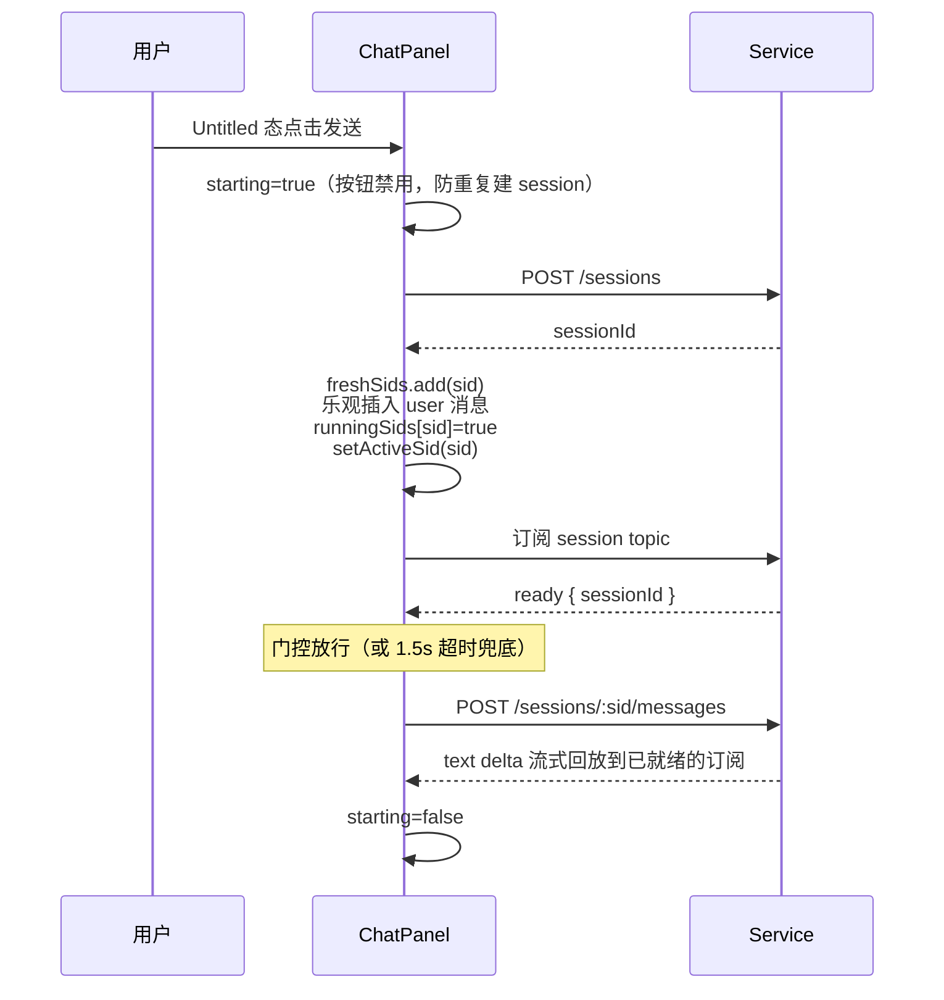
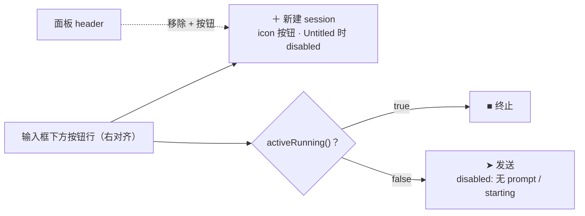
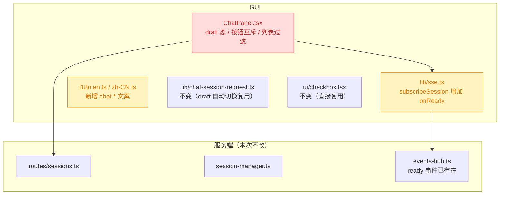

# 260714.feat.chat-untitled-session-and-list

## 1. 背景

`.yorz/specs/260712.refct.agent-sdk-chat-workspace` 落地了三列 Chat 工作区，`.yorz/specs/260713.fix.chat-session-panel-fixes` 修复了空壳 session、宽度上限、运行标识与列表折叠卡片等问题。当前 `src/gui/src/components/ChatPanel.tsx` 仍存在四类交互问题：session 操作入口分散在 header、必须先手动新建 session 才能输入、发送/终止按钮同时占位、会话列表默认折叠且不区分运行中与历史会话。

## 2. 需求

1. 输入框下方「发送 / 终止」两个按钮同一时刻只显示一个，两者互斥。
2. 新建 session 的 icon 按钮从 chat 面板 header 移动到互斥按钮左侧——session 相关操作应聚合在一起。
3. 打开或刷新页面时，Chat 面板默认即可直接输入内容（Untitled 状态）；发送消息时才创建 session，而不是先创建 session 才能输入。
   - 点击「新建 session」默认新开一个 Untitled 状态的会话界面，避免创建空白 session；已处于 Untitled 状态时点击「新建 session」无效果。
   - 当「新建 spec」「追加任务」「解释」等动作触发 Agent 时，Untitled 状态自动切换到被激活的 session。
4. 会话卡片默认改为展开状态（localStorage 记忆优先）；默认只显示运行中的 session 列表；展开/折叠 icon 左侧新增一个「显示历史」checkbox（默认不勾选），勾选后显示一周内的 session。

## 3. 现状分析

### 3.1 ChatPanel 的「先建 session 才能输入」模型

`activeSid()` 目前同时承担两种语义：**当前会话 id** 与 **面板是否可用**。空串即「无会话」——输入框 `disabled`、消息区显示 `chat.empty`、Send 按钮 `disabled`。因此首次打开/刷新页面必须先点 header 的 `+` 调 `POST /sessions` 建一个空 session 才能输入，而这个 session 在服务端**没有任何 turn**，正是 `260713` 那轮修掉的「空壳 session」的成因：它靠 GUI 本地补一个 `runningSids[sid]=false` 才不至于显示错乱。

精确层：当前实现的关键位置

- `src/gui/src/components/ChatPanel.tsx:93` — `activeSid` 初始为 `''`，无恢复逻辑。
- `:329-342` — `newSession()` 直接 `await api.createSession(pid, {})`，并注释说明「服务端隐藏从未跑过 turn 的 session，故必须本地 seed `runningSids[sessionId]=false`」。
- `:520-531` — `MentionTextarea` 的 `disabled={!activeSid()}`，placeholder 在 `chat.inputPlaceholder` / `chat.noSessionPlaceholder` 间二选一。
- `:533-551` — Send 与 Abort **并列渲染**：Abort 包在 `<Show when={activeRunning()}>` 内，Send 常驻且 `disabled={!activeSid() || !input().trim() || activeRunning()}`，运行中两个按钮同时占位。
- `:409-418` — `+` 新建 session 按钮位于 header，与输入区的会话操作割裂。
- 服务端 `src/service/routes/sessions.ts:26-45` — `POST /sessions` 接受 `{ title?, agentKind? }`，仅建索引，**不触发任何 turn**。

### 3.2 三条链路的真相源：session 事件流**没有回放**

这是本需求最关键的约束。「先建 session、再订阅、最后 POST 消息」当前之所以成立，是因为用户手动新建后有充足时间完成订阅；一旦改成 draft 态「发送时才创建 session」，创建 → 订阅 → POST 会挤在同一次点击里，而**订阅是异步的、且服务端不补发已产生的事件**——早期 text delta 会直接丢失，UI 表现为「发出去了但一直空白，直到手动切走再切回才从 transcript 读到」。

精确层：无回放的三处证据

- `src/service/events-hub.ts:316-326` — `attachSession()` 只 `emit(ready)` 后把 `project.sessions.subscribe(sid, ...)` 的事件透传；不读取任何历史缓冲。
- `src/service/session-manager.ts:218-221` — `subscribe(sid, onEvent)` 就是 `emitter.on('event', cb)`，无 buffer；`emitters` 仅在 turn 期间 emit（`:190`）。
- `src/gui/src/lib/sse.ts:42-56` + `:115-121` — `subscribe()` 只是登记 handler，真正的 `POST /api/events/subscribe` 走 `scheduleSync()`，**默认 20ms debounce + 一次网络往返**。
- 反向可用信号：`events-hub.ts:322` 在 attach 成功时会 emit 一个 `ready` 事件（`{ sessionId }`），但 GUI 的 `subscribeSession`（`sse.ts:207-223`）当前只转发 `session-msg`，**丢弃了 `ready`** —— 这正是我们做「订阅就绪门控」现成的服务端信号。

### 3.3 列表语义：ghost 过滤、30 条上限、running 由 SSE 维护

`GET /sessions` 返回的已是「跑过 turn 或正在跑」的存活 session，按 `updatedAt` 倒序并**截断为 30 条**；`running` 字段是每次响应重算的瞬时态，GUI 再用项目级 `sessions` SSE topic 维护 `runningSids` 增量。列表卡片当前默认折叠，且 `Show when={sessions().length > 0}` 决定卡片是否出现——**没有运行中 session 时若按新需求只显示运行中，用户将看不到任何卡片，也就无从勾选「显示历史」**，这是改造必须一并处理的连带问题。

精确层：服务端列表规则

- `src/service/session-manager.ts:127-129` — 存活判定：`nativeIds.has(s.id) || s.createdAt !== s.updatedAt || this.running.has(s.id)`。
- `src/service/session-manager.ts:32` — `SESSION_LIST_LIMIT = 30`，按 `updatedAt` 倒序后截断。
- `src/gui/src/components/ChatPanel.tsx:116-126` — 每次列表响应**重建**（而非 merge）`runningSids`，并特意保留「刚发出、尚未进列表」的活跃 session 的乐观 `true`。
- `src/gui/src/components/ChatPanel.tsx:92` — `listOpen` 默认值 `readLocal(LIST_COLLAPSED_KEY, '1') !== '1'` → **默认折叠**。
- `src/gui/src/components/ui/checkbox.tsx` — Kobalte checkbox 组件已存在，可直接复用。

## 4. 技术实现方案

### 4.1 Untitled（draft）态：用 `activeSid === ''` 表达「未落库的新会话」

不新增 session 类型，只是**重新解释空串**：`''` 从「无会话、面板不可用」改为「Untitled 草稿会话、面板完全可用」。面板可用性改由 `activeProjectId()` 决定。

行为要点：

- **新建 session 按钮**不再调 `api.createSession`，只做 `setActiveSid('')` + 清空 `entries`；已处于 Untitled 时按钮 `disabled`（满足「Untitled 态点击无效果」）。空壳 session 从此不再产生。
- **外部 Agent 动作自动切换**：`新建 spec / 追加任务 / 解释 / review / gitOp` 这些路径服务端本就是「建 session 并立即跑 turn」，GUI 已通过 `requestChatSession(sid)` → `ChatPanel` 的 effect → `selectSession(sid)` 切换；Untitled 态（`activeSid=''`）走同一条路径即可自动激活，无需额外改动。切走时输入框里的草稿文本保留、不清空。
- **草稿文本不做跨会话保存**：Untitled 只是「尚未落库的会话视图」，不引入草稿持久化。

### 4.2 draft 发送时序：订阅就绪门控（本方案的核心）

针对 3.2 的丢事件风险，draft 首次发送必须**等订阅就绪再 POST**。复用服务端 `attachSession` 已经发出的 `ready` 事件：在 `sse.ts` 的 `subscribeSession` 增加 `onReady` 回调，ChatPanel 为每个 sid 维护一个 deferred，draft 发送在 POST 前 `await Promise.race([ready, timeout(1500ms)])`（超时兜底：宁可退化为「可能丢早期 delta」也不能卡住发送）。

两个必须配套的细节：

- **`freshSids`**：sid 变化的 effect 现在会 `setEntries([])` 并拉 transcript。对刚创建的 session 这会**抹掉我们乐观插入的用户消息**（且磁盘上本就没有 transcript）。故用一个 `Set<string> freshSids` 标记「本地刚建、无历史」的 sid：命中时跳过清空与 `getSessionMessages`，只做订阅。codex 的 `session-started` 换 id 场景把新 id 一并加入 `freshSids`，顺带修掉「换 id 时清空正在流式输出内容」的既有隐患。
- **`starting` 信号**：从点击到 `setActiveSid` 之间存在异步窗口，若不加锁，连点会创建多个 session。`send()` 入口 `if (starting()) return`，且发送按钮在 `starting()` 时 `disabled`。

### 4.3 输入区：新建 session + 发送/终止互斥

- 用 `<Show when={activeRunning()} fallback={<Send/>}><Abort/></Show>` 实现严格互斥（当前是 Abort 条件渲染 + Send 常驻并列）。
- header 只保留标题与折叠按钮；`+` 按钮移到按钮行最左，与发送/终止同组。
- Untitled 态 `activeRunning()` 恒为 `false` → 显示发送；`starting()` 期间发送按钮禁用（互斥关系不变）。

### 4.4 会话列表：默认展开 + 「显示历史」勾选

- **默认展开**：`listOpen` 初值改为 `readLocal(LIST_COLLAPSED_KEY, '0') !== '1'`（localStorage 记忆优先，key 与写入逻辑不变）。
- **显示历史**：新增 `showHistory` 信号，key `yorz.chat.sessionList.showHistory`，默认 `'0'`（不勾选）。过滤规则：
  - 不勾选 → 只显示 `isRunning(s.id)` 的 session；
  - 勾选 → 显示 `updatedAt >= now - 7 天` 的 session（运行中天然满足）。复用已有的每分钟 `timeTick()` 让时间窗随时间刷新。
- **激活会话常驻（批注确认）**：无论过滤条件如何，当前 `activeSid()` 对应的 session 若存在于 `sessions()` 中，始终保留在列表内（不满足过滤条件时按 `updatedAt` 原序位插入，不额外置顶），避免「点开历史会话 → 取消勾选 → 当前会话从列表消失」的迷失感。实现上：`visibleSessions = sessions().filter((s) => matchFilter(s) || s.id === activeSid())`。
- **卡片显隐**：改为「有 project 即渲染卡片」，不再依赖 `sessions().length > 0`——否则无运行中 session 时用户看不到 checkbox，无法勾出历史（见 3.3）。列表体为空时显示空态文案（如「无运行中的会话」）。
- **DOM 结构**：`CollapsibleTrigger` 渲染为 `<button>`，**checkbox 不能嵌套其中**（HTML 禁止交互元素嵌套，且点击会冒泡触发折叠）。改为受控 `Collapsible`（`open` 已受控），trigger 行手写为一个 flex 容器：`[标题（可点击折叠）] … [显示历史 checkbox] [ChevronDown（可点击折叠）]`，checkbox 位于 chevron 左侧，满足需求且不产生嵌套按钮。

### 4.5 i18n 与 localStorage key

精确层：新增 key 清单（en.ts / zh-CN.ts 同步）

- `chat.draftPlaceholder` — Untitled 态输入框占位（例：「输入消息，发送后自动创建会话」/ "Type a message — a session starts on send"）。
- `chat.draftEmpty` — Untitled 态消息区空态提示。
- `chat.showHistory` — 「显示历史」checkbox 文案。
- `chat.noRunningSessions` — 列表体空态（未勾选历史且无运行中会话）。
- 保留 `chat.newSession`（按钮 title）；`chat.noSessionPlaceholder` 改用于「未选中项目」场景，若无引用则删除。
- localStorage：沿用 `yorz.chat.sessionList.collapsed`；新增 `yorz.chat.sessionList.showHistory`（`'1'` / `'0'`）。

### 4.6 兼容性与影响范围

改动集中在 GUI，**服务端零改动**（`POST /sessions` 仍支持、只是不再被空转调用；30 条上限与 ghost 过滤保持现状）。

- **行为变更（breaking，仅 UI 语义）**：`activeSid=''` 从「不可用」变为「Untitled 可用」；空壳 session 不再被创建（对 `260713` 修的 ghost 过滤是正向收敛）。
- **不受影响**：spec 详情页 / review 页触发 Agent 的既有链路、`requestChatSession` 协议、session 列表接口契约均不变。
- **已知限制（不在本次范围）**：`新建 spec / 追加任务 / 解释` 由服务端先跑 turn、GUI 再订阅，早期 delta 本就可能丢失（与 3.2 同源）；本次只为 draft 发送路径加门控，不改这些既有路径。
- **列表上限（批注确认）**：服务端 `SESSION_LIST_LIMIT = 30` 保持不变。勾选「显示历史」定位为「一周内会话的快速切换入口」，而非完整会话管理页；超过 30 条时的截断为已知且可接受的行为，先观察实际使用再决定是否放宽。

## 5. 待确认问题

_暂无_

## 6. 任务清单

- [x] 在 `src/gui/src/lib/sse.ts` 的 `SessionSubscribeHandlers` 增加 `onReady?: (e: { sessionId: string }) => void`，并在 `subscribeSession` 的 mux 回调中转发 `ready` 事件（验收：`event === 'ready'` 时调用 `onReady`，其余分支不变；`npx tsc --noEmit` 通过）
- [x] 在 `src/gui/src/i18n/en.ts` 与 `zh-CN.ts` 的 `chat` 段新增 `draftPlaceholder` / `draftEmpty` / `showHistory` / `noRunningSessions`，并把 `noSessionPlaceholder` 改用于「未选中项目」场景（验收：两个文件 key 集合完全一致，无残留未引用 key）
- [x] 在 `ChatPanel.tsx` 落地 Untitled 草稿态：`activeSid() === ''` 视为可用草稿会话，输入框 `disabled` 改为 `!activeProjectId()`，placeholder / 消息区空态按 draft 分支取 `chat.draftPlaceholder` / `chat.draftEmpty`（验收：刷新页面未选任何 session 时输入框可输入）
- [x] 改写 `newSession()`：不再调 `api.createSession`，改为 `setActiveSid('')` + `setEntries([])` + `setInput` 保留；Untitled 态时按钮 `disabled`（验收：连点新建按钮不产生任何 `POST /sessions`）
- [x] 在 `ChatPanel.tsx` 增加 `freshSids: Set<string>` 与 `readySignals` deferred map：sid effect 命中 `freshSids` 时跳过 `setEntries([])` 与 `getSessionMessages`，只建订阅；`subscribeSession` 的 `onReady` resolve 对应 deferred；`session-started` 换 id 时把新 id 加入 `freshSids`（验收：新建会话首条消息不被 transcript 拉取抹掉）
- [x] 改写 `send()` 的 draft 分支：`starting()` 互斥锁 → `POST /sessions` → 标记 `freshSids` / 乐观 user 消息 / `runningSids[sid]=true` / `setActiveSid(sid)` → `await Promise.race([ready, timeout(1500)])` → `POST /sessions/:sid/messages`；失败时回滚 `runningSids` 并追加错误消息（验收：draft 首发不丢早期 text delta；连点发送只创建一个 session）
- [x] 输入区按钮行改造：`<Show when={activeRunning()} fallback={<Send/>}><Abort/></Show>` 严格互斥；把 header 的 `+` 新建按钮移到按钮行最左；发送按钮 `disabled` 条件改为 `!activeProjectId() || !input().trim() || starting()`（验收：运行中只见终止按钮，空闲只见发送按钮；header 不再有 `+`）
- [x] 会话列表默认展开：`listOpen` 初值改为 `readLocal(LIST_COLLAPSED_KEY, '0') !== '1'`（验收：清空 localStorage 后首次打开列表为展开态；已有 `'1'` 记忆仍保持折叠）
- [x] 会话列表过滤：新增 `showHistory` 信号（key `yorz.chat.sessionList.showHistory`，默认 `'0'`），未勾选只显示 `isRunning(s.id)`，勾选显示 `updatedAt >= timeTick() - 7*24h`，并始终保留 `activeSid()` 对应条目（验收：取消勾选后当前激活的历史会话仍在列表中）
- [x] 列表卡片 DOM 重构：卡片显隐条件改为 `activeProjectId()`；受控 `Collapsible` 的 trigger 行改为 flex 容器 `[标题(可点折叠)] [显示历史 checkbox] [ChevronDown(可点折叠)]`，checkbox 复用 `ui/checkbox.tsx` 且不嵌套在 `<button>` 内；列表体为空时渲染 `chat.noRunningSessions` 空态（验收：DOM 无 button 嵌套；点 checkbox 不触发折叠）
- [x] 运行校验：`npx tsc --noEmit`、`pnpm test`、`npx prettier --check "src/gui/src/**/*.{ts,tsx}"`（验收：全部通过，失败项修复后重跑）

## 7. 执行记录

- **2026-07-14 20:33** 消费用户批注：5.1 采用「始终保留当前激活 session」，写入 4.4；5.2 采用「保持 `SESSION_LIST_LIMIT = 30` 不变」，写入 4.6。删除 `## 用户批注` 章节，`## 待确认问题` 置为 `_暂无_`。
- **2026-07-14 20:34** `src/gui/src/lib/sse.ts`：新增 `SessionReadyEvent` 与 `SessionSubscribeHandlers.onReady`，`subscribeSession` 转发服务端 `ready` 事件（此前被丢弃）。服务端零改动。
- **2026-07-14 20:35** i18n（`en.ts` / `zh-CN.ts`）：`chat` 段新增 `draftEmpty` / `draftPlaceholder` / `showHistory` / `noRunningSessions`；`noSessionPlaceholder` 语义改为「请先选择项目」。两端 key 集合一致。
- **2026-07-14 20:36** `ChatPanel.tsx` 主体改造：
  - Untitled 草稿态：`activeSid=''` 变为可用草稿会话，输入框/发送按钮改由 `activeProjectId()` 门控；消息区空态按 draft 分支渲染。
  - `newSession()` 不再 `POST /sessions`，只回落到草稿态（空壳 session 不再产生）；草稿态按钮 `disabled`。
  - draft 首发：`starting()` 互斥锁 → 建 session → `freshSids` 标记 + 乐观 user 消息 → `await Promise.race([ready, delay(1500)])` 订阅就绪门控 → POST 消息；`freshSids` 命中时跳过 transcript 拉取与清空，`turn-completed` 后移出集合；codex `session-started` 换 id 继承 fresh 标记。
  - 按钮行：`＋ 新建` 移出 header 至发送/终止左侧；发送/终止改为 `Show + fallback` 严格互斥。
  - 会话列表：默认展开（localStorage 记忆优先）；新增 `showHistory` checkbox（key `yorz.chat.sessionList.showHistory`，默认关）；`visibleSessions` 过滤 = 运行中 ∪ 当前激活 ∪（勾选时）一周内；卡片改为「有 project 即渲染」，列表空时显示 `chat.noRunningSessions`；trigger 行手写 flex，checkbox 不嵌套于 `<button>`。
- **2026-07-14 20:37** 验证：`npx tsc --noEmit` 错误数 17，与改动前基线**完全一致**（均为既有的 `@/lib/cn` 路径别名与 timeago 类型问题，非本次引入）；`pnpm test` 268/269 通过，唯一失败 `spec-review.test.ts`（`UND_ERR_SOCKET`，service HTTP 并发端口争用）单独重跑 9/9 全绿，判定为既有偶发、与本次 GUI 改动无关；`prettier --write` 已格式化改动文件。
- **2026-07-14 20:38** 收尾：任务清单全部完成，无待确认问题 / 批注 / `[open]` 追加任务，`stage` 标记为 `done`。
