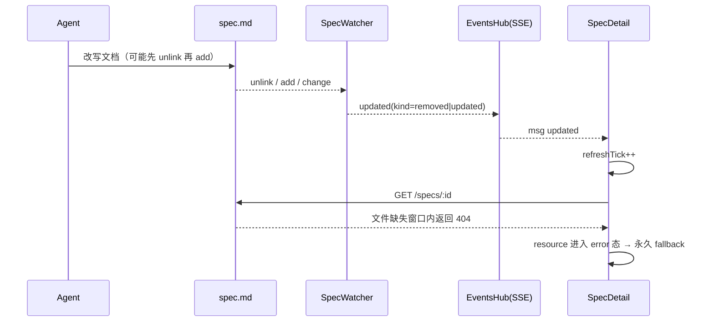
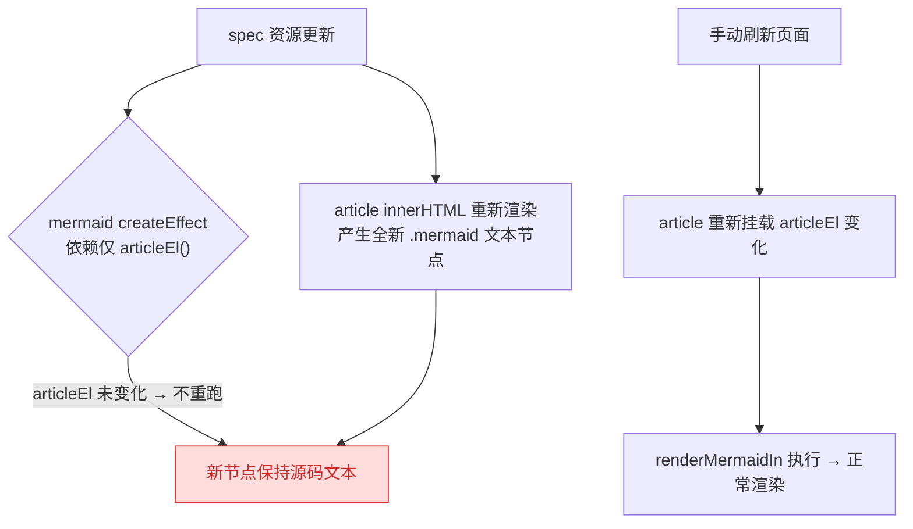
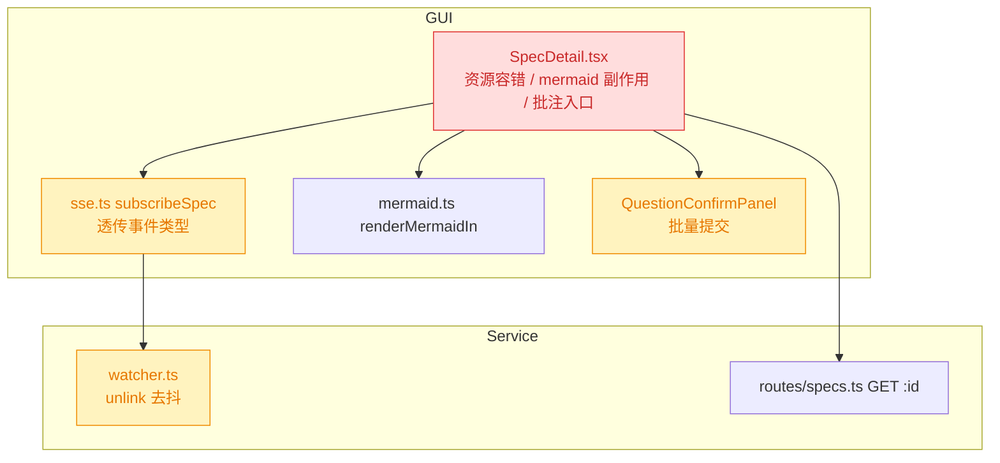
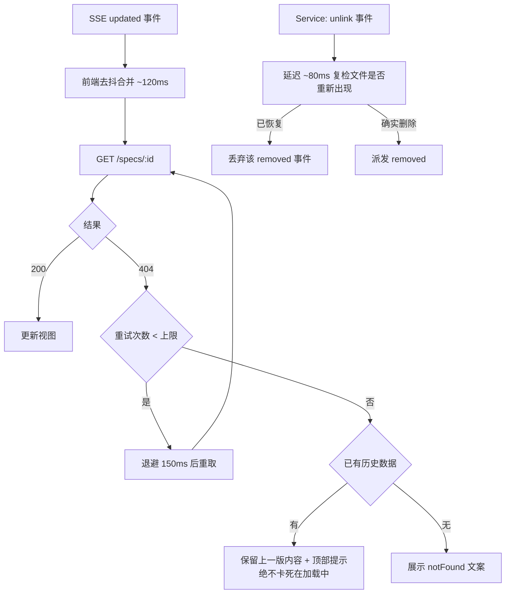
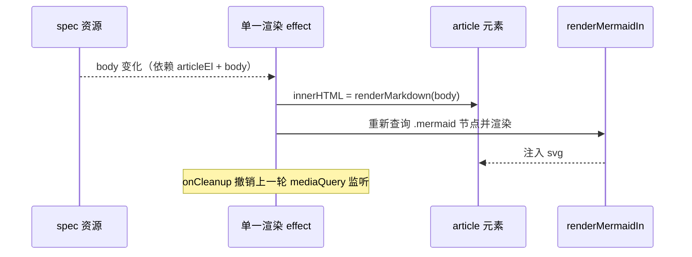
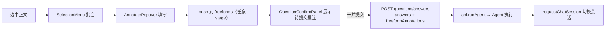
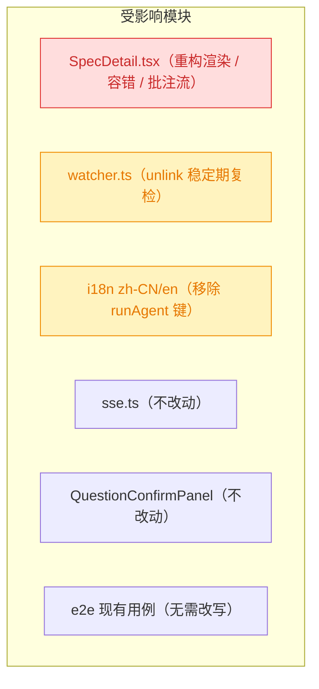

# spec 详情页实时更新与批注交互修复

## 1. 背景

`src/gui/src/pages/SpecDetail.tsx` 是 spec 详情页。Agent 通过 skill 改写 `spec.md` 后，Service 的 FS Watcher 会推送 `updated` 事件，页面据此重新拉取文档实现「实时更新」。当前该链路存在两处稳定性缺陷（404 卡死、mermaid 不渲染），同时页面交互中「运行 Agent」按钮已被「解释 / 问题确认」等自动触发路径取代，批注提交也缺少批量确认与自动运行能力。

## 2. 需求

1. Agent 更新 spec 文档、详情页实时刷新时会触发 `404 spec not found`，导致页面卡死在「加载中」状态（`Uncaught (in promise) Error: 404 spec not found`）。
2. Agent 更新 spec 文档、详情页实时刷新后，mermaid 图无法渲染，页面中显示为源码文本；手动刷新页面后渲染正常。
3. 页面移除「运行 Agent」按钮：「解释、确认问题」等入口已会自动触发 Agent 运行，该按钮已无必要。
4. 选中内容「批注」提交后复用问题确认面板交互：允许累积多个批注一并提交，并在提交后触发 Agent 执行。

## 3. 现状分析

### 3.1 实时更新链路

Agent 写盘 → chokidar → SpecWatcher → EventsHub（SSE topic `project:<pid>:spec:<id>`）→ GUI `subscribeSpec.onUpdated` → `refreshTick++` → `createResource` 重新 `GET /specs/:id`。



**关键事实：**

- Watcher 把 `unlink` 归一为 `removed`，EventsHub 仍以 `updated` 事件名推送（`data.type` 才区分 removed）；GUI 的 `onUpdated` 不看 `data`，任何一种都会立即重新拉取。
- 编辑器 / Agent 的原子写（写临时文件再 rename）会产生「文件短暂不存在」窗口，此时 `store.read` 走 `existsSync` 返回 `null`，路由回 404。
- `createResource` 的 fetcher 抛错后 resource 进入 error 态，页面没有 `ErrorBoundary`，`Suspense` 永远停在「加载中」fallback，且产生未捕获 promise 异常；即使随后文件已恢复，也没有任何重试路径。

### 3.2 mermaid 渲染链路

`renderMarkdown` 把 ` ```mermaid ` 代码块渲染为 `<div class="mermaid" data-mermaid-source="...">`，随后由 `renderMermaidIn(el)` 查询 `.mermaid` 节点并调用 `mermaid.run`。问题在于两条更新路径的**依赖不一致**：



即：mermaid 副作用只跟踪 `articleEl()`，而 `innerHTML` 跟踪 `spec()`；SSE 刷新只改变 body、不改变元素引用，副作用不重跑。

### 3.3 页面交互现状

- header 中的「运行 Agent」按钮调用 `api.runAgent`；而 `explain` / `appendItem(autoRun)` / `submitQuestionAnswers` 均已各自触发 Agent 运行。
- `submitAnnotate` 分叉：`stage === 'plan'` 时把批注堆进 `freeforms()`（进入 `QuestionConfirmPanel` 批量提交），其它 stage 直接 `api.appendAnnotation` 单条落盘，且**不触发 Agent**。
- `showPanel()` 要求 `stage === 'plan'`，因此非 plan 阶段即使有批注也不显示确认面板。
- 文件内残留未使用符号：`Badge` 导入、`titleFromBody` 函数。

<details>
<summary>精确层：涉及文件与关键位置</summary>

- `src/gui/src/pages/SpecDetail.tsx`
  - `L42-45` `createResource` fetcher 直接 `api.getSpec`，错误未兜底。
  - `L63-68` `showPanel()` 限定 `stage === 'plan'`。
  - `L70-78` `subscribeSpec` → `setRefreshTick`（无防抖、无 removed 区分）。
  - `L118-131` mermaid `createEffect` 仅依赖 `articleEl()`。
  - `L162-183` `submitAnnotate` 按 stage 分叉。
  - `L189-193` `submitAnswers` → `submitQuestionAnswers` + `runAgent`。
  - `L275-283` 「运行 Agent」按钮；`L25` `Badge` 未使用；`L339-342` `titleFromBody` 未使用。
- `src/gui/src/lib/sse.ts:170-192` `subscribeSpec` 丢弃事件 payload（`data.type`）。
- `src/gui/src/lib/mermaid.ts:18-53` `renderMermaidIn` 在调用时刻快照 `.mermaid` 节点。
- `src/service/watcher.ts:76-98` `handle()`：`unlink` 直接派发 `removed`，无 rename 去抖。
- `src/service/events-hub.ts:283-296` `attachSpec`：`watcher.subscribe` 回调统一 emit `updated`，payload 携带 `type: kind`。
- `src/service/routes/specs.ts:54-60` `GET /specs/:id` → `store.read` 为空返回 404。
- `src/service/spec-store.ts:140-152` `read()` 基于 `existsSync`。
- `src/service/spec-store.ts:172-212` `applyQuestionAnswers()`：写入 `！！！` 批注块并**强制 `stage: 'plan'`**。
- i18n：`src/gui/src/i18n/zh-CN.ts:133-134`、`en.ts:134-135` 的 `specDetail.runAgent` / `specDetail.running`。

</details>

## 4. 技术实现方案

### 4.1 总体



### 4.2 修复实时刷新 404 卡死（需求 1）

三层防护，缺一不可：



- **Service 层（治本）**：`SpecWatcher.handle` 对 `unlink` 做「稳定期复检」——延迟一小段时间后 `existsSync`，若文件已恢复（rename 原子写）则视为一次 `updated`（或直接丢弃，交由随后的 add 事件驱动），不再向下游派发 `removed`。
- **GUI 资源层（治标兜底）**：`SpecDetail` 的 fetcher 包装为 `fetchSpecWithRetry`：捕获 404 → 退避重试（上限 ~3 次）；最终仍失败时**不抛错**，返回上一次成功的 `SpecDetail`（`createResource` fetcher 第二参数的 `refetching`/`value` 可拿到上一版），仅当从未加载成功过才返回 `null` 走 notFound 分支。这样即便再出现瞬时 404，页面也只会「保持旧内容」而非卡死。
- **事件去抖**：`SpecDetail` 传给 `subscribeSpec` 的 `onUpdated` 回调增加 ~120ms 去抖，合并 Agent 连续写盘产生的事件风暴，顺带减少无效请求。去抖落在页面侧而非 `sse.ts`，避免影响 `subscribeSpec` 的其它调用方（`sse.ts` 本身不改动）。

### 4.3 修复实时刷新后 mermaid 不渲染（需求 2）

根因是「innerHTML 由 `spec()` 驱动、mermaid 副作用由 `articleEl()` 驱动」两者脱钩，且两个 effect 的执行顺序不可靠。方案：**把 markdown 注入与 mermaid 渲染收敛到同一个 effect**，保证顺序确定。



要点：

- 移除 JSX 上的 `innerHTML={...}` 绑定，改为 `createEffect` 内显式赋值 `el.innerHTML = renderMarkdown(...)`，随后 `await renderMermaidIn(el)`。
- effect 依赖 `articleEl()`、`s().body`、`projectId()`、`s().id`；每轮 `onCleanup` 释放上一轮的 mediaQuery 监听，避免监听泄漏。
- 竞态保护：保留现有 `active` 标志，body 快速连续变化时丢弃过期渲染结果。

### 4.4 移除「运行 Agent」按钮（需求 3）

- 删除 header 中的运行按钮及其 `disabled/opacity` 逻辑；`runAgent()` 函数保留（供批注/问题提交后触发）。
- 运行态不再有按钮承载，改为在 header 以轻量指示呈现（复用已导入但未使用的 `Badge`，文案沿用 `specDetail.running`），`running` 信号仍由 `subscribeSession` 的 `turn-completed` / `error` 收敛。
- 顺带清理死代码：未使用的 `titleFromBody`；i18n 的 `specDetail.runAgent` 键在无引用后一并移除（`specDetail.running` 保留）。

### 4.5 批注复用问题确认面板并批量提交（需求 4）



- `submitAnnotate` 去掉 stage 分叉：任何 stage 下批注都进入 `freeforms()` 草稿列表（不再直接调 `api.appendAnnotation`），可多次追加、单条删除。
- `showPanel()` 去掉 `stage === 'plan'` 限制：`questions().length > 0 || freeforms().length > 0` 即显示面板；非 plan 阶段面板只呈现批注卡片（`questions` 为空时 header 计数显示 0/0）。
- 提交沿用既有 `submitAnswers`：`api.submitQuestionAnswers` 一次性写入全部 `！！！` 批注块 → 清空 `freeforms` → `runAgent()` 触发 Agent。服务端 `applyQuestionAnswers` 已支持「仅 freeformAnnotations」入参，无需改接口。
- 副作用提示：`applyQuestionAnswers` 会把 `stage` 强制写回 `plan`（等同「变更重开流程」），与 `appendAnnotation` 现有行为一致；见待确认问题 5.2。
- `api.appendAnnotation` 在页面内不再有调用方，但保留 API（其它入口/测试可能使用）。

### 4.6 兼容性与影响范围



- e2e 现有用例（`selection-menu.spec.ts` / `question-confirm.spec.ts` / `append-task.spec.ts`）经核对**均不依赖**「运行 Agent」按钮，也不断言「非 plan 阶段批注直接落盘」，无需改写。
- Service 侧 watcher 去抖会让 `removed` 事件延迟 ~80ms 派发，spec 删除场景的实时性影响可忽略。

<details>
<summary>精确层：改动清单</summary>

- `src/gui/src/pages/SpecDetail.tsx`
  - fetcher → `fetchSpecWithRetry(pid, id, prev)`：404 退避重试 3 次（150ms）→ 回退 `prev`（`createResource` fetcher 第二参数 `{ value }`）→ 从未成功则 `null`。
  - `subscribeSpec` 回调加 120ms 去抖 timer，`onCleanup` 清 timer。
  - 合并 markdown 注入 + `renderMermaidIn` 为单一 effect，移除 JSX `innerHTML` 绑定。
  - 删除运行按钮（`L275-283`），改 `Badge`（`variant="secondary"`）显示 `specDetail.running`。
  - `submitAnnotate` 统一入 `freeforms`；`showPanel` 去掉 stage 判定。
  - 删除 `titleFromBody`。
- `src/service/watcher.ts`：`handle()` 中 `unlink` 分支延迟 ~80ms 复检 `existsSync`，恢复则丢弃该 `removed`（后续 `add` 事件会驱动 `updated`）。
- `src/gui/src/i18n/{zh-CN,en}.ts`：移除 `specDetail.runAgent`（保留 `specDetail.running`）。
- 测试：`pnpm test`（vitest，新增 `src/service/__tests__/watcher.test.ts`）、`pnpm test:e2e`（playwright，现有用例应保持绿）。

</details>

### 4.7 决策记录（来自用户批注）

| 待确认问题                             | 决策                                                        |
| -------------------------------------- | ----------------------------------------------------------- |
| 404 修复落点范围                       | 前端容错 + Service watcher `unlink` 去抖复检（双层）        |
| 非 plan 阶段批注强制回写 `stage: plan` | 接受，与现有 `appendAnnotation` 行为一致                    |
| 移除按钮后的运行态指示                 | 保留轻量运行指示（`Badge`，复用 `specDetail.running` 文案） |

## 5. 待确认问题

_暂无_

## 6. 任务清单

- [x] 在 `src/service/watcher.ts` 的 `handle()` 中为 `unlink` 增加 ~80ms 稳定期复检：文件已恢复则丢弃 `removed`，确实删除才派发（验收：`pnpm test` 通过）
- [x] 新增 `src/service/__tests__/watcher.test.ts`，覆盖「unlink 后文件立即恢复 → 不派发 removed」与「unlink 后确实删除 → 派发 removed」（验收：vitest 两条用例通过）
- [x] 在 `src/gui/src/pages/SpecDetail.tsx` 增加 `fetchSpecWithRetry`：404 退避重试 3 次 → 回退上一版 `SpecDetail` → 从未成功才返回 `null`，并接入 `createResource` fetcher（验收：`tsc --noEmit` 通过、404 不再抛未捕获异常）
- [x] 在 `SpecDetail.tsx` 的 `subscribeSpec` 回调加 120ms 去抖 timer 并在 `onCleanup` 清理（验收：连续 SSE 事件只触发一次 refetch）
- [x] 在 `SpecDetail.tsx` 合并 markdown 注入与 mermaid 渲染为单一 `createEffect`（依赖 `articleEl` + `s().body`），移除 JSX `innerHTML` 绑定，保留 `active` 竞态标志与 `onCleanup`（验收：SSE 刷新后 mermaid 正常渲染为 svg）
- [x] 删除 `SpecDetail.tsx` header 的「运行 Agent」按钮，改用 `Badge`（`variant="secondary"`，仅 `running()` 为真时显示 `specDetail.running`）（验收：按钮消失、运行时显示徽标）
- [x] 删除 `SpecDetail.tsx` 中未使用的 `titleFromBody` 函数，并移除 `src/gui/src/i18n/{zh-CN,en}.ts` 的 `specDetail.runAgent` 键（验收：grep 无 `runAgent` i18n 引用残留、`tsc --noEmit` 通过）
- [x] 重写 `SpecDetail.tsx` 的 `submitAnnotate`：去掉 stage 分叉，任意 stage 均 push 进 `freeforms()` 草稿；`showPanel()` 去掉 `stage === 'plan'` 限制（验收：非 plan 阶段批注后出现确认面板）
- [x] 运行 `pnpm test`、`pnpm typecheck`（或 `tsc --noEmit`）与 `pnpm test:e2e` 并记录结果（验收：全部通过）
- [ ] [manual] 在真实 GUI 中回归：Agent 改写 spec 时页面不再卡死、mermaid 实时渲染、非 plan 阶段批注可累积并批量提交（验收：人工确认）

## 7. 执行记录

- **Service watcher unlink 稳定期复检**：`src/service/watcher.ts` 新增 `unlinkSettleMs`（默认 80ms）与 `pendingUnlinks` timer 表；`handle()` 的 `unlink` 分支改为 `scheduleUnlink()` —— 延迟后 `existsSync` 复检，文件已恢复则丢弃 `removed`（由随后的 add/change 驱动 `updated`）；`add/change` 到达时主动 `clearTimeout` 取消待决 unlink；`close()` 清理所有 timer。抽出 `emit()` 复用派发逻辑。
- **watcher 单测**：新增 `src/service/__tests__/watcher.test.ts`，3 条用例（原子改写不派发 removed / 真实删除派发 removed / add 先到取消待决 unlink），直接驱动 `handle()` 以避开 chokidar 自身时序。验证：`npx vitest run src/service/__tests__/watcher.test.ts` → 3 passed。
- **404 容错**：`SpecDetail.tsx` 新增 `fetchSpecWithRetry()`，404 退避重试 3 次（150ms）后回退 `createResource` fetcher 的 `info.value`（上一版文档），从未加载成功才返回 `null` 走 notFound；非 404 错误仍照常抛出。resource 显式标注泛型 `<SpecDetailDoc | null, ...>` 以修正推断。
- **SSE 去抖**：`subscribeSpec` 的 `onUpdated` 回调加 120ms 去抖 timer，`onCleanup` 中同时清 timer 与取消订阅；`sse.ts` 未改动（避免影响其它调用方）。
- **mermaid 实时渲染**：删除 JSX 的 `innerHTML={...}` 绑定，改为单一 `createEffect` 内先 `el.innerHTML = renderMarkdown(...)` 再 `renderMermaidIn(el)`，依赖 `articleEl()` + `spec()`，保留 `active` 竞态标志与 mediaQuery cleanup。根因（HTML 由 `spec()` 驱动、mermaid 由 `articleEl()` 驱动而不重跑）消除。
- **移除「运行 Agent」按钮**：header 按钮删除，改为 `<Show when={running()}><Badge variant="secondary">` 轻量运行指示（原 `Badge` 导入由未使用转为使用）；`runAgent()` 函数保留供批注/问题提交后触发。清理未使用的 `titleFromBody`；移除 i18n `specDetail.runAgent`（zh-CN / en），保留 `specDetail.running`。
- **批注复用确认面板**：`submitAnnotate` 去掉 stage 分叉，任意 stage 均 push 进 `freeforms()` 草稿；`showPanel()` 去掉 `stage === 'plan'` 限制，改为「有问题或有批注草稿即显示」。提交仍走 `submitAnswers` → `api.submitQuestionAnswers`（一次性写入全部 `！！！` 块）→ 清空草稿 → `runAgent()`。`QuestionConfirmPanel` / 服务端接口均未改动。
- **验证结果**：`npx vitest run` → **36 files / 291 tests 全部通过**；`npx vite build` + `vite build --config vite.gui.config.ts` → 构建成功；`npx tsc --noEmit` → 改动前基线 18 处报错、改动后 17 处，本次涉及文件（SpecDetail / watcher / i18n）**零报错**（其余为既有的 `@/lib/cn` 路径别名与 timeago 类型基线问题）。
- **阻塞项（非本次引入）**：`npx playwright test` 有 5 条失败，但 `git stash` 回到基线并重新构建后**失败集合完全一致**（含与本 spec 无关的首页 `body-no-overflow`，报错为 `page.waitForLoadState` 30s 超时 —— 页面在该环境下始终无法完成加载）。判定为既有环境/e2e 夹具问题，与本次改动无关，未纳入本 spec 范围；真实 GUI 回归以 `[manual]` 项跟踪。

## 8. 收尾

任务清单中全部非 `[manual]` 项已完成，`## 待确认问题` 为 `_暂无_`，无 `！！！` 批注与 `[open]` 追加任务 → `stage` 置为 `done`。
