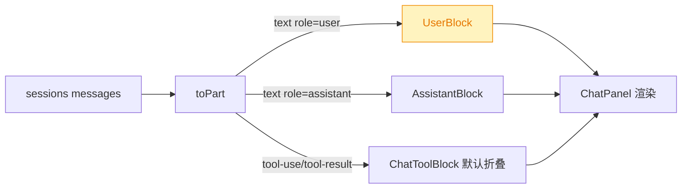
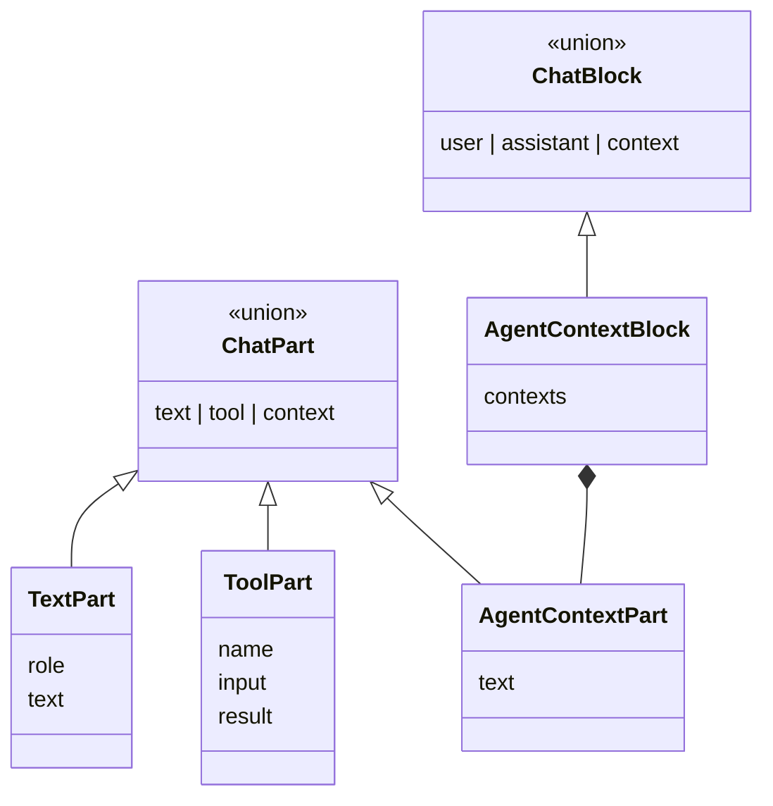
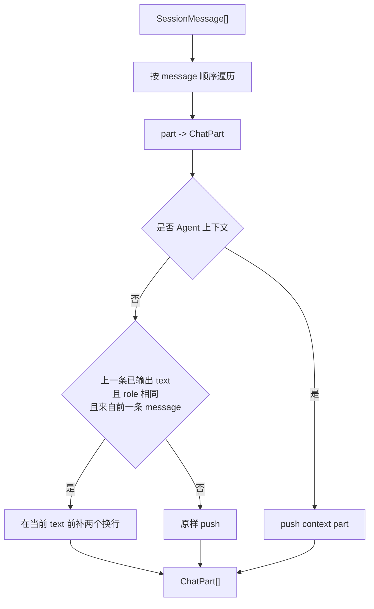
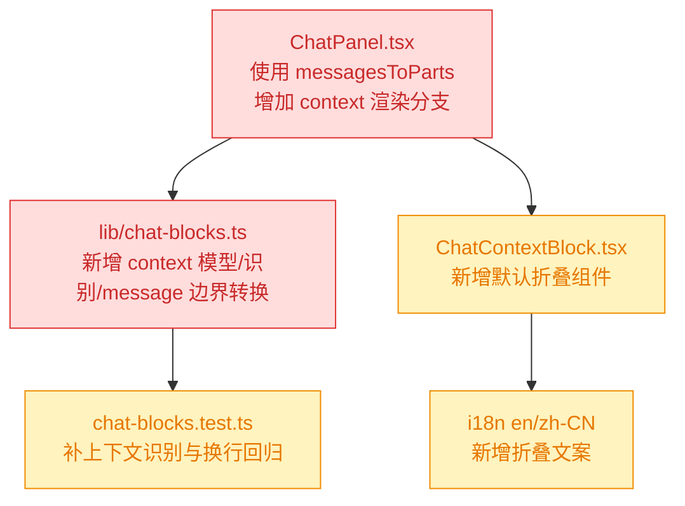

# 260715.feat.chat-agent-context-collapse

## 1. 背景

Chat 面板当前直接展示 `sessions/<id>/messages` 返回的用户文本内容。部分 `role: "user"` 消息并非用户实际输入，而是 Agent 运行时自动携带的插件推荐、AGENTS.md 指令、环境上下文等系统环境信息；这些内容很长，默认展开会挤占对话阅读空间。

同时，连续同角色文本消息已经会被合并成同一气泡，但多条消息之间如果不保留清晰换行，会让独立的 Agent 状态更新混在一行，降低可读性。

## 2. 需求

1. 在 @src/gui/src/components/ChatPanel.tsx 中处理 `sessions/<id>/messages` 输出的 Agent 自动环境信息，默认折叠展示。这些信息包括但不限于 `<recommended_plugins>...</recommended_plugins>`、`# AGENTS.md instructions for ...`、`<environment_context>...</environment_context>`，它们是 Agent 自动携带的信息，非用户输入。
2. 同 `role`、同文本类型消息合并后，每条原始消息期望保持换行，避免多条 assistant 文本混在一行不可阅读。

## 3. 现状分析

当前 Chat 面板已经完成过一次结构化改造：`ChatPanel` 不再直接把 message 压平成 `{ role, text }`，而是通过 `toPart()` 将 transcript / SSE 输入转成 `ChatPart[]`，再用 `groupParts()` 折成用户气泡、助手气泡与工具折叠段。因此这次需求不需要重做消息渲染架构，核心是补齐「用户 role 里的 Agent 自动上下文」这一类特殊文本，以及补上 transcript message 边界信息。

精确层：当前相关代码

- `src/gui/src/components/ChatPanel.tsx`：`parts` 是消息区单一数据源，`blocks = createMemo(() => groupParts(parts()))`；transcript 加载处目前使用 `msgs.flatMap((m) => m.parts.map((p) => toPart(m.role, p)))`。
- `src/gui/src/lib/chat-blocks.ts`：`ChatPart` 目前只有 `text` / `tool`；`groupParts()` 会合并连续 assistant text segment，并将 tool part 归入 assistant 气泡。
- `src/gui/src/components/ChatToolBlock.tsx`：工具段已经默认折叠并走 `chat.toolCollapsed` i18n。
- `src/gui/src/i18n/zh-CN.ts` / `src/gui/src/i18n/en.ts`：Chat 面板文案集中在 `chat` namespace。

缺口一：Codex transcript 中的 `<recommended_plugins>`、`# AGENTS.md instructions for ...`、`<environment_context>` 会以 `role: "user"` + `type: "text"` 出现，但语义上不是用户实际输入。现有 `toPart()` 无条件把所有 user text 转成用户气泡，导致这些长上下文默认展开，占据 Chat 面板主要阅读区域。

缺口二：transcript 加载时直接 `flatMap` 所有 message parts，丢失了「这是另一条 message」的边界。随后 `groupParts()` 合并连续 assistant text 时只做字符串相加，所以两条独立 assistant 状态更新可能变成同一行。SSE 流式 delta 不能简单全局加换行，因为它们本来就是同一条输出的碎片；换行只应该发生在 transcript 的 message 边界上。

## 4. 技术实现方案

### 4.1 增加 Agent 上下文 part / block

在 `chat-blocks.ts` 中把 Agent 自动上下文建模为独立的 `AgentContextPart` 与 `AgentContextBlock`：

识别规则保持保守，仅匹配明确的 Agent 自动上下文外形：

- `<recommended_plugins>` 开头的插件推荐块；
- `# AGENTS.md instructions for ` 开头的项目指令块；
- `<environment_context>` 开头的环境上下文块。

这些 part 不参与用户气泡生成，也不参与 assistant 气泡合并；连续上下文折成一个 `context` block，默认折叠展示。

### 4.2 transcript 转换保留 message 边界

新增 `messagesToParts(messages: SessionMessage[]): ChatPart[]`，替代 ChatPanel 里的 inline `flatMap`：

换行策略只作用于 transcript 的「message 与 message 之间」，不影响 SSE delta 缓冲；这样能同时满足两点：流式输出仍然按 delta 拼接，历史消息中连续同角色文本则保留独立段落。

### 4.3 ChatPanel 渲染默认折叠上下文

新增 `ChatContextBlock` 组件，复用现有 `Collapsible` 样式体系：

- 折叠态显示 `chat.agentContextCollapsed`，例如中文「Agent 上下文 ×3」、英文「Agent context ×3」；
- 展开态用 `pre` 展示每段原文，保留换行与缩进；
- 默认关闭，不持久化展开状态；
- 新增所有可见文案到 `@src/gui/src/i18n/zh-CN.ts` 和 `@src/gui/src/i18n/en.ts`。

ChatPanel 的 block 渲染分支从「assistant / fallback user」扩展为「context / assistant / user」。上下文块使用中性弱化样式，不套用用户气泡主色，以免误导为用户实际发言。

### 4.4 兼容性与影响范围

服务端协议无需改动；`sessions/<id>/messages` 仍返回原始 `role + parts`。本次只改变 GUI 对特定用户文本的展示语义，并修复 transcript 加载时丢失 message 边界导致的可读性问题。

## 5. 待确认问题

_暂无_

## 6. 任务清单

- [x] 更新 `src/gui/src/lib/chat-blocks.ts` 的数据模型与转换逻辑，识别 Agent 自动上下文并在 transcript message 边界插入同 role 文本分隔（验收：新增/更新单测覆盖上下文折叠与同 role 换行）
- [x] 新增 Chat 上下文折叠组件并接入 `src/gui/src/components/ChatPanel.tsx` 渲染分支（验收：上下文 block 默认折叠，用户气泡不再展示自动上下文原文）
- [x] 更新 `@src/gui/src/i18n/zh-CN.ts` 与 `@src/gui/src/i18n/en.ts` 的 Chat 文案（验收：新增可见文案均来自 i18n）
- [x] 运行相关测试与构建检查（验收：`pnpm test -- src/gui/src/lib/__tests__/chat-blocks.test.ts` 与可用构建/类型检查命令通过或记录失败原因）

## 7. 执行记录

- 2026-07-15 19:55:07：新建 spec，进入 plan 阶段。
- 2026-07-15 19:57:40：完成 plan 且无待确认问题，生成任务清单并进入 execute。
- 2026-07-15 20:00:18：完成 `chat-blocks.ts` 模型扩展与 `messagesToParts()`，新增单测覆盖 Agent 上下文识别、默认 context block 分组、同 role 文本 message 边界换行。
- 2026-07-15 20:00:18：新增 `ChatContextBlock` 并接入 `ChatPanel`，transcript 加载改用 `messagesToParts()`，Agent 自动上下文不再作为用户气泡展开。
- 2026-07-15 20:00:18：新增 `chat.agentContextCollapsed` 中英文文案；运行 `pnpm test -- src/gui/src/lib/__tests__/chat-blocks.test.ts`，实际执行 36 个测试文件 / 305 个测试，全部通过。
- 2026-07-15 20:01:07：运行 `pnpm run build:gui`，构建通过；仅有 Vite chunk size 既有警告。任务全部完成，标记 done。
