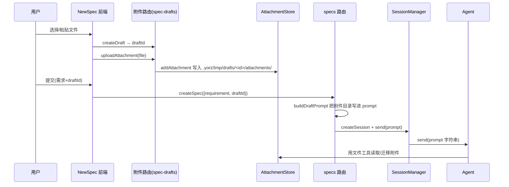
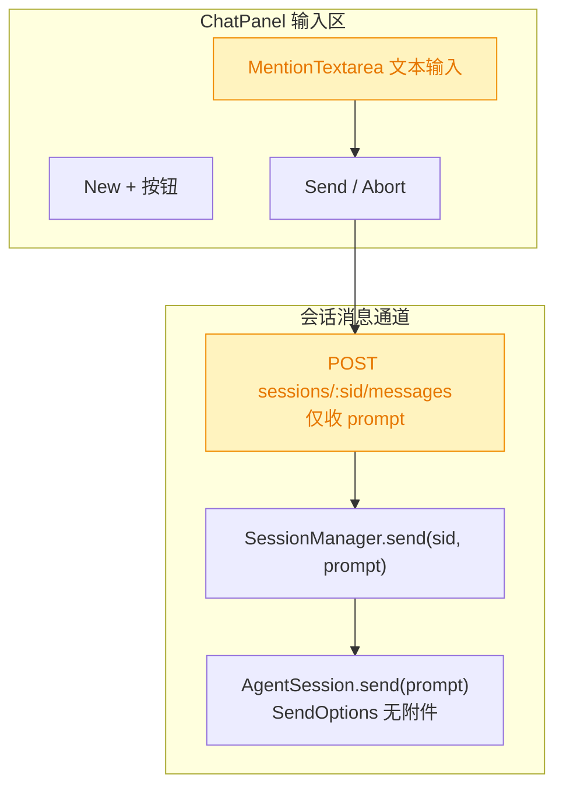
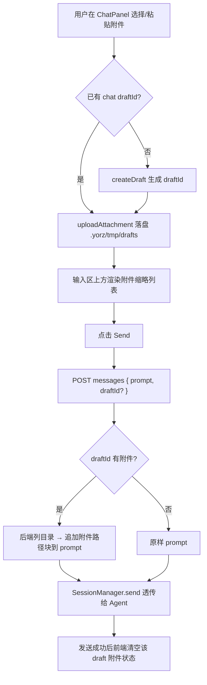
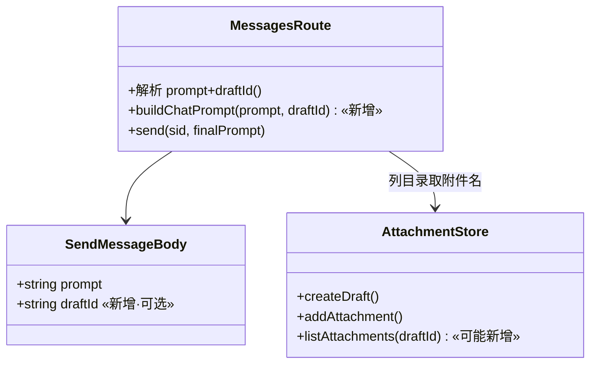

# ChatPanel 附件上传

## 1. 背景

`src/gui/src/components/ChatPanel.tsx` 是聊天面板，底部输入框当前仅支持文本输入（`MentionTextarea`）与 Send/Abort/New 三个按钮，无法携带附件。`src/gui/src/pages/NewSpec.tsx` 已实现较完整的附件能力（选择文件、粘贴图片、类型校验、上传/删除/重命名、预览），可作为参考蓝本。

## 2. 需求

在 ChatPanel 底部输入框右侧新增一个 `+` icon，允许用户：

1. 点击 `+` 选择附件，支持的文件类型参考 NewSpec（图片 / PDF / 文本 / Markdown）。
2. 同样参考 NewSpec 支持在输入区粘贴图片作为附件。
3. 最终把附件传递给 Agent。

附件可写入 `.yorz/tmp` 临时目录。

## 3. 现状分析

### 3.1 附件全链路（NewSpec 现有实现）

现有附件方案是 **「草稿目录写盘 + prompt 文本引用路径」** 模式：前端上传文件到 `.yorz/tmp/drafts/<draftId>/attachments/`，创建 spec 时把 `draftId` 传给后端，后端在**发给 Agent 的 prompt 文本里写出附件磁盘目录**，由 Agent 自己用文件工具读取/迁移。整个链路 **没有把图片二进制/多模态 image block 注入 Agent**，全靠磁盘路径 + Agent 的文件读写工具。

精确层：NewSpec / 附件 / 会话链路的路径与签名

前端（`src/gui/src/pages/NewSpec.tsx`）：

- 常量：`ACCEPT_MIME`、`MAX_FILE_SIZE=5MB`、`MAX_COUNT=10`、`ALLOWED_MIMES`（第 14-17 行）
- `DraftAttachment` 类型（第 21-30 行）；`classifyFile`（第 32-39 行）；`inferMimeIfMissing`（第 41-50 行）
- `ensureDraftId()` 懒创建（第 91-97 行）；`addFiles()` 校验+上传（第 121-184 行）
- 粘贴图片 `onPaste`（第 194-207 行，只取 `image/*` 并 `preventDefault`）；文件选择 `onFileInputChange`（第 186-192 行）
- 删除 `removeAttachment`（第 209-220 行）/ 改名 `commitRename`（第 227-238 行）
- 提交时 `body.draftId = did`（第 295-299 行）

前端 API（`src/gui/src/lib/api.ts`）：

- `AttachmentKind='image'|'pdf'|'text'`（第 36 行）；`AttachmentMeta`（第 38-44 行）
- `createDraft(pid)`（第 319-324 行）；`uploadAttachment(pid,draftId,file)`（第 325-340 行，FormData）；`deleteAttachment`（第 341-345 行）；`renameAttachment`（第 346-354 行）；`draftAttachmentUrl`（第 355-356 行）
- `createSession(pid,{title?,agentKind?})`（第 364-369 行）；`sendSessionMessage(pid,sid,prompt)`（第 374-382 行，body 仅 `{ prompt }`）

后端附件（`src/service/routes/spec-drafts.ts` + `src/service/attachment-store.ts`）：

- 附件根目录 `join(cwd,'.yorz','tmp','drafts')`（`attachment-store.ts:98`）；单 draft 目录 `<root>/<draftId>/attachments`（第 121-127 行）
- 限制：单文件 5MB、每 draft 10 个、TTL 24h（第 44-46 行）；`cleanupExpired()`（第 269-293 行）
- 命名 `allocateStoredName`（第 309-324 行）：占位图片名→`image-<uuid4>.<ext>`，其余 `sanitize`+`-<n>`
- 每 project 一个 `AttachmentStore`（`project-registry.ts:31,179`，`cwd=项目根`）

后端 Agent 消费（`src/service/routes/specs.ts`）：

- `buildDraftPrompt(type,requirement,draftId?)`（第 239-266 行）：`draftId` 存在时把 `.yorz/tmp/drafts/<draftId>/attachments/` 写进 prompt 并附迁移指令

### 3.2 ChatPanel 输入区现状 与 Agent 契约边界

ChatPanel 底部输入区仅有 `MentionTextarea` + 一行按钮（New `+`、Send/Abort 互斥）。发送走 `send()`/`sendFromDraft()` → `api.sendSessionMessage(pid, sid, prompt)`；草稿态首发先 `createSession` 再 `send`。**消息通道只接受 `prompt` 字符串**：路由 `POST .../sessions/:sid/messages` 仅解析 `body.prompt`（`sessions.ts:76-84`），`SessionManager.send(sid, prompt)` 也只透传字符串（`session-manager.ts:174-184`），Agent SDK 的 `SendOptions` 无附件入口。

精确层：ChatPanel 与会话通道关键位置

- ChatPanel 输入区渲染（`src/gui/src/components/ChatPanel.tsx` 第 769-823 行）；`send()`（第 497-516 行）；`sendFromDraft()`（第 524-553 行）；用户气泡刻意不走 markdown（第 729-738 行注释，常含 `@path`）
- `MentionTextarea` 已支持 `onPaste`（`src/gui/src/components/MentionTextarea.tsx:45,225`）；`@` 触发的是**项目内文件**补全（`listFiles`，第 118-121 行），不覆盖 `.yorz/tmp`
- 消息路由仅解析 `prompt`（`src/service/routes/sessions.ts:76-84`）；`SessionManager.send`（`src/service/session-manager.ts:174-184`）
- `.yorz/tmp` 已被 CLI 安装写入 `.gitignore`（`src/cli/install.ts:109-128`），新子目录无需再改忽略规则

## 4. 技术实现方案

### 4.1 总体思路

**复用 NewSpec 的「写盘 + prompt 引用路径」链路，最小化改动**：ChatPanel 复用现有 `AttachmentStore`（`createDraft` + `uploadAttachment`，落盘 `.yorz/tmp/drafts/<draftId>/attachments/`），发送消息时把该 draft 的附件路径清单**在后端拼进 prompt**（避免前端硬编码磁盘路径），Agent 用文件工具读取。**不扩展 Agent SDK 多模态契约**（成本高且与全项目模式不一致）。

聊天场景与 NewSpec 的差异：附件**不迁移**到 spec 目录，仅留在 `.yorz/tmp`（符合需求「临时目录」）；prompt 追加块只需告诉 Agent 附件的可读路径，不含「迁移」指令。

### 4.2 前端改造（ChatPanel + 可复用附件逻辑）

在 ChatPanel 输入区新增 `+` 图标按钮（隐藏 `<input type=file>`）+ 输入框 `onPaste` 支持粘贴图片 + 输入框上方附件缩略列表（缩略图/文件名/删除）。附件的 **校验（`classifyFile`/`inferMimeIfMissing`/大小/数量）、上传/删除、粘贴处理** 逻辑与 NewSpec 高度重叠，抽取为共享模块复用（推荐），避免两处维护漂移（见待确认问题 5.2）。

- 状态：`chatDraftId`、`attachments: DraftAttachment[]`，`onCleanup` 释放 `previewUrl`（复用 NewSpec 释放逻辑）。
- 发送门槛：Send 在有 `pending`/`failed` 附件时禁用或提示（复用 NewSpec 校验语义）。
- 发送成功后清空当轮附件与本地状态；`newSession()`/切换会话/切项目时一并清空。

### 4.3 后端改造（会话消息通道注入附件路径）

扩展 `POST .../sessions/:sid/messages` 请求体接受可选 `draftId`，由后端读取该 draft 的实际附件文件名并把可读路径块拼到 `prompt` 尾部后再 `send`。路径由后端 `AttachmentStore` 提供，**前端不拼磁盘路径**。

- `sendSessionMessage(pid, sid, prompt, draftId?)`（`api.ts`）新增可选参数并在 body 携带 `draftId`。
- 路由校验 `draftId` 格式（复用 `specs.ts` 的 `/^[a-zA-Z0-9-]{1,64}$/`），列出该 draft 附件文件名，构造类似 `buildDraftPrompt` 的追加块（聊天版不含「迁移」，仅给可读路径与 markdown 引用提示）。
- `AttachmentStore` 若无「按 draftId 列附件」的公开方法则新增只读方法。
- **影响面**：`MessagesRoute` 为 breaking（请求体/行为扩展，但 `draftId` 可选→对旧调用向后兼容）；`SendMessageBody`、`AttachmentStore` 为 affected。

### 4.4 兼容性与边界

- 无附件时行为完全不变（`draftId` 省略）。
- prompt 追加块会进入持久化 transcript，重载后用户气泡会显示该追加块（决策见 4.5）。
- 复用 draft 的 24h TTL 对聊天即时读取足够；不新增清理逻辑。
- 上传失败的附件从未落盘，后端列目录只会包含已成功文件；故 ChatPanel 仅在存在 `pending`（上传中）附件时禁用 Send，`failed` 项不阻断发送（仅展示错误）。
- ChatPanel 按钮行的「New 会话」按钮已占用 `Plus` 图标，附件按钮改用 `Paperclip` 图标以区分（语义即「+ 附件」）。
- i18n 复用现有 `newSpec.*` 附件文案键，避免新增多语言键，减小改动面。

### 4.5 已确认决策（消费用户批注）

用户批注已答复全部待确认问题，取值均为推荐项，据此定案：

1. **附件传递方式**：后端扩展 `messages` 接口接受 `draftId`，服务端列目录拼接附件路径到 prompt（路径由后端权威构造）。
2. **共享模块**：抽取共享 `createAttachments` 控制器（hook）+ `AttachmentList` 组件，NewSpec 与 ChatPanel 两处复用。
3. **追加块可见性**：允许出现在用户可见气泡（与持久化 transcript 一致、实现最简）。
4. **落盘目录**：复用 `.yorz/tmp/drafts/`（同一 `AttachmentStore`，24h TTL）。

### 4.6 验证后 UI 调整（变更重开）

用户在 dev 验证后提出两条 ChatPanel 输入区的交互调整（附件核心链路已验证生效）：

1. **附件按钮位置**：从下方动作行移到 `MentionTextarea` 右侧、与文本水平并列、垂直居中（`flex items-center` 包裹 textarea + 按钮；textarea `flex-1`，按钮 `shrink-0`）；`New`/`Send` 保留在下方动作行。
2. **缩略列表精简**：ChatPanel 上方列表去掉文件名/大小/类型文字，仅保留缩略图（图片）或 `PDF`/`TXT` 徽标，信息改为原生 `title` hover tooltip；删除按钮 hover 显现。
   - 实现方式：`AttachmentList` 新增 `compact` prop——`compact` 走紧凑 flex 缩略条（tooltip 承载信息），非 compact 保留原完整布局（名称/大小/类型/改名）。NewSpec 继续用完整布局，ChatPanel 用 `compact`。

### 4.7 验证后 UI 增强（二次变更重开）

用户二次验证后提出三条增强：

1. **Tooltip 组件化**：compact 缩略条改用项目内 Kobalte `Tooltip`（`ui/tooltip.jsx`）替代原生 `title`，hover 更快（`openDelay=150`、`closeDelay=0`）弹出信息。
2. **缩略图放大**：compact 缩略图由 `w-12 h-12` 调整为 `w-14 h-14`。
3. **图片点击预览弹窗**：新增 `ImagePreview` 组件（基于 Kobalte `Dialog`）——点击图片附件弹窗预览，图片最大宽高 `max-w-[80vw]`/`max-h-[80vh]` 并 `object-contain`；右上角关闭按钮；点击遮罩（Dialog 默认 `closeOnInteractOutside`）与 `Esc`（默认 `closeOnEscape`）均可关闭。compact 项的图片缩略图作为触发点（`cursor-zoom-in`），非图片仅 tooltip、不可预览。

## 5. 待确认问题

_暂无_

## 6. 任务清单

- [x] 新建 src/gui/src/lib/attachments.ts：抽取 DraftAttachment 类型、classifyFile/inferMimeIfMissing/常量与 createAttachments 控制器（校验/上传/删除/改名/粘贴/reset/hasPending/count，内部 onCleanup 释放 previewUrl）（验收：tsc --noEmit 通过）
- [x] 新建 src/gui/src/components/AttachmentList.tsx：从 NewSpec 抽取附件缩略列表 UI，接受 controller + busy + allowRename props（验收：tsc --noEmit 通过）
- [x] 重构 src/gui/src/pages/NewSpec.tsx 改用 createAttachments + AttachmentList，移除内联重复逻辑（验收：tsc --noEmit 通过、附件行为不变）
- [x] 扩展 src/gui/src/lib/api.ts 的 sendSessionMessage 增加可选 draftId 参数并在 body 携带（验收：tsc --noEmit 通过）
- [x] 在 src/gui/src/components/ChatPanel.tsx 集成 createAttachments：输入区上方渲染 AttachmentList、按钮行加 Paperclip 附件按钮(隐藏 file input)、MentionTextarea onPaste 接粘贴图片（验收：tsc --noEmit 通过）
- [x] ChatPanel 的 send/sendFromDraft 传 draftId 并在发送成功后 reset()；newSession/切项目时 reset()；Send 在 hasPending 时禁用（验收：tsc --noEmit 通过）
- [x] 扩展 src/service/routes/sessions.ts 的 POST messages：解析可选 draftId、校验 `/^[a-zA-Z0-9-]{1,64}$/`、列附件、buildChatPrompt 拼接附件路径块（图片 、其余 ，指向 .yorz/tmp/drafts/<id>/attachments 并注明无需迁移）后再 send（验收：tsc --noEmit 通过）
- [x] 运行类型检查与既有单测（验收：`node_modules/.bin/tsc --noEmit` 与 `vitest run` 通过或记录环境限制）
- [x] [变更重开] AttachmentList 新增 compact 模式（紧凑缩略条 + title tooltip，去文字信息），拆出 FullList 保留完整布局给 NewSpec（验收：tsc 无新错误）
- [x] [变更重开] ChatPanel 输入区改布局：Paperclip 附件按钮移到 MentionTextarea 右侧同行垂直居中，上方列表用 `<AttachmentList compact>`（验收：tsc 无新错误、重建 dist/gui 后 UI 生效）
- [x] [二次变更重开] compact 缩略条改用 Kobalte Tooltip 组件替代原生 title、缩略图放大到 w-14/h-14（验收：tsc 无新错误）
- [x] [二次变更重开] 新增 ImagePreview 组件（Kobalte Dialog，图片最大 80vw/80vh、右上角关闭、点击遮罩/Esc 关闭），compact 图片缩略图点击开预览（验收：tsc 无新错误、重建 dist/gui 后 UI 生效）

## 7. 执行记录

- 抽取共享层：新增 `src/gui/src/lib/attachments.ts`（`createAttachments` 控制器 + `DraftAttachment`/`classifyFile`/`inferMimeIfMissing`/`ACCEPT_MIME`/`MAX_COUNT` 等）与 `src/gui/src/components/AttachmentList.tsx`（缩略列表 UI，`allowRename` 门控改名）。验证：tsc 无新错误。
- 重构 NewSpec：`src/gui/src/pages/NewSpec.tsx` 删除内联附件逻辑，改用 `createAttachments` + `<AttachmentList allowRename>`；表单错误统一复用控制器 `error` 信号；行为等价。
- 前端 API：`src/gui/src/lib/api.ts` 的 `sendSessionMessage` 新增可选 `draftId`，仅在存在时写入请求体（对旧调用向后兼容）。
- ChatPanel 集成：`src/gui/src/components/ChatPanel.tsx` 新增 `createAttachments` 控制器；输入区上方渲染 `<AttachmentList>` + 错误行；按钮行左侧加 `Paperclip` 附件按钮（隐藏 `<input type=file>`）；`MentionTextarea` 接 `onPaste` 支持粘贴图片；`send`/`sendFromDraft` 透传 `draftId` 并在成功后 `reset()`；`newSession()`/切项目 effect 中 `reset()`；Send 在 `hasPending()` 时禁用。
- 后端注入：`src/service/routes/sessions.ts` 的 `POST .../sessions/:sid/messages` 解析可选 `draftId`，校验 `/^[a-zA-Z0-9-]{1,64}$/`，经 `p.attachments.listAttachments` 列目录并由新增 `buildChatPrompt` 拼接可读路径块（图片 ``、其余 ``，指向 `.yorz/tmp/drafts/<id>/attachments`，注明无需迁移）后再 `send`；无附件/无 draft 时退化为原 prompt。
- 验证：`node_modules/.bin/tsc --noEmit` 本次改动引入 0 条新错误（改动前后基线均为 17 条既有错误：`@/lib/cn` 别名仅 vite 解析、timeago 类型、既有测试/index.ts）；`vitest run` 289 通过，2 条失败仅为 `src/cli/__tests__/lint.test.ts` spawn 未构建的 `dist/cli/index.js`（该 worktree 未 `pnpm build`），与本改动无关。
- `yorz lint spec.md` errorCount=0。
- 收尾：任务清单非 manual 项全部完成，待确认问题为 `_暂无_`、无 `！！！` 批注、无 `[open]` 追加任务，标记 stage=done。
- [变更重开] 验证后 UI 调整：`AttachmentList` 拆为紧凑（`compact`：flex 缩略条 + 原生 `title` tooltip，删除按钮 hover 显现）与完整（`FullList`：缩略图 + 名称/大小/类型 + 改名）两套布局，NewSpec 用完整、ChatPanel 用 `compact`；`ChatPanel` 输入区将 `Paperclip` 附件按钮移入包裹 `MentionTextarea` 的 `flex items-center` 行、textarea `flex-1`、按钮 `shrink-0` 实现右侧垂直居中，`New`/`Send` 保留下方动作行。验证：tsc 引入 0 条新错误（仍 17 条既有基线）；`pnpm run build:gui` 成功重建 dist/gui；运行中的 7423 守护进程（本 worktree `dist/cli`，`--no-register-cwd`）托管新 dist/gui，浏览器硬刷新即生效。仅前端改动，无需重启 serve。
- [二次变更重开] 验证后 UI 增强：(1) compact 缩略条把原生 `title` 换成 Kobalte `Tooltip`（`openDelay=150`/`closeDelay=0`），信息经 `infoText` 由 `TooltipContent` 展示；(2) compact 缩略图 `w-12 h-12` → `w-14 h-14`；(3) 新增 `src/gui/src/components/ImagePreview.tsx`（Kobalte `Dialog`：`Portal`+`Overlay`+`Content`+`CloseButton`，图片 `max-w-[80vw]`/`max-h-[80vh]` `object-contain`、右上角关闭、遮罩点击与 `Esc` 关闭），`AttachmentList` compact 用本地 `previewOpen/Src/Alt` 信号驱动，图片缩略图点击 `openPreview`（`cursor-zoom-in`），非图片仅 tooltip。验证：tsc 引入 0 条新错误（仍 17 条既有基线，`Dialog.*`/`Tooltip` API 均通过）；`pnpm run build:gui` 重建成功；7423 守护进程存活，硬刷新生效。仅前端改动，无需重启 serve。
