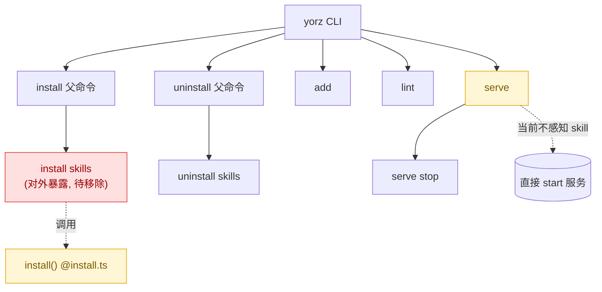
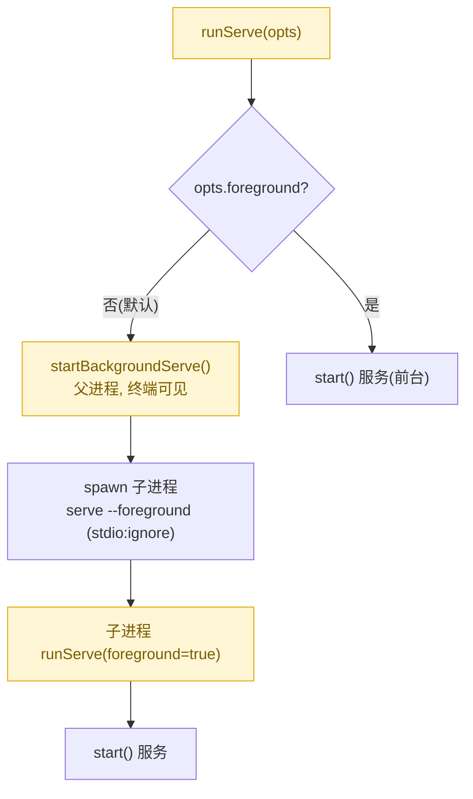
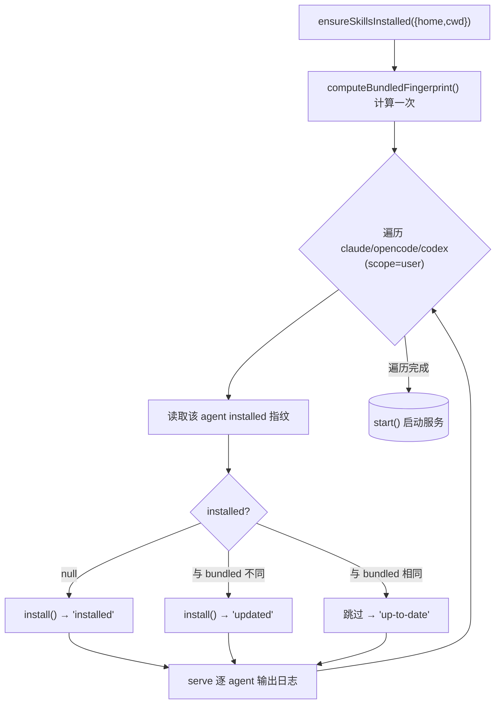
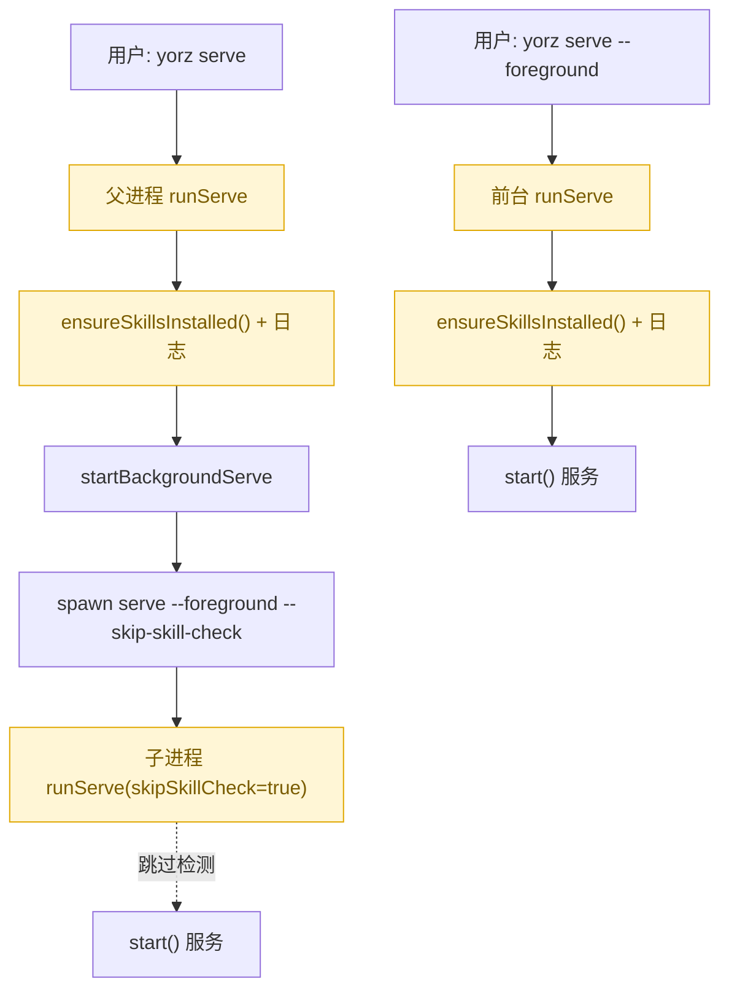

# yorz serve 自动安装 skill 并移除 install skills 子命令

## 1. 背景

当前用户必须先手动执行 `yorz install skills` 把 `yorz-spec` skill 安装到目标 Agent（Claude / OpenCode / Codex）后，`yorz serve` 拉起的服务与 Agent 才能正常协作。若用户忘记安装，或 CLI 升级后 skill 内容已更新但本地仍是旧版本，服务体验会出现"skill 缺失/过期"的隐性问题。

## 2. 需求

来源需求（原文）：

> `@src/cli/index.ts`
> `yorz serve` 检查 skills 是否安装，如果没有安装或 skills 非最新，则自动 install skill，并输出日志后再启动服务；
> 移除 `yorz install skills` 子命令，不再暴露到外部。

拆解：

1. `yorz serve` 在启动服务之前，检测 `yorz-spec` skill 是否已安装、是否为最新版本。
2. 若未安装或非最新，自动执行安装/更新，并向用户输出可读日志，然后再启动服务。
3. 从 CLI 中移除 `yorz install skills` 子命令，使其不再对外暴露（保留内部 `install()` 供 serve 调用）。

## 3. 现状分析

### 3.1 CLI 命令结构现状

`src/cli/index.ts` 现有对外命令：`install skills`、`uninstall skills`、`add`、`lint`、`serve`（含 `serve stop`）。其中 `install`/`uninstall` 均为父命令 + `skills` 子命令的两级结构；`install skills` 直接调用 `install()`（`src/cli/install.ts`）把打包进制品的 skill 文件写入目标 Agent 的 skills 目录。

精确层：关键代码位置

- `src/cli/index.ts:42-73` — `installCmd` 父命令 + `install skills` 子命令（action 内调用 `install()`、打印 installed/overwritten 与 gitignore 日志）。
- `src/cli/index.ts:75-95` — `uninstallCmd` 父命令 + `uninstall skills` 子命令（本次不改）。
- `src/cli/index.ts:143-178` — `serve` 命令与 `serve stop`，action 内 `await runServe(...)`。
- `src/cli/index.ts:10` — `import { INSTALL_SCOPE_DEFAULT, installScopeTip } from './defaults.js'`；`installScopeTip` 仅被 `install skills` action 使用（`index.ts:59`）。
- `src/cli/defaults.ts:11-14` — `installScopeTip()`；`src/cli/__tests__/install.test.ts:132-150` 对其单测。

### 3.2 install() 与 skill 制品现状

`install()`（`src/cli/install.ts`）通过 `import.meta.glob` 在构建期把 `src/skill/yorz-spec/**/*.{md,json}` 内联为字符串常量 `SKILL_FILES`，安装时先整体 `rm` 目标 `yorz-spec/` 目录再逐个写入。**当前没有任何"版本/指纹"标记**：既没有把版本写进安装目录，也没有对比机制——`index.json` 内有 `"version": 2`（模块清单版本，非 skill 内容版本），但从未被安装/对比逻辑消费。因此"skill 是否为最新"目前无法判定。

精确层：install() 关键实现

- `src/cli/install.ts:12-16` — `import.meta.glob('../skill/yorz-spec/**/*.{md,json}', {eager,query:'?raw',import:'default'})`。
- `src/cli/install.ts:60-93` — `install()`：`resolveSkillsDir` → `rm(skillDir)` → `mkdir` → 逐文件 `writeFile` → `ensureTmpIgnored`。
- `src/cli/install.ts:19-25` — `SKILL_DIR_NAME = 'yorz-spec'`。
- `src/cli/adapters/claude.ts:5-10` — user scope=`<home>/.claude/skills`，project scope=`<cwd>/.claude/skills`。
- `.yorz/config.json` 含 `agent.kind`（本机为 `claude`）；但 `serve` 目前不读取它决定安装目标。

### 3.3 serve 启动路径现状

`runServe()`（`src/cli/serve.ts`）分两路：`--foreground` 直接 `start()` 服务；默认 background 模式在**父进程**内 `startBackgroundServe()` 用 `spawn(process.execPath, [entry,'serve',...backgroundArgs])` 拉起一个 `--foreground` 子进程（`stdio:'ignore'`、`detached`）。也就是说 background 模式下 `runServe` 会被执行两次：父进程（用户终端可见日志）+ 子进程（无输出）。skill 检测若放错位置会重复执行。

精确层：serve 关键实现

- `src/cli/serve.ts:38-72` — `runServe()`：`!opts.foreground` → `startBackgroundServe`；否则 `start()` + 注册 runtime + 信号处理。
- `src/cli/serve.ts:74-121` — `startBackgroundServe()`：`spawn(process.execPath,[entry,'serve',...backgroundArgs(opts)],{detached,stdio:'ignore'})`。
- `src/cli/serve.ts:123-131` — `backgroundArgs()` 组装子进程参数（本次需新增"跳过 skill 检测"内部标记）。
- `src/cli/__tests__/serve.test.ts:8-27` — 对 `backgroundArgs()` 精确断言参数序列（新增标记需同步更新该测试）。

## 4. 技术实现方案

总体思路：在 `install.ts` 增加"指纹（fingerprint）"能力用于判定"已安装 / 是否最新"，新增 `ensureSkillsInstalled()` 负责"缺失或过期则安装并输出日志"；在 `serve` 启动服务前调用该函数（仅在会输出日志的进程执行一次）；从 CLI 移除 `install skills` 子命令。

### 4.1 skill 指纹与"是否最新"判定

- 在 `install.ts` 新增 `computeBundledFingerprint()`：对 `resolveSkillFiles()` 得到的文件按 `relPath` 排序，用 `relPath + '\0' + content` 拼接后做 SHA-256，得到构建期打包内容的稳定指纹（内容变则指纹变，无需人工维护版本号）。
- 新增 `readInstalledFingerprint(skillDir)`：读取已安装目录内的同名文件并用相同算法计算指纹；`SKILL.md` 不存在时返回 `null`（视为"未安装"）。
- 判定：`installed === null` → 未安装；`installed !== bundled` → 非最新；相等 → 最新。（不依赖 `index.json.version`，避免人工漏改。）

### 4.2 ensureSkillsInstalled()（新增，供 serve 调用）

**决策（批注定稿）：** serve 对全部 agent（`claude` / `opencode` / `codex`）都执行安装，统一 `scope=user`（贴合"全局后台服务 → 用户级 skill"）。

签名（拟）：`ensureSkillsInstalled({ home, cwd }): Promise<Array<{ agent: AgentName; status: 'installed' | 'updated' | 'up-to-date'; path: string }>>`。

逻辑：

1. bundled 指纹只需计算一次（内容对所有 agent 相同）。
2. 遍历 `['claude','opencode','codex']`，对每个 agent 以 `scope=user` 解析 `skillDir`，读取 installed 指纹。
3. `null` → 调用 `install()`，`status='installed'`；不同 → 调用 `install()`，`status='updated'`；相等 → 不安装，`status='up-to-date'`。
4. 收集每 agent 的 `{agent,status,path}` 返回，由调用方（serve）逐条输出日志。

精确层：日志文案（拟，逐 agent）

- installed：`[skill][<agent>] yorz-spec not found; installing to <path>` → 完成后 `[skill][<agent>] installed: <path>`。
- updated：`[skill][<agent>] yorz-spec is outdated; updating <path>` → 完成后 `[skill][<agent>] updated: <path>`。
- up-to-date：`[skill][<agent>] yorz-spec is up to date`（简短一行，避免噪音）。

### 4.3 在 serve 启动前接入检测

- 在 `runServe()` 中，于分流 background/foreground **之前**、真正启动服务之前调用 `ensureSkillsInstalled({ home, cwd })` 并逐 agent 打印上述日志。
- 避免 background 模式重复执行：background 父进程执行检测并输出日志；`spawn` 出的子进程通过 `backgroundArgs()` 追加内部标记 `--skip-skill-check`（`serve` 命令新增隐藏/内部 option），子进程 `runServe` 检测到该标记则跳过 `ensureSkillsInstalled()`。
- 相应更新 `src/cli/__tests__/serve.test.ts` 对 `backgroundArgs()` 的断言（新增 `--skip-skill-check`）。

### 4.4 移除 install 命令（整体移除）

**决策（批注定稿）：** 整体移除 `install` 命令，`yorz install` 不再存在（含父命令与 `skills` 子命令）。

- 删除 `src/cli/index.ts:42-73` 的 `installCmd` 及其 `skills` 子命令，`yorz install` 完全消失。
- `ensureSkillsInstalled` 从 `serve.ts` 内 `import { install } from './install.js'` 调用；`index.ts` 不再直接 import `install`。
- `installScopeTip` 在 `index.ts` 内已无引用，从其 import 去掉；`defaults.ts` 中的定义与其单测保留，不破坏 `install.test.ts`。`INSTALL_SCOPE_DEFAULT`、`parseAgents`、`parseScope` 仍被 `uninstall skills` 使用，保留。
- `uninstall skills` 保持不变，作为用户手动移除 skill 的出口。

## 5. 待确认问题

_暂无_

## 6. 任务清单

- [x] 在 src/cli/install.ts 新增 computeBundledFingerprint()：对 resolveSkillFiles() 结果按 relPath 排序，SHA-256(relPath + '\0' + content) 拼接得稳定指纹（验收：install.test.ts 覆盖，内容变则指纹变；tsc 通过）
- [x] 在 src/cli/install.ts 新增 readInstalledFingerprint(skillDir)：读取已安装同名文件用相同算法计算指纹，SKILL.md 不存在返回 null（验收：install.test.ts 覆盖未安装返回 null、已安装匹配 bundled）
- [x] 在 src/cli/install.ts 新增 ensureSkillsInstalled({home,cwd})：对 claude/opencode/codex（scope=user）逐 agent 判定并按需 install()，返回 Array<{agent,status,path}>（验收：install.test.ts 覆盖 installed/updated/up-to-date 三态）
- [x] 在 src/cli/serve.ts 的 ServeCommandOptions 增加 skipSkillCheck 字段，runServe 在 background/foreground 分流之前于 !skipSkillCheck 时调用 ensureSkillsInstalled 并逐 agent 打印状态日志（验收：tsc --noEmit 通过）
- [x] 在 src/cli/serve.ts 的 backgroundArgs() 追加 --skip-skill-check，使 spawn 出的子进程跳过检测（验收：serve.test.ts backgroundArgs 断言更新后通过）
- [x] 在 src/cli/index.ts 的 serve 命令新增隐藏 option --skip-skill-check 并透传到 runServe（验收：yorz serve --help 不显示该项；构建通过）
- [x] 在 src/cli/index.ts 整体移除 install 父命令与 install skills 子命令，并移除无用 import（install、installScopeTip）（验收：grep 无 installCmd；yorz install 不存在；tsc 通过）
- [x] 更新 src/cli/__tests__/serve.test.ts 中 backgroundArgs 断言新增 --skip-skill-check（验收：vitest serve.test 通过）
- [x] 在 src/cli/__tests__/install.test.ts 增加指纹与 ensureSkillsInstalled 单测（验收：vitest install.test 通过）
- [x] 运行 typecheck、单测与构建并记录结果（验收：全部命令通过）
- [x] 同步更新 README.md / README_CN.md：移除 `yorz install skills` 相关内容，补充 serve 自动安装说明（验收：grep 无 `yorz install skills`；步骤编号连续无断裂）

## 7. 执行记录

- install.ts：新增 `createHash` 导入、`AUTO_INSTALL_AGENTS` 常量、`computeBundledFingerprint()`/`readInstalledFingerprint()`/`fingerprintFiles()` 与 `ensureSkillsInstalled()`（返回 `EnsureSkillsResult[]`，逐 agent installed/updated/up-to-date）。指纹算法 SHA-256(relPath+'\0'+content+'\0')，缺失文件按空串计入使部分安装判为过期。验证：install.test.ts 新增 25 条相关断言通过。
- serve.ts：`ServeCommandOptions` 增加 `skipSkillCheck`；`runServe` 在 background/foreground 分流前于 `!skipSkillCheck` 时调用新增私有 `ensureSkillsInstalledWithLog(cwd)`（`homedir()` 作 home），逐 agent 打印 `[skill][<agent>] ...`；`backgroundArgs()` 追加 `--skip-skill-check` 使子进程跳过重复检测。验证：serve.test.ts backgroundArgs 断言更新后通过。
- index.ts：整体删除 `installCmd` 父命令与 `install skills` 子命令；移除 `install`、`installScopeTip` 导入（保留 `Option`、`INSTALL_SCOPE_DEFAULT`、`homedir`、`parseAgents/parseScope` 供 uninstall 使用）；serve 命令新增隐藏 `--skip-skill-check`（`Option(...).hideHelp()`）并透传 `runServe`。验证：`node dist/cli/index.js install` → unknown command；`serve --help` 不含 skill 项。
- 测试与构建：`vitest run` 全量 298 passed；`pnpm run build:cli` 构建成功。`tsc --noEmit` 仅剩 src/gui、src/service 既有无关报错，本次改动的 src/cli 文件无新增错误。
- 收尾：任务清单全部完成，待确认问题 `_暂无_`，无 `！！！` 批注、无 `## 追加任务` `[open]` 条目，标记 stage=done。
- 文档同步（扩展）：README.md 删除「Step 3 — Install the Skill」并将「Start Coding」提升为 Step 3，Step 1 补充"serve 启动时自动安装/更新 skill"说明，命令参考表移除 `yorz install skills` 行；README_CN.md 同步（删除「第三步 — 安装 Skill」、第一步补充自动安装说明、命令表移除对应行）。验证：`grep "install skills"` 仅剩 `uninstall skills`；无 `第四步/Step 4` 断裂。保留 `yorz uninstall skills` 作为手动卸载出口。
