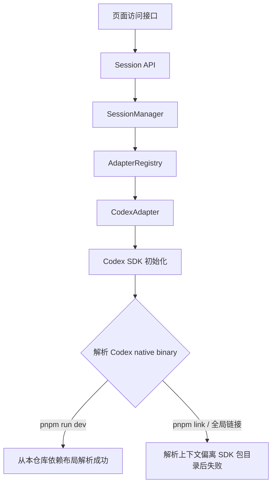
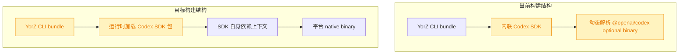

# 修复 pnpm link 下 Codex CLI binary 解析失败

## 1. 背景

用户通过 `pnpm link` 使用 YorZ 项目后启动 `yorz serve`，访问页面接口时报错：

```json
{
  "error": "Internal Server Error",
  "message": "Unable to locate Codex CLI binaries. Ensure @openai/codex is installed with optional dependencies."
}
```

相同项目使用 `pnpm run dev` 启动时接口正常。

## 2. 需求

修复 `pnpm link` 后通过 `yorz serve` 启动服务时，Codex 相关页面接口因无法定位 Codex CLI binary 而返回 500 的问题，并保持 `pnpm run dev` 行为正常。

## 3. 现状分析



当前项目 `.yorz/config.json` 配置默认 Agent 为 `codex`。页面访问会触发 Session 相关接口，其中 `SessionManager.listSessions()` 会遍历 `claude`、`codex`、`opencode` 三种 adapter；命中 `codex` 时创建 `CodexAdapter`，其构造函数立即执行 `new Codex()`。

YorZ 的 CLI 通过 Vite 打包为 `dist/cli/index.js`。现有 `vite.config.ts` 外部化了 Hono、Commander、Mermaid 等依赖，但没有外部化 `@openai/codex-sdk`，导致 Codex SDK 的实现被内联进 YorZ bundle。

Codex SDK 内部会用 `createRequire(import.meta.url)` 动态解析 `@openai/codex/package.json` 与当前平台 optional dependency，例如 macOS arm64 下的 `@openai/codex-darwin-arm64`。被内联后，`import.meta.url` 变成 YorZ bundle 文件位置，不再是 SDK 自己的包目录；在 `pnpm link` / 全局链接布局下，这个动态解析可能找不到 SDK 传递依赖及其 optional binary，于是接口返回 500：

`Unable to locate Codex CLI binaries. Ensure @openai/codex is installed with optional dependencies.`

<details>
<summary>精确层：相关位置</summary>

- `src/service/routes/sessions.ts`：Session 列表、消息、spec session 探测等接口会进入 `ProjectInstance.sessions`。
- `src/service/session-manager.ts`：`listSessions()` 遍历所有内置 agent kind，并通过 registry 获取 adapter。
- `src/service/agent-sdk/registry.ts`：`codex` 分支创建 `CodexAdapter`。
- `src/service/agent-sdk/codex-adapter.ts`：构造函数中执行 `this.codex = new Codex()`。
- `vite.config.ts`：`rollupOptions.external` 未包含 `@openai/codex-sdk`。
- `dist/cli/index.js`：当前构建产物中可看到 Codex SDK 的 `findCodexPath()` 与报错字符串，证明 SDK 已被内联。

</details>

## 4. 技术实现方案



方案采用最小构建配置修复：在 `vite.config.ts` 的 `rollupOptions.external` 中加入 `@openai/codex-sdk`，让 CLI bundle 保留对 Codex SDK 的运行时 import，而不是把 SDK 源码内联进 YorZ 单文件 bundle。

这样 Codex SDK 运行时的 `import.meta.url` 会恢复为 SDK 包自身位置，`createRequire(import.meta.url)` 能沿 SDK 的真实依赖图解析 `@openai/codex` 和平台 optional dependency。`pnpm run dev` 继续从本仓库构建产物启动；`pnpm link` 后的 `yorz serve` 则不再依赖 YorZ bundle 位置去猜测 Codex SDK 的传递依赖。

验证策略：

- 执行 `pnpm run build:cli`，确认 CLI 可构建。
- 检查 `dist/cli/index.js` 不再包含 Codex SDK 内部报错字符串，证明 SDK 未被内联。
- 检查 `dist/cli/index.js` 保留 `@openai/codex-sdk` import，证明运行时会加载包依赖。
- 执行相关单测，覆盖 serve 参数和 SessionManager adapter 遍历等现有行为不被破坏。

<details>
<summary>精确层：候选实现点</summary>

- 修改 `vite.config.ts` 的 `rollupOptions.external` 数组，加入字符串项 `@openai/codex-sdk`。
- 可选检查命令：`rg "Unable to locate Codex CLI binaries" dist/cli/index.js` 应无匹配。
- 可选检查命令：`rg "@openai/codex-sdk" dist/cli/index.js` 应有匹配。

</details>

## 5. 待确认问题

_暂无_

## 6. 任务清单

- [x] 更新 `vite.config.ts` 外部化 `@openai/codex-sdk`（验收：CLI 构建产物不再内联 Codex SDK 的 binary 查找报错字符串）
- [x] 运行构建与回归验证（验收：`pnpm run build:cli`、相关单测和 bundle 字符串检查通过）

## 7. 执行记录

- 2026-07-15 19:20:52：新建 spec，进入 plan 阶段。
- 2026-07-15 19:22:56：完成 plan，待确认问题为空；生成任务清单并进入 execute 阶段。
- 2026-07-15 19:23:37：已在 `vite.config.ts` 外部化 `@openai/codex-sdk`；`pnpm run build:cli` 通过，`dist/cli/index.js` 保留 `@openai/codex-sdk` import，且不再包含 Codex SDK 的 binary 查找报错字符串。
- 2026-07-15 19:23:58：执行 `pnpm vitest run src/cli/__tests__/serve.test.ts src/service/__tests__/session-manager.test.ts`，2 个测试文件共 10 个用例通过；全部任务完成，标记 done。
