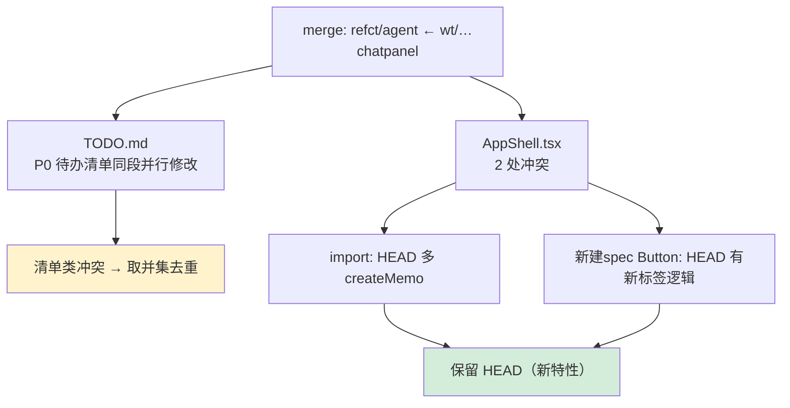

# Spec: 解决 wt/src-gui-src-components-chatpanel-tsx 合并冲突

## 1. 合并上下文

> 由 service 写入，merge-worktree skill 在 finalize 阶段按此 yaml 块解析参数；勿手工编辑。

```yaml
mainProjectId: yorz-6f1f9f
worktreeProjectId: wt-src-gui-src-components-chatpanel-tsx-fa3f81
branch: wt/src-gui-src-components-chatpanel-tsx
wtPath: /Users/fenghen/my-space/YorZ.wt/wt__src-gui-src-components-chatpanel-tsx
mainPath: /Users/fenghen/my-space/YorZ
defaultMergeCommitMessage: "feat(wt/src-gui-src-components-chatpanel-tsx): merge from worktree"
globalConfigPath: /Users/fenghen/.config/yorz/projects.json
```

## 2. 背景

worktree 分支 `wt/src-gui-src-components-chatpanel-tsx` 合并回主项目时出现冲突，需要在主项目工作区内解决，最终保留两边的核心意图，必要时分别确认；冲突全部修复后由 merge-worktree skill 自动完成 `git commit`、移除 worktree、清理 registry 条目。

### 2.1 冲突文件

- `TODO.md`
- `src/gui/src/AppShell.tsx`

### 2.2 近 30 天内涉及冲突文件的 commit（按文件分组）

**`TODO.md`**

- `32cf47f` 2026-07-15 · Test · feat: yorz serve 自动安装 skills
- `377e205` 2026-07-15 · Test · refct: 移动 新建spec 按钮位置
- `ad223ad` 2026-07-14 · Test · refct: 优化 chat 、 spec 详情页的交互体验
- `0ef2ff5` 2026-07-14 · Test · fix: 修复 GUI 页面与交互 bug：review 页内部独立滚动、spec 页面包屑与 header 清理、追加任务弹窗定位；追加修复 chat 面板发送/终止按钮随当前 session 自愈、英文 time ago 简写、session 列表 header 显示执行中数量、列表默认折叠。
- `04f9d34` 2026-07-12 · Test · refct: 将服务端对 Agent 的命令行代理重构为基于各 Agent SDK 的统一 API，并把 GUI 项目页改为项目列表/Chat/内容三列可折叠布局，Chat 面板支持 session 新建与切换。
- `0b02f1c` 2026-07-11 · Test · refct: 重构 GUI：引入 shadcn-solid + Tailwind 替代手写组件与 CSS，lucide-solid 替代 Unicode 图标，i18next 实现中英文国际化。
- `51fdc95` 2026-07-07 · Test · feat: publish to npm
- `559d6d0` 2026-07-06 · hughfenghen · refct: SSE 接口复用连接
- `2fde5f1` 2026-07-05 · hughfenghen · refct: 优化 skill 流程
- `c2b26d2` 2026-07-03 · hughfenghen · feat: 取消追加任务字符数限制
- `7467332` 2026-07-02 · hughfenghen · refct: 优化 spec 图形表达
- `7eb5104` 2026-07-02 · hughfenghen · refct: 优化 skill
- `cbbf076` 2026-07-02 · hughfenghen · feat: 手动移除 wt 项目，同时删除文件目录
- `e643b60` 2026-07-01 · hughfenghen · feat: 新增 spec md / review md 内容 lint 命令（260701.feat.spec-md-content-lint）
- `8f6378f` 2026-06-30 · hughfenghen · refct: 重构 spec review 工作流为 Agent 主动驱动的结构化 review + git ops
- `839c848` 2026-06-30 · hughfenghen · chore: 更新 spec 执行记录、touched-files 与 TODO
- `5cf4856` 2026-06-29 · hughfenghen · feat(260628.feat.agent-worktree-workflow): 为 Agent 并行开发提供 git worktree 工作流：新建 spec 可勾选「新开项目并行」自动建 worktree 并注册为 YorZ 项目；worktree 项目列表页支持「合入主项目」
- `a19aa9e` 2026-06-28 · hughfenghen · refct: 列表页样式

**`src/gui/src/AppShell.tsx`**

- `377e205` 2026-07-15 · Test · refct: 移动 新建spec 按钮位置
- `04f9d34` 2026-07-12 · Test · refct: 将服务端对 Agent 的命令行代理重构为基于各 Agent SDK 的统一 API，并把 GUI 项目页改为项目列表/Chat/内容三列可折叠布局，Chat 面板支持 session 新建与切换。
- `d2c117c` 2026-07-11 · Test · fix: 修复 GUI 三处问题：review 页容器不应整体滚动而由文件列表/文档区各自独立滚动；spec 相关页增加面包屑并清理详情页 header 重复的 specId 与 summary 边距；追加任务弹窗溢出到页面左侧、应定位在按钮正下方。
- `0b02f1c` 2026-07-11 · Test · refct: 重构 GUI：引入 shadcn-solid + Tailwind 替代手写组件与 CSS，lucide-solid 替代 Unicode 图标，i18next 实现中英文国际化。
- `984ea23` 2026-06-25 · hughfenghen · fix(260624.fix.project-list-sidebar): 修复 YorZ GUI 左侧项目列表三处问题：切换项目时 specs API 仍带旧项目 ID（落地 C1：所有 project-scoped api 显式传 pid）、侧栏随主面板滚动、移除 Sid
- `5738d45` 2026-06-24 · hughfenghen · feat(260624.feat.multi-project-management): 引入多项目管理：全局配置记录托管项目，serve CLI 可在任意目录运行，URL 路由加 project-id 前缀，GUI 左侧新增可折叠项目导航面板。
- `8acfb8c` 2026-06-20 · hughfenghen · feat: 待确认面板UI收尾与新建spec表单交互修复
- `a544b8c` 2026-06-18 · hughfenghen · feat: 全局 Agent 流式输出面板与取消支持
- `72ce39d` 2026-06-16 · hughfenghen · feat: cli serve

### 2.3 近 30 天的主项目 merge commit（参考）

- `145e292` 2026-07-06 · Test · feat(wt/worktree): merge from worktree
- `285cdfe` 2026-07-06 · Test · feat(wt/git-worktree-opencode-agent-cwd-src-serv): merge from worktree
- `f227f44` 2026-07-05 · hughfenghen · feat(wt/gui-worktree): merge from worktree
- `a923db0` 2026-07-01 · hughfenghen · feat(wt/gui-spec-markdown-x-checkbox): merge from worktree
- `79b0a60` 2026-06-29 · hughfenghen · feat(wt/agent-agent-agent): merge from worktree

## 3. 现状分析

主项目当前处于 `merge` 未完成状态（`refct/agent` 分支合入 `wt/src-gui-src-components-chatpanel-tsx`），2 个文件带 `<<<<<<<` 冲突标记。wt 分支真实意图是「chat 面板支持粘贴图片/附件」（已随合并带入 `ChatPanel.tsx`、`AttachmentList.tsx`、`ImagePreview.tsx` 等新增文件，无冲突）；两处冲突均为 wt 分叉点较早、与主线并行演进导致的“同段落差异”，与附件功能本身无关。

冲突全景（表层认知层）：



<details><summary>精确层：冲突位置与两侧差异</summary>

- `TODO.md` L8–L29：`## P0` 待办列表 + 归档 `[fixed]` 代码块。
  - HEAD 独有项：`yorz serve 检查并自动 install skill`、`Agent 更新 spec 文档…滚动条重置/问题弹窗/双 session 竞争`。
  - wt 独有项：`chat 输入框文件补全时 esc 关闭弹窗，但 input 不要失焦`、`spec 放到右上角 页面header，随时触达`；`serve 检查并自动 install skill`（HEAD 同义更完整）。
  - 共有项：`追加任务、批注，等用户输入内容容易破坏文档结构一致性`；末尾 `[fixed]` 归档代码块（内容等价）。
- `src/gui/src/AppShell.tsx` L2–L6（import）：HEAD 为 `Show, createEffect, createMemo, …`，wt 缺 `createMemo`；而 `createMemo` 被 L27 `onNewSpecPage` 使用。
- `src/gui/src/AppShell.tsx` L48–L59（新建 spec Button）：HEAD 版含 `target={onNewSpecPage() ? '_blank' : undefined}` 等在已处于新建页时开新标签的逻辑（commit `377e205`）；wt 版为分叉前的简化写法。

</details>

## 4. 技术实现方案

原则：附件功能相关的新增文件已无冲突自动带入，仅需解决两处“并行演进”冲突，保留双方真实意图、不丢弃任一有效待办。

1. **`AppShell.tsx`（两处）** — 均保留 HEAD 侧：wt 分支未有意改动“新建 spec 按钮”，其差异纯属旧基线；HEAD 的 `createMemo` 与 `onNewSpecPage`/`target=_blank` 是成对的新特性，必须整体保留，否则 `createMemo` 未导入会编译报错。
2. **`TODO.md`（一处）** — 清单类冲突取并集：合并双方 P0 待办，`serve install skill` 保留 HEAD 更完整措辞、共有项与 `[fixed]` 归档块各保留一份；顺序为「HEAD 项 → wt 独有项 → 共有项」。
3. **收尾** — `git add` 两个文件标记冲突已解决；本 spec 不执行 `git commit`/清理 worktree（由 merge-worktree skill 依 1. 合并上下文自动 finalize）。

验证：解决后仓库无残留 `<<<<<<<`/`=======`/`>>>>>>>` 标记；`git diff --diff-filter=U` 为空；`src/gui` 若可用则 `tsc --noEmit` 通过（`createMemo` 已导入）。

## 5. 待确认问题

_暂无_

## 6. 任务清单

- [x] 解决 src/gui/src/AppShell.tsx 两处冲突，均保留 HEAD 侧（验收：文件无冲突标记，import 含 createMemo）
- [x] 解决 TODO.md 冲突，P0 待办取并集去重、保留一份 [fixed] 归档块（验收：文件无冲突标记，双方独有待办均在列）
- [x] git add 两个冲突文件标记为已解决（验收：git diff --diff-filter=U 输出为空）

## 7. 执行记录

- 2026-07-15 由 worktree 合并失败触发新建本 spec；合并上下文与冲突清单已写入 1 / 2.1 / 2.2 / 2.3。
- 2026-07-15 18:54 完成 plan/tasks：分析 2 文件共 3 处冲突，判定 AppShell 保留 HEAD、TODO.md 取并集，无需人工抉择，生成任务清单。
- 2026-07-15 18:54 execute：AppShell.tsx 两处冲突均保留 HEAD（import 含 createMemo、新建 spec 按钮保留 target=_blank 逻辑）；TODO.md P0 待办取并集去重、[fixed] 归档块保留一份。验证：`grep -E '^(<<<<<<<|=======|>>>>>>>)'` 无残留；`git add` 两文件后 `git diff --diff-filter=U` 为空。
- 2026-07-15 18:54 任务全部完成，标记 done。冲突已解决且 add，待 merge-worktree skill 按「1. 合并上下文」执行 git commit 与 worktree 清理。
