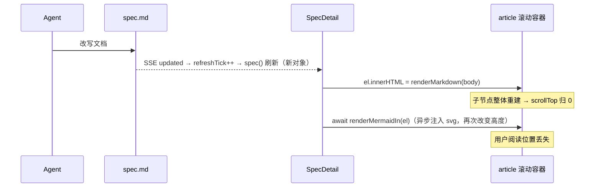
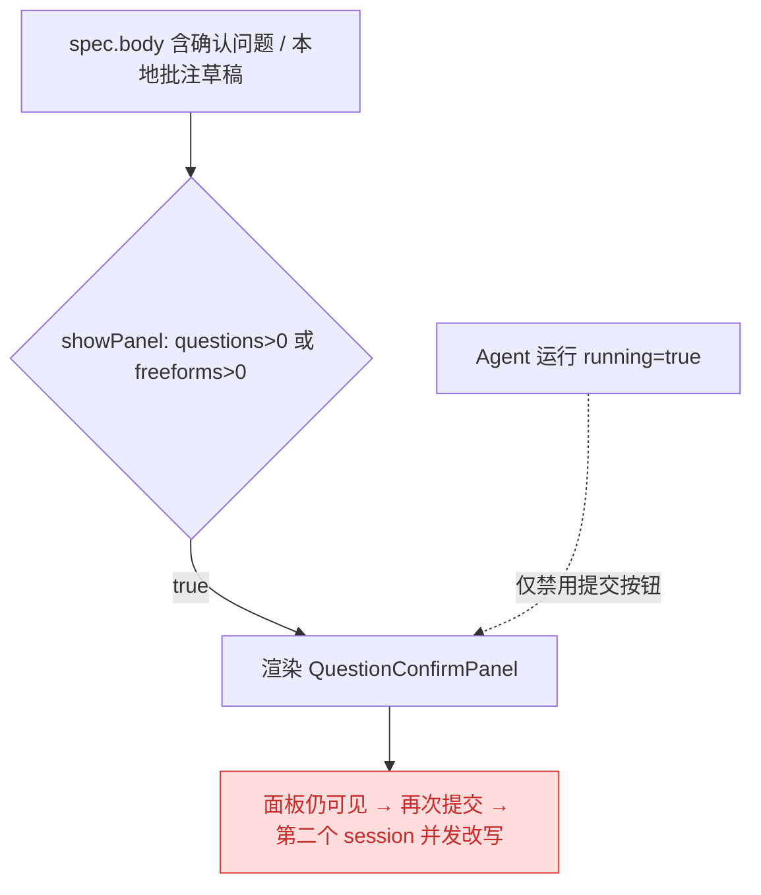
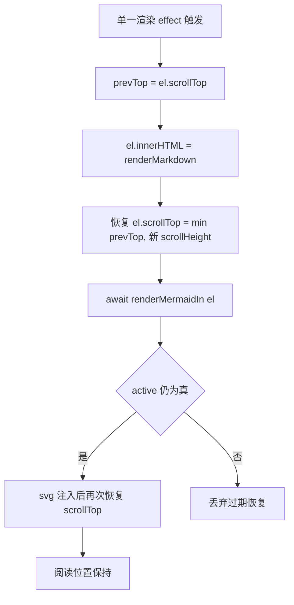
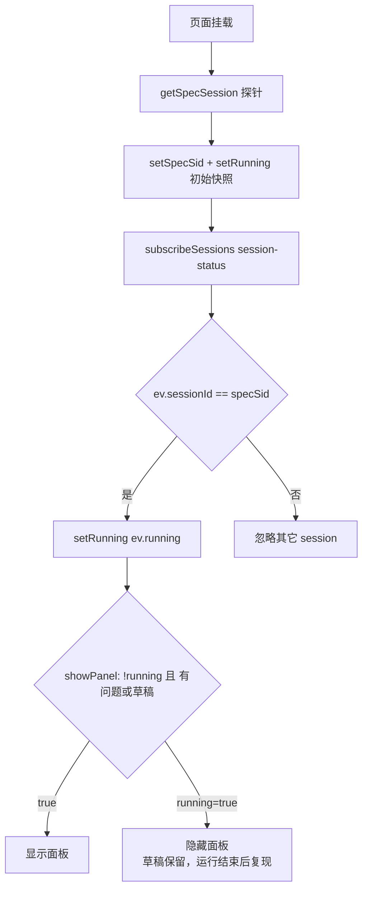
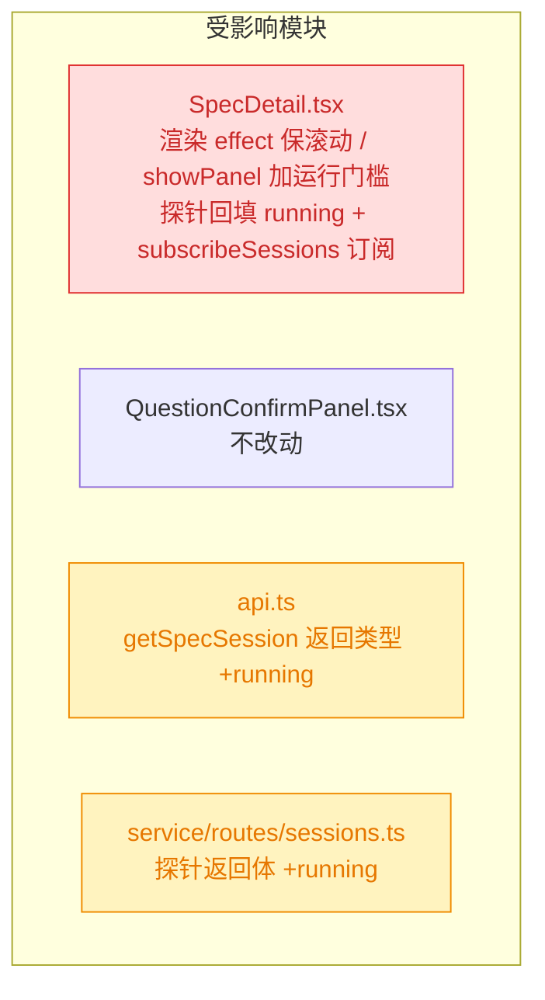

# spec 详情页滚动位置保持与运行态隐藏确认面板

## 1. 背景

`src/gui/src/pages/SpecDetail.tsx` 是 spec 详情页。Agent 通过 skill 改写 `spec.md` 后，Service 的 FS Watcher 推送 `updated` 事件，页面据此重新拉取文档并把 markdown 注入 `<article>` 实现「实时更新」（该链路已在 `260714.fix.spec-detail-live-update` 中修复 404 卡死与 mermaid 不渲染）。本 spec 处理该实时刷新链路遗留的两处交互问题：刷新会重置正文滚动位置；以及 Agent 运行期间问题确认面板仍然可见、存在并发触发第二个 Agent session 的风险。

## 2. 需求

1. Agent 更新 spec 文档、详情页实时刷新时，正文（`<article>` 滚动容器）滚动位置被重置到顶部，用户当前阅读位置丢失；期望刷新后保持原有滚动位置。
2. Agent 正在运行时页面仍渲染问题确认面板（`QuestionConfirmPanel`），可能被再次提交从而触发第二个 Agent session 并发改写同一份 spec 文档；期望 Agent 运行期间隐藏该面板。

## 3. 现状分析

### 3.1 实时刷新导致滚动位置重置（需求 1）

正文滚动容器是带 `overflow-auto` 的 `<article>`（`ref={setArticleEl}`）。markdown 注入与 mermaid 渲染收敛在同一个 `createEffect` 中，依赖 `articleEl()` 与 `spec()`。每次 SSE 刷新都会产生**新的** `spec()` 对象（即便正文内容未变），effect 重跑并执行 `el.innerHTML = renderMarkdown(...)`：整体重建子节点会把容器 `scrollTop` 归零；随后异步 `renderMermaidIn` 注入 svg 再次改变内容高度。二者叠加使阅读位置在每次刷新时丢失。

### 3.2 运行态仍渲染确认面板（需求 2）

`showPanel()` 仅判定「有确认问题或有本地批注草稿」，不关心运行态。面板内部提交按钮虽在 `props.running` 时禁用，但**面板整体仍然渲染**。且页面的 `running` 信号只在本页发起运行（`runAgent` / `openExplain` / `submitAppend`）时置真、由 `subscribeSession` 的 `turn-completed` / `error` 收敛，挂载时不从会话真实状态回填——因此「后台已有运行时打开页面」也会看到面板。面板可见即存在被再次提交、并发拉起第二个 Agent session 改写同一 spec 的风险。

精确层：涉及文件与关键位置

- `src/gui/src/pages/SpecDetail.tsx`
  - `L82-85` `createResource`：每次 `refreshTick` 变化返回新的 `SpecDetailDoc` 对象。
  - `L105-109` `showPanel()`：`questions().length > 0 || freeforms().length > 0`，未含运行态判定。
  - `L146-157` `running` 由 `subscribeSession` 的 `turn-completed` / `error` 收敛为 false；置真仅在 `runAgent`(`L208-220`) / `openExplain`(`L280-291`) / `submitAppend`(`L270-278`)。
  - `L188-206` 合并渲染 effect：`el.innerHTML = renderMarkdown(...)` 后 `await renderMermaidIn(el)`；**无 scrollTop 保留**。
  - `L374-389` `<article class="markdown spec-main ... overflow-auto ...">`（滚动容器）与 `<Show when={showPanel()}>` 包裹的面板。
- `src/gui/src/components/QuestionConfirmPanel.tsx`
  - `L131-138` 提交按钮 `disabled={busy() || props.running}`；面板容器本身无运行态隐藏。
- 会话运行态可用来源（供需求 2 可靠性方案参考）：
  - `src/gui/src/lib/sse.ts:238-265` `subscribeSessions`（项目级 `session-status` 事件，含 `running: boolean`，**订阅时不回放当前快照**，仅 `ready` + 后续变更）。
  - `src/gui/src/lib/api.ts:138-139` `SessionSummary.running?: boolean`；`GET /projects/:pid/sessions`（`src/service/routes/sessions.ts:20-23` `listSessions()`）可取初始运行快照。
  - `src/gui/src/lib/api.ts:390` `getSpecSession` 返回 `{ sessionId, kind }`，当前**不含** `running`。

## 4. 技术实现方案

### 4.1 刷新后保留滚动位置（需求 1）

在合并渲染 effect 中，于重写 `innerHTML` 前记录容器 `scrollTop`，在同步注入后与 mermaid 异步渲染完成后各恢复一次（钳制到新的 `scrollHeight` 上限，避免内容变短时越界）。`active` 竞态标志保证过期的异步恢复被丢弃。

要点：

- 恢复目标仅在 `articleEl` 自身（页面唯一正文滚动容器）；不改变 effect 的依赖集合（仍为 `articleEl()` + `spec()` + `projectId()`）。
- 两次恢复：同步一次覆盖 innerHTML 重建；异步一次覆盖 mermaid svg 注入引起的高度变化。
- 钳制：`el.scrollTop = Math.min(prevTop, el.scrollHeight - el.clientHeight)`，内容变短时不跳变。

### 4.2 运行态隐藏确认面板（需求 2）

在 `showPanel()` 增加运行态门槛：`!running() && (questions().length > 0 || freeforms().length > 0)`。运行期间面板整体隐藏，本地 `freeforms()` 草稿仅隐藏、不清空，运行结束（`running` 归假）后自动复现，杜绝并发再次提交拉起第二个 session 的窗口。

**运行态来源（按 5.1 决策取选项 2：覆盖「页面加载时后台已有运行」）：** 复用 spec ↔ session 的既有关联，把 `running` 变为「初始快照 + 持续订阅」的可靠信号：

1. **初始快照**：扩展 `GET /specs/:id/session` 探针，返回体新增 `running: boolean`（服务端由 `SessionManager.isRunning(sessionId)` 计算，`findSessionForSpec` 命中时回填；未绑定 session 时 `running: false`）。挂载时的 `getSpecSession` 探针在解析出 `sessionId` 的同时 `setRunning(running)`，覆盖「打开页面前后台已在运行」。
2. **持续订阅**：新增 `subscribeSessions(pid)` 的 `session-status` 订阅，当事件 `sessionId === specSid()` 时 `setRunning(ev.running)`——既捕获后台 session 由静→跑（现有 `subscribeSession` 只会把 `running` 收敛为假、无法置真），也捕获跑→静。
3. **本页乐观置真保留**：`runAgent` / `openExplain` / `submitAppend` 仍在发起时立即 `setRunning(true)` 提供即时反馈；随后由订阅事件与探针快照校正为权威值。

精确层：运行态来源改动点

- `src/service/routes/sessions.ts` `GET /projects/:projectId/specs/:id/session`：`found` 命中时返回 `{ ...found, running: p.sessions.isRunning(found.sessionId) }`；未命中返回 `{ sessionId: null, kind: null, running: false }`。
- `src/service/session-manager.ts:140` `isRunning(sid)` 已 public，可直接复用；无需改动 `findSessionForSpec`。
- `src/gui/src/lib/api.ts:390` `getSpecSession` 返回类型新增 `running: boolean`。
- `src/gui/src/lib/sse.ts:249` `subscribeSessions(pid, { onStatus })` 已存在，直接复用；订阅不回放快照，故必须配合探针初始快照。
- `src/gui/src/pages/SpecDetail.tsx`：挂载探针 effect 内 `setRunning(running)`；新增 `subscribeSessions` effect（依赖 `projectId()` + `specSid()`）。
- 服务端契约测试 `src/service/__tests__/service.test.ts:252` 断言未绑定态返回体，需同步加入 `running: false`。

### 4.3 兼容性与影响范围

- 需求 1 的核心改动集中在 `SpecDetail.tsx` 渲染 effect，不涉及服务端。
- 需求 2 按 5.1 选项 2 覆盖后台运行：改动跨越前后端——`service/routes/sessions.ts`（探针返回体 +`running`）、`api.ts`（返回类型 +`running`）、`SpecDetail.tsx`（探针回填 + `subscribeSessions` 订阅 + `showPanel` 门槛）；`sse.ts` 的 `subscribeSessions` 与 `session-manager.ts` 的 `isRunning` 均复用既有实现，不新增。
- `QuestionConfirmPanel` 不改动。
- 现有 e2e / 契约用例中，仅服务端探针契约测试断言了返回体形状，需同步 `running: false`；其余用例不依赖「运行时面板可见」或「刷新后滚动归零」，预期无需改写。

## 5. 待确认问题

_暂无_

## 6. 任务清单

- [x] 需求1：在 `SpecDetail.tsx` 合并渲染 effect 中重写 `innerHTML` 前保存 `prevTop = el.scrollTop`，同步注入后 `el.scrollTop = Math.min(prevTop, el.scrollHeight - el.clientHeight)` 恢复一次，`renderMermaidIn` resolve 后在 `active` 仍为真时再恢复一次（验收：SSE 刷新后 `article` 滚动位置保持，内容变短时不越界跳变）
- [x] 需求2-后端：`src/service/routes/sessions.ts` 的 `GET /specs/:id/session` 命中时返回 `{ ...found, running: p.sessions.isRunning(found.sessionId) }`，未命中返回 `{ sessionId: null, kind: null, running: false }`（验收：绑定且运行中的 spec 探针返回 `running:true`）
- [x] 需求2-契约测试：更新 `src/service/__tests__/service.test.ts` 未绑定态断言为 `{ sessionId: null, kind: null, running: false }`（验收：`vitest` 该用例通过）
- [x] 需求2-类型：`src/gui/src/lib/api.ts` 的 `getSpecSession` 返回类型新增 `running: boolean`（验收：`tsc --noEmit` 通过）
- [x] 需求2-前端运行态来源：`SpecDetail.tsx` 挂载探针 effect 内解析出 `sessionId` 后 `setRunning(res.running)`；新增依赖 `projectId()`+`specSid()` 的 `subscribeSessions` effect，`onStatus` 中当 `ev.sessionId === specSid()` 时 `setRunning(ev.running)`（验收：后台已有运行时打开页面 `running` 为真、面板隐藏）
- [x] 需求2-面板门槛：`SpecDetail.tsx` 的 `showPanel` memo 改为 `!running() && (questions().length > 0 || freeforms().length > 0)`，`freeforms` 草稿不清空（验收：运行期间面板隐藏、运行结束后草稿复现）
- [x] 验证：运行前端 typecheck/构建与服务端测试并记录（验收：`tsc --noEmit`/相关 `vitest` 用例通过）

## 7. 追加任务

- [open] [fix] 2026-07-19 16:21:24 | Agent 后台更新 spec 文档内容时， scroll 仍然会跳到顶部，期望保持滚动位置。
  - 描述：Agent 后台更新 spec 文档内容时， scroll 仍然会跳到顶部，期望保持滚动位置。

## 8. 执行记录

- 需求1（保滚动）：`SpecDetail.tsx` 合并渲染 effect 中新增 `prevTop` 保存与 `restoreScroll()`（钳制到 `scrollHeight - clientHeight`），在 `innerHTML` 重写后同步恢复一次、`renderMermaidIn` resolve 后在 `active` 为真时再恢复一次。
- 需求2（运行态来源，按 5.1 选项2 覆盖后台运行）：
  - 后端 `src/service/routes/sessions.ts` 探针返回体新增 `running`（命中 `p.sessions.isRunning(found.sessionId)`，未命中 `false`），复用既有 public `isRunning`，未改 `findSessionForSpec`。
  - `src/gui/src/lib/api.ts` `getSpecSession` 返回类型 +`running: boolean`。
  - `SpecDetail.tsx`：挂载探针回填 `setRunning(r)`；新增 `subscribeSessions` effect 按 `ev.sessionId === specSid()` 同步 `running`（可置真/置假，弥补单会话流仅能置假）；保留本页乐观置真与 `subscribeSession` 收敛。
- 需求2（面板门槛）：`showPanel` memo 增加 `if (running()) return false`，`freeforms` 草稿不清空、运行结束后复现。
- 验证：`npx vitest run src/service/__tests__/service.test.ts -t "read-only probe"` 通过（1 passed）；`npx tsc --noEmit` 仅剩与本次改动无关的既有基线报错（`@/lib/cn` 路径别名、timeago、`session-manager.test`、`index.ts` 等），本次触及的 `SpecDetail.tsx`/`api.ts`/`routes/sessions.ts` 无新增类型错误。
- 收尾：全部非 manual 任务完成，`## 待确认问题` 为 `_暂无_`、无 `！！！` 批注、无 `[open]` 追加任务，标记 `done`。
