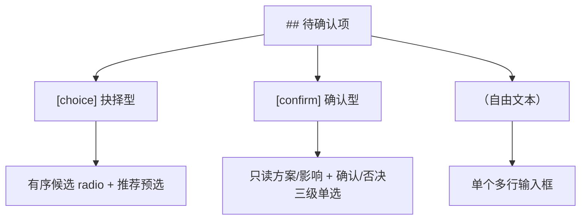

# 待确认项面板演示：抉择 / 确认 / 自由文本

## 1. 背景

这是一个**纯演示用** spec，不对应真实需求。它的唯一目的：让 `## 待确认项` 覆盖全部三种类型，便于在 GUI 右侧 `QuestionConfirmPanel` 中检查渲染与交互——尤其是确认型的**只读方案/影响区**与**确认→否决→换方案/补约束/弃目标→废弃当前/放弃整个 spec 三级嵌套单选**。

## 2. 需求

1. 抉择型 `[choice]`：渲染有序候选 + 恰 1 个 `(推荐)`，默认预选推荐项。
2. 确认型 `[confirm]`：渲染只读方案/影响；🔴 破坏性 → 红色左边框，🟡 影响可控 → 黄色左边框；默认预选「确认，按此推进」。
3. 否决交互：选「否决」展开二级意图，选「弃目标」再展开三级范围，理由框必填。
4. 自由文本：仅渲染一个多行输入框。

## 3. 现状分析

演示数据无需分析真实代码。下图给出面板对三种类型的渲染分派：

## 4. 技术实现方案

演示 spec 无实现方案；请直接在 GUI 中对下方 `## 待确认项` 逐条交互验证：

- 抉择型：切换候选 radio，观察推荐标记；切到「其他（自由批注）」时出现输入框。
- 确认型：确认 ↔ 否决切换；否决后逐级展开意图与范围；理由留空点「发送」应被拦截（提示「否决时必须填写理由」）。
- 计数：面板顶部「未确认 N / 总数」应随选择实时变化。

## 5. 待确认项

### 5.1 [choice] 演示列表的默认排序应采用哪种？

1. 按更新时间倒序 (推荐)
2. 按创建时间倒序
3. 按标题字母序

### 5.2 [confirm] 将主键从自增 int 迁移为 uuid

**方案**：一次性迁移，双写过渡 2 周后切读。
**影响**：🔴 需一次停机窗口；对外 `/api/user` 的 `id` 字段类型由 number 变为 string，所有客户端需同步升级（破坏性、不可逆）。

### 5.3 [confirm] 为列表接口增加内存缓存层

**方案**：在 service 层加 60s TTL 的 LRU 缓存，命中直接返回。
**影响**：🟡 列表数据最长有 60s 陈旧窗口；缓存未命中路径不变，可随时关闭回滚（影响可控）。

### 5.4 演示页面的空态文案该怎么写？（自由文本）

## 6. 任务清单

_暂无_

## 7. 执行记录

_暂无_
