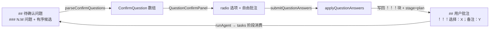
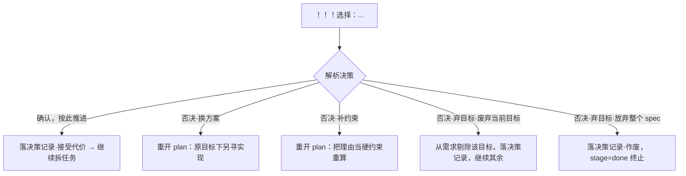

# 优化「待确认项」质量：抉择/确认分型与否决语义

## 1. 背景

plan 阶段输出的「待确认问题」质量参差：保守 Agent 滥列问题让用户在默认项上盖章，激进 Agent 几乎不确认高风险实现。根因是现有机制**只规定格式、从不规定准入门槛**——什么该问、该以何种形态问，全由 Agent 性格填补。

对话中已达成设计共识：把「待确认问题」升级为「待确认项」，一个条目要么是**抉择型**（多方案难取舍，给用户选择权），要么是**确认型**（单方案有重大代价，给用户否决权）；并为确认型的「否决」补上今天完全缺失的结构化语义。

## 2. 需求

1. 命名：`## 待确认问题` → `## 待确认项`；parser/lint 兼容旧名，不破坏存量 spec。
2. 分型：
   - `[choice]` 抉择型：多个有序候选 + 恰 1 个 `(推荐)`（沿用现结构）。
   - `[confirm]` 确认型：单方案 + `**方案**` / `**影响**` 字段，无候选。
   - 自由文本：`（自由文本）` 后缀（沿用）。
   - 无标记且非自由文本 → 向后兼容视为 `[choice]`。
3. 确认型交互：`确认，按此推进` 或 `否决`；否决细分三意图 `换方案` / `补约束` / `弃目标`；`弃目标` 再细分 `废弃当前目标，继续其余` / `放弃整个 spec`。否决必填理由。
4. GUI：确认型卡片以只读区展示方案+影响（复用 mermaid 红/黄影响语义），提供上述二级/三级单选与必填理由框。
5. 决策留痕：Agent 消费确认型答复时在 `## 技术实现方案` 落一条「决策记录」，不随批注清除而蒸发。
6. lint：按 `[confirm]` 标记分派两套校验；抉择型规则保持不变。

## 3. 现状分析

### 3.1 数据与交互链路



<details><summary>关键实现位置（精确层）</summary>

- 解析：`src/gui/src/lib/question-parse.ts` — `ConfirmQuestion { text, options, isFreeform }`；`HEADING_RE` 硬编码 `待确认问题`。
- 面板：`src/gui/src/components/QuestionConfirmPanel.tsx` — 每题 radio + `FREEFORM_SENTINEL` 自由项；`initialAnswers` 预选推荐项。
- 载荷：`src/gui/src/lib/answer-payload.ts` — `buildAnswerItem` 产出 `{questionId, questionText, selectedOptionLabel?, note?}`。
- 回写：`src/service/spec-store.ts:172` `applyQuestionAnswers` — 拼 `> 待确认问题："..."\n>\n> ！！！选择：X；备注：Y`，置 `stage=plan`。
- lint：`src/lint/rules/pending-questions.ts` — `structure`/`empty`/`no-named-recommend` 三规则，`findPendingSection` 硬编码 `待确认问题`。
- 章节顺序：`src/lint/rules/headings.ts:8` `REQUIRED_SECTIONS` 含 `待确认问题`。
- skill：`src/skill/yorz-spec/stages.md` plan 段、`SKILL.md` 自动模式判定。
- i18n：`src/gui/src/i18n/{zh-CN,en}.ts` `questionConfirm.*`。

</details>

### 3.2 缺口

- **无准入门槛**：格式即全部规则，Agent 无从判断"该不该问"。
- **无类型**：抉择与确认混为一谈，都被塞进"候选 + 推荐"模板 → 用户一路默认。
- **无否决语义**：今天只有"选择/自由文本"，否决只能写进自由文本靠 Agent 猜语气；"代价太大就别做"无法表达。
- **决策蒸发**：tasks 阶段消费后整段删 `## 用户批注`，重大决策不可追溯。

## 4. 技术实现方案

### 4.1 命名与兼容

- parser `HEADING_RE`、lint `findPendingSection` 改为匹配 `待确认项|待确认问题`（正则 alternation）。
- 新 spec 骨架、stages.md 示例、i18n `questionConfirm.title`、headings `REQUIRED_SECTIONS` 采用 `待确认项`；`REQUIRED_SECTIONS` 同时接受旧名以免存量 spec 触发章节校验。
- 存量 spec 不做批量改写。

### 4.2 三种条目类型与标记

条目标记写在三级标题正文前缀：

```
### 5.1 [choice] 候选答案的展现形式应采用哪种？
1. 嵌套子列表
2. 表格 (推荐)

### 5.2 [confirm] 将 UserID 从 int 迁移为 uuid

**方案**：一次性迁移，双写过渡 2 周。
**影响**：🔴 需停机窗口；对外 /api/user 字段类型变更，客户端需同步。

### 5.3 release notes 文案怎么写？（自由文本）
```

分型判定（parser 与 lint 共用）：

| 标记/形态                               | kind       | 校验                                                           |
| --------------------------------------- | ---------- | -------------------------------------------------------------- |
| 标题含 `[confirm]`                      | `confirm`  | 必含 `**方案**` 与 `**影响**`（或 `**代价**`）行；禁止有序候选 |
| 标题含 `[choice]`，或无标记且非自由文本 | `choice`   | 有序候选 + 恰 1 个 `(推荐)`（沿用现规则）                      |
| 标题以 `（自由文本）` 结尾              | `freeform` | 不得列候选（沿用现规则）                                       |

### 4.3 否决三意图与回写协议（复用现有 payload，不改 API/spec-store）

确认型的用户决策编码进现有 `selectedOptionLabel` + `note` 两字段——**API、routes、spec-store 零改动**。规范 label（新增常量集中定义）：

| UI 决策                   | selectedOptionLabel                  | note     |
| ------------------------- | ------------------------------------ | -------- |
| 确认，按此推进            | `确认，按此推进`                     | 可空     |
| 否决·换方案               | `否决·换方案`                        | 必填理由 |
| 否决·补约束               | `否决·补约束`                        | 必填约束 |
| 否决·弃目标·废弃当前目标  | `否决·弃目标·废弃当前目标，继续其余` | 必填理由 |
| 否决·弃目标·放弃整个 spec | `否决·弃目标·放弃整个 spec`          | 必填理由 |

回写后 `## 用户批注` 得到 `> 待确认项："..."\n>\n> ！！！选择：否决·弃目标·放弃整个 spec；备注：当前无停机窗口`，语义人类可读，Agent 按 stages.md 分派。

### 4.4 Agent 消费规则（stages.md tasks 段新增）



- 无论确认或否决，均在 `## 技术实现方案` 追加一行「决策记录」：`> 决策记录：<条目> —— 用户<决策>，理由：<note>。`
- `放弃整个 spec` 复用 `done` 终止态（`done` 语义即"不再自动推进"），`last_action` 记「用户放弃整个 spec，标记终止」。

### 4.5 GUI

`ConfirmQuestion` 扩展 `kind: 'choice' | 'confirm' | 'freeform'`；confirm 额外解析 `plan` / `impact` 文本。

`QuestionConfirmPanel` 按 kind 渲染：

- `choice` / `freeform`：维持现有 radio + 自由项。
- `confirm`：只读区渲染 `方案`/`影响`（影响行含 🔴/🟡 徽章）；一级单选 `确认，按此推进` / `否决`；选 `否决` 展开二级单选 `换方案`/`补约束`/`弃目标`；选 `弃目标` 再展开三级单选 `废弃当前目标，继续其余`/`放弃整个 spec`；选 `否决` 后理由框必填。
- `unanswered` 计数纳入 confirm：确认型未选决策、或选否决但理由为空，均计未完成。
- submit 时 confirm 型按 4.3 映射为 `{selectedOptionLabel, note}`。

### 4.6 lint 改造

`pending-questions.ts`：

- `collectQuestions` 识别标题 `[choice]`/`[confirm]` 标记（剥离后取正文）。
- `pending-questions/structure` 按 kind 分派：confirm 校验方案/影响字段存在且无有序候选；choice/freeform 维持原逻辑。
- 新增 `pending-questions/confirm-fields`（或并入 structure）：confirm 缺 `**方案**`/`**影响**` 报错。
- `empty`、`no-named-recommend` 不变。

### 4.7 skill 文档

- stages.md plan 段：改「待确认问题」为「待确认项」；补三型定义、确认型示例、否决语义表。
- 新增 **plan 收尾子步骤「待确认项自检」**（与「图形化补充」同构）：①准入过滤器——能靠读码/跑测试/查约定自证的答案禁止写成待确认项；②逐条归类 choice/confirm；③确认型必带影响陈述。
- SKILL.md 自动模式判定与 routing 文案改「待确认项」（标注兼容旧名）。
- new-spec 骨架章节名改「待确认项」。

## 5. 待确认项

_暂无_

## 6. 任务清单

- [x] 扩展 `src/gui/src/lib/question-parse.ts`：`ConfirmQuestion` 增 `kind` 与 confirm 的 `plan`/`impact`；`HEADING_RE` 兼容 `待确认项|待确认问题`；识别 `[choice]`/`[confirm]` 标记（验收：新增单测覆盖三型解析，`vitest run` 通过）
- [x] 新增确认型决策常量与载荷映射到 `src/gui/src/lib/answer-payload.ts`（导出规范 label 常量 + confirm 决策 → `{selectedOptionLabel, note}`）（验收：单测覆盖五种决策映射）
- [x] 改造 `src/gui/src/components/QuestionConfirmPanel.tsx`：按 kind 渲染，confirm 卡片含只读方案/影响、二/三级否决单选、必填理由、`unanswered` 纳入 confirm（验收：`tsc --noEmit` 通过，e2e/组件手测面板渲染）
- [x] 更新 i18n `src/gui/src/i18n/{zh-CN,en}.ts`：`questionConfirm.title` 改「待确认项」，新增 confirm/否决意图文案键（验收：无缺键，tsc 通过）
- [x] 改造 `src/lint/rules/pending-questions.ts`：`findPendingSection` 兼容新旧名；按 `[confirm]` 分派校验，新增 confirm 方案/影响字段校验（验收：`src/lint/__tests__/pending-questions.test.ts` 扩充并通过）
- [x] 更新 `src/lint/rules/headings.ts` `REQUIRED_SECTIONS` 接受「待确认项」（兼容旧名）（验收：headings 测试通过）
- [x] 更新 skill 文档 `src/skill/yorz-spec/stages.md`：三型定义、确认型示例、否决语义表、plan 收尾「待确认项自检」子步骤（验收：`yorz lint` 无关此文件；人工审阅结构）
- [x] 更新 `src/skill/yorz-spec/SKILL.md`：自动模式判定/routing/new-spec 骨架改「待确认项」并标注兼容旧名（验收：文本一致性检查）
- [x] 全量校验：`pnpm build:cli` + `pnpm test` + 本 spec `node dist/cli/index.js lint <spec_path> --format json` errorCount=0；同步 ~/.claude（验收：命令全绿）

## 7. 执行记录

- 2026-07-17 23:24 · 重写 `question-parse.ts`：`ConfirmQuestion` 增 `kind`/`plan`/`impact`；两遍解析（切条目→分型）；章节名兼容 `待确认(项|问题)`；识别 `[choice]`/`[confirm]` 标记与 `**方案**`/`**影响**`/`**代价**` 字段。新增 5 条单测，`question-parse.test.ts` 21 tests 全绿。
- 2026-07-17 23:25 · `answer-payload.ts` 新增 `CONFIRM_DECISIONS` 五决策常量、`isRejectDecision`、`buildConfirmAnswerItem`（否决必填理由，编码进 `selectedOptionLabel`+`note`，不改 API/spec-store）。`answer-payload.test.ts` 扩至 14 tests 全绿。
- 2026-07-17 23:27 · 重写 `QuestionConfirmPanel.tsx`：按 kind 分派渲染；confirm 卡片含只读方案/影响（🔴红/🟡黄左边框）、确认/否决→换方案/补约束/弃目标→废弃当前/放弃整个 spec 三级单选、否决必填理由；`unanswered` 纳入 confirm，否决空理由阻塞提交。i18n zh/en 补 confirm 相关键。`tsc -b` 通过；e2e 因 parser 向后兼容且回写串不变保持有效。
- 2026-07-17 23:31 · lint：`pending-questions.ts` 章节名兼容集 `待确认(项|问题)`；`classifyKind` 识别 `[choice]`/`[confirm]`；`structure` 规则按 kind 分派——confirm 校验 `**方案**`/`**影响**|**代价**` 字段且禁候选。`headings.ts` `REQUIRED_SECTIONS` 增「待确认项」。扩充 lint 单测（confirm 4 例 + 新章节名 1 例）共 19 tests 全绿。
- 2026-07-17 23:35 · skill：`stages.md` plan 段重写（三型表、准入门槛、抉择/确认示例、否决语义表、tasks 段确认型消费+决策留痕表、plan 收尾「待确认项自检」子步骤）；`SKILL.md` 全量改「待确认项」+ 兼容旧名注记。Service 侧同步：`spec-store` SECTIONS 骨架、`routes/specs` 草稿 prompt、`worktree-manager` 模板改「待确认项」，回写批注串保留旧名（在 `## 用户批注` 内、多测试依赖，parser 不解析该处）。
- 2026-07-17 23:37 · 全量校验：`tsc -b` 通过；`vitest run --exclude cases.test.ts`（真机 agent 用例需 CLI，单独排除）36 files / 324 tests 全绿；相关测试断言同步（spec-store 骨架、build-draft-prompt、真机用例 validator 用 `待确认` 子串/`待确认(项|问题)` 兼容）。`pnpm build:cli` 重建 dist；confirm/choice 冒烟 lint errorCount=0，confirm 缺 **影响** 正确报 `pending-questions/structure`；本 spec 自 lint errorCount=0。已将改动后的 SKILL.md/stages.md 同步至 ~/.claude/skills/yorz-spec。
- 2026-07-17 23:42 · 收尾：非 manual 任务全部完成、待确认项 `_暂无_`、无批注/`[open]`，`stage` 置 `done`。
