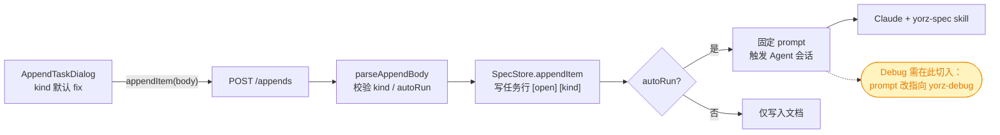
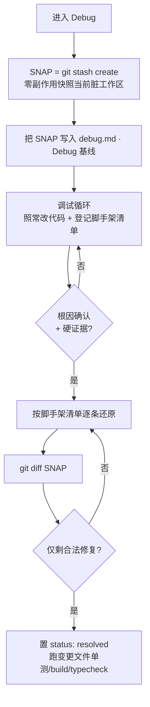
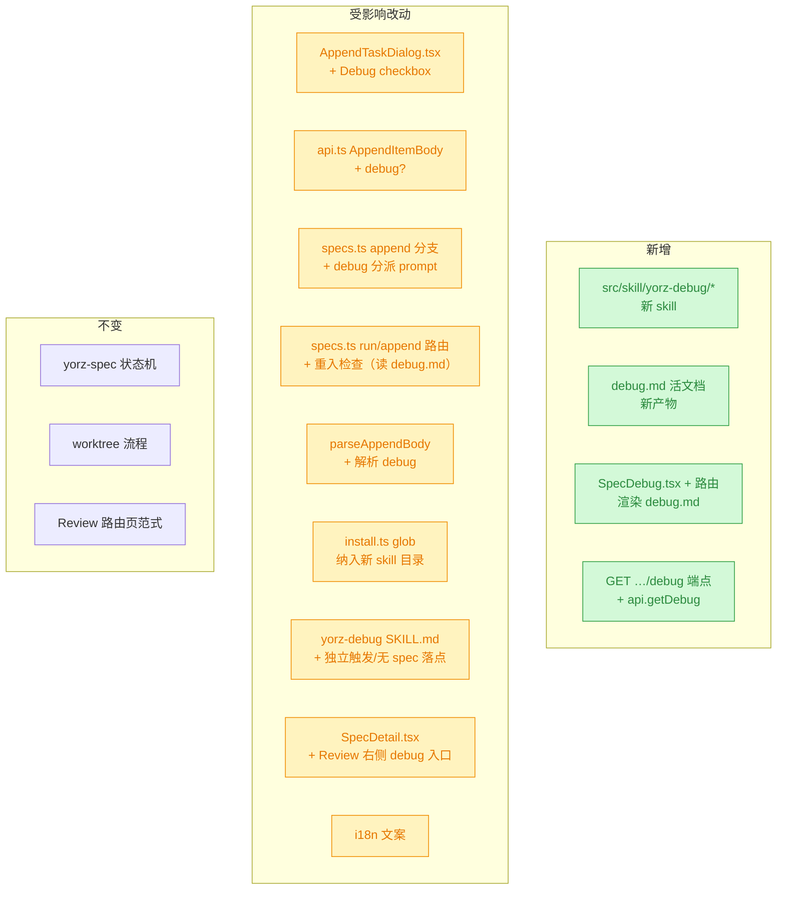
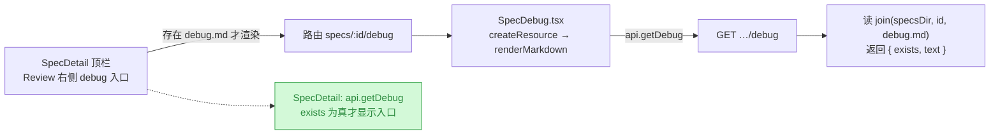

# Debug 模式：疑难问题深度调试 skill

## 1. 背景

Agent 执行任务时常陷入误区：多轮尝试无法解决问题，甚至越纠越偏，或产生"已解决"的幻觉。根因通常是 Agent 跳过了"假设 → 取证 → 验证"的证据闭环，凭猜测直接改代码，缺乏资深工程师的调试纪律。

需要为产品增加 **Debug 模式**：在用户遇到疑难 bug 时，由一套专门的 skill 指导 Agent 以规范的调试方法（假设 → 实施 → 验证 → 缩小范围 → 再假设）逐步逼近根因，并在调试过程中赋予更大的自由度（临时改代码、Mock 数据、加日志、建临时验证入口等），同时用机制兜住"污染性改动不进入最终提交"。

## 2. 需求

- **入口（本期范围）**：仅在 `SpecDetail` 的「追加任务」对话框中，当任务类型为 `fix` 时，新增一个 **Debug 模式** checkbox（提示语：深度分析调试，尝试解决疑难问题）。勾选后进入 Debug 模式。
  - `NewSpec` 入口与 worktree 联动本期**不做**（见 4.3 决策说明）。
- **调试流程**：搭配独立的 `yorz-debug` skill，指导 Agent：
  1. 分析 bug 相关信息 → 规划 debug 方案 → 进入「假设 → 实施 → 验证 → 缩小范围 → 再假设」循环，最终确定根因。
  2. 常用方法：二分法、控制变量法、遍历可能分支。
  3. 大胆假设、小心验证：真相必须有日志或图片等硬性证据支撑。
  4. 可添加日志辅助分析，要求用户回传或自行获取日志验证；日志须可读可复制（避免打印 object）、避免循环打印大量日志。
- **更大的自由度**（Debug 模式内允许）：
  - 编写临时代码（条件短路）或注释有意义代码，控制程序进入/屏蔽特定分支；
  - 临时篡改变量值、Mock API 返回，让程序走到特定分支；
  - 编写临时独立测试页面/入口，简化复现路径、直接验证怀疑环节；
  - 联网查询第三方 SDK 文档、向用户询问必要信息；
  - 允许 lint / typecheck / build / 单测出现错误，允许临时跳过这些检查。
- **收尾（退出 Debug 模式）**：确定并修复根因后，
  - 还原临时代码与被注释代码，确保原有逻辑正确；
  - 清理不需要的 debug 日志；
  - 进行常规完整性检查（变更文件关联单测、构建、类型检查）；
  - **保留 debug.md 文件**归档复盘，用 frontmatter 状态字段标记为已收尾。

## 3. 现状分析

### 3.1 关键结论：Debug 是"持续状态"，而 checkbox 是"瞬时的"

调研现有链路后发现一个决定设计走向的事实：**任务类型 `type`/`kind` 只在"创建那一刻"被注入给 Agent，真正的调试却发生在后续 run / execute / append 阶段**，而这些阶段发给 Agent 的 prompt 是写死的固定文案、不携带任何模式信息。因此若 Debug 只是一个"用完即弃"的请求体开关，到执行阶段就丢失了，Agent 在真正调试时无从知晓应采用 Debug 思路。

**推论：Debug 模式必须持久化到一个每轮都能读到的载体。** 本方案选择 `debug.md` 活文档承担这一角色（详见 4.1）。

### 3.2 现有追加任务（append）数据流

Debug 入口挂在「追加任务」上，其现有链路如下：



<details>
<summary>现状精确层：类型 / 触发 / 安装的关键位置</summary>

- **type/kind 注入**：仅 `src/service/routes/specs.ts:244`（`buildDraftPrompt` 写入 `类型：${type}`）会把类型给 Agent；`runAgent`（`specs.ts:184-196`）、`appendItem`（`specs.ts:149-182`）的 prompt 均为固定文案（`specs.ts:177,193`），不带 type/kind。
- **无集中 system prompt**：`src/service/agent-sdk/claude-adapter.ts:59-76` 的 `query()` 只设 `cwd` / `permissionMode` / `session`，**未设** `systemPrompt`/`appendSystemPrompt`。Agent 的"指令"完全来自「每次 send 的 user prompt 文本」+「已安装的 skill 文件」。
- **skill 安装**：`src/cli/install.ts:15` 用 `import.meta.glob('../skill/yorz-spec/**/*.{md,json}')` 内联，装到各 adapter 的 skills 目录（claude `~/.claude/skills`，`adapters/claude.ts:6-8`）；`ensureSkillsInstalled()`（`install.ts:151`）在 serve 启动按指纹增量更新。触发方式：description 自动发现 + prompt 显式点名。
- **append 类型**：`AppendItemBody`（`src/gui/src/lib/api.ts:64-72`）字段 `kind: 'feat'|'refct'|'fix'`、`description`、`sectionPath?`、`quote?`、`autoRun?`；UI 在 `src/gui/src/components/AppendTaskDialog.tsx`（默认 `kind='fix'` 于 `:24`，radio 于 `:107`，提交带 `kind` 于 `:72`）。
- **后端 append**：`parseAppendBody`（`specs.ts:387-414`）校验 kind、`autoRun` 默认 true；`SpecStore.appendItem`（`src/service/spec-store.ts:214-245`）把 kind 写进任务行 `- [open] [${kind}] ...`（`:237`）；autoRun 时 `ensureSessionForSpec` + send 固定 prompt（`specs.ts:173-179`）。
- **worktree（对比参照）**：`useWorktree`（`NewSpec.tsx:29`）是纯前端编排——勾选时先 `api.createWorktree` 换新 pid（`NewSpec.tsx:93-97`），**不入任何 spec body**。成本高（新目录 / 迁移未提交改动），故本期不采用。

</details>

### 3.3 追加需求现状：skill 独立触发与详情页 debug.md 入口

追加任务（feat）引入两点，均可复用现有机制、无破坏性：

- **skill 触发本就与 spec UI 解耦**：`yorz-debug` 随 `install.ts` 落到各 agent 的 skills 目录，靠 **description 自动发现 + prompt 显式点名**即可触发（与 yorz-spec 相同）。因此「chat / Agent TUI 直接触发」**无需新增代码**，缺的是 SKILL.md 对「无 spec 上下文」场景的落点说明：现行 `输入约定` 假定有 `spec_dir` 且 `debug.md` 落 spec 目录，独立触发时需要 fallback 落点。
- **详情页有现成的「路由页 + renderMarkdown」范式可镜像**：Review 入口是 `SpecDetail.tsx` 顶栏的 `<A href=specs/:id/review>`，跳转到 `SpecReview.tsx` 页面，用 `renderMarkdown` 渲染；数据经后端 `GET …/review → { text }` + 客户端 `api.getReview`。debug.md 的渲染入口可**完全照此模式**新增一套。

<details>
<summary>追加需求精确层：现有 Review 链路关键位置</summary>

- 顶栏 Review 入口：`src/gui/src/pages/SpecDetail.tsx:389-394`（`<A href={projectHref('specs/'+id+'/review')}>`）。
- Review 页面：`src/gui/src/pages/SpecReview.tsx`（`createResource` 拉 `api.getReview`，`renderMarkdown` 渲染，:19/:75/:122）。
- 后端读取：`src/service/routes/spec-review.ts:70-84`（`GET …/review`，读 `join(p.specsDir, specId, 'review.md')`，返回 `{ text }`，不存在返回 `{ text: '' }`）。
- 客户端方法：`src/gui/src/lib/api.ts:291`（`getReview`）。
- 路由注册：`src/gui/src/main.tsx:23`（`<Route path="/:projectId/specs/:id/review" component={SpecReview} />`）。

</details>

### 3.4 缺陷现状：SpecDebug 把 debug.md 的 frontmatter 渲染进正文

追加任务（fix）报告：debug 页面正文顶部把 `---\nstatus: …\n---` 这段 YAML frontmatter 当成标题/分隔线渲染出来，期望正文**不渲染** frontmatter。

- **根因**：`SpecDebug.tsx` 的 `debugHtml` 直接把后端返回的 debug.md **原文**（含 frontmatter）喂给 `renderMarkdown`。markdown-it 把开头的 `---` 解析为 setext 标题/`<hr>`，把 `status:` 等行当普通文本，于是 frontmatter 冒到正文顶部。
- **为何其它页面无此问题**：`review.md` 无 frontmatter（Review 页天然免疫）；spec.md 的正文由后端 `spec-store.ts` 用 `gray-matter` 切分后只回传 `body`（SpecDetail 渲染的是无 frontmatter 的 body）。**唯独 debug.md 带 frontmatter 且被原样回传**，故只有 SpecDebug 命中。
- **修复落点**：渲染前剥掉起始的 YAML frontmatter 块。选前端剥离（`markdown.ts` 加 `stripFrontmatter` helper，SpecDebug 渲染前调用）——保持 `GET …/debug` 端点仍返回整文件（含 frontmatter，便于将来展示 status），把「正文不渲染 frontmatter」这一纯呈现问题收敛在渲染层。

## 4. 技术实现方案

总体思路：新增独立 `yorz-debug` skill 与 `debug.md` 活文档（**单文件承载多次调试记录**）；入口做 SpecDetail 追加 checkbox，并在 run/append 路由做**重入检查**（存在活跃调试记录时自动切到 yorz-debug）；用 `git stash create` 快照 + 脚手架清单 + `git diff` 兜住污染，在当前分支就地调试。追加需求：skill 支持无 spec 独立触发（文档层）、详情页 Review 右侧镜像新增 debug.md 渲染入口（4.6 / 4.7）。

### 4.1 决策一：独立 `yorz-debug` skill + `debug.md` 活文档

> 决策记录：Debug 流程与常规 spec 状态机气质差异大（交互式、多轮、依赖用户回传证据），采用**独立 skill 与独立文档**以获得最大自由度，不复用 yorz-spec 的 plan/tasks/execute 状态机。—— 用户拍板。

- **skill 源码**：新建 `src/skill/yorz-debug/`，结构参照 yorz-spec（`SKILL.md` 主入口 + `references/` 按需分层），自动走 `install.ts` 的内联安装与指纹更新机制（需在 glob 中纳入新目录）。
- **debug.md**：建在 spec 目录（与 spec.md 同级），既是调试活文档，又是 **Debug 模式的持久化标记**（存在任一未收尾调试记录 = 处于 Debug 模式），还是"是否仍有未清理脚手架"的守卫。

#### 多记录模型（消费批注：一个 debug.md 承载多次调试）

> 批注驱动的设计修订：同一 spec 在生命周期内可能多次进入 Debug（某次调试收尾后又冒出新 bug）。因此 debug.md **不是单次一次性文档，而是按"每次调试一个记录块"追加的活文档**，避免历史被覆盖、也让复盘可回溯多次调试。

- **文件级 frontmatter**：`status`（`debugging` = 存在未收尾记录 / `resolved` = 全部记录已收尾）、`active`（当前活跃记录编号，无则空）、`updated_at`。
- **正文按记录块组织**：每次进入 Debug 在文末**追加**一个记录块 `## Debug NNN · <bug 简述>`（NNN 从 1 递增、不复用），块内自带独立的 状态 / 快照 / 进入时间 与七个固定分区（见下），互不覆盖。
- **进入 Debug**：debug.md 不存在则创建（含文件 frontmatter）；已存在则**追加新记录块**、重新 `git stash create` 打快照写入该块基线、置文件 `status: debugging` 与 `active: NNN`。
- **单条收尾**：该记录块置 `状态: resolved`、脚手架逐条核销、`git diff $SNAP` 校验；随后若**所有记录块**均 resolved，置文件 `status: resolved`、`active` 清空；否则保持 debugging。
- **重入判定（供 4.2 路由使用）**：debug.md 存在且文件 `status: debugging`（即有活跃记录块）= 处于 Debug 模式。

<details>
<summary>debug.md 多记录结构与单记录块的固定分区（草案）</summary>

文件级 frontmatter 草案：

```yaml
---
status: debugging # debugging | resolved
active: 2 # 当前活跃记录编号；resolved 时为空
updated_at: '2026-07-19 15:54:37'
---
```

每个 `## Debug NNN · <bug 简述>` 记录块内含块头元信息 + 七个固定分区：

- 块头：`- 状态：debugging | resolved`、`- 快照：<SNAP SHA>`、`- 进入时间：<ts>`。

1. `### Bug 现象与复现` —— 硬门槛：必须能稳定复现，否则不许进入修改阶段（否则无法验证修没修好）。
2. `### 关联链路分析` —— 模块 / 数据传递 / 函数调用链，据此规划 debug 步骤。
3. `### Debug 基线` —— 记录 `git stash create` 得到的快照 SHA + 进入时间。
4. `### 假设看板` —— 每条假设**可证伪**：写明"若成立会看到 X，若不成立会看到 Y"；含「进行中 / 已排除（附排除依据）」，避免反复验证同一已否定假设。
5. `### 证据` —— 日志/截图链接；规则：**拿到指向根因的硬证据前，只许写验证性代码，不许写最终修复**。
6. `### 脚手架清单` —— 每处临时改动（短路 / Mock / 注释 / 临时页面）登记一行，收尾逐条核销。
7. `### 收尾核对` —— 还原脚手架 → `git diff $SNAP` 只剩合法修复 → 置本块 `状态: resolved` → 跑变更文件单测 / build / typecheck。

</details>

### 4.2 决策二：入口仅做 SpecDetail 追加 checkbox

> 决策记录：疑难 bug 通常在"执行后发现"，SpecDetail 已有完整上下文，故本期入口只做追加对话框的 checkbox；NewSpec 入口暂缓。—— 用户拍板。
> 决策记录：待确认项「『重入缺口』本期是否处理」—— 用户选择「本期一并加入 run/append 路由的 debug.md 存在性检查，彻底堵住重入缺口」，故重入检查纳入本期范围（见 4.2 重入检查小节）。

- `AppendItemBody` 增加可选字段 `debug?: boolean`。
- `AppendTaskDialog` 在 `kind() === 'fix'` 时显示「Debug 模式」checkbox（提示语：深度分析调试，尝试解决疑难问题），参照现有 Checkbox 写法。
- 后端 `parseAppendBody` 解析 `debug`；append 分支当 `debug` 为真时，把触发 Agent 的固定 prompt 换成**指向 `yorz-debug` skill** 的措辞（并让 skill 首步创建/追加 debug.md 记录块 + 打快照）。
- 追加任务行仍照常写入（记录该 bug），Debug 活文档独立于 spec.md。

#### 重入检查（消费批注：堵住重入缺口，本期实施）

Debug 会话结束后，若用户回到 SpecDetail 点顶部常规 **run**（固定 prompt 指向 yorz-spec）或再次 append，会掉出 Debug 模式。本期在 **run / append 两条路由的分派点前置一道检查**：

- 读取该 spec 目录下的 `debug.md`，若存在且文件 `status: debugging`（有活跃调试记录块），则**无论请求是否带 `debug`，都把 prompt 切到指向 `yorz-debug` 的措辞**（携带 spec 目录路径，让 skill 定位活跃记录块继续调试）。
- 若无 debug.md 或其 `status: resolved`，走原有分派逻辑（yorz-spec 固定 prompt / 或 append 带 `debug` 时新建记录块）。
- 该检查是**纯读文件的旁路守卫**，不改动 spec.md 状态机，也不影响未进入过 Debug 的 spec。

### 4.3 决策三：不做 worktree，用 git 快照兜住污染

> 决策记录：worktree 成本高（新目录 / 重启服务 / 迁移未提交改动），本期在**当前项目与分支就地调试**；靠 debug.md 脚手架清单 + 进入前的 git 快照 + `git diff` 兜底，确保污染不进最终提交。—— 用户拍板。

污染防线机制（写入 skill 为强制流程）：



- 用 `git stash create`（而非临时 commit）：它生成记录当前脏工作区的 commit 对象，但**不动工作区 / index / HEAD**，天然区分"进入前的既有未提交改动"与"调试引入的改动"，避免临时 commit 的还原风险。
- `git diff $SNAP` 作为**强制退出闸门**：宣告完成前该 diff 必须只剩合法修复。

### 4.4 决策四：调试流程与硬约束（写入 yorz-debug SKILL）

核心循环沿用需求定义：**分析 → 规划 → 假设 → 实施 → 验证 → 缩小范围 → 再假设**，方法层给二分 / 控制变量 / 遍历分支。在此之上补充资深工程师容易做、Agent 容易漏的纪律：

- **先复现，再调试**：无法稳定复现不得进入修改阶段。
- **假设必须可证伪**：提出假设时同时写出"成立看到 X / 不成立看到 Y"，再取证。
- **记录已排除假设 + 依据**：防止兜圈子反复验证已否定项。
- **禁止无证据修复**：拿到指向根因的硬证据前，只许写验证性代码。
- **人在环路**：加日志后停下，请用户复现并回传日志/截图（MVP 复用现有 Chat 会话承接回传，无需新 UI）。
- **退出双条件**：根因有硬证据 + 修复后重跑复现步骤且证据显示问题消失，缺一不可。

### 4.5 影响面

本期为纯增量改动，无破坏性变更：



<details>
<summary>影响面精确层：改动点清单</summary>

- 前端：`src/gui/src/components/AppendTaskDialog.tsx`（fix 时加 checkbox）、`src/gui/src/lib/api.ts:64`（`AppendItemBody` 加 `debug?`）、i18n 文案。
- 后端：`src/service/routes/specs.ts` 的 `parseAppendBody`（`:387`）解析 debug、append 分支（`:149-182`）按 debug 分派 prompt；`runAgent`（`:184-196`）与 append 分派前置**重入检查**（读 spec 目录 `debug.md` 的 `status`，为 `debugging` 则切 yorz-debug prompt）。
- skill：新建 `src/skill/yorz-debug/`（含 SKILL.md 主入口，指导多记录块的创建/追加/收尾）；`src/cli/install.ts:15` 的 glob 纳入新目录（确认 `SKILL_DIR_NAME`/多 skill 安装逻辑是否需扩展）。
- 产物：`debug.md` 为**多记录活文档**，单文件累积多个 `## Debug NNN` 记录块，收尾保留归档。
- 追加需求（skill 独立触发）：`src/skill/yorz-debug/SKILL.md` 输入约定改 `spec_dir` 为可选 + 无 spec 落点说明；frontmatter description 覆盖独立触发；无代码改动。
- 追加需求（详情页 debug.md 入口）：后端 `src/service/routes/spec-review.ts`（或 specs.ts）加 `GET …/debug`；`api.ts` 加 `getDebug`；新建 `src/gui/src/pages/SpecDebug.tsx` + `main.tsx` 路由；`SpecDetail.tsx:389` Review `<A>` 右侧加 debug `<A>`（存在时显示）；i18n `specDetail.debug`。
- 无 frontmatter/schema 破坏；`debug?` 为可选字段，旧请求兼容；重入检查为纯读旁路，未进入过 Debug 的 spec 无感；debug 入口仅在 debug.md 存在时渲染，无 Debug 历史的 spec 无感。

</details>

### 4.6 决策五：yorz-debug skill 支持无 spec 独立触发（文档层）

> 决策说明：触发能力 skill 天生具备（description 自动发现 + prompt 点名），追加需求本质是**补全 SKILL.md 对「无 spec 上下文」的行为约定**，不涉及后端/前端代码。落点选择「当前工作目录」而非新造配置——最小惊讶、与「就地调试」一致，可自证无需询问用户。

- **输入约定改为 `spec_dir` 可选**：有 spec 目录时 `debug.md` 落该目录（不变）；无 spec 上下文（chat / Agent TUI 直接触发）时，`debug.md` 落**当前工作目录**（或用户在 prompt 中显式指定的路径）。多记录模型、快照、脚手架、收尾流程全部不变。
- **frontmatter `description` 覆盖独立触发**：显式点明「可在 chat / Agent TUI 中直接触发，不必经 spec 详情页 UI」，提高自动发现命中率。
- **零代码改动**：仅改 `src/skill/yorz-debug/SKILL.md`（安装指纹变化 → serve 启动自动更新）。

### 4.7 决策六：详情页 Review 右侧新增 debug.md 渲染入口

> 决策说明：完全**镜像现有 Review 路由页范式**（后端 GET → `{text}` → 客户端 resource → `renderMarkdown` 路由页），保持一致性，不自造弹窗/抽屉。入口仅在 debug.md 存在时显示，避免对无 Debug 历史的 spec 造成干扰。



- **后端**：新增 `GET /projects/:projectId/specs/:id/debug`，读 `join(p.specsDir, specId, 'debug.md')`，返回 `{ exists: boolean, text: string }`（不存在返回 `{ exists: false, text: '' }`）。挂在 `spec-review.ts`（与 review 端点同文件）或 `specs.ts` 皆可。
- **客户端**：`api.getDebug(pid, id) → { exists, text }`。
- **页面**：新建 `src/gui/src/pages/SpecDebug.tsx`，镜像 `SpecReview.tsx` 但**去掉 git ops**，仅 `createResource` 拉 `api.getDebug` → `renderMarkdown` 渲染；空态给占位文案。
- **路由**：`main.tsx` 注册 `<Route path="/:projectId/specs/:id/debug" component={SpecDebug} />`。
- **入口**：`SpecDetail.tsx` 顶栏 Review `<A>`（:389）右侧加一个 debug `<A>`；用 `createResource(api.getDebug)` 取 `exists`，`<Show when={exists}>` 才渲染，避免无 Debug 历史时出现空入口。
- **i18n**：`specDetail.debug`（入口文案，如「Debug 记录」/「Debug」）。

### 4.8 决策七：渲染前剥离 debug.md frontmatter（前端呈现层修复）

> 决策说明：这是纯呈现缺陷，收敛在前端渲染层最小化影响；端点仍返回整文件。剥离规则对齐 gray-matter——**仅当文档以 `---` 起始**才剥离起始 YAML 块，否则原样返回（避免误伤正文里的 `---` 分隔线）。

- `src/gui/src/lib/markdown.ts` 新增并导出 `stripFrontmatter(source)`：用正则移除**起始**的 `---\n … \n---` 块（允许可选 BOM；无闭合分隔符时不剥离）。
- `src/gui/src/pages/SpecDebug.tsx` 的 `debugHtml` 在 `renderMarkdown` 前先 `stripFrontmatter(text)`。
- 不改后端 `GET …/debug`（仍回 `{ exists, text }` 整文件）；不影响 Review / SpecDetail（它们不经此路径）。

## 5. 待确认项

_暂无_

## 6. 任务清单

- [x] 新建 `src/skill/yorz-debug/SKILL.md`：写入 Debug skill 主入口，覆盖调试方法论（分析→规划→假设→实施→验证→缩小→再假设，二分/控制变量/遍历分支）、可证伪假设与禁止无证据修复、人在环路日志回传、多记录 debug.md 生命周期（创建/追加 `## Debug NNN` 记录块/单块收尾/文件 status 收敛）、git stash create 快照 + 脚手架清单 + git diff 退出闸门、更大自由度与收尾核对（验收：文件存在，frontmatter 含 name=yorz-debug + description；正文覆盖需求 2 的调试流程/自由度/收尾三组要点）
- [x] 新建 `src/skill/yorz-debug/index.json`：参照 `src/skill/yorz-spec/index.json` 结构声明 SKILL 模块（验收：JSON 合法，modules 至少含 SKILL 条目）
- [x] 改造 `src/cli/install.ts` 支持多 skill 目录：glob 纳入 `yorz-debug`，`install` 与 `ensureSkillsInstalled` 对每个 skill 目录各安装一份并各自计算指纹（验收：`resolveSkillFiles` 按 skill 分组，安装后两 skill 目录都落地）
- [x] `src/cli/install.ts` 及其调用方类型对齐：`InstallResult`/`ensureSkillsInstalled` 若改为多 skill 返回，更新 CLI 打印与 serve 日志调用点（验收：`tsc --noEmit` 通过）
- [x] `src/gui/src/lib/api.ts`：`AppendItemBody` 增加可选字段 `debug?: boolean`（验收：类型编译通过）
- [x] i18n：`zh-CN.ts` 与 `en.ts` 的 `appendTask` 增加 `debugMode` 与 `debugModeHint` 两条文案（验收：两语言 key 一一对齐）
- [x] `src/gui/src/components/AppendTaskDialog.tsx`：`kind()==='fix'` 时渲染「Debug 模式」checkbox（提示语用 i18n），提交时把 `debug` 并入 body，切换 kind 或 reset 时复位（验收：fix 显示、其它类型隐藏，提交 payload 含 debug）
- [x] 后端 `parseAppendBody`（`specs.ts:387`）解析可选 `debug`：非 boolean 报错，缺省 false，并入 `AppendInput`（验收：单元路径覆盖 true/false/非法）
- [x] 后端 append 分支（`specs.ts:149-182`）：`debug` 为真时把 autoRun prompt 换成指向 `yorz-debug` skill 的措辞（携带 `${p.specsDirRelative}/${specId}`）（验收：debug=true 时发送 yorz-debug prompt）
- [x] 后端重入检查：新增 helper 读取 `join(p.specsDir, specId, 'debug.md')` 的 frontmatter `status`，在 run（`:184-196`）与 append 分派前，若为 `debugging` 则改发 yorz-debug prompt（验收：存在 status=debugging 的 debug.md 时 run 走 yorz-debug；无文件或 resolved 时走原逻辑）
- [x] 完整性验证：跑 `tsc --noEmit`（或对应 typecheck）、install 相关单测、GUI 构建可行性检查，并对 spec 目录 `yorz lint`（验收：命令通过或在执行记录写明无法执行的原因）
- [x] 追加：`src/skill/yorz-debug/SKILL.md` 支持独立触发——「输入约定」把 `spec_dir` 改为可选（无 spec 时 debug.md 落当前工作目录或用户指定路径），frontmatter `description` 显式覆盖「chat / Agent TUI 直接触发」（验收：SKILL.md 含无 spec 落点说明；description 提到独立触发；安装单测仍通过）
- [x] 追加：后端新增 `GET /projects/:projectId/specs/:id/debug`，读 `join(p.specsDir, specId, 'debug.md')` 返回 `{ exists, text }`（不存在返回 `{ exists:false, text:'' }`），挂在 `spec-review.ts`（验收：存在时返回内容、不存在时 exists=false）
- [x] 追加：`src/gui/src/lib/api.ts` 新增 `getDebug(pid,id) → { exists, text }`（验收：类型编译通过）
- [x] 追加：新建 `src/gui/src/pages/SpecDebug.tsx`（镜像 SpecReview，去 git ops，`createResource` 拉 `api.getDebug` + `renderMarkdown` 渲染、空态占位），并在 `src/gui/src/main.tsx` 注册路由 `specs/:id/debug`（验收：tsc 通过，路由可达）
- [x] 追加：`src/gui/src/pages/SpecDetail.tsx` 在 Review `<A>`（:389）右侧加 debug 入口，`createResource(api.getDebug)` 取 `exists`，`<Show when={exists}>` 才渲染（验收：debug.md 存在才显示入口，点击跳转 SpecDebug）
- [x] 追加：i18n `zh-CN.ts` / `en.ts` 增加 `specDetail.debug` 入口文案（验收：两语言 key 对齐）
- [x] 追加完整性验证：`pnpm run typecheck` + `vitest run src/cli src/service src/gui` + 本 spec `yorz lint`（验收：全绿或记录原因）
- [x] 修复：`src/gui/src/lib/markdown.ts` 新增导出 `stripFrontmatter(source)`——移除**起始**的 `---\n…\n---` YAML 块（允许可选 BOM，无闭合分隔符则不剥离）；`src/gui/src/pages/SpecDebug.tsx` 的 `debugHtml` 在 `renderMarkdown` 前先 `stripFrontmatter`（验收：debug.md 正文顶部不再出现 frontmatter；文档内正文的 `---` 分隔线不被误删）
- [x] 修复完整性验证：`tsc -b`（本次改动文件零类型错误）、`vitest run src/cli src/service src/gui`、本 spec `yorz lint`（验收：全绿或记录原因）

## 7. 追加任务

- [fixed] [feat] 2026-07-19 21:06:31 | 1. @src/skill/yorz-debug/SKILL.md
  - 描述：1. @src/skill/yorz-debug/SKILL.md
    这个 skill 应该可以独立工作，即用户在 chat 或 Agent TUI 中直接触发这个 skill，不一定是必须在 spec 详情页通过 UI 触发；

2. spec 如果存在 debug.md , 应该在详情页添加一个入口（Review 右边）来渲染 debug.md

- [fixed] [fix] 2026-07-19 21:27:49 | debug 页面会将 md 文件中的 frontmatter 渲染出来，作为标题样式，示例：@.yorz/specs/260715.fix.spec-detai
  - 描述：debug 页面会将 md 文件中的 frontmatter 渲染出来，作为标题样式，示例：@.yorz/specs/260715.fix.spec-detail-scroll-and-question-panel/debug.md

期望 GUI 页面文档主体中不渲染 frontmatter

## 8. 执行记录

- 新建 `src/skill/yorz-debug/SKILL.md` + `index.json`：SKILL frontmatter `name: yorz-debug` + description；正文覆盖核心调试循环、二分/控制变量/遍历分支、可证伪假设、禁止无证据修复、人在环路日志纪律、多记录 `debug.md` 生命周期（创建/追加 `## Debug NNN`/单块收尾/文件 status 收敛）、`git stash create` 快照 + 脚手架清单 + `git diff` 退出闸门、更大自由度与收尾核对。验证：`yorz` 安装单测覆盖新 skill 落地。
- 改造 `src/cli/install.ts`：glob 由 `../skill/yorz-spec/**` 放宽为 `../skill/**`，新增 `SKILL_DIR_NAMES=['yorz-spec','yorz-debug']`；`resolveSkillFiles`/`computeBundledFingerprint`/`readInstalledFingerprint`/`install` 增加 `skillName` 参数（默认 `yorz-spec` 保持向后兼容），`ensureSkillsInstalled` 改为 agent×skill 双层循环、结果新增 `skill` 字段。同步更新 `serve.ts` 日志、`uninstall.ts`（多 skill 移除、返回数组）、`index.ts` 打印与 `install.test.ts` 断言。验证：`vitest run src/cli/__tests__/install.test.ts` 25 passed。
- 前端：`api.ts` `AppendItemBody` 增 `debug?: boolean`；`zh-CN.ts`/`en.ts` 增 `appendTask.debugMode` + `debugModeHint`；`AppendTaskDialog.tsx` 在 `kind()==='fix'` 时渲染 Debug checkbox，reset/提交联动（提交仅在 fix 时带 `debug`）。验证：`tsc -b` 通过。
- 后端：`parseAppendBody` 解析可选 `debug`（非 boolean 报错，仅 `kind==='fix'` 生效，缺省 false）；append 分支 `debug=true` 发 yorz-debug「new」prompt；新增 `readDebugMdStatus` + `buildDebugPrompt`，run 与 append 分派前做重入检查（`debug.md` `status: debugging` → 发 yorz-debug「resume」prompt）。验证：`vitest run src/service/__tests__/appends-route.test.ts` 6 passed。
- 完整性验证：`pnpm run typecheck`（tsc -b）通过；`vitest run src/cli src/service src/gui` 283 passed；改动文件 `prettier --write` 已格式化；本 spec `yorz lint` errorCount 0。
- 收尾：任务清单 11 项全部完成，无待确认项 / 批注 / `[open]`，标记 done。

—— 追加需求（feat）执行 ——

- 追加·skill 独立触发：`src/skill/yorz-debug/SKILL.md` frontmatter description 增「可在 chat / Agent TUI 中直接点名触发」；「何时进入本 skill」新增「独立触发（无需 spec / UI）」条目；「输入约定」把 `spec_dir` 改为可选，新增「debug.md 落点」小节——有 spec 落 spec 目录、无 spec 落当前工作目录（或用户指定），其余流程不变。零代码改动。
- 追加·后端 debug 读取端点：`src/service/routes/spec-review.ts` 新增 `GET /projects/:projectId/specs/:id/debug`，读 `join(p.specsDir, specId, 'debug.md')` 返回 `{ exists, text }`（不存在 → `{ exists:false, text:'' }`），镜像 review 端点。
- 追加·客户端：`src/gui/src/lib/api.ts` 新增 `getDebug(pid,id) → { exists, text }`。
- 追加·渲染页 + 路由：新建 `src/gui/src/pages/SpecDebug.tsx`（镜像 SpecReview、去 git ops，`createResource` 拉 `api.getDebug` + `renderMarkdown` 渲染、空态 `specDebug.empty` 占位）；`src/gui/src/main.tsx` 注册路由 `specs/:id/debug`。
- 追加·详情页入口：`src/gui/src/pages/SpecDetail.tsx` 新增 `debugDoc` resource（`api.getDebug`，随 refreshTick 刷新），在 Review `<A>` 右侧加 debug `<A>`，`<Show when={debugDoc()?.exists}>` 才渲染，无 Debug 历史的 spec 无入口。
- 追加·i18n：`zh-CN.ts` / `en.ts` 增 `specDetail.debug` 与 `specDebug.empty`，两语言对齐。
- 追加·验证：`vitest run src/cli src/service src/gui` 283 passed；`tsc -b` 仅报两处**与本任务无关**的既有报错（`src/gui/src/__e2e__/fixtures/setup.ts` 引用 `./seed.mjs` 缺声明——该 e2e fixture 由外部于本轮之前新增、`git status` 无本人改动），本次改动文件本身零类型错误；本 spec `yorz lint` errorCount 0。
- 追加收尾：追加任务 `[open] → [fixed]`，任务清单全部完成，无待确认项 / 批注 / 其它 `[open]`，标记 done。

—— 追加任务（fix：debug 页面渲染 frontmatter）执行 ——

- 根因：`SpecDebug.tsx` 把 debug.md 原文（含 YAML frontmatter）直接喂 `renderMarkdown`，markdown-it 把起始 `---` 当 setext 标题/`<hr>`、`status:` 等行当正文，故 frontmatter 冒进正文顶部。review.md 无 frontmatter、spec.md body 已由后端 gray-matter 切分，故仅 SpecDebug 命中。
- 修复：`src/gui/src/lib/markdown.ts` 新增导出 `stripFrontmatter(source)`——正则 `^?---\n…\n---(\n|$)` 仅剥离**起始** YAML 块（允许可选 BOM；无闭合分隔符则不动，正文内 `---` 分隔线不误删）；`src/gui/src/pages/SpecDebug.tsx` 的 `debugHtml` 在 `renderMarkdown` 前先 `stripFrontmatter`。
- 验证：node 手测正则 5 组用例全绿（起始 frontmatter/带 BOM 均剥离、无 frontmatter 文档不变、正文内 `---` 保留、无闭合分隔符不误删）；`vitest run src/cli src/service src/gui` 283 passed；`tsc -b` 仅两处**与本任务无关**的既有报错（`__e2e__/fixtures/setup.ts` 引用 `./seed.mjs` 缺声明，非本人改动），本次改动文件零类型错误；改动源文件 prettier 已格式化；本 spec `yorz lint` errorCount 0。
- 收尾：fix 追加任务 `[open] → [fixed]`，任务清单全部完成，无待确认项 / 批注 / 其它 `[open]`，标记 done。
