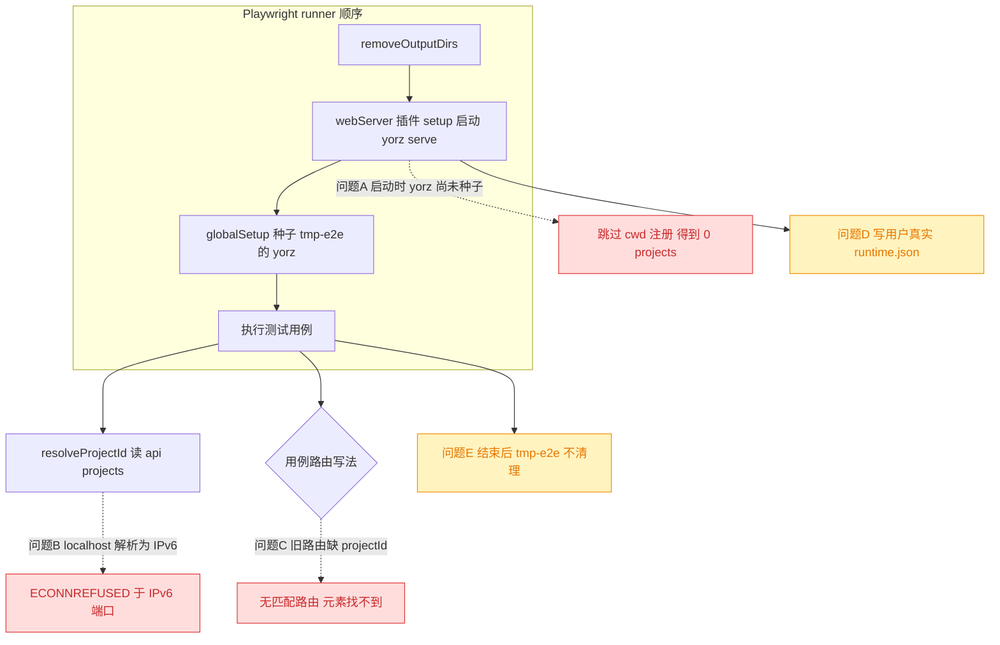
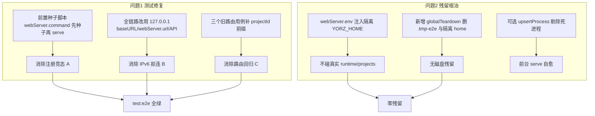
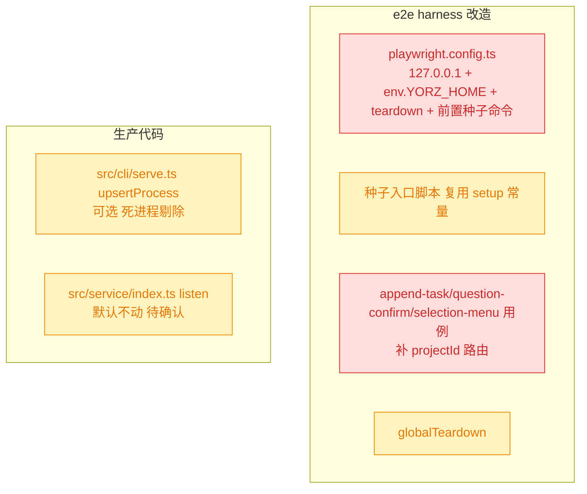

# e2e 修复与运行时残留清理

## 1. 背景

`pnpm test:e2e`（Playwright）当前 12 个用例仅 1 个通过；同时每次 e2e 运行后都在磁盘留下 `.tmp-e2e` 项目目录，并向用户真实的 `~/.config/yorz/runtime.json` 追加大量以 17430 端口注册、进程早已退出的死记录，与用户真实开发实例（7423 端口）混在一起。

## 2. 需求

1. 修复 e2e 测试错误，使 `pnpm test:e2e` 全绿。
2. 解决 e2e 运行后的残留：
   - 磁盘上残留的 `.tmp-e2e` 项目目录；
   - 全局 `~/.config/yorz/runtime.json` 中累积的大量死进程记录。

## 3. 现状分析

### 3.1 e2e 运行链路与故障定位

Playwright 的任务顺序（已在 `node_modules/playwright/lib/runner/tasks.js` 的 `createGlobalSetupTasks` 中确认）是：**先跑 `webServer` 插件 setup（启动 `yorz serve`），再跑 `globalSetups`（种子 `.tmp-e2e`）**。这个先后关系是「进程注册竞态」的直接成因。

### 3.2 五个确诊问题

- **问题 A｜进程注册竞态（测试失败）**：`serve` 仅在启动时 `existsSync(cwd/.yorz)` 为真才注册 cwd 项目；但 webServer 先于 globalSetup，干净环境下启动时 `.tmp-e2e/.yorz` 尚未种子 → 注册被跳过 → 服务日志 `(0 projects)` → `resolveProjectId` 拿到空数组，`arr[0]!` 抛错。
- **问题 B｜`localhost`→IPv6 拒连（测试失败）**：服务以 `hostname: '0.0.0.0'` 仅监听 IPv4；`baseURL`/`webServer.url` 与用例内 `request.get('/api/projects')` 均走 `localhost`，在本机被解析为 `::1` 时直接 `ECONNREFUSED ::1:17430`。已本地复现：`curl http://[::1]:PORT` 拒连、`curl http://127.0.0.1:PORT` 返回 200。
- **问题 C｜多项目路由回归（测试失败）**：`append-task` / `question-confirm` / `selection-menu` 三个用例仍用旧路由 `/specs/${ID}`，多项目化（260624）后正确路由是 `/${projectId}/specs/${ID}`，旧路由无匹配 → 页面元素找不到 / `ERR_CONNECTION_REFUSED`。
- **问题 D｜污染全局 runtime.json（残留）**：e2e 的 `serve` 未隔离 `YORZ_HOME`，直接读写用户真实 `~/.config/yorz/{runtime,projects}.json`；每次运行向 runtime.json 追加 17430 记录，Playwright 常以 SIGKILL 收尾使前台 `serve` 的 SIGTERM 清理来不及执行 → 死记录累积。
- **问题 E｜`.tmp-e2e` 目录残留（残留）**：`playwright.config.ts` 无 `globalTeardown`；`globalSetup` 仅在下次运行开头 `rmSync` 旧目录，本次运行结束不清理 → 目录长期驻留（已 `.gitignore`，纯本地磁盘垃圾）。

精确层：关键代码位与证据

- 顺序：`node_modules/playwright/lib/runner/tasks.js` `createGlobalSetupTasks` → `createPluginSetupTasks`（webServer）先于 `config.globalSetups`。
- 注册门槛：`src/service/index.ts:38` `if (!opts.noRegisterCwd && existsSync(join(cwd, '.yorz'))) registry.add(cwd)`。
- IPv4 绑定：`src/service/index.ts:91` `serve({ fetch, port: tryPort, hostname: '0.0.0.0' })`。
- 全局路径解析（受 `YORZ_HOME` 覆盖）：`src/service/global-config.ts:31` `resolveGlobalConfigDir`；`src/cli/serve.ts:237` `runtimePath()`。
- 前台 serve 注册/清理：`src/cli/serve.ts:65` `upsertProcess`（写入不剔除死进程）、`:73-84` SIGINT/SIGTERM `shutdown` → `removeRuntimeForPid`；死进程剔除只在 `:289` `readLiveProcesses`（下次 serve 启动时）发生。
- 配置：`playwright.config.ts` `E2E_PORT=17430`、`E2E_CWD=resolve(__dirname,'.tmp-e2e')`、`baseURL: http://localhost:...`、`webServer.command = node dist/cli/index.js serve --foreground --port 17430 --cwd <E2E_CWD>`、无 `globalTeardown`、无 `webServer.env`。
- 种子逻辑：`src/gui/src/__e2e__/fixtures/setup.ts` `seed()`（`rmSync(E2E_CWD)` + 写 5 个 spec 种子），`globalSetup` 调用之。
- 旧路由用例：`append-task.spec.ts:6/33/44`、`question-confirm.spec.ts:6/38`、`selection-menu.spec.ts:6` 均 `page.goto('/specs/${ID}')`；正确写法见 `scroll-preserve.spec.ts:39-40`、`spec-task-list.spec.ts:15-16`（`resolveProjectId` + `/${pid}/specs/...`）。
- 复现记录：隔离 `YORZ_HOME` 干净跑得 `(0 projects)` 且 `projects.json` 未生成；带残留跑得 `(1 project)` 但多用例 `ECONNREFUSED ::1:17430`；手动 `serve` + `rmSync`+重建 cwd 未导致服务崩溃（排除「删监视目录崩溃」假设）。

## 4. 技术实现方案

围绕「让 e2e harness 自洽且完全隔离」展开，分测试修复与残留根治两组。

### 4.1 消除注册竞态（问题 A）

把种子从「globalSetup（晚于 webServer）」提前到「webServer 启动之前」。方案：将 `setup.ts` 的纯种子逻辑抽为可被命令行直接执行的入口（plain-JS/可编译脚本或 `node --import tsx` 方式复用 TS 常量），并把 `webServer.command` 改为「先执行种子，再 `yorz serve`」的链式命令，使 `serve` 启动时 `.tmp-e2e/.yorz` 必已存在 → 正常注册 cwd。`globalSetup` 保留为二次幂等种子亦可（供 driveWrites 的初始态），但注册不再依赖它。

> 决策说明：不采用「globalSetup 内起服务后再调 API 注册项目」——当前无公开的 add-project HTTP 端点，且会把注册时机与服务就绪耦合；命令级前置种子最小且确定。

### 4.2 全链路强制 IPv4（问题 B）

将 `playwright.config.ts` 的 `baseURL` 与 `webServer.url` 由 `http://localhost:...` 改为 `http://127.0.0.1:...`；用例内 `request.get('/api/projects')` 依赖 `baseURL` 相对路径，随之走 IPv4。服务端 `hostname:'0.0.0.0'` 保持不变（e2e 侧最小改动即可闭环）。

> 决策说明：是否让**产品服务**同时监听 IPv6（`::`）以根治真实用户 `localhost`→`::1` 的潜在拒连，属于生产网络行为变更，列入待确认项由用户抉择；本方案默认仅改 e2e。
>
> 决策记录：待确认项 5.1「是否顺带让产品服务监听 IPv6」—— 用户抉择「仅改 e2e 用 `127.0.0.1`，产品服务 `hostname` 保持 `0.0.0.0` 不动」，故本 spec 不改动产品服务监听行为。

### 4.3 修正多项目路由（问题 C）

`append-task` / `question-confirm` / `selection-menu` 三个用例统一改用 `resolveProjectId(request)` 取真实 projectId 后跳 `/${pid}/specs/${ID}`（对齐 `scroll-preserve` / `spec-task-list` 现有正确写法），并把 `test` 签名补上 `request` fixture。

### 4.4 隔离 YORZ_HOME 根治污染（问题 D）

在 `playwright.config.ts` 的 `webServer.env` 注入独立 `YORZ_HOME`（指向 `.tmp-e2e/.yorz-home` 或独立临时目录），使 e2e 的 `serve` 只读写隔离目录下的 `runtime.json`/`projects.json`，**完全不触碰**用户真实 `~/.config/yorz`。前置种子脚本与需要读配置的用例（如有）共用同一 `YORZ_HOME`。

### 4.5 新增 globalTeardown 清理残留（问题 E）

新增 `globalTeardown`，在整轮结束后 `rmSync(E2E_CWD)` 并删除隔离 `YORZ_HOME`，杜绝 `.tmp-e2e` 目录与隔离运行时残留。

### 4.6 （已否决）前台 serve 死进程自愈（加固问题 D）

> 决策记录：待确认项 5.2「是否在本次一并加固前台 serve 的 runtime.json 死进程剔除」—— 用户「否决·弃目标·废弃当前目标，继续其余」，理由：已存在污染由用户手动清除。故本 spec **不改动** `src/cli/serve.ts`；e2e 隔离 `YORZ_HOME`（4.4）已足以避免继续污染，用户存量污染将在下次 `yorz serve` 启动时经既有 `readLiveProcesses` 自动清除。

### 4.7 影响面（改造后组成结构）

精确层：拟改动文件清单

- `playwright.config.ts`：`baseURL`/`webServer.url` 改 `127.0.0.1`；新增 `webServer.env.YORZ_HOME`；`webServer.command` 前置种子；新增 `globalTeardown`。
- 新增种子入口（如 `src/gui/src/__e2e__/fixtures/seed-cli.mjs` 或等价可执行），复用/抽取 `setup.ts` 中 `E2E_CWD`、`SEED_SPEC` 等常量与 `seed()`。
- 新增 `src/gui/src/__e2e__/fixtures/teardown.ts`（`globalTeardown`）。
- `src/gui/src/__e2e__/append-task.spec.ts`、`question-confirm.spec.ts`、`selection-menu.spec.ts`：改 `resolveProjectId` + `/${pid}/specs/${ID}` 路由，补 `request` fixture。
- （可选）`src/cli/serve.ts`：`upsertProcess` 剔除死进程。

## 5. 待确认项

_暂无_

## 6. 任务清单

- [x] 抽取可命令行执行的种子入口脚本，复用 setup.ts 的 E2E_CWD/SEED 常量与 seed() 逻辑（验收：命令行直接执行后 .tmp-e2e/.yorz 与 5 个 spec 种子生成）
- [x] playwright.config.ts 的 webServer.command 前置种子命令，使 serve 启动前 .tmp-e2e/.yorz 已存在（验收：serve 日志显示注册 cwd 项目，非 0 projects）
- [x] playwright.config.ts 的 baseURL 与 webServer.url 改为 http://127.0.0.1:17430（验收：grep 该文件无 localhost 残留）
- [x] playwright.config.ts 的 webServer.env 注入隔离 YORZ_HOME（指向 .tmp-e2e 下独立目录）（验收：e2e 运行不写用户真实 ~/.config/yorz/runtime.json）
- [x] 新增 src/gui/src/**e2e**/fixtures/teardown.ts 作为 globalTeardown，删除 .tmp-e2e 与隔离 YORZ_HOME 并在 config 中挂载（验收：整轮结束后两目录不残留）
- [x] append-task.spec.ts / question-confirm.spec.ts / selection-menu.spec.ts 改用 resolveProjectId + /${pid}/specs/${ID} 路由并补 request fixture（验收：三用例 goto 命中正确路由）
- [x] 修复 execute 期间新发现的三个测试侧缺陷：i18n 默认 en 导致中文断言不匹配（config 注入 locale=zh-CN）、追加/批注章节自动编号导致 `## 追加任务` 断言过严（改正则）、question-confirm 两用例共享同一 spec 导致状态污染（新增独立种子 QUESTIONS_FREEFORM_SPEC_ID）（验收：三用例转绿）
- [x] 运行 pnpm test:e2e 验证全绿（验收：12 个用例全部通过）

## 7. 执行记录

- 新增 `src/gui/src/__e2e__/fixtures/seed.mjs`（无依赖纯 JS 种子入口，可 `node seed.mjs` 直接执行），把原 `setup.ts` 的常量/`seed()` 迁入；`setup.ts` 改为 re-export + globalSetup 二次幂等种子。消除问题 A 注册竞态。
- `playwright.config.ts`：`baseURL`/`webServer.url` 改 `127.0.0.1`（问题 B）；`webServer.command` 前置 `node <seed.mjs> &&`（问题 A）；`webServer.env.YORZ_HOME` 指向 `.tmp-e2e-home`（问题 D 隔离）；新增 `globalTeardown`（问题 E）；追加 `use.locale='zh-CN'`（见下）。
- 新增 `src/gui/src/__e2e__/fixtures/teardown.ts`：整轮结束 `rmSync` `.tmp-e2e` 与 `.tmp-e2e-home`。
- 三个旧路由用例（append-task/question-confirm/selection-menu）改用本地 `resolveProjectId(request)` + `/${pid}/specs/${ID}`，并把 `/api/specs/...` 直连改为 `/api/projects/${pid}/specs/...`、`waitForResponse` 匹配放宽为 `/specs/${ID}/...` 子串（问题 C）。
- `.gitignore` 追加 `.tmp-e2e-home`。
- execute 期间新发现并修复的测试侧缺陷（均属需求 1「修 e2e」范围，非产品回归，故未重开 plan）：
  - i18n 由 `navigator` 探测语言，Chromium 默认 en-US → 中文按钮断言（批注/发送）不匹配 → 在 config 注入 `locale: 'zh-CN'`。
  - 追加/答复会触发章节自动编号，`## 追加任务`/`## 用户批注` 实为 `## 3. …` → 断言改为正则 `/##\s+\d+\.\s+…/`。
  - question-confirm 两用例共享 `QUESTIONS_SPEC_ID`，而「提交答复即 runAgent 隐藏面板」是正确产品行为 → 为自由批注用例新增独立种子 `QUESTIONS_FREEFORM_SPEC_ID`（产品代码零改动）。
- 验证：`pnpm run build` 通过；`pnpm test:e2e` **12/12 全绿**（15.3s）。teardown 后 `.tmp-e2e`/`.tmp-e2e-home` 均不残留；真实 `~/.config/yorz/runtime.json` 在测试期间未被改动（隔离生效）。存量 17430 死记录按决策 5.2 由用户自行清理。
