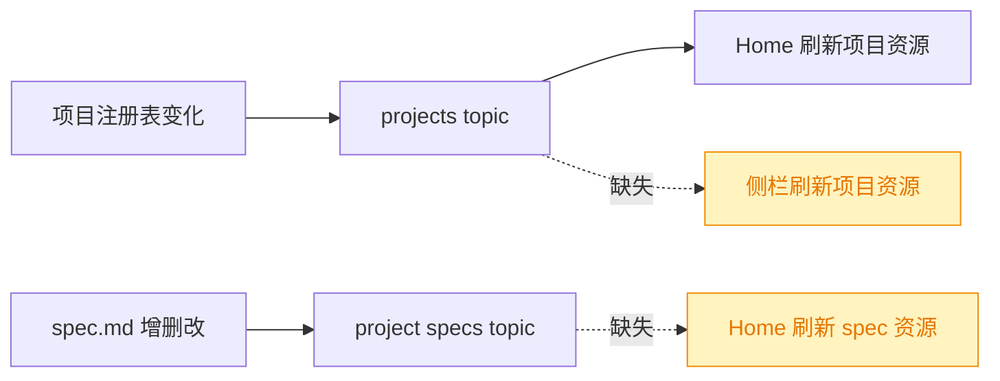
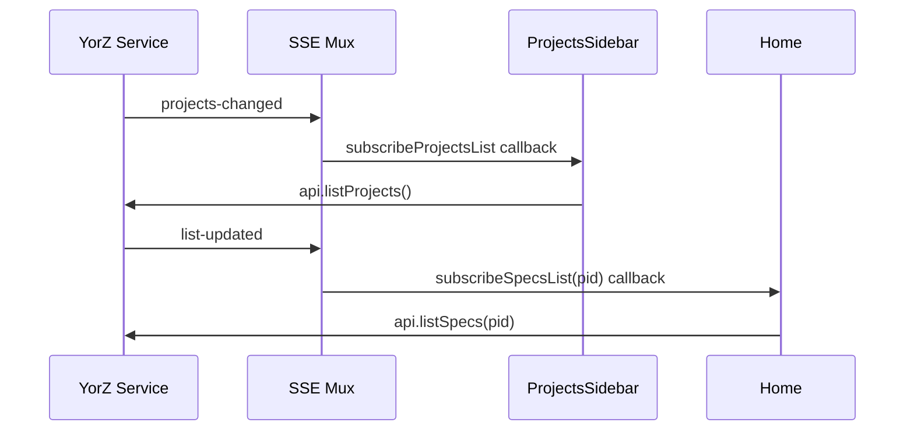
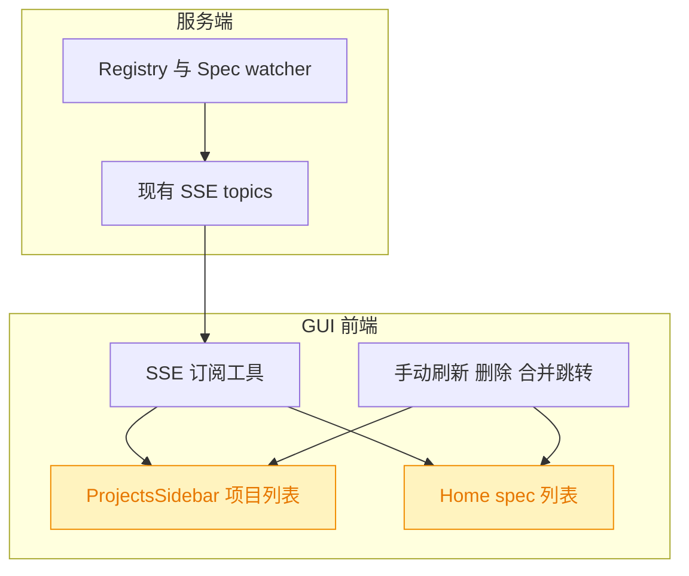

# SSE 列表自动刷新修复

## 1. 背景

GUI 中项目列表和 spec 列表依赖 `createResource` 首次加载与局部操作后的手动 `refetch`。服务端已经提供多路复用 SSE，但部分列表页未订阅对应 topic，导致来自外部进程或 Agent 文件写入的新增数据不会自动反映到界面。

原始需求：

> `@src/gui/src/components/ProjectsSidebar.tsx` `@src/gui/src/pages/Home.tsx`
> 项目列表、spec 列表数据不会动态更新，期望订阅 SSE 变化时自动更新。
>
> - 项目列表更新来源：worktree 新开项目或 yorz add path
> - spec 列表更新来源：用户新增或 Agent 创建 spec 文档

## 2. 需求

修复前端列表数据刷新缺口：

- 项目侧栏在服务端 `projects` topic 推送项目列表变化时自动刷新项目列表。
- Home 页在当前项目的 `project:<pid>:specs` topic 推送 spec 列表变化时自动刷新 spec 列表。
- 保留现有手动刷新、删除后刷新、worktree 合并跳转等行为。

## 3. 现状分析

精确层：相关实现位置

- `src/gui/src/lib/sse.ts` 已提供 `subscribeProjectsList(onChange)` 与 `subscribeSpecsList(pid, onChange)`。
- `src/service/events-hub.ts` 中 `projects` topic 会推送 `projects-changed`，`project:<pid>:specs` topic 会推送 `list-updated`。
- `src/service/watcher.ts` 的 `SpecWatcher.subscribeList()` 会在任一 `spec.md` 更新/移除时通知列表监听者。
- `src/gui/src/pages/Home.tsx` 已订阅 `subscribeProjectsList`，但未订阅 `subscribeSpecsList`。
- `src/gui/src/components/ProjectsSidebar.tsx` 使用 `api.listProjects()` 创建资源，只在手动刷新和删除后调用 `refetch()`。

### 3.1 项目列表刷新链路

服务端已具备项目列表变更广播能力，覆盖 `yorz add path` 和 worktree 新开项目后注册表变化的场景。Home 页目前用该订阅刷新自身的项目资源，并在当前 worktree 的主项目不可达/被删除时处理跳转；侧栏作为全局项目导航也需要同样订阅项目列表变化。

### 3.2 Spec 列表刷新链路

服务端 spec watcher 监听当前项目 specsDir 下的 `spec.md`，并通过 `project:<pid>:specs` topic 广播列表变化。`NewSpec` 页已利用这个事件等待 Agent 创建 spec 后跳转，说明协议和服务端 watcher 可复用。Home 页展示 spec 卡片列表，但只在初始加载、删除后刷新，缺少对当前项目 spec 列表 topic 的订阅。

## 4. 技术实现方案

精确层：改动点

- `src/gui/src/components/ProjectsSidebar.tsx`：引入 `onMount` 和 `subscribeProjectsList`；组件挂载时订阅项目列表变化，回调中调用现有 `refetch()`，清理逻辑复用 Solid 的 `onCleanup`。
- `src/gui/src/pages/Home.tsx`：引入 `subscribeSpecsList`；按当前 `projectId()` 建立 spec 列表订阅，收到 `list-updated` 时调用现有 spec `refetch()`。
- `src/gui/src/pages/Home.tsx`：保留原 `subscribeProjectsList` 逻辑，用于项目资源刷新和当前项目消失时的导航。

### 4.1 前端订阅策略

在需要展示列表的组件本地订阅对应 SSE topic，并把 SSE 回调收敛为已有 resource 的 `refetch()`。这样不改变 API 返回结构、不引入全局 store，也不需要新增服务端事件类型。

### 4.2 生命周期与项目切换

`ProjectsSidebar` 是长驻组件，挂载一次订阅 `projects` topic 即可。`Home` 的 spec 列表订阅需要跟随 `projectId()` 切换：使用 Solid effect 在 `pid` 变化时清理旧订阅并订阅新项目，避免保留旧项目 topic。

### 4.3 兼容性/影响范围

本方案只补齐前端订阅调用，属于受影响但可控的行为修复。服务端 SSE 协议、API contract、i18n 可见文案和路由结构不变。

## 5. 待确认项

_暂无_

## 6. 任务清单

- [x] 在 `src/gui/src/components/ProjectsSidebar.tsx` 订阅项目列表 SSE 并触发 `refetch()`（验收：项目列表 `projects-changed` 到达后会重新请求项目列表）
- [x] 在 `src/gui/src/pages/Home.tsx` 订阅当前项目 spec 列表 SSE 并触发 `refetch()`（验收：当前项目 `list-updated` 到达后会重新请求 spec 列表，项目切换会清理旧订阅）
- [x] 运行格式化、类型检查和相关测试（验收：`pnpm exec prettier --check`、`pnpm run typecheck`、相关测试通过，或记录不可执行原因）

## 7. 执行记录

- 2026-07-19 21:04:12：新建 spec，完成现状分析与技术实现方案；待确认项为空，可继续进入 tasks。
- 2026-07-19 21:04:55：生成任务清单，待确认项为空，按规则进入 execute。
- 2026-07-19 21:06:42：在 `ProjectsSidebar` 挂载时订阅 `projects` topic，收到 `projects-changed` 后调用项目列表 `refetch()`。
- 2026-07-19 21:06:42：在 `Home` 中按当前 `projectId` 订阅 `project:<pid>:specs` topic，收到 `list-updated` 后调用 spec 列表 `refetch()`，项目切换时清理旧订阅。
- 2026-07-19 21:06:42：验证完成：`pnpm exec prettier --check src/gui/src/components/ProjectsSidebar.tsx src/gui/src/pages/Home.tsx .yorz/specs/260719.fix.sse-list-refresh/spec.md` 通过；`pnpm run build:gui` 通过；`pnpm test -- src/service/__tests__/service.test.ts` 通过 36 个测试文件、324 个测试。`pnpm run typecheck` 因既有 `src/gui/src/__e2e__/fixtures/setup.ts` 引用 `./seed.mjs` 缺少声明文件而失败。
- 2026-07-19 21:06:42：待确认项为空，所有非 manual 任务完成，标记 done。
