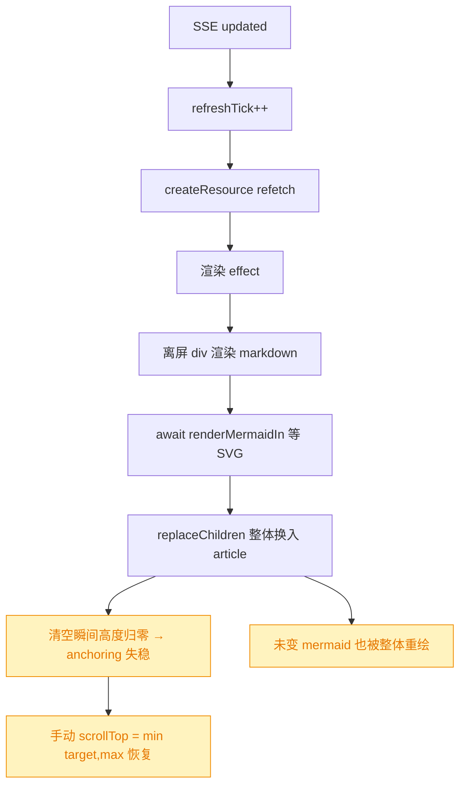
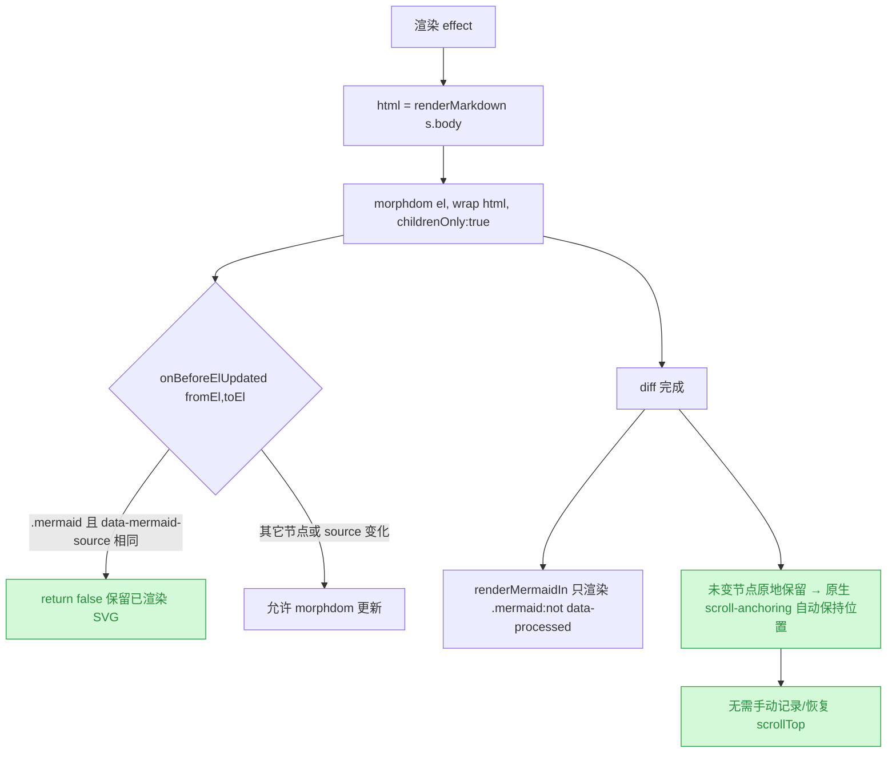
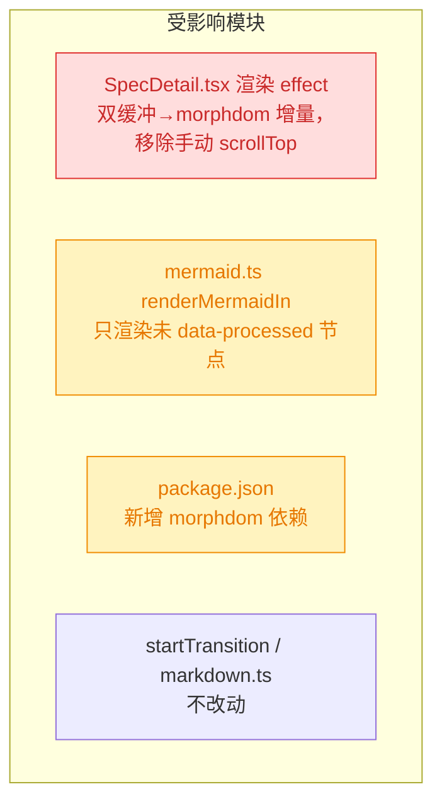

# SpecDetail 正文改为增量 DOM diff（morphdom）原地更新

## 1. 背景

`src/gui/src/pages/SpecDetail.tsx` 的正文经 SSE 实时刷新（Agent 改写 `spec.md` → FS Watcher → SSE `updated` → `refreshTick++` → `createResource` refetch → 渲染 effect 把 markdown 注入 `<article>`）。

滚动位置保持问题经两轮调试（见 `.yorz/specs/260715.fix.spec-detail-scroll-and-question-panel/debug.md`）：

- **Debug 1**：定位主因为 `<Suspense>` 在 refetch 挂起时 detach/reattach `<article>` 滚动容器致 `scrollTop` 归零；用 `startTransition` 包裹刷新修复。
- **Debug 2**：整体 `innerHTML`/`replaceChildren` + mermaid 异步 raw→SVG 二段渲染引发**闪烁**与 **scroll-anchoring 漂移**；改用**双缓冲**（离屏渲染好含 SVG 的最终 DOM 再一次性换入 + 手动记录/恢复 `scrollTop`）根治。

双缓冲功能正确、已验收，但仍有结构性代价：每次刷新整体替换 DOM、需手动记录/恢复 `scrollTop`、离屏渲染开销、**未变的 mermaid 图也被全量重绘**。用户提出洞察：**若改为增量更新使正文高度不再坍缩回弹，浏览器原生 `scroll-anchoring` 会自动保持视口位置，手动 scrollTop 管理即可去除**。本 spec 据此重构。

## 2. 需求

1. 将正文 SSE 刷新由「整体替换」改为「**增量 DOM diff（morphdom）原地更新**」：只 patch 真正变化的节点，未变节点（含已渲染 mermaid SVG）原地保留。
2. 依赖浏览器原生 `scroll-anchoring` 保持滚动位置，**移除**渲染 effect 中手动记录/恢复 `scrollTop` 的逻辑与双缓冲离屏容器。
3. diff 时按 `data-mermaid-source` **跳过已渲染的 mermaid 节点**：源码未变的图不重绘（消除重绘与高度抖动）；仅对新增/源码变化的图跑 mermaid 渲染。
4. **保留 `startTransition`**：滚动容器归零的主因是 Suspense 在 refetch detach，与 DOM 更新方式无关，去掉会回归 Debug 1 的 bug。
5. 不改变对外行为：mermaid 深浅色主题切换重渲染、markdown/checkbox 渲染、选区/批注等既有能力不回归。

## 3. 现状分析

当前渲染 effect 为「双缓冲」：离屏 `
` 渲染 markdown + `await renderMermaidIn` 等 SVG 就绪 → `replaceChildren` 整体换入可见 `<article>` → 手动 `scrollTop = min(target, max)` 恢复。`replaceChildren` 属「先清空再插入」，清空瞬间高度归零使 `scroll-anchoring` 找不到稳定锚点，故必须手动补；整体替换也使未变 mermaid 一并重绘。

关键点：**整体替换让 `scroll-anchoring` 失效**（所有节点都换新，无稳定锚点）；**增量更新让它生效**（大部分节点不动，浏览器以未变节点为锚保持视口）——这是本次重构可去掉手动 scrollTop 的原理基础。

精确层：涉及文件与关键位置

- `src/gui/src/pages/SpecDetail.tsx`
  - `L121-131` SSE `onUpdated`：`setTimeout(() => void startTransition(() => setRefreshTick(t=>t+1)), SSE_DEBOUNCE_MS)`（**保留**）。
  - `L210-252` 渲染 effect（双缓冲）：`document.createElement('div')` 离屏 → `off.innerHTML = renderMarkdown(...)` → `el.parentElement.appendChild(off)` → `renderMermaidIn(off).then(...)` → `el.replaceChildren(...Array.from(off.childNodes))` → `el.scrollTop = Math.min(target, el.scrollHeight - el.clientHeight)`（**重写为 morphdom 增量**，移除手动 scrollTop 与离屏）。
- `src/gui/src/lib/markdown.ts`
  - `L160-164` mermaid fence 输出 raw 占位：`
${code}
`（无 `data-processed`）。
- `src/gui/src/lib/mermaid.ts`
  - `L18-53` `renderMermaidIn(container)`：`querySelectorAll('.mermaid')` → 对每个 node `node.textContent = source; node.removeAttribute('data-processed')` → `await mermaid.run({nodes})`（注入 SVG，mermaid 内部会置 `data-processed`）；注册 `matchMedia('(prefers-color-scheme: dark)')` change → 重渲染。当前**无条件重渲染所有** `.mermaid`（需改为只处理未 `data-processed` 的）。
- `package.json`：当前无 DOM-diff 依赖（morphdom / nanomorph 均无）。
- 回归测试：`src/gui/src/__e2e__/scroll-preserve.spec.ts`、`scroll-followup.spec.ts`、`spec-task-list.spec.ts`（本次复用验证）。

## 4. 技术实现方案

用 `morphdom` 对可见 `<article>` 做 `childrenOnly` 增量 diff 替代双缓冲整体替换；`onBeforeElUpdated` 钩子按 `data-mermaid-source` 跳过已渲染 mermaid 节点；diff 后仅对未渲染（源码新增/变化）的 mermaid 节点跑 `renderMermaidIn`；移除手动 scrollTop 与离屏容器；保留 `startTransition`。

要点与决策说明：

- **morphdom 集成**：`morphdom(el, \`<article>${html}</article>\`, { childrenOnly: true, onBeforeElUpdated })`。`childrenOnly`只 diff 子节点、保留`<article>` 自身（滚动容器身份不变）。
- **mermaid 跳过**：`onBeforeElUpdated(fromEl, toEl)` 中，`fromEl.classList?.contains('mermaid') && fromEl.getAttribute('data-mermaid-source') === toEl.getAttribute?.('data-mermaid-source')` → `return false`（保留 `fromEl` 的已渲染 SVG，不被 raw 占位覆盖）。源码变化则放行更新为新 raw 占位，随后重渲染。
- **mermaid 渲染范围收窄**：`renderMermaidIn` 改为只处理 `.mermaid:not([data-processed])`（morphdom 更新过的新/变节点为 raw、无 `data-processed`；跳过保留的旧节点仍带 `data-processed`）。深浅色主题切换的 `matchMedia` 重渲染逻辑保留（切换时对全部 `.mermaid` 重跑）。
- **移除手动 scrollTop 与双缓冲**：删除离屏 `div`、`replaceChildren`、`prevTop`/`target`/`Math.min` 恢复；增量更新下浏览器 `scroll-anchoring` 自动保持视口。
- **保留 `startTransition`**：不改 `L121-131`。
- **决策说明（DOM-diff 选型）**：采用成熟库 `morphdom`（决策：无需自造 diff、社区验证充分、体积小、API 契合 innerHTML 场景；被否决备选：自写最小 diff——正确处理跳过/key/属性合并的成本高且易错；`nanomorph`——需 key 且对手写 innerHTML 兼容性差）。引入运行时依赖有代价，作为待确认项 5.1 知会。
- **决策说明（不保留双缓冲 fallback）**：morphdom 成熟稳定，无需保留旧双缓冲路径作降级，避免双实现维护负担。

> 决策记录：引入运行时依赖 morphdom —— 用户确认，按此推进。

### 4.1 兼容性与影响范围

- 核心改动在 `SpecDetail.tsx` 渲染 effect（🔴 行为重写）；`mermaid.ts` 渲染范围收窄、`package.json` 加依赖（🟡 受影响）；`startTransition`、`markdown.ts` mermaid 输出格式不改。
- 验证复用现有 e2e：`scroll-preserve`（保持不归顶/不漂移）、`scroll-followup`（跟随刷新间新位置）、`spec-task-list`（markdown 渲染不回归）；新增用例覆盖「源码未变的 mermaid 在刷新后 SVG 节点原地保留（未重绘）」。

## 5. 待确认项

_暂无_

## 6. 任务清单

- [x] 在 package.json 的 dependencies 添加 morphdom 并安装（验收：`node_modules/morphdom` 存在、pnpm-lock.yaml 含 morphdom 条目）
- [x] 重写 src/gui/src/pages/SpecDetail.tsx 渲染 effect 为 morphdom `childrenOnly` 增量 diff，移除双缓冲离屏 div、replaceChildren 与手动 scrollTop 记录/恢复（验收：effect 内无 off/replaceChildren/Math.min scrollTop 残留）
- [x] 在 morphdom `onBeforeElUpdated(fromEl,toEl)` 钩子按 `data-mermaid-source` 跳过已渲染 mermaid 节点，源码相同 return false（验收：source 相同的 .mermaid 节点不被覆盖）
- [x] 收窄 src/gui/src/lib/mermaid.ts 的 renderMermaidIn，只处理 `.mermaid:not([data-processed])`，保留 matchMedia 主题切换全量重渲染（验收：切主题时对全部 .mermaid 重跑）
- [x] 在 src/gui/src/**e2e** 新增用例：源码未变的 mermaid 刷新后 SVG 节点原地保留未重绘（验收：同一 svg 元素跨刷新仍为同一节点）
- [x] 运行 typecheck 与 build 验证无回归（验收：`pnpm typecheck` 与 `pnpm build:gui` 通过）

## 7. 执行记录

- 引入依赖：`pnpm add morphdom` → morphdom@2.7.8 写入 package.json dependencies 与 pnpm-lock.yaml，`node_modules/morphdom` 已存在。
- 重写 SpecDetail.tsx 渲染 effect：`import morphdom`，改为 `morphdom(el, \`<article>${html}</article>\`, { childrenOnly: true, onBeforeElUpdated })`增量 diff；删除离屏`off` div、`getComputedStyle` 宽度计算、`replaceChildren`与`el.scrollTop = Math.min(...)` 手动恢复；`renderMermaidIn(el)` 直接作用于可见 article，cleanup 逻辑保留；`startTransition`（L121-131）未改动。
- mermaid 跳过：`onBeforeElUpdated(fromEl, toEl)` 中当 `fromEl` 为 `.mermaid` 且 `data-mermaid-source` 与 toEl 相同时 `return false`，保留已渲染 SVG。
- 收窄 mermaid.ts：`render(nodes)` 参数化；初始只处理 `.mermaid:not([data-processed])`；`matchMedia` change 时 `rerenderAll` 实时 query 全部 `.mermaid` 全量重渲；容器无任何 `.mermaid` 时返回 no-op。
- 新增 e2e `mermaid-preserve.spec.ts`：给已渲染 SVG 打 `data-e2e-preserve` 标记，驱动 6 轮源码不变的写入刷新后同一 SVG 节点仍在，证实未重绘。
- 修复共享测试助手：`scroll-preserve/scroll-followup/spec-task-list/mermaid-preserve` 的 `resolveProjectId` 由 `arr[0]` 改为按 name `.tmp-e2e` 精确选中（多注册项目环境下 arr[0] 会取错项目，导致既有 scroll 测试无法运行）。
- 验证：`pnpm typecheck`（tsc -b）通过；`pnpm build:gui`（vite build）通过；`pnpm test:e2e scroll-preserve scroll-followup spec-task-list mermaid-preserve` 6/6 通过——滚动保持、刷新跟随、task list 渲染、未变 mermaid 原地保留均无回归。
- 收尾：全部任务完成，无待确认项/批注/追加任务，标记 done。
