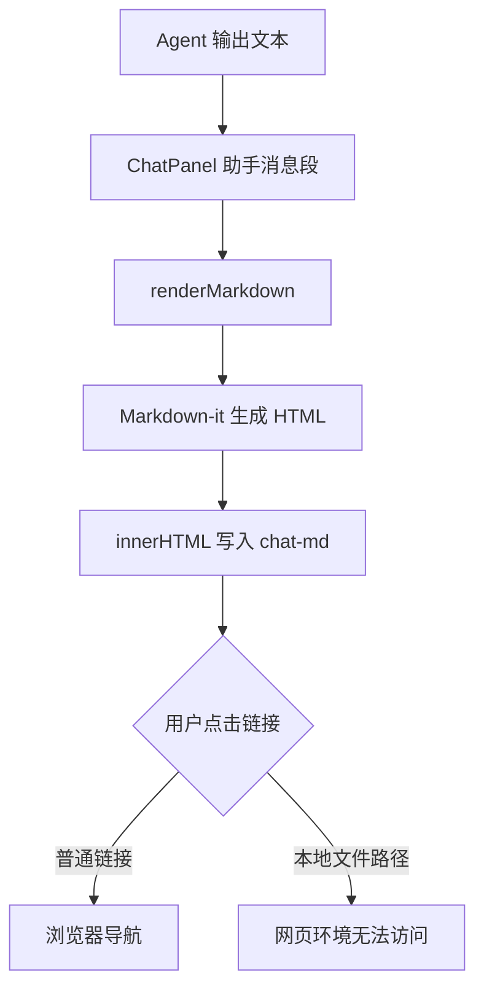
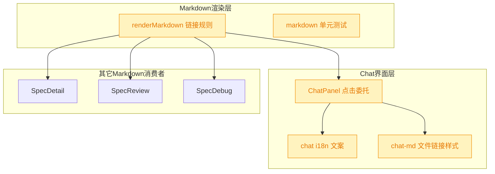
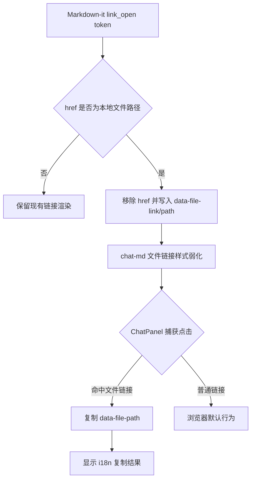
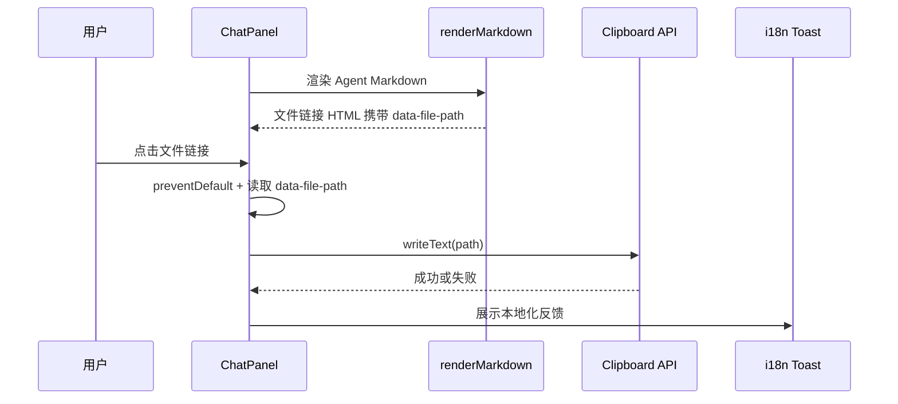

# Chat 文件链接复制

## 1. 背景

ChatPanel 使用 Markdown-it 渲染 Agent 输出消息。Agent 回复中经常包含本地文件路径格式的 Markdown 链接，例如 `[ChatPanel.tsx](/Users/fenghen/my-space/YorZ/src/gui/src/components/ChatPanel.tsx:158)`。当前 GUI 运行在网页环境中，这类链接会被渲染为普通 `<a href="...">`，点击后浏览器尝试导航到不可访问的本地路径，既无效，也容易让用户误以为它是可打开的网页链接。

原始需求期望：

- 禁用文件类型超链接的跳转。
- 点击文件类型超链接时复制文件路径。
- 样式可稍作调整，避免被误解为有效超链接。
- 展示给用户的文字必须使用 `src/gui/src/i18n/` 国际化配置。

## 2. 需求

- 在 ChatPanel 的 Agent Markdown 输出中识别本地文件路径链接，包含绝对路径链接与可选行号后缀。
- 文件链接不再触发浏览器跳转，不保留有效 `href` 导航行为。
- 用户点击文件链接时复制对应文件路径；若链接包含行号，复制值应保留行号后缀，符合 Agent 输出的可定位语义。
- 文件链接视觉上应区别于普通外部链接，弱化下划线/主色链接感，体现“可复制路径”而不是“可导航链接”。
- 新增或调整面向用户的提示文案时，必须写入 `src/gui/src/i18n/zh-CN.ts` 与 `src/gui/src/i18n/en.ts`。
- 保持普通 HTTP(S)、hash、attachments 等现有 Markdown 链接行为不变。

## 3. 现状分析

当前渲染链路集中在共享 Markdown 渲染函数中：ChatPanel 对 assistant 文本段调用 `renderMarkdown(..., { mermaid: 'code' })` 后通过 `innerHTML` 注入 `.markdown.chat-md` 容器。`renderMarkdown` 内部已有 `link_open` 规则，用于重写 spec 附件链接并给附件链接补 `target="_blank"` / `rel`。这说明“根据 href 类型调整链接输出”已经是本项目接受的 Markdown 渲染层职责。

现状精确层

- `src/gui/src/components/ChatPanel.tsx`：assistant 文本段使用 `renderMarkdown((seg as { text: string }).text, { mermaid: 'code' })` 渲染。
- `src/gui/src/lib/markdown.ts`：Markdown-it 实例开启 `linkify`，并通过 `md.renderer.rules.link_open` 处理附件链接。
- `src/gui/src/app.css`：`.markdown a` 统一应用 primary 色与 underline；`.chat-md` 只缩小排版节奏，未对链接类型做区分。
- `src/gui/src/lib/__tests__/markdown.test.ts`：已有 attachment rewrite、task list、HTML 白名单和 mermaid mode 的单测，适合补充文件链接渲染测试。
- `src/gui/src/i18n/zh-CN.ts` / `src/gui/src/i18n/en.ts`：ChatPanel 已使用 `t()`，新增用户可见提示/复制反馈应放入 `chat` 命名空间。

影响面集中在 GUI Markdown 渲染与 ChatPanel 点击处理：

## 4. 技术实现方案

方案采用“渲染时标记文件链接 + ChatPanel 事件委托复制”的组合，不在 Markdown 源文本上做字符串替换。

技术决策：

- 在 `src/gui/src/lib/markdown.ts` 增加文件链接识别逻辑，覆盖 macOS/Linux 绝对路径与 Windows 盘符绝对路径；链接目标形如 `/Users/.../file.ts:158`、`/path/to/file.tsx`、`C:\repo\file.ts:10` 时视为文件路径。`https://`、`http://`、`#anchor`、`attachments/...`、普通相对路径继续走现有逻辑。
- 对文件链接的 HTML 输出不保留 `href`，改写为 `role="button"`、`tabindex="0"`、`data-file-link="true"`、`data-file-path="<原始 href>"`，并补充 `title`。这样可以从源头阻断浏览器导航，同时保留键盘可聚焦语义。
- 在 `ChatPanel.tsx` 的消息滚动容器上增加点击与键盘事件委托：当事件目标向上匹配到 `[data-file-link="true"]` 时，阻止默认行为并调用 Clipboard API 复制 `data-file-path`。成功/失败反馈使用 `toast` 与 `t('chat.filePathCopied')` / `t('chat.filePathCopyFailed')`。
- 在 `src/gui/src/app.css` 为 `.chat-md [data-file-link='true']` 添加更接近 inline code / chip 的视觉样式：使用 muted 背景、monospace、细边框、无下划线、`cursor: copy`，降低普通超链接误导。
- 在 `src/gui/src/lib/__tests__/markdown.test.ts` 增加单测，验证文件链接会被标记且不含有效 `href`，普通 URL 与 attachment rewrite 不受影响。ChatPanel DOM 交互可在需要时追加组件级测试；本次最低验收以 Markdown 输出单测、typecheck 和现有测试通过为准。

实现精确层

- 建议新增函数：`isFileHref(href: string): boolean`，优先排除 URL scheme、协议相对 URL、hash、attachments 和普通相对路径，再识别绝对文件路径。
- 建议新增函数：`markAsFileLink(token, href)`，负责安全写入 `data-file-path` 并移除/替换 `href`、`target`、`rel`。
- ChatPanel 复制逻辑应使用事件委托，避免对 `innerHTML` 产物逐节点绑定监听。
- Clipboard fallback：`navigator.clipboard?.writeText` 不可用或失败时，记录失败并展示 i18n 错误提示；不引入 `document.execCommand` 旧 fallback，避免复杂度扩大。

改造后的交互关系：

## 5. 待确认项

_暂无_

## 6. 任务清单

- [x] 更新 `src/gui/src/lib/markdown.ts` 的链接渲染规则，识别本地文件路径链接并输出不可导航的复制标记（验收：文件链接 HTML 无有效 `href` 且包含 `data-file-path`）
- [x] 更新 ChatPanel 文件链接点击/键盘复制交互与 i18n 文案（验收：点击或 Enter/Space 触发 Clipboard API，成功/失败提示来自 `src/gui/src/i18n/`）
- [x] 更新 `.chat-md` 文件链接视觉样式，弱化普通超链接感（验收：文件链接使用 `cursor: copy`、非下划线、muted/chip 风格样式）
- [x] 补充 Markdown 渲染单测并运行验证命令（验收：相关 vitest、typecheck 或可用替代命令通过并记录结果）

## 7. 执行记录

- 2026-07-22 21:39:15：新建 spec 并完成 plan 阶段分析，当前无待确认项。
- 2026-07-22 21:40:23：待确认项为空，已按技术方案拆解任务并进入 execute 阶段。
- 2026-07-22 21:43:39：完成 Markdown 文件链接复制模式：ChatPanel 启用 `fileLinks: 'copy'`，本地文件链接输出 `data-file-path` 且不再保留导航 `href`。
- 2026-07-22 21:43:39：完成 ChatPanel 点击与 Enter/Space 键盘复制交互，复制结果通过 `chat.filePathCopied` / `chat.filePathCopyFailed` 本地化 toast 展示。
- 2026-07-22 21:43:39：完成 `.chat-md [data-file-link='true']` 样式调整，文件路径显示为 muted/chip 风格并使用 `cursor: copy`。
- 2026-07-22 21:43:39：补充 `renderMarkdown local file links` 单测，验证文件路径复制标记、默认行为、Windows 路径、普通 app 路由和附件链接兼容性。
- 2026-07-22 21:43:39：验证通过：`pnpm vitest run src/gui/src/lib/__tests__/markdown.test.ts`、`pnpm tsc -b`、`pnpm test`、`pnpm run build:gui`。`build:gui` 仅输出 Vite chunk size warning。
- 2026-07-22 21:43:39：任务全部完成，待确认项为空，标记 done。
