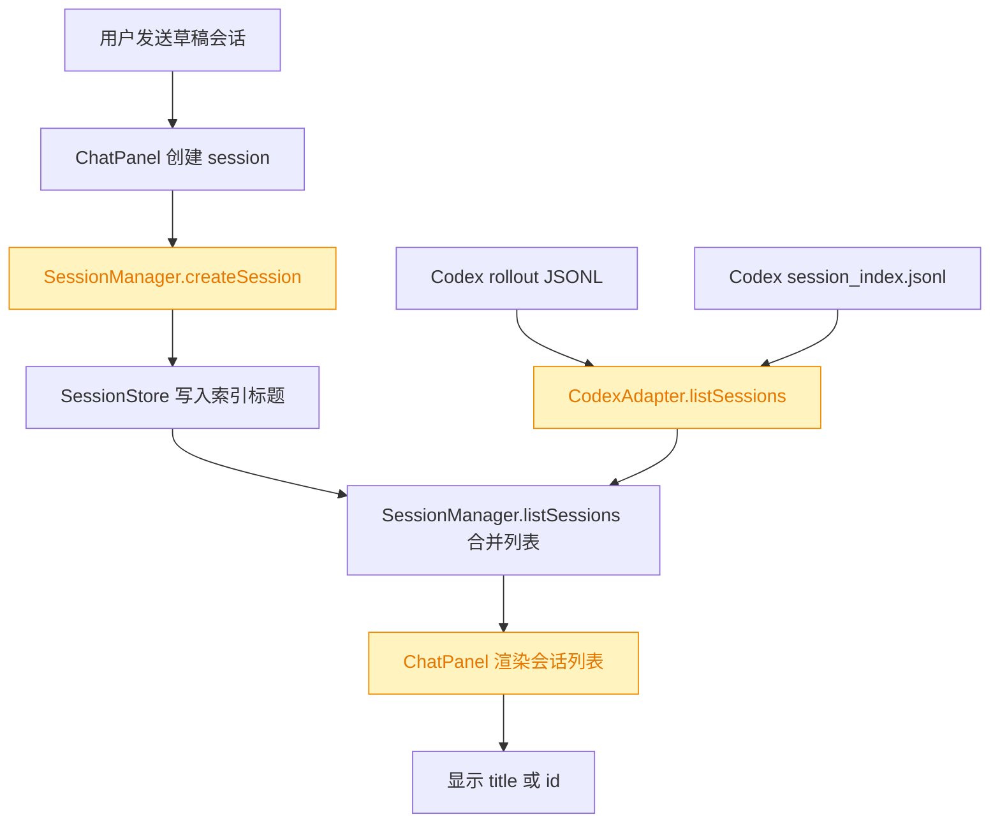
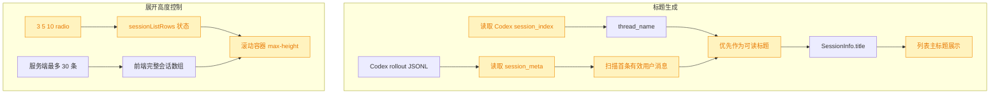

# Chat Session List

## 1. 背景

用户指定类型为 `feat`，目标文件为 `@src/gui/src/components/ChatPanel.tsx`。

原始需求：

> 会话（session）列表改进：
>
> 1. 会话列表名称有很多项都是 UUID，少数是总结型名称字符串，请分析原因，期望是可读的总结性字符串
> 2. 会话 header 右侧 checkbox（显示历史）改为3个 radio（3条、5条、10条）选项用于控制显示会输条数，默认 3条

## 2. 需求

会话列表标题应优先展示可读的总结性字符串，避免大量 UUID 直接暴露在列表主标题中。

会话列表 header 右侧原有“显示历史” checkbox 改为 3 个互斥 radio 选项：3 条、5 条、10 条，用于控制列表展示的会话条数，默认展示 3 条。

展示给用户的新增文字必须走 `@src/gui/src/i18n/` 国际化配置。

## 3. 现状分析

当前会话列表存在两条数据来源：项目内 `.yorz/tmp/sessions/index.json` 的索引，以及各 Agent adapter 枚举到的原生历史。`SessionManager.listSessions()` 会把两者按 id 合并，再按 `updatedAt` 排序并截断。

UUID 标题的主要原因在后端而不是单纯 UI：`SessionManager.createSession()` 在前端未传 title 时把 `sessionId` 作为 title 写入索引；Codex adapter 的 `readMeta()` 读取 `session_meta` 后也固定返回 `title: id`。因此 Codex 原生历史和普通 Chat 草稿会话都容易以 UUID 作为标题。少数总结型字符串来自其它 adapter 的原生 title/summary 能力，或由特定调用路径传入了 title，例如 per-spec session 使用 specId 作为标题。

当前 `ChatPanel.tsx` 使用 `showHistory` 布尔状态和 `SHOW_HISTORY_KEY` 本地持久化，checkbox 开启后按最近一周 `HISTORY_WINDOW_MS` 扩大展示范围，未开启时只保留运行中或当前选中会话。这个模型与“显示 3/5/10 条”的数量控制不一致。

追加任务复核后发现，上一轮把 3/5/10 理解成“列表展示会话条数”不符合用户补充语义。当前服务端 `SessionManager.listSessions()` 已有 `SESSION_LIST_LIMIT = 30`，这是历史会话返回上限；用户期望仍保留这个数量级。3/5/10 应改为控制会话列表展开后的可视高度档位，超出可视行数的历史会话继续留在滚动容器内。

追加任务中“使用 shadcn radio 组件”的落点在本项目对应 `src/gui/src/components/ui/radio-group.tsx`，该组件基于 `@kobalte/core/radio-group` 封装，属于当前 Solid 技术栈下的 shadcn 风格 UI 组件。上一轮 `ChatPanel` 已使用该封装，但需要补齐 `RadioGroupItemInput`，并把 aria-label / 文案语义从“显示条数”调整为“列表高度/可视行数”。

Codex CLI `/resume` 能显示实际名称的原因不在 rollout 的 `session_meta` 内。实测本机 `~/.codex/session_index.jsonl` 存在 `thread_name` 字段，`codex resume --help` 也明确支持按 session name 恢复；而 `@openai/codex-sdk` 的公开类型只暴露 `startThread()` / `resumeThread(id)`，运行时通过 `codex resume <threadId>` 续接，未提供会话名称 API。当前 `CodexAdapter.readMeta()` 只扫 rollout JSONL，因此拿不到 `/resume` 使用的 `thread_name`，只能从首条真实用户消息临时摘要，导致 SDK 创建的新会话仍可能显示“未命名会话”或质量较低的摘要。

关键定位

- `src/service/session-manager.ts:66` `createSession()` 接收可选 title；`src/service/session-manager.ts:78` 在 title 缺省时写入 `title ?? sessionId`。
- `src/service/agent-sdk/codex-adapter.ts:208` `readMeta()` 只读取 `session_meta`；`src/service/agent-sdk/codex-adapter.ts:241` 返回 `title: id`。
- `src/gui/src/components/ChatPanel.tsx:48` 当前 localStorage key 是 `yorz.chat.sessionList.showHistory`。
- `src/gui/src/components/ChatPanel.tsx:143` 当前状态是 `showHistory` boolean。
- `src/gui/src/components/ChatPanel.tsx:262` 当前 `visibleSessions` 按运行中、当前选中、最近一周过滤。
- `src/gui/src/components/ChatPanel.tsx:716` header 右侧渲染 checkbox。
- `src/gui/src/components/ChatPanel.tsx:770` 列表主标题展示 `s.title || s.id`。
- `src/service/session-manager.ts:32` 服务端会话合并列表上限是 `SESSION_LIST_LIMIT = 30`。
- `src/gui/src/components/ui/radio-group.tsx` 是当前项目已有的 shadcn 风格 radio 封装。
- `~/.codex/session_index.jsonl` 中可见 `thread_name`；`pnpm exec codex resume --help` 显示 `SESSION_ID` 可传 UUID 或 session name。

## 4. 技术实现方案

后端标题修复：在 `CodexAdapter` 中新增 Codex 会话索引读取逻辑，解析 `~/.codex/session_index.jsonl`，按 id 建立 `thread_name` 映射。`readMeta()` 读取 rollout 后，标题优先级调整为：`session_index.thread_name` → 首条真实用户 message 生成的短标题 → id。这样 `/resume` 已有名称能直接进入 GUI；SDK 创建但尚未写入索引的会话仍可由首条真实 prompt 得到临时可读标题。

首条真实 prompt 摘要仍保留作为兼容兜底：rollout 解析继续跳过 AGENTS、environment、recommended_plugins 等系统上下文文本；从真实用户 prompt 中提取第一段可读内容，清理 markdown、路径引用和过长空白，截断为适合列表展示的短标题。若 `thread_name` 与摘要都无法提取，再兜底 id。

索引标题修复：`SessionManager.createSession()` 对未传 title 的普通 Chat 会话不要直接把 UUID 当 title 写入；使用空标题或短占位写入索引，并在 `listSessions()` 合并原生 adapter 数据时允许更可读的 adapter title 覆盖索引中的 UUID/空标题。这样新会话完成首轮后能从 Codex rollout 回填可读标题，旧的 UUID 索引也能被原生历史纠正。

前端展示兜底：新增 `displaySessionTitle(s)`，当 `s.title` 为空或等于 `s.id` 时不把 UUID 放在主标题里，改用国际化的 untitled 文案作为极端兜底；完整 id 仍保留在 `title` tooltip 或辅助信息中，便于排查。

展开高度控制改造：删除 `showHistory` boolean 语义，新增 `SESSION_LIST_ROWS_KEY` 和 `SessionListRows = 3 | 5 | 10`。默认读取为 3；为兼容旧 localStorage，旧 `showHistory === '1'` 可迁移为 10，否则为 3。前端不再用 3/5/10 截断 `visibleSessions()`，而是渲染服务端返回的完整列表（当前最多 30 条），通过 `sessionListRows()` 计算滚动容器 `max-height` 或等价 class，使展开后的视口高度约等于 3/5/10 行。

UI 改造：移除 `Checkbox` import 与相关组件，使用已有 `@src/gui/src/components/ui/radio-group.tsx` 的 `RadioGroup` / `RadioGroupItem` / `RadioGroupItemInput` / `RadioGroupItemControl` / `RadioGroupItemLabel`。header 右侧展示紧凑 radio 组，选项文字通过 `@src/gui/src/i18n/zh-CN.ts` 与 `@src/gui/src/i18n/en.ts` 新增配置提供，并将 aria-label / tooltip 语义命名为“展开高度”或“可视行数”，避免误导为服务端返回条数。

测试策略：补充后端单元测试覆盖 Codex session index 名称优先级、Codex rollout 标题提取与 `SessionManager.listSessions()` 合并时的可读标题优先级；执行 `pnpm run typecheck` 验证前端类型、i18n key 与后端改动。

影响范围

- `src/service/agent-sdk/codex-adapter.ts`：读取 Codex rollout 元信息并从首条真实用户消息生成标题。
- `~/.codex/session_index.jsonl`：只读使用 Codex CLI 写入的 `thread_name`，不修改。
- `src/service/session-manager.ts`：避免新建普通 Chat 会话把 UUID 固化为 title；合并列表时优先使用可读 title。
- `src/service/__tests__/session-manager.test.ts`：覆盖会话列表 title 合并策略。
- `src/service/agent-sdk` 相关测试：新增或扩展 CodexAdapter 标题提取测试。
- `src/gui/src/components/ChatPanel.tsx`：将 checkbox 改为 radio 高度控制，保留服务端返回的完整会话列表。
- `src/gui/src/i18n/zh-CN.ts`、`src/gui/src/i18n/en.ts`：新增 radio 选项、展开高度语义与 untitled 兜底文案。

## 5. 待确认项

_暂无_

## 6. 任务清单

- [x] 更新 CodexAdapter 的 rollout 标题提取逻辑，从首条真实用户消息生成可读短标题（验收：新增/更新测试覆盖 UUID meta 兜底不再作为可读标题）
- [x] 更新 SessionManager 会话创建与列表合并策略，避免 UUID title 固化并优先采用可读标题（验收：session-manager 单测覆盖索引 UUID 被原生可读标题替换）
- [x] 更新 ChatPanel 会话列表过滤与 header 控件，将历史 checkbox 改为默认 3 条、可选 5/10 条 radio（验收：TypeScript 类型检查通过且 UI 文案走 i18n）
- [x] 更新中英文 i18n 配置，补齐会话数量选项与 untitled 兜底标题（验收：新增 key 在 ChatPanel 中使用，无硬编码展示文案）
- [x] 执行格式化、lint/typecheck 或可用测试并记录结果（验收：相关命令通过，或记录不可执行原因）
- [x] 更新 CodexAdapter 读取 Codex session index 的 thread_name，并优先作为会话标题（验收：codex-adapter 单测覆盖 thread_name 优先于 prompt 摘要）
- [x] 更新 ChatPanel 会话列表控制语义，3/5/10 控制展开可视高度而非截断列表，并补齐 radio item input（验收：服务端返回的 30 条历史仍可在展开列表滚动访问）
- [x] 更新中英文 i18n 配置，将 radio 语义从显示条数改为展开高度或可视行数（验收：ChatPanel 无新增硬编码展示文案）
- [x] 执行格式化、lint/typecheck 或相关测试，追加任务完成后把 `[open]` 标记为 `[fixed]`（验收：相关命令通过且 spec lint 通过）

## 7. 追加任务

- [fixed] [fix] 2026-07-25 15:44:50 | 控制条数 radio 使用 shadcn radio 组件；3/5/10 控制会话框展开高度且仍保留约 30 条历史；Codex 会话标题应解释并复用 CLI /resume 的总结性名称来源。
  描述：1. 控制条数的 radio 应该使用 shadcn radio 组件；2. 控制条数（3 5 10）目的是控制会话框展开后的高度（可以根据实际含义优化文案），期望仍然显示之前的条数（应该是 30）；3. 当前 codex 大量“未命名会话”也不符合期望，期望总结性的名称，codex cli 中 /resume 就能选择实际名称，为什么当前 SDK 创建的会话无法获取总结性名称？引用：3. 现状分析；引用原文：UUID 标题的主要原因在后端而不是单纯 UI：SessionManager.createSession() 在前端未传 title 时把。
- [fixed] [fix] 2026-07-25 16:21:09 | 我在codex CLI中 发送 “hello”，Thread name 显示为“hello”；
  - 描述：我在codex CLI中 发送 “hello”，Thread name 显示为“hello”；
然后在 GUI chat 中发送 “hello”，会话名称显示为“未命名会话”；
仍然未按期望，显示总结性名称字符串

## 8. 执行记录

- 2026-07-25 15:25:23：新建 spec，并完成 plan 阶段的现状分析、技术方案、图形化补充与待确认项自检。
- 2026-07-25 15:26:30：生成任务清单；待确认项为空，按规则进入 execute。
- 2026-07-25 15:29:35：更新 `src/service/agent-sdk/codex-adapter.ts`，从首条真实用户消息提取可读短标题，并新增 `src/service/__tests__/codex-adapter.test.ts` 覆盖 markdown 与附件说明清理。
- 2026-07-25 15:29:35：更新 `src/service/session-manager.ts`，普通 Chat 新会话不再把 UUID 固化为 title，列表合并时用原生可读 title 替换不透明标题；`src/service/__tests__/session-manager.test.ts` 已覆盖。
- 2026-07-25 15:29:35：更新 `src/gui/src/components/ChatPanel.tsx`，将历史 checkbox 替换为 3/5/10 radio，默认 3 条，并为 UUID/空标题提供 i18n untitled 兜底。
- 2026-07-25 15:29:35：更新 `src/gui/src/i18n/zh-CN.ts` 与 `src/gui/src/i18n/en.ts`，补齐新增展示文案。
- 2026-07-25 15:29:35：验证通过：`pnpm vitest run src/service/__tests__/session-manager.test.ts src/service/__tests__/codex-adapter.test.ts`；`pnpm run typecheck`。
- 2026-07-25 15:29:35：任务全部完成，待确认项为空，标记 done。
- 2026-07-25 15:30:29：追加验证通过：`pnpm test`（40 个测试文件，341 个测试通过）。
- 2026-07-25 15:48:37：根据追加任务重开 plan，确认 3/5/10 应控制展开高度而非服务端历史数量，Codex 可读标题应优先读取 `session_index.jsonl.thread_name`；生成追加任务清单并进入 execute。
- 2026-07-25 15:51:33：更新 `src/service/agent-sdk/codex-adapter.ts`，新增只读 `session_index.jsonl` 解析，标题优先使用 `thread_name`，再回退到首条真实用户消息摘要；`src/service/__tests__/codex-adapter.test.ts` 已覆盖。
- 2026-07-25 15:51:33：更新 `src/gui/src/components/ChatPanel.tsx`，使用 shadcn 风格 radio-group 的 `RadioGroupItemInput` / control / label 组合；3/5/10 改为控制展开列表 `max-height`，不再截断服务端返回的 30 条历史。
- 2026-07-25 15:51:33：更新 `src/gui/src/i18n/zh-CN.ts` 与 `src/gui/src/i18n/en.ts`，新增会话列表高度与 3/5/10 行文案。
- 2026-07-25 15:51:33：验证通过：`pnpm vitest run src/service/__tests__/codex-adapter.test.ts src/service/__tests__/session-manager.test.ts`；`pnpm run typecheck`；`pnpm test`（40 个测试文件，342 个测试通过）。
- 2026-07-25 15:51:33：追加任务已标记 `[fixed]`，任务全部完成，待确认项为空，标记 done。
- 2026-07-25 16:37:45：Debug 定位 GUI Chat 首发 `hello` 仍显示“未命名会话”的根因：本地 session 索引标题未在首发 prompt 后同步更新，且 UUID 判断未覆盖 UUIDv7/Codex id 形态；已在 `SessionManager.send()` 中为不透明标题写回 prompt 摘要，并放宽后端与 ChatPanel 的 UUID-like 判断。
- 2026-07-25 16:37:45：新增回归测试覆盖 Codex 无 `session_index.thread_name` 时从 rollout prompt 提取 `hello`、UUIDv7-looking 标题被 native 可读标题覆盖、untitled draft 首发后真实 Codex id 标题为 `hello`；验证通过：`pnpm vitest run src/service/__tests__/codex-adapter.test.ts src/service/__tests__/session-manager.test.ts`、`pnpm run typecheck`、`pnpm test`（40 个测试文件，345 个测试通过）。
- 2026-07-25 16:40:09：补齐标题写回时序修复：`SessionManager.send()` 改为 async，Chat/spec/review 等路由在返回前等待本地标题索引写入完成，避免 GUI 发送后立即刷新列表仍读到“未命名会话”；验证通过：相关 service 路由测试、`pnpm run typecheck`、`pnpm test`（40 个测试文件，345 个测试通过）。
